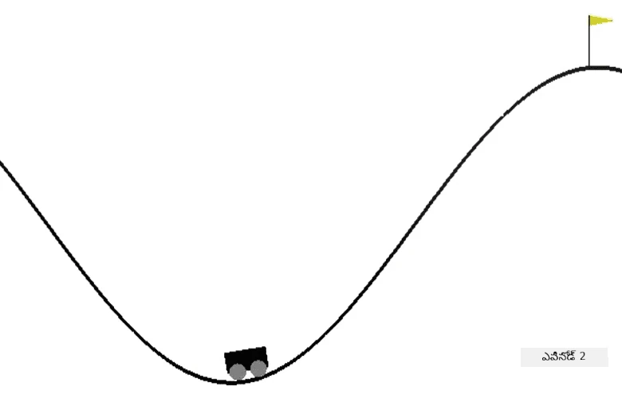

<!--
CO_OP_TRANSLATOR_METADATA:
{
  "original_hash": "1f2b7441745eb52e25745423b247016b",
  "translation_date": "2025-12-19T15:42:12+00:00",
  "source_file": "8-Reinforcement/2-Gym/assignment.md",
  "language_code": "te"
}
-->
# ట్రైన్ మౌంటైన్ కార్

[OpenAI జిమ్](http://gym.openai.com) అన్ని వాతావరణాలు ఒకే API అందించే విధంగా రూపొందించబడింది - అంటే ఒకే విధమైన `reset`, `step` మరియు `render` పద్ధతులు, మరియు **action space** మరియు **observation space** యొక్క ఒకే అభివృద్ధులు. అందువల్ల, తక్కువ కోడ్ మార్పులతో వేర్వేరు వాతావరణాలకు ఒకే రీఇన్ఫోర్స్‌మెంట్ లెర్నింగ్ అల్గోరిథమ్స్ అనుకూలపరచడం సాధ్యమవుతుంది.

## ఒక మౌంటైన్ కార్ వాతావరణం

[మౌంటైన్ కార్ వాతావరణం](https://gym.openai.com/envs/MountainCar-v0/) లో ఒక కారు ఒక లోయలో చిక్కుకుంది:

ప్రతి దశలో క్రింది చర్యలలో ఒకదాన్ని చేయడం ద్వారా లోయ నుండి బయటకు వచ్చి జెండాను పట్టుకోవడం లక్ష్యం:

| విలువ | అర్థం |
|---|---|
| 0 | ఎడమవైపు వేగవంతం చేయండి |
| 1 | వేగవంతం చేయవద్దు |
| 2 | కుడివైపు వేగవంతం చేయండి |

ఈ సమస్య యొక్క ప్రధాన చతురత ఏమిటంటే, కారు ఇంజిన్ ఒకే సారి పర్వతాన్ని ఎక్కడానికి బలంగా లేదు. అందువల్ల, విజయవంతం కావడానికి ఒకే మార్గం వెనక్కి మరియు ముందుకు డ్రైవ్ చేసి మోమెంటం సృష్టించడం.

పరిశీలన స్థలం కేవలం రెండు విలువలతో ఉంటుంది:

| సంఖ్య | పరిశీలన  | కనిష్ఠం | గరిష్ఠం |
|-----|--------------|-----|-----|
|  0  | కారు స్థానం | -1.2| 0.6 |
|  1  | కారు వేగం | -0.07 | 0.07 |

మౌంటైన్ కార్ కోసం రివార్డ్ సిస్టమ్ కొంత క్లిష్టంగా ఉంటుంది:

 * ఏజెంట్ జెండాను చేరినప్పుడు (స్థానం = 0.5) 0 రివార్డ్ ఇస్తారు.
 * ఏజెంట్ స్థానం 0.5 కంటే తక్కువ అయితే -1 రివార్డ్ ఇస్తారు.

కారు స్థానం 0.5 కంటే ఎక్కువగా ఉన్నప్పుడు లేదా ఎపిసోడ్ పొడవు 200 కంటే ఎక్కువగా ఉన్నప్పుడు ఎపిసోడ్ ముగుస్తుంది.

## సూచనలు

మా రీఇన్ఫోర్స్‌మెంట్ లెర్నింగ్ అల్గోరిథమ్‌ను మౌంటైన్ కార్ సమస్యను పరిష్కరించడానికి అనుకూలపరచండి. ఉన్న [notebook.ipynb](notebook.ipynb) కోడ్‌తో ప్రారంభించి, కొత్త వాతావరణాన్ని మార్చండి, స్థితి డిస్క్రిటైజేషన్ ఫంక్షన్లను మార్చండి, మరియు తక్కువ కోడ్ మార్పులతో ఉన్న అల్గోరిథమ్‌ను ట్రైన్ చేయడానికి ప్రయత్నించండి. హైపర్‌పారామీటర్లను సర్దుబాటు చేసి ఫలితాన్ని మెరుగుపరచండి.

> **గమనిక**: అల్గోరిథమ్ కన్వర్జ్ కావడానికి హైపర్‌పారామీటర్ల సర్దుబాటు అవసరం కావచ్చు.

## రూబ్రిక్

| ప్రమాణాలు | అద్భుతం | సరిపోతుంది | మెరుగుదల అవసరం |
| -------- | --------- | -------- | ----------------- |
|          | Q-లెర్నింగ్ అల్గోరిథమ్ కార్ట్‌పోల్ ఉదాహరణ నుండి తక్కువ కోడ్ మార్పులతో విజయవంతంగా అనుకూలపరచబడింది, 200 దశలలో జెండాను పట్టుకోవడం సమస్యను పరిష్కరించగలదు. | ఇంటర్నెట్ నుండి కొత్త Q-లెర్నింగ్ అల్గోరిథమ్ తీసుకున్నది, కానీ బాగా డాక్యుమెంటెడ్; లేదా ఉన్న అల్గోరిథమ్ తీసుకున్నది, కానీ కావలసిన ఫలితాలు అందలేదు | విద్యార్థి ఏ అల్గోరిథమ్‌ను విజయవంతంగా అనుకూలపరచలేకపోయాడు, కానీ పరిష్కారానికి గణనీయమైన దశలను తీసుకున్నాడు (స్థితి డిస్క్రిటైజేషన్, Q-టేబుల్ డేటా నిర్మాణం మొదలైనవి అమలు చేశాడు) |

---

<!-- CO-OP TRANSLATOR DISCLAIMER START -->
**అస్పష్టత**:  
ఈ పత్రాన్ని AI అనువాద సేవ [Co-op Translator](https://github.com/Azure/co-op-translator) ఉపయోగించి అనువదించబడింది. మేము ఖచ్చితత్వానికి ప్రయత్నించినప్పటికీ, ఆటోమేటెడ్ అనువాదాల్లో పొరపాట్లు లేదా తప్పిదాలు ఉండవచ్చు. మూల పత్రం దాని స్వదేశీ భాషలోనే అధికారిక మూలంగా పరిగణించాలి. ముఖ్యమైన సమాచారానికి, ప్రొఫెషనల్ మానవ అనువాదం సిఫార్సు చేయబడుతుంది. ఈ అనువాదం వాడకంలో ఏర్పడిన ఏవైనా అపార్థాలు లేదా తప్పుదారుల కోసం మేము బాధ్యత వహించము.
<!-- CO-OP TRANSLATOR DISCLAIMER END -->