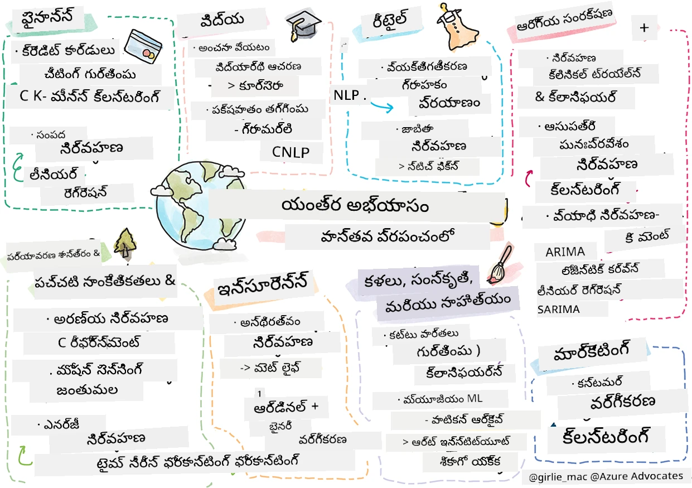

<!--
CO_OP_TRANSLATOR_METADATA:
{
  "original_hash": "83320d6b6994909e35d830cebf214039",
  "translation_date": "2025-12-19T15:06:27+00:00",
  "source_file": "9-Real-World/1-Applications/README.md",
  "language_code": "te"
}
-->
# పోస్ట్‌స్క్రిప్ట్: వాస్తవ ప్రపంచంలో మెషీన్ లెర్నింగ్

> స్కెచ్‌నోట్ [టోమోమీ ఇమురా](https://www.twitter.com/girlie_mac) ద్వారా

ఈ పాఠ్యक्रमంలో, మీరు శిక్షణ కోసం డేటాను సిద్ధం చేయడం మరియు మెషీన్ లెర్నింగ్ మోడల్స్ సృష్టించడానికి అనేక మార్గాలను నేర్చుకున్నారు. మీరు క్లాసిక్ రిగ్రెషన్, క్లస్టరింగ్, వర్గీకరణ, సహజ భాషా ప్రాసెసింగ్, మరియు టైమ్ సిరీస్ మోడల్స్ సిరీస్‌ను నిర్మించారు. అభినందనలు! ఇప్పుడు, మీరు ఆలోచిస్తున్నారా ఇది అంతా ఏం కోసం... ఈ మోడల్స్‌కు వాస్తవ ప్రపంచంలో ఏవైనా అనువర్తనాలు ఏమిటి?

ఇండస్ట్రీలో ఎక్కువ ఆసక్తి సాధించినది AI, ఇది సాధారణంగా డీప్ లెర్నింగ్‌ను ఉపయోగిస్తుంది, అయినప్పటికీ క్లాసికల్ మెషీన్ లెర్నింగ్ మోడల్స్‌కు ఇంకా విలువైన అనువర్తనాలు ఉన్నాయి. మీరు ఈ అనువర్తనాలలో కొన్ని ఈ రోజు కూడా ఉపయోగించవచ్చు! ఈ పాఠంలో, మీరు ఎనిమిది విభిన్న పరిశ్రమలు మరియు విషయం-విషయ డొమైన్‌లు ఈ రకమైన మోడల్స్‌ను ఎలా ఉపయోగించి తమ అనువర్తనాలను మరింత పనితీరు, నమ్మకదారితనం, తెలివితేట, మరియు వినియోగదారులకు విలువైనదిగా మార్చుతున్నారో అన్వేషిస్తారు.

## [పూర్వ-లెక్చర్ క్విజ్](https://ff-quizzes.netlify.app/en/ml/)

## 💰 ఫైనాన్స్

ఫైనాన్స్ రంగం మెషీన్ లెర్నింగ్‌కు అనేక అవకాశాలను అందిస్తుంది. ఈ ప్రాంతంలోని అనేక సమస్యలు ML ఉపయోగించి మోడల్ చేయబడతాయి మరియు పరిష్కరించబడతాయి.

### క్రెడిట్ కార్డ్ మోసపూరిత గుర్తింపు

ముందుగా కోర్సులో [k-మీన్స్ క్లస్టరింగ్](../../5-Clustering/2-K-Means/README.md) గురించి నేర్చుకున్నాము, కానీ ఇది క్రెడిట్ కార్డ్ మోసపూరిత సమస్యలను ఎలా పరిష్కరిస్తుంది?

క్రెడిట్ కార్డ్ మోసపూరిత గుర్తింపు సాంకేతికతలో **అసాధారణ గుర్తింపు** అనే పద్ధతిలో k-మీన్స్ క్లస్టరింగ్ ఉపయోగపడుతుంది. అసాధారణాలు లేదా డేటా సెట్‌పై పరిశీలనలలో వ్యత్యాసాలు క్రెడిట్ కార్డ్ సాధారణంగా ఉపయోగించబడుతున్నదా లేదా ఏదైనా అసాధారణం జరుగుతున్నదా అని చెప్పగలవు. క్రింద లింక్ చేసిన పత్రంలో చూపినట్లుగా, మీరు క్రెడిట్ కార్డ్ డేటాను k-మీన్స్ క్లస్టరింగ్ అల్గోరిథం ఉపయోగించి వర్గీకరించవచ్చు మరియు ప్రతి లావాదేవీని అది ఎంత అసాధారణంగా కనిపిస్తుందో ఆధారంగా ఒక క్లస్టర్‌కు కేటాయించవచ్చు. ఆపై, మోసపూరిత మరియు చట్టబద్ధ లావాదేవీల కోసం అత్యంత ప్రమాదకరమైన క్లస్టర్లను మూల్యాంకనం చేయవచ్చు.
[సూచన](https://citeseerx.ist.psu.edu/viewdoc/download?doi=10.1.1.680.1195&rep=rep1&type=pdf)

### సంపద నిర్వహణ

సంపద నిర్వహణలో, వ్యక్తి లేదా సంస్థ తమ క్లయింట్ల తరఫున పెట్టుబడులను నిర్వహిస్తుంది. వారి పని దీర్ఘకాలంలో సంపదను నిలబెట్టడం మరియు పెంచడం, కాబట్టి మంచి పనితీరు చూపే పెట్టుబడులను ఎంచుకోవడం అవసరం.

ఒక పెట్టుబడి ఎలా పనిచేస్తుందో అంచనా వేయడానికి ఒక మార్గం గణాంక రిగ్రెషన్ ద్వారా. [లీనియర్ రిగ్రెషన్](../../2-Regression/1-Tools/README.md) ఒక ఫండ్ పనితీరు కొంత బెంచ్‌మార్క్‌తో ఎలా సంబంధం ఉందో అర్థం చేసుకోవడానికి విలువైన సాధనం. మేము రిగ్రెషన్ ఫలితాలు గణాంకపరంగా ప్రామాణికమా లేదా కస్టమర్ పెట్టుబడులపై ఎంత ప్రభావం చూపుతాయో కూడా అంచనా వేయవచ్చు. మీరు బహుళ రిగ్రెషన్ ఉపయోగించి మీ విశ్లేషణను మరింత విస్తరించవచ్చు, ఇక్కడ అదనపు ప్రమాద కారకాలు పరిగణనలోకి తీసుకోవచ్చు. ఒక నిర్దిష్ట ఫండ్ పనితీరు ఎలా ఉంటుందో తెలుసుకోవడానికి క్రింద ఉన్న పత్రాన్ని చూడండి.
[సూచన](http://www.brightwoodventures.com/evaluating-fund-performance-using-regression/)

## 🎓 విద్య

విద్య రంగం కూడా మెషీన్ లెర్నింగ్‌ను వర్తింపజేయడానికి చాలా ఆసక్తికరమైన ప్రాంతం. పరీక్షలలో లేదా వ్యాసాలలో మోసం గుర్తించడం లేదా సవరణ ప్రక్రియలో అనుకోకుండా లేదా ఉద్దేశపూర్వకంగా ఉన్న పక్షపాతాన్ని నిర్వహించడం వంటి సమస్యలు ఉన్నాయి.

### విద్యార్థి ప్రవర్తన అంచనా

[Coursera](https://coursera.com), ఒక ఆన్‌లైన్ ఓపెన్ కోర్సు ప్రొవైడర్, అనేక ఇంజనీరింగ్ నిర్ణయాలను చర్చించే గొప్ప టెక్ బ్లాగ్ కలిగి ఉంది. ఈ కేసు స్టడీలో, వారు తక్కువ NPS (నెట్ ప్రమోటర్ స్కోర్) రేటింగ్ మరియు కోర్సు నిలుపుదల లేదా డ్రాప్-ఆఫ్ మధ్య ఏదైనా సంబంధం ఉందా అని అన్వేషించడానికి రిగ్రెషన్ లైన్‌ను ప్లాట్ చేశారు.
[సూచన](https://medium.com/coursera-engineering/controlled-regression-quantifying-the-impact-of-course-quality-on-learner-retention-31f956bd592a)

### పక్షపాతం తగ్గించడం

[Grammarly](https://grammarly.com), ఒక రైటింగ్ అసిస్టెంట్, దాని ఉత్పత్తులలో సున్నితమైన [సహజ భాషా ప్రాసెసింగ్ సిస్టమ్స్](../../6-NLP/README.md) ఉపయోగిస్తుంది. వారు తమ టెక్ బ్లాగ్‌లో మెషీన్ లెర్నింగ్‌లో లింగ పక్షపాతాన్ని ఎలా ఎదుర్కొన్నారో గురించి ఆసక్తికరమైన కేసు స్టడీ ప్రచురించారు, ఇది మీరు మా [ప్రారంభ న్యాయసమ్మతత పాఠంలో](../../1-Introduction/3-fairness/README.md) నేర్చుకున్నారు.
[సూచన](https://www.grammarly.com/blog/engineering/mitigating-gender-bias-in-autocorrect/)

## 👜 రిటైల్

రిటైల్ రంగం ఖచ్చితంగా మెషీన్ లెర్నింగ్ ఉపయోగం ద్వారా లాభపడుతుంది, కస్టమర్ ప్రయాణాన్ని మెరుగుపరచడం నుండి సరుకుల నిల్వను ఆప్టిమైజ్ చేయడం వరకు.

### కస్టమర్ ప్రయాణాన్ని వ్యక్తిగతీకరించడం

Wayfair, ఫర్నిచర్ వంటి హోమ్ గూడ్స్ అమ్మే కంపెనీ, కస్టమర్లకు వారి రుచి మరియు అవసరాలకు సరిపోయే సరుకులను కనుగొనడంలో సహాయం చేయడం అత్యంత ముఖ్యమైనది. ఈ వ్యాసంలో, కంపెనీ ఇంజనీర్లు ML మరియు NLP ఎలా ఉపయోగిస్తారో వివరిస్తారు "కస్టమర్లకు సరైన ఫలితాలను చూపించడానికి". ముఖ్యంగా, వారి Query Intent Engine ఎంటిటీ ఎక్స్‌ట్రాక్షన్, క్లాసిఫైయర్ శిక్షణ, ఆస్తి మరియు అభిప్రాయ ఎక్స్‌ట్రాక్షన్, మరియు కస్టమర్ సమీక్షలపై భావోద్వేగ ట్యాగింగ్ ఉపయోగించి నిర్మించబడింది. ఇది ఆన్‌లైన్ రిటైల్‌లో NLP ఎలా పనిచేస్తుందో క్లాసిక్ ఉదాహరణ.
[సూచన](https://www.aboutwayfair.com/tech-innovation/how-we-use-machine-learning-and-natural-language-processing-to-empower-search)

### నిల్వ నిర్వహణ

[StitchFix](https://stitchfix.com) వంటి ఆవిష్కరణాత్మక, చురుకైన కంపెనీలు, కస్టమర్ సిఫార్సులు మరియు నిల్వ నిర్వహణ కోసం ML పై బలంగా ఆధారపడతాయి. వారి స్టైలింగ్ టీమ్స్ వారి మెర్చండైజింగ్ టీమ్స్‌తో కలిసి పనిచేస్తాయి: "మా ఒక డేటా సైంటిస్ట్ జెనెటిక్ అల్గోరిథం తో ఆడుతూ దాన్ని దుస్తులపై వర్తింపజేసి, ఇప్పటి వరకు లేని విజయవంతమైన దుస్తులను అంచనా వేసాడు. మేము దాన్ని మెర్చండైజ్ టీమ్‌కు తీసుకువచ్చాము, ఇప్పుడు వారు దాన్ని ఒక సాధనంగా ఉపయోగించవచ్చు."
[సూచన](https://www.zdnet.com/article/how-stitch-fix-uses-machine-learning-to-master-the-science-of-styling/)

## 🏥 ఆరోగ్య సంరక్షణ

ఆరోగ్య సంరక్షణ రంగం పరిశోధన పనులను ఆప్టిమైజ్ చేయడానికి మరియు రోగులను తిరిగి చేర్చడం లేదా వ్యాధులు వ్యాప్తి చెందకుండా నిరోధించడానికి మెషీన్ లెర్నింగ్‌ను ఉపయోగించవచ్చు.

### క్లినికల్ ట్రయల్స్ నిర్వహణ

క్లినికల్ ట్రయల్స్‌లో విషపూరితత ఔషధ తయారీదారులకు ప్రధాన ఆందోళన. ఎంత విషపూరితత అనుమతించదగినది? ఈ అధ్యయనంలో, వివిధ క్లినికల్ ట్రయల్ పద్ధతులను విశ్లేషించడం ద్వారా క్లినికల్ ట్రయల్ ఫలితాల అవకాశాలను అంచనా వేయడానికి కొత్త విధానం అభివృద్ధి చేయబడింది. ప్రత్యేకంగా, వారు రాండమ్ ఫారెస్ట్ ఉపయోగించి [క్లాసిఫైయర్](../../4-Classification/README.md) తయారు చేశారు, ఇది ఔషధాల గుంపులను వేరుచేయగలదు.
[సూచన](https://www.sciencedirect.com/science/article/pii/S2451945616302914)

### ఆసుపత్రి తిరిగి చేర్చడం నిర్వహణ

ఆసుపత్రి సంరక్షణ ఖరీదైనది, ముఖ్యంగా రోగులను తిరిగి చేర్చాల్సినప్పుడు. ఈ పత్రం ఒక కంపెనీ ML ఉపయోగించి తిరిగి చేర్చే అవకాశాన్ని [క్లస్టరింగ్](../../5-Clustering/README.md) అల్గోరిథమ్స్ ద్వారా అంచనా వేస్తుందని చర్చిస్తుంది. ఈ క్లస్టర్లు విశ్లేషకులకు "సాధారణ కారణం పంచుకునే తిరిగి చేర్చే గుంపులను కనుగొనడంలో" సహాయపడతాయి.
[సూచన](https://healthmanagement.org/c/healthmanagement/issuearticle/hospital-readmissions-and-machine-learning)

### వ్యాధి నిర్వహణ

ఇటీవల జరిగిన మహమ్మారి మెషీన్ లెర్నింగ్ వ్యాధి వ్యాప్తిని ఆపడానికి ఎలా సహాయపడగలదో స్పష్టంగా చూపించింది. ఈ వ్యాసంలో, మీరు ARIMA, లాజిస్టిక్ వక్రాలు, లీనియర్ రిగ్రెషన్, మరియు SARIMA ఉపయోగాన్ని గుర్తిస్తారు. "ఈ పని ఈ వైరస్ వ్యాప్తి రేటును లెక్కించడానికి మరియు మరణాలు, కోలికలు, మరియు నిర్ధారిత కేసులను అంచనా వేయడానికి ప్రయత్నం, తద్వారా మేము మెరుగ్గా సిద్ధం కావడానికి మరియు బతకడానికి సహాయపడుతుంది."
[సూచన](https://www.ncbi.nlm.nih.gov/pmc/articles/PMC7979218/)

## 🌲 పర్యావరణ శాస్త్రం మరియు గ్రీన్ టెక్

ప్రకృతి మరియు పర్యావరణ శాస్త్రం అనేక సున్నితమైన వ్యవస్థలతో కూడి ఉంటుంది, ఇక్కడ జంతువులు మరియు ప్రకృతి మధ్య పరస్పర చర్య ప్రధానంగా ఉంటుంది. ఈ వ్యవస్థలను ఖచ్చితంగా కొలవడం మరియు ఏదైనా సంఘటన జరిగితే, ఉదాహరణకు అడవి అగ్ని లేదా జంతు జనాభాలో తగ్గుదల, తగిన చర్యలు తీసుకోవడం ముఖ్యం.

### అడవి నిర్వహణ

మీరు గత పాఠాలలో [రిఇన్ఫోర్స్‌మెంట్ లెర్నింగ్](../../8-Reinforcement/README.md) గురించి నేర్చుకున్నారు. ఇది ప్రకృతిలో నమూనాలను అంచనా వేయడంలో చాలా ఉపయోగకరం. ముఖ్యంగా, ఇది అడవి అగ్నిప్రమాదాలు మరియు ఆక్రమణ జాతుల వ్యాప్తిని ట్రాక్ చేయడానికి ఉపయోగపడుతుంది. కెనడాలో, ఒక పరిశోధకుల గుంపు రిఇన్ఫోర్స్‌మెంట్ లెర్నింగ్ ఉపయోగించి ఉపగ్రహ చిత్రాల నుండి అడవి అగ్ని గమనాల మోడల్స్ నిర్మించింది. ఒక ఆవిష్కరణాత్మక "స్థలిక వ్యాప్తి ప్రక్రియ (SSP)" ఉపయోగించి, వారు అడవి అగ్నిని "భూభాగంలోని ఏ సెల్‌లోనైనా ఏజెంట్"గా ఊహించారు. "ఏ సమయంలోనైనా అగ్ని తీసుకునే చర్యల సమూహం ఉత్తరం, దక్షిణం, తూర్పు, లేదా పడమర వైపుకు వ్యాప్తి చెందడం లేదా వ్యాప్తి చెందకపోవడం."

ఈ విధానం సాధారణ RL సెటప్‌ను తిరగదీస్తుంది ఎందుకంటే సంబంధిత మార్కోవ్ డెసిషన్ ప్రాసెస్ (MDP) యొక్క గమనాలు తక్షణ అగ్ని వ్యాప్తికి తెలిసిన ఫంక్షన్. ఈ గుంపు ఉపయోగించిన క్లాసిక్ అల్గోరిథమ్స్ గురించి క్రింద లింక్‌లో మరింత చదవండి.
[సూచన](https://www.frontiersin.org/articles/10.3389/fict.2018.00006/full)

### జంతువుల మోషన్ సెన్సింగ్

డీప్ లెర్నింగ్ జంతు కదలికలను దృశ్యంగా ట్రాక్ చేయడంలో విప్లవం సృష్టించింది (మీరు మీ స్వంత [పోలార్ బేర్ ట్రాకర్](https://docs.microsoft.com/learn/modules/build-ml-model-with-azure-stream-analytics/?WT.mc_id=academic-77952-leestott) ఇక్కడ నిర్మించవచ్చు), అయినప్పటికీ క్లాసిక్ ML ఈ పనిలో ఇంకా ప్రాధాన్యం కలిగి ఉంది.

పశుపాలన జంతువుల కదలికలను ట్రాక్ చేయడానికి సెన్సార్లు మరియు IoT ఈ రకమైన దృశ్య ప్రాసెసింగ్ ఉపయోగిస్తాయి, కానీ ప్రాథమిక ML సాంకేతికతలు డేటాను ప్రీప్రాసెస్ చేయడానికి ఉపయోగకరంగా ఉంటాయి. ఉదాహరణకు, ఈ పత్రంలో, గొర్రెలు భంగిమలను పర్యవేక్షించి వివిధ క్లాసిఫైయర్ అల్గోరిథమ్స్ ఉపయోగించి విశ్లేషించారు. మీరు పేజీ 335లో ROC వక్రాన్ని గుర్తించవచ్చు.
[సూచన](https://druckhaus-hofmann.de/gallery/31-wj-feb-2020.pdf)

### ⚡️ ఎనర్జీ నిర్వహణ
  
మా [టైమ్ సిరీస్ ఫోర్కాస్టింగ్](../../7-TimeSeries/README.md) పాఠాలలో, సరఫరా మరియు డిమాండ్ అర్థం చేసుకుని పట్టణానికి ఆదాయం సృష్టించడానికి స్మార్ట్ పార్కింగ్ మీటర్ల కాన్సెప్ట్‌ను ప్రస్తావించాము. ఈ వ్యాసం క్లస్టరింగ్, రిగ్రెషన్ మరియు టైమ్ సిరీస్ ఫోర్కాస్టింగ్ కలిపి ఐర్లాండ్‌లో భవిష్యత్ ఎనర్జీ వినియోగాన్ని అంచనా వేయడంలో ఎలా సహాయపడిందో వివరంగా చర్చిస్తుంది, స్మార్ట్ మీటరింగ్ ఆధారంగా.
[సూచన](https://www-cdn.knime.com/sites/default/files/inline-images/knime_bigdata_energy_timeseries_whitepaper.pdf)

## 💼 బీమా

బీమా రంగం కూడా ఆర్థిక మరియు యాక్చ్యూరియల్ మోడల్స్ నిర్మించడానికి మరియు ఆప్టిమైజ్ చేయడానికి ML ఉపయోగిస్తుంది.

### అస్థిరత నిర్వహణ

MetLife, ఒక జీవిత బీమా ప్రొవైడర్, వారి ఆర్థిక మోడల్స్‌లో అస్థిరతను ఎలా విశ్లేషించి తగ్గిస్తారో స్పష్టంగా చెప్తుంది. ఈ వ్యాసంలో మీరు బైనరీ మరియు ఆర్డినల్ వర్గీకరణ విజువలైజేషన్లు గమనిస్తారు. మీరు ఫోర్కాస్టింగ్ విజువలైజేషన్లను కూడా కనుగొంటారు.
[సూచన](https://investments.metlife.com/content/dam/metlifecom/us/investments/insights/research-topics/macro-strategy/pdf/MetLifeInvestmentManagement_MachineLearnedRanking_070920.pdf)

## 🎨 కళలు, సంస్కృతి, మరియు సాహిత్యం

కళలలో, ఉదాహరణకు జర్నలిజంలో, అనేక ఆసక్తికర సమస్యలు ఉన్నాయి. ఫేక్ న్యూస్ గుర్తించడం ఒక పెద్ద సమస్య, ఇది ప్రజల అభిప్రాయాన్ని ప్రభావితం చేయడమే కాకుండా ప్రజాస్వామ్యాలను కూడా కూల్చివేయగలదు. మ్యూజియంలు కూడా ఆర్టిఫాక్ట్స్ మధ్య లింకులను కనుగొనడం నుండి వనరుల ప్రణాళిక వరకు ML ఉపయోగించి లాభపడతాయి.

### ఫేక్ న్యూస్ గుర్తింపు

ఈ రోజుల్లో మీడియా లో ఫేక్ న్యూస్ గుర్తించడం ఒక పిల్లి మరియు ఎలుక ఆటలా మారింది. ఈ వ్యాసంలో, పరిశోధకులు మేము అధ్యయనం చేసిన అనేక ML సాంకేతికతలను కలిపిన ఒక సిస్టమ్‌ను పరీక్షించి ఉత్తమ మోడల్‌ను అమలు చేయవచ్చని సూచిస్తున్నారు: "ఈ సిస్టమ్ సహజ భాషా ప్రాసెసింగ్ ఆధారంగా డేటా నుండి లక్షణాలను తీసుకుంటుంది మరియు ఆ లక్షణాలను నైవ్ బేస్, సపోర్ట్ వెక్టర్ మెషీన్ (SVM), రాండమ్ ఫారెస్ట్ (RF), స్టోకాస్టిక్ గ్రాడియెంట్ డిసెంట్ (SGD), మరియు లాజిస్టిక్ రిగ్రెషన్ (LR) వంటి మెషీన్ లెర్నింగ్ క్లాసిఫైయర్ల శిక్షణకు ఉపయోగిస్తారు."
[సూచన](https://www.irjet.net/archives/V7/i6/IRJET-V7I6688.pdf)

ఈ వ్యాసం వివిధ ML డొమైన్‌లను కలిపి ఫేక్ న్యూస్ వ్యాప్తిని ఆపడానికి మరియు నిజమైన నష్టం కలిగించకుండా సహాయపడే ఆసక్తికర ఫలితాలను ఎలా ఉత్పత్తి చేయగలదో చూపిస్తుంది; ఈ సందర్భంలో, COVID చికిత్సల గురించి ప్రచారాలు మోబు హింసకు దారితీసినప్పుడు ఇది ప్రేరణ అయింది.

### మ్యూజియం ML

మ్యూజియంలు AI విప్లవం అంచున ఉన్నాయి, ఇందులో సేకరణలను కేటలాగ్ చేయడం మరియు డిజిటైజ్ చేయడం మరియు ఆర్టిఫాక్ట్స్ మధ్య లింకులను కనుగొనడం సాంకేతికత అభివృద్ధితో సులభమవుతోంది. [In Codice Ratio](https://www.sciencedirect.com/science/article/abs/pii/S0306457321001035#:~:text=1.,studies%20over%20large%20historical%20sources.) వంటి ప్రాజెక్టులు వేటికన్ ఆర్కైవ్స్ వంటి అందుబాటులో లేని సేకరణల రహస్యాలను తెరవడంలో సహాయపడుతున్నాయి. కానీ, మ్యూజియంల వ్యాపార భాగం కూడా ML మోడల్స్ నుండి లాభపడుతుంది.

ఉదాహరణకు, ఆర్ట్ ఇన్స్టిట్యూట్ ఆఫ్ చికాగో ప్రేక్షకులు ఏమి ఆసక్తి చూపిస్తారో మరియు వారు ఎప్పుడు ప్రదర్శనలకు హాజరవుతారో అంచనా వేయడానికి మోడల్స్ నిర్మించింది. లక్ష్యం ప్రతి సారి వినియోగదారు మ్యూజియం సందర్శించినప్పుడు వ్యక్తిగతీకరించిన మరియు ఆప్టిమైజ్ చేసిన సందర్శక అనుభవాలను సృష్టించడం. "2017 ఆర్థిక సంవత్సరంలో, మోడల్ హాజరు మరియు ప్రవేశాలను 1 శాతం ఖచ్చితత్వంతో అంచనా వేసింది, అంటున్నారు ఆండ్రూ సిమ్నిక్, ఆర్ట్ ఇన్స్టిట్యూట్ సీనియర్ వైస్ ప్రెసిడెంట్."
[సూచన](https://www.chicagobusiness.com/article/20180518/ISSUE01/180519840/art-institute-of-chicago-uses-data-to-make-exhibit-choices)

## 🏷 మార్కెటింగ్

### కస్టమర్ విభజన

అత్యంత ప్రభావవంతమైన మార్కెటింగ్ వ్యూహాలు వివిధ గ్రూపుల ఆధారంగా కస్టమర్లను వేర్వేరు రీతుల్లో లక్ష్యంగా చేసుకుంటాయి. ఈ వ్యాసంలో, క్లస్టరింగ్ అల్గోరిథమ్స్ ఉపయోగం వివిధీకృత మార్కెటింగ్‌కు మద్దతు ఇవ్వడానికి చర్చించబడింది. వివిధీకృత మార్కెటింగ్ కంపెనీలకు బ్రాండ్ గుర్తింపును మెరుగుపరచడంలో, మరిన్ని కస్టమర్లను చేరుకోవడంలో, మరియు మరిన్ని డబ్బు సంపాదించడంలో సహాయపడుతుంది.
[సూచన](https://ai.inqline.com/machine-learning-for-marketing-customer-segmentation/)

## 🚀 సవాలు

ఈ పాఠ్యక్రమంలో మీరు నేర్చుకున్న కొన్ని సాంకేతికతలతో లాభపడే మరొక రంగాన్ని గుర్తించండి, మరియు అది ML ను ఎలా ఉపయోగిస్తుందో కనుగొనండి.
## [లెక్చర్ తర్వాత క్విజ్](https://ff-quizzes.netlify.app/en/ml/)

## సమీక్ష & స్వీయ అధ్యయనం

వేఫెయిర్ డేటా సైన్స్ టీమ్ వారి కంపెనీలో ఎంఎల్‌ను ఎలా ఉపయోగిస్తారో గురించి కొన్ని ఆసక్తికరమైన వీడియోలు ఉన్నాయి. [చూడడం](https://www.youtube.com/channel/UCe2PjkQXqOuwkW1gw6Ameuw/videos) విలువైనది!

## అసైన్‌మెంట్

[ఒక ఎంఎల్ స్కావెంజర్ హంట్](assignment.md)

---

<!-- CO-OP TRANSLATOR DISCLAIMER START -->
**అస్పష్టత**:  
ఈ పత్రాన్ని AI అనువాద సేవ [Co-op Translator](https://github.com/Azure/co-op-translator) ఉపయోగించి అనువదించబడింది. మేము ఖచ్చితత్వానికి ప్రయత్నించినప్పటికీ, ఆటోమేటెడ్ అనువాదాల్లో పొరపాట్లు లేదా తప్పిదాలు ఉండవచ్చు. మూల పత్రం దాని స్వదేశీ భాషలోనే అధికారిక మూలంగా పరిగణించాలి. ముఖ్యమైన సమాచారానికి, ప్రొఫెషనల్ మానవ అనువాదం సిఫార్సు చేయబడుతుంది. ఈ అనువాదం వాడకంలో ఏర్పడిన ఏవైనా అపార్థాలు లేదా తప్పుదారులు కోసం మేము బాధ్యత వహించము.
<!-- CO-OP TRANSLATOR DISCLAIMER END -->