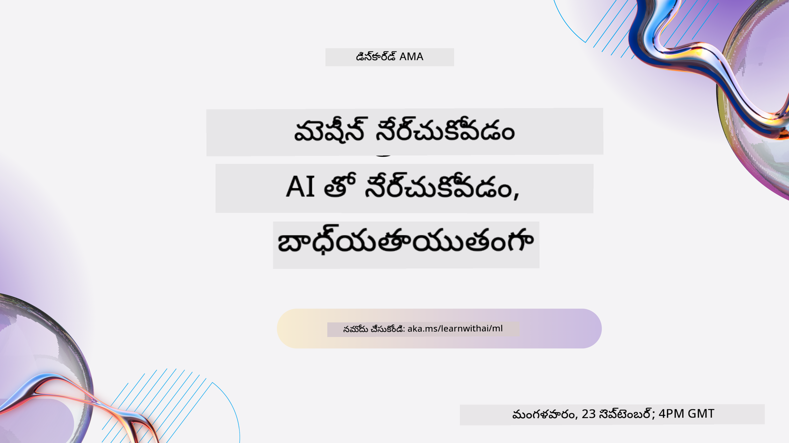
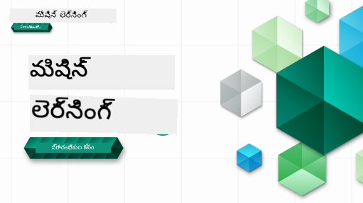

<!--
CO_OP_TRANSLATOR_METADATA:
{
  "original_hash": "c300f2380d9da91b7de8c707f69ce99b",
  "translation_date": "2025-12-19T12:46:58+00:00",
  "source_file": "README.md",
  "language_code": "te"
}
-->

### 🌐 బహుభాషా మద్దతు

#### GitHub యాక్షన్ ద్వారా మద్దతు (ఆటోమేటెడ్ & ఎప్పుడూ తాజా)

<!-- CO-OP TRANSLATOR LANGUAGES TABLE START -->
[Arabic](../ar/README.md) | [Bengali](../bn/README.md) | [Bulgarian](../bg/README.md) | [Burmese (Myanmar)](../my/README.md) | [Chinese (Simplified)](../zh/README.md) | [Chinese (Traditional, Hong Kong)](../hk/README.md) | [Chinese (Traditional, Macau)](../mo/README.md) | [Chinese (Traditional, Taiwan)](../tw/README.md) | [Croatian](../hr/README.md) | [Czech](../cs/README.md) | [Danish](../da/README.md) | [Dutch](../nl/README.md) | [Estonian](../et/README.md) | [Finnish](../fi/README.md) | [French](../fr/README.md) | [German](../de/README.md) | [Greek](../el/README.md) | [Hebrew](../he/README.md) | [Hindi](../hi/README.md) | [Hungarian](../hu/README.md) | [Indonesian](../id/README.md) | [Italian](../it/README.md) | [Japanese](../ja/README.md) | [Kannada](../kn/README.md) | [Korean](../ko/README.md) | [Lithuanian](../lt/README.md) | [Malay](../ms/README.md) | [Malayalam](../ml/README.md) | [Marathi](../mr/README.md) | [Nepali](../ne/README.md) | [Nigerian Pidgin](../pcm/README.md) | [Norwegian](../no/README.md) | [Persian (Farsi)](../fa/README.md) | [Polish](../pl/README.md) | [Portuguese (Brazil)](../br/README.md) | [Portuguese (Portugal)](../pt/README.md) | [Punjabi (Gurmukhi)](../pa/README.md) | [Romanian](../ro/README.md) | [Russian](../ru/README.md) | [Serbian (Cyrillic)](../sr/README.md) | [Slovak](../sk/README.md) | [Slovenian](../sl/README.md) | [Spanish](../es/README.md) | [Swahili](../sw/README.md) | [Swedish](../sv/README.md) | [Tagalog (Filipino)](../tl/README.md) | [Tamil](../ta/README.md) | [Telugu](./README.md) | [Thai](../th/README.md) | [Turkish](../tr/README.md) | [Ukrainian](../uk/README.md) | [Urdu](../ur/README.md) | [Vietnamese](../vi/README.md)
<!-- CO-OP TRANSLATOR LANGUAGES TABLE END -->

#### మా కమ్యూనిటీకి చేరండి

మేము డిస్కార్డ్ లో AI తో నేర్చుకునే సిరీస్ నిర్వహిస్తున్నాము, మరింత తెలుసుకోండి మరియు 18 - 30 సెప్టెంబర్, 2025 న [Learn with AI Series](https://aka.ms/learnwithai/discord) లో చేరండి. మీరు GitHub Copilot ను డేటా సైన్స్ కోసం ఉపయోగించే చిట్కాలు మరియు సలహాలు పొందుతారు.

# ప్రారంభికుల కోసం మెషీన్ లెర్నింగ్ - ఒక పాఠ్యక్రమం

> 🌍 ప్రపంచ సంస్కృతుల ద్వారా మెషీన్ లెర్నింగ్ ను అన్వేషిస్తూ ప్రపంచం చుట్టూ ప్రయాణించండి 🌍

Microsoft లో క్లౌడ్ అడ్వకేట్స్ 12 వారాల, 26 పాఠాల పాఠ్యక్రమాన్ని అందిస్తున్నందుకు సంతోషిస్తున్నాము, ఇది **మెషీన్ లెర్నింగ్** గురించి. ఈ పాఠ్యక్రమంలో, మీరు సాధారణంగా **క్లాసిక్ మెషీన్ లెర్నింగ్** అని పిలవబడే విషయాలను, ప్రధానంగా Scikit-learn లైబ్రరీ ఉపయోగించి నేర్చుకుంటారు మరియు డీప్ లెర్నింగ్ ను తప్పిస్తారు, ఇది మా [AI for Beginners' curriculum](https://aka.ms/ai4beginners) లో కవర్ చేయబడింది. ఈ పాఠ్యక్రమాన్ని మా ['Data Science for Beginners' curriculum](https://aka.ms/ds4beginners) తో జతచేయండి.

ప్రపంచం చుట్టూ ప్రయాణిస్తూ, ఈ క్లాసిక్ సాంకేతికతలను ప్రపంచంలోని వివిధ ప్రాంతాల డేటాకు వర్తింపజేస్తాము. ప్రతి పాఠం ముందు మరియు తర్వాత క్విజ్‌లు, పాఠం పూర్తి చేయడానికి రాసిన సూచనలు, పరిష్కారం, అసైన్‌మెంట్ మరియు మరిన్ని ఉంటాయి. మా ప్రాజెక్ట్ ఆధారిత పాఠ్య విధానం మీరు నిర్మిస్తూ నేర్చుకునేలా చేస్తుంది, ఇది కొత్త నైపుణ్యాలు 'ముడిపడటానికి' ఒక నిరూపిత మార్గం.

**✍️ మా రచయితలకు హృదయపూర్వక ధన్యవాదాలు** జెన్ లూపర్, స్టీఫెన్ హావెల్, ఫ్రాన్సెస్కా లాజెరి, టోమోమీ ఇమురా, క్యాసీ బ్రేవియూ, డ్మిత్రి సోష్నికోవ్, క్రిస్ నోరింగ్, అనిర్బాన్ ముఖర్జీ, ఒర్నెల్లా ఆల్టున్యాన్, రూత్ యకుబు మరియు ఎమీ బాయిడ్

**🎨 మా చిత్రకారులకు కూడా ధన్యవాదాలు** టోమోమీ ఇమురా, దసాని మడిపల్లి, మరియు జెన్ లూపర్

**🙏 ప్రత్యేక ధన్యవాదాలు 🙏 మా Microsoft స్టూడెంట్ అంబాసిడర్ రచయితలు, సమీక్షకులు మరియు కంటెంట్ సహకారులకు**, ముఖ్యంగా రిషిత్ దాగ్లీ, ముహమ్మద్ సకీబ్ ఖాన్ ఇనాన్, రోహన్ రాజ్, అలెగ్జాండ్రూ పెట్రెస్కు, అభిషేక్ జైస్వాల్, నావ్రిన్ టబస్సుం, ఇఓన్ సముయిలా, మరియు స్నిగ్ధ అగర్వాల్

**🤩 Microsoft స్టూడెంట్ అంబాసిడర్స్ ఎరిక్ వాంజావ్, జస్లీన్ సొంధి, మరియు విదుషి గుప్తా గారికి మా R పాఠాల కోసం అదనపు కృతజ్ఞతలు!**

# ప్రారంభించడం

ఈ దశలను అనుసరించండి:
1. **రిపోజిటరీని ఫోర్క్ చేయండి**: ఈ పేజీ పై-కుడి మూలలో ఉన్న "Fork" బటన్ పై క్లిక్ చేయండి.
2. **రిపోజిటరీని క్లోన్ చేయండి**:   `git clone https://github.com/microsoft/ML-For-Beginners.git`

> [ఈ కోర్సు కోసం అన్ని అదనపు వనరులను మా Microsoft Learn సేకరణలో కనుగొనండి](https://learn.microsoft.com/en-us/collections/qrqzamz1nn2wx3?WT.mc_id=academic-77952-bethanycheum)

> 🔧 **సహాయం కావాలా?** ఇన్‌స్టాలేషన్, సెటప్ మరియు పాఠాలు నడిపే సమయంలో సాధారణ సమస్యలకు పరిష్కారాల కోసం మా [Troubleshooting Guide](TROUBLESHOOTING.md) ను చూడండి.

**[విద్యార్థులు](https://aka.ms/student-page)**, ఈ పాఠ్యక్రమాన్ని ఉపయోగించడానికి, మొత్తం రిపోను మీ GitHub ఖాతాకు ఫోర్క్ చేసి, స్వయంగా లేదా గ్రూప్ తో వ్యాయామాలు పూర్తి చేయండి:

- ప్రీ-లెక్చర్ క్విజ్ తో ప్రారంభించండి.
- లెక్చర్ చదవండి మరియు కార్యకలాపాలను పూర్తి చేయండి, ప్రతి జ్ఞాన పరీక్ష వద్ద ఆగి ఆలోచించండి.
- పరిష్కార కోడ్ నడపకుండా పాఠాలను అర్థం చేసుకుని ప్రాజెక్టులను సృష్టించడానికి ప్రయత్నించండి; అయితే ఆ కోడ్ ప్రతి ప్రాజెక్ట్-ఆధారిత పాఠంలో `/solution` ఫోల్డర్‌లో అందుబాటులో ఉంటుంది.
- పోస్ట్-లెక్చర్ క్విజ్ తీసుకోండి.
- ఛాలెంజ్ పూర్తి చేయండి.
- అసైన్‌మెంట్ పూర్తి చేయండి.
- ఒక పాఠం సమూహం పూర్తి చేసిన తర్వాత, [Discussion Board](https://github.com/microsoft/ML-For-Beginners/discussions) ను సందర్శించి, సరైన PAT రుబ్రిక్‌ను పూరించి "learn out loud" చేయండి. 'PAT' అనేది ప్రోగ్రెస్ అసెస్‌మెంట్ టూల్, ఇది మీరు మీ నేర్చుకునే ప్రక్రియను మెరుగుపరచడానికి పూరించే రుబ్రిక్. మీరు ఇతర PAT లకు కూడా స్పందించవచ్చు, తద్వారా మనం కలిసి నేర్చుకోవచ్చు.

> మరింత అధ్యయనానికి, ఈ [Microsoft Learn](https://docs.microsoft.com/en-us/users/jenlooper-2911/collections/k7o7tg1gp306q4?WT.mc_id=academic-77952-leestott) మాడ్యూల్స్ మరియు లెర్నింగ్ పాథ్స్ అనుసరించమని మేము సిఫార్సు చేస్తున్నాము.

**ఉపాధ్యాయులు**, ఈ పాఠ్యక్రమాన్ని ఎలా ఉపయోగించాలో మేము కొన్ని [సూచనలు](for-teachers.md) చేర్చాము.

---

## వీడియో వాక్‌త్రూ

కొన్ని పాఠాలు చిన్న వీడియోలుగా అందుబాటులో ఉన్నాయి. మీరు ఈ వీడియోలను పాఠాలలో inline గా లేదా [Microsoft Developer YouTube ఛానెల్ లో ML for Beginners ప్లేలిస్ట్](https://aka.ms/ml-beginners-videos) లో చూడవచ్చు, క్రింది చిత్రంపై క్లిక్ చేయండి.

---

## టీమ్‌ను కలవండి

**Gif ద్వారా** [Mohit Jaisal](https://linkedin.com/in/mohitjaisal)

> 🎥 ప్రాజెక్ట్ మరియు దాన్ని సృష్టించిన వ్యక్తుల గురించి వీడియో కోసం పై చిత్రంపై క్లిక్ చేయండి!

---

## పాఠ్య విధానం

ఈ పాఠ్యక్రమాన్ని రూపొందించేటప్పుడు మేము రెండు పాఠ్య సిద్ధాంతాలను ఎంచుకున్నాము: ఇది చేతితో చేయగలిగే **ప్రాజెక్ట్-ఆధారిత**గా ఉండాలి మరియు ఇందులో **తరచూ క్విజ్‌లు** ఉండాలి. అదనంగా, ఈ పాఠ్యక్రమానికి ఒక సాధారణ **థీమ్** ఉంది, ఇది దానిని సమగ్రత ఇస్తుంది.

కంటెంట్ ప్రాజెక్టులకు అనుగుణంగా ఉండటం ద్వారా, విద్యార్థులకు ఇది మరింత ఆసక్తికరంగా మారుతుంది మరియు భావనల నిలుపుదల పెరుగుతుంది. తరగతి ముందు తక్కువ-ప్రమాద క్విజ్ విద్యార్థి ఒక విషయం నేర్చుకోవాలనే ఉద్దేశ్యాన్ని ఏర్పరుస్తుంది, తరగతి తర్వాత రెండవ క్విజ్ మరింత నిలుపుదలని నిర్ధారిస్తుంది. ఈ పాఠ్యక్రమం సౌకర్యవంతంగా మరియు సరదాగా ఉండేలా రూపొందించబడింది మరియు మొత్తం లేదా భాగంగా తీసుకోవచ్చు. ప్రాజెక్టులు చిన్నదిగా ప్రారంభమై 12 వారాల చక్రం చివరికి క్రమంగా క్లిష్టత పెరుగుతాయి. ఈ పాఠ్యక్రమంలో ML యొక్క వాస్తవ ప్రపంచ అనువర్తనాలపై ఒక పోస్ట్‌స్క్రిప్ట్ కూడా ఉంది, ఇది అదనపు క్రెడిట్ లేదా చర్చకు ఆధారంగా ఉపయోగించవచ్చు.

> మా [Code of Conduct](CODE_OF_CONDUCT.md), [Contributing](CONTRIBUTING.md), [Translation](TRANSLATIONS.md), మరియు [Troubleshooting](TROUBLESHOOTING.md) మార్గదర్శకాలను కనుగొనండి. మీ నిర్మాణాత్మక అభిప్రాయాలను స్వాగతిస్తున్నాము!

## ప్రతి పాఠంలో ఉంటాయి

- ఐచ్ఛిక స్కెచ్‌నోట్
- ఐచ్ఛిక సప్లిమెంటల్ వీడియో
- వీడియో వాక్‌త్రూ (కొన్ని పాఠాలు మాత్రమే)
- [ప్రీ-లెక్చర్ వార్మప్ క్విజ్](https://ff-quizzes.netlify.app/en/ml/)
- రాసిన పాఠం
- ప్రాజెక్ట్-ఆధారిత పాఠాల కోసం, ప్రాజెక్ట్ నిర్మాణం పై దశల వారీ మార్గదర్శకాలు
- జ్ఞాన పరీక్షలు
- ఒక ఛాలెంజ్
- సప్లిమెంటల్ రీడింగ్
- అసైన్‌మెంట్
- [పోస్ట్-లెక్చర్ క్విజ్](https://ff-quizzes.netlify.app/en/ml/)

> **భాషల గురించి ఒక గమనిక**: ఈ పాఠాలు ప్రధానంగా Python లో రాయబడ్డాయి, కానీ చాలా పాఠాలు R లో కూడా అందుబాటులో ఉన్నాయి. R పాఠం పూర్తి చేయడానికి, `/solution` ఫోల్డర్ లో R పాఠాలను చూడండి. అవి .rmd ఎక్స్‌టెన్షన్ కలిగి ఉంటాయి, ఇది **R Markdown** ఫైల్ అని సూచిస్తుంది, ఇది `code chunks` (R లేదా ఇతర భాషల) మరియు `YAML header` (PDF వంటి అవుట్పుట్‌లను ఎలా ఫార్మాట్ చేయాలో మార్గనిర్దేశం చేసే) కలిపిన Markdown డాక్యుమెంట్. అందువల్ల, ఇది డేటా సైన్స్ కోసం ఒక ఉదాహరణాత్మక రచనా ఫ్రేమ్‌వర్క్ గా పనిచేస్తుంది, ఎందుకంటే మీరు మీ కోడ్, దాని అవుట్పుట్ మరియు మీ ఆలోచనలను Markdown లో రాయడానికి అనుమతిస్తుంది. అదనంగా, R Markdown డాక్యుమెంట్లు PDF, HTML లేదా Word వంటి అవుట్పుట్ ఫార్మాట్లకు మార్చవచ్చు.

> **క్విజ్‌ల గురించి ఒక గమనిక**: అన్ని క్విజ్‌లు [Quiz App folder](../../quiz-app) లో ఉన్నాయి, మొత్తం 52 క్విజ్‌లు, ప్రతి ఒక్కటి మూడు ప్రశ్నలతో. అవి పాఠాలలో లింక్ చేయబడ్డాయి కానీ క్విజ్ యాప్ స్థానికంగా నడపవచ్చు; స్థానికంగా హోస్ట్ చేయడానికి లేదా Azure కు డిప్లాయ్ చేయడానికి `quiz-app` ఫోల్డర్ లో సూచనలు అనుసరించండి.

| పాఠం సంఖ్య |                             విషయం                              |                   పాఠం సమూహం                   | నేర్చుకునే లక్ష్యాలు                                                                                                             |                                                              లింక్ చేసిన పాఠం                                                               |                        రచయిత                        |
| :-----------: | :------------------------------------------------------------: | :-------------------------------------------------: | ------------------------------------------------------------------------------------------------------------------------------- | :--------------------------------------------------------------------------------------------------------------------------------------: | :--------------------------------------------------: |
|      01       |                మెషీన్ లెర్నింగ్ పరిచయం                |      [Introduction](1-Introduction/README.md)       | మెషీన్ లెర్నింగ్ వెనుక ఉన్న ప్రాథమిక సూత్రాలను నేర్చుకోండి                                                                                |                                             [Lesson](1-Introduction/1-intro-to-ML/README.md)                                             |                       Muhammad                       |
|      02       |                మెషీన్ లెర్నింగ్ చరిత్ర                 |      [Introduction](1-Introduction/README.md)       | ఈ రంగం వెనుక ఉన్న చరిత్రను తెలుసుకోండి                                                                                         |                                            [Lesson](1-Introduction/2-history-of-ML/README.md)                                            |                     Jen and Amy                      |
|      03       |                 న్యాయసమ్మతత మరియు మెషీన్ లెర్నింగ్                  |      [Introduction](1-Introduction/README.md)       | మెషీన్ లెర్నింగ్ మోడల్స్ నిర్మించేటప్పుడు మరియు వర్తింపజేసేటప్పుడు విద్యార్థులు పరిగణించవలసిన ముఖ్యమైన తాత్విక సమస్యలు ఏమిటి? |                                              [Lesson](1-Introduction/3-fairness/README.md)                                               |                        Tomomi                        |
|      04       |                మెషీన్ లెర్నింగ్ సాంకేతికతలు                 |      [Introduction](1-Introduction/README.md)       | మెషీన్ లెర్నింగ్ పరిశోధకులు మెషీన్ లెర్నింగ్ మోడల్స్ నిర్మించడానికి ఏ సాంకేతికతలను ఉపయోగిస్తారు?                                                                       |                                          [Lesson](1-Introduction/4-techniques-of-ML/README.md)                                           |                    Chris and Jen                     |
|      05       |                   రిగ్రెషన్ పరిచయం                   |        [Regression](2-Regression/README.md)         | రిగ్రెషన్ మోడల్స్ కోసం Python మరియు Scikit-learn తో ప్రారంభించండి                                                                  |         [Python](2-Regression/1-Tools/README.md) • [R](../../2-Regression/1-Tools/solution/R/lesson_1.html)         |      Jen • Eric Wanjau       |
|      06       |                ఉత్తర అమెరికన్ పంప్కిన్ ధరలు 🎃                |        [Regression](2-Regression/README.md)         | మెషీన్ లెర్నింగ్ కోసం డేటాను విజువలైజ్ చేసి శుభ్రపరచండి                                                                                  |          [Python](2-Regression/2-Data/README.md) • [R](../../2-Regression/2-Data/solution/R/lesson_2.html)          |      Jen • Eric Wanjau       |
|      07       |                ఉత్తర అమెరికన్ పంప్కిన్ ధరలు 🎃                |        [Regression](2-Regression/README.md)         | లీనియర్ మరియు పాలినోమియల్ రిగ్రెషన్ మోడల్స్ నిర్మించండి                                                                                   |        [Python](2-Regression/3-Linear/README.md) • [R](../../2-Regression/3-Linear/solution/R/lesson_3.html)        |      Jen and Dmitry • Eric Wanjau       |
|      08       |                ఉత్తర అమెరికన్ పంప్కిన్ ధరలు 🎃                |        [Regression](2-Regression/README.md)         | లాజిస్టిక్ రిగ్రెషన్ మోడల్ నిర్మించండి                                                                                               |     [Python](2-Regression/4-Logistic/README.md) • [R](../../2-Regression/4-Logistic/solution/R/lesson_4.html)      |      Jen • Eric Wanjau       |
|      09       |                          ఒక వెబ్ యాప్ 🔌                          |           [Web App](3-Web-App/README.md)            | మీ శిక్షణ పొందిన మోడల్ ఉపయోగించడానికి ఒక వెబ్ యాప్ నిర్మించండి                                                                                       |                                                 [Python](3-Web-App/1-Web-App/README.md)                                                  |                         Jen                          |
|      10       |                 వర్గీకరణ పరిచయం                 |    [Classification](4-Classification/README.md)     | మీ డేటాను శుభ్రపరచండి, సిద్ధం చేయండి, మరియు విజువలైజ్ చేయండి; వర్గీకరణకు పరిచయం                                                            | [Python](4-Classification/1-Introduction/README.md) • [R](../../4-Classification/1-Introduction/solution/R/lesson_10.html)  | Jen and Cassie • Eric Wanjau |
|      11       |             రుచికరమైన ఆసియా మరియు భారతీయ వంటకాలు 🍜             |    [Classification](4-Classification/README.md)     | వర్గీకరణల పరిచయం                                                                                                     | [Python](4-Classification/2-Classifiers-1/README.md) • [R](../../4-Classification/2-Classifiers-1/solution/R/lesson_11.html) | Jen and Cassie • Eric Wanjau |
|      12       |             రుచికరమైన ఆసియా మరియు భారతీయ వంటకాలు 🍜             |    [Classification](4-Classification/README.md)     | మరిన్ని వర్గీకరణలు                                                                                                                | [Python](4-Classification/3-Classifiers-2/README.md) • [R](../../4-Classification/3-Classifiers-2/solution/R/lesson_12.html) | Jen and Cassie • Eric Wanjau |
|      13       |             రుచికరమైన ఆసియా మరియు భారతీయ వంటకాలు 🍜             |    [Classification](4-Classification/README.md)     | మీ మోడల్ ఉపయోగించి ఒక సిఫార్సు వెబ్ యాప్ నిర్మించండి                                                                                    |                                              [Python](4-Classification/4-Applied/README.md)                                              |                         Jen                          |
|      14       |                   క్లస్టరింగ్ పరిచయం                   |        [Clustering](5-Clustering/README.md)         | మీ డేటాను శుభ్రపరచండి, సిద్ధం చేయండి, మరియు విజువలైజ్ చేయండి; క్లస్టరింగ్ పరిచయం                                                                |         [Python](5-Clustering/1-Visualize/README.md) • [R](../../5-Clustering/1-Visualize/solution/R/lesson_14.html)         |      Jen • Eric Wanjau       |
|      15       |              నైజీరియన్ సంగీత రుచులను అన్వేషణ 🎧              |        [Clustering](5-Clustering/README.md)         | K-Means క్లస్టరింగ్ పద్ధతిని అన్వేషించండి                                                                                           |           [Python](5-Clustering/2-K-Means/README.md) • [R](../../5-Clustering/2-K-Means/solution/R/lesson_15.html)           |      Jen • Eric Wanjau       |
|      16       |        సహజ భాషా ప్రాసెసింగ్ పరిచయం ☕️         |   [Natural language processing](6-NLP/README.md)    | ఒక సులభమైన బాట్ నిర్మించడం ద్వారా NLP యొక్క ప్రాథమికాలు నేర్చుకోండి                                                                             |                                             [Python](6-NLP/1-Introduction-to-NLP/README.md)                                              |                       Stephen                        |
|      17       |                      సాధారణ NLP పనులు ☕️                      |   [Natural language processing](6-NLP/README.md)    | భాషా నిర్మాణాలతో వ్యవహరించేటప్పుడు అవసరమైన సాధారణ పనులను అర్థం చేసుకోవడం ద్వారా మీ NLP జ్ఞానాన్ని లోతుగా చేయండి                          |                                                    [Python](6-NLP/2-Tasks/README.md)                                                     |                       Stephen                        |
|      18       |             అనువాదం మరియు భావ విశ్లేషణ ♥️              |   [Natural language processing](6-NLP/README.md)    | జేన్ ఆస్టెన్ తో అనువాదం మరియు భావ విశ్లేషణ                                                                             |                                            [Python](6-NLP/3-Translation-Sentiment/README.md)                                             |                       Stephen                        |
|      19       |                  యూరోప్ యొక్క రొమాంటిక్ హోటల్స్ ♥️                  |   [Natural language processing](6-NLP/README.md)    | హోటల్ సమీక్షలతో భావ విశ్లేషణ 1                                                                                         |                                               [Python](6-NLP/4-Hotel-Reviews-1/README.md)                                                |                       Stephen                        |
|      20       |                  యూరోప్ యొక్క రొమాంటిక్ హోటల్స్ ♥️                  |   [Natural language processing](6-NLP/README.md)    | హోటల్ సమీక్షలతో భావ విశ్లేషణ 2                                                                                         |                                               [Python](6-NLP/5-Hotel-Reviews-2/README.md)                                                |                       Stephen                        |
|      21       |            టైమ్ సిరీస్ ఫోర్కాస్టింగ్ పరిచయం             |        [Time series](7-TimeSeries/README.md)        | టైమ్ సిరీస్ ఫోర్కాస్టింగ్ పరిచయం                                                                                         |                                             [Python](7-TimeSeries/1-Introduction/README.md)                                              |                      Francesca                       |
|      22       | ⚡️ ప్రపంచ విద్యుత్ వినియోగం ⚡️ - ARIMA తో టైమ్ సిరీస్ ఫోర్కాస్టింగ్ |        [Time series](7-TimeSeries/README.md)        | ARIMA తో టైమ్ సిరీస్ ఫోర్కాస్టింగ్                                                                                              |                                                 [Python](7-TimeSeries/2-ARIMA/README.md)                                                 |                      Francesca                       |
|      23       |  ⚡️ ప్రపంచ విద్యుత్ వినియోగం ⚡️ - SVR తో టైమ్ సిరీస్ ఫోర్కాస్టింగ్  |        [Time series](7-TimeSeries/README.md)        | సపోర్ట్ వెక్టర్ రిగ్రెషర్ తో టైమ్ సిరీస్ ఫోర్కాస్టింగ్                                                                           |                                                  [Python](7-TimeSeries/3-SVR/README.md)                                                  |                       Anirban                        |
|      24       |             రీఇన్ఫోర్స్‌మెంట్ లెర్నింగ్ పరిచయం             | [Reinforcement learning](8-Reinforcement/README.md) | Q-లెర్నింగ్ తో రీఇన్ఫోర్స్‌మెంట్ లెర్నింగ్ పరిచయం                                                                          |                                             [Python](8-Reinforcement/1-QLearning/README.md)                                              |                        Dmitry                        |
|      25       |                 పీటర్‌ను నక్క నుండి తప్పించండి! 🐺                  | [Reinforcement learning](8-Reinforcement/README.md) | రీఇన్ఫోర్స్‌మెంట్ లెర్నింగ్ జిమ్                                                                                                      |                                                [Python](8-Reinforcement/2-Gym/README.md)                                                 |                        Dmitry                        |
|  Postscript   |            వాస్తవ ప్రపంచ ML పరిస్థితులు మరియు అనువర్తనాలు            |      [ML in the Wild](9-Real-World/README.md)       | క్లాసికల్ ML యొక్క ఆసక్తికరమైన మరియు వెల్లడించే వాస్తవ ప్రపంచ అనువర్తనాలు                                                               |                                             [Lesson](9-Real-World/1-Applications/README.md)                                              |                         Team                         |
|  Postscript   |            RAI డాష్‌బోర్డ్ ఉపయోగించి ML లో మోడల్ డీబగ్గింగ్          |      [ML in the Wild](9-Real-World/README.md)       | రిస్పాన్సిబుల్ AI డాష్‌బోర్డ్ భాగాలతో మెషీన్ లెర్నింగ్‌లో మోడల్ డీబగ్గింగ్                                                              |                                             [Lesson](9-Real-World/2-Debugging-ML-Models/README.md)                                              |                         Ruth Yakubu                       |

> [ఈ కోర్సు కోసం మా Microsoft Learn సేకరణలో అన్ని అదనపు వనరులను కనుగొనండి](https://learn.microsoft.com/en-us/collections/qrqzamz1nn2wx3?WT.mc_id=academic-77952-bethanycheum)

## ఆఫ్‌లైన్ యాక్సెస్

మీరు [Docsify](https://docsify.js.org/#/) ఉపయోగించి ఈ డాక్యుమెంటేషన్‌ను ఆఫ్‌లైన్‌లో నడపవచ్చు. ఈ రిపోను ఫోర్క్ చేయండి, మీ స్థానిక యంత్రంలో [Docsifyని ఇన్‌స్టాల్](https://docsify.js.org/#/quickstart) చేసుకోండి, ఆపై ఈ రిపో యొక్క రూట్ ఫోల్డర్‌లో `docsify serve` టైప్ చేయండి. వెబ్‌సైట్ మీ స్థానిక హోస్ట్‌లో పోర్ట్ 3000 పై సర్వ్ అవుతుంది: `localhost:3000`.

## PDFలు

లింకులతో కూడిన పాఠ్యాంశాల PDFను [ఇక్కడ](https://microsoft.github.io/ML-For-Beginners/pdf/readme.pdf) కనుగొనండి.

## 🎒 ఇతర కోర్సులు 

మా బృందం ఇతర కోర్సులను ఉత్పత్తి చేస్తుంది! చూడండి:

<!-- CO-OP TRANSLATOR OTHER COURSES START -->
### LangChain

---

### Azure / Edge / MCP / Agents

---
 
### Generative AI Series

[-9333EA?style=for-the-badge&labelColor=E5E7EB&color=9333EA)](https://github.com/microsoft/Generative-AI-for-beginners-dotnet?WT.mc_id=academic-105485-koreyst)
[-C084FC?style=for-the-badge&labelColor=E5E7EB&color=C084FC)](https://github.com/microsoft/generative-ai-for-beginners-java?WT.mc_id=academic-105485-koreyst)
[-E879F9?style=for-the-badge&labelColor=E5E7EB&color=E879F9)](https://github.com/microsoft/generative-ai-with-javascript?WT.mc_id=academic-105485-koreyst)

---
 
### కోర్ లెర్నింగ్

---
 
### కోపైలట్ సిరీస్

<!-- CO-OP TRANSLATOR OTHER COURSES END -->

## సహాయం పొందడం

మీరు అడ్డుకుపోతే లేదా AI యాప్స్ నిర్మించడంపై ఏవైనా ప్రశ్నలు ఉంటే. MCP గురించి చర్చల్లో సహచర అభ్యాసకులు మరియు అనుభవజ్ఞులైన డెవలపర్లతో చేరండి. ఇది ప్రశ్నలు స్వాగతించబడే మరియు జ్ఞానం స్వేచ్ఛగా పంచుకునే మద్దతు సమాజం.

మీకు ఉత్పత్తి అభిప్రాయం లేదా నిర్మాణ సమయంలో లోపాలు ఉంటే సందర్శించండి:

---

<!-- CO-OP TRANSLATOR DISCLAIMER START -->
**అస్పష్టత**:  
ఈ పత్రాన్ని AI అనువాద సేవ [Co-op Translator](https://github.com/Azure/co-op-translator) ఉపయోగించి అనువదించబడింది. మేము ఖచ్చితత్వానికి ప్రయత్నించినప్పటికీ, ఆటోమేటెడ్ అనువాదాల్లో పొరపాట్లు లేదా తప్పిదాలు ఉండవచ్చు. అసలు పత్రం దాని స్వదేశీ భాషలోనే అధికారిక మూలంగా పరిగణించాలి. ముఖ్యమైన సమాచారానికి, ప్రొఫెషనల్ మానవ అనువాదం సిఫార్సు చేయబడుతుంది. ఈ అనువాదం వాడకంలో ఏర్పడిన ఏవైనా అపార్థాలు లేదా తప్పుదారుల కోసం మేము బాధ్యత వహించము.
<!-- CO-OP TRANSLATOR DISCLAIMER END -->