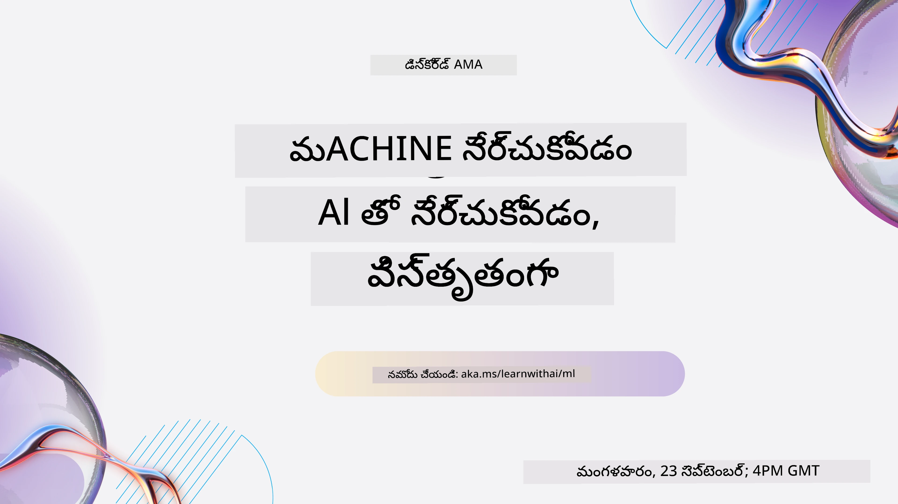
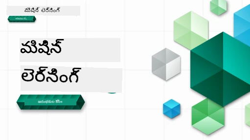

<!--
CO_OP_TRANSLATOR_METADATA:
{
  "original_hash": "ec8385130a8239ad9d827175126a0722",
  "translation_date": "2026-01-01T14:28:26+00:00",
  "source_file": "README.md",
  "language_code": "te"
}
-->

### 🌐 బహుభాషా మద్దతు

#### GitHub Action ద్వారా మద్దతు (ఆటోమేటెడ్ & ఎప్పుడూ అప్-టు-డేట్)

<!-- CO-OP TRANSLATOR LANGUAGES TABLE START -->
[అరబిక్](../ar/README.md) | [బెంగాలీ](../bn/README.md) | [బల్గేరియన్](../bg/README.md) | [బర్మీస్ (మయన్మార్)](../my/README.md) | [చైనీస్ (సరళీకృత)](../zh/README.md) | [చైనీస్ (సాంప్రదాయ, హాంకాంగ్)](../hk/README.md) | [చైనీస్ (సాంప్రదాయ, మకావు)](../mo/README.md) | [చైనీస్ (సాంప్రదాయ, తైవాన్)](../tw/README.md) | [క్రొయేషియన్](../hr/README.md) | [చెక్](../cs/README.md) | [డానిష్](../da/README.md) | [డచ్](../nl/README.md) | [ఎస్తోనియన్](../et/README.md) | [ఫిన్నిష్](../fi/README.md) | [ఫ్రెంచ్](../fr/README.md) | [జర్మన్](../de/README.md) | [గ్రీకు](../el/README.md) | [హెబ్రూ](../he/README.md) | [హిందీ](../hi/README.md) | [హంగేరియన్](../hu/README.md) | [ఇండోనేషియన్](../id/README.md) | [ఇటాలియన్](../it/README.md) | [జపనీస్](../ja/README.md) | [కన్నడ](../kn/README.md) | [కొరియన్](../ko/README.md) | [లిథువేనియన్](../lt/README.md) | [మలయ్](../ms/README.md) | [మలయాళం](../ml/README.md) | [మరాఠీ](../mr/README.md) | [నేపాలి](../ne/README.md) | [నైజీరియన్ పిడ్జిన్](../pcm/README.md) | [నార్వెజియన్](../no/README.md) | [పర్షియన్ (ఫార్సీ)](../fa/README.md) | [పోలిష్](../pl/README.md) | [పోర్టుగీస్ (బ్రజిల్)](../br/README.md) | [పోర్టుగీస్ (పోర్టుగల్)](../pt/README.md) | [పంజాబీ (గుర్ముఖి)](../pa/README.md) | [రొమానియన్](../ro/README.md) | [రష్యన్](../ru/README.md) | [సర్బియన్ (సిరిలిక్)](../sr/README.md) | [స్లోవాక్](../sk/README.md) | [స్లోవేనియన్](../sl/README.md) | [స్పానిష్](../es/README.md) | [స్వాహిలి](../sw/README.md) | [స్వీడిష్](../sv/README.md) | [టాగలోగ్ (ఫిలిపినో)](../tl/README.md) | [తమిళ్](../ta/README.md) | [తెలుగు](./README.md) | [థాయ్](../th/README.md) | [టర్కిష్](../tr/README.md) | [ఉక్రెయిన్](../uk/README.md) | [ఉర్దూ](../ur/README.md) | [వియత్నామీస్](../vi/README.md)
<!-- CO-OP TRANSLATOR LANGUAGES TABLE END -->

#### మా కమ్యూనిటీలో చేరండి

We have a Discord learn with AI series ongoing, learn more and join us at [Learn with AI Series](https://aka.ms/learnwithai/discord) from 18 - 30 September, 2025. You will get tips and tricks of using GitHub Copilot for Data Science.

# ప్రారంభికుల కోసం మెషిన్ లెర్నింగ్ - ఒక పాఠ్యక్రమం

> 🌍 ప్రపంచ సంస్కృతుల ద్వారా మెషిన్ లెర్నింగ్‌ను అన్వేషిస్తూ ప్రపంచాన్ని చుట్టి ప్రయాణించండి 🌍

Microsoft లోని క్లౌడ్ అడ్వొకేట్స్ ఒక 12-వారం, 26-పాఠాల పాఠ్యక్రమాన్ని అందించడం ద్వారా ఆనందంగా ఉన్నారు, ఇది మొత్తం **మెషిన్ లెర్నింగ్** గురించి. ఈ పాఠ్యక్రమంలో, మీరు సాధారణంగా Scikit-learn లైబ్రరీని ఉపయోగించి మరియు డీప్ లెర్నింగ్‌ను తప్పించుకుంటూ, కsometimesాచుకొని "క్లాసిక్ మెషిన్ లెర్నింగ్" అని పిలవబడే విషయాన్ని తెలుసుకుంటారు, డీప్ లెర్నింగ్ గురించి మా [AI ప్రారంభుల పాఠ్యక్రమం](https://aka.ms/ai4beginners) లో వివరించబడింది. ఈ పాఠ్యాల్ని మా ['డేటా సైన్స్ ప్రారంభులకు' పాఠ్యక్రమం](https://aka.ms/ds4beginners) తో జత చేయండి కూడా.

ప్రపంచం చుట్టూ మా ప్రయాణంలో, మేము ఈ క్లాసిక్ సాంకేతికతలను ప్రపంచంలోని అనేక ప్రాంతాల డేటాకు వర్తింపజేస్తున్నాము. ప్రతి పాఠంలో పాఠానికి ముందు మరియు పాఠానికి తరువాత క్విజ్‌లు, పాఠాన్ని పూర్తి చేయడానికి రాసిన సూచనలు, ఒక పరిష్కారం, ఒక అసైన్మెంట్ మరియు మరిన్ని ఉన్నాయి. మా ప్రాజెక్ట్-ఆధారిత పాఠ్య విధానం మీరు నిర్మించడం ద్వారా నేర్చుకోవడానికి అనుమతిస్తుంది, కొత్త నైపుణ్యాలు 'unalకి ఉండటానికి' ఈ provedవ విధానం నిరూపితంగా ఉపయోగపడుతుంది.

**✍️ మా రచయితలకు హృదయపూర్వక కృతజ్ఞతలు** Jen Looper, Stephen Howell, Francesca Lazzeri, Tomomi Imura, Cassie Breviu, Dmitry Soshnikov, Chris Noring, Anirban Mukherjee, Ornella Altunyan, Ruth Yakubu and Amy Boyd

**🎨 మా చిత్రరచయితలకు కూడా ధన్యవాదాలు** Tomomi Imura, Dasani Madipalli, and Jen Looper

**🙏 మా Microsoft Student Ambassador రచయితలు, సమీక్షకులు, మరియు కంటెంట్ సహకారులకు ప్రత్యేక కృతజ్ఞతలు**, ముఖ్యంగా Rishit Dagli, Muhammad Sakib Khan Inan, Rohan Raj, Alexandru Petrescu, Abhishek Jaiswal, Nawrin Tabassum, Ioan Samuila, మరియు Snigdha Agarwal

**🤩 మా R పాఠాల కోసం Microsoft Student Ambassadors Eric Wanjau, Jasleen Sondhi, మరియు Vidushi Gupta గారికి అదనపు కృతజ్ఞతలు!**

# ప్రారంభించడం

ఈ దశలను అనుసరించండి:
1. **రిపొజిటరీని ఫార్క్ చేయండి**: ఈ పేజీ యొక్క పై-కుడి మూలంలో ఉన్న "Fork" బటన్‌పై క్లిక్ చేయండి.
2. **రిపొజిటరీని క్లోన్ చేయండి**:   `git clone https://github.com/microsoft/ML-For-Beginners.git`

> [ఈ కోర్సుకు సంబంధించిన అన్ని అదనపు వనరులను మా Microsoft Learn సేకరణలో కనుగొనండి](https://learn.microsoft.com/en-us/collections/qrqzamz1nn2wx3?WT.mc_id=academic-77952-bethanycheum)

> 🔧 **సహాయం కావాలా?** ఇన్‌స్టాలేషన్, సెటప్ మరియు పాఠాలను నడుపుతున్న సమయంలో సాధారణ సమస్యల పరిష్కారాల కోసం మా [ట్రబుల్‌షూటింగ్ గైడ్](TROUBLESHOOTING.md) ను తనిఖీ చేయండి.

**[విద్యార్థులు](https://aka.ms/student-page)**, ఈ పాఠ్యక్రమాన్ని ఉపయోగించడానికి, మొత్తం రిపోను మీ GitHub ఖాతాకు ఫార్క్ చేయండి మరియు ఒకరితో లేదా సమూహంతో స్వతంత్రంగా వ్యాయామాలను పూర్తి చేయండి:

- పాఠశాల ముందు ఒక ప్రీ-లెక్చర్ క్విజ్‌తో ప్రారంభించండి.
- లెక్చర్‌ను చదవండి మరియు చర్యలను పూర్తి చేయండి, ప్రతి నాలెడ్జ్ చెక్ వద్ద ఆపివేసి ఆలోచించండి.
- పరిష్కార కోడ్‌ని నేరుగా నడిపే పనిని కాకుండా పాఠాలను అర్థం చేసుకుని ప్రాజెక్టులను సృష్టించడానికి ప్రయత్నించండి; అయితే ఆ కోడ్ ప్రతి ప్రాజెక్ట్-ఆధారిత పాఠంలోని `/solution` ఫోల్డర్లలో అందుబాటులో ఉంటుంది.
- పాఠ శేషంలో పోస్ట్-లెక్చర్ క్విజ్ తీసుకోండి.
- చాలెంజ్‌ను పూర్తి చేయండి.
- అసైన్మెంట్‌ను పూర్తి చేయండి.
- ఒక పాఠ గ్రూప్‌ను పూర్తిచేసిన తర్వాత, [చర్చ ఫోరం](https://github.com/microsoft/ML-For-Beginners/discussions) ను సందర్శించి, సరైన PAT రుబ్రిక్‌ని భర్తీచేసి "తెలివిగా నేర్చుకోండి" (learn out loud). 'PAT' అనేది మీరు మీ అభ్యాసాన్ని మరింతగా పెంపొందించుకునేందుకు భర్తీచేసే ఒక ప్రోగ్రెస్ असेస్మెంట్ టూల్ (రుబ్రిక్). మీరు ఇతర PATs పై కూడా స్పందించవచ్చు కాబట్టి మేము కలిసి నేర్చుకోవచ్చు.

> తదుపరి అధ్యయనానికి, ఈ [Microsoft Learn](https://docs.microsoft.com/en-us/users/jenlooper-2911/collections/k7o7tg1gp306q4?WT.mc_id=academic-77952-leestott) మాడ్యూల్స్ మరియు లర్నింగ్ పాథ్‌లను అనుసరించడం మేము సిఫార్సు చేస్తాము.

**ఉపాధ్యాయులు**, ఈ పాఠ్యక్రమాన్ని ఎలా ఉపయోగించాలో మేము [కొన్ని సూచనలను చేర్చాము](for-teachers.md).

---

## వీడియో అవలోకనాలు

కొన్ని పాఠాలు షార్ట్ ఫార్మ్ వీడియోలుగా అందుబాటులో ఉన్నాయి. మీరు ఇవన్ని పాఠాలలో inlineగా కనుగొనవచ్చు, లేదా దిగువ చిత్రం పై క్లిక్ చేయడం ద్వారా [Microsoft Developer YouTube చానల్上的 ML for Beginners ప్లేలిస్ట్](https://aka.ms/ml-beginners-videos) లో పొందవచ్చు.

---

## టీమ్‌ను పరిచయం

**జిఫ్ ద్వారా** [Mohit Jaisal](https://linkedin.com/in/mohitjaisal)

> 🎥 ప్రాజెక్ట్ మరియు దీన్ని సృష్టించిన వారిపై వీడియో కోసం పై చిత్రాన్ని క్లిక్ చేయండి!

---

## పాఠ్య విధానం

ఈ పాఠ్యక్రమాన్ని రూపొందించేటప్పుడు మేము రెండు పాఠ్య సూత్రాలను ఎంచుకున్నాము: ఇది హ్యాండ్స్-ఆన్ గా ఉండాలని, అంటే **ప్రాజెక్ట్-ఆధారిత** ఉండాలని మరియు ఇందులో **తరచుగా క్విజ్‌లు** ఉండాలని. అదనంగా, ఈ పాఠ్యక్రమం ఒక సాధారణ **థీమ్** కలిగి ఉండటం ద్వారా ఒకరీతి సంకలనం పొందుతుంది.

కంటెంట్ ప్రాజెక్ట్‌లతో సరిసమంగా ఉంటుందనడంతో, విద్యార్థులకి ఇది మరింత ఆసక్తికరంగా మారుతుంది మరియు భావనల నిల్వ పెరుగుతుంది. గమనించదగిన విషయం, తరగతి ప్రారంభానికి ముందు ఒక తేలికపాటి క్విజ్ విద్యార్థి శ్రద్ధను ఆ విషయం నేర్చుకునే దిశగా కేంద్రీకరించడానికి సహాయపడుతుంది, మరియు తరగతి తర్వాత రెండో క్విజ్ మరింత నిల్వను నిర్ధారిస్తుంది. ఈ పాఠ్యక్రమం అనుకూలంగా, సరదాగా ఉండ도록 రూపొందించబడింది మరియు మీకు మొత్తం లేదా భాగంగా తీసుకోవడానికి సరిపోతుంది. ప్రాజెక్టులు చిన్నదిగా ప్రారంభమై 12-వారం చక్రానికి చివరికి క్రమేణా క్లిష్టంగా మారతాయి. ఈ పాఠ్యక్రమంలో మెషిన్ లెర్నింగ్ యొక్క యథార్థ ప్రపంచ అనువర్తనాలపై ఒక పోస్ట్‌స్క్రిప్ట్ కూడా ఉంది, దీనిని అదనపు క్రెడిట్ లేదా చర్చకు ఆధారంగా ఉపయోగించవచ్చు.

> మా [నడవడిక నియమాలు](CODE_OF_CONDUCT.md), [సహకారం](CONTRIBUTING.md), [అనువాదం](TRANSLATIONS.md), మరియు [ట్రబుల్‌షూటింగ్](TROUBLESHOOTING.md) మార్గదర్శకాలను కనుగొనండి. మీ నిర్మాణాత్మక ఫీడ్బ్యాక్‌ను మేము స్వాగతిస్తాము!

## ప్రతి పాఠంలో ఉంటాయి

- ఐచ్ఛిక స్కెచ్‌నోట్
- ఐచ్ఛిక సహాయక వీడియో
- వీడియో వాక్‍త్రూ (కొన్ని పాఠాలు మాత్రమే)
- [పాఠానికి ముందు వార్మప్ క్విజ్](https://ff-quizzes.netlify.app/en/ml/)
- రాసిన పాఠం
- ప్రాజెక్ట్-ఆధారిత పాఠాల కోసం, ప్రాజెక్ట్ ఎలా నిర్మించాలో దశల వారీ మార్గదర్శకాలు
- నాలెడ్జ్ చెక్స్
- ఒక చాలెంజ్
- సహాయక పఠనం
- అసైన్మెంట్
- [పాఠానికి తరువాత క్విజ్](https://ff-quizzes.netlify.app/en/ml/)

> **భాషల గురించి ఒక సూచన**: ఈ పాఠాలు ప్రధానంగా Python లో రాసినవి, కానీ చాలా పాఠాలు R లో కూడా అందుబాటులో ఉన్నాయి. R పాఠాన్ని పూర్తి చేయడానికి, `/solution` ఫోల్డర్‌కి వెళ్లి R పాఠాలను చూడండి. అవి `.rmd` ఎగ్జ్టెన్షన్‌ను కలిగి ఉంటాయి, ఇది `R Markdown` ఫైల్‌కు చెందినది, మరియు సాధారణంగా ఇది `code chunks` (R లేదా ఇతర భాషల యొక్క) మరియు ఒక `YAML header` (PDF వంటి అవుట్‌పుట్‌ను ఎలా ఫార్మాట్ చేయాలనే దానిని మార్గదర్శకం చేస్తుంది) ని ఒక `Markdown document` లో ఎంబెడ్ చేయడం అని నిర్వచించవచ్చు. అందువల్ల, ఇది డేటా సైన్స్ కోసం ఒక ఉదాహరణాత్మక రచనా ఫ్రేమ్‌వర్క్‌గా పనిచేస్తుంది ఎందుకంటే ఇది మీ కోడ్, దాని అవుట్‌పుట్, మరియు మీ ఆలోచనలను Markdown లో రాసుకోవడానికి అనుమతిస్తుంది. అదనంగా, R Markdown డాక్యుమెంట్లు PDF, HTML, లేదా Word వంటి అవుట్‌పుట్ ఫార్మాట్స్‌కు రేందర్ చేయబడవచ్చు.

> **క్విజ్‌ల గురించి ఒక సూచన**: అన్ని క్విజ్‌లు [Quiz App ఫోల్డర్](../../quiz-app) లో ఉంచబడ్డాయి, మొత్తం 52 క్విజ్‌లు, ప్రతి ఒక్కదాంట్లో మూడు ప్రశ్నలు ఉన్నాయి. అవి పాఠాలలోని లింక్‌ల ద్వారా పొందుపరచబడ్డాయి కానీ క్విజ్ యాప్‌ను లోకల్‌గా నడపవచ్చు; లోకల్ హోస్ట్ లేదా Azure కు డిప్లాయ్ చేయడానికి `quiz-app` ఫోల్డర్‌లోని సూచనలను అనుసరించండి.

| పాఠం సంఖ్య |                             విషయం                              |                   పాఠ్య సమూహం                   | అధ్యయన లక్ష్యాలు                                                                                                             |                                                              లింక్ చేయబడ్డ పాఠం                                                               |                        రచయిత                        |
| :-----------: | :------------------------------------------------------------: | :-------------------------------------------------: | ------------------------------------------------------------------------------------------------------------------------------- | :--------------------------------------------------------------------------------------------------------------------------------------: | :--------------------------------------------------: |
|      01       |                మెషిన్ లెర్నింగ్‌కు పరిచయం                |      [పరిచయం](1-Introduction/README.md)       | మెషిన్ లెర్నింగ్ వెనుక ఉన్న ప్రాథమిక సూత్రాలను నేర్చుకోండి                                                                                |                                             [పాఠం](1-Introduction/1-intro-to-ML/README.md)                                             |                       Muhammad                       |
|      02       |                మెషిన్ లెర్నింగ్ చరిత్ర                 |      [పరిచయం](1-Introduction/README.md)       | ఈ రంగాన్ని ఆధారపెట్టిన చరిత్రను తెలుసుకోండి                                                                                         |                                            [పాఠం](1-Introduction/2-history-of-ML/README.md)                                            |                     Jen and Amy                      |
|      03       |                 మెషిన్ లెర్నింగ్‌లో న్యాయత                  |      [పరిచయం](1-Introduction/README.md)       | ML మోడల్స్‌ను రూపొందించేటప్పుడు మరియు వర్తింపజేసేటప్పుడు విద్యార్థులు న్యాయత గురించి పరిశీలించవలసిన ముఖ్యమైన తత్వశాస్త్రీయ అంశాలు ఏమిటి? |                                              [పాఠం](1-Introduction/3-fairness/README.md)                                               |                        Tomomi                        |
|      04       |                మెషిన్ లెర్నింగ్ కోసం సాంకేతిక విధానాలు                 |      [పరిచయం](1-Introduction/README.md)       | ML పరిశోధకులు ML మోడల్స్‌ను తయారు చేయడానికి ఏ పద్ధతులను ఉపయోగిస్తారు?                                                                       |                                          [పాఠం](1-Introduction/4-techniques-of-ML/README.md)                                           |                    Chris and Jen                     |
|      05       |                   రెగ్రెషన్‌కు పరిచయం                   |        [రెగ్రెషన్](2-Regression/README.md)         | రెగ్రెషన్ మోడల్స్ కోసం Python మరియు Scikit-learn తో మొదలు పెట్టండి                                                                  |         [Python](2-Regression/1-Tools/README.md) • [R](../../2-Regression/1-Tools/solution/R/lesson_1.html)         |      Jen • Eric Wanjau       |
|      06       |                ఉత్తర అమెరికా గుమ్మడి ధరలు 🎃                |        [రెగ్రెషన్](2-Regression/README.md)         | ML కోసం సిద్ధం చేయడానికి డేటాను విజువలైజ్ చేసి శుభ్రం చేయండి                                                                                  |          [Python](2-Regression/2-Data/README.md) • [R](../../2-Regression/2-Data/solution/R/lesson_2.html)          |      Jen • Eric Wanjau       |
|      07       |                ఉత్తర అమెరికా గుమ్మడి ధరలు 🎃                |        [రెగ్రెషన్](2-Regression/README.md)         | లీనియర్ మరియు పాలినొమియల్ రెగ్రెషన్ మోడల్స్‌ను నిర్మించండి                                                                                   |        [Python](2-Regression/3-Linear/README.md) • [R](../../2-Regression/3-Linear/solution/R/lesson_3.html)        |      Jen and Dmitry • Eric Wanjau       |
|      08       |                ఉత్తర అమెరికా గుమ్మడి ధరలు 🎃                |        [రెగ్రెషన్](2-Regression/README.md)         | లాజిస్టిక్ రెగ్రెషన్ మోడల్ నిర్మించండి                                                                                               |     [Python](2-Regression/4-Logistic/README.md) • [R](../../2-Regression/4-Logistic/solution/R/lesson_4.html)      |      Jen • Eric Wanjau       |
|      09       |                          వెబ్ యాప్ 🔌                          |           [వెబ్ యాప్](3-Web-App/README.md)            | మీ శిక్షణ పొందిన మోడల్ ఉపయోగించడానికి ఒక వెబ్ యాప్ నిర్మించండి                                                                                       |                                                 [Python](3-Web-App/1-Web-App/README.md)                                                  |                         Jen                          |
|      10       |                 వర్గీకరణకు పరిచయం                 |    [వర్గీకరణ](4-Classification/README.md)     | మీ డేటాను శుభ్రపరచండి, సిద్ధం చేయండి మరియు విజువలైజ్ చేయండి; వర్గీకరణకు పరిచయం                                                            | [Python](4-Classification/1-Introduction/README.md) • [R](../../4-Classification/1-Introduction/solution/R/lesson_10.html)  | Jen and Cassie • Eric Wanjau |
|      11       |             రుచికరమైన ఆసియా మరియు భారతీయ వంటకాలు 🍜             |    [వర్గీకరణ](4-Classification/README.md)     | వర్గీకర్తల పరిచయం                                                                                                     | [Python](4-Classification/2-Classifiers-1/README.md) • [R](../../4-Classification/2-Classifiers-1/solution/R/lesson_11.html) | Jen and Cassie • Eric Wanjau |
|      12       |             రుచికరమైన ఆసియా మరియు భారతీయ వంటకాలు 🍜             |    [వర్గీకరణ](4-Classification/README.md)     | ఇంకా వర్గీకర్తలు                                                                                                                | [Python](4-Classification/3-Classifiers-2/README.md) • [R](../../4-Classification/3-Classifiers-2/solution/R/lesson_12.html) | Jen and Cassie • Eric Wanjau |
|      13       |             రుచికరమైన ఆసియా మరియు భారతీయ వంటకాలు 🍜             |    [వర్గీకరణ](4-Classification/README.md)     | మీ మోడల్‌ను ఉపయోగించి ఒక సిఫార్సు చేసే వెబ్ యాప్ నిర్మించండి                                                                                    |                                              [Python](4-Classification/4-Applied/README.md)                                              |                         Jen                          |
|      14       |                   క్లస్టరింగ్‌కు పరిచయం                   |        [క్లస్టరింగ్](5-Clustering/README.md)         | మీ డేటాను శుభ్రపరచండి, సిద్ధం చేయండి మరియు విజువలైజ్ చేయండి; క్లస్టరింగ్‌కు పరిచయం                                                                |         [Python](5-Clustering/1-Visualize/README.md) • [R](../../5-Clustering/1-Visualize/solution/R/lesson_14.html)         |      Jen • Eric Wanjau       |
|      15       |              నైజీరియా సంగీత రుచుల అన్వేషణ 🎧              |        [క్లస్టరింగ్](5-Clustering/README.md)         | K-Means క్లస్టరింగ్ పద్ధతిని అన్వేషించండి                                                                                           |           [Python](5-Clustering/2-K-Means/README.md) • [R](../../5-Clustering/2-K-Means/solution/R/lesson_15.html)           |      Jen • Eric Wanjau       |
|      16       |        నేచురల్ లాంగ్వేజ్ ప్రాసెసింగ్ (NLP)కు పరిచయం ☕️         |   [నేచురల్ లాంగ్వేజ్ ప్రాసెసింగ్](6-NLP/README.md)    | సాదా బాట్ నిర్మిస్తూ NLP గురించి ఆధారభూతాలను నేర్చుకోండి                                                                             |                                             [Python](6-NLP/1-Introduction-to-NLP/README.md)                                              |                       Stephen                        |
|      17       |                      సాధారణ NLP పనులు ☕️                      |   [నేచురల్ లాంగ్వేజ్ ప్రాసెసింగ్](6-NLP/README.md)    | భాషా నిర్మాణాలతో పని చేయడంలో అవసరమయ్యే సాధారణ పనులను అర్థం చేసుకుని మీ NLP జ్ఞానాన్ని లోతుగా చేయండి                          |                                                    [Python](6-NLP/2-Tasks/README.md)                                                     |                       Stephen                        |
|      18       |             అనువాదం మరియు భావన విశ్లేషణ ♥️              |   [నేచురల్ లాంగ్వేజ్ ప్రాసెసింగ్](6-NLP/README.md)    | జేన్ ఆస్టిన్ రచనలతో అనువాదం మరియు భావన విశ్లేషణ                                                                             |                                            [Python](6-NLP/3-Translation-Sentiment/README.md)                                             |                       Stephen                        |
|      19       |                  యూరప్ రొమాంటిక్ హోటల్స్ ♥️                  |   [నేచురల్ లాంగ్వేజ్ ప్రాసెసింగ్](6-NLP/README.md)    | హోటల్ సమీక్షలతో భావన విశ్లేషణ 1                                                                                         |                                               [Python](6-NLP/4-Hotel-Reviews-1/README.md)                                                |                       Stephen                        |
|      20       |                  యూరప్ రొమాంటిక్ హోటల్స్ ♥️                  |   [నేచురల్ లాంగ్వేజ్ ప్రాసెసింగ్](6-NLP/README.md)    | హోటల్ సమీక్షలతో భావన విశ్లేషణ 2                                                                                         |                                               [Python](6-NLP/5-Hotel-Reviews-2/README.md)                                                |                       Stephen                        |
|      21       |            టైమ్ సిరీస్ ఫోరకాస్టింగ్‌కు పరిచయం             |        [టైమ్ సిరీస్](7-TimeSeries/README.md)        | టైమ్ సిరీస్ ఫోరకాస్టింగ్‌కు పరిచయం                                                                                         |                                             [Python](7-TimeSeries/1-Introduction/README.md)                                              |                      Francesca                       |
|      22       | ⚡️ ప్రపంచ విద్యుత్ వినియోగం ⚡️ - ARIMA తో టైమ్ సిరీస్ ఫోరకాస్టింగ్ |        [టైమ్ సిరీస్](7-TimeSeries/README.md)        | ARIMA తో టైమ్ సిరీస్ ఫోరకాస్టింగ్                                                                                              |                                                 [Python](7-TimeSeries/2-ARIMA/README.md)                                                 |                      Francesca                       |
|      23       |  ⚡️ ప్రపంచ విద్యుత్ వినియోగం ⚡️ - SVRతో టైమ్ సిరీస్ ఫోరకాస్టింగ్  |        [టైమ్ సిరీస్](7-TimeSeries/README.md)        | Support Vector Regressorతో టైమ్ సిరీస్ ఫోరకాస్టింగ్                                                                           |                                                  [Python](7-TimeSeries/3-SVR/README.md)                                                  |                       Anirban                        |
|      24       |             రీయిన్ఫోర్స్‌మెంట్ లెర్నింగ్‌కు పరిచయం             | [రీఇన్ఫోర్స్‌మెంట్ లెర్నింగ్](8-Reinforcement/README.md) | Q-Learning తో రీయిన్ఫోర్స్‌మెంట్ లెర్నింగ్ పరిచయం                                                                          |                                             [Python](8-Reinforcement/1-QLearning/README.md)                                              |                        Dmitry                        |
|      25       |                 పీటర్‌ను నక్క నుంచి తప్పించండి! 🐺                  | [రీఇన్ఫోర్స్‌మెంట్ లెర్నింగ్](8-Reinforcement/README.md) | రీయిన్ఫోర్స్‌మెంట్ లెర్నింగ్ జిమ్                                                                                                      |                                                [Python](8-Reinforcement/2-Gym/README.md)                                                 |                        Dmitry                        |
|  Postscript   |            వాస్తవ ప్రపంచ ML పరిస్ధితులు మరియు అనువర్తనాలు            |      [ML in the Wild](9-Real-World/README.md)       | శాస్త్రీయ ML యొక్క ఆసక్తికరమైన మరియు వెలికితీయే వాస్తవ ప్రపంచ అనువర్తనాలు                                                               |                                             [పాఠం](9-Real-World/1-Applications/README.md)                                              |                         జట్టు                         |
|  Postscript   |            RAI డ్యాష్‌బోర్డ్ ఉపయోగించి MLలో మోడల్ డీబగ్గింగ్          |      [ML in the Wild](9-Real-World/README.md)       | Responsible AI డ్యాష్‌బోర్డ్ భాగాలు ఉపయోగించి మెషిన్ లెర్నింగ్‌లో మోడల్ డీబగ్గింగ్                                                              |                                             [పాఠం](9-Real-World/2-Debugging-ML-Models/README.md)                                              |                         Ruth Yakubu                       |

> [ఈ కోర్సు కోసం ఉన్న అన్ని అదనపు వనరులను మా Microsoft Learn సేకరణలో కనుగొనండి](https://learn.microsoft.com/en-us/collections/qrqzamz1nn2wx3?WT.mc_id=academic-77952-bethanycheum)

## ఆఫ్‌లైన్ యాక్సెస్

మీరు ఈ డాక్యుమెంటేషన్‌ను ఆఫ్‌లైన్‌లో నడపడానికి [Docsify](https://docsify.js.org/#/) ఉపయోగించవచ్చు. ఈ రెపోను ఫోర్క్ చేయండి, మీ లోకల్ మెషీన్‌లో [Docsify](https://docsify.js.org/#/quickstart) ను ఇన్‌స్టాల్ చేయండి, ఆ తర్వాత ఈ రెపో యొక్క రూట్ ఫోల్డర్లో `docsify serve` టైప్ చేయండి. వెబ్‌సైట్ మీ లోకల్‌హోస్ట్‌లో పోర్ట్ 3000పై సర్వ్ చేయబడుతుంది: `localhost:3000`.

## PDFలు

పాఠ్యక్రమం యొక్క లింకులతో కూడిన pdf‌ను [ఇక్కడ](https://microsoft.github.io/ML-For-Beginners/pdf/readme.pdf) కనుగొనండి。

## 🎒 ఇతర కోర్సులు 

మా బృందం ఇతర కోర్సులు కూడా రూపొందిస్తుంది! చూడండి:

<!-- CO-OP TRANSLATOR OTHER COURSES START -->
### LangChain

---

### Azure / Edge / MCP / Agents

---
 
### జనరేటివ్ AI సిరీస్

[-9333EA?style=for-the-badge&labelColor=E5E7EB&color=9333EA)](https://github.com/microsoft/Generative-AI-for-beginners-dotnet?WT.mc_id=academic-105485-koreyst)
[-C084FC?style=for-the-badge&labelColor=E5E7EB&color=C084FC)](https://github.com/microsoft/generative-ai-for-beginners-java?WT.mc_id=academic-105485-koreyst)
[-E879F9?style=for-the-badge&labelColor=E5E7EB&color=E879F9)](https://github.com/microsoft/generative-ai-with-javascript?WT.mc_id=academic-105485-koreyst)

---
 
### ప్రధాన అభ్యాసాలు

---
 
### Copilot సిరీస్

<!-- CO-OP TRANSLATOR OTHER COURSES END -->

## సహాయం

మీరు AI యాప్స్ నిర్మిస్తున్నప్పుడు చిక్కుకుపోతే లేదా మీకు ఏదైనా ప్రశ్నలు ఉంటే. MCP గురించి చర్చలలో ఇతర అభ్యాసకులు మరియు అనుభవజ్ఞులైన డెవలపర్లతో చేరండి. ఇది ప్రశ్నలకు స్వాగతం చెప్పే మరియు జ్ఞానాన్ని స్వేచ্ছగా పంచుకునే మద్దతు ఇచ్చే కమ్యూనిటీ.

నిర్మిస్తున్నప్పుడు ఉత్పత్తి ఫీడ్‌బ్యాక్ లేదా లోపాలు ఉంటే సందర్శించండి:

---

<!-- CO-OP TRANSLATOR DISCLAIMER START -->
జవాబుదారీ మినహాయింపు:
ఈ పత్రాన్ని AI అనువాద సేవ [Co-op Translator](https://github.com/Azure/co-op-translator) ఉపయోగించి అనువదించబడింది. మేము ఖచ్చితత్వాన్ని లక్ష్యంగా పెట్టుకున్నప్పటికీ, స్వయంచాలక అనువాదాలలో తప్పులు లేదా లోపాలు ఉండవచ్చని దయచేసి గమనించండి. మూల భాషలోని అసలు పత్రాన్ని అధికారిక మూలంగా పరిగణించాలి. కీలకమైన సమాచారానికి వృత్తిపరమైన మానవ అనువాదాన్ని సూచిస్తాము. ఈ అనువాదాన్ని ఉపయోగించడంలోనుంచి ఏర్పడిన ఏవైనా అపార్థాలు లేదా తప్పుగా అర్థమెంచుకున్నట్లయితే అందుకు మేము బాధ్యత వహించము.
<!-- CO-OP TRANSLATOR DISCLAIMER END -->