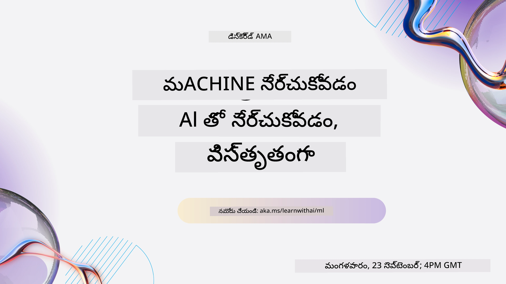
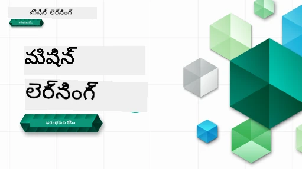

[](https://github.com/microsoft/ML-For-Beginners/blob/master/LICENSE)
[](https://GitHub.com/microsoft/ML-For-Beginners/graphs/contributors/)
[](https://GitHub.com/microsoft/ML-For-Beginners/issues/)
[](https://GitHub.com/microsoft/ML-For-Beginners/pulls/)
[](http://makeapullrequest.com)

[](https://GitHub.com/microsoft/ML-For-Beginners/watchers/)
[](https://GitHub.com/microsoft/ML-For-Beginners/network/)
[](https://GitHub.com/microsoft/ML-For-Beginners/stargazers/)

### 🌐 బహుభాషా మద్దతు

#### GitHub ఆక్షన్ ద్వారా మద్దతు (స్వయంచాలకంగా & ఎల్లప్పుడూ నవీకరించబడుతుంది)

<!-- CO-OP TRANSLATOR LANGUAGES TABLE START -->
[Arabic](../ar/README.md) | [Bengali](../bn/README.md) | [Bulgarian](../bg/README.md) | [Burmese (Myanmar)](../my/README.md) | [Chinese (Simplified)](../zh-CN/README.md) | [Chinese (Traditional, Hong Kong)](../zh-HK/README.md) | [Chinese (Traditional, Macau)](../zh-MO/README.md) | [Chinese (Traditional, Taiwan)](../zh-TW/README.md) | [Croatian](../hr/README.md) | [Czech](../cs/README.md) | [Danish](../da/README.md) | [Dutch](../nl/README.md) | [Estonian](../et/README.md) | [Finnish](../fi/README.md) | [French](../fr/README.md) | [German](../de/README.md) | [Greek](../el/README.md) | [Hebrew](../he/README.md) | [Hindi](../hi/README.md) | [Hungarian](../hu/README.md) | [Indonesian](../id/README.md) | [Italian](../it/README.md) | [Japanese](../ja/README.md) | [Kannada](../kn/README.md) | [Khmer](../km/README.md) | [Korean](../ko/README.md) | [Lithuanian](../lt/README.md) | [Malay](../ms/README.md) | [Malayalam](../ml/README.md) | [Marathi](../mr/README.md) | [Nepali](../ne/README.md) | [Nigerian Pidgin](../pcm/README.md) | [Norwegian](../no/README.md) | [Persian (Farsi)](../fa/README.md) | [Polish](../pl/README.md) | [Portuguese (Brazil)](../pt-BR/README.md) | [Portuguese (Portugal)](../pt-PT/README.md) | [Punjabi (Gurmukhi)](../pa/README.md) | [Romanian](../ro/README.md) | [Russian](../ru/README.md) | [Serbian (Cyrillic)](../sr/README.md) | [Slovak](../sk/README.md) | [Slovenian](../sl/README.md) | [Spanish](../es/README.md) | [Swahili](../sw/README.md) | [Swedish](../sv/README.md) | [Tagalog (Filipino)](../tl/README.md) | [Tamil](../ta/README.md) | [Telugu](./README.md) | [Thai](../th/README.md) | [Turkish](../tr/README.md) | [Ukrainian](../uk/README.md) | [Urdu](../ur/README.md) | [Vietnamese](../vi/README.md)

> **స్థానికంగా క్లోన్ చేయాలనుకుంటున్నారా?**
>
> ఈ రిపోజిటరీ 50కి పైగా భాషా అనువాదాలను కలిగి ఉంది, ఇది డౌన్లోడ్ పరిమాణాన్ని గణనీయంగా పెంచుతుంది. అనువాదాలు లేకుండా క్లోన్ చేయడానికి, స్పార్స్ చెకౌట్ ఉపయోగించండి:
>
> **Bash / macOS / Linux:**
> ```bash
> git clone --filter=blob:none --sparse https://github.com/microsoft/ML-For-Beginners.git
> cd ML-For-Beginners
> git sparse-checkout set --no-cone '/*' '!translations' '!translated_images'
> ```
>
> **CMD (Windows):**
> ```cmd
> git clone --filter=blob:none --sparse https://github.com/microsoft/ML-For-Beginners.git
> cd ML-For-Beginners
> git sparse-checkout set --no-cone "/*" "!translations" "!translated_images"
> ```
>
> ఇది మీరు కోర్సును కంప్లీట్ చేసుకునేందుకు అవసరమైన ప్రతి దానిని చాలా వేగంగా డౌన్లోడ్ చేసుకోవడానికి సహాయపడుతుంది.
<!-- CO-OP TRANSLATOR LANGUAGES TABLE END -->

#### మన కమ్యూనిటీతో చేరండి

[](https://discord.gg/nTYy5BXMWG)

మనకు డిస్కార్డ్లో ఎఐ పాటితంతో నేర్చుకునే సిరీస్ కొనసాగుతోంది, మరింత తెలుసుకోవడానికి మరియు మా తో చేరడానికి [Learn with AI Series](https://aka.ms/learnwithai/discord) ను 2025 సెప్టెంబర్ 18 నుంచి 30 వరకు వీక్షించండి. మీరు GitHub Copilot ను డేటా సైన్స్ కోసం ఉపయోగించే సూచనలు మరియు పద్ధతులు తెలుసుకుంటారు.



# ప్రారంభం నుండి మెషిన్ లెర్నింగ్ - ఒక పాఠ్యాంశం

> 🌍 ప్రపంచ సంస్కృతుల ద్వారా మెషిన్ లెర్నింగ్ ను పరిశీలిస్తూ ప్రపంచం చుట్టూ ప్రయాణించండి 🌍

Microsoft లో క్లౌడ్ అడ్వొకేట్స్ ఒక 12 వారాల, 26 పాఠ్యాంశాల పాఠ్యాంశాన్ని అందిస్తున్నందుకు సంతోషం. ఈ పాఠ్యాంశంలో మీరు కొన్ని సార్లు **సాంప్రదాయ మెషిన్ లెర్నింగ్** అని పిలవబడే విషయం గురించి నేర్చుకుంటారు, ఇందులో ప్రధానంగా Scikit-learn లైబ్రరీ ఉపయోగించి, డీప్ లెర్నింగ్‌ను తప్పించడం జరుగుతుంది, అది మన [AI ప్రారంభ పాఠ్యాంశం](https://aka.ms/ai4beginners) లో ఉంది. ఈ పాఠ్యాంశాలను మన ['డేటా సైన్స్ ప్రారంభ పాఠ్యాంశంతో'](https://aka.ms/ds4beginners) జత చేయండి.

మనతో కలిసి ప్రపంచానికి చుట్టూ ప్రయాణిస్తూ, ఈ సాంప్రదాయ పద్ధతులను ప్రపంచంలోని వివిధ ప్రాంతాల డేటాపై వర్తింపజేస్తాము. ప్రతి పాఠ్యాంశంలో మునుపటి మరియు తరువాత ప్రశ్నలతో కూడిన క్విజ్‌లు, పాఠం పూర్తి చేయడానికి రాత సూచనలు, పరిష్కారం, అసైన్మెంట్ మరియు మరిన్ని ఉంటాయి. మన ప్రాజెక్ట్ ఆధారిత పాఠంచాలన విధానం మీరు నిర్మాణం చేస్తూ నేర్చుకునే తీరు, కొత్త నైపుణ్యాలు నిలిచిపోవడానికి ఉత్తమ మార్గం.

**✍️ మన రచయితలకు హృదయపూర్వక ధన్యవాదాలు** జెన్ లూపర్, స్టీఫెన్ హవెల్, ఫ్రాన్సెస్కా లాజ్జెరి, తమోమీ ఇమురా, క్యాసి బ్రేవియు, డిమిత్రి సోష్నికోфф్, క్రిస్ నోరింగ్, అనిర్బాన్ ముఖర్జీ, ఆర్నెల్లా అల్టున్యాన్, రూత్ యకుబూ మరియు ఎమీ బాయిడ్

**🎨 మన చిత్రకారులకు కూడా ధన్యవాదాలు** తమోమీ ఇమురా, దసాని మడిపల్లి, మరియు జెన్ లూపర్

**🙏 ప్రత్యేక ధన్యవాదాలు 🙏 మన Microsoft స్టూడెంట్ అంబాసిడార్ రచయితలు, సమీక్షకులు, మరియు కంటెంట్ సహకారులకి**, ముఖ్యంగా రిషిట్ దాగ్లి, ముహమ్మద్ సకీబ్ ఖాన్ ఇనాన్, రోజాన్ రాజ్, అలెక్సాండ్రూ పేత్రెస్కూ, అభిషేక్ జయిశ్వాల్, నౌరిన్ టబస్సూమ్, ఇయాన్ స‌మ్యూలా, మరియు స్నిగ్ధా అగర్వాల్

**🤩 Microsoft స్టూడెంట్ అంబాసిడార్లు ఎరిక్ వాంజౌ, జాస్లీన్ సొంధీ, మరియు విద్యుషి గుప్తా వారి R పాఠ్యాంశాలకు అదనపు కృతజ్ఞతలు!**

# ప్రారంభించడం

ఈ చర్యలను అనుసరించండి:
1. **రిపోజిటరీని ఫోర్క్ చేయండి**: ఈ పేజీ పై-కుడి మూలలోని "Fork" బటన్ ను నొక్కండి.
2. **రిపోజిటరీని క్లోన్ చేయండి**:   `git clone https://github.com/microsoft/ML-For-Beginners.git`

> 💡 **త్వరగా ప్రారంభించడానికి చిట్కా:** మీరు స్థానికంగా Python సెటప్ చేయకుండానే బ్రౌజర్ లో ప్రారంభించాలనుకుంటున్నారా? మీ ఫోర్క్ కి క్లౌడ్ అభివృద్ధి పరిసరాన్ని సృష్టించడానికి [GitHub Codespaces](https://github.com/features/codespaces) ను ఉపయోగించండి. ఆకుపచ్చ **Code** మెనూ ఓపెన్ చేసి, **Codespaces** ఎంచుకుని ఒక కోడ్స్పేస్ సృష్టించండి; అవసరమైతే ప్రతి పాఠం కి అవసరమైన డిపెండెన్సీలను ఇంతలోనైనా ఇన్స్టాల్ చేయండి.

> [మోర్ Microsoft Learn సేకరణలో ఈ కోర్సుకు సంబంధించిన అన్ని అదనపు వనరులను ఇక్కడ తెలుసుకోండి](https://learn.microsoft.com/en-us/collections/qrqzamz1nn2wx3?WT.mc_id=academic-77952-bethanycheum)

> 🔧 **సహాయం కావాలా?** సంస్థాపన, సెటప్, మరియు పాఠ్యాంశాలు నడిపే సందర్భంగా సాధారణ సమస్యలకు పరిష్కారాల కోసం మన [Troubleshooting Guide](TROUBLESHOOTING.md) ని చూడండి.


**[స్టూడెంట్లు](https://aka.ms/student-page)**, ఈ పాఠ్యాంశాన్ని ఉపయోగించడానికి, పూర్తి రిపోను మీ GitHub ఖాతాకు ఫోర్క్ చేసి, సాధనలను ఒంటరిగా లేదా గ్రూపు తో పూర్తి చేయండి:

- ముందుగా పాఠం ముందు క్విజ్ ప్రారంభించండి.
- పాఠాన్ని చదవండి మరియు క్రియాక్షమతలు పూర్తి చేయండి, ప్రతి జ్ఞాన తనిఖీ వద్ద ఆగి ఆలోచించండి.
- దయచేసి ప్రత్యామ్నాయ కోడ్‌ను రన్ చేయడానికి కాకుండా పాఠాలు అర్థం చేసుకుని ప్రాజెక్టులు సృష్టించడానికి ప్రయత్నించండి; అయితే ఆ కోడ్ ప్రతీ ప్రాజెక్ట్-ఆధారిత పాఠంలో `/solution` ఫోల్డర్‌లలో అందుబాటులో ఉంటుంది.
- పాఠం తరువాత క్విజ్ ఇవ్వండి.
- ఛాలెంజ్ పూర్తి చేయండి.
- అసైన్మెంట్ పూర్తి చేయండి.
- ఒక పాఠం సమూహాన్ని పూర్తి చేసిన తర్వాత, [Discussion Board](https://github.com/microsoft/ML-For-Beginners/discussions) ను సందర్శించి "గట్టిగా నేర్చుకోండి" అని PAT రుబ్రిక్‌ను పూరించండి. 'PAT' అనేది ప్రగతి అంచనా సాధనం, ఇది మీరు నిక్ యొక్క నేర్చుకుపోవడాన్ని మరింతగా బలోపేతం చేస్తుంది. మీరు ఇతర PATలకు స్పందించవచ్చు, తద్వారా మనం కలిసి నేర్చుకుంటాం.

> మరింత అధ్యయనానికి, ఈ [Microsoft Learn](https://docs.microsoft.com/en-us/users/jenlooper-2911/collections/k7o7tg1gp306q4?WT.mc_id=academic-77952-leestott) మాడ్యూల్స్ మరియు నేర్చుకునే మార్గాలను అనుసరించాలని మేము సూచిస్తున్నాము.

**ఉపాధ్యాయులు**, ఈ పాఠ్యాంశాన్ని ఎలా ఉపయోగించాలో మా వద్ద [కొన్ని సూచనలు](for-teachers.md) ఉన్నాయి.

---

## వీడియో వాక్‌థ్రూస్

కొన్ని పాఠ్యాంశాలు స్వల్పకాల వీడియోలుగా అందుబాటులో ఉంటాయి. మీరు ఇవన్నీ పాఠాల్లోనే లేదా [Microsoft Developer YouTube చానెల్ లో ML for Beginners ప్లేలిస్ట్](https://aka.ms/ml-beginners-videos) లో చూడవచ్చు, కింది చిత్రం నొక్కండి.

[](https://aka.ms/ml-beginners-videos)

---

## జట్టు తో కలసి మాట్లాడండి

[](https://youtu.be/Tj1XWrDSYJU)

**Gif бүтэర్జేస్తారు** [Mohit Jaisal](https://linkedin.com/in/mohitjaisal)

> 🎥 ప్రాజెక్టు మరియు దాన్ని సృష్టించిన వ్యక్తుల గురించి వీడియో కోసం పై చిత్రం నొక్కండి!

---

## పాఠ్య విధానం

ఈ పాఠ్యాంశం రూపొందించినప్పుడు మేము రెండు పాఠ్య విధాన సిద్ధాంతాలను ఎంచుకున్నాము: ఇది చేతితో చేయగలిగిన **ప్రాజెక్ట్ ఆధారిత**గా ఉండాలని మరియు **తరచుగా క్విజ్ లు** ఉండాలని. అదనంగా, ఈ పాఠ్యాంశానికి సారాంశం ఇచ్చే ఒక సాధారణ **థీమ్** ఉంటుంది.

విషయం ప్రాజెక్టులకు అనుగుణంగా ఉండేలా చూసుకోవడం ద్వారా విద్యార్థుల కోసం ప్రక్రియ మరింత ఆసక్తికరంగా మారుతుంది మరియు భావనలు మరింత నిలిచిపోతాయి. ఒక తరగతి ముందు ఒక తక్కువ-పరిధి క్విజ్ విద్యార్థులని ఒక విషయం నేర్చుకోవడానికి ఉద్దేశ్యం ఏర్పరుస్తుంది, తరగతి తర్వాత మరో క్విజ్ మరింత నిలిచిపోవడాన్ని నిర్ధారిస్తుంది. ఈ పాఠ్యాంశం మలుపు తగినది మరియు సరదాగా ఉండేలా రూపకల్పన చేయబడింది మరియు పూర్తి లేదా భాగంగా తీసుకోవచ్చు. ప్రాజెక్టులు చిన్నగా మొదలు కాబడి 12 వారాల సైకిల్ చివరికి మరింత సంక్లిష్టంగా మారతాయి. ఈ పాఠ్యాంశంలో మెషిన్ లెర్నింగ్ యొక్క వాస్తవ ప్రపంచ అనువర్తనాలపై ఒక పూరకాలేఖను కూడా కలిగి ఉంది, దీన్ని అదనపు క్రెడిట్ లేదా చర్చ ఆధారంగా ఉపయోగించవచ్చు.

> మా [Code of Conduct](CODE_OF_CONDUCT.md), [Contributing](CONTRIBUTING.md), [Translations](..), మరియు [Troubleshooting](TROUBLESHOOTING.md) మార్గదర్శకాలు తెలుసుకోండి. మీ నిర్మాణాత్మక ప్రశంసను స్వాగతిస్తున్నాము!

## ప్రతి పాఠం లో ఉంటుంది

- ఐచ్ఛిక స్కెచ్‌నోట్
- ఐచ్ఛిక అదనపు వీడియో
- వీడియో వాక్‌థ్రూ (కొన్ని పాఠాలు మాత్రమే)
- [పాఠం ముందు వార్మప్ క్విజ్](https://ff-quizzes.netlify.app/en/ml/)
- రాత పాఠ్యం
- ప్రాజెక్ట్ ఆధారిత పాఠ్యాల్లో, ప్రాజెక్టు నిర్మాణం ఎలా చేయాలో దశల వారీ మార్గదర్శకాలు
- జ్ఞాన తనిఖీలు
- ఒక ఛాలెంజ్
- అదనపు చదువు
- అసైన్మెంట్
- [పాఠం తర్వాత క్విజ్](https://ff-quizzes.netlify.app/en/ml/)

> **భాషల గురించి ఒక గమనిక**: ఈ పాఠ్యాంశాలు ప్రధానంగా Python లో రాయబడ్డాయి, కానీ కొన్నింటిని R లో కూడా అందుబాటులో ఉన్నాయి. R పాఠ్యాంశాన్ని పూర్తి చేయడానికి `/solution` ఫోల్డర్ లో R పాఠ్యాలు చూడండి. అవి `.rmd` పొడగింపు కలిగి ఉంటాయి, ఇది **R మార్క్డౌన్** ఫైల్ అని సూచిస్తుంది, ఇది `code chunks` (R లేదా ఇతర భాషలలో) మరియు `YAML హెడ్డర్` (PDF లాంటి అవుట్పుట్‌లను ఎలా ఫార్మాట్ చేయాలో సూచించే) తో కూడిన `Markdown డాక్యుమెంట్` రూపంలో ఉంటుంది. దీని వల్ల మీరు మీ కోడ్, అవుట్పుట్ మరియు ఆలోచనలను గమనికలలో నొక్కి రాయకొలవచ్చు. అంతేకాదు, R Markdown డాక్యుమెంట్లు PDF, HTML లేదా Word వంటి అవుట్పుట్ ఫార్మాట్లలోకి మార్చగలవు.

> **క్విజ్‌ల గురించి ఒక గమనిక**: అన్ని క్విజ్‌లూ [Quiz App ఫోల్డర్](../../quiz-app) లో ఉంటాయి, ఇవి 52 మొత్తం క్విజ్‌లు, ఒక్కో క్విజ్‌లో మూడు ప్రశ్నలు ఉంటాయి. అవి పాఠ్యాల్లో లింక్ చేయబడ్డాయి కానీ క్విజ్ యాప్ స్థానికంగా నడుపుకోవచ్చు; `quiz-app` ఫోల్డర్ లో సూచనలు పాటించి స్థానిక హోస్టింగ్ లేదా Azure కి అనువర్తించండి.

| పాఠం సంఖ్య |                             విషయం                              |                   పాఠ గుంపు                   | నేర్చుకునే లక్ష్యాలు                                                                                                             |                                                              లింక్ చేయబడిన పాఠం                                                               |                        రచయిత                        |
| :-----------: | :------------------------------------------------------------: | :-------------------------------------------------: | ------------------------------------------------------------------------------------------------------------------------------- | :--------------------------------------------------------------------------------------------------------------------------------------: | :--------------------------------------------------: |
|      01       |                మెషీన్ లెర్నింగ్ కు పరిచయం                |      [Introduction](1-Introduction/README.md)       | మెషీన్ లెర్నింగ్ వెనుక ఉన్న ప్రాథమిక సూత్రాలు నేర్చుకోండి                                                                                |                                             [Lesson](1-Introduction/1-intro-to-ML/README.md)                                             |                       మహమ్మద్                       |
|      02       |                మెషీన్ లెర్నింగ్ యొక్క చరిత్ర                 |      [Introduction](1-Introduction/README.md)       | ఈ రంగానికి సంబంధించిన చరిత్ర గురించి తెలుసుకోండి                                                                                         |                                            [Lesson](1-Introduction/2-history-of-ML/README.md)                                            |                     జెన్ మరియు ఎమీ                      |
|      03       |                 న్యాయత మరియు మెషీన్ లెర్నింగ్                  |      [Introduction](1-Introduction/README.md)       | మెషీన్ లెర్నింగ్ మోడల్స్ ను నిర్మించడం మరియు వినియోగించడం లో విద్యార్థులు పరిగణించాల్సిన ముఖ్య తాత్విక అంశాలు ఏవి? |                                              [Lesson](1-Introduction/3-fairness/README.md)                                               |                        టోమొమి                        |
|      04       |                మెషీన్ లెర్నింగ్ పద్ధతులు                 |      [Introduction](1-Introduction/README.md)       | మెషీన్ లెర్నింగ్ పరిశోధకులు మెషీన్ లెర్నింగ్ మోడల్స్ నిర్మించడానికి ఏ పద్ధతులు ఉపయోగిస్తారు?                                                                       |                                          [Lesson](1-Introduction/4-techniques-of-ML/README.md)                                           |                    క్రిస్ మరియు జెన్                     |
|      05       |                   రిగ్రెషన్ కు పరిచయం                   |        [Regression](2-Regression/README.md)         | రిగ్రెషన్ మోడల్స్ కోసం Python మరియు Scikit-learn తో ప్రారంభించండి                                                                  |         [Python](2-Regression/1-Tools/README.md) • [R](../../2-Regression/1-Tools/solution/R/lesson_1.html)         |      జెన్ • ఎరిక్ వాంజౌ       |
|      06       |                ఉత్తర అమెరికన్ గుమ్మడికాయ ధరలు 🎃                |        [Regression](2-Regression/README.md)         | మెషీన్ లెర్నింగ్ కోసం డేటాను దృశ్యీకరించి శుభ్రం చేయండి                                                                                  |          [Python](2-Regression/2-Data/README.md) • [R](../../2-Regression/2-Data/solution/R/lesson_2.html)          |      జెన్ • ఎరిక్ వాంజౌ       |
|      07       |                ఉత్తర అమెరికన్ గుమ్మడికాయ ధరలు 🎃                |        [Regression](2-Regression/README.md)         | లీనియర్ మరియు పొలినోమియల్ రిగ్రెషన్ మోడల్స్ నిర్మించండి                                                                                   |        [Python](2-Regression/3-Linear/README.md) • [R](../../2-Regression/3-Linear/solution/R/lesson_3.html)        |      జెన్ మరియు డిమిత్రి • ఎరిక్ వాంజౌ       |
|      08       |                ఉత్తర అమెరికన్ గుమ్మడికాయ ధరలు 🎃                |        [Regression](2-Regression/README.md)         | లాజిస్టిక్ రిగ్రెషన్ మోడల్ నిర్మించండి                                                                                               |     [Python](2-Regression/4-Logistic/README.md) • [R](../../2-Regression/4-Logistic/solution/R/lesson_4.html)      |      జెన్ • ఎరిక్ వాంజౌ       |
|      09       |                          వెబ్ యాప్ 🔌                          |           [Web App](3-Web-App/README.md)            | మీ శిక్షణ పొందిన మోడల్ ఉపయోగించడానికి వెబ్ యాప్ నిర్మించండి                                                                                       |                                                 [Python](3-Web-App/1-Web-App/README.md)                                                  |                         జెన్                          |
|      10       |                 వర్గీకరణకు పరిచయం                 |    [Classification](4-Classification/README.md)     | డేటాను శుభ్రం చేయండి, సిద్ధం చేసుకోండి, దృశ్యీకరించండి; వర్గీకరణకు పరిచయం                                                            | [Python](4-Classification/1-Introduction/README.md) • [R](../../4-Classification/1-Introduction/solution/R/lesson_10.html)  | జెన్ మరియు కాస్సీ • ఎరిక్ వాంజౌ |
|      11       |             రుచికర ఆసియా మరియు భారతీయ వంటకాలు 🍜             |    [Classification](4-Classification/README.md)     | వర్గీకరణయంత్రాలకి పరిచయం                                                                                                     | [Python](4-Classification/2-Classifiers-1/README.md) • [R](../../4-Classification/2-Classifiers-1/solution/R/lesson_11.html) | జెన్ మరియు కాస్సీ • ఎరిక్ వాంజౌ |
|      12       |             రుచికర ఆసియా మరియు భారతీయ వంటకాలు 🍜             |    [Classification](4-Classification/README.md)     | మరిన్ని వర్గీకరణయంత్రాలు                                                                                                                | [Python](4-Classification/3-Classifiers-2/README.md) • [R](../../4-Classification/3-Classifiers-2/solution/R/lesson_12.html) | జెన్ మరియు కాస్సీ • ఎరిక్ వాంజౌ |
|      13       |             రుచికర ఆసియా మరియు భారతీయ వంటకాలు 🍜             |    [Classification](4-Classification/README.md)     | మీ మోడల్ ఉపయోగించి రికమెండర్ వెబ్ యాప్ నిర్మించండి                                                                                    |                                              [Python](4-Classification/4-Applied/README.md)                                              |                         జెన్                          |
|      14       |                   క్లస్టరింగ్ కు పరిచయం                   |        [Clustering](5-Clustering/README.md)         | మీ డేటాను శుభ్రం చేయండి, సిద్ధం చేసుకోండి మరియు దృశ్యీకరించండి; క్లస్టరింగ్ కు పరిచయం                                                                |         [Python](5-Clustering/1-Visualize/README.md) • [R](../../5-Clustering/1-Visualize/solution/R/lesson_14.html)         |      జెన్ • ఎరిక్ వాంజౌ       |
|      15       |              నైజేరియన్ సంగీత రుచులను అన్వేషించడం 🎧              |        [Clustering](5-Clustering/README.md)         | K-మీన్స్ క్లస్టరింగ్ పద్ధతిని అన్వేషించండి                                                                                           |           [Python](5-Clustering/2-K-Means/README.md) • [R](../../5-Clustering/2-K-Means/solution/R/lesson_15.html)           |      జెన్ • ఎరిక్ వాంజౌ       |
|      16       |        సహజ భాషా ప్రాసెసింగ్ కు పరిచయం ☕️         |   [Natural language processing](6-NLP/README.md)    | ఒక సరళమైన బాట్ నిర్మించడం ద్వారా NLP యొక్క ప్రాథమిక విషయాలు నేర్చుకోండి                                                                             |                                             [Python](6-NLP/1-Introduction-to-NLP/README.md)                                              |                       స్తీఫెన్                        |
|      17       |                      సాధారణ NLP ప задач ☕️                      |   [Natural language processing](6-NLP/README.md)    | భాషా నిర్మాణాలతో వ్యవహరించేటప్పుడు అవసరమైన సాధారణ పనులను అర్థం చేసుకోవడం ద్వారా NLP జ్ఞానాన్ని లోతుగా చేయండి                          |                                                    [Python](6-NLP/2-Tasks/README.md)                                                     |                       స్తీఫెన్                        |
|      18       |             అనువాదం మరియు భావ విశ్లేషణ ♥️              |   [Natural language processing](6-NLP/README.md)    | జేన్ ఆస్టెన్ తో అనువాదం మరియు భావ విశ్లేషణ                                                                             |                                            [Python](6-NLP/3-Translation-Sentiment/README.md)                                             |                       స్తీఫెన్                        |
|      19       |                  యూరోప్ రొమాంటిక్ హోటల్స్ ♥️                  |   [Natural language processing](6-NLP/README.md)    | హోటల్ సమీక్షలతో భావ విశ్లేషణ 1                                                                                         |                                               [Python](6-NLP/4-Hotel-Reviews-1/README.md)                                                |                       స్తీఫెన్                        |
|      20       |                  యూరోప్ రొమాంటిక్ హోటల్స్ ♥️                  |   [Natural language processing](6-NLP/README.md)    | హోటల్ సమీక్షలతో భావ విశ్లేషణ 2                                                                                         |                                               [Python](6-NLP/5-Hotel-Reviews-2/README.md)                                                |                       స్తీఫెన్                        |
|      21       |            టైమ్ సిరీస్ ఫోర్కాస్టింగ్ కు పరిచయం             |        [Time series](7-TimeSeries/README.md)        | టైమ్ సిరీస్ ఫోర్కాస్టింగ్ కు పరిచయం                                                                                         |                                             [Python](7-TimeSeries/1-Introduction/README.md)                                              |                      ఫ్రాన్సెస్కా                       |
|      22       | ⚡️ వరల్డ్ పవర్ వినియోగం ⚡️ - ARIMA తో టైమ్ సిరీస్ ఫోర్కాస్టింగ్ |        [Time series](7-TimeSeries/README.md)        | ARIMA తో టైమ్ సిరీస్ ఫోర్కాస్టింగ్                                                                                              |                                                 [Python](7-TimeSeries/2-ARIMA/README.md)                                                 |                      ఫ్రాన్సెస్కా                       |
|      23       |  ⚡️ వరల్డ్ పవర్ వినియోగం ⚡️ - SVR తో టైమ్ సిరీస్ ఫోర్కాస్టింగ్  |        [Time series](7-TimeSeries/README.md)        | సపోర్ట్ వెక్టర్ రిగ్రెషర్ తో టైమ్ సిరీస్ ఫోర్కాస్టింగ్                                                                           |                                                  [Python](7-TimeSeries/3-SVR/README.md)                                                  |                       అనిర్బన్                        |
|      24       |             రీఇన్ఫోర్స్‌మెంట్ లెర్నింగ్ కు పరిచయం             | [Reinforcement learning](8-Reinforcement/README.md) | Q-లెర్నింగ్ తో రీఇన్ఫోర్స్‌మెంట్ లెర్నింగ్ కు పరిచయం                                                                          |                                             [Python](8-Reinforcement/1-QLearning/README.md)                                              |                        డిమిత్రి                        |
|      25       |                 పీటర్ కుప్పకూలును తప్పించుకో! 🐺                  | [Reinforcement learning](8-Reinforcement/README.md) | రీఇన్ఫోర్స్‌మెంట్ లెర్నింగ్ జిమ్                                                                                                      |                                                [Python](8-Reinforcement/2-Gym/README.md)                                                 |                        డిమిత్రి                        |
|  Postscript   |            వాస్తవ ప్రపంచ ML సందర్భాలు మరియు అనువర్తనాలు            |      [ML in the Wild](9-Real-World/README.md)       | క్లాసికల్ ML యొక్క ఆసక్తికరమైన మరియు తెలియజేసే వాస్తవ ప్రపంచ అనువర్తనాలు                                                               |                                             [Lesson](9-Real-World/1-Applications/README.md)                                              |                         బృందం                         |
|  Postscript   |            RAI డాష్‌బోర్డ్ ఉపయోగించి ML లో మోడల్ డీబగింగ్            |      [ML in the Wild](9-Real-World/README.md)       | రిస్పాన్సిబుల్ AI డాష్‌బోర్డ్ భాగాలను ఉపయోగించి మెషీన్ లెర్నింగ్‌లో మోడల్ డీబగింగ్                                                              |                                             [Lesson](9-Real-World/2-Debugging-ML-Models/README.md)                                              |                     రూత్ యకుబు                      |

> [ఈ కోర్సుకు సంబంధించి అన్ని అదనపు వనరు లను మా Microsoft Learn సేకరణలో కనుగొనండి](https://learn.microsoft.com/en-us/collections/qrqzamz1nn2wx3?WT.mc_id=academic-77952-bethanycheum)

## ఆఫ్‌లైన్ యాక్సెస్

మీరు [Docsify](https://docsify.js.org/#/) ఉపయోగించి ఈ డాక్యుమెంటేషన్‌ను ఆఫ్‌లైన్ లో నిర్వహించవచ్చు. ఈ రెपोను ఫోర్క్ చేయండి, మీ స్థానిక మెషీన్ లో [Docsify ను ఇన్స్టాల్ చేయండి](https://docsify.js.org/#/quickstart), తరువాత ఈ రెపో రూట్ ఫోల్డర్ లో, `docsify serve` టైపు చేయండి. ఈ వెబ్‌సైట్ పోర్ట్ 3000 లో మీ లోకల్ హోస్టు లో సర్వ్ చేయబడుతుంది: `localhost:3000`.

## PDFలు

లంకెలతో కూడిన అమరికల pdfను [ఇక్కడ](https://microsoft.github.io/ML-For-Beginners/pdf/readme.pdf) పొందండి.


## 🎒 ఇతర కోర్సులు 

మా బృందం ఇతర కోర్సులను ఉత్పత్తి చేస్తోంది! చూడండి:

<!-- CO-OP TRANSLATOR OTHER COURSES START -->
### LangChain
[](https://aka.ms/langchain4j-for-beginners)
[](https://aka.ms/langchainjs-for-beginners?WT.mc_id=m365-94501-dwahlin)
[](https://github.com/microsoft/langchain-for-beginners?WT.mc_id=m365-94501-dwahlin)
---

### Azure /<Edge / MCP / ఏజెంట్లు
[](https://github.com/microsoft/AZD-for-beginners?WT.mc_id=academic-105485-koreyst)
[](https://github.com/microsoft/edgeai-for-beginners?WT.mc_id=academic-105485-koreyst)
[](https://github.com/microsoft/mcp-for-beginners?WT.mc_id=academic-105485-koreyst)
[](https://github.com/microsoft/ai-agents-for-beginners?WT.mc_id=academic-105485-koreyst)

---
 
### జనరేటివ్ AI సిరీస్
[](https://github.com/microsoft/generative-ai-for-beginners?WT.mc_id=academic-105485-koreyst)
[-9333EA?style=for-the-badge&labelColor=E5E7EB&color=9333EA)](https://github.com/microsoft/Generative-AI-for-beginners-dotnet?WT.mc_id=academic-105485-koreyst)
[-C084FC?style=for-the-badge&labelColor=E5E7EB&color=C084FC)](https://github.com/microsoft/generative-ai-for-beginners-java?WT.mc_id=academic-105485-koreyst)
[-E879F9?style=for-the-badge&labelColor=E5E7EB&color=E879F9)](https://github.com/microsoft/generative-ai-with-javascript?WT.mc_id=academic-105485-koreyst)

---
 
### ప్రాథమిక అభ్యాసం
[](https://aka.ms/ml-beginners?WT.mc_id=academic-105485-koreyst)
[](https://aka.ms/datascience-beginners?WT.mc_id=academic-105485-koreyst)
[](https://aka.ms/ai-beginners?WT.mc_id=academic-105485-koreyst)
[](https://github.com/microsoft/Security-101?WT.mc_id=academic-96948-sayoung)
[](https://aka.ms/webdev-beginners?WT.mc_id=academic-105485-koreyst)
[](https://aka.ms/iot-beginners?WT.mc_id=academic-105485-koreyst)
[](https://github.com/microsoft/xr-development-for-beginners?WT.mc_id=academic-105485-koreyst)

---
 
### కప్లోట్ సిరీస్
[](https://aka.ms/GitHubCopilotAI?WT.mc_id=academic-105485-koreyst)
[](https://github.com/microsoft/mastering-github-copilot-for-dotnet-csharp-developers?WT.mc_id=academic-105485-koreyst)
[](https://github.com/microsoft/CopilotAdventures?WT.mc_id=academic-105485-koreyst)
<!-- CO-OP TRANSLATOR OTHER COURSES END -->

## సహాయం ఎలా పొందాలి

మీరు మెషీన్ లెర్నింగ్ నేర్చుకుంటూ లేదా AI అనువర్తనాలు నిర్మిస్తునప్పుడు ఇబ్బందులు లేదా సందేహాలు ఎదురైతే, భయపడాలి లేదు — సహాయం అందుబాటులో ఉంది.

మీరు ఇతర అభ్యాసకులు మరియు అభివృద్ధిదారులతో చర్చల్లో చేరవచ్చు, ప్రశ్నలు అడగవచ్చు, మరియు మీ ఆలోచనలను సంఘంతో పంచుకోవచ్చు.

- ప్రశ్నలు అడిగి ఇతరులతో కలిసి నేర్చుకోవడానికి సంఘంలో చేరండి
- మెషీన్ లెర్నింగ్ సూత్రాలు మరియు ప్రాజెక్టు ఐడియాలు చర్చించండి
- అనుభవజ్ఞులైన అభివృద్ధిదారుల నుండి మార్గనిర్దేశం పొందండి

ఒక మద్దతుగా ఉన్న సంఘం మీ నైపుణ్యాలను పెంపొందించడానికి మరియు సమస్యలను త్వరగా పరిష్కరించడానికి మంచి మార్గం.

[Microsoft Foundry Discord సంఘం](https://discord.gg/nTYy5BXMWG)

మీరు బగ్స్, పొరపాట్లు లేదా అభివృద్ధికి సూచనలు పరిగణించాలనుకుంటే, ఈ రిపాజిటరీలో **Issue** తెరవండి మరియు సమస్యను నివేదించండి.

ఉత్పత్తి ఫీడ్‌బ్యాక్ కోసం లేదా ఇప్పటికే ఉన్న సంఘం పోస్టులను శోధించేందుకు, అభివృద్ధిదారుల ఫోరమ్ ని సందర్శించండి:

[](https://aka.ms/foundry/forum)

## అదనపు అభ్యాస సూచనలు

- ప్రతి పాఠం తర్వాత నోటుబుక్స్ ను సమీక్షించండి, మంచితనాన్ని పెంపొందించడానికి.
- స్వయంగా అల్గోరిథములు అమలు చేయడం సాధన చేయండి.
- నేర్చుకున్న సూత్రాలతో వాస్తవ ప్రపంచ డేటాస్ట్స్ ను అన్వేషించండి.

---

<!-- CO-OP TRANSLATOR DISCLAIMER START -->
**అస్వీకరణ**:
ఈ పత్రం AI అనువాద సేవ [Co-op Translator](https://github.com/Azure/co-op-translator) ఉపయోగించి అనువదించబడింది. మేము ఖచ్చితత్వానికి ప్రయత్నిస్తున్నప్పటికీ, ఆటోమేటెడ్ అనువాదాలు తప్పులు లేదా అసమగ్రతలను కలిగి ఉండవచ్చు. దాని స్వదేశ భాషలో ఉన్న అసలు పత్రాన్ని అధికారం కలిగిన మూలంగా పరిగణించాలి. కీలకమైన సమాచారం కోసం, ప్రొఫెషనల్ మానవ అనువాదాన్ని సిఫారసు చేస్తాము. ఈ అనువాదం ఉపయోగం వల్ల కలిగే ఏవైనా అపార్థాలు లేదా తప్పుదారులు కోసం మేము బాధ్యత వహించము.
<!-- CO-OP TRANSLATOR DISCLAIMER END -->