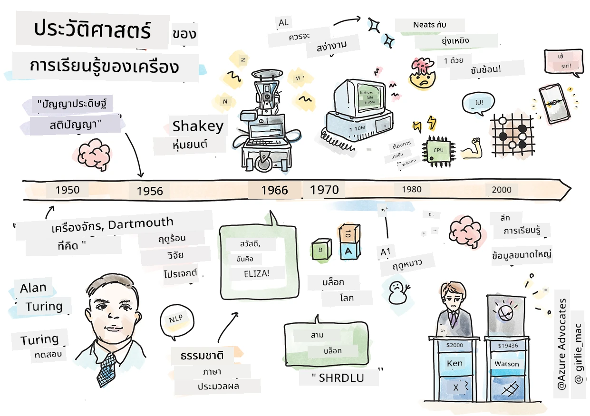
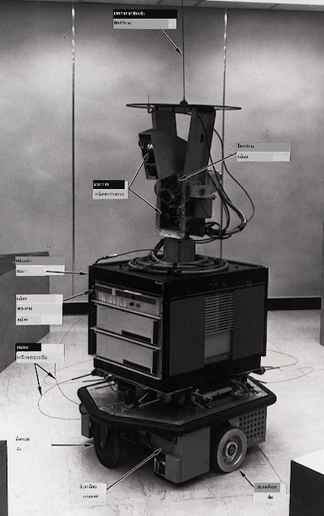
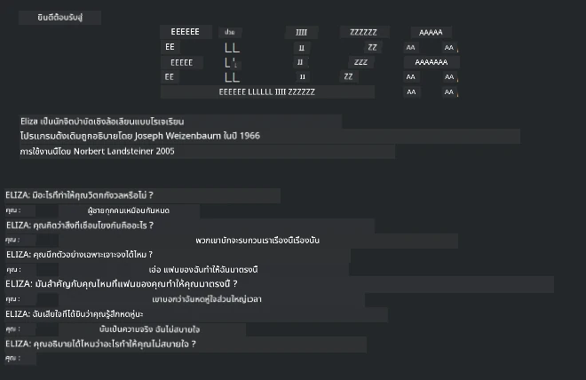

# ประวัติของการเรียนรู้ของเครื่อง

> สเก็ตช์โน้ตโดย [Tomomi Imura](https://www.twitter.com/girlie_mac)

## [แบบทดสอบก่อนเรียน](https://ff-quizzes.netlify.app/en/ml/)

---

> 🎥 คลิกรูปภาพด้านบนเพื่อดูวิดีโอสั้นๆ ที่อธิบายบทเรียนนี้

ในบทเรียนนี้ เราจะเดินผ่านเหตุการณ์สำคัญในประวัติศาสตร์ของการเรียนรู้ของเครื่องและปัญญาประดิษฐ์

ประวัติศาสตร์ของปัญญาประดิษฐ์ (AI) ในฐานะสาขาหนึ่งเชื่อมโยงกับประวัติศาสตร์ของการเรียนรู้ของเครื่อง เนื่องจากอัลกอริทึมและความก้าวหน้าทางคอมพิวเตอร์ที่รองรับ ML ส่งผลต่อการพัฒนา AI สิ่งสำคัญคือจำไว้ว่าขณะที่สาขาเหล่านี้เริ่มก่อตัวเป็นหน่วยการศึกษาแยกต่างหากในปี 1950 การค้นพบที่สำคัญทาง [อัลกอริทึม สถิติ คณิตศาสตร์ คอมพิวเตอร์ และเทคนิค](https://wikipedia.org/wiki/Timeline_of_machine_learning) นั้นมีมาก่อนและทับซ้อนกับยุคนี้ ในความเป็นจริง คนได้คิดเกี่ยวกับคำถามเหล่านี้มายาวนาน [หลายร้อยปี](https://wikipedia.org/wiki/History_of_artificial_intelligence): บทความนี้พูดถึงรากฐานทางปัญญาประวัติศาสตร์ของแนวคิด 'เครื่องคิด'

---
## การค้นพบที่น่าจดจำ

- 1763, 1812 [ทฤษฎีเบย์](https://wikipedia.org/wiki/Bayes%27_theorem) และหลักการก่อนหน้า ทฤษฎีนี้และการประยุกต์ใช้ช่วยในการอนุมาน โดยอธิบายความน่าจะเป็นของเหตุการณ์โดยอิงจากความรู้ก่อนหน้า
- 1805 [ทฤษฎีผลรวมกำลังสองน้อยที่สุด](https://wikipedia.org/wiki/Least_squares) โดยนักคณิตศาสตร์ชาวฝรั่งเศส Adrien-Marie Legendre ทฤษฎีนี้ซึ่งคุณจะได้เรียนรู้ในบทเรียน การถดถอย ช่วยในเรื่องการฟิตข้อมูล
- 1913 [โซ่ของมาร์คอฟ](https://wikipedia.org/wiki/Markov_chain), ตั้งชื่อตามนักคณิตศาสตร์รัสเซีย Andrey Markov ใช้บรรยายลำดับของเหตุการณ์ที่อาจเกิดขึ้นโดยอิงกับสถานะก่อนหน้า
- 1957 [เปอร์เซปตรอน](https://wikipedia.org/wiki/Perceptron) เป็นตัวจำแนกเชิงเส้นที่คิดค้นโดยนักจิตวิทยาชาวอเมริกัน Frank Rosenblatt ซึ่งเป็นพื้นฐานของความก้าวหน้าด้านการเรียนรู้เชิงลึก

---

- 1967 [เพื่อนบ้านที่ใกล้ที่สุด](https://wikipedia.org/wiki/Nearest_neighbor) เป็นอัลกอริทึมที่ออกแบบมาเพื่อแม็ปรถเส้นทาง ด้าน ML ใช้ตรวจจับรูปแบบ
- 1970 [การส่งค่ากลับ](https://wikipedia.org/wiki/Backpropagation) ใช้ฝึก [เครือข่ายประสาทเทียมแบบป้อนตรง](https://wikipedia.org/wiki/Feedforward_neural_network)
- 1982 [เครือข่ายประสาทเทียมแบบวนรอบ](https://wikipedia.org/wiki/Recurrent_neural_network) เป็นเครือข่ายประสาทเทียมที่สืบทอดมาจากเครือข่ายป้อนตรงซึ่งสร้างกราฟเชิงเวลาช่วง

✅ ลองค้นคว้าดูบ้าง วันเวลาอื่นอะไรที่โดดเด่นในประวัติศาสตร์ของ ML และ AI บ้าง?

---
## 1950: เครื่องจักรที่คิดได้

อลัน ทูริง บุคคลที่น่าทึ่งซึ่งได้รับเลือก [โดยสาธารณะในปี 2019](https://wikipedia.org/wiki/Icons:_The_Greatest_Person_of_the_20th_Century) ให้เป็นนักวิทยาศาสตร์ที่ยิ่งใหญ่ที่สุดแห่งศตวรรษที่ 20 ถือว่าเป็นผู้วางรากฐานแนวคิด 'เครื่องจักรที่สามารถคิด' เขาต่อสู้กับผู้ไม่เชื่อตัวเองและต้องการหลักฐานจากประสบการณ์เกี่ยวกับแนวคิดนี้บางส่วนโดยการสร้าง [การทดสอบทูริง](https://www.bbc.com/news/technology-18475646) ซึ่งคุณจะได้สำรวจในบทเรียน NLP ของเรา

---
## 1956: โครงการวิจัยฤดูร้อนที่ดาร์ตเมาท์

"โครงการวิจัยฤดูร้อนที่ดาร์ตเมาท์เกี่ยวกับปัญญาประดิษฐ์เป็นเหตุการณ์สำคัญสำหรับ AI ในฐานะสาขา" และที่นี่คือจุดที่คำว่า 'ปัญญาประดิษฐ์' ถูกตั้งขึ้น ([แหล่งที่มา](https://250.dartmouth.edu/highlights/artificial-intelligence-ai-coined-dartmouth))

> ทุกแง่มุมของการเรียนรู้หรือคุณลักษณะอื่น ๆ ของปัญญาในหลักการสามารถอธิบายได้อย่างแม่นยำจนสามารถสร้างเครื่องจักรที่เลียนแบบได้

---

หัวหน้าคณะวิจัย อาจารย์คณิตศาสตร์ John McCarthy หวังว่า "จะดำเนินการบนสมมติฐานที่ว่าทุกแง่มุมของการเรียนรู้หรือคุณลักษณะอื่นของปัญญาในหลักการสามารถอธิบายได้อย่างแม่นยำจนสามารถสร้างเครื่องเลียนแบบได้" ผู้เข้าร่วมรวมถึงผู้มีชื่อเสียงอีกคนในสาขา Marvin Minsky

เวิร์กช็อปนี้ได้รับเครดิตในการริเริ่มและส่งเสริมการสนทนาเรื่องต่าง ๆ รวมถึง "การเกิดของวิธีสัญลักษณ์ ระบบที่เน้นโดเมนจำกัด (ระบบผู้เชี่ยวชาญยุคแรก) และระบบอนุมานเทียบกับระบบนิรนัย" ([แหล่งที่มา](https://wikipedia.org/wiki/Dartmouth_workshop))

---
## 1956 - 1974: "ปีทอง"

ตั้งแต่ปี 1950 ถึงกลางทศวรรษ 70 ความหวังสูงมากว่า AI จะแก้ปัญหามากมายได้ ในปี 1967 Marvin Minsky กล่าวว่าอย่างมั่นใจว่า "ภายในหนึ่งรุ่น... ปัญหาการสร้าง 'ปัญญาประดิษฐ์' จะถูกแก้ไขอย่างมีนัยสำคัญ" (Minsky, Marvin (1967), Computation: Finite and Infinite Machines, Englewood Cliffs, N.J.: Prentice-Hall)

งานวิจัยด้านการประมวลผลภาษาธรรมชาติเจริญรุ่งเรือง การค้นหาถูกพัฒนาให้ดีขึ้นและมีประสิทธิภาพกว่าเดิม และแนวคิด 'ไมโครเวิลด์' ถูกสร้างขึ้น ซึ่งงานง่ายๆ สำเร็จโดยใช้คำสั่งภาษาธรรมดา

---

งานวิจัยได้รับทุนสนับสนุนอย่างดีจากหน่วยงานรัฐบาล มีความก้าวหน้าในเรื่องการคำนวณและอัลกอริทึม และมีการสร้างต้นแบบเครื่องจักรอัจฉริยะ บางเครื่องมีดังนี้:

* [Shakey หุ่นยนต์](https://wikipedia.org/wiki/Shakey_the_robot) ผู้สามารถเคลื่อนที่และตัดสินใจทำงานได้อย่าง 'ชาญฉลาด'

    
    > Shakey ในปี 1972

---

* Eliza บอทประเภท 'แชทเตอร์บอท' ยุคแรกที่สามารถสนทนากับคนและทำหน้าที่เป็น 'นักบำบัด' ขั้นพื้นฐาน คุณจะได้เรียนรู้เพิ่มเติมเกี่ยวกับ Eliza ในบทเรียน NLP

    
    > รุ่นหนึ่งของ Eliza แชทบอท

---

* "โลกของบล็อก" เป็นตัวอย่างของไมโครเวิลด์ซึ่งบล็อกสามารถเรียงซ้อนและจัดเรียงได้ และทดลองสอนเครื่องให้ตัดสินใจได้ ความก้าวหน้าที่สร้างด้วยไลบรารีเช่น [SHRDLU](https://wikipedia.org/wiki/SHRDLU) ช่วยผลักดันการประมวลผลภาษาให้ก้าวหน้า

    

    > 🎥 คลิกรูปภาพด้านบนเพื่อดูวิดีโอ: โลกของบล็อกกับ SHRDLU

---
## 1974 - 1980: "ฤดูหนาว AI"

ภายในกลางทศวรรษ 1970 ปรากฏชัดว่าความซับซ้อนในการสร้าง 'เครื่องชาญฉลาด' ถูกประเมินต่ำเกินไปและสัญญาที่มีอยู่ โดยเฉพาะกับกำลังคำนวณที่มีอยู่ ถูกพูดเกินจริง การระดมทุนลดลงและความมั่นใจในสาขานี้ลดลง ปัญหาบางอย่างที่ส่งผลต่อความมั่นใจได้แก่:
---
- **ข้อจำกัด**. กำลังคำนวณมีจำกัดมาก
- **การระเบิดของพารามิเตอร์**. จำนวนพารามิเตอร์ที่ต้องฝึกเพิ่มขึ้นอย่างมากเมื่อความต้องการจากคอมพิวเตอร์เพิ่มขึ้น โดยกำลังคำนวณและความสามารถไม่ได้พัฒนาไปพร้อมกัน
- **ขาดแคลนข้อมูล**. ข้อมูลมีจำกัดซึ่งขัดขวางกระบวนการทดลอง พัฒนา และปรับปรุงอัลกอริทึม
- **เราถามคำถามถูกต้องหรือ?**. คำถามที่ถูกถามเริ่มถูกตั้งคำถาม นักวิจัยถูกวิจารณ์เรื่องแนวทางของตน:
  - การทดสอบทูริงถูกวิพากษ์วิจารณ์ด้วยแนวคิดที่หลากหลาย เช่น ทฤษฎี 'ห้องจีน' ที่ระบุว่า "การเขียนโปรแกรมคอมพิวเตอร์ดิจิทัลอาจทำให้ดูเหมือนเข้าใจภาษาแต่ไม่สามารถสร้างความเข้าใจจริง" ([แหล่งที่มา](https://plato.stanford.edu/entries/chinese-room/))
  - จริยธรรมในการนำปัญญาประดิษฐ์เช่น "นักบำบัด" ELIZA เข้าสู่สังคมถูกตั้งคำถาม

---

พร้อมกันนั้น แวดวงความคิด AI เริ่มก่อตัวขึ้น ระหว่างแนวทาง ["scruffy" กับ "neat AI"](https://wikipedia.org/wiki/Neats_and_scruffies) ห้องแล็บแบบ _scruffy_ ปรับโปรแกรมนานหลายชั่วโมงจนได้ผลลัพธ์ที่ต้องการ ห้องแล็บแบบ _neat_ "เน้นตรรกะและการแก้ปัญหาอย่างเป็นทางการ" ELIZA และ SHRDLU เป็นระบบ _scruffy_ ที่รู้จักกันดี ในทศวรรษ 1980 เมื่อความต้องการทำให้ระบบ ML ทำซ้ำได้มากขึ้น แนวทาง _neat_ ค่อยๆ ได้รับความนิยมมากขึ้นเนื่องจากผลลัพธ์อธิบายได้ชัดเจนกว่า

---
## ระบบผู้เชี่ยวชาญในยุค 1980

เมื่อสาขานี้เติบโต ประโยชน์ต่อธุรกิจก็ชัดเจนขึ้น และในทศวรรษ 1980 ระบบผู้เชี่ยวชาญแพร่หลายขึ้น "ระบบผู้เชี่ยวชาญถือเป็นหนึ่งในซอฟต์แวร์ปัญญาประดิษฐ์ (AI) ที่ประสบความสำเร็จจริงครั้งแรก" ([แหล่งที่มา](https://wikipedia.org/wiki/Expert_system))

ระบบประเภทนี้เป็นระบบ _ผสม_ ประกอบด้วยเครื่องมือกฎที่ระบุข้อกำหนดทางธุรกิจบางส่วน และเครื่องมืออนุมานที่ใช้กฎเหล่านี้ในการสรุปข้อเท็จจริงใหม่

ยุคนี้ยังเห็นความสนใจที่เพิ่มขึ้นในเครือข่ายประสาทเทียม

---
## 1987 - 1993: ช่วง 'เย็น' ของ AI

การแพร่หลายของฮาร์ดแวร์ระบบผู้เชี่ยวชาญเฉพาะทางทำให้เกิดความเชี่ยวชาญมากเกินไป การขึ้นของคอมพิวเตอร์ส่วนบุคคลก็แข่งขันกับระบบขนาดใหญ่เฉพาะทางแบบรวมศูนย์นี้ การกระจายการใช้งานคอมพิวเตอร์เริ่มขึ้น และท้ายที่สุดเป็นทางไปสู่การลุกฮือของข้อมูลขนาดใหญ่ในยุคปัจจุบัน

---
## 1993 - 2011

ยุคนี้เป็นยุคใหม่ของ ML และ AI ที่สามารถแก้ปัญหาบางอย่างที่เกิดจากการขาดข้อมูลและกำลังคำนวณมาก่อน จำนวนข้อมูลเพิ่มขึ้นอย่างรวดเร็วและแพร่หลายมากขึ้น ทั้งด้านดีและด้านร้าย โดยเฉพาะอย่างยิ่งกับการมาของสมาร์ตโฟนประมาณปี 2007 กำลังคำนวณเพิ่มขึ้นอย่างทวีคูณ และอัลกอริทึมพัฒนาขึ้นควบคู่ สาขานี้เริ่มมีความเป็นวินัยอย่างแท้จริงจากวันที่เป็นอิสระในอดีต

---
## ปัจจุบัน

วันนี้การเรียนรู้ของเครื่องและ AI เข้าถึงเกือบทุกด้านของชีวิตเรา ยุคนี้เรียกร้องการเข้าใจอย่างรอบคอบถึงความเสี่ยงและผลกระทบที่อัลกอริทึมเหล่านี้มีต่อชีวิตมนุษย์ ตามที่ Brad Smith จากไมโครซอฟท์กล่าวว่า "เทคโนโลยีสารสนเทศก่อให้เกิดปัญหาที่เกี่ยวข้องกับการคุ้มครองสิทธิมนุษยชนพื้นฐาน เช่น ความเป็นส่วนตัวและเสรีภาพในการแสดงออก ปัญหาเหล่านี้เพิ่มความรับผิดชอบให้แก่บริษัทเทคโนโลยีที่สร้างผลิตภัณฑ์เหล่านี้ ในมุมมองของเรา ยังเรียกร้องการควบคุมทางรัฐบาลที่รอบคอบและการพัฒนามาตรฐานรอบการใช้ที่ยอมรับได้" ([แหล่งที่มา](https://www.technologyreview.com/2019/12/18/102365/the-future-of-ais-impact-on-society/))

---

ยังไม่อาจบอกได้ว่าอนาคตจะเป็นอย่างไร แต่สิ่งสำคัญคือการเข้าใจระบบคอมพิวเตอร์และซอฟต์แวร์และอัลกอริทึมที่พวกเขาใช้งาน เราหวังว่าหลักสูตรนี้จะช่วยให้คุณเข้าใจมากขึ้นเพื่อที่คุณจะได้ตัดสินใจด้วยตัวเอง

> 🎥 คลิกรูปภาพด้านบนเพื่อดูวิดีโอ: Yann LeCun พูดถึงประวัติของการเรียนรู้เชิงลึกในบทเรียนนี้

---
## 🚀ความท้าทาย

ลงลึกในช่วงเวลาประวัติศาสตร์หนึ่งช่วงนี้และเรียนรู้เพิ่มเติมเกี่ยวกับผู้คนเบื้องหลัง มีตัวละครที่น่าตื่นเต้น และไม่มีการค้นพบทางวิทยาศาสตร์ใดเกิดขึ้นในสุญญากาศทางวัฒนธรรม คุณค้นพบอะไรบ้าง?

## [แบบทดสอบหลังเรียน](https://ff-quizzes.netlify.app/en/ml/)

---
## ทบทวน & เรียนรู้ด้วยตนเอง

นี่คือรายการที่ควรดูและฟัง:

[พอดแคสต์ที่ Amy Boyd พูดถึงวิวัฒนาการของ AI](http://runasradio.com/Shows/Show/739)

---

## การบ้าน

[สร้างไทม์ไลน์](assignment.md)

---

<!-- CO-OP TRANSLATOR DISCLAIMER START -->
**ปฏิเสธความรับผิดชอบ**:
เอกสารนี้ได้รับการแปลโดยใช้บริการแปลภาษา AI [Co-op Translator](https://github.com/Azure/co-op-translator) ขณะที่เราพยายามให้ความถูกต้อง โปรดทราบว่าการแปลโดยอัตโนมัติอาจมีข้อผิดพลาดหรือความไม่ถูกต้อง เอกสารต้นฉบับในภาษาต้นทางควรถูกพิจารณาเป็นแหล่งข้อมูลที่เชื่อถือได้ สำหรับข้อมูลที่สำคัญ แนะนำให้ใช้การแปลโดยมนุษย์มืออาชีพ เราไม่รับผิดชอบต่อความเข้าใจผิดหรือการตีความที่ผิดพลาดที่เกิดขึ้นจากการใช้การแปลนี้
<!-- CO-OP TRANSLATOR DISCLAIMER END -->