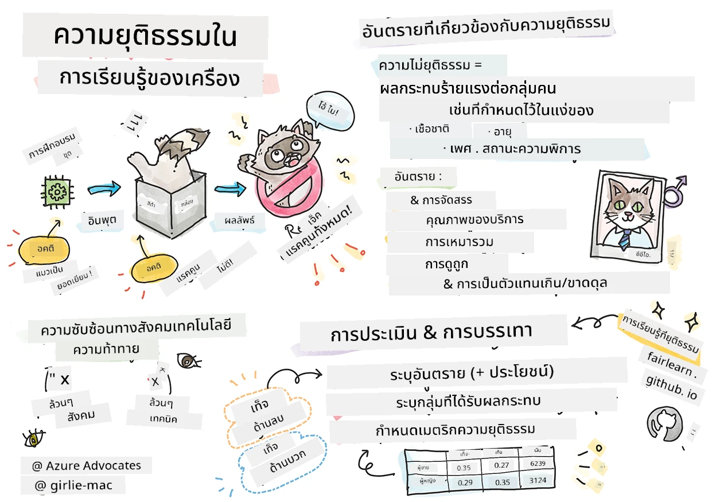

# การสร้างโซลูชัน Machine Learning ด้วย AI ที่มีความรับผิดชอบ  
 

> สเก็ตช์โน้ตโดย [Tomomi Imura](https://www.twitter.com/girlie_mac)

## [แบบทดสอบก่อนบรรยาย](https://ff-quizzes.netlify.app/en/ml/)
 
## บทนำ

ในหลักสูตรนี้ คุณจะเริ่มค้นพบว่า machine learning ส่งผลกระทบต่อชีวิตประจำวันของเราอย่างไร แม้ในปัจจุบัน ระบบและโมเดลต่างๆ มีส่วนเกี่ยวข้องกับการตัดสินใจในชีวิตประจำวัน เช่น การวินิจฉัยทางการแพทย์ การอนุมัติเงินกู้ หรือการตรวจจับการฉ้อโกง ดังนั้นจึงเป็นสิ่งสำคัญที่โมเดลเหล่านี้จะต้องทำงานได้ดีเพื่อให้ผลลัพธ์ที่น่าเชื่อถือ เช่นเดียวกับแอปพลิเคชันซอฟต์แวร์ใด ๆ ระบบ AI ย่อมมีโอกาสพลาดความคาดหวังหรือให้ผลลัพธ์ที่ไม่พึงประสงค์ ดังนั้นจึงเป็นสิ่งจำเป็นที่จะต้องเข้าใจและอธิบายพฤติกรรมของโมเดล AI ได้ 

ลองนึกภาพสิ่งที่จะเกิดขึ้นเมื่อข้อมูลที่คุณใช้สร้างโมเดลเหล่านี้ขาดกลุ่มประชากรบางกลุ่ม เช่น เชื้อชาติ เพศ มุมมองทางการเมือง ศาสนา หรือมีการเป็นตัวแทนของกลุ่มประชากรเหล่านั้นอย่างไม่สมดุล แล้วถ้าผลลัพธ์ของโมเดลถูกตีความให้เอียงไปทางกลุ่มประชากรบางกลุ่มล่ะ? ผลลัพธ์นั้นมีผลกระทบต่อแอปพลิเคชันอย่างไร? นอกจากนี้ หากโมเดลมีผลลัพธ์ที่เป็นอันตรายและทำร้ายผู้คน ใครคือผู้รับผิดชอบต่อพฤติกรรมของระบบ AI เหล่านี้? นี่คือคำถามบางส่วนที่เราจะสำรวจในหลักสูตรนี้

ในบทเรียนนี้ คุณจะได้:

- เพิ่มความตระหนักรู้เกี่ยวกับความสำคัญของความยุติธรรมใน machine learning และอันตรายที่เกี่ยวข้องกับความยุติธรรม
- คุ้นเคยกับการสำรวจข้อมูลแปลกปลอมและสถานการณ์ที่ผิดปกติเพื่อให้แน่ใจในความน่าเชื่อถือและความปลอดภัย
- เข้าใจความจำเป็นในการส่งเสริมทุกคนโดยการออกแบบระบบที่ครอบคลุม
- สำรวจความสำคัญในการปกป้องความเป็นส่วนตัวและความปลอดภัยของข้อมูลและผู้คน
- เห็นความสำคัญของการใช้วิธีแบบ "กล่องแก้ว" เพื่ออธิบายพฤติกรรมของโมเดล AI
- ตระหนักถึงความจำเป็นของความรับผิดชอบเพื่อสร้างความไว้วางใจในระบบ AI

## ข้อกำหนดเบื้องต้น

เป็นข้อกำหนดเบื้องต้น โปรดทำเส้นทางการเรียนรู้ "หลักการ AI ที่มีความรับผิดชอบ" และดูวิดีโอต่อไปนี้ในหัวข้อนี้:

เรียนรู้เพิ่มเติมเกี่ยวกับ AI ที่มีความรับผิดชอบโดยติดตาม [เส้นทางการเรียนรู้นี้](https://docs.microsoft.com/learn/modules/responsible-ai-principles/?WT.mc_id=academic-77952-leestott)

> 🎥 คลิกที่ภาพด้านบนเพื่อดูวิดีโอ: แนวทางของ Microsoft ต่อ AI ที่มีความรับผิดชอบ

## ความยุติธรรม

ระบบ AI ควรปฏิบัติต่อทุกคนอย่างยุติธรรมและหลีกเลี่ยงการส่งผลกระทบที่แตกต่างกันต่อกลุ่มคนที่คล้ายคลึงกัน เช่น เมื่อระบบ AI ให้คำแนะนำเกี่ยวกับการรักษาทางการแพทย์ การขอสินเชื่อ หรือการจ้างงาน ระบบควรให้คำแนะนำเดียวกันแก่ทุกคนที่มีอาการ สภาพการเงิน หรือคุณสมบัติทางวิชาชีพที่คล้ายกัน เราทุกคนในฐานะมนุษย์ต่างก็มีอคติที่สืบทอดมา ซึ่งส่งผลต่อการตัดสินใจและการกระทำของเรา อคติเหล่านี้อาจปรากฏชัดในข้อมูลที่เราใช้ฝึกสอนระบบ AI และบางครั้งอาจเกิดขึ้นโดยไม่ตั้งใจ เป็นเรื่องยากที่จะรู้ตัวเมื่อคุณแนะนำอคติในข้อมูลจริง ๆ  

**“ความไม่ยุติธรรม”** หมายถึงผลกระทบเชิงลบ หรือ "อันตราย" ต่อกลุ่มคน เช่น ที่ถูกกำหนดตามเชื้อชาติ เพศ อายุ หรือสถานะความพิการ อันตรายหลักที่เกี่ยวข้องกับความยุติธรรมสามารถแบ่งได้เป็น:  

- **การจัดสรร** เช่น หากเพศหรือเชื้อชาติได้รับการโปรดปรานมากกว่ากลุ่มอื่น
- **คุณภาพการให้บริการ** หากฝึกด้วยข้อมูลสำหรับสถานการณ์เฉพาะหนึ่ง แต่ในความเป็นจริงซับซ้อนกว่านั้นมาก จะนำไปสู่การให้บริการที่มีประสิทธิภาพต่ำ เช่น เครื่องจ่ายสบู่ที่ไม่สามารถตรวจจับคนผิวคล้ำได้ [อ้างอิง](https://gizmodo.com/why-cant-this-soap-dispenser-identify-dark-skin-1797931773)
- **การดูหมิ่น** การวิจารณ์หรือติดป้ายอย่างไม่ยุติธรรม เช่น เทคโนโลยีการติดป้ายภาพที่ระบุคนผิวคล้ำเป็นกอริลลา
- **การเป็นตัวแทนมากเกินหรือขาดแคลน** แนวคิดที่ว่ากลุ่มคนบางกลุ่มไม่เห็นในวิชาชีพหนึ่ง และบริการหรือหน้าที่ใดที่ยังคงส่งเสริมสิ่งนั้นจะเป็นการเพิ่มอันตราย
- **การเหมารวม** การจับกลุ่มคนหนึ่งกับลักษณะเฉพาะที่ถูกกำหนดไว้ล่วงหน้า เช่น ระบบแปลภาษาระหว่างอังกฤษและตุรกีที่อาจมีความไม่ถูกต้องเนื่องจากคำที่มีการเชื่อมโยงแบบเหมารวมกับเพศ

> แปลเป็นภาษาตุรกี

> แปลกลับเป็นภาษาอังกฤษ

เมื่อออกแบบและทดสอบระบบ AI เราต้องมั่นใจว่า AI ยุติธรรมและไม่ได้ถูกโปรแกรมให้ตัดสินใจอย่างลำเอียงหรือเลือกปฏิบัติ ซึ่งมนุษย์เองก็ถูกห้ามไม่ให้กระทำเช่นเดียวกัน การรับประกันความยุติธรรมใน AI และ machine learning ยังคงเป็นความท้าทายเชิงสังคมเทคนิคที่ซับซ้อน  

### ความน่าเชื่อถือและความปลอดภัย

เพื่อสร้างความไว้วางใจ ระบบ AI ต้องมีความน่าเชื่อถือ ปลอดภัย และสม่ำเสมอทั้งในสถานการณ์ปกติและสถานการณ์ที่ไม่คาดคิด สำคัญที่จะรู้ว่าระบบ AI จะทำงานอย่างไรในสถานการณ์ต่างๆ โดยเฉพาะเมื่อเป็นข้อมูลแปลกประหลาด เมื่อต้องสร้างโซลูชัน AI ต้องมีการมุ่งเน้นอย่างมากในการจัดการกับสถานการณ์หลากหลายที่โซลูชัน AI อาจเผชิญ เช่น รถยนต์ขับเคลื่อนเองจำเป็นต้องให้ความสำคัญกับความปลอดภัยของผู้คนเป็นอันดับหนึ่ง ดังนั้น AI ที่ใช้ในรถยนต์ต้องพิจารณาสถานการณ์ทั้งหมดที่อาจเกิดขึ้น เช่น กลางคืน พายุฝนฟ้าคะนอง หรือหิมะตกหนัก เด็กวิ่งข้ามถนน สัตว์เลี้ยง การก่อสร้างถนน ฯลฯ ระดับความสามารถของระบบ AI ในการรับมือกับสถานการณ์ที่หลากหลายอย่างน่าเชื่อถือและปลอดภัยสะท้อนถึงการคาดการณ์ที่นักวิทยาศาสตร์ข้อมูลหรือผู้พัฒนา AI พิจารณาในระหว่างการออกแบบหรือทดสอบระบบ

> [🎥 คลิกที่นี่เพื่อดูวิดีโอ: ](https://www.microsoft.com/videoplayer/embed/RE4vvIl)

### ความครอบคลุม

ระบบ AI ควรถูกออกแบบมาเพื่อมีส่วนร่วมและส่งเสริมทุกคน เมื่อออกแบบและใช้งานระบบ AI นักวิทยาศาสตร์ข้อมูลและผู้พัฒนา AI จะระบุและจัดการกับอุปสรรคในระบบที่อาจกีดกันผู้คนโดยไม่ตั้งใจ เช่น มีผู้พิการประมาณ 1 พันล้านคนทั่วโลก ด้วยความก้าวหน้าของ AI พวกเขาสามารถเข้าถึงข้อมูลและโอกาสต่างๆ ได้ง่ายขึ้นในชีวิตประจำวัน การแก้ไขอุปสรรคเหล่านี้เปิดโอกาสให้นวัตกรรมและพัฒนาผลิตภัณฑ์ AI ที่มีประสบการณ์ดียิ่งขึ้นซึ่งเป็นประโยชน์ต่อทุกคน

> [🎥 คลิกที่นี่เพื่อดูวิดีโอ: ความครอบคลุมใน AI](https://www.microsoft.com/videoplayer/embed/RE4vl9v)

### ความปลอดภัยและความเป็นส่วนตัว

ระบบ AI ควรปลอดภัยและเคารพความเป็นส่วนตัวของผู้คน ผู้คนจะเชื่อถือน้อยลงในระบบที่เสี่ยงต่อความเป็นส่วนตัว ข้อมูล หรือชีวิตของพวกเขา เมื่อต้องฝึกโมเดล machine learning เราพึ่งพาข้อมูลเพื่อให้ได้ผลลัพธ์ที่ดีที่สุด และในกระบวนการนี้ ที่มาของข้อมูลและความสมบูรณ์ต้องถูกพิจารณา เช่น ข้อมูลมาจากผู้ใช้ส่งมาเอง หรือเป็นข้อมูลสาธารณะ? ต่อมา เมื่อทำงานกับข้อมูล จำเป็นต้องพัฒนาระบบ AI ที่สามารถปกป้องข้อมูลลับและต้านทานการโจมตีได้ เมื่อ AI มีบทบาทมากขึ้น การปกป้องความเป็นส่วนตัวและความปลอดภัยของข้อมูลส่วนบุคคลและธุรกิจก็กลายเป็นเรื่องที่สำคัญและซับซ้อนยิ่งขึ้น ประเด็นด้านความเป็นส่วนตัวและความปลอดภัยของข้อมูลจึงต้องได้รับความสนใจอย่างใกล้ชิดสำหรับ AI เพราะการเข้าถึงข้อมูลเป็นสิ่งจำเป็นที่ระบบ AI จะสามารถทำการคาดการณ์และตัดสินใจที่แม่นยำและมีข้อมูลรองรับเกี่ยวกับผู้คน

> [🎥 คลิกที่นี่เพื่อดูวิดีโอ: ความปลอดภัยใน AI](https://www.microsoft.com/videoplayer/embed/RE4voJF)

- ในฐานะอุตสาหกรรม เราก้าวหน้าอย่างมากในด้านความเป็นส่วนตัวและความปลอดภัย โดยได้รับแรงหนุนอย่างมากจากกฎหมายเช่น GDPR (พระราชบัญญัติคุ้มครองข้อมูลทั่วไป)
- แต่กับระบบ AI เราต้องยอมรับความตึงเครียดระหว่างความต้องการข้อมูลส่วนบุคคลมากขึ้นเพื่อทำให้ระบบมีความเป็นส่วนตัวและมีประสิทธิภาพ – กับความเป็นส่วนตัว
- เหมือนกับการเกิดขึ้นของคอมพิวเตอร์ที่เชื่อมต่อกับอินเทอร์เน็ต เราก็เห็นการเพิ่มขึ้นอย่างมากของปัญหาด้านความปลอดภัยที่เกี่ยวข้องกับ AI
- ในเวลาเดียวกัน เราก็เห็นว่า AI ถูกใช้เพื่อเพิ่มความปลอดภัย เช่น สแกนเนอร์แอนตี้ไวรัสสมัยใหม่ส่วนใหญ่ขับเคลื่อนด้วยหลักการ AI ในวันนี้
- เราต้องมั่นใจว่ากระบวนการวิทยาศาสตร์ข้อมูลของเราสอดคล้องกับแนวปฏิบัติด้านความเป็นส่วนตัวและความปลอดภัยล่าสุด

### ความโปร่งใส
ระบบ AI ควรเข้าใจได้ ส่วนสำคัญของความโปร่งใสคือการอธิบายพฤติกรรมของระบบ AI และองค์ประกอบต่างๆ การเพิ่มความเข้าใจในระบบ AI ต้องการให้ผู้มีส่วนได้ส่วนเสียเข้าใจว่า AI ทำงานอย่างไรและทำไม เพื่อให้สามารถระบุปัญหาด้านการทำงาน ความปลอดภัยและความเป็นส่วนตัว อคติ การปฏิเสธ หรือผลลัพธ์ที่ไม่ตั้งใจ เราเชื่อด้วยว่าผู้ใช้ระบบ AI ควรซื่อสัตย์และเปิดเผยว่าเมื่อไร ทำไม และอย่างไรพวกเขาจึงเลือกใช้ระบบเหล่านั้น รวมถึงข้อจำกัดของระบบที่ใช้ เช่น หากธนาคารใช้ระบบ AI เพื่อสนับสนุนการตัดสินใจในการปล่อยสินเชื่อ ก็สำคัญที่จะต้องตรวจสอบผลลัพธ์และเข้าใจว่าข้อมูลใดมีอิทธิพลต่อคำแนะนำของระบบ รัฐบาลเริ่มมีการควบคุม AI ในหลายอุตสาหกรรม ดังนั้น นักวิทยาศาสตร์ข้อมูลและองค์กรจึงต้องอธิบายว่า ระบบ AI นั้นตอบโจทย์ข้อกำหนดทางกฎหมายหรือไม่ โดยเฉพาะเมื่อมีผลลัพธ์ที่ไม่พึงประสงค์

> [🎥 คลิกที่นี่เพื่อดูวิดีโอ: ความโปร่งใสใน AI](https://www.microsoft.com/videoplayer/embed/RE4voJF)

- เนื่องจากระบบ AI มีความซับซ้อนจึงยากที่จะเข้าใจว่าทำงานอย่างไรและแปลผลลัพธ์อย่างไร  
- ความขาดความเข้าใจนี้ส่งผลต่อวิธีการจัดการ การปฏิบัติการ และการบันทึกเอกสารระบบเหล่านี้  
- ที่สำคัญกว่านั้น ความไม่เข้าใจนี้มีผลต่อการตัดสินใจที่ทำโดยใช้ผลลัพธ์ที่ระบบเหล่านี้สร้างขึ้น  

### ความรับผิดชอบ
 
ผู้ที่ออกแบบและนำระบบ AI มาใช้งานต้องรับผิดชอบต่อการทำงานของระบบ ความจำเป็นในการมีความรับผิดชอบเป็นสิ่งสำคัญอย่างยิ่งกับเทคโนโลยีที่ใช้ในเรื่องที่ละเอียดอ่อน เช่น การจดจำใบหน้า เมื่อไม่นานมานี้ มีความต้องการเทคโนโลยีจดจำใบหน้าที่เพิ่มขึ้น โดยเฉพาะจากองค์กรบังคับใช้กฎหมายที่เห็นศักยภาพของเทคโนโลยีนี้ในการตามหาบุตรหลานที่สูญหาย อย่างไรก็ตาม เทคโนโลยีเหล่านี้อาจถูกใช้โดยรัฐบาลเพื่อคุกคามสิทธิเสรีภาพขั้นพื้นฐานของพลเมือง เช่น การสอดส่องบุคคลเฉพาะอย่างต่อเนื่อง ดังนั้น นักวิทยาศาสตร์ข้อมูลและองค์กรจึงต้องรับผิดชอบต่อผลกระทบที่ระบบ AI มีต่อบุคคลหรือสังคม

> 🎥 คลิกที่ภาพด้านบนเพื่อดูวิดีโอ: คำเตือนเรื่องการสอดส่องมวลชนผ่านการจดจำใบหน้า  

สุดท้าย หนึ่งในคำถามที่ใหญ่ที่สุดสำหรับรุ่นของเราในฐานะรุ่นแรกที่นำ AI เข้าสู่สังคมคือ จะมั่นใจได้อย่างไรว่า คอมพิวเตอร์จะยังคงรับผิดชอบต่อผู้คน และจะทำอย่างไรให้ผู้ที่ออกแบบคอมพิวเตอร์นั้นรับผิดชอบต่อทุกคน

## การประเมินผลกระทบ

ก่อนฝึกโมเดล machine learning สิ่งสำคัญคือต้องดำเนินการประเมินผลกระทบเพื่อทำความเข้าใจวัตถุประสงค์ของระบบ AI; การใช้งานที่ตั้งใจไว้; ที่ตั้งที่จะนำไปใช้; และใครจะมีปฏิสัมพันธ์กับระบบ เหล่านี้ช่วยให้ผู้ตรวจสอบหรือผู้ทดสอบระบบรู้ว่าปัจจัยใดควรพิจารณาเมื่อระบุความเสี่ยงที่อาจเกิดขึ้นและผลที่คาดว่าจะเกิดขึ้น  

ด้านที่ควรให้ความสำคัญเมื่อดำเนินการประเมินผลกระทบ ได้แก่:

* **ผลกระทบที่เป็นอันตรายต่อบุคคล** การตระหนักถึงข้อจำกัดหรือความต้องการใดๆ การใช้งานที่ไม่ได้รับอนุญาต หรือข้อจำกัดที่รู้จักซึ่งขัดขวางประสิทธิภาพของระบบเป็นสิ่งสำคัญเพื่อให้แน่ใจว่าระบบไม่ได้ถูกใช้ในทางที่อาจก่อให้เกิดอันตรายต่อบุคคล
* **ข้อกำหนดข้อมูล** การเข้าใจถึงวิธีการและที่ที่ระบบจะใช้ข้อมูลช่วยให้ผู้ตรวจสอบสามารถสำรวจข้อกำหนดทางข้อมูลที่ต้องระวัง (เช่น กฎหมาย GDPR หรือ HIPAA) นอกจากนี้ ต้องพิจารณาว่าที่มาและปริมาณข้อมูลมีความเพียงพอสำหรับการฝึกสอนหรือไม่
* **สรุปผลกระทบ** รวบรวมรายการอันตรายที่อาจเกิดจากการใช้ระบบ ตลอดวงจรชีวิตของ ML ควรทบทวนว่าได้ลดความเสี่ยงหรือจัดการกับปัญหาต่างๆ ที่พบหรือไม่
* **เป้าหมายที่เกี่ยวข้อง** สำหรับแต่ละหลักการหลักทั้งหก ประเมินว่าเป้าหมายแต่ละข้อได้รับการบรรลุหรือไม่ และมีช่องว่างอะไรบ้าง

## การแก้ไขข้อผิดพลาดด้วย AI ที่มีความรับผิดชอบ

เช่นเดียวกับการแก้ไขข้อผิดพลาดในแอปพลิเคชันซอฟต์แวร์ การแก้ไขข้อผิดพลาดในระบบ AI เป็นกระบวนการจำเป็นในการระบุและแก้ไขปัญหาในระบบ มีหลายปัจจัยที่ส่งผลให้โมเดลทำงานไม่เป็นไปตามที่คาดหวังหรือไม่เป็นไปอย่างรับผิดชอบ เมตริกการประเมินประสิทธิภาพโมเดลส่วนใหญ่เป็นการรวบรวมเชิงปริมาณของประสิทธิภาพโมเดล ซึ่งไม่เพียงพอสำหรับการวิเคราะห์ว่าโมเดลละเมิดหลักการ AI ที่มีความรับผิดชอบอย่างไร นอกจากนี้ โมเดล machine learning เป็นกล่องดำที่ทำให้ยากต่อการเข้าใจว่าอะไรเป็นสาเหตุผลลัพธ์ของมันหรืออธิบายเมื่อมันทำผิดพลาด ต่อไปในหลักสูตรนี้ เราจะเรียนรู้วิธีใช้แดชบอร์ด Responsible AI เพื่อช่วยแก้ไขข้อผิดพลาดของระบบ AI แดชบอร์ดนี้เป็นเครื่องมือรวมที่ช่วยให้นักวิทยาศาสตร์ข้อมูลและผู้พัฒนา AI ดำเนินการ:

* **วิเคราะห์ข้อผิดพลาด** เพื่อระบุการกระจายข้อผิดพลาดของโมเดลที่ส่งผลต่อความยุติธรรมหรือความน่าเชื่อถือของระบบ
* **ภาพรวมโมเดล** เพื่อค้นหาว่ามีความแตกต่างในการทำงานของโมเดลผ่านกลุ่มข้อมูลต่างๆ ที่ใดบ้าง
* **วิเคราะห์ข้อมูล** เพื่อเข้าใจการกระจายของข้อมูลและระบุอคติที่อาจเกิดขึ้นในข้อมูลซึ่งอาจนำไปสู่ปัญหาด้านความยุติธรรม ความครอบคลุม และความน่าเชื่อถือ
* **ความสามารถในการตีความโมเดล** เพื่อเข้าใจสิ่งที่มีผลหรือมีอิทธิพลต่อการทำนายของโมเดล ซึ่งช่วยในการอธิบายพฤติกรรมของโมเดล ซึ่งสำคัญสำหรับความโปร่งใสและความรับผิดชอบ

## 🚀 ความท้าทาย 
 
เพื่อป้องกันไม่ให้อันตรายเกิดขึ้นตั้งแต่แรก เราควร:

- มีความหลากหลายของพื้นหลังและมุมมองในหมู่บุคคลที่ทำงานบนระบบ
- ลงทุนในการมีชุดข้อมูลที่สะท้อนความหลากหลายของสังคมของเรา
- พัฒนาวิธีการที่ดีกว่าตลอดวงจรชีวิต machine learning เพื่อค้นหาและแก้ไขปัญหา AI ที่มีความรับผิดชอบเมื่อเกิดขึ้น

คิดถึงสถานการณ์จริงที่ความไม่น่าเชื่อถือของโมเดลปรากฏชัดในการสร้างและการใช้งานโมเดล เราควรพิจารณาอะไรเพิ่มเติมอีกบ้าง?

## [แบบทดสอบหลังบรรยาย](https://ff-quizzes.netlify.app/en/ml/)

## ทบทวน & เรียนรู้ด้วยตนเอง
 

ในบทเรียนนี้ คุณได้เรียนรู้พื้นฐานบางอย่างของแนวคิดเรื่องความเป็นธรรมและความไม่เป็นธรรมในแมชชีนเลิร์นนิง  
 
ดูเวิร์กช็อปนี้เพื่อเจาะลึกหัวข้อเพิ่มเติม: 

- ในการแสวงหาปัญญาประดิษฐ์ที่รับผิดชอบ: การนำนโยบายสู่การปฏิบัติ โดย Besmira Nushi, Mehrnoosh Sameki และ Amit Sharma

> 🎥 คลิกที่ภาพด้านบนเพื่อดูวิดีโอ: RAI Toolbox: กรอบการทำงานโอเพนซอร์สสำหรับการสร้างปัญญาประดิษฐ์ที่รับผิดชอบ โดย Besmira Nushi, Mehrnoosh Sameki และ Amit Sharma

นอกจากนี้ อ่านเพิ่มเติมได้ที่: 

- ศูนย์ทรัพยากร RAI ของ Microsoft: [Responsible AI Resources – Microsoft AI](https://www.microsoft.com/ai/responsible-ai-resources?activetab=pivot1%3aprimaryr4) 

- กลุ่มวิจัย FATE ของ Microsoft: [FATE: Fairness, Accountability, Transparency, and Ethics in AI - Microsoft Research](https://www.microsoft.com/research/theme/fate/) 

RAI Toolbox: 

- [ที่เก็บ Responsible AI Toolbox บน GitHub](https://github.com/microsoft/responsible-ai-toolbox)

อ่านเกี่ยวกับเครื่องมือของ Azure Machine Learning เพื่อให้มั่นใจในความเป็นธรรม:

- [Azure Machine Learning](https://docs.microsoft.com/azure/machine-learning/concept-fairness-ml?WT.mc_id=academic-77952-leestott) 

## การบ้าน

[สำรวจ RAI Toolbox](assignment.md)

---

<!-- CO-OP TRANSLATOR DISCLAIMER START -->
**ปฏิเสธความรับผิดชอบ**:
เอกสารนี้ได้รับการแปลโดยใช้บริการแปลภาษา AI [Co-op Translator](https://github.com/Azure/co-op-translator) ขณะที่เราพยายามให้ความถูกต้อง โปรดทราบว่าการแปลโดยอัตโนมัติอาจมีข้อผิดพลาดหรือความไม่ถูกต้อง เอกสารต้นฉบับในภาษาต้นทางควรถูกพิจารณาเป็นแหล่งข้อมูลที่เชื่อถือได้ สำหรับข้อมูลที่สำคัญ แนะนำให้ใช้การแปลโดยมนุษย์มืออาชีพ เราไม่รับผิดชอบต่อความเข้าใจผิดหรือการตีความที่ผิดพลาดที่เกิดขึ้นจากการใช้การแปลนี้
<!-- CO-OP TRANSLATOR DISCLAIMER END -->