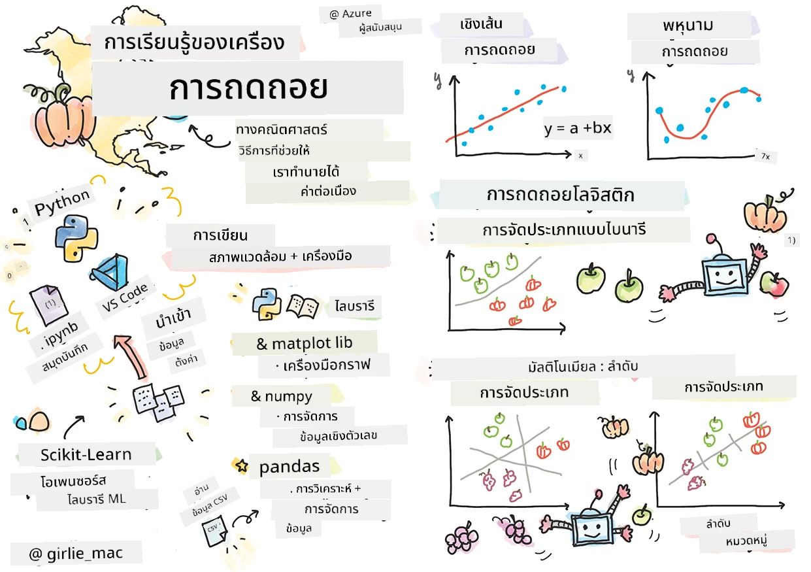
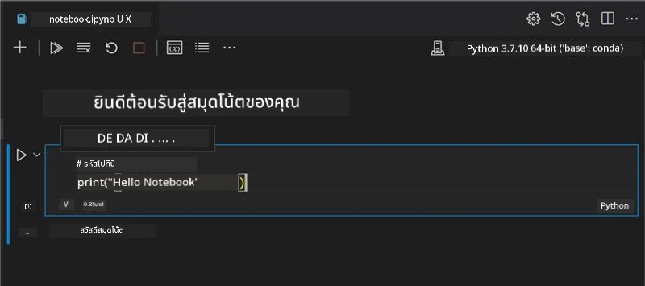
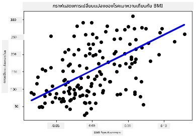

# เริ่มต้นกับ Python และ Scikit-learn สำหรับโมเดลการถดถอย



> สเกตช์โน้ตโดย [Tomomi Imura](https://www.twitter.com/girlie_mac)

## [แบบทดสอบก่อนเรียน](https://ff-quizzes.netlify.app/en/ml/)

> ### [บทเรียนนี้มีให้ในรูปแบบ R!](../../../../2-Regression/1-Tools/solution/R/lesson_1.html)

## บทนำ

ในบทเรียนสี่ตอนนี้ คุณจะได้ค้นพบวิธีการสร้างโมเดลการถดถอย เราจะพูดถึงวัตถุประสงค์ของโมเดลเหล่านี้ในไม่ช้า แต่ก่อนที่คุณจะเริ่มทำอะไร ให้แน่ใจว่าคุณมีเครื่องมือที่เหมาะสมพร้อมสำหรับขั้นตอนนี้!

ในบทเรียนนี้ คุณจะได้เรียนรู้วิธีการ:

- กำหนดค่าคอมพิวเตอร์ของคุณสำหรับงานการเรียนรู้ของเครื่องในเครื่องท้องถิ่น
- ทำงานกับ Jupyter Notebooks
- ใช้ Scikit-learn รวมถึงการติดตั้ง
- สำรวจการถดถอยเชิงเส้นผ่านแบบฝึกหัดปฏิบัติ

## การติดตั้งและการกำหนดค่า

[](https://youtu.be/-DfeD2k2Kj0 "ML สำหรับผู้เริ่มต้น - ตั้งค่าเครื่องมือของคุณพร้อมสร้างโมเดล Machine Learning")

> 🎥 คลิกที่ภาพด้านบนเพื่อดูวิดีโอสั้น ๆ เกี่ยวกับการกำหนดค่าคอมพิวเตอร์ของคุณสำหรับ ML

1. **ติดตั้ง Python** ให้แน่ใจว่า [Python](https://www.python.org/downloads/) ได้ถูกติดตั้งบนคอมพิวเตอร์ของคุณ คุณจะใช้ Python สำหรับงานด้านวิทยาศาสตร์ข้อมูลและการเรียนรู้ของเครื่องมากมาย ระบบส่วนใหญ่มี Python ติดตั้งไว้แล้ว มี [ชุดแพ็กเกจ Coding Python](https://code.visualstudio.com/learn/educators/installers?WT.mc_id=academic-77952-leestott) ที่มีประโยชน์สำหรับบางผู้ใช้เพื่อช่วยให้ง่ายขึ้นในการตั้งค่า

   อย่างไรก็ตาม การใช้งาน Python บางรูปแบบต้องใช้เวอร์ชันของซอฟต์แวร์ที่แตกต่างกัน ดังนั้นจึงมีประโยชน์ในการทำงานภายใน [สภาพแวดล้อมเสมือน](https://docs.python.org/3/library/venv.html)

2. **ติดตั้ง Visual Studio Code** ให้แน่ใจว่าคุณได้ติดตั้ง Visual Studio Code บนคอมพิวเตอร์ของคุณ ทำตามคำแนะนำเพื่อ [ติดตั้ง Visual Studio Code](https://code.visualstudio.com/) สำหรับการติดตั้งพื้นฐาน คุณจะใช้ Python ใน Visual Studio Code ในคอร์สนี้ ดังนั้นอาจต้องศึกษาวิธี [กำหนดค่า Visual Studio Code](https://docs.microsoft.com/learn/modules/python-install-vscode?WT.mc_id=academic-77952-leestott) สำหรับการพัฒนา Python

   > ทำความคุ้นเคยกับ Python โดยการเรียนรู้ผ่านชุด [โมดูลเรียนรู้](https://docs.microsoft.com/users/jenlooper-2911/collections/mp1pagggd5qrq7?WT.mc_id=academic-77952-leestott)
   >
   > [](https://youtu.be/yyQM70vi7V8 "ตั้งค่า Python กับ Visual Studio Code")
   >
   > 🎥 คลิกภาพด้านบนเพื่อดูวิดีโอ: การใช้ Python ใน VS Code

3. **ติดตั้ง Scikit-learn** โดยทำตาม [คำแนะนำนี้](https://scikit-learn.org/stable/install.html) เนื่องจากคุณต้องใช้ Python 3 แนะนำให้ใช้สภาพแวดล้อมเสมือน หากคุณติดตั้งไลบรารีนี้บน M1 Mac มีคำแนะนำพิเศษในหน้าลิงก์ด้านบน

1. **ติดตั้ง Jupyter Notebook** คุณจำเป็นต้อง [ติดตั้งแพ็กเกจ Jupyter](https://pypi.org/project/jupyter/)

## สภาพแวดล้อมการเขียน ML ของคุณ

คุณจะใช้ **โน้ตบุ๊ก** ในการพัฒนาโค้ด Python ของคุณและสร้างโมเดลการเรียนรู้ของเครื่อง ประเภทไฟล์นี้เป็นเครื่องมือทั่วไปสำหรับนักวิทยาศาสตร์ข้อมูล และจะรู้จักได้จากนามสกุล `.ipynb`

โน้ตบุ๊กเป็นสภาพแวดล้อมแบบโต้ตอบที่ช่วยให้นักพัฒนาสามารถเขียนโค้ด พร้อมทั้งเพิ่มบันทึกและเขียนเอกสารประกอบรอบ ๆ โค้ด ซึ่งมีประโยชน์มากสำหรับโครงการเชิงทดลองหรือวิจัย

[](https://youtu.be/7E-jC8FLA2E "ML สำหรับผู้เริ่มต้น - ตั้งค่า Jupyter Notebooks เพื่อเริ่มสร้างโมเดลการถดถอย")

> 🎥 คลิกภาพด้านบนเพื่อดูวิดีโอสั้น ๆ ที่สอนทำแบบฝึกหัดนี้

### แบบฝึกหัด - ทำงานกับโน้ตบุ๊ก

ในโฟลเดอร์นี้ คุณจะพบไฟล์ _notebook.ipynb_

1. เปิดไฟล์ _notebook.ipynb_ ใน Visual Studio Code

   เซิร์ฟเวอร์ Jupyter จะเริ่มทำงานกับ Python 3+ เปิดใช้งาน คุณจะพบส่วนของโน้ตบุ๊กที่สามารถ `run` คือ ชิ้นส่วนของโค้ดที่สามารถรันได้ คุณสามารถรันบล็อกโค้ดโดยเลือกไอคอนที่ดูเหมือนปุ่มเล่น

1. เลือกไอคอน `md` และเพิ่มมาร์กดาวน์เล็กน้อย พร้อมข้อความต่อไปนี้ **# ยินดีต้อนรับสู่โน้ตบุ๊กของคุณ**

   ต่อไป เพิ่มโค้ด Python บางส่วน

1. พิมพ์ **print('hello notebook')** ในบล็อกโค้ด
1. เลือกลูกศรเพื่อรันโค้ด

   คุณควรเห็นข้อความที่พิมพ์ออกมา:

    ```output
    hello notebook
    ```



คุณสามารถแทรกโค้ดของคุณพร้อมคอมเมนต์เพื่อเป็นเอกสารในโน้ตบุ๊กได้

✅ ลองคิดดูสักครู่ว่าการทำงานของนักพัฒนาเว็บกับนักวิทยาศาสตร์ข้อมูลนั้นแตกต่างกันอย่างไร

## เริ่มต้นใช้งานกับ Scikit-learn

เมื่อ Python ถูกตั้งค่าในสภาพแวดล้อมท้องถิ่นของคุณแล้ว และคุณคุ้นเคยกับ Jupyter Notebooks มาแล้ว เรามาทำความคุ้นเคยกับ Scikit-learn (ออกเสียง `sci` เหมือนคำว่า `science`) Scikit-learn มี [API ที่กว้างขวาง](https://scikit-learn.org/stable/modules/classes.html#api-ref) ช่วยให้คุณทำงาน ML ได้ง่ายขึ้น

ตามที่ [เว็บไซต์](https://scikit-learn.org/stable/getting_started.html) ระบุไว้ว่า "Scikit-learn เป็นไลบรารีแมชชีนเลิร์นนิงแบบโอเพนซอร์สที่รองรับการเรียนรู้แบบมีผู้สอนและไม่มีผู้สอน และยังมีเครื่องมือต่างๆ สำหรับการฟิตโมเดล เตรียมข้อมูล การเลือกและประเมินโมเดล และยูทิลิตี้อื่นๆ อีกมากมาย"

ในคอร์สนี้ คุณจะใช้ Scikit-learn และเครื่องมืออื่นๆ เพื่อสร้างโมเดลแมชชีนเลิร์นนิงที่เรียกกันว่า 'เครื่องเรียนรู้แบบดั้งเดิม' เราตั้งใจหลีกเลี่ยงเครือข่ายประสาทเทียมและการเรียนรู้เชิงลึก เพราะเราได้เตรียมหลักสูตร 'AI สำหรับผู้เริ่มต้น' มาในอนาคต

Scikit-learn ช่วยให้การสร้างโมเดลง่ายและประเมินผลได้สะดวก เป็นไลบรารีที่เน้นข้อมูลตัวเลขและมีชุดข้อมูลพร้อมใช้สำหรับการเรียนรู้และตัวอย่างโมเดลให้ทดลอง เรามาดูขั้นตอนการโหลดข้อมูลสำเร็จรูปและใช้ตัวประมาณ (estimator) ที่ติดตั้งมาพร้อมกัน เพื่อสร้างโมเดล ML ตัวแรกด้วย Scikit-learn กับข้อมูลพื้นฐานกัน

## แบบฝึกหัด - โน้ตบุ๊ก Scikit-learn แรกของคุณ

> แบบฝึกหัดนี้ได้รับแรงบันดาลใจจาก [ตัวอย่างการถดถอยเชิงเส้น](https://scikit-learn.org/stable/auto_examples/linear_model/plot_ols.html#sphx-glr-auto-examples-linear-model-plot-ols-py) บนเว็บไซต์ Scikit-learn


[](https://youtu.be/2xkXL5EUpS0 "ML สำหรับผู้เริ่มต้น - โปรเจกต์การถดถอยเชิงเส้นแรกใน Python")

> 🎥 คลิกภาพด้านบนเพื่อดูวิดีโอสั้น ๆ ที่สอนแบบฝึกหัดนี้

ในไฟล์ _notebook.ipynb_ ที่เกี่ยวข้องกับบทเรียนนี้ ให้ล้างเซลทั้งหมดโดยกดปุ่ม 'ถังขยะ'

ในส่วนนี้ คุณจะใช้ชุดข้อมูลขนาดเล็กเกี่ยวกับโรคเบาหวานที่มีอยู่ใน Scikit-learn สำหรับการเรียนรู้สมมติว่า คุณต้องการทดสอบการรักษาสำหรับผู้ป่วยเบาหวาน โมเดลแมชชีนเลิร์นนิงอาจช่วยคุณกำหนดว่าผู้ป่วยรายใดจะตอบสนองการรักษาดีขึ้น โดยอาศัยการรวมตัวของตัวแปรต่างๆ แม้แต่โมเดลง่ายๆ ที่แสดงผลด้วยภาพ อาจช่วยแสดงข้อมูลเกี่ยวกับตัวแปรที่ใช้จัดระเบียบการทดลองทางคลินิกของคุณได้

✅ มีวิธีการถดถอยหลายประเภท และจะเลือกวิธีใดขึ้นอยู่กับคำตอบที่คุณต้องการ หากคุณต้องการทำนายความสูงโดยประมาณของคนในช่วงอายุหนึ่ง คุณจะใช้การถดถอยเชิงเส้น เพราะคุณต้องการค่าตัวเลข แต่ถ้าคุณสนใจดูว่าอาหารประเภทใดควรถูกจัดเป็นมังสวิรัติหรือไม่ คุณกำลังมองหาการจัดประเภทในแบบกลุ่ม จึงจะใช้การถดถอยโลจิสติก คุณจะได้เรียนรู้เกี่ยวกับการถดถอยโลจิสติกในภายหลัง ลองคิดคำถามเกี่ยวกับข้อมูล และดูว่าแบบใดเหมาะสมกว่ากัน

มาเริ่มกันเลยกับงานนี้

### การนำเข้าไลบรารี

สำหรับงานนี้เราจะนำเข้าไลบรารีบางตัว:

- **matplotlib** เป็น [เครื่องมือสร้างกราฟ](https://matplotlib.org/) ที่มีประโยชน์ และเราใช้สร้างกราฟเส้น
- **numpy** [numpy](https://numpy.org/doc/stable/user/whatisnumpy.html) เป็นไลบรารีที่มีประโยชน์สำหรับจัดการข้อมูลตัวเลขใน Python
- **sklearn** ไลบรารี [Scikit-learn](https://scikit-learn.org/stable/user_guide.html)

นำเข้าไลบรารีบางตัวเพื่อช่วยในการทำงานของคุณ

1. เพิ่มการนำเข้าโดยพิมพ์โค้ดดังนี้:

   ```python
   import matplotlib.pyplot as plt
   import numpy as np
   from sklearn import datasets, linear_model, model_selection
   ```

   ด้านบนคุณนำเข้า `matplotlib` และ `numpy` พร้อมทั้งนำเข้า `datasets`, `linear_model` และ `model_selection` จาก `sklearn` `model_selection` ใช้สำหรับแบ่งข้อมูลเป็นชุดฝึกและชุดทดสอบ

### ชุดข้อมูลเบาหวาน

ชุดข้อมูล [เบาหวาน](https://scikit-learn.org/stable/datasets/toy_dataset.html#diabetes-dataset) ที่ติดตั้งมาพร้อมมีข้อมูลตัวอย่าง 442 ตัวอย่างเกี่ยวกับเบาหวาน พร้อมตัวแปรลักษณะ 10 ตัว ซึ่งบางตัวได้แก่:

- อายุ: อายุเป็นปี
- bmi: ดัชนีมวลกาย
- ความดันเลือด: ความดันเลือดเฉลี่ย
- s1 tc: T-Cells (ชนิดหนึ่งของเซลล์เม็ดเลือดขาว)

✅ ชุดข้อมูลนี้มีแนวคิดเรื่อง 'เพศ' เป็นตัวแปรลักษณะสำคัญสำหรับการวิจัยเกี่ยวกับเบาหวาน ชุดข้อมูลแพทย์หลายชุดมีการจัดประเภทนี้ในรูปแบบไบนารี ลองคิดดูว่าการจัดประเภทแบบนี้อาจทำให้บางประชากรถูกตัดออกจากการรักษาอย่างไรบ้าง

ตอนนี้ โหลดข้อมูล X และ y ขึ้นมา

> 🎓 จำไว้ว่า นี่เป็นการเรียนรู้แบบมีผู้สอน และเราต้องมีเป้าหมาย 'y' ที่ระบุชื่อ

ในเซลล์โค้ดใหม่ โหลดชุดข้อมูลเบาหวานโดยเรียก `load_diabetes()` การใช้พารามิเตอร์ `return_X_y=True` หมายความว่า `X` จะเป็นเมทริกซ์ข้อมูล และ `y` จะเป็นเป้าหมายการถดถอย

1. เพิ่มคำสั่งพิมพ์เพื่อแสดงรูปร่างของเมทริกซ์ข้อมูลและรายการแรกของมัน:

    ```python
    X, y = datasets.load_diabetes(return_X_y=True)
    print(X.shape)
    print(X[0])
    ```

    สิ่งที่คุณได้รับกลับมาคือทูเพิล คุณกำลังกำหนดสองค่าตัวแรกของทูเพิลให้กับ `X` และ `y` ตามลำดับ เรียนรู้เพิ่มเติมเกี่ยวกับ [ทูเพิล](https://wikipedia.org/wiki/Tuple)

    คุณจะเห็นว่าข้อมูลนี้มี 442 รายการในอาเรย์ที่มี 10 องค์ประกอบ

    ```text
    (442, 10)
    [ 0.03807591  0.05068012  0.06169621  0.02187235 -0.0442235  -0.03482076
    -0.04340085 -0.00259226  0.01990842 -0.01764613]
    ```

    ✅ ลองคิดความสัมพันธ์ระหว่างข้อมูลและเป้าหมายการถดถอย การถดถอยเชิงเส้นทำนายความสัมพันธ์ระหว่างลักษณะ X และตัวแปรเป้าหมาย y คุณหาจุด [เป้าหมาย](https://scikit-learn.org/stable/datasets/toy_dataset.html#diabetes-dataset) ของชุดข้อมูลเบาหวานในเอกสารได้ไหม? ชุดข้อมูลนี้แสดงอะไรโดยพิจารณาจากเป้าหมายนั้น?

2. ต่อไป เลือกส่วนหนึ่งของชุดข้อมูลนี้เพื่อแจกแจงโดยเลือกคอลัมน์ที่ 3 ของชุดข้อมูล คุณทำได้โดยใช้ตัวดำเนินการ `:` เพื่อเลือกแถวทั้งหมด แล้วเลือกคอลัมน์ที่ 3 โดยใช้ดัชนี (2) คุณยังสามารถปรับรูปร่างข้อมูลให้เป็นอาเรย์สองมิติ - ตามที่ต้องการสำหรับการแจกแจง - ด้วยการใช้ `reshape(n_rows, n_columns)` ถ้าพารามิเตอร์ตัวใดเป็น -1 มิติที่สอดคล้องจะคำนวณโดยอัตโนมัติ

   ```python
   X = X[:, 2]
   X = X.reshape((-1,1))
   ```

   ✅ ทุกเมื่อ สามารถพิมพ์ข้อมูลออกมาตรวจสอบรูปร่างได้

3. เมื่อคุณมีข้อมูลพร้อมลงกราฟแล้ว ลองดูว่าเครื่องจักรจะช่วยกำหนดการแยกเชิงตรรกะระหว่างตัวเลขในชุดข้อมูลนี้ได้หรือไม่ เพื่อทำเช่นนี้ คุณต้องแบ่งทั้งข้อมูล (X) และเป้าหมาย (y) เป็นชุดทดสอบและชุดฝึก Scikit-learn มีวิธีตรงไปตรงมาที่จะทำได้ โดยสามารถแบ่งข้อมูลทดสอบที่จุดที่กำหนด

   ```python
   X_train, X_test, y_train, y_test = model_selection.train_test_split(X, y, test_size=0.33)
   ```

4. ตอนนี้คุณพร้อมที่จะฝึกโมเดลของคุณแล้ว! โหลดโมเดลการถดถอยเชิงเส้นและฝึกด้วยชุดข้อมูลฝึก X และ y โดยใช้ `model.fit()`:

    ```python
    model = linear_model.LinearRegression()
    model.fit(X_train, y_train)
    ```

    ✅ `model.fit()` เป็นฟังก์ชันที่คุณจะพบในไลบรารี ML มากมายเช่น TensorFlow

5. จากนั้น สร้างการทำนายโดยใช้ข้อมูลทดสอบ ด้วยฟังก์ชัน `predict()` ฟังก์ชันนี้ใช้วาดเส้นระหว่างกลุ่มข้อมูล

    ```python
    y_pred = model.predict(X_test)
    ```

6. ถึงเวลาที่จะแสดงข้อมูลในกราฟ Matplotlib เป็นเครื่องมือที่มีประโยชน์สำหรับงานนี้ สร้างกราฟกระจายของข้อมูลทดสอบ X และ y ทั้งหมด และใช้การทำนายวาดเส้นในตำแหน่งที่เหมาะสมที่สุด ระหว่างกลุ่มข้อมูลของโมเดล

    ```python
    plt.scatter(X_test, y_test,  color='black')
    plt.plot(X_test, y_pred, color='blue', linewidth=3)
    plt.xlabel('Scaled BMIs')
    plt.ylabel('Disease Progression')
    plt.title('A Graph Plot Showing Diabetes Progression Against BMI')
    plt.show()
    ```

   


   ✅ ลองคิดดูสักนิดว่าสิ่งที่เกิดขึ้นตรงนี้คืออะไร เส้นตรงเส้นหนึ่งกำลังวิ่งผ่านจุดข้อมูลเล็กๆ หลายจุด แต่จริงๆ แล้วมันกำลังทำอะไร? คุณเห็นไหมว่าคุณควรจะสามารถใช้เส้นนี้ในการทำนายได้ว่าจุดข้อมูลใหม่ที่ไม่เคยเห็นมาก่อนควรจะอยู่ที่ใดเมื่อเทียบกับแกนนอน y ของกราฟ? พยายามเขียนออกมาเป็นคำว่าโมเดลนี้มีประโยชน์อย่างไรในทางปฏิบัติ

ยินดีด้วย คุณสร้างโมเดลการถดถอยเชิงเส้นตัวแรกของคุณสำเร็จ ทำนายผลลัพธ์ด้วยโมเดลนี้ และแสดงผลลัพธ์ในกราฟแล้ว!

---
## 🚀ความท้าทาย

วาดกราฟตัวแปรอื่นจากชุดข้อมูลนี้ คำใบ้: แก้ไขบรรทัดนี้: `X = X[:,2]` เมื่อพิจารณาจากเป้าหมายของชุดข้อมูลนี้ คุณสามารถค้นพบอะไรเกี่ยวกับการพัฒนาโรคเบาหวานในฐานะโรคได้บ้าง?
## [แบบทดสอบหลังบรรยาย](https://ff-quizzes.netlify.app/en/ml/)

## ทบทวน & ศึกษาด้วยตนเอง

ในบทแนะนำนี้ คุณได้ทำงานกับการถดถอยเชิงเส้นง่ายๆ แทนการถดถอยเชิงเส้นตัวแปรเดียวหรือหลายตัว แนะนำให้อ่านเพิ่มเติมเกี่ยวกับความแตกต่างระหว่างวิธีการเหล่านี้ หรือลองดู [วิดีโอนี้](https://www.coursera.org/lecture/quantifying-relationships-regression-models/linear-vs-nonlinear-categorical-variables-ai2Ef)

อ่านเพิ่มเติมเกี่ยวกับแนวคิดของการถดถอยและคิดดูว่าคำถามแบบใดบ้างที่สามารถตอบโดยเทคนิคนี้ได้ ทดลองทำ [บทแนะนำนี้](https://docs.microsoft.com/learn/modules/train-evaluate-regression-models?WT.mc_id=academic-77952-leestott) เพื่อเสริมความเข้าใจของคุณ

## การบ้าน

[ชุดข้อมูลอื่น](assignment.md)

---

<!-- CO-OP TRANSLATOR DISCLAIMER START -->
**ปฏิเสธความรับผิดชอบ**:
เอกสารนี้ได้รับการแปลโดยใช้บริการแปลภาษา AI [Co-op Translator](https://github.com/Azure/co-op-translator) ขณะที่เราพยายามให้ความถูกต้อง โปรดทราบว่าการแปลโดยอัตโนมัติอาจมีข้อผิดพลาดหรือความไม่ถูกต้อง เอกสารต้นฉบับในภาษาต้นทางควรถูกพิจารณาเป็นแหล่งข้อมูลที่เชื่อถือได้ สำหรับข้อมูลที่สำคัญ แนะนำให้ใช้การแปลโดยมนุษย์มืออาชีพ เราไม่รับผิดชอบต่อความเข้าใจผิดหรือการตีความที่ผิดพลาดที่เกิดขึ้นจากการใช้การแปลนี้
<!-- CO-OP TRANSLATOR DISCLAIMER END -->