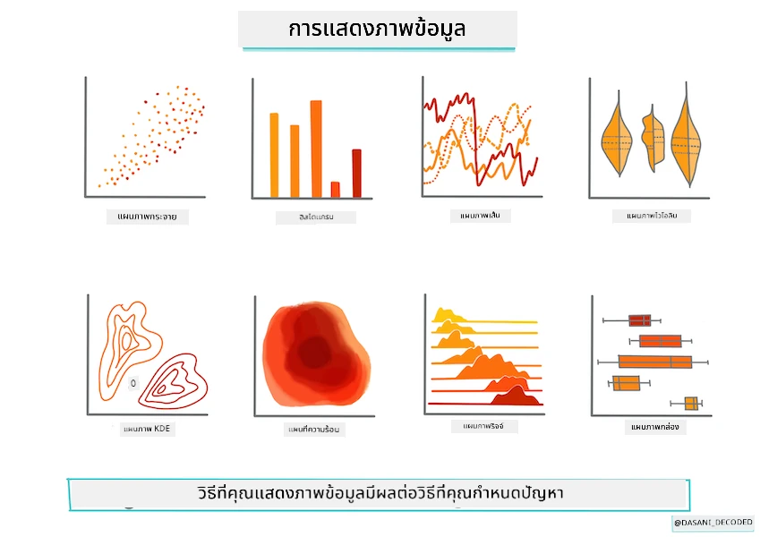
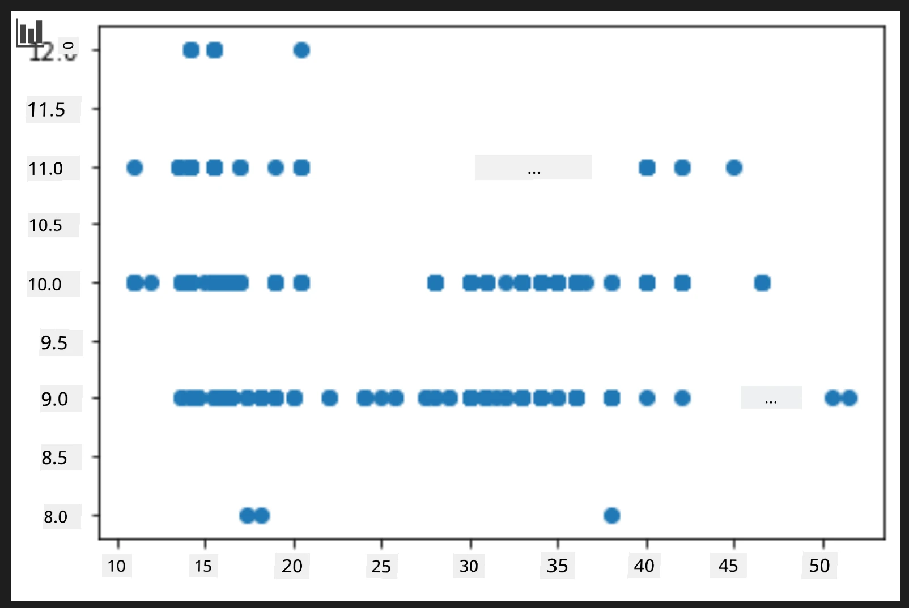
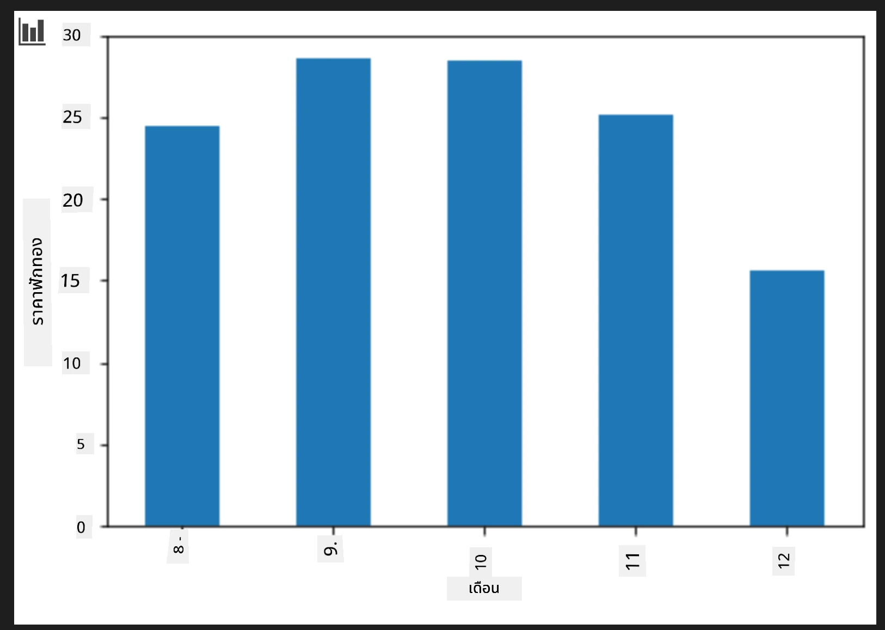
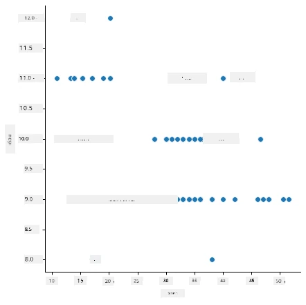
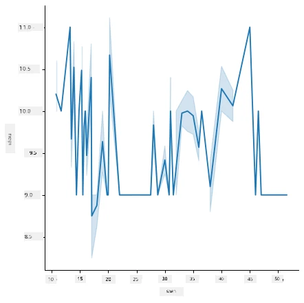
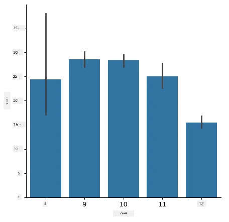
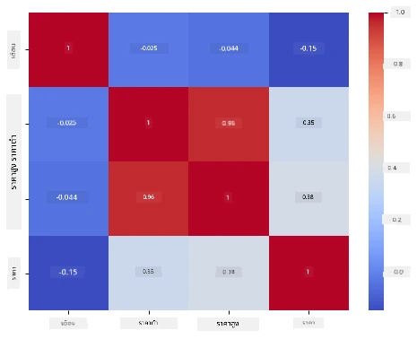

# สร้างโมเดลการถดถอยโดยใช้ Scikit-learn: เตรียมและแสดงข้อมูล



อินโฟกราฟิก โดย [Dasani Madipalli](https://twitter.com/dasani_decoded)

## [แบบทดสอบก่อนเรียน](https://ff-quizzes.netlify.app/en/ml/)

> ### [บทเรียนนี้มีในภาษา R!](../../../../2-Regression/2-Data/solution/R/lesson_2.html)

## บทนำ

ตอนนี้ที่คุณได้ติดตั้งเครื่องมือที่จำเป็นสำหรับการเริ่มต้นสร้างโมเดลการเรียนรู้ของเครื่องด้วย Scikit-learn แล้ว คุณพร้อมที่จะเริ่มตั้งคำถามกับข้อมูลของคุณ ในขณะที่คุณทำงานกับข้อมูลและประยุกต์ใช้โซลูชัน ML สิ่งสำคัญมากที่จะเข้าใจวิธีตั้งคำถามที่ถูกต้องเพื่อปลดล็อกศักยภาพของชุดข้อมูลของคุณอย่างเหมาะสม

ในบทเรียนนี้ คุณจะได้เรียนรู้:

- วิธีการเตรียมข้อมูลของคุณสำหรับการสร้างโมเดล
- วิธีการใช้ Matplotlib ในการแสดงข้อมูล
- วิธีการใช้ Seaborn เพื่อการแสดงข้อมูลที่มีความแสดงออกมากขึ้น

## การตั้งคำถามที่เหมาะสมกับข้อมูลของคุณ

คำถามที่คุณต้องการคำตอบจะกำหนดว่าจะใช้อัลกอริทึม ML ประเภทใด และคุณภาพของคำตอบที่ได้รับกลับจะขึ้นอยู่กับลักษณะของข้อมูลของคุณเป็นอย่างมาก

ลองดูชุด [ข้อมูล](https://github.com/microsoft/ML-For-Beginners/blob/main/2-Regression/data/US-pumpkins.csv) ที่จัดเตรียมไว้สำหรับบทเรียนนี้ คุณสามารถเปิดไฟล์ .csv นี้ใน VS Code การดูคร่าวๆ จะแสดงให้เห็นว่ามีช่องว่างและการผสมของข้อความและข้อมูลตัวเลข นอกจากนี้ยังมีคอลัมน์แปลกๆ เรียกว่า 'Package' ซึ่งข้อมูลเป็นการผสมระหว่าง 'sacks', 'bins' และค่าอื่นๆ ข้อมูลนี้แท้จริงแล้วค่อนข้างยุ่งเหยิง

[](https://youtu.be/5qGjczWTrDQ "ML สำหรับผู้เริ่มต้น - วิธีวิเคราะห์และทำความสะอาดชุดข้อมูล")

> 🎥 คลิกที่ภาพด้านบนเพื่อดูวิดีโอสั้น ๆ ที่อธิบายการเตรียมข้อมูลสำหรับบทเรียนนี้

ในความเป็นจริงแล้วไม่ค่อยได้ชุดข้อมูลที่พร้อมใช้งานสร้างโมเดล ML ได้ทันที ในบทเรียนนี้ คุณจะได้เรียนรู้วิธีเตรียมชุดข้อมูลดิบโดยใช้ไลบรารีมาตรฐานของ Python และยังได้เรียนรู้เทคนิคต่างๆ ในการแสดงข้อมูลด้วย

## กรณีศึกษา: 'ตลาดฟักทอง'

ในโฟลเดอร์นี้ คุณจะพบไฟล์ .csv ในโฟลเดอร์ `data` ที่อยู่ในรูทชื่อ [US-pumpkins.csv](https://github.com/microsoft/ML-For-Beginners/blob/main/2-Regression/data/US-pumpkins.csv) ซึ่งมีข้อมูล 1757 แถวเกี่ยวกับตลาดฟักทอง แบ่งกลุ่มตามเมือง นี่คือข้อมูลดิบที่ดึงมาจาก [รายงานมาตรฐานตลาดส่งพืชผลเฉพาะ](https://www.marketnews.usda.gov/mnp/fv-report-config-step1?type=termPrice) ที่กระทรวงเกษตรของสหรัฐอเมริกาแจกจ่าย

### การเตรียมข้อมูล

ข้อมูลนี้อยู่ในโดเมนสาธารณะ สามารถดาวน์โหลดไฟล์แยกตามเมืองได้หลายไฟล์จากเว็บไซต์ USDA เพื่อหลีกเลี่ยงหลายไฟล์แยก เราได้นำข้อมูลของเมืองทั้งหมดมารวมกันในสเปรดชีตเดียว ดังนั้นเราได้ทำการ _เตรียม_ ข้อมูลไว้บ้างแล้ว ต่อไป มาดูข้อมูลอย่างละเอียดกัน

### ข้อมูลฟักทอง - ข้อสรุปเบื้องต้น

คุณสังเกตอะไรเกี่ยวกับข้อมูลนี้บ้าง? คุณเห็นแล้วว่ามีการผสมผสานของข้อความ ตัวเลข ช่องว่าง และค่าประหลาดที่คุณต้องตีความ

คุณจะตั้งคำถามอะไรกับข้อมูลนี้โดยใช้เทคนิค Regression? อะไรเกี่ยวกับ "ทำนายราคาฟักทองที่จะขายในเดือนที่กำหนด" ลองดูข้อมูลอีกครั้ง มีการเปลี่ยนแปลงที่ต้องทำเพื่อสร้างโครงสร้างข้อมูลที่จำเป็นสำหรับงานนี้
## แบบฝึกหัด - วิเคราะห์ข้อมูลฟักทอง

มาลองใช้ [Pandas](https://pandas.pydata.org/), (ชื่อมาจาก `Python Data Analysis`) ซึ่งเป็นเครื่องมือที่มีประโยชน์มากสำหรับการจัดรูปแบบข้อมูล เพื่อวิเคราะห์และเตรียมข้อมูลฟักทองนี้

### อย่างแรก ตรวจสอบวันที่ที่ขาดหาย

คุณจะต้องดำเนินขั้นตอนเพื่อตรวจสอบวันที่ที่ขาดหายก่อน:

1. แปลงวันที่เป็นรูปแบบเดือน (วันที่เป็นของสหรัฐ จึงใช้รูปแบบ `MM/DD/YYYY`)
2. สกัดเดือนไปยังคอลัมน์ใหม่

เปิดไฟล์ _notebook.ipynb_ ใน Visual Studio Code และนำเข้าสเปรดชีตไปยัง dataframe ของ Pandas ใหม่

1. ใช้ฟังก์ชัน `head()` เพื่อดูห้าแถวแรก

    ```python
    import pandas as pd
    pumpkins = pd.read_csv('../data/US-pumpkins.csv')
    pumpkins.head()
    ```

    ✅ คุณจะใช้ฟังก์ชันใดเพื่อดูห้าแถวสุดท้าย?

1. ตรวจสอบว่ามีข้อมูลขาดหายใน dataframe ปัจจุบันหรือไม่:

    ```python
    pumpkins.isnull().sum()
    ```

    มีข้อมูลขาดหายอยู่ แต่อาจจะไม่ส่งผลกับงานที่ทำ

1. เพื่อให้ง่ายต่อการทำงานกับ dataframe ของคุณ เลือกเฉพาะคอลัมน์ที่ต้องการ โดยใช้ฟังก์ชัน `loc` ซึ่งจะดึงแถว (ที่ส่งเป็นพารามิเตอร์แรก) และคอลัมน์ (พารามิเตอร์ที่สอง) จาก dataframe เดิม โดยนิพจน์ `:` ในกรณีนี้ หมายถึง "แถวทั้งหมด"

    ```python
    columns_to_select = ['Package', 'Low Price', 'High Price', 'Date']
    pumpkins = pumpkins.loc[:, columns_to_select]
    ```

### อย่างที่สอง กำหนดราคาฟักทองเฉลี่ย

คิดถึงวิธีการกำหนดราคาฟักทองเฉลี่ยในเดือนที่กำหนด คุณจะเลือกคอลัมน์ใดสำหรับงานนี้? คำใบ้: คุณจะต้องใช้ 3 คอลัมน์

วิธีแก้: นำราคาต่ำ (`Low Price`) และราคาสูง (`High Price`) มาหาค่าเฉลี่ยเพื่อเติมคอลัมน์ราคาที่สร้างใหม่ และแปลงคอลัมน์วันที่ให้แสดงเฉพาะเดือน โชคดีที่ตรวจสอบด้านบนพบว่าไม่มีข้อมูลวันที่หรือราคาขาดหาย

1. เพื่อคำนวณราคาเฉลี่ย ให้เพิ่มโค้ดต่อไปนี้:

    ```python
    price = (pumpkins['Low Price'] + pumpkins['High Price']) / 2

    month = pd.DatetimeIndex(pumpkins['Date']).month

    ```

   ✅ คุณสามารถพิมพ์ข้อมูลใดๆ ที่ต้องการตรวจสอบโดยใช้ `print(month)`

2. ตอนนี้ ให้คัดลอกข้อมูลที่แปลงแล้วไปยัง dataframe ของ Pandas ใหม่:

    ```python
    new_pumpkins = pd.DataFrame({'Month': month, 'Package': pumpkins['Package'], 'Low Price': pumpkins['Low Price'],'High Price': pumpkins['High Price'], 'Price': price})
    ```

    การพิมพ์ dataframe ของคุณจะแสดงชุดข้อมูลที่สะอาดและเป็นระเบียบซึ่งคุณสามารถนำไปสร้างโมเดลการถดถอยตัวใหม่ได้

### แต่เดี๋ยวก่อน! มีสิ่งแปลกๆ อยู่ที่นี่

หากคุณดูที่คอลัมน์ `Package` ฟักทองถูกขายในหลายรูปแบบ บางชิ้นขายในหน่วย '1 1/9 bushel' บางชิ้นใน '1/2 bushel' บางชิ้นขายต่อตัว บางชิ้นต่อน้ำหนัก และบางชิ้นอยู่ในกล่องใหญ่ที่มีความกว้างแตกต่างกัน

> ฟักทองดูเหมือนจะยากที่จะชั่งน้ำหนักอย่างสม่ำเสมอ

เมื่อเจาะลึกข้อมูลดิบ จะเห็นว่าสิ่งใด ๆ ที่มี `Unit of Sale` เท่ากับ 'EACH' หรือ 'PER BIN' ก็จะมีชนิดของ `Package` เป็นต่อหน่วยนิ้ว ต่อกล่อง หรือ 'แต่ละชิ้น' ฟักทองจึงดูเหมือนจะชั่งน้ำหนักได้ยาก ดังนั้นเรามากรองข้อมูลโดยเลือกเฉพาะฟักทองที่ในคอลัมน์ `Package` มีคำว่า 'bushel'

1. เพิ่มตัวกรองไว้ที่บนสุดของไฟล์ ใต้การนำเข้าไฟล์ .csv ครั้งแรก:

    ```python
    pumpkins = pumpkins[pumpkins['Package'].str.contains('bushel', case=True, regex=True)]
    ```

    ถ้าคุณพิมพ์ข้อมูลตอนนี้ จะเห็นว่าคุณกำลังได้ประมาณ 415 แถวของข้อมูลที่ประกอบด้วยฟักทองที่ขายโดย bushel เท่านั้น

### แต่เดี๋ยวก่อน! ยังมีอีกสิ่งที่ต้องทำ

คุณสังเกตเห็นไหมว่าปริมาณ bushel แตกต่างกันในแต่ละแถว? คุณจำเป็นต้องทำให้ราคามาตรฐานโดยแสดงราคาต่อ bushel ดังนั้นทำการคำนวณเพื่อปรับมาตรฐาน

1. เพิ่มบรรทัดเหล่านี้หลังบล็อกที่สร้าง dataframe ชื่อ new_pumpkins:

    ```python
    new_pumpkins.loc[new_pumpkins['Package'].str.contains('1 1/9'), 'Price'] = price/(1 + 1/9)

    new_pumpkins.loc[new_pumpkins['Package'].str.contains('1/2'), 'Price'] = price/(1/2)
    ```

✅ ตาม [The Spruce Eats](https://www.thespruceeats.com/how-much-is-a-bushel-1389308) น้ำหนักของ bushel ขึ้นอยู่กับประเภทของผลผลิต เนื่องจากเป็นการวัดปริมาตร "bushel ของมะเขือเทศ น่าจะหนัก 56 ปอนด์... ใบและผักใบเขียวใช้พื้นที่มากแต่มีน้ำหนักน้อย ดังนั้น bushel ของผักโขมหรือผักใบเขียวจะหนักเพียง 20 ปอนด์" ทุกอย่างค่อนข้างซับซ้อน! เราจะไม่แปลงจาก bushel เป็นปอนด์ แต่จะตั้งราคาตาม bushel แทน การศึกษาข้อมูล bushel ฟักทองนี้แสดงให้เห็นว่าการเข้าใจลักษณะของข้อมูลของคุณมีความสำคัญมากแค่ไหน!

ตอนนี้ คุณสามารถวิเคราะห์ราคาต่อหน่วยตามการวัด bushel ได้แล้ว ถ้าคุณพิมพ์ข้อมูลอีกครั้ง คุณจะเห็นว่ามันถูกทำให้เป็นมาตรฐานอย่างไร

✅ คุณสังเกตไหมว่าฟักทองที่ขายเป็นครึ่ง bushel มีราคาสูงมาก? คุณคิดออกไหมว่าทำไม? คำใบ้: ฟักทองเล็กมีราคาสูงกว่าฟักทองใหญ่ อาจเป็นเพราะฟักทองเล็กมีจำนวนมากกว่าต่อ bushel เนื่องจากพื้นที่ว่างที่ด้อยคุณภาพที่ใช้โดยฟักทองพายกลวงใหญ่หนึ่งลูก

## กลยุทธ์การแสดงผล

หน้าที่หนึ่งของนักวิทยาศาสตร์ข้อมูลคือการแสดงให้เห็นคุณภาพและลักษณะของข้อมูลที่เขาทำงานอยู่ เพื่อทำเช่นนี้ พวกเขามักสร้างการแสดงภาพที่น่าสนใจ เช่น พล็อต กราฟและแผนภูมิ ที่แสดงมุมมองต่าง ๆ ของข้อมูล ด้วยวิธีนี้ พวกเขาสามารถแสดงความสัมพันธ์และช่องว่างของข้อมูลที่ยากจะค้นพบด้วยตาเปล่า

[](https://youtu.be/SbUkxH6IJo0 "ML สำหรับผู้เริ่มต้น - วิธีแสดงข้อมูลด้วย Matplotlib")

> 🎥 คลิกที่ภาพด้านบนเพื่อดูวิดีโอสั้น ๆ ที่อธิบายการแสดงข้อมูลสำหรับบทเรียนนี้

การแสดงข้อมูลยังช่วยกำหนดเทคนิคการเรียนรู้ของเครื่องที่เหมาะสมที่สุดกับข้อมูล ตัวอย่างเช่น แผนภูมิจุด (scatterplot) ที่ดูเหมือนจะตามเส้นตรง แสดงว่าข้อมูลนั้นเหมาะสมกับการทำ regression แบบเชิงเส้น

ไลบรารีแสดงข้อมูลได้น่าสนใจที่ทำงานได้ดีใน Jupyter notebooks คือ [Matplotlib](https://matplotlib.org/) (ซึ่งคุณก็เห็นในบทเรียนก่อนหน้าแล้ว)

> ฝึกฝนเพิ่มเติมกับการแสดงข้อมูลใน [บทแนะนำเหล่านี้](https://docs.microsoft.com/learn/modules/explore-analyze-data-with-python?WT.mc_id=academic-77952-leestott)

## แบบฝึกหัด - ทดลองใช้ Matplotlib

ลองสร้างพล็อตพื้นฐานเพื่อแสดง dataframe ที่คุณสร้างขึ้นมาใหม่ พล็อตแบบเส้นธรรมดาจะเป็นอย่างไร?

1. นำเข้า Matplotlib ที่ด้านบนของไฟล์ ใต้การนำเข้า Pandas:

    ```python
    import matplotlib.pyplot as plt
    ```

1. รันโน้ตบุ๊กทั้งหมดอีกครั้งเพื่อรีเฟรช
1. ที่ด้านล่างของโน้ตบุ๊ก ให้เพิ่มเซลล์เพื่อพล็อตข้อมูลเป็นกล่อง:

    ```python
    price = new_pumpkins.Price
    month = new_pumpkins.Month
    plt.scatter(price, month)
    plt.show()
    ```

    

    นี่เป็นพล็อตที่มีประโยชน์หรือไม่? มีอะไรที่ทำให้คุณประหลาดใจไหม?

    มันไมได้มีประโยชน์มากนัก เนื่องจากแสดงเพียงการกระจายตัวของข้อมูลในแต่ละเดือนเท่านั้น

### ทำให้มันมีประโยชน์

เพื่อให้แผนภูมิแสดงข้อมูลที่มีประโยชน์ คุณมักจะต้องจัดกลุ่มข้อมูล ลองสร้างพล็อตที่แกน y แสดงเดือนและข้อมูลแสดงการแจกแจงข้อมูล

1. เพิ่มเซลล์เพื่อสร้างแผนภูมิแท่งกลุ่ม:

    ```python
    new_pumpkins.groupby(['Month'])['Price'].mean().plot(kind='bar')
    plt.ylabel("Pumpkin Price")
    ```

    

    นี่เป็นการแสดงข้อมูลที่มีประโยชน์มากขึ้น! ดูเหมือนจะแสดงว่าราคาฟักทองสูงสุดจะเกิดขึ้นในเดือนกันยายนและตุลาคม เป็นไปตามที่คุณคาดหวังหรือไม่? เพราะอะไร หรือไม่?

## แบบฝึกหัด - ทดลองใช้ Seaborn

Matplotlib เป็นเครื่องมือที่ทรงพลัง แต่ก็ต้องใช้โค้ดมากในการสร้างแผนภูมิที่ดูดี [Seaborn](https://seaborn.pydata.org/) เป็นไลบรารีที่พัฒนาบน Matplotlib ที่ออกแบบมาสำหรับการแสดงข้อมูลทางสถิติ มันทำงานโดยตรงกับ Pandas dataframe ใช้สไตล์มาตรฐานที่น่าดึงดูด และช่วยให้คุณสร้างพล็อตที่ให้ข้อมูลอย่างกว้างขวางด้วยโค้ดที่น้อยกว่า เพราะ Seaborn คืนค่าเป็นวัตถุ Matplotlib คุณยังคงใช้ความรู้เดิมในการปรับแต่งได้ตามต้องการ

> หากคุณยังไม่มี Seaborn ให้ติดตั้งด้วยคำสั่ง `pip install seaborn`

1. นำเข้า Seaborn ที่ด้านบนของโน้ตบุ๊ก ใต้การนำเข้าอื่น ๆ โดยปกติจะใช้นามแฝง `sns`:

    ```python
    import seaborn as sns
    ```

### แผนภูมิจุดเพื่อแสดงความสัมพันธ์

ส่วนสำคัญของการสำรวจข้อมูลก่อนสร้างโมเดลคือการมองหาความ _สัมพันธ์_ ระหว่างตัวแปร แผนภูมิจุด ([scatter plot](https://en.wikipedia.org/wiki/Scatter_plot)) เป็นเครื่องมือที่ดีที่สุดอย่างหนึ่ง: ถ้าจุดดูเหมือนจะตามเส้นตรง ตัวแปรทั้งสองอาจสัมพันธ์กัน ซึ่งเป็นสัญญาณที่ดีว่าโมเดล linear regression อาจใช้ได้ผล

1. สร้างแผนภูมิจุดแสดงความสัมพันธ์ระหว่างราคาและเดือนใหม่อีกครั้ง โดยใช้ [`relplot()`](https://seaborn.pydata.org/generated/seaborn.relplot.html) ของ Seaborn ซึ่งทำงานตรงกับคอลัมน์ dataframe ของคุณ:

    ```python
    sns.relplot(x="Price", y="Month", data=new_pumpkins)
    ```

    

    สังเกตว่าคุณส่ง _ชื่อคอลัมน์_ และ dataframe ไป และ Seaborn จะดูแลการแสดงป้ายแกนให้คุณเอง

2. คุณสามารถเปลี่ยนเป็นแผนภูมิแบบเส้นโดยส่ง `kind="line"` Seaborn ยังวาดแถบเงาแสดงช่วงความเชื่อมั่นรอบเส้นด้วย:

    ```python
    sns.relplot(x="Price", y="Month", kind="line", data=new_pumpkins)
    ```

    

    ข้อมูลชุดนี้ค่อยข้างมีเสียงรบกวน ดังนั้นแผนภูมิแบบเส้นอาจไม่ใช่ตัวเลือกที่ชัดเจนมากนัก — แต่แสดงให้เห็นว่าคุณสามารถเปลี่ยนประเภทแผนภูมิใน Seaborn ได้ง่ายเพียงใด

### แผนภูมิแท่งเพื่อแสดงการแจกแจง


ก่อนหน้านี้คุณได้จัดกลุ่มข้อมูลด้วยตัวเองเพื่อสร้างแผนภูมิแท่งด้วย Matplotlib ฟังก์ชัน [`catplot()`](https://seaborn.pydata.org/generated/seaborn.catplot.html) ของ Seaborn (แผนภูมิเชิงประเภท) สามารถจัดกลุ่มและสรุปผลให้คุณได้ โดยค่าเริ่มต้น `kind="bar"` จะแสดงค่าเฉลี่ยของแต่ละประเภทพร้อมเส้นสีดำบ่งชี้ช่วงความเชื่อมั่น

1. สร้างแผนภูมิแท่งของราคากลางต่อเดือน:

    ```python
    sns.catplot(x="Month", y="Price", data=new_pumpkins, kind="bar")
    ```

    

    สิ่งนี้ยืนยันสิ่งที่คุณเห็นกับ Matplotlib — ราคาจะสูงสุดในช่วงกันยายนและตุลาคม — แต่ Seaborn ยังช่วยแสดงให้เห็นว่าราคามีความ _แปรผัน_ ภายในแต่ละเดือนมากน้อยแค่ไหน

### แผนที่ความร้อนเพื่อแสดงความสัมพันธ์

แผนภูมิจุดกระจายเปรียบเทียบตัวแปรสองตัวในคราวเดียว เมื่อคุณมีหลายคอลัมน์ตัวเลข, [heatmap](https://en.wikipedia.org/wiki/Heat_map) ช่วยให้คุณเห็นความสัมพันธ์ระหว่างคู่คอลัมน์ _ทุกคู่_ พร้อมกัน นี่เป็นวิธีทั่วไปในการสังเกตว่าคุณลักษณะใดสัมพันธ์กันมากที่สุดก่อนเลือกว่าจะใส่อะไรลงในโมเดล (และแผนภูมินี้ก็ใช้สำหรับแสดงเมทริกซ์สับสนในงานจำแนกภายหลัง)

1. สร้างเมทริกซ์ความสัมพันธ์ด้วย Pandas แล้ววาดด้วย [`heatmap()`](https://seaborn.pydata.org/generated/seaborn.heatmap.html) ของ Seaborn ตัวเลือก `annot=True` จะแสดงค่าความสัมพันธ์ในแต่ละช่อง:

    ```python
    correlations = new_pumpkins[['Month', 'Low Price', 'High Price', 'Price']].corr()
    sns.heatmap(correlations, annot=True, cmap="coolwarm")
    ```

    

    ค่าที่ใกล้กับ `1` (หรือ `-1`) หมายถึงคอลัมน์นั้นมีความสัมพันธ์เชิงเส้นกันอย่างแข็งแกร่ง สังเกตว่า `Low Price` กับ `High Price` มีความสัมพันธ์แทบจะสมบูรณ์แบบ ขณะที่ `Month` แสดงความสัมพันธ์เชิงเส้นที่อ่อนแอกับราคา — แม้ว่าแผนภูมิแท่งด้านบนจะแสดงจุดสูงสุดตามฤดูกาลอย่างชัดเจนในกันยายนและตุลาคม นี่เป็นบทเรียนสำคัญ: ตัวบ่งชี้ความสัมพันธ์วัดความสัมพันธ์แบบ _เส้นตรง_ เท่านั้น ดังนั้นจึงอาจพลาดรูปแบบตามฤดูกาลหรือแบบที่ไม่ใช่เชิงเส้น ❓ ทำไมจึงควรดูทั้งแผนที่ความร้อน *และ* แผนภูมิอื่น ๆ เช่นแผนภูมิแท่งก่อนตัดสินใจเลือกคอลัมน์ที่จะใช้?

### Matplotlib หรือ Seaborn?

ทั้งสองไลบรารีนี้ควรเรียนรู้:

- **Matplotlib** ให้การควบคุมที่ละเอียดในทุกส่วนของแผนภูมิ และเป็นพื้นฐานที่ไลบรารีการสร้างภาพข้อมูล Python อื่น ๆ สร้างขึ้น
- **Seaborn** มีฟังก์ชันระดับสูงและค่าตั้งต้นที่สวยงามสำหรับแผนภูมิทางสถิติ ทำงานตรงกับ dataframe และมักเร็วกว่าสำหรับการวิเคราะห์เชิงสำรวจข้อมูล

เวิร์กโฟลว์ทั่วไปคือใช้ Seaborn เพื่อสำรวจข้อมูลอย่างรวดเร็ว แล้วจึงลงรายละเอียดด้วย Matplotlib เมื่อคุณต้องการปรับแต่งในส่วนต่าง ๆ

---

## 🚀ความท้าทาย

สำรวจประเภทต่าง ๆ ของการสร้างภาพข้อมูลที่ Matplotlib และ Seaborn มีให้ ชนิดไหนเหมาะสมกับปัญหาการถดถอยมากที่สุด?

## [แบบทดสอบหลังบรรยาย](https://ff-quizzes.netlify.app/en/ml/)

## ทบทวน & ศึกษาด้วยตนเอง

ลองดูวิธีต่าง ๆ ในการแสดงภาพข้อมูล จดรายการไลบรารีต่าง ๆ ที่มีและจดบันทึกว่าไลบรารีไหนเหมาะกับงานประเภทใด เช่น การแสดงผล 2 มิติ กับ 3 มิติ คุณค้นพบอะไรบ้าง?

## งานมอบหมาย

[การสำรวจการแสดงภาพ](assignment.md)

---

<!-- CO-OP TRANSLATOR DISCLAIMER START -->
**ปฏิเสธความรับผิดชอบ**:
เอกสารนี้ได้รับการแปลโดยใช้บริการแปลภาษา AI [Co-op Translator](https://github.com/Azure/co-op-translator) ขณะที่เราพยายามให้ความถูกต้อง โปรดทราบว่าการแปลโดยอัตโนมัติอาจมีข้อผิดพลาดหรือความไม่ถูกต้อง เอกสารต้นฉบับในภาษาต้นทางควรถูกพิจารณาเป็นแหล่งข้อมูลที่เชื่อถือได้ สำหรับข้อมูลที่สำคัญ แนะนำให้ใช้การแปลโดยมนุษย์มืออาชีพ เราไม่รับผิดชอบต่อความเข้าใจผิดหรือการตีความที่ผิดพลาดที่เกิดขึ้นจากการใช้การแปลนี้
<!-- CO-OP TRANSLATOR DISCLAIMER END -->