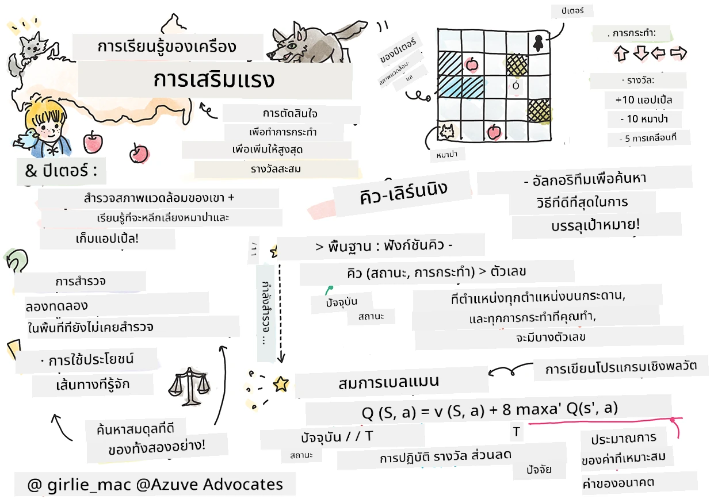
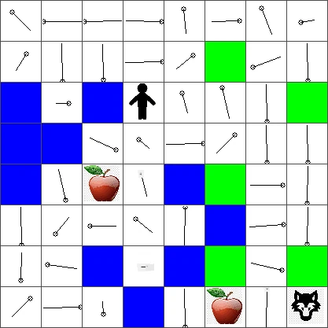

# บทนำสู่การเรียนรู้แบบเสริมกำลังและ Q-Learning


> สเก็ตช์โน้ตโดย [Tomomi Imura](https://www.twitter.com/girlie_mac)

การเรียนรู้แบบเสริมกำลังเกี่ยวข้องกับแนวคิดสำคัญสามอย่าง: ตัวแทน, สถานะบางอย่าง, และชุดของการกระทำในแต่ละสถานะ โดยการทำการกระทำในสถานะที่ระบุ ตัวแทนจะได้รับรางวัล ลองจินตนาการถึงเกมคอมพิวเตอร์ Super Mario คุณคือตัวมาริโอ คุณอยู่ในเลเวลเกม กำลังยืนอยู่ขอบหน้าผา เหนือคุณเป็นเหรียญ คุณในฐานะมาริโอ ในเลเวลเกม ในตำแหน่งเฉพาะ ... นั่นคือสถานะของคุณ การเคลื่อนที่หนึ่งก้าวไปทางขวา (การกระทำ) จะทำให้คุณตกหน้าผา และนั่นจะทำให้ได้คะแนนตัวเลขต่ำ อย่างไรก็ตาม การกดปุ่มกระโดดจะทำให้คุณได้คะแนนและอยู่รอดได้ นั่นคือผลลัพธ์เชิงบวกและควรได้รับคะแนนตัวเลขบวก

โดยการใช้การเรียนรู้แบบเสริมกำลังและซิมูเลเตอร์ (เกม) คุณสามารถเรียนรู้วิธีการเล่นเกมเพื่อเพิ่มรางวัลสูงสุดซึ่งก็คือการอยู่รอดและทำคะแนนให้ได้มากที่สุด

[](https://www.youtube.com/watch?v=lDq_en8RNOo)

> 🎥 คลิกที่ภาพด้านบนเพื่อฟัง Dmitry พูดคุยเกี่ยวกับ Reinforcement Learning

## [แบบทดสอบก่อนบรรยาย](https://ff-quizzes.netlify.app/en/ml/)

## ข้อกำหนดเบื้องต้นและการตั้งค่า

ในบทเรียนนี้ เราจะทดลองกับโค้ดในภาษา Python คุณควรจะสามารถรันโค้ด Jupyter Notebook จากบทเรียนนี้ได้ ไม่ว่าจะบนคอมพิวเตอร์ของคุณหรือที่ไหนสักแห่งในระบบคลาวด์

คุณสามารถเปิด [สมุดบันทึกบทเรียน](https://github.com/microsoft/ML-For-Beginners/blob/main/8-Reinforcement/1-QLearning/notebook.ipynb) และเดินตามบทเรียนนี้เพื่อสร้างขึ้น

> **หมายเหตุ:** หากคุณเปิดโค้ดนี้จากคลาวด์ คุณจะต้องดาวน์โหลดไฟล์ [`rlboard.py`](https://github.com/microsoft/ML-For-Beginners/blob/main/8-Reinforcement/1-QLearning/rlboard.py) ด้วย ซึ่งใช้ในโค้ดสมุดบันทึก เพิ่มไฟล์นี้ในไดเรกทอรีเดียวกับสมุดบันทึก

## บทนำ

ในบทเรียนนี้ เราจะสำรวจโลกของ **[ปีเตอร์และหมาป่า](https://en.wikipedia.org/wiki/Peter_and_the_Wolf)** ได้รับแรงบันดาลใจจากนิทานเพลงโดยคีตกวีชาวรัสเซีย [Sergei Prokofiev](https://en.wikipedia.org/wiki/Sergei_Prokofiev) เราจะใช้ **การเรียนรู้แบบเสริมกำลัง** เพื่อให้ปีเตอร์สำรวจสภาพแวดล้อมของเขา เก็บแอปเปิ้ลอร่อย ๆ และหลีกเลี่ยงการพบหมาป่า

**การเรียนรู้แบบเสริมกำลัง** (RL) เป็นเทคนิคการเรียนรู้ที่ช่วยให้เราเรียนรู้พฤติกรรมที่เหมาะสมที่สุดของ **ตัวแทน** ใน **สภาพแวดล้อม** โดยการทดลองซ้ำหลายครั้ง ตัวแทนในสภาพแวดล้อมนี้ควรมี **เป้าหมาย** ซึ่งกำหนดโดย **ฟังก์ชันรางวัล**

## สภาพแวดล้อม

เพื่อความเรียบง่าย ให้พิจารณาว่าโลกของปีเตอร์เป็นกระดานสี่เหลี่ยมขนาด `width` x `height` ดังนี้:


เซลล์แต่ละช่องในกระดานนี้อาจเป็น:

* **พื้นดิน** ที่ปีเตอร์และสิ่งมีชีวิตอื่น ๆ สามารถเดินได้
* **น้ำ** ซึ่งแน่นอนไม่สามารถเดินได้
* **ต้นไม้** หรือ **หญ้า** สถานที่ที่คุณสามารถพักผ่อน
* **แอปเปิ้ล** ซึ่งเป็นสิ่งที่ปีเตอร์จะดีใจหากพบเพื่อเลี้ยงตัวเอง
* **หมาป่า** ซึ่งอันตรายและควรหลีกเลี่ยง

มีโมดูล Python แยกต่างหาก [`rlboard.py`](https://github.com/microsoft/ML-For-Beginners/blob/main/8-Reinforcement/1-QLearning/rlboard.py) ซึ่งมีโค้ดสำหรับทำงานกับสภาพแวดล้อมนี้ เนื่องจากโค้ดนี้ไม่สำคัญสำหรับการเข้าใจแนวคิดของเรา เราจะนำเข้าโมดูลและใช้เพื่อสร้างกระดานตัวอย่าง (โค้ดบล็อก 1):

```python
from rlboard import *

width, height = 8,8
m = Board(width,height)
m.randomize(seed=13)
m.plot()
```

โค้ดนี้จะแสดงภาพของสภาพแวดล้อมที่คล้ายกับภาพด้านบน

## การกระทำและนโยบาย

ในตัวอย่างของเรา เป้าหมายของปีเตอร์คือการค้นหาแอปเปิ้ลได้ในขณะเดียวกันก็หลีกเลี่ยงหมาป่าและอุปสรรคอื่น ๆ ในการทำเช่นนี้ เขาสามารถเดินไปรอบ ๆ จนกว่าจะพบแอปเปิ้ล

ดังนั้น ในตำแหน่งใด ๆ เขาสามารถเลือกทำหนึ่งในปฏิบัติการต่อไปนี้: ขึ้น, ลง, ซ้าย และขวา

เราจะกำหนดการกระทำเหล่านั้นเป็นพจนานุกรม และแม็ปกับคู่ของการเปลี่ยนแปลงพิกัดที่สอดคล้องกัน เช่น การเคลื่อนไปทางขวา (`R`) จะสอดคล้องกับคู่ `(1,0)` (โค้ดบล็อก 2):

```python
actions = { "U" : (0,-1), "D" : (0,1), "L" : (-1,0), "R" : (1,0) }
action_idx = { a : i for i,a in enumerate(actions.keys()) }
```

สรุปแล้ว ยุทธศาสตร์และเป้าหมายของสถานการณ์นี้คือ:

- **ยุทธศาสตร์** ของตัวแทนของเรา (ปีเตอร์) ถูกกำหนดโดยที่เรียกว่า **นโยบาย** นโยบายเป็นฟังก์ชันที่คืนการกระทำ ณ สถานะใดสถานะหนึ่ง ในกรณีของเรา สถานะของปัญหาคือการแสดงผลโดยกระดาน รวมถึงตำแหน่งปัจจุบันของผู้เล่น

- **เป้าหมาย** ของการเรียนรู้แบบเสริมกำลังคือการเรียนรู้นโยบายที่ดีในที่สุดที่จะช่วยให้เราแก้ปัญหาได้อย่างมีประสิทธิภาพ อย่างไรก็ตาม ในฐานะฐานข้อมูล ลองพิจารณานโยบายที่ง่ายที่สุดที่เรียกว่า **การเดินแบบสุ่ม**

## การเดินแบบสุ่ม

มาลองแก้ปัญหาของเราด้วยการใช้ยุทธศาสตร์เดินแบบสุ่มก่อน ด้วยการเดินแบบสุ่ม เราจะเลือกการกระทำถัดไปแบบสุ่มจากการกระทำที่อนุญาต จนกว่าจะถึงแอปเปิ้ล (โค้ดบล็อก 3)

1. เขียนโค้ดเดินแบบสุ่มโดยใช้โค้ดด้านล่าง:

    ```python
    def random_policy(m):
        return random.choice(list(actions))
    
    def walk(m,policy,start_position=None):
        n = 0 # จำนวนก้าว
        # ตั้งค่าตำแหน่งเริ่มต้น
        if start_position:
            m.human = start_position 
        else:
            m.random_start()
        while True:
            if m.at() == Board.Cell.apple:
                return n # สำเร็จ!
            if m.at() in [Board.Cell.wolf, Board.Cell.water]:
                return -1 # ถูกหมาป่ากินหรือจมน้ำ
            while True:
                a = actions[policy(m)]
                new_pos = m.move_pos(m.human,a)
                if m.is_valid(new_pos) and m.at(new_pos)!=Board.Cell.water:
                    m.move(a) # ทำการเคลื่อนไหวจริง
                    break
            n+=1
    
    walk(m,random_policy)
    ```

    การเรียกใช้ `walk` ควรคืนค่าความยาวของเส้นทางที่สอดคล้อง ซึ่งอาจแตกต่างกันไปในแต่ละการรัน

1. รันการทดลองเดินนี้จำนวนหลายครั้ง (เช่น 100 ครั้ง) และแสดงสถิติที่ได้ (โค้ดบล็อก 4):

    ```python
    def print_statistics(policy):
        s,w,n = 0,0,0
        for _ in range(100):
            z = walk(m,policy)
            if z<0:
                w+=1
            else:
                s += z
                n += 1
        print(f"Average path length = {s/n}, eaten by wolf: {w} times")
    
    print_statistics(random_policy)
    ```

    สังเกตว่าความยาวเฉลี่ยของเส้นทางอยู่ที่ประมาณ 30-40 ก้าว ซึ่งค่อนข้างมาก เมื่อเทียบกับระยะทางเฉลี่ยไปยังแอปเปิ้ลที่ใกล้ที่สุดซึ่งอยู่ราว 5-6 ก้าว

    คุณยังสามารถเห็นการเคลื่อนที่ของปีเตอร์ในระหว่างการเดินแบบสุ่ม:

    

## ฟังก์ชันรางวัล

เพื่อทำให้นโยบายของเราฉลาดยิ่งขึ้น เราจำเป็นต้องเข้าใจว่าการเคลื่อนไหวใด "ดีกว่า" อื่น ๆ ในการทำเช่นนี้ เราจำเป็นต้องกำหนดเป้าหมายของเรา

เป้าหมายสามารถกำหนดได้ในรูปแบบของ **ฟังก์ชันรางวัล** ซึ่งจะคืนค่าคะแนนสำหรับแต่ละสถานะ จำนวนที่สูงกว่าจะหมายถึงฟังก์ชันรางวัลที่ดีกว่า (โค้ดบล็อก 5)

```python
move_reward = -0.1
goal_reward = 10
end_reward = -10

def reward(m,pos=None):
    pos = pos or m.human
    if not m.is_valid(pos):
        return end_reward
    x = m.at(pos)
    if x==Board.Cell.water or x == Board.Cell.wolf:
        return end_reward
    if x==Board.Cell.apple:
        return goal_reward
    return move_reward
```

สิ่งที่น่าสนใจเกี่ยวกับฟังก์ชันรางวัลก็คือ ในหลายกรณี *เราจะได้รับรางวัลสำคัญก็ต่อเมื่อสิ้นสุดเกมเท่านั้น* ซึ่งหมายความว่าอัลกอริธึมของเราควรจะจำขั้นตอน "ดี" ที่นำไปสู่รางวัลบวกในตอนท้าย และเพิ่มความสำคัญของมัน ในทำนองเดียวกัน การเคลื่อนไหวที่นำไปสู่ผลลัพธ์ไม่ดีควรถูกลดความสำคัญ

## Q-Learning

อัลกอริธึมที่เราจะพูดถึงที่นี่เรียกว่า **Q-Learning** ในอัลกอริธึมนี้ นโยบายจะถูกกำหนดโดยฟังก์ชัน (หรืองานโครงสร้างข้อมูล)ที่เรียกว่า **Q-Table** ซึ่งบันทึกความ "ดี" ของแต่ละการกระทำในสถานะที่กำหนด

เรียกว่า Q-Table เพราะสะดวกที่จะนำเสนอเป็นตาราง หรืออาเรย์หลายมิติ เนื่องจากกระดานของเรามีขนาด `width` x `height` เราจึงสามารถแทน Q-Table ด้วยอาเรย์ numpy ที่มีรูปร่าง `width` x `height` x `len(actions)`: (โค้ดบล็อก 6)

```python
Q = np.ones((width,height,len(actions)),dtype=np.float)*1.0/len(actions)
```

สังเกตว่าเราเริ่มต้นค่า Q-Table ทั้งหมดที่ค่าเท่ากัน ในกรณีของเราคือ 0.25 ซึ่งสอดคล้องกับนโยบาย "เดินแบบสุ่ม" เพราะทุกการเคลื่อนไหวในแต่ละสถานะดีเท่ากัน เราสามารถส่ง Q-Table ไปยังฟังก์ชัน `plot` เพื่อแสดงภาพตารางบนกระดาน: `m.plot(Q)`


ตรงกลางของแต่ละเซลล์มี "ลูกศร" ที่ชี้ทิศทางการเคลื่อนที่ที่ต้องการ เนื่องจากทิศทางทั้งหมดเท่ากัน จึงแสดงเป็นจุด

ตอนนี้เราต้องรันการจำลอง สำรวจสภาพแวดล้อมของเรา และเรียนรู้กระจายค่า Q-Table ที่ดีกว่า ซึ่งจะช่วยให้เราค้นหาเส้นทางไปยังแอปเปิ้ลได้เร็วขึ้นมาก

## ประสบการณ์ของ Q-Learning: สมการเบลล์แมน

เมื่อเราเริ่มเคลื่อนที่ การกระทำแต่ละครั้งจะมีรางวัลที่สอดคล้อง เช่น เราสามารถเลือกการกระทำถัดไปโดยอ้างอิงรางวัลทันทีที่สูงที่สุดได้ อย่างไรก็ตาม ในหลายสถานะ การเคลื่อนไหวจะไม่บรรลุเป้าหมายของเราในการถึงแอปเปิ้ล และเราไม่สามารถตัดสินใจทันทีได้ว่าทิศทางใดดีกว่า

> จำไว้ว่า ไม่ใช่ผลลัพธ์ทันทีที่สำคัญ แต่เป็นผลลัพธ์สุดท้ายที่เราจะได้รับเมื่อจบการจำลอง

เพื่อคำนึงถึงรางวัลล่าช้านี้ เราต้องใช้หลักการของ **[การเขียนโปรแกรมแบบไดนามิก](https://en.wikipedia.org/wiki/Dynamic_programming)** ซึ่งช่วยให้เราคิดปัญหาเชิงเรียกซ้ำ

สมมติว่าเรากำลังอยู่ที่สถานะ *s* และเราต้องการย้ายไปสถานะถัดไป *s'* การทำเช่นนี้ เราจะได้รับรางวัลทันที *r(s,a)* ซึ่งกำหนดโดยฟังก์ชันรางวัล รวมทั้งรางวัลในอนาคต ถ้าเราสมมติว่า Q-Table ของเราสะท้อนถึงความ "น่าสนใจ" ของแต่ละการกระทำอย่างถูกต้อง ณ สถานะ *s'* เราจะเลือกการกระทำ *a* ที่มีค่าสูงสุดของ *Q(s',a')* ดังนั้น รางวัลในอนาคตที่ดีที่สุดที่เราจะได้รับที่สถานะ *s* จะถูกนิยามเป็น `max`<sub>a'</sub>*Q(s',a')* (max ที่นี่คำนวณจากการกระทำทั้งหมด *a'* ที่สถานะ *s'*)

นี่คือ **สูตรเบลล์แมน** สำหรับคำนวณค่าของ Q-Table ที่สถานะ *s* โดยให้การกระทำ *a*:


ที่นี่ γ คือที่เรียกว่า **discount factor** ซึ่งกำหนดว่าคุณควรจะชอบรางวัลปัจจุบันมากกว่ารางวัลในอนาคตมากแค่ไหน หรือในทางกลับกัน

## อัลกอริธึมการเรียนรู้

จากสมการด้านบน เราสามารถเขียนโค้ดเทียมสำหรับอัลกอริธึมการเรียนรู้ของเราได้ดังนี้:

* เริ่มต้น Q-Table Q ด้วยตัวเลขเท่ากันสำหรับทุกสถานะและการกระทำ
* ตั้งอัตราการเรียนรู้ α ← 1
* ทำซ้ำการจำลองหลายครั้ง
   1. เริ่มต้นที่ตำแหน่งสุ่ม
   1. ทำซ้ำ
        1. เลือกการกระทำ *a* ณ สถานะ *s*
        2. ทำการกระทำโดยย้ายไปยังสถานะใหม่ *s'*
        3. หากพบเงื่อนไขจบเกม หรือรางวัลรวมต่ำมาก - ออกจากการจำลอง  
        4. คำนวณรางวัล *r* ที่สถานะใหม่
        5. ปรับปรุงฟังก์ชัน Q ตามสมการเบลล์แมน: *Q(s,a)* ← *(1-α)Q(s,a)+α(r+γ max<sub>a'</sub>Q(s',a'))*
        6. *s* ← *s'*
        7. ปรับปรุงรางวัลรวมและลดค่า α

## การใช้ประโยชน์กับการสำรวจ

ในอัลกอริธึมด้านบน เราไม่ได้ระบุชัดเจนว่าเราควรเลือกการกระทำอย่างไรในขั้นตอน 2.1 หากเราเลือกการกระทำแบบสุ่ม เราจะเป็นการ **สำรวจ** สภาพแวดล้อมแบบสุ่ม และเรามีแนวโน้มจะตายบ่อย ๆ และสำรวจบริเวณที่เราไม่ปกติจะไป วิธีการทางเลือกคือการ **ใช้ประโยชน์ (exploit)** ค่าของ Q-Table ที่เราทราบแล้ว และเลือกการกระทำที่ดีที่สุด (ค่าของ Q-Table สูงกว่า) ณ สถานะ *s* อย่างไรก็ตาม วิธีนี้จะป้องกันไม่ให้เราสำรวจสถานะอื่น ๆ และมีแนวโน้มว่าเราอาจไม่พบวิธีแก้ไขที่ดีที่สุด

ดังนั้น วิธีที่ดีที่สุดคือการหาสมดุลระหว่างการสำรวจและการใช้ประโยชน์ สามารถทำได้โดยการเลือกการกระทำที่สถานะ *s* ด้วยความน่าจะเป็นที่สัดส่วนกับค่าต่าง ๆ ใน Q-Table ในตอนแรก เมื่อค่าของ Q-Table ทั้งหมดเท่ากัน จะสอดคล้องกับการเลือกแบบสุ่ม แต่เมื่อเราเรียนรู้ข้อมูลเพิ่มเติมเกี่ยวกับสภาพแวดล้อม เราจะมีแนวโน้มที่จะเลือกเส้นทางที่เหมาะสมที่สุดในขณะที่ยังอนุญาตให้ตัวแทนเลือกเส้นทางที่ยังไม่เคยสำรวจเป็นบางครั้ง

## การสร้างใน Python

ตอนนี้เราพร้อมที่จะดำเนินการอัลกอริธึมการเรียนรู้ได้แล้ว ก่อนอื่นเราต้องมีฟังก์ชันที่จะแปลงตัวเลขใด ๆ ใน Q-Table ให้เป็นเวกเตอร์ของความน่าจะเป็นสำหรับการกระทำที่สอดคล้องกัน

1. สร้างฟังก์ชัน `probs()`:

    ```python
    def probs(v,eps=1e-4):
        v = v-v.min()+eps
        v = v/v.sum()
        return v
    ```

    เราเพิ่ม `eps` เล็กน้อยในเวกเตอร์ดั้งเดิมเพื่อหลีกเลี่ยงการหารด้วยศูนย์ในกรณีเริ่มต้น ที่ส่วนประกอบทั้งหมดของเวกเตอร์เหมือนกัน

รันอัลกอริธึมการเรียนรู้ผ่านการทดลอง 5000 รอบ ซึ่งเรียกว่า **epochs**: (โค้ดบล็อก 8)
```python
    for epoch in range(5000):
    
        # เลือกจุดเริ่มต้น
        m.random_start()
        
        # เริ่มเดินทาง
        n=0
        cum_reward = 0
        while True:
            x,y = m.human
            v = probs(Q[x,y])
            a = random.choices(list(actions),weights=v)[0]
            dpos = actions[a]
            m.move(dpos,check_correctness=False) # เราอนุญาตให้ผู้เล่นเคลื่อนที่ออกนอกกระดาน ซึ่งจะทำให้ตอนนั้นสิ้นสุดลง
            r = reward(m)
            cum_reward += r
            if r==end_reward or cum_reward < -1000:
                lpath.append(n)
                break
            alpha = np.exp(-n / 10e5)
            gamma = 0.5
            ai = action_idx[a]
            Q[x,y,ai] = (1 - alpha) * Q[x,y,ai] + alpha * (r + gamma * Q[x+dpos[0], y+dpos[1]].max())
            n+=1
```

หลังจากรันอัลกอริธึมนี้แล้ว Q-Table ควรถูกปรับปรุงด้วยค่าที่กำหนดความน่าสนใจของการกระทำต่าง ๆ ในแต่ละขั้นตอน เราสามารถทดลองแสดงภาพ Q-Table โดยการวาดเวกเตอร์ที่แต่ละเซลล์เพื่อชี้ไปยังทิศทางที่ต้องการเคลื่อนที่ เพื่อความเรียบง่าย เราใช้การวาดวงกลมเล็กแทนหัวลูกศร



## การตรวจสอบนโยบาย

เนื่องจาก Q-Table แสดงความน่าสนใจของแต่ละการกระทำในแต่ละสถานะ จึงง่ายมากที่จะใช้เพื่อกำหนดการนำทางที่มีประสิทธิภาพในโลกของเรา ในกรณีที่ง่ายที่สุด เราสามารถเลือกการกระทำที่มีค่าของ Q-Table สูงสุด: (โค้ดบล็อก 9)

```python
def qpolicy_strict(m):
        x,y = m.human
        v = probs(Q[x,y])
        a = list(actions)[np.argmax(v)]
        return a

walk(m,qpolicy_strict)
```


> หากคุณลองรันโค้ดข้างต้นหลายครั้ง คุณอาจสังเกตเห็นว่า บางครั้งมัน "ค้าง" และคุณต้องกดปุ่ม STOP ในโน้ตบุ๊กเพื่อหยุด นั่นเกิดขึ้นเพราะอาจมีสถานการณ์ที่สองสถานะ "ชี้" ไปยังซึ่งกันและกันในแง่ของค่าที่เหมาะสมของ Q-Value ซึ่งในกรณีนี้เอเย่นต์จะเคลื่อนที่ไปมาระหว่างสถานะนั้น ๆ โดยไม่สิ้นสุด

## 🚀ความท้าทาย

> **งานที่ 1:** ปรับฟังก์ชัน `walk` เพื่อจำกัดความยาวเส้นทางสูงสุดตามจำนวนขั้นตอนที่กำหนด (เช่น 100 ขั้นตอน) และสังเกตว่าโค้ดข้างต้นจะคืนค่านี้เป็นครั้งคราว

> **งานที่ 2:** ปรับฟังก์ชัน `walk` เพื่อไม่ให้กลับไปยังสถานที่ที่เคยไปแล้วก่อนหน้า วิธีนี้จะป้องกันไม่ให้ `walk` หมุนวนซ้ำ ๆ แม้กระนั้น เอเย่นต์ยังอาจติดอยู่ในตำแหน่งที่ไม่สามารถหลบหนีได้

## การนำทาง

นโยบายการนำทางที่ดีกว่าคือนโยบายที่เราใช้ในระหว่างการฝึกสอน ซึ่งผสมผสานทั้งการใช้ประโยชน์กับการสำรวจ ในนโยบายนี้ เราจะเลือกแต่ละการกระทำด้วยความน่าจะเป็นบางประการ สอดคล้องกับค่าที่อยู่ใน Q-Table กลยุทธ์นี้อาจทำให้เอเย่นต์ย้อนกลับไปยังตำแหน่งที่ได้สำรวจไปแล้ว แต่ตามที่เห็นจากโค้ดด้านล่าง จะเห็นได้ว่าให้เส้นทางเฉลี่ยที่สั้นมากไปยังตำแหน่งที่ต้องการ (อย่าลืมว่า `print_statistics` รันการจำลอง 100 ครั้ง): (โค้ดบล็อก 10)

```python
def qpolicy(m):
        x,y = m.human
        v = probs(Q[x,y])
        a = random.choices(list(actions),weights=v)[0]
        return a

print_statistics(qpolicy)
```

หลังจากรันโค้ดนี้ คุณควรจะได้ค่าเฉลี่ยความยาวเส้นทางที่สั้นกว่ามากในช่วง 3-6

## การสืบสวนกระบวนการเรียนรู้

อย่างที่กล่าวไป กระบวนการเรียนรู้คือสมดุลระหว่างการสำรวจและการใช้ความรู้ที่ได้รับเกี่ยวกับโครงสร้างของปัญหา เราเห็นว่าผลลัพธ์ของการเรียนรู้ (ความสามารถในการช่วยให้เอเย่นต์หาทางลัดไปยังเป้าหมาย) ดีขึ้น แต่ยังน่าสนใจที่จะสังเกตว่าความยาวเส้นทางเฉลี่ยแสดงพฤติกรรมอย่างไรในระหว่างกระบวนการเรียนรู้:


สามารถสรุปการเรียนรู้ได้ดังนี้:

- **ความยาวเส้นทางเฉลี่ยเพิ่มขึ้น** สิ่งที่เราเห็นคือในตอนแรก ความยาวเส้นทางเฉลี่ยเพิ่มขึ้น อาจจะเป็นเพราะว่าเมื่อเราไม่รู้อะไรเกี่ยวกับสภาพแวดล้อม เรามีแนวโน้มจะติดอยู่ในสถานะที่ไม่ดี เช่น น้้า หรือหมาป่า เมื่อเรียนรู้มากขึ้นและเริ่มใช้ความรู้นี้ เราสามารถสำรวจสภาพแวดล้อมได้นานขึ้น แต่เรายังไม่ค่อยรู้ที่ตั้งของแอปเปิ้ลดีนัก

- **ความยาวเส้นทางลดลงเมื่อเรียนรู้มากขึ้น** เมื่อเรียนรู้ได้เพียงพอ เอเย่นต์จะสามารถบรรลุเป้าหมายได้ง่ายขึ้น และความยาวเส้นทางจะเริ่มลดลง อย่างไรก็ตาม เรายังเปิดโอกาสให้สำรวจ จึงมักจะเบี่ยงออกจากเส้นทางที่ดีที่สุด และสำรวจตัวเลือกใหม่ ทำให้ความยาวเส้นทางยาวกว่าเส้นทางที่เหมาะสม

- **ความยาวเพิ่มขึ้นอย่างรวดเร็ว** สิ่งที่สังเกตอีกอย่างในกราฟนี้คือในบางช่วงความยาวเส้นทางเพิ่มขึ้นอย่างฉับพลัน ซึ่งบ่งชี้ถึงลักษณะสโตแคสติกของกระบวนการ และว่าเราอาจจะ "เสีย" ค่าสัมประสิทธิ์ใน Q-Table โดยการเขียนทับด้วยค่าที่ใหม่ แนะนำให้ลดผลกระทบนี้โดยลดอัตราการเรียนรู้ (เช่น ในช่วงท้ายของการฝึก เราจะปรับค่าใน Q-Table ด้วยค่าน้อย ๆ เท่านั้น)

โดยรวมแล้ว สิ่งสำคัญคือการจำไว้ว่า ความสำเร็จและคุณภาพของกระบวนการเรียนรู้นั้นขึ้นอยู่กับพารามิเตอร์ต่าง ๆ เช่น อัตราการเรียนรู้ การลดอัตราการเรียนรู้ และปัจจัยลดค่า พารามิเตอร์เหล่านี้มักถูกเรียกว่า **hyperparameters** เพื่อแยกแยะจาก **parameters** ซึ่งเราเพิ่มประสิทธิภาพในระหว่างการฝึก (เช่น ค่าสัมประสิทธิ์ Q-Table) กระบวนการค้นหาค่าที่ดีที่สุดสำหรับ hyperparameters เรียกว่า **hyperparameter optimization** และเป็นหัวข้อที่ควรแยกพูดถึง

## [แบบทดสอบหลังบรรยาย](https://ff-quizzes.netlify.app/en/ml/)

## การบ้าน
[โลกที่สมจริงมากขึ้น](assignment.md)

---

<!-- CO-OP TRANSLATOR DISCLAIMER START -->
**ปฏิเสธความรับผิดชอบ**:
เอกสารนี้ได้รับการแปลโดยใช้บริการแปลภาษา AI [Co-op Translator](https://github.com/Azure/co-op-translator) ขณะที่เราพยายามให้ความถูกต้อง โปรดทราบว่าการแปลโดยอัตโนมัติอาจมีข้อผิดพลาดหรือความไม่ถูกต้อง เอกสารต้นฉบับในภาษาต้นทางควรถูกพิจารณาเป็นแหล่งข้อมูลที่เชื่อถือได้ สำหรับข้อมูลที่สำคัญ แนะนำให้ใช้การแปลโดยมนุษย์มืออาชีพ เราไม่รับผิดชอบต่อความเข้าใจผิดหรือการตีความที่ผิดพลาดที่เกิดขึ้นจากการใช้การแปลนี้
<!-- CO-OP TRANSLATOR DISCLAIMER END -->