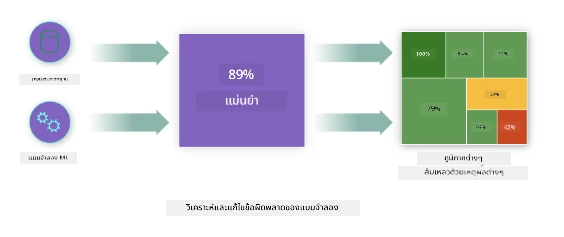
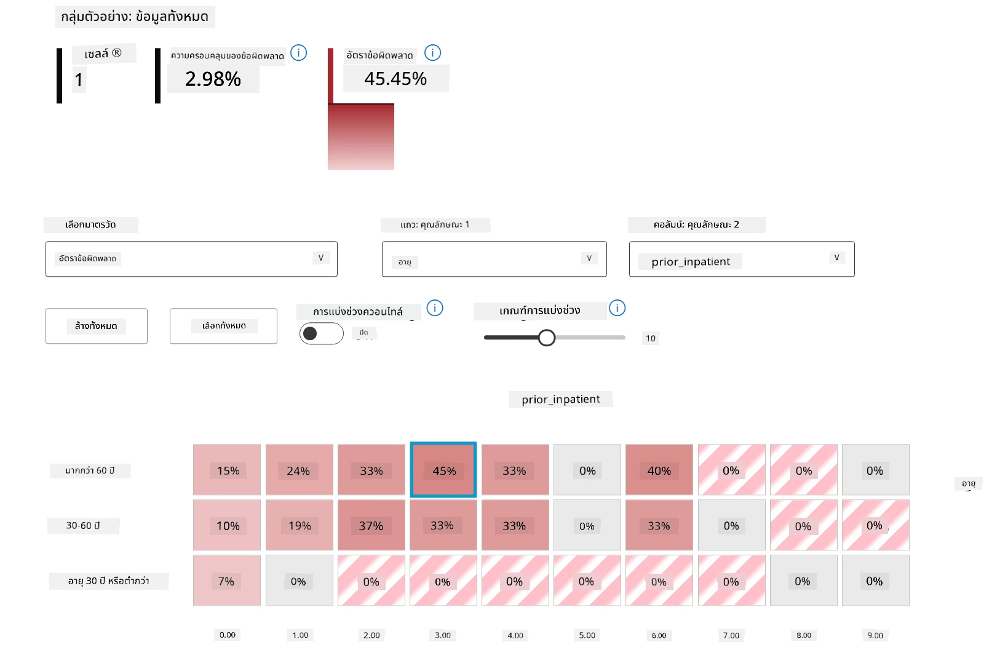
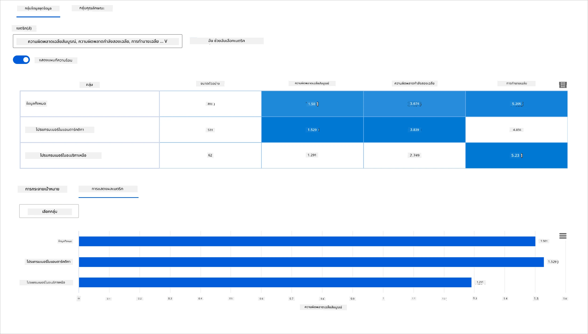
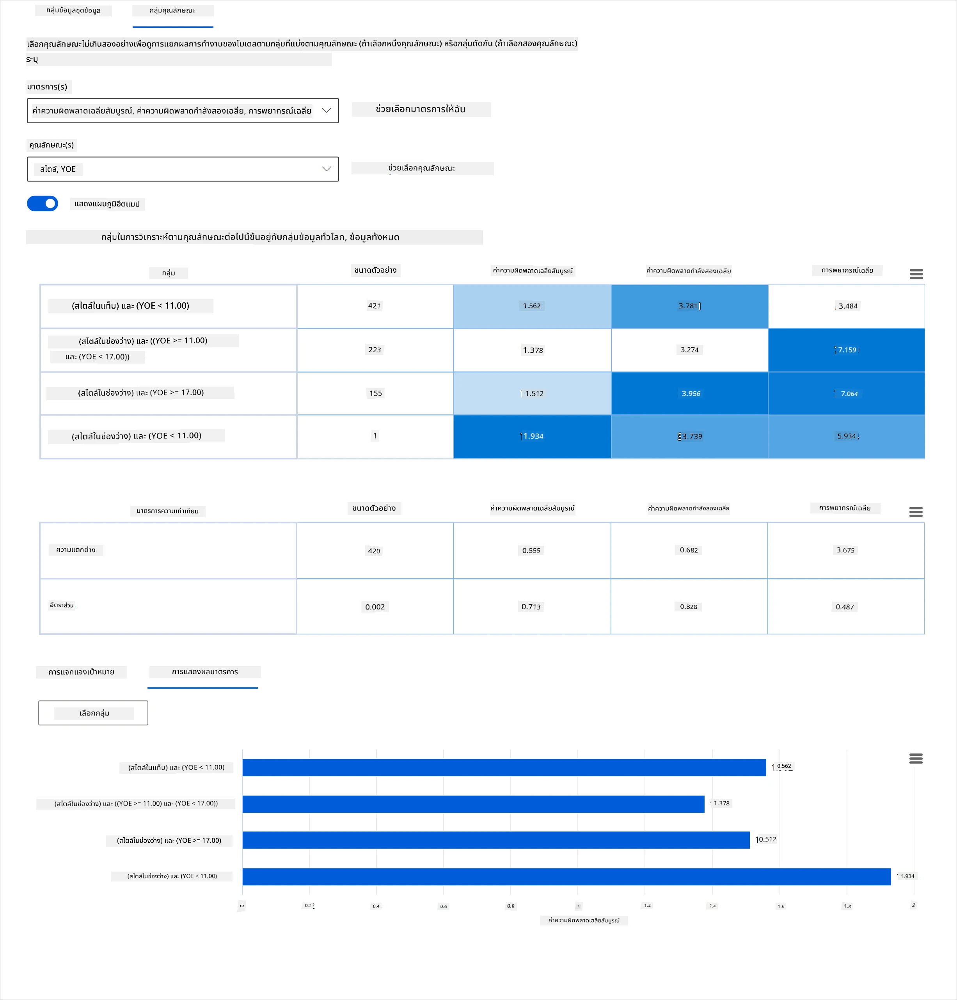
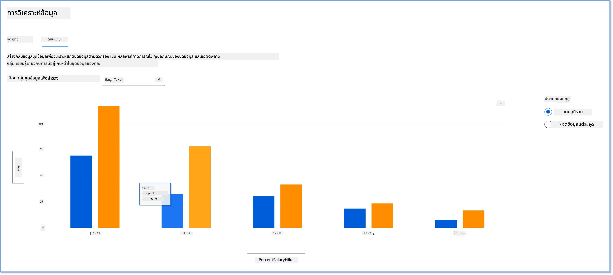
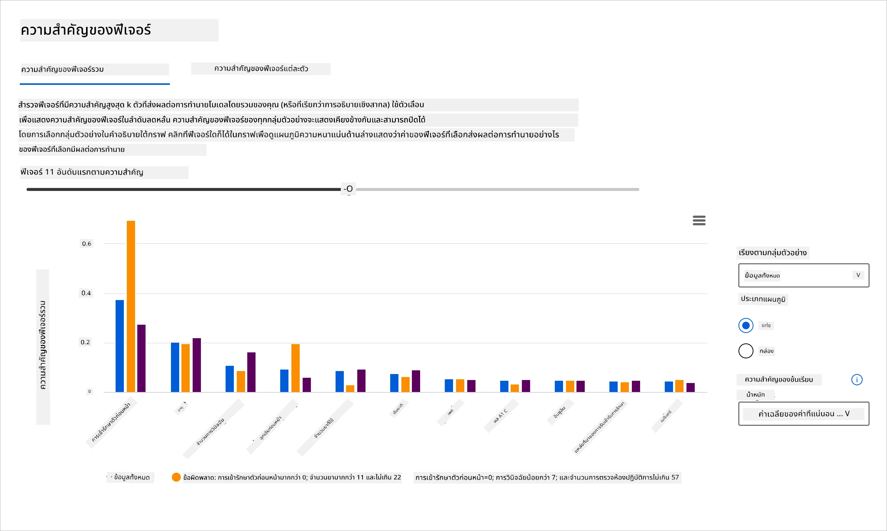
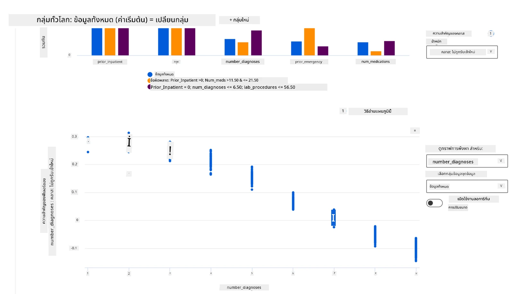

# บทส่งท้าย: การดีบักแบบจำลองในการเรียนรู้ของเครื่องโดยใช้ส่วนประกอบแดชบอร์ด Responsible AI
 

## [แบบทดสอบก่อนบรรยาย](https://ff-quizzes.netlify.app/en/ml/)
 
## บทนำ

การเรียนรู้ของเครื่องมีผลกระทบต่อชีวิตประจำวันของเรา AI กำลังเข้าสู่ระบบสำคัญที่ส่งผลกระทบต่อเราในฐานะบุคคลและสังคมของเรา เช่น ด้านการดูแลสุขภาพ การเงิน การศึกษา และการจ้างงาน ตัวอย่างเช่น ระบบและแบบจำลองมีส่วนร่วมในงานการตัดสินใจประจำวัน เช่น การวินิจฉัยสุขภาพหรือการตรวจจับการทุจริต ดังนั้น ความก้าวหน้าใน AI พร้อมกับการนำไปใช้ที่เร่งขึ้นกำลังเผชิญกับความคาดหวังของสังคมที่พัฒนาไปและกฎระเบียบที่เพิ่มมากขึ้น เรามักเห็นพื้นที่ที่ระบบ AI ยังคงไม่ตรงตามความคาดหวัง เผยให้เห็นความท้าทายใหม่ และรัฐบาลเริ่มที่จะควบคุมโซลูชัน AI ดังนั้นจึงเป็นสิ่งสำคัญที่แบบจำลองเหล่านี้จะต้องได้รับการวิเคราะห์เพื่อให้ผลลัพธ์ที่ยุติธรรม เชื่อถือได้ มีความรวมเป็นหนึ่งเดียว โปร่งใส และสามารถรับผิดชอบได้สำหรับทุกคน

ในหลักสูตรนี้ เราจะดูเครื่องมือที่ใช้ได้จริงที่สามารถใช้ประเมินว่าแบบจำลองมีปัญหาเกี่ยวกับ Responsible AI หรือไม่ เทคนิคการดีบักแบบจำลองการเรียนรู้ของเครื่องแบบดั้งเดิมมักจะอาศัยการคำนวณเชิงปริมาณ เช่น ความถูกต้องรวม หรือค่าเฉลี่ยของการสูญเสียข้อผิดพลาด ลองนึกภาพว่าจะเกิดอะไรขึ้นเมื่อข้อมูลที่คุณใช้สร้างแบบจำลองเหล่านี้ขาดกลุ่มประชากรบางประเภท เช่น เชื้อชาติ เพศ มุมมองทางการเมือง ศาสนา หรือมีการเป็นตัวแทนอย่างไม่สมดุลของกลุ่มประชากรดังกล่าว แล้วถ้าผลลัพธ์ของแบบจำลองถูกตีความในทางที่สนับสนุนกลุ่มประชากรบางกลุ่มล่ะ? สิ่งนี้อาจก่อให้เกิดการเป็นตัวแทนเกินหรือขาดในกลุ่มลักษณะอ่อนไหวเหล่านี้ ส่งผลให้เกิดปัญหาเรื่องความยุติธรรม ความรวมเป็นหนึ่งเดียว หรือความน่าเชื่อถือจากแบบจำลอง อีกปัจจัยหนึ่งคือ แบบจำลองการเรียนรู้ของเครื่องถือเป็นกล่องดำ ซึ่งทำให้ยากที่จะเข้าใจและอธิบายว่าอะไรเป็นแรงขับเคลื่อนการพยากรณ์ของแบบจำลอง ทั้งหมดนี้เป็นความท้าทายที่นักวิทยาศาสตร์ข้อมูลและนักพัฒนา AI เผชิญเมื่อไม่มีเครื่องมือที่เหมาะสมในการดีบักและประเมินความยุติธรรมหรือความน่าเชื่อถือของแบบจำลอง

ในบทเรียนนี้ คุณจะได้เรียนรู้เกี่ยวกับการดีบักแบบจำลองของคุณโดยใช้:

-	**การวิเคราะห์ข้อผิดพลาด**: ระบุว่าภายในการแจกแจงข้อมูลของคุณ ส่วนใดที่แบบจำลองมีอัตราข้อผิดพลาดสูง
-	**ภาพรวมแบบจำลอง**: ทำการวิเคราะห์เปรียบเทียบในกลุ่มข้อมูลต่างๆ เพื่อค้นหาความแตกต่างในเมตริกประสิทธิภาพของแบบจำลองของคุณ
-	**การวิเคราะห์ข้อมูล**: ตรวจสอบบริเวณที่มีการเป็นตัวแทนเกินหรือขาดในข้อมูลของคุณที่อาจทำให้แบบจำลองมีความโน้มเอียงไปสนับสนุนกลุ่มประชากรรายใดรายหนึ่ง
-	**ความสำคัญของฟีเจอร์**: เข้าใจว่าฟีเจอร์ใดผลักดันการทำนายของแบบจำลองในระดับทั่วโลกหรือละเอียดท้องถิ่น

## ความรู้พื้นฐานที่ต้องมี

เป็นความรู้พื้นฐาน กรุณารีวิว [เครื่องมือ Responsible AI สำหรับนักพัฒนา](https://www.microsoft.com/ai/ai-lab-responsible-ai-dashboard)

> 

## การวิเคราะห์ข้อผิดพลาด

เมตริกประสิทธิภาพแบบจำลองแบบดั้งเดิมที่ใช้ในการวัดความถูกต้องมักเป็นการคำนวณตามการทำนายถูกหรือผิดเป็นหลัก ยกตัวอย่างเช่น การกำหนดว่าแบบจำลองมีความแม่นยำ 89% พร้อมกับการสูญเสียข้อผิดพลาด 0.001 ถือว่าเป็นผลการทำงานที่ดี ข้อผิดพลาดมักไม่กระจายอย่างเท่าเทียมกันในชุดข้อมูลพื้นฐานของคุณ คุณอาจได้คะแนนความแม่นยำของแบบจำลอง 89% แต่พบว่ามีบางพื้นที่ข้อมูลที่แบบจำลองทำงานผิดพลาด 42% ของเวลา ผลลัพธ์จากรูปแบบความล้มเหลวในกลุ่มข้อมูลบางกลุ่มอาจนำไปสู่ปัญหาความยุติธรรมหรือความน่าเชื่อถือ จึงเป็นสิ่งสำคัญที่จะเข้าใจพื้นที่ที่แบบจำลองทำงานได้ดีหรือล้มเหลว พื้นที่ข้อมูลที่มีจำนวนข้อผิดพลาดสูงในแบบจำลองของคุณอาจกลายเป็นกลุ่มประชากรข้อมูลที่สำคัญ  

ส่วนประกอบการวิเคราะห์ข้อผิดพลาดบนแดชบอร์ด RAI แสดงให้เห็นว่าความล้มเหลวของแบบจำลองกระจายอยู่ในกลุ่มย่อยอย่างไรผ่านการแสดงผลแบบต้นไม้ (tree visualization) ซึ่งมีประโยชน์ในการระบุฟีเจอร์หรือพื้นที่ที่มีอัตราข้อผิดพลาดสูงในชุดข้อมูลของคุณ ด้วยการเห็นว่าเกิดข้อผิดพลาดส่วนใหญ่ของแบบจำลองมาจากที่ใด คุณสามารถเริ่มต้นตรวจสอบหาสาเหตุรากฐานได้ นอกจากนี้ยังสามารถสร้างกลุ่มย่อยข้อมูลเพื่อทำการวิเคราะห์ด้วย กลุ่มย่อยข้อมูลเหล่านี้ช่วยในกระบวนการดีบัก เพื่อค้นหาว่าทำไมแบบจำลองถึงทำงานได้ดีในกลุ่มหนึ่ง แต่ล้มเหลวในอีกกลุ่มหนึ่ง  

ตัวชี้วัดเชิงภาพบนแผนที่ต้นไม้ช่วยให้หาแหล่งปัญหาได้รวดเร็วขึ้น ตัวอย่างเช่น โหนดบนต้นไม้ที่มีเฉดสีแดงเข้มกว่าจะมีอัตราข้อผิดพลาดสูงขึ้น  

แผนที่ความร้อนเป็นฟังก์ชันการแสดงผลอีกอย่างหนึ่งที่ผู้ใช้สามารถใช้ตรวจสอบอัตราข้อผิดพลาดโดยใช้หนึ่งหรือสองฟีเจอร์เพื่อค้นหาสาเหตุที่ทำให้เกิดข้อผิดพลาดของแบบจำลองทั่วชุดข้อมูลหรือกลุ่มย่อย

ใช้การวิเคราะห์ข้อผิดพลาดเมื่อคุณต้องการ:

* เข้าใจอย่างลึกซึ้งว่าความล้มเหลวของแบบจำลองกระจายตัวในชุดข้อมูลและมิติต่างๆ ของฟีเจอร์อย่างไร
* แยกเมตริกการทำงานรวมเพื่อค้นหากลุ่มข้อมูลที่ผิดพลาดโดยอัตโนมัติเพื่อวางแผนมาตรการแก้ไขเป้าหมาย

## ภาพรวมแบบจำลอง

การประเมินประสิทธิภาพของแบบจำลองการเรียนรู้ของเครื่องต้องการความเข้าใจแบบองค์รวมเกี่ยวกับพฤติกรรมของมัน ซึ่งทำได้โดยการทบทวนมากกว่าหนึ่งเมตริก เช่น อัตราข้อผิดพลาด ความถูกต้อง Recall Precision หรือ MAE (ค่าเฉลี่ยของความผิดพลาดสัมบูรณ์) เพื่อค้นหาความแตกต่างในเมตริกประสิทธิภาพ เมตริกบางตัวอาจดูดี แต่ความผิดพลาดอาจถูกเปิดเผยในเมตริกอื่น นอกจากนี้ การเปรียบเทียบเมตริกที่แตกต่างกันในชุดข้อมูลทั้งหมดหรือกลุ่มย่อยช่วยส่องให้เห็นว่ารูปแบบทำงานได้ดีหรือล้มเหลวตรงจุดใด สิ่งนี้สำคัญอย่างยิ่งในการดูประสิทธิภาพของแบบจำลองในฟีเจอร์ที่ละเอียดอ่อน (เช่น เชื้อชาติ เพศ หรืออายุของผู้ป่วย) เพื่อเปิดเผยความไม่ยุติธรรมที่อาจเกิดขึ้น ตัวอย่างเช่น การพบว่าแบบจำลองผิดพลาดมากในกลุ่มข้อมูลที่มีฟีเจอร์ละเอียดอ่อนสามารถเปิดเผยความไม่ยุติธรรมที่แบบจำลองอาจมีได้

ส่วนประกอบภาพรวมแบบจำลองบนแดชบอร์ด RAI ช่วยไม่เพียงแต่ในการวิเคราะห์เมตริกประสิทธิภาพของข้อมูลในกลุ่มย่อยเท่านั้น แต่ยังให้ผู้ใช้เปรียบเทียบพฤติกรรมของแบบจำลองในกลุ่มย่อยที่แตกต่างกันได้ด้วย

ฟังก์ชันวิเคราะห์แบบฟีเจอร์ของส่วนประกอบนี้ช่วยให้ผู้ใช้สามารถเจาะลึกกลุ่มข้อมูลย่อยในฟีเจอร์เฉพาะเพื่อระบุความผิดปกติในระดับรายละเอียด ตัวอย่างเช่น แดชบอร์ดมีระบบอัจฉริยะในตัวที่สร้างกลุ่มย่อยโดยอัตโนมัติสำหรับฟีเจอร์ที่ผู้ใช้เลือก (เช่น "*time_in_hospital < 3*" หรือ "*time_in_hospital >= 7*") นี้ช่วยให้ผู้ใช้แยกฟีเจอร์เฉพาะออกจากกลุ่มข้อมูลใหญ่เพื่อดูว่าฟีเจอร์นี้มีอิทธิพลสำคัญต่อผลลัพธ์ผิดพลาดของแบบจำลองหรือไม่

ส่วนประกอบภาพรวมแบบจำลองรองรับเมตริกความแตกต่างสองประเภท:

**ความแตกต่างในประสิทธิภาพของแบบจำลอง**: ชุดเมตริกเหล่านี้คำนวณความแตกต่าง (difference) ในค่าของเมตริกประสิทธิภาพที่เลือกในกลุ่มย่อยของข้อมูล ตัวอย่างบางส่วนมีดังนี้:

* ความแตกต่างในอัตราความถูกต้อง
* ความแตกต่างในอัตราข้อผิดพลาด
* ความแตกต่างใน Precision
* ความแตกต่างใน Recall
* ความแตกต่างในค่าเฉลี่ยความผิดพลาดสัมบูรณ์ (MAE)

**ความแตกต่างในอัตราการเลือก**: เมตริกนี้คือความแตกต่างในอัตราการเลือก (การทำนายที่เป็นผลลัพธ์ในเชิงบวก) ในกลุ่มย่อย ตัวอย่างเช่น ความแตกต่างในอัตราการอนุมัติสินเชื่อ อัตราการเลือกคือสัดส่วนของจุดข้อมูลในแต่ละคลาสที่จัดประเภทเป็น 1 (ในกรณีการจำแนกแบบไบนารี) หรือการแจกแจงของค่าการทำนายในกรณีการถดถอย

## การวิเคราะห์ข้อมูล

> "ถ้าคุณทรมานข้อมูลนานพอ ข้อมูลยอมรับสารภาพได้ทุกอย่าง" - Ronald Coase

ประโยคนี้ฟังดูรุนแรง แต่ก็เป็นเรื่องจริงที่ข้อมูลสามารถถูกจัดการเพื่อสนับสนุนข้อสรุปใดก็ได้ การจัดการเช่นนี้บางครั้งเกิดขึ้นโดยไม่ตั้งใจ ในฐานะมนุษย์ เราทุกคนมีอคติ และมักเป็นเรื่องยากที่จะรู้ตัวว่าเมื่อใดที่คุณกำลังนำอคติเข้าสู่ข้อมูล การรับประกันความยุติธรรมใน AI และการเรียนรู้ของเครื่องยังคงเป็นความท้าทายที่ซับซ้อน  

ข้อมูลเป็นจุดบอดที่ใหญ่มากสำหรับเมตริกประสิทธิภาพแบบจำลองแบบดั้งเดิม คุณอาจได้คะแนนความแม่นยำสูง แต่ไม่แน่ว่าจะสะท้อนอคติที่มีอยู่ในชุดข้อมูลของคุณหรือไม่ ตัวอย่างเช่น ถ้าชุดข้อมูลของพนักงานประกอบด้วยผู้หญิง 27% ในตำแหน่งบริหารของบริษัท และผู้ชาย 73% ในตำแหน่งเดียวกัน แบบจำลอง AI ที่ฝึกจากข้อมูลนี้อาจมุ่งเป้าไปที่กลุ่มชายเป็นส่วนใหญ่สำหรับตำแหน่งงานระดับสูง การมีความไม่สมดุลนี้ในข้อมูลทำให้แบบจำลองมีแนวโน้มทำนายที่สนับสนุนเพศหนึ่งมากกว่าอีกเพศหนึ่ง เปิดเผยปัญหาความยุติธรรมที่มีอคติเกี่ยวกับเพศในแบบจำลอง AI  

ส่วนประกอบการวิเคราะห์ข้อมูลบนแดชบอร์ด RAI ช่วยระบุพื้นที่ที่มีการเป็นตัวแทนเกินหรือต่ำกว่าที่ควรในชุดข้อมูล ช่วยให้ผู้ใช้วินิจฉัยสาเหตุหลักของข้อผิดพลาดและปัญหาความยุติธรรมที่เกิดจากความไม่สมดุลของข้อมูลหรือการขาดตัวแทนในกลุ่มข้อมูลหนึ่งๆ ซึ่งช่วยให้ผู้ใช้สามารถแสดงภาพชุดข้อมูลตามผลลัพธ์ที่คาดการณ์และจริง กลุ่มข้อผิดพลาด และฟีเจอร์เฉพาะบางอย่าง บางครั้งการค้นพบกลุ่มข้อมูลที่เป็นตัวแทนน้อยเกินไปยังช่วยเปิดเผยว่าแบบจำลองไม่ได้เรียนรู้ดีนัก จึงมีข้อผิดพลาดสูง การที่แบบจำลองมีอคติข้อมูลไม่ใช่แค่ปัญหาความยุติธรรมเท่านั้น แต่แสดงว่าแบบจำลองไม่ครอบคลุมและไม่น่าเชื่อถือ

ใช้การวิเคราะห์ข้อมูลเมื่อคุณต้องการ:

* สำรวจสถิติชุดข้อมูลของคุณโดยการเลือกตัวกรองต่างๆ เพื่อแยกข้อมูลออกเป็นมิติต่างๆ (ซึ่งเรียกว่ากลุ่มย่อย)
* เข้าใจการแจกแจงของชุดข้อมูลในกลุ่มย่อยและกลุ่มฟีเจอร์ต่างๆ
* ตัดสินใจว่าข้อค้นพบเกี่ยวกับความยุติธรรม การวิเคราะห์ข้อผิดพลาด และความสัมพันธ์เชิงสาเหตุ (ที่ได้จากส่วนประกอบแดชบอร์ดอื่น ๆ) เกิดจากการแจกแจงของชุดข้อมูลหรือไม่
* ตัดสินใจว่าจะเก็บข้อมูลเพิ่มเติมในส่วนใดเพื่อแก้ไขข้อผิดพลาดที่เกิดจากปัญหาการเป็นตัวแทน เสียงรบกวนฉลาก ข้อมูลฟีเจอร์ เสียงรบกวนฉลากอคติ และปัจจัยคล้ายกัน

## ความสามารถในการตีความแบบจำลอง

แบบจำลองการเรียนรู้ของเครื่องมักเป็นกล่องดำ การเข้าใจว่าฟีเจอร์ข้อมูลสำคัญใดเป็นตัวขับเคลื่อนการทำนายของแบบจำลองนั้นเป็นเรื่องท้าทาย จึงสำคัญที่ต้องมีความโปร่งใสว่าทำไมแบบจำลองจึงทำการทำนายเช่นนั้น ตัวอย่างเช่น หากระบบ AI ทำนายว่าผู้ป่วยเบาหวานมีความเสี่ยงที่จะถูกนำกลับเข้าโรงพยาบาลภายในเวลาไม่ถึง 30 วัน ควรสามารถให้ข้อมูลสนับสนุนที่นำไปสู่การทำนายนี้ได้ การมีตัวบ่งชี้ข้อมูลสนับสนุนช่วยสร้างความโปร่งใส เพื่อช่วยให้แพทย์หรือโรงพยาบาลสามารถตัดสินใจได้อย่างมีข้อมูล นอกจากนี้ การสามารถอธิบายว่าทำไมแบบจำลองจึงทำการทำนายสำหรับผู้ป่วยแต่ละรายช่วยให้สามารถรับผิดชอบตามข้อกำหนดด้านสุขภาพ เมื่อใช้แบบจำลองการเรียนรู้ของเครื่องในวิธีที่ส่งผลกระทบต่อชีวิตคน จึงเป็นเรื่องสำคัญที่จะต้องเข้าใจและอธิบายว่าสิ่งใดมีอิทธิพลต่อพฤติกรรมของแบบจำลอง ความสามารถในการอธิบายและตีความแบบจำลองช่วยตอบคำถามในสถานการณ์ต่างๆ เช่น:

* การดีบักแบบจำลอง: ทำไมแบบจำลองของฉันถึงทำผิดพลาดนี้? ฉันจะแก้ไขแบบจำลองอย่างไร?
* การทำงานร่วมกันระหว่างมนุษย์และ AI: ฉันจะเข้าใจและเชื่อใจการตัดสินใจของแบบจำลองได้อย่างไร?
* การปฏิบัติตามข้อกำหนด: แบบจำลองของฉันเป็นไปตามข้อกฎหมายหรือไม่?

ส่วนประกอบความสำคัญของฟีเจอร์บนแดชบอร์ด RAI ช่วยให้คุณดีบักและเข้าใจอย่างครอบคลุมว่าแบบจำลองทำการทำนายอย่างไร นอกจากนี้ยังเป็นเครื่องมือที่มีประโยชน์สำหรับผู้เชี่ยวชาญด้านการเรียนรู้ของเครื่องและผู้ตัดสินใจเพื่ออธิบายและแสดงหลักฐานของฟีเจอร์ที่มีอิทธิพลต่อพฤติกรรมของแบบจำลองเพื่อการปฏิบัติตามข้อกำหนด ผู้ใช้สามารถสำรวจคำอธิบายแบบทั่วโลกและแบบท้องถิ่นเพื่อยืนยันว่าฟีเจอร์ใดผลักดันการทำนายของแบบจำลอง คำอธิบายแบบทั่วโลกจะแสดงฟีเจอร์สำคัญอันดับต้นๆ ที่มีผลต่อการทำนายโดยรวมของแบบจำลอง ในขณะที่คำอธิบายแบบท้องถิ่นจะแสดงฟีเจอร์ที่นำไปสู่การทำนายของแบบจำลองสำหรับกรณีเฉพาะ ความสามารถนี้ช่วยในการดีบักหรือตรวจสอบกรณีเฉพาะเพื่อเข้าใจและตีความว่าทำไมแบบจำลองถึงทำการทำนายถูกหรือผิดแม่นยำ

* คำอธิบายแบบทั่วโลก: ตัวอย่างเช่น ฟีเจอร์ใดมีผลต่อพฤติกรรมโดยรวมของแบบจำลองการนำผู้ป่วยเบาหวานกลับเข้าโรงพยาบาล?
* คำอธิบายแบบท้องถิ่น: ตัวอย่างเช่น ทำไมผู้ป่วยเบาหวานที่มีอายุมากกว่า 60 ปีที่เคยเข้ารักษาตัวมาก่อน จึงถูกทำนายว่าจะถูกนำกลับเข้าโรงพยาบาลหรืแไม่ภายใน 30 วัน?

ในกระบวนการดีบักการพิจารณาผลการทำงานของแบบจำลองในกลุ่มย่อยต่างๆ Feature Importance แสดงระดับผลกระทบของฟีเจอร์ในกลุ่มย่อยนั้น ช่วยเปิดเผยความผิดปกติเมื่อเปรียบเทียบระดับอิทธิพลของฟีเจอร์ที่ผลักดันข้อผิดพลาดของแบบจำลอง ส่วนประกอบนี้แสดงให้เห็นว่า ค่าฟีเจอร์ใดบ้างที่มีอิทธิพลทั้งในแง่บวกและลบต่อผลลัพธ์ของแบบจำลอง ตัวอย่างเช่น หากแบบจำลองทำการทำนายผิดพลาด ส่วนประกอบนี้ให้คุณเจาะลึกและระบุว่าฟีเจอร์ใดหรือค่าฟีเจอร์ใดเป็นสาเหตุของการทำนายนั้น รายละเอียดในระดับนี้ไม่เพียงแต่ช่วยในการดีบัก แต่ยังสร้างความโปร่งใสและความรับผิดชอบในสถานการณ์การตรวจสอบด้วย สุดท้าย ส่วนประกอบนี้ยังช่วยให้คุณระบุปัญหาความยุติธรรม เช่น หากฟีเจอร์ละเอียดอ่อนอย่างเชื้อชาติหรือเพศมีอิทธิพลสูงในการผลักดันการทำนายของแบบจำลอง อาจเป็นสัญญาณว่ามีอคติเรื่องเชื้อชาติหรือเพศในแบบจำลอง

ใช้ความสามารถในการตีความเมื่อคุณต้องการ:

* กำหนดความน่าเชื่อถือของการทำนายของระบบ AI ของคุณโดยเข้าใจว่าฟีเจอร์ใดสำคัญที่สุดสำหรับการทำนาย
* เข้าหาการดีบักแบบจำลองของคุณโดยเข้าใจก่อนและระบุว่าแบบจำลองใช้งานฟีเจอร์ที่มีคุณภาพดีหรือเพียงแค่ความสัมพันธ์เท็จ
* ค้นหาแหล่งที่มาอาจเป็นอคติด้วยการทำความเข้าใจว่าแบบจำลองอิงฟีเจอร์ละเอียดอ่อนหรือฟีเจอร์ที่สัมพันธ์สูงกับฟีเจอร์เหล่านั้นหรือไม่
* สร้างความเชื่อมั่นให้กับผู้ใช้ในตัดสินใจของแบบจำลองโดยการสร้างคำอธิบายท้องถิ่นเพื่อแสดงผลลัพธ์
* ทำการตรวจสอบตามระเบียบของระบบ AI เพื่อตรวจสอบแบบจำลองและติดตามผลกระทบของการตัดสินใจของแบบจำลองต่อผู้คน

## สรุป

ส่วนประกอบแดชบอร์ด RAI ทั้งหมดเป็นเครื่องมือใช้งานจริงที่ช่วยให้คุณสร้างแบบจำลองการเรียนรู้ของเครื่องที่ส่งผลร้ายน้อยลงและน่าเชื่อถือมากขึ้นต่อสังคม มันช่วยป้องกันภัยคุกคามต่อสิทธิมนุษยชน การเลือกปฏิบัติหรือการกีดกันกลุ่มใดกลุ่มหนึ่งจากโอกาสในชีวิต และความเสี่ยงจากการบาดเจ็บทางกายหรือจิตใจ นอกจากนี้ยังช่วยสร้างความไว้วางใจในตัดสินใจของแบบจำลองโดยการสร้างคำอธิบายท้องถิ่นเพื่อแสดงผลลัพธ์ ความเสียหายบางส่วนสามารถแบ่งประเภทดังนี้:

- **การจัดสรรทรัพยากร** เช่น หากเพศหรือเชื้อชาติหนึ่งถูกเลือกให้ได้เปรียบมากกว่ากลุ่มอื่น
- **คุณภาพของบริการ** หากฝึกฝนข้อมูลสำหรับสถานการณ์เฉพาะ แต่ความเป็นจริงซับซ้อนกว่านั้น นำไปสู่การให้บริการที่มีประสิทธิภาพต่ำ
- **การเหมารวมกลุ่ม** การเชื่อมโยงกลุ่มใดกลุ่มหนึ่งกับลักษณะที่ถูกกำหนดไว้ล่วงหน้า

- **การดูถูก** เพื่อวิจารณ์และติดป้ายอย่างไม่เป็นธรรมแก่บางสิ่งหรือบางคน
- **การแสดงผลเกินหรือขาดการแสดงผล** ความคิดคือว่ากลุ่มคนบางกลุ่มไม่ถูกเห็นในอาชีพใดอาชีพหนึ่ง และบริการหรือฟังก์ชันใด ๆ ที่ยังคงสนับสนุนสิ่งนั้นย่อมเป็นการสร้างความเสียหาย

### แดชบอร์ด Azure RAI
 
[แดชบอร์ด Azure RAI](https://learn.microsoft.com/en-us/azure/machine-learning/concept-responsible-ai-dashboard?WT.mc_id=aiml-90525-ruyakubu) สร้างขึ้นบนเครื่องมือโอเพ่นซอร์สที่พัฒนาโดยสถาบันวิชาการชั้นนำและองค์กรต่าง ๆ ร่วมกับ Microsoft ซึ่งเป็นประโยชน์ต่อผู้เชี่ยวชาญด้านข้อมูลและนักพัฒนาปัญญาประดิษฐ์ในการทำความเข้าใจพฤติกรรมของโมเดล ค้นหาและลดปัญหาที่ไม่พึงประสงค์จากโมเดล AI

- เรียนรู้วิธีใช้ส่วนประกอบต่าง ๆ ได้โดยการตรวจสอบเอกสารแดชบอร์ด RAI [docs.](https://learn.microsoft.com/en-us/azure/machine-learning/how-to-responsible-ai-dashboard?WT.mc_id=aiml-90525-ruyakubu)

- ตรวจสอบสมุดบันทึกตัวอย่างของแดชบอร์ด RAI [sample notebooks](https://github.com/Azure/RAI-vNext-Preview/tree/main/examples/notebooks) สำหรับการดีบักสถานการณ์ AI ที่รับผิดชอบมากขึ้นใน Azure Machine Learning
  
---
## 🚀 ความท้าทาย 
 
เพื่อป้องกันไม่ให้มีอคติทางสถิติหรือข้อมูลเกิดขึ้นตั้งแต่แรก เราควร:

- มีความหลากหลายในพื้นฐานและมุมมองของคนที่ทำงานกับระบบ
- ลงทุนในชุดข้อมูลที่สะท้อนความหลากหลายของสังคมของเรา
- พัฒนาวิธีการที่ดีกว่าในการตรวจจับและแก้ไขอคติเมื่อเกิดขึ้น

คิดถึงสถานการณ์ในชีวิตจริงที่ความไม่เป็นธรรมชัดเจนในการสร้างและใช้งานโมเดล เราควรพิจารณาอะไรเพิ่มเติมอีก?

## [แบบทดสอบหลังบรรยาย](https://ff-quizzes.netlify.app/en/ml/)
## ทบทวน & ศึกษาด้วยตนเอง
 
ในบทเรียนนี้ คุณได้เรียนรู้เครื่องมือที่ใช้ได้จริงบางส่วนในการบูรณาการ AI ที่รับผิดชอบในงานเรียนรู้ของเครื่อง

ชมเวิร์กช็อปนี้เพื่อเจาะลึกหัวข้อเพิ่มเติม:

- แดชบอร์ด Responsible AI: ศูนย์รวมสำหรับการปฏิบัติใช้งาน RAI โดย Besmira Nushi และ Mehrnoosh Sameki

> 🎥 คลิกภาพด้านบนเพื่อดูวิดีโอ: แดชบอร์ด Responsible AI: ศูนย์รวมสำหรับการปฏิบัติใช้งาน RAI โดย Besmira Nushi และ Mehrnoosh Sameki
 
อ้างอิงเอกสารต่อไปนี้เพื่อเรียนรู้เพิ่มเติมเกี่ยวกับ AI ที่รับผิดชอบและวิธีการสร้างโมเดลที่น่าเชื่อถือมากขึ้น:

- เครื่องมือแดชบอร์ด RAI ของ Microsoft สำหรับดีบักโมเดล ML: [แหล่งข้อมูลเครื่องมือ Responsible AI](https://aka.ms/rai-dashboard)

- สำรวจชุดเครื่องมือ Responsible AI: [Github](https://github.com/microsoft/responsible-ai-toolbox)

- ศูนย์ทรัพยากร RAI ของ Microsoft: [ทรัพยากร Responsible AI – Microsoft AI](https://www.microsoft.com/ai/responsible-ai-resources?activetab=pivot1%3aprimaryr4) 

- กลุ่มวิจัย FATE ของ Microsoft: [FATE: ความเป็นธรรม ความรับผิดชอบ ความโปร่งใส และจริยธรรมใน AI - Microsoft Research](https://www.microsoft.com/research/theme/fate/) 

## งานที่ได้รับมอบหมาย

[สำรวจแดชบอร์ด RAI](assignment.md)

---

<!-- CO-OP TRANSLATOR DISCLAIMER START -->
**ปฏิเสธความรับผิดชอบ**:
เอกสารนี้ได้รับการแปลโดยใช้บริการแปลภาษา AI [Co-op Translator](https://github.com/Azure/co-op-translator) ขณะที่เราพยายามให้ความถูกต้อง โปรดทราบว่าการแปลโดยอัตโนมัติอาจมีข้อผิดพลาดหรือความไม่ถูกต้อง เอกสารต้นฉบับในภาษาต้นทางควรถูกพิจารณาเป็นแหล่งข้อมูลที่เชื่อถือได้ สำหรับข้อมูลที่สำคัญ แนะนำให้ใช้การแปลโดยมนุษย์มืออาชีพ เราไม่รับผิดชอบต่อความเข้าใจผิดหรือการตีความที่ผิดพลาดที่เกิดขึ้นจากการใช้การแปลนี้
<!-- CO-OP TRANSLATOR DISCLAIMER END -->