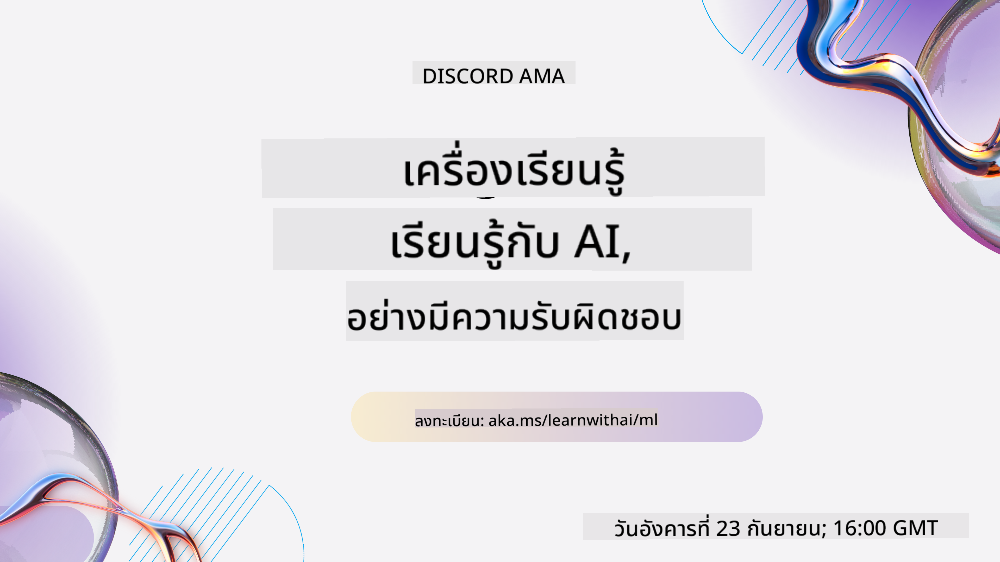
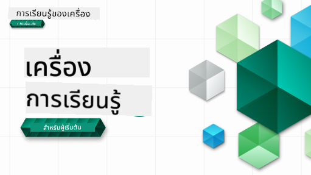

<!--
CO_OP_TRANSLATOR_METADATA:
{
  "original_hash": "7a13afb3674838f557d61f8d67e4d5f8",
  "translation_date": "2025-10-24T09:09:52+00:00",
  "source_file": "README.md",
  "language_code": "th"
}
-->

### 🌐 รองรับหลายภาษา

#### รองรับผ่าน GitHub Action (อัตโนมัติและอัปเดตเสมอ)

[Arabic](../ar/README.md) | [Bengali](../bn/README.md) | [Bulgarian](../bg/README.md) | [Burmese (Myanmar)](../my/README.md) | [Chinese (Simplified)](../zh/README.md) | [Chinese (Traditional, Hong Kong)](../hk/README.md) | [Chinese (Traditional, Macau)](../mo/README.md) | [Chinese (Traditional, Taiwan)](../tw/README.md) | [Croatian](../hr/README.md) | [Czech](../cs/README.md) | [Danish](../da/README.md) | [Dutch](../nl/README.md) | [Estonian](../et/README.md) | [Finnish](../fi/README.md) | [French](../fr/README.md) | [German](../de/README.md) | [Greek](../el/README.md) | [Hebrew](../he/README.md) | [Hindi](../hi/README.md) | [Hungarian](../hu/README.md) | [Indonesian](../id/README.md) | [Italian](../it/README.md) | [Japanese](../ja/README.md) | [Korean](../ko/README.md) | [Lithuanian](../lt/README.md) | [Malay](../ms/README.md) | [Marathi](../mr/README.md) | [Nepali](../ne/README.md) | [Norwegian](../no/README.md) | [Persian (Farsi)](../fa/README.md) | [Polish](../pl/README.md) | [Portuguese (Brazil)](../br/README.md) | [Portuguese (Portugal)](../pt/README.md) | [Punjabi (Gurmukhi)](../pa/README.md) | [Romanian](../ro/README.md) | [Russian](../ru/README.md) | [Serbian (Cyrillic)](../sr/README.md) | [Slovak](../sk/README.md) | [Slovenian](../sl/README.md) | [Spanish](../es/README.md) | [Swahili](../sw/README.md) | [Swedish](../sv/README.md) | [Tagalog (Filipino)](../tl/README.md) | [Tamil](../ta/README.md) | [Thai](./README.md) | [Turkish](../tr/README.md) | [Ukrainian](../uk/README.md) | [Urdu](../ur/README.md) | [Vietnamese](../vi/README.md)

#### เข้าร่วมชุมชนของเรา

เรามีซีรีส์การเรียนรู้ AI ผ่าน Discord ที่กำลังดำเนินอยู่ เรียนรู้เพิ่มเติมและเข้าร่วมกับเราได้ที่ [Learn with AI Series](https://aka.ms/learnwithai/discord) ตั้งแต่วันที่ 18 - 30 กันยายน 2025 คุณจะได้รับเคล็ดลับและเทคนิคในการใช้ GitHub Copilot สำหรับ Data Science

# การเรียนรู้ Machine Learning สำหรับผู้เริ่มต้น - หลักสูตร

> 🌍 เดินทางรอบโลกในขณะที่เราสำรวจการเรียนรู้ของเครื่องผ่านวัฒนธรรมโลก 🌍

ทีม Cloud Advocates จาก Microsoft มีความยินดีที่จะนำเสนอหลักสูตร 12 สัปดาห์ 26 บทเรียนเกี่ยวกับ **Machine Learning** ในหลักสูตรนี้ คุณจะได้เรียนรู้เกี่ยวกับสิ่งที่บางครั้งเรียกว่า **การเรียนรู้ของเครื่องแบบคลาสสิก** โดยใช้ Scikit-learn เป็นไลบรารีหลักและหลีกเลี่ยงการเรียนรู้เชิงลึก ซึ่งครอบคลุมใน [หลักสูตร AI สำหรับผู้เริ่มต้น](https://aka.ms/ai4beginners) คุณสามารถจับคู่บทเรียนเหล่านี้กับ [หลักสูตร Data Science สำหรับผู้เริ่มต้น](https://aka.ms/ds4beginners) ได้เช่นกัน!

เดินทางไปกับเราทั่วโลกในขณะที่เราประยุกต์ใช้เทคนิคคลาสสิกเหล่านี้กับข้อมูลจากหลายพื้นที่ของโลก แต่ละบทเรียนประกอบด้วยแบบทดสอบก่อนและหลังบทเรียน คำแนะนำที่เขียนไว้เพื่อทำบทเรียนให้เสร็จ โซลูชัน งานมอบหมาย และอื่นๆ วิธีการเรียนรู้แบบโครงการช่วยให้คุณเรียนรู้ในขณะที่สร้าง ซึ่งเป็นวิธีที่พิสูจน์แล้วว่าทักษะใหม่จะคงอยู่

**✍️ ขอขอบคุณผู้เขียนของเรา** Jen Looper, Stephen Howell, Francesca Lazzeri, Tomomi Imura, Cassie Breviu, Dmitry Soshnikov, Chris Noring, Anirban Mukherjee, Ornella Altunyan, Ruth Yakubu และ Amy Boyd

**🎨 ขอบคุณนักวาดภาพประกอบของเรา** Tomomi Imura, Dasani Madipalli และ Jen Looper

**🙏 ขอขอบคุณพิเศษ 🙏 นักศึกษา Microsoft Student Ambassador ผู้เขียน ผู้ตรวจสอบ และผู้มีส่วนร่วมในเนื้อหา** โดยเฉพาะ Rishit Dagli, Muhammad Sakib Khan Inan, Rohan Raj, Alexandru Petrescu, Abhishek Jaiswal, Nawrin Tabassum, Ioan Samuila และ Snigdha Agarwal

**🤩 ขอบคุณเพิ่มเติมสำหรับ Microsoft Student Ambassadors Eric Wanjau, Jasleen Sondhi และ Vidushi Gupta สำหรับบทเรียน R ของเรา!**

# เริ่มต้นใช้งาน

ทำตามขั้นตอนเหล่านี้:
1. **Fork Repository**: คลิกที่ปุ่ม "Fork" ที่มุมขวาบนของหน้านี้
2. **Clone Repository**:   `git clone https://github.com/microsoft/ML-For-Beginners.git`

> [ค้นหาทรัพยากรเพิ่มเติมสำหรับหลักสูตรนี้ในคอลเลกชัน Microsoft Learn ของเรา](https://learn.microsoft.com/en-us/collections/qrqzamz1nn2wx3?WT.mc_id=academic-77952-bethanycheum)

> 🔧 **ต้องการความช่วยเหลือ?** ตรวจสอบ [คู่มือการแก้ไขปัญหา](TROUBLESHOOTING.md) ของเราสำหรับการแก้ไขปัญหาทั่วไปเกี่ยวกับการติดตั้ง การตั้งค่า และการดำเนินการบทเรียน

**[นักเรียน](https://aka.ms/student-page)** เพื่อใช้หลักสูตรนี้ ให้ fork repo ทั้งหมดไปยังบัญชี GitHub ของคุณเองและทำแบบฝึกหัดด้วยตัวเองหรือกับกลุ่ม:

- เริ่มต้นด้วยแบบทดสอบก่อนการบรรยาย
- อ่านการบรรยายและทำกิจกรรม หยุดและพิจารณาในแต่ละจุดตรวจสอบความรู้
- พยายามสร้างโครงการโดยทำความเข้าใจบทเรียนแทนที่จะรันโค้ดโซลูชัน อย่างไรก็ตามโค้ดนั้นมีอยู่ในโฟลเดอร์ `/solution` ในแต่ละบทเรียนที่เน้นโครงการ
- ทำแบบทดสอบหลังการบรรยาย
- ทำความท้าทายให้เสร็จ
- ทำงานมอบหมายให้เสร็จ
- หลังจากทำกลุ่มบทเรียนเสร็จแล้ว ไปที่ [กระดานสนทนา](https://github.com/microsoft/ML-For-Beginners/discussions) และ "เรียนรู้แบบเปิดเผย" โดยกรอก PAT rubric ที่เหมาะสม PAT คือเครื่องมือประเมินความก้าวหน้าที่เป็น rubric ที่คุณกรอกเพื่อพัฒนาการเรียนรู้ของคุณ คุณยังสามารถตอบสนองต่อ PAT อื่นๆ เพื่อให้เราเรียนรู้ร่วมกันได้

> สำหรับการศึกษาเพิ่มเติม เราแนะนำให้ติดตาม [Microsoft Learn](https://docs.microsoft.com/en-us/users/jenlooper-2911/collections/k7o7tg1gp306q4?WT.mc_id=academic-77952-leestott) โมดูลและเส้นทางการเรียนรู้

**ครู** เราได้ [รวมคำแนะนำบางส่วน](for-teachers.md) เกี่ยวกับวิธีการใช้หลักสูตรนี้

---

## วิดีโอแนะนำ

บางบทเรียนมีวิดีโอสั้น คุณสามารถค้นหาวิดีโอเหล่านี้ในบทเรียน หรือใน [เพลย์ลิสต์ ML สำหรับผู้เริ่มต้นบนช่อง YouTube ของ Microsoft Developer](https://aka.ms/ml-beginners-videos) โดยคลิกที่ภาพด้านล่าง

---

## พบกับทีมงาน

**Gif โดย** [Mohit Jaisal](https://linkedin.com/in/mohitjaisal)

> 🎥 คลิกที่ภาพด้านบนเพื่อดูวิดีโอเกี่ยวกับโครงการและผู้ที่สร้างมันขึ้นมา!

---

## วิธีการสอน

เราเลือกหลักการสอนสองข้อในขณะที่สร้างหลักสูตรนี้: การทำให้เป็น **โครงการที่ลงมือทำจริง** และการรวม **แบบทดสอบบ่อยครั้ง** นอกจากนี้ หลักสูตรนี้ยังมี **ธีมร่วม** เพื่อให้มีความสอดคล้องกัน

โดยการทำให้เนื้อหาสอดคล้องกับโครงการ กระบวนการจะน่าสนใจมากขึ้นสำหรับนักเรียนและการจดจำแนวคิดจะเพิ่มขึ้น นอกจากนี้ แบบทดสอบที่มีความเสี่ยงต่ำก่อนคลาสจะตั้งเจตนาของนักเรียนในการเรียนรู้หัวข้อ ในขณะที่แบบทดสอบที่สองหลังคลาสจะช่วยเพิ่มการจดจำ หลักสูตรนี้ถูกออกแบบให้ยืดหยุ่นและสนุกสนาน และสามารถเรียนได้ทั้งแบบเต็มหรือบางส่วน โครงการเริ่มต้นเล็กและซับซ้อนขึ้นเรื่อยๆ จนถึงสิ้นสุดรอบ 12 สัปดาห์ หลักสูตรนี้ยังรวมถึงบทส่งท้ายเกี่ยวกับการประยุกต์ใช้ ML ในโลกจริง ซึ่งสามารถใช้เป็นเครดิตเพิ่มเติมหรือเป็นพื้นฐานสำหรับการอภิปราย

> ค้นหา [Code of Conduct](CODE_OF_CONDUCT.md), [Contributing](CONTRIBUTING.md), [Translation](TRANSLATIONS.md), และ [Troubleshooting](TROUBLESHOOTING.md) แนวทางของเรา เราขอต้อนรับความคิดเห็นที่สร้างสรรค์ของคุณ!

## แต่ละบทเรียนประกอบด้วย

- sketchnote (ตัวเลือก)
- วิดีโอเสริม (ตัวเลือก)
- วิดีโอแนะนำ (บางบทเรียนเท่านั้น)
- [แบบทดสอบอุ่นเครื่องก่อนการบรรยาย](https://ff-quizzes.netlify.app/en/ml/)
- บทเรียนที่เขียนไว้
- สำหรับบทเรียนที่เน้นโครงการ คู่มือทีละขั้นตอนเกี่ยวกับวิธีการสร้างโครงการ
- การตรวจสอบความรู้
- ความท้าทาย
- การอ่านเสริม
- งานมอบหมาย
- [แบบทดสอบหลังการบรรยาย](https://ff-quizzes.netlify.app/en/ml/)

> **หมายเหตุเกี่ยวกับภาษา**: บทเรียนเหล่านี้เขียนเป็น Python เป็นหลัก แต่หลายบทเรียนก็มีใน R ด้วย หากต้องการทำบทเรียน R ให้ไปที่โฟลเดอร์ `/solution` และมองหาบทเรียน R ซึ่งมีนามสกุล .rmd ที่แสดงถึงไฟล์ **R Markdown** ซึ่งสามารถอธิบายได้ง่ายๆ ว่าเป็นการฝัง `code chunks` (ของ R หรือภาษาอื่นๆ) และ `YAML header` (ที่แนะนำวิธีการจัดรูปแบบผลลัพธ์ เช่น PDF) ในเอกสาร `Markdown` ดังนั้นจึงเป็นกรอบการเขียนที่เป็นตัวอย่างสำหรับวิทยาศาสตร์ข้อมูล เนื่องจากช่วยให้คุณรวมโค้ด ผลลัพธ์ และความคิดของคุณโดยอนุญาตให้คุณเขียนลงใน Markdown นอกจากนี้ เอกสาร R Markdown สามารถแสดงผลในรูปแบบผลลัพธ์ เช่น PDF, HTML หรือ Word

> **หมายเหตุเกี่ยวกับแบบทดสอบ**: แบบทดสอบทั้งหมดอยู่ใน [โฟลเดอร์ Quiz App](../../quiz-app) รวมทั้งหมด 52 แบบทดสอบ แต่ละแบบมีสามคำถาม แบบทดสอบเหล่านี้เชื่อมโยงจากในบทเรียน แต่แอปแบบทดสอบสามารถรันได้ในเครื่อง ให้ทำตามคำแนะนำในโฟลเดอร์ `quiz-app` เพื่อโฮสต์ในเครื่องหรือปรับใช้ใน Azure

| หมายเลขบทเรียน |                             หัวข้อ                              |                   การจัดกลุ่มบทเรียน                   | วัตถุประสงค์การเรียนรู้                                                                                                             |                                                              บทเรียนที่เชื่อมโยง                                                               |                        ผู้เขียน                        |
| :-----------: | :------------------------------------------------------------: | :-------------------------------------------------: | ------------------------------------------------------------------------------------------------------------------------------- | :--------------------------------------------------------------------------------------------------------------------------------------: | :--------------------------------------------------: |
|      01       |                แนะนำการเรียนรู้ของเครื่อง                |      [Introduction](1-Introduction/README.md)       | เรียนรู้แนวคิดพื้นฐานเกี่ยวกับการเรียนรู้ของเครื่อง                                                                                |                                             [Lesson](1-Introduction/1-intro-to-ML/README.md)                                             |                       Muhammad                       |
|      02       |                ประวัติศาสตร์ของการเรียนรู้ของเครื่อง                 |      [Introduction](1-Introduction/README.md)       | เรียนรู้ประวัติศาสตร์เบื้องหลังของสาขานี้                                                                                         |                                            [Lesson](1-Introduction/2-history-of-ML/README.md)                                            |                     Jen และ Amy                      |
|      03       |                 ความยุติธรรมและการเรียนรู้ของเครื่อง                  |      [Introduction](1-Introduction/README.md)       | ปัญหาทางปรัชญาที่สำคัญเกี่ยวกับความยุติธรรมที่นักเรียนควรพิจารณาเมื่อสร้างและใช้โมเดล ML คืออะไร? |                                              [Lesson](1-Introduction/3-fairness/README.md)                                               |                        Tomomi                        |
|      04       |                เทคนิคสำหรับการเรียนรู้ของเครื่อง                 |      [Introduction](1-Introduction/README.md)       | นักวิจัย ML ใช้เทคนิคอะไรในการสร้างโมเดล ML?                                                                       |                                          [Lesson](1-Introduction/4-techniques-of-ML/README.md)                                           |                    Chris และ Jen                     |
|      05       |                   แนะนำการถดถอย                   |        [Regression](2-Regression/README.md)         | เริ่มต้นใช้งาน Python และ Scikit-learn สำหรับโมเดลการถดถอย                                                                  |         [Python](2-Regression/1-Tools/README.md) • [R](../../2-Regression/1-Tools/solution/R/lesson_1.html)         |      Jen • Eric Wanjau       |
|      06       |                ราคาฟักทองในอเมริกาเหนือ 🎃                |        [Regression](2-Regression/README.md)         | การแสดงผลและการทำความสะอาดข้อมูลเพื่อเตรียมพร้อมสำหรับ ML                                                                                  |          [Python](2-Regression/2-Data/README.md) • [R](../../2-Regression/2-Data/solution/R/lesson_2.html)          |      Jen • Eric Wanjau       |
|      07       |                ราคาฟักทองในอเมริกาเหนือ 🎃                |        [Regression](2-Regression/README.md)         | สร้างโมเดลการถดถอยเชิงเส้นและพหุนาม                                                                                   |        [Python](2-Regression/3-Linear/README.md) • [R](../../2-Regression/3-Linear/solution/R/lesson_3.html)        |      Jen และ Dmitry • Eric Wanjau       |
|      08       |                ราคาฟักทองในอเมริกาเหนือ 🎃                |        [Regression](2-Regression/README.md)         | สร้างโมเดลการถดถอยโลจิสติก                                                                                               |     [Python](2-Regression/4-Logistic/README.md) • [R](../../2-Regression/4-Logistic/solution/R/lesson_4.html)      |      Jen • Eric Wanjau       |
|      09       |                          แอปพลิเคชันเว็บ 🔌                          |           [Web App](3-Web-App/README.md)            | สร้างแอปพลิเคชันเว็บเพื่อใช้โมเดลที่คุณฝึก                                                                                       |                                                 [Python](3-Web-App/1-Web-App/README.md)                                                  |                         Jen                          |
|      10       |                 แนะนำการจำแนกประเภท                 |    [Classification](4-Classification/README.md)     | ทำความสะอาด เตรียม และแสดงผลข้อมูลของคุณ; แนะนำการจำแนกประเภท                                                            | [Python](4-Classification/1-Introduction/README.md) • [R](../../4-Classification/1-Introduction/solution/R/lesson_10.html)  | Jen และ Cassie • Eric Wanjau |
|      11       |             อาหารเอเชียและอินเดียแสนอร่อย 🍜             |    [Classification](4-Classification/README.md)     | แนะนำตัวจำแนกประเภท                                                                                                     | [Python](4-Classification/2-Classifiers-1/README.md) • [R](../../4-Classification/2-Classifiers-1/solution/R/lesson_11.html) | Jen และ Cassie • Eric Wanjau |
|      12       |             อาหารเอเชียและอินเดียแสนอร่อย 🍜             |    [Classification](4-Classification/README.md)     | ตัวจำแนกประเภทเพิ่มเติม                                                                                                                | [Python](4-Classification/3-Classifiers-2/README.md) • [R](../../4-Classification/3-Classifiers-2/solution/R/lesson_12.html) | Jen และ Cassie • Eric Wanjau |
|      13       |             อาหารเอเชียและอินเดียแสนอร่อย 🍜             |    [Classification](4-Classification/README.md)     | สร้างแอปพลิเคชันเว็บแนะนำโดยใช้โมเดลของคุณ                                                                                    |                                              [Python](4-Classification/4-Applied/README.md)                                              |                         Jen                          |
|      14       |                   แนะนำการจัดกลุ่ม                   |        [Clustering](5-Clustering/README.md)         | ทำความสะอาด เตรียม และแสดงผลข้อมูลของคุณ; แนะนำการจัดกลุ่ม                                                                |         [Python](5-Clustering/1-Visualize/README.md) • [R](../../5-Clustering/1-Visualize/solution/R/lesson_14.html)         |      Jen • Eric Wanjau       |
|      15       |              สำรวจรสนิยมดนตรีของไนจีเรีย 🎧              |        [Clustering](5-Clustering/README.md)         | สำรวจวิธีการจัดกลุ่ม K-Means                                                                                           |           [Python](5-Clustering/2-K-Means/README.md) • [R](../../5-Clustering/2-K-Means/solution/R/lesson_15.html)           |      Jen • Eric Wanjau       |
|      16       |        แนะนำการประมวลผลภาษาธรรมชาติ ☕️         |   [Natural language processing](6-NLP/README.md)    | เรียนรู้พื้นฐานเกี่ยวกับ NLP โดยการสร้างบอทง่ายๆ                                                                             |                                             [Python](6-NLP/1-Introduction-to-NLP/README.md)                                              |                       Stephen                        |
|      17       |                      งาน NLP ทั่วไป ☕️                      |   [Natural language processing](6-NLP/README.md)    | เพิ่มพูนความรู้เกี่ยวกับ NLP โดยการทำความเข้าใจงานทั่วไปที่จำเป็นเมื่อจัดการกับโครงสร้างภาษา                          |                                                    [Python](6-NLP/2-Tasks/README.md)                                                     |                       Stephen                        |
|      18       |             การแปลและการวิเคราะห์ความรู้สึก ♥️              |   [Natural language processing](6-NLP/README.md)    | การแปลและการวิเคราะห์ความรู้สึกกับ Jane Austen                                                                             |                                            [Python](6-NLP/3-Translation-Sentiment/README.md)                                             |                       Stephen                        |
|      19       |                  โรงแรมโรแมนติกในยุโรป ♥️                  |   [Natural language processing](6-NLP/README.md)    | การวิเคราะห์ความรู้สึกกับรีวิวโรงแรม 1                                                                                         |                                               [Python](6-NLP/4-Hotel-Reviews-1/README.md)                                                |                       Stephen                        |
|      20       |                  โรงแรมโรแมนติกในยุโรป ♥️                  |   [Natural language processing](6-NLP/README.md)    | การวิเคราะห์ความรู้สึกกับรีวิวโรงแรม 2                                                                                         |                                               [Python](6-NLP/5-Hotel-Reviews-2/README.md)                                                |                       Stephen                        |
|      21       |            แนะนำการพยากรณ์อนุกรมเวลา             |        [Time series](7-TimeSeries/README.md)        | แนะนำการพยากรณ์อนุกรมเวลา                                                                                         |                                             [Python](7-TimeSeries/1-Introduction/README.md)                                              |                      Francesca                       |
|      22       | ⚡️ การใช้พลังงานโลก ⚡️ - การพยากรณ์อนุกรมเวลาด้วย ARIMA |        [Time series](7-TimeSeries/README.md)        | การพยากรณ์อนุกรมเวลาด้วย ARIMA                                                                                              |                                                 [Python](7-TimeSeries/2-ARIMA/README.md)                                                 |                      Francesca                       |
|      23       |  ⚡️ การใช้พลังงานโลก ⚡️ - การพยากรณ์อนุกรมเวลาด้วย SVR  |        [Time series](7-TimeSeries/README.md)        | การพยากรณ์อนุกรมเวลาด้วย Support Vector Regressor                                                                           |                                                  [Python](7-TimeSeries/3-SVR/README.md)                                                  |                       Anirban                        |
|      24       |             แนะนำการเรียนรู้แบบเสริมกำลัง             | [Reinforcement learning](8-Reinforcement/README.md) | แนะนำการเรียนรู้แบบเสริมกำลังด้วย Q-Learning                                                                          |                                             [Python](8-Reinforcement/1-QLearning/README.md)                                              |                        Dmitry                        |
|      25       |                 ช่วย Peter หนีหมาป่า! 🐺                  | [Reinforcement learning](8-Reinforcement/README.md) | การเรียนรู้แบบเสริมกำลังใน Gym                                                                                                      |                                                [Python](8-Reinforcement/2-Gym/README.md)                                                 |                        Dmitry                        |
|  Postscript   |            สถานการณ์และการประยุกต์ใช้ ML ในโลกจริง            |      [ML in the Wild](9-Real-World/README.md)       | การประยุกต์ใช้ ML แบบคลาสสิกที่น่าสนใจและเปิดเผย                                                               |                                             [Lesson](9-Real-World/1-Applications/README.md)                                              |                         ทีม                         |
|  Postscript   |            การดีบักโมเดลใน ML โดยใช้แดชบอร์ด RAI          |      [ML in the Wild](9-Real-World/README.md)       | การดีบักโมเดลใน Machine Learning โดยใช้ส่วนประกอบแดชบอร์ด Responsible AI                                                              |                                             [Lesson](9-Real-World/2-Debugging-ML-Models/README.md)                                              |                         Ruth Yakubu                       |

> [ค้นหาทรัพยากรเพิ่มเติมสำหรับหลักสูตรนี้ในคอลเลกชัน Microsoft Learn ของเรา](https://learn.microsoft.com/en-us/collections/qrqzamz1nn2wx3?WT.mc_id=academic-77952-bethanycheum)

## การเข้าถึงแบบออฟไลน์

คุณสามารถเรียกใช้เอกสารนี้แบบออฟไลน์โดยใช้ [Docsify](https://docsify.js.org/#/). Fork repo นี้, [ติดตั้ง Docsify](https://docsify.js.org/#/quickstart) บนเครื่องของคุณ, และในโฟลเดอร์ root ของ repo นี้, พิมพ์ `docsify serve`. เว็บไซต์จะถูกให้บริการบนพอร์ต 3000 บน localhost ของคุณ: `localhost:3000`.

## PDFs

ค้นหาไฟล์ pdf ของหลักสูตรพร้อมลิงก์ [ที่นี่](https://microsoft.github.io/ML-For-Beginners/pdf/readme.pdf).

## 🎒 หลักสูตรอื่น ๆ 

ทีมของเราผลิตหลักสูตรอื่น ๆ! ลองดู:

### Azure / Edge / MCP / Agents

---
 
### Generative AI Series

[-9333EA?style=for-the-badge&labelColor=E5E7EB&color=9333EA)](https://github.com/microsoft/Generative-AI-for-beginners-dotnet?WT.mc_id=academic-105485-koreyst)
[-C084FC?style=for-the-badge&labelColor=E5E7EB&color=C084FC)](https://github.com/microsoft/generative-ai-for-beginners-java?WT.mc_id=academic-105485-koreyst)
[-E879F9?style=for-the-badge&labelColor=E5E7EB&color=E879F9)](https://github.com/microsoft/generative-ai-with-javascript?WT.mc_id=academic-105485-koreyst)

---
 
### Core Learning
  
  
  
  
  
  
  

---

### ซีรีส์ Copilot  
  
  
  

## ขอความช่วยเหลือ  

หากคุณติดขัดหรือมีคำถามเกี่ยวกับการสร้างแอป AI เข้าร่วม:  

  

หากคุณมีข้อเสนอแนะเกี่ยวกับผลิตภัณฑ์หรือพบข้อผิดพลาดขณะสร้างแอป โปรดเยี่ยมชม:  

  

---

**ข้อจำกัดความรับผิดชอบ**:  
เอกสารนี้ได้รับการแปลโดยใช้บริการแปลภาษา AI [Co-op Translator](https://github.com/Azure/co-op-translator) แม้ว่าเราจะพยายามให้การแปลมีความถูกต้อง แต่โปรดทราบว่าการแปลอัตโนมัติอาจมีข้อผิดพลาดหรือความไม่ถูกต้อง เอกสารต้นฉบับในภาษาดั้งเดิมควรถือเป็นแหล่งข้อมูลที่เชื่อถือได้ สำหรับข้อมูลที่สำคัญ ขอแนะนำให้ใช้บริการแปลภาษามืออาชีพ เราจะไม่รับผิดชอบต่อความเข้าใจผิดหรือการตีความผิดที่เกิดจากการใช้การแปลนี้