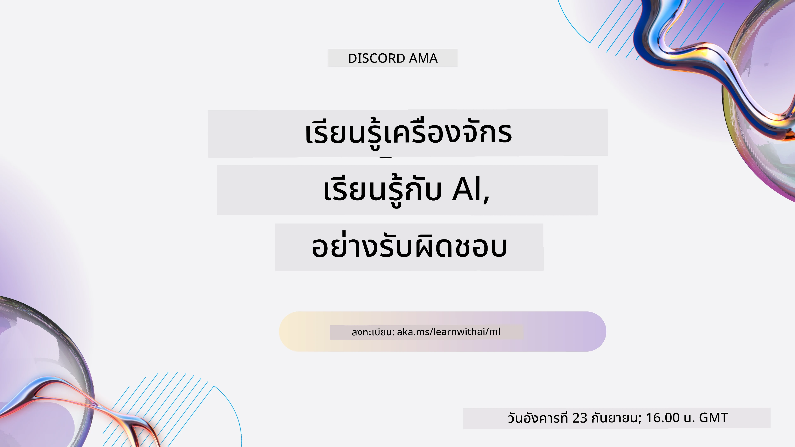
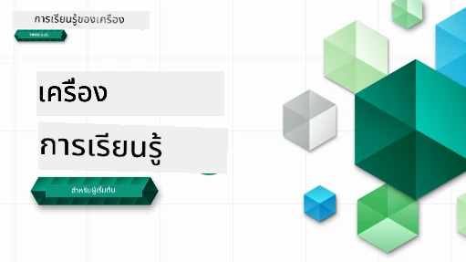

[](https://github.com/microsoft/ML-For-Beginners/blob/master/LICENSE)
[](https://GitHub.com/microsoft/ML-For-Beginners/graphs/contributors/)
[](https://GitHub.com/microsoft/ML-For-Beginners/issues/)
[](https://GitHub.com/microsoft/ML-For-Beginners/pulls/)
[](http://makeapullrequest.com)

[](https://GitHub.com/microsoft/ML-For-Beginners/watchers/)
[](https://GitHub.com/microsoft/ML-For-Beginners/network/)
[](https://GitHub.com/microsoft/ML-For-Beginners/stargazers/)

### 🌐 การสนับสนุนหลายภาษา

#### สนับสนุนผ่าน GitHub Action (อัตโนมัติ & อัปเดตเสมอ)

<!-- CO-OP TRANSLATOR LANGUAGES TABLE START -->
[อาหรับ](../ar/README.md) | [เบงกาลี](../bn/README.md) | [บัลแกเรีย](../bg/README.md) | [พม่า (เมียนมา)](../my/README.md) | [จีน (ตัวย่อ)](../zh-CN/README.md) | [จีน (ตัวเต็ม, ฮ่องกง)](../zh-HK/README.md) | [จีน (ตัวเต็ม, มาเก๊า)](../zh-MO/README.md) | [จีน (ตัวเต็ม, ไต้หวัน)](../zh-TW/README.md) | [โครเอเชีย](../hr/README.md) | [เช็ก](../cs/README.md) | [เดนมาร์ก](../da/README.md) | [ดัตช์](../nl/README.md) | [เอสโตเนีย](../et/README.md) | [ฟินแลนด์](../fi/README.md) | [ฝรั่งเศส](../fr/README.md) | [เยอรมัน](../de/README.md) | [กรีก](../el/README.md) | [ฮีบรู](../he/README.md) | [ฮินดี](../hi/README.md) | [ฮังการี](../hu/README.md) | [อินโดนีเซีย](../id/README.md) | [อิตาลี](../it/README.md) | [ญี่ปุ่น](../ja/README.md) | [กันนาดา](../kn/README.md) | [เขมร](../km/README.md) | [เกาหลี](../ko/README.md) | [ลิทัวเนีย](../lt/README.md) | [มาเลย์](../ms/README.md) | [มาลายาลัม](../ml/README.md) | [มาราธี](../mr/README.md) | [เนปาล](../ne/README.md) | [ไนจีเรีย พิดจิน](../pcm/README.md) | [นอร์เวย์](../no/README.md) | [เปอร์เซีย (ฟาร์ซี)](../fa/README.md) | [โปแลนด์](../pl/README.md) | [โปรตุเกส (บราซิล)](../pt-BR/README.md) | [โปรตุเกส (โปรตุเกส)](../pt-PT/README.md) | [ปัญจาบี (กูรมูขิ)](../pa/README.md) | [โรมาเนีย](../ro/README.md) | [รัสเซีย](../ru/README.md) | [เซอร์เบีย (ซีริลลิก)](../sr/README.md) | [สโลวัค](../sk/README.md) | [สโลวีเนีย](../sl/README.md) | [สเปน](../es/README.md) | [สวาฮีลี](../sw/README.md) | [สวีเดน](../sv/README.md) | [ตากาล็อก (ฟิลิปปินส์)](../tl/README.md) | [ทมิฬ](../ta/README.md) | [เทลูกู](../te/README.md) | [ไทย](./README.md) | [ตุรกี](../tr/README.md) | [ยูเครน](../uk/README.md) | [อูรดู](../ur/README.md) | [เวียดนาม](../vi/README.md)

> **ชอบโคลนแบบท้องถิ่นไหม?**
>
> ที่เก็บนี้รวมการแปลภาษา 50+ ภาษา ซึ่งเพิ่มขนาดการดาวน์โหลดอย่างมาก ถ้าต้องการโคลนโดยไม่เอาการแปล ให้ใช้ sparse checkout:
>
> **Bash / macOS / Linux:**
> ```bash
> git clone --filter=blob:none --sparse https://github.com/microsoft/ML-For-Beginners.git
> cd ML-For-Beginners
> git sparse-checkout set --no-cone '/*' '!translations' '!translated_images'
> ```
>
> **CMD (Windows):**
> ```cmd
> git clone --filter=blob:none --sparse https://github.com/microsoft/ML-For-Beginners.git
> cd ML-For-Beginners
> git sparse-checkout set --no-cone "/*" "!translations" "!translated_images"
> ```
>
> วิธีนี้จะให้ทุกสิ่งที่คุณต้องใช้เพื่อทำหลักสูตรให้เสร็จอย่างรวดเร็วขึ้นมาก
<!-- CO-OP TRANSLATOR LANGUAGES TABLE END -->

#### เข้าร่วมชุมชนของเรา

[](https://discord.gg/nTYy5BXMWG)

เรามีซีรีส์เรียนรู้กับ AI บน Discord อยู่ เรียนรู้เพิ่มเติมและเข้าร่วมกับเราได้ที่ [Learn with AI Series](https://aka.ms/learnwithai/discord) ตั้งแต่วันที่ 18 - 30 กันยายน 2025 คุณจะได้รับเคล็ดลับและเทคนิคการใช้ GitHub Copilot สำหรับวิทยาศาสตร์ข้อมูล



# การเรียนรู้ของเครื่องสำหรับผู้เริ่มต้น - หลักสูตร

> 🌍 ท่องเที่ยวรอบโลกพร้อมกับสำรวจกระบวนการเรียนรู้ของเครื่องผ่านวัฒนธรรมโลก 🌍

ทีม Cloud Advocates ที่ Microsoft ยินดีนำเสนอหลักสูตร 12 สัปดาห์, 26 บทเรียน เกี่ยวกับ **การเรียนรู้ของเครื่อง** ในหลักสูตรนี้ คุณจะได้เรียนรู้สิ่งที่บางครั้งเรียกว่า **การเรียนรู้ของเครื่องแบบคลาสสิก** โดยใช้ Scikit-learn เป็นหลักและหลีกเลี่ยงการเรียนรู้เชิงลึก ซึ่งจะสอนในหลักสูตร [AI for Beginners](https://aka.ms/ai4beginners) รวมถึงจับคู่บทเรียนกับหลักสูตร ['Data Science for Beginners'](https://aka.ms/ds4beginners) ของเราเช่นกัน!

ท่องเที่ยวไปกับเรารอบโลกขณะที่เราประยุกต์ใช้เทคนิคคลาสสิกเหล่านี้กับข้อมูลจากหลายพื้นที่ของโลก แต่ละบทเรียนมีแบบทดสอบก่อนและหลังเรียน คำแนะนำเป็นลายลักษณ์อักษรสำหรับทำบทเรียน โซลูชัน งานมอบหมาย และอื่น ๆ วิธีการสอนโดยใช้โครงการทำให้คุณเรียนรู้ขณะสร้าง ซึ่งเป็นวิธีที่พิสูจน์แล้วว่าสำหรับการจดจำทักษะใหม่ๆ

**✍️ ขอขอบคุณอย่างอบอุ่นแก่ผู้เขียนของเรา** Jen Looper, Stephen Howell, Francesca Lazzeri, Tomomi Imura, Cassie Breviu, Dmitry Soshnikov, Chris Noring, Anirban Mukherjee, Ornella Altunyan, Ruth Yakubu และ Amy Boyd

**🎨 ขอบคุณอีกครั้งแก่ผู้วาดภาพประกอบของเรา** Tomomi Imura, Dasani Madipalli และ Jen Looper

**🙏 ขอบคุณเป็นพิเศษ 🙏 แก่ผู้เขียน, ผู้ตรวจสอบและผู้สนับสนุนเนื้อหาจาก Microsoft Student Ambassador** โดยเฉพาะอย่างยิ่ง Rishit Dagli, Muhammad Sakib Khan Inan, Rohan Raj, Alexandru Petrescu, Abhishek Jaiswal, Nawrin Tabassum, Ioan Samuila และ Snigdha Agarwal

**🤩 ขอขอบคุณเพิ่มเติมแก่ Microsoft Student Ambassadors Eric Wanjau, Jasleen Sondhi และ Vidushi Gupta สำหรับบทเรียน R ของเรา!**

# เริ่มต้นใช้งาน

ทำตามขั้นตอนเหล่านี้:
1. **Fork ที่เก็บข้อมูล**: คลิกปุ่ม "Fork" ที่มุมบนขวาของหน้านี้
2. **Clone ที่เก็บข้อมูล**:   `git clone https://github.com/microsoft/ML-For-Beginners.git`

> 💡 **เคล็ดลับเริ่มต้นอย่างรวดเร็ว:** ต้องการเริ่มต้นในเบราว์เซอร์โดยไม่ต้องติดตั้ง Python ในเครื่องหรือไม่? ใช้ [GitHub Codespaces](https://github.com/features/codespaces) เพื่อสร้างสภาพแวดล้อมพัฒนาในคลาวด์สำหรับ fork ของคุณ เปิดเมนูสีเขียว **Code** เลือก **Codespaces** และสร้าง codespace; ติดตั้ง dependencies ที่จำเป็นสำหรับแต่ละบทเรียนตามต้องการ

> [ค้นหาทรัพยากรเพิ่มเติมสำหรับหลักสูตรนี้ในคอลเลกชัน Microsoft Learn ของเรา](https://learn.microsoft.com/en-us/collections/qrqzamz1nn2wx3?WT.mc_id=academic-77952-bethanycheum)

> 🔧 **ต้องการความช่วยเหลือ?** ตรวจสอบ [คู่มือแก้ไขปัญหา](TROUBLESHOOTING.md) สำหรับวิธีแก้ไขปัญหาทั่วไปเกี่ยวกับการติดตั้ง การตั้งค่า และการรันบทเรียน


**[นักเรียน](https://aka.ms/student-page)** ในการใช้หลักสูตรนี้ ให้ fork entire repo ไปยังบัญชี GitHub ของคุณและทำแบบฝึกหัดด้วยตัวเองหรือเป็นกลุ่ม:

- เริ่มต้นด้วยแบบทดสอบก่อนบรรยาย
- อ่านบรรยายและทำกิจกรรม โดยหยุดและสะท้อนความคิดในแต่ละจุดตรวจสอบความรู้
- พยายามสร้างโครงการโดยเข้าใจบทเรียนแทนการรันโค้ดโซลูชัน อย่างไรก็ตาม โค้ดนั้นมีอยู่ในโฟลเดอร์ `/solution` ในแต่ละบทเรียนที่เน้นโครงการ
- ทำแบบทดสอบหลังบรรยาย
- ทำความท้าทายให้เสร็จ
- ทำงานมอบหมายให้เสร็จ
- หลังจากทำกลุ่มบทเรียนเสร็จ ให้ไปที่ [บอร์ดสนทนา](https://github.com/microsoft/ML-For-Beginners/discussions) และ "เรียนรู้เสียงดัง" โดยกรอกแบบประเมิน PAT ที่เหมาะสม PAT คือเครื่องมือประเมินความก้าวหน้าเป็นแบบประเมินที่คุณกรอกเพื่อส่งเสริมการเรียนรู้ของคุณ คุณยังสามารถแสดงปฏิกิริยาต่อ PAT อื่น ๆ เพื่อที่เราจะได้เรียนรู้ร่วมกัน

> สำหรับการศึกษาต่อ เราแนะนำให้ติดตามโมดูลและเส้นทางการเรียนรู้ [Microsoft Learn](https://docs.microsoft.com/en-us/users/jenlooper-2911/collections/k7o7tg1gp306q4?WT.mc_id=academic-77952-leestott)

**ครู** เรามี [คำแนะนำบางอย่าง](for-teachers.md) เกี่ยวกับวิธีใช้หลักสูตรนี้

---

## วิดีโอแนะนำ

บางบทเรียนมีวิดีโอสั้น คุณสามารถหาทั้งหมดนี้ในบทเรียน หรือใน [เพลย์ลิสต์ ML for Beginners บนช่อง Microsoft Developer YouTube](https://aka.ms/ml-beginners-videos) โดยคลิกที่ภาพด้านล่าง

[](https://aka.ms/ml-beginners-videos)

---

## พบกับทีมงาน

[](https://youtu.be/Tj1XWrDSYJU)

**ภาพเคลื่อนไหวโดย** [Mohit Jaisal](https://linkedin.com/in/mohitjaisal)

> 🎥 คลิกภาพด้านบนเพื่อดูวิดีโอเกี่ยวกับโครงการและผู้ที่สร้างมัน!

---

## แนวทางการสอน

เราเลือกสองหลักการทางการสอนขณะสร้างหลักสูตรนี้: รับประกันว่าหลักสูตรเป็นแบบ **เรียนรู้ผ่านโครงการ** และมี **แบบทดสอบบ่อยครั้ง** นอกจากนี้ หลักสูตรนี้ยังมี **ธีมร่วมกัน** เพื่อให้มีความสอดคล้อง

โดยการรับประกันว่าเนื้อหาสอดคล้องกับโครงการ กระบวนการเรียนจะสนุกสนานขึ้นสำหรับนักเรียนและทำให้ความเข้าใจแนวคิดดีขึ้น นอกจากนี้ แบบทดสอบที่มีความเสี่ยงต่ำก่อนเรียนก็กำหนดเจตนารมณ์ให้นักเรียนเรียนรู้เรื่องนั้นๆ ขณะที่แบบทดสอบที่สองหลังเรียนช่วยให้ความจำดีขึ้น หลักสูตรออกแบบให้ยืดหยุ่นและสนุก และสามารถเรียนครบถ้วนหรือแค่บางส่วน โครงการจะเริ่มต้นเล็ก ๆ และซับซ้อนขึ้นเรื่อย ๆ ภายใน 12 สัปดาห์หลักสูตรนี้ยังมีส่วนต่อท้ายเกี่ยวกับการใช้งานจริงของ ML ซึ่งสามารถใช้เป็นเครดิตพิเศษหรือเป็นฐานสำหรับการอภิปราย

> ค้นหา [Code of Conduct](CODE_OF_CONDUCT.md), [การมีส่วนร่วม](CONTRIBUTING.md), [การแปล](..) และ [การแก้ปัญหา](TROUBLESHOOTING.md) ของเรา เรายินดีรับฟังคำติชมเพื่อการปรับปรุง!

## ในแต่ละบทเรียนประกอบด้วย

- บันทึกสเก็ตช์โน้ตเลือกได้
- วิดีโอเสริมเลือกได้
- วิดีโอแนะนำ (เฉพาะบางบทเรียน)
- [แบบทดสอบอบอุ่นก่อนบรรยาย](https://ff-quizzes.netlify.app/en/ml/)
- บทเรียนเป็นลายลักษณ์อักษร
- สำหรับบทเรียนเน้นโครงการ คู่มือทีละขั้นตอนวิธีสร้างโครงการ
- จุดตรวจสอบความรู้
- ความท้าทาย
- การอ่านเสริม
- งานมอบหมาย
- [แบบทดสอบหลังบรรยาย](https://ff-quizzes.netlify.app/en/ml/)

> **หมายเหตุเกี่ยวกับภาษา**: บทเรียนเหล่านี้เขียนหลัก ๆ ในภาษา Python แต่หลายบทเป็นภาษา R ด้วย ในการทำบทเรียน R ให้ไปที่โฟลเดอร์ `/solution` และค้นหาบทเรียน R ซึ่งรวมไฟล์ .rmd ที่เป็นไฟล์ **R Markdown** ซึ่งกำหนดอย่างง่ายว่าเป็นการฝัง `code chunks` (ของ R หรือภาษาอื่น ๆ) และ `YAML header` (ซึ่งแนะนำวิธีจัดรูปแบบผลลัพธ์เช่น PDF) ใน `Markdown document` ดังนั้นจึงเป็นกรอบการเขียนแบบอย่างสำหรับวิทยาศาสตร์ข้อมูลเพราะช่วยให้คุณรวมรหัส ผลลัพธ์ และความคิดของคุณโดยช่วยให้คุณเขียนใน Markdown นอกจากนี้ เอกสาร R Markdown ยังสามารถแสดงผลในรูปแบบ PDF, HTML หรือ Word ได้

> **หมายเหตุเกี่ยวกับแบบทดสอบ**: แบบทดสอบทั้งหมดอยู่ใน [โฟลเดอร์ Quiz App](../../quiz-app) มีทั้งหมด 52 แบบทดสอบ แต่ละแบบมีสามคำถาม พวกนี้เชื่อมโยงจากในบทเรียนแต่ก็สามารถรันแอปแบบทดสอบได้ในเครื่อง; ทำตามคำแนะนำในโฟลเดอร์ `quiz-app` เพื่อโฮสต์หรือดีพลอยใน Azure

| หมายเลขบทเรียน |                             หัวข้อ                             |                   กลุ่มบทเรียน                   | วัตถุประสงค์การเรียนรู้                                                                                                             |                                                              บทเรียนที่เชื่อมโยง                                                               |                        ผู้เขียน                        |
| :-----------: | :------------------------------------------------------------: | :-------------------------------------------------: | ------------------------------------------------------------------------------------------------------------------------------- | :--------------------------------------------------------------------------------------------------------------------------------------: | :--------------------------------------------------: |
|      01       |                บทนำสู่การเรียนรู้ของเครื่อง                |      [Introduction](1-Introduction/README.md)       | เรียนรู้แนวคิดพื้นฐานเบื้องหลังการเรียนรู้ของเครื่อง                                                                                |                                             [Lesson](1-Introduction/1-intro-to-ML/README.md)                                             |                       Muhammad                       |
|      02       |                ประวัติของการเรียนรู้ของเครื่อง                 |      [Introduction](1-Introduction/README.md)       | เรียนรู้ประวัติศาสตร์ที่อยู่เบื้องหลังสาขาวิชานี้                                                                                         |                                            [Lesson](1-Introduction/2-history-of-ML/README.md)                                            |                     Jen and Amy                      |
|      03       |                 ความเป็นธรรมและการเรียนรู้ของเครื่อง                  |      [Introduction](1-Introduction/README.md)       | ปัญหาทางปรัชญาที่สำคัญเกี่ยวกับความเป็นธรรมที่นักเรียนควรพิจารณาเมื่อสร้างและใช้โมเดล ML คืออะไร? |                                              [Lesson](1-Introduction/3-fairness/README.md)                                               |                        Tomomi                        |
|      04       |                เทคนิคสำหรับการเรียนรู้ของเครื่อง                 |      [Introduction](1-Introduction/README.md)       | นักวิจัย ML ใช้เทคนิคอะไรในการสร้างโมเดล ML?                                                                       |                                          [Lesson](1-Introduction/4-techniques-of-ML/README.md)                                           |                    Chris and Jen                     |
|      05       |                   บทนำสู่การถดถอย                   |        [Regression](2-Regression/README.md)         | เริ่มต้นกับ Python และ Scikit-learn สำหรับโมเดลการถดถอย                                                                  |         [Python](2-Regression/1-Tools/README.md) • [R](../../2-Regression/1-Tools/solution/R/lesson_1.html)         |      Jen • Eric Wanjau       |
|      06       |                ราคาฟักทองในอเมริกาเหนือ 🎃                |        [Regression](2-Regression/README.md)         | การแสดงภาพและทำความสะอาดข้อมูลเพื่อเตรียมความพร้อมสำหรับ ML                                                                                  |          [Python](2-Regression/2-Data/README.md) • [R](../../2-Regression/2-Data/solution/R/lesson_2.html)          |      Jen • Eric Wanjau       |
|      07       |                ราคาฟักทองในอเมริกาเหนือ 🎃                |        [Regression](2-Regression/README.md)         | สร้างโมเดลการถดถอยเชิงเส้นและพหุนาม                                                                                   |        [Python](2-Regression/3-Linear/README.md) • [R](../../2-Regression/3-Linear/solution/R/lesson_3.html)        |      Jen and Dmitry • Eric Wanjau       |
|      08       |                ราคาฟักทองในอเมริกาเหนือ 🎃                |        [Regression](2-Regression/README.md)         | สร้างโมเดลการถดถอยโลจิสติก                                                                                               |     [Python](2-Regression/4-Logistic/README.md) • [R](../../2-Regression/4-Logistic/solution/R/lesson_4.html)      |      Jen • Eric Wanjau       |
|      09       |                          เว็บแอป 🔌                          |           [Web App](3-Web-App/README.md)            | สร้างเว็บแอปเพื่อใช้โมเดลที่ผ่านการฝึกแล้ว                                                                                       |                                                 [Python](3-Web-App/1-Web-App/README.md)                                                  |                         Jen                          |
|      10       |                 บทนำสู่การจัดหมวดหมู่                 |    [Classification](4-Classification/README.md)     | ทำความสะอาด เตรียม และแสดงภาพข้อมูลของคุณ; บทนำสู่การจัดหมวดหมู่                                                            | [Python](4-Classification/1-Introduction/README.md) • [R](../../4-Classification/1-Introduction/solution/R/lesson_10.html)  | Jen and Cassie • Eric Wanjau |
|      11       |             อาหารเอเชียและอินเดียอร่อย 🍜             |    [Classification](4-Classification/README.md)     | บทนำสู่ตัวจัดหมวดหมู่                                                                                                     | [Python](4-Classification/2-Classifiers-1/README.md) • [R](../../4-Classification/2-Classifiers-1/solution/R/lesson_11.html) | Jen and Cassie • Eric Wanjau |
|      12       |             อาหารเอเชียและอินเดียอร่อย 🍜             |    [Classification](4-Classification/README.md)     | ตัวจัดหมวดหมู่อีกหลายตัว                                                                                                                | [Python](4-Classification/3-Classifiers-2/README.md) • [R](../../4-Classification/3-Classifiers-2/solution/R/lesson_12.html) | Jen and Cassie • Eric Wanjau |
|      13       |             อาหารเอเชียและอินเดียอร่อย 🍜             |    [Classification](4-Classification/README.md)     | สร้างเว็บแอปแนะนำโดยใช้โมเดลของคุณ                                                                                    |                                              [Python](4-Classification/4-Applied/README.md)                                              |                         Jen                          |
|      14       |                   บทนำสู่การจัดกลุ่ม                   |        [Clustering](5-Clustering/README.md)         | ทำความสะอาด เตรียม และแสดงภาพข้อมูลของคุณ; บทนำสู่การจัดกลุ่ม                                                                |         [Python](5-Clustering/1-Visualize/README.md) • [R](../../5-Clustering/1-Visualize/solution/R/lesson_14.html)         |      Jen • Eric Wanjau       |
|      15       |              สำรวจรสนิยมดนตรีไนจีเรีย 🎧              |        [Clustering](5-Clustering/README.md)         | สำรวจวิธีการจัดกลุ่ม K-Means                                                                                           |           [Python](5-Clustering/2-K-Means/README.md) • [R](../../5-Clustering/2-K-Means/solution/R/lesson_15.html)           |      Jen • Eric Wanjau       |
|      16       |        บทนำสู่การประมวลผลภาษาธรรมชาติ ☕️         |   [Natural language processing](6-NLP/README.md)    | เรียนรู้พื้นฐานเกี่ยวกับ NLP โดยการสร้างบ็อตง่ายๆ                                                                             |                                             [Python](6-NLP/1-Introduction-to-NLP/README.md)                                              |                       Stephen                        |
|      17       |                      งาน NLP ทั่วไป ☕️                      |   [Natural language processing](6-NLP/README.md)    | เจาะลึกความรู้ NLP ของคุณโดยการทำความเข้าใจงานทั่วไปที่จำเป็นเมื่อต้องจัดการกับโครงสร้างภาษา                          |                                                    [Python](6-NLP/2-Tasks/README.md)                                                     |                       Stephen                        |
|      18       |             การแปลภาษาและการวิเคราะห์อารมณ์ ♥️              |   [Natural language processing](6-NLP/README.md)    | การแปลภาษาและการวิเคราะห์อารมณ์กับ Jane Austen                                                                             |                                            [Python](6-NLP/3-Translation-Sentiment/README.md)                                             |                       Stephen                        |
|      19       |                  โรงแรมโรแมนติกของยุโรป ♥️                  |   [Natural language processing](6-NLP/README.md)    | การวิเคราะห์อารมณ์กับรีวิวโรงแรม 1                                                                                         |                                               [Python](6-NLP/4-Hotel-Reviews-1/README.md)                                                |                       Stephen                        |
|      20       |                  โรงแรมโรแมนติกของยุโรป ♥️                  |   [Natural language processing](6-NLP/README.md)    | การวิเคราะห์อารมณ์กับรีวิวโรงแรม 2                                                                                         |                                               [Python](6-NLP/5-Hotel-Reviews-2/README.md)                                                |                       Stephen                        |
|      21       |            บทนำสู่การพยากรณ์อนุกรมเวลา             |        [Time series](7-TimeSeries/README.md)        | บทนำสู่การพยากรณ์อนุกรมเวลา                                                                                         |                                             [Python](7-TimeSeries/1-Introduction/README.md)                                              |                      Francesca                       |
|      22       | ⚡️ การใช้พลังงานโลก ⚡️ - การพยากรณ์อนุกรมเวลากับ ARIMA |        [Time series](7-TimeSeries/README.md)        | การพยากรณ์อนุกรมเวลากับ ARIMA                                                                                              |                                                 [Python](7-TimeSeries/2-ARIMA/README.md)                                                 |                      Francesca                       |
|      23       |  ⚡️ การใช้พลังงานโลก ⚡️ - การพยากรณ์อนุกรมเวลากับ SVR  |        [Time series](7-TimeSeries/README.md)        | การพยากรณ์อนุกรมเวลาด้วย Support Vector Regressor                                                                           |                                                  [Python](7-TimeSeries/3-SVR/README.md)                                                  |                       Anirban                        |
|      24       |             บทนำสู่การเรียนรู้แบบเสริมแรง             | [Reinforcement learning](8-Reinforcement/README.md) | บทนำสู่การเรียนรู้แบบเสริมแรงด้วย Q-Learning                                                                          |                                             [Python](8-Reinforcement/1-QLearning/README.md)                                              |                        Dmitry                        |
|      25       |                 ช่วยปีเตอร์หลีกเลี่ยงหมาป่า! 🐺                  | [Reinforcement learning](8-Reinforcement/README.md) | การเรียนรู้แบบเสริมแรง Gym                                                                                                      |                                                [Python](8-Reinforcement/2-Gym/README.md)                                                 |                        Dmitry                        |
|  Postscript   |            สถานการณ์และการประยุกต์จริงใน ML            |      [ML in the Wild](9-Real-World/README.md)       | การประยุกต์ใช้ ML คลาสสิกในโลกจริงที่น่าสนใจและเปิดเผย                                                               |                                             [Lesson](9-Real-World/1-Applications/README.md)                                              |                         Team                         |
|  Postscript   |            การดีบักโมเดลใน ML โดยใช้แดชบอร์ด RAI            |      [ML in the Wild](9-Real-World/README.md)       | การดีบักโมเดลในการเรียนรู้ของเครื่องโดยใช้ส่วนประกอบแดชบอร์ด Responsible AI                                                              |                                             [Lesson](9-Real-World/2-Debugging-ML-Models/README.md)                                              |                     Ruth Yakubu                      |

> [ค้นหาทรัพยากรเพิ่มเติมทั้งหมดสำหรับหลักสูตรนี้ในคอลเลกชัน Microsoft Learn ของเรา](https://learn.microsoft.com/en-us/collections/qrqzamz1nn2wx3?WT.mc_id=academic-77952-bethanycheum)

## การเข้าถึงแบบออฟไลน์

คุณสามารถใช้เอกสารนี้แบบออฟไลน์โดยใช้ [Docsify](https://docsify.js.org/#/) ให้โคลนที่เก็บนี้, [ติดตั้ง Docsify](https://docsify.js.org/#/quickstart) บนเครื่องท้องถิ่นของคุณ และในโฟลเดอร์หลักของที่เก็บนี้ พิมพ์ `docsify serve` เว็บไซต์จะถูกให้บริการบนพอร์ต 3000 ที่ localhost ของคุณ: `localhost:3000`.

## ไฟล์ PDF

ค้นหาไฟล์ pdf ของหลักสูตรพร้อมลิงก์ [ที่นี่](https://microsoft.github.io/ML-For-Beginners/pdf/readme.pdf).


## 🎒 หลักสูตรอื่น ๆ

ทีมของเราผลิตหลักสูตรอื่น ๆ! ตรวจสอบ:

<!-- CO-OP TRANSLATOR OTHER COURSES START -->
### LangChain
[](https://aka.ms/langchain4j-for-beginners)
[](https://aka.ms/langchainjs-for-beginners?WT.mc_id=m365-94501-dwahlin)
[](https://github.com/microsoft/langchain-for-beginners?WT.mc_id=m365-94501-dwahlin)
---

### Azure / Edge / MCP / Agents
[](https://github.com/microsoft/AZD-for-beginners?WT.mc_id=academic-105485-koreyst)
[](https://github.com/microsoft/edgeai-for-beginners?WT.mc_id=academic-105485-koreyst)
[](https://github.com/microsoft/mcp-for-beginners?WT.mc_id=academic-105485-koreyst)
[](https://github.com/microsoft/ai-agents-for-beginners?WT.mc_id=academic-105485-koreyst)

---
 
### ชุดหลักสูตร Generative AI
[](https://github.com/microsoft/generative-ai-for-beginners?WT.mc_id=academic-105485-koreyst)
[-9333EA?style=for-the-badge&labelColor=E5E7EB&color=9333EA)](https://github.com/microsoft/Generative-AI-for-beginners-dotnet?WT.mc_id=academic-105485-koreyst)
[-C084FC?style=for-the-badge&labelColor=E5E7EB&color=C084FC)](https://github.com/microsoft/generative-ai-for-beginners-java?WT.mc_id=academic-105485-koreyst)
[-E879F9?style=for-the-badge&labelColor=E5E7EB&color=E879F9)](https://github.com/microsoft/generative-ai-with-javascript?WT.mc_id=academic-105485-koreyst)

---
 
### การเรียนรู้แกนหลัก
[](https://aka.ms/ml-beginners?WT.mc_id=academic-105485-koreyst)
[](https://aka.ms/datascience-beginners?WT.mc_id=academic-105485-koreyst)
[](https://aka.ms/ai-beginners?WT.mc_id=academic-105485-koreyst)
[](https://github.com/microsoft/Security-101?WT.mc_id=academic-96948-sayoung)
[](https://aka.ms/webdev-beginners?WT.mc_id=academic-105485-koreyst)
[](https://aka.ms/iot-beginners?WT.mc_id=academic-105485-koreyst)
[](https://github.com/microsoft/xr-development-for-beginners?WT.mc_id=academic-105485-koreyst)

---
 
### ชุดหลักสูตร Copilot
[](https://aka.ms/GitHubCopilotAI?WT.mc_id=academic-105485-koreyst)
[](https://github.com/microsoft/mastering-github-copilot-for-dotnet-csharp-developers?WT.mc_id=academic-105485-koreyst)
[](https://github.com/microsoft/CopilotAdventures?WT.mc_id=academic-105485-koreyst)
<!-- CO-OP TRANSLATOR OTHER COURSES END -->

## การขอความช่วยเหลือ

หากคุณติดขัดหรือมีคำถามขณะเรียนรู้การเรียนรู้ของเครื่องหรือสร้างแอป AI ไม่ต้องกังวล — มีความช่วยเหลือพร้อมให้บริการ

คุณสามารถเข้าร่วมการสนทนากับผู้เรียนและนักพัฒนาคนอื่น ๆ ถามคำถาม และแบ่งปันไอเดียของคุณกับชุมชน

- เข้าร่วมชุมชนเพื่อถามคำถามและเรียนรู้กับผู้อื่น
- สนทนาเกี่ยวกับแนวคิดการเรียนรู้ของเครื่องและไอเดียโครงการ
- รับคำแนะนำจากนักพัฒนาที่มีประสบการณ์

ชุมชนที่สนับสนุนเป็นวิธีที่ดีในการพัฒนาทักษะและแก้ไขปัญหาได้รวดเร็วยิ่งขึ้น

[Microsoft Foundry Discord Community](https://discord.gg/nTYy5BXMWG)

หากคุณพบข้อบกพร่อง ข้อผิดพลาด หรือมีข้อเสนอแนะสำหรับการปรับปรุง คุณยังสามารถเปิด **Issue** ในที่เก็บนี้เพื่อรายงานปัญหาได้

สำหรับข้อเสนอแนะผลิตภัณฑ์หรือค้นหากระทู้ชุมชนที่มีอยู่ โปรดเยี่ยมชม Developer Forum:

[](https://aka.ms/foundry/forum)

## เคล็ดลับเพิ่มเติมในการเรียนรู้

- ทบทวนสมุดบันทึกหลังจากแต่ละบทเรียนเพื่อความเข้าใจที่ดีขึ้น
- ฝึกปฏิบัติการใช้อัลกอริทึมด้วยตัวเอง
- สำรวจชุดข้อมูลจริงโดยใช้แนวคิดที่เรียนรู้

---

<!-- CO-OP TRANSLATOR DISCLAIMER START -->
**ปฏิเสธความรับผิดชอบ**:
เอกสารนี้ได้รับการแปลโดยใช้บริการแปลภาษา AI [Co-op Translator](https://github.com/Azure/co-op-translator) ขณะที่เราพยายามให้ความถูกต้อง โปรดทราบว่าการแปลโดยอัตโนมัติอาจมีข้อผิดพลาดหรือความไม่ถูกต้อง เอกสารต้นฉบับในภาษาต้นทางควรถูกพิจารณาเป็นแหล่งข้อมูลที่เชื่อถือได้ สำหรับข้อมูลที่สำคัญ แนะนำให้ใช้การแปลโดยมนุษย์มืออาชีพ เราไม่รับผิดชอบต่อความเข้าใจผิดหรือการตีความที่ผิดพลาดที่เกิดขึ้นจากการใช้การแปลนี้
<!-- CO-OP TRANSLATOR DISCLAIMER END -->