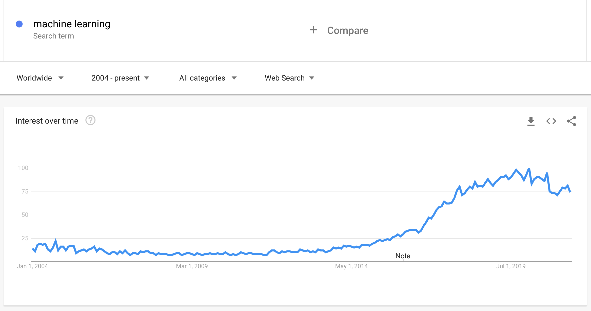

<!--
CO_OP_TRANSLATOR_METADATA:
{
  "original_hash": "73e9a7245aa57f00cd413ffd22c0ccb6",
  "translation_date": "2025-08-29T13:43:25+00:00",
  "source_file": "1-Introduction/1-intro-to-ML/README.md",
  "language_code": "tl"
}
-->
# Panimula sa machine learning

## [Pre-lecture quiz](https://gray-sand-07a10f403.1.azurestaticapps.net/quiz/1/)

---

> 🎥 I-click ang larawan sa itaas para sa isang maikling video na nagpapaliwanag ng araling ito.

Maligayang pagdating sa kursong ito tungkol sa klasikong machine learning para sa mga baguhan! Kung ikaw man ay ganap na bago sa paksang ito o isang bihasang practitioner ng ML na nais mag-refresh ng kaalaman, ikinagagalak naming makasama ka! Layunin naming lumikha ng isang magiliw na panimula para sa iyong pag-aaral ng ML at bukas kami sa iyong [feedback](https://github.com/microsoft/ML-For-Beginners/discussions).

> 🎥 I-click ang larawan sa itaas para sa isang video: Si John Guttag ng MIT ay nagpapakilala sa machine learning

---
## Pagsisimula sa machine learning

Bago simulan ang kurikulum na ito, kailangan mong ihanda ang iyong computer upang magpatakbo ng mga notebook nang lokal.

- **I-configure ang iyong makina gamit ang mga video na ito**. Gamitin ang mga sumusunod na link upang matutunan [kung paano mag-install ng Python](https://youtu.be/CXZYvNRIAKM) sa iyong sistema at [mag-setup ng text editor](https://youtu.be/EU8eayHWoZg) para sa development.
- **Matutunan ang Python**. Inirerekomenda rin na magkaroon ng pangunahing kaalaman sa [Python](https://docs.microsoft.com/learn/paths/python-language/?WT.mc_id=academic-77952-leestott), isang programming language na kapaki-pakinabang para sa mga data scientist na ginagamit natin sa kursong ito.
- **Matutunan ang Node.js at JavaScript**. Gagamit din tayo ng JavaScript sa ilang bahagi ng kursong ito kapag gumagawa ng mga web app, kaya kakailanganin mong magkaroon ng [node](https://nodejs.org) at [npm](https://www.npmjs.com/) na naka-install, pati na rin ang [Visual Studio Code](https://code.visualstudio.com/) para sa parehong Python at JavaScript development.
- **Gumawa ng GitHub account**. Dahil natagpuan mo kami dito sa [GitHub](https://github.com), maaaring mayroon ka nang account, ngunit kung wala pa, gumawa ng isa at i-fork ang kurikulum na ito upang magamit mo ito. (Huwag kalimutang magbigay ng star 😊)
- **Galugarin ang Scikit-learn**. Magkaroon ng kaalaman sa [Scikit-learn](https://scikit-learn.org/stable/user_guide.html), isang set ng mga ML library na binabanggit natin sa mga araling ito.

---
## Ano ang machine learning?

Ang terminong 'machine learning' ay isa sa mga pinakasikat at madalas gamitin sa kasalukuyan. Malaki ang posibilidad na narinig mo na ang terminong ito kahit isang beses kung may kaalaman ka sa teknolohiya, anuman ang larangan mo. Gayunpaman, ang mekanismo ng machine learning ay nananatiling misteryo para sa karamihan. Para sa isang baguhan, maaaring nakakatakot ang paksa. Kaya mahalagang maunawaan kung ano talaga ang machine learning at matutunan ito nang paunti-unti sa pamamagitan ng mga praktikal na halimbawa.

---
## Ang hype curve

> Ipinapakita ng Google Trends ang kamakailang 'hype curve' ng terminong 'machine learning'

---
## Isang misteryosong uniberso

Namumuhay tayo sa isang uniberso na puno ng mga kamangha-manghang misteryo. Ang mga dakilang siyentipiko tulad nina Stephen Hawking, Albert Einstein, at marami pang iba ay inialay ang kanilang buhay sa paghahanap ng makabuluhang impormasyon upang maipaliwanag ang mga misteryo ng mundo sa paligid natin. Ito ang kalikasan ng tao sa pag-aaral: ang isang bata ay natututo ng mga bagong bagay at natutuklasan ang istruktura ng kanilang mundo habang sila ay lumalaki.

---
## Ang utak ng bata

Ang utak ng isang bata at ang kanilang mga pandama ay nakakaunawa ng mga katotohanan sa kanilang paligid at unti-unting natututo ng mga nakatagong pattern ng buhay na tumutulong sa kanila na bumuo ng mga lohikal na tuntunin upang makilala ang mga natutunang pattern. Ang proseso ng pagkatuto ng utak ng tao ang dahilan kung bakit tayo ang pinaka-sopistikadong nilalang sa mundo. Ang patuloy na pagkatuto sa pamamagitan ng pagtuklas ng mga nakatagong pattern at pagkatapos ay paglikha ng mga inobasyon mula rito ay nagbibigay-daan sa atin na patuloy na umunlad. Ang kakayahang ito ay may kaugnayan sa konsepto ng [brain plasticity](https://www.simplypsychology.org/brain-plasticity.html). Sa pangkalahatan, maaari nating makita ang ilang pagkakatulad sa pagitan ng proseso ng pagkatuto ng utak ng tao at ng mga konsepto ng machine learning.

---
## Ang utak ng tao

Ang [utak ng tao](https://www.livescience.com/29365-human-brain.html) ay nakakaunawa ng mga bagay mula sa totoong mundo, pinoproseso ang impormasyon, gumagawa ng mga makatuwirang desisyon, at gumagawa ng mga aksyon batay sa mga sitwasyon. Ito ang tinatawag nating matalinong pag-uugali. Kapag pinrograma natin ang isang makina upang gayahin ang prosesong ito, tinatawag itong artificial intelligence (AI).

---
## Ilang terminolohiya

Bagama't maaaring nakakalito ang mga termino, ang machine learning (ML) ay isang mahalagang subset ng artificial intelligence. **Ang ML ay tumutukoy sa paggamit ng mga espesyal na algorithm upang matuklasan ang makabuluhang impormasyon at mga nakatagong pattern mula sa datos upang suportahan ang proseso ng paggawa ng desisyon**.

---
## AI, ML, Deep Learning

> Isang diagram na nagpapakita ng relasyon ng AI, ML, deep learning, at data science. Infographic ni [Jen Looper](https://twitter.com/jenlooper) na inspirasyon mula sa [graphic na ito](https://softwareengineering.stackexchange.com/questions/366996/distinction-between-ai-ml-neural-networks-deep-learning-and-data-mining)

---
## Mga konseptong tatalakayin

Sa kurikulum na ito, tatalakayin natin ang mga pangunahing konsepto ng machine learning na dapat malaman ng isang baguhan. Tatalakayin natin ang tinatawag na 'klasikong machine learning' gamit ang Scikit-learn, isang mahusay na library na ginagamit ng maraming mag-aaral upang matutunan ang mga batayan. Upang maunawaan ang mas malawak na konsepto ng artificial intelligence o deep learning, mahalaga ang matibay na pundasyon sa machine learning, kaya nais naming ibahagi ito dito.

---
## Sa kursong ito matututuhan mo:

- mga pangunahing konsepto ng machine learning
- kasaysayan ng ML
- ML at pagiging patas
- mga teknik sa regression ML
- mga teknik sa classification ML
- mga teknik sa clustering ML
- mga teknik sa natural language processing ML
- mga teknik sa time series forecasting ML
- reinforcement learning
- mga totoong aplikasyon ng ML

---
## Ano ang hindi natin tatalakayin

- deep learning
- neural networks
- AI

Upang gawing mas madali ang pag-aaral, iiwasan natin ang mga komplikasyon ng neural networks, 'deep learning' - ang paggawa ng mga modelong may maraming layer gamit ang neural networks - at AI, na tatalakayin natin sa ibang kurikulum. Magkakaroon din tayo ng paparating na kurikulum sa data science upang magpokus sa aspetong iyon ng mas malawak na larangan.

---
## Bakit pag-aralan ang machine learning?

Ang machine learning, mula sa perspektibo ng sistema, ay tinutukoy bilang ang paggawa ng mga awtomatikong sistema na kayang matutunan ang mga nakatagong pattern mula sa datos upang makatulong sa paggawa ng matalinong desisyon.

Ang motibasyong ito ay maluwag na inspirasyon mula sa kung paano natututo ang utak ng tao batay sa datos na natatanggap nito mula sa labas ng mundo.

✅ Mag-isip ng isang minuto kung bakit nais ng isang negosyo na gumamit ng mga estratehiya sa machine learning kumpara sa paggawa ng isang hard-coded na sistema ng mga tuntunin.

---
## Mga aplikasyon ng machine learning

Ang mga aplikasyon ng machine learning ay halos nasa lahat ng dako, at kasing laganap ng datos na dumadaloy sa ating mga lipunan, na nililikha ng ating mga smartphone, konektadong mga aparato, at iba pang mga sistema. Dahil sa napakalaking potensyal ng mga makabagong algorithm ng machine learning, patuloy na sinusuri ng mga mananaliksik ang kanilang kakayahan upang lutasin ang mga multi-dimensional at multi-disiplinaryong totoong problema na may magagandang resulta.

---
## Mga halimbawa ng aplikasyon ng ML

**Maraming paraan upang magamit ang machine learning**:

- Upang hulaan ang posibilidad ng sakit mula sa kasaysayan o ulat ng medikal ng isang pasyente.
- Upang gamitin ang datos ng panahon upang hulaan ang mga kaganapan sa panahon.
- Upang maunawaan ang damdamin ng isang teksto.
- Upang matukoy ang pekeng balita upang mapigilan ang pagkalat ng propaganda.

Ang mga larangan tulad ng pananalapi, ekonomiya, agham ng mundo, eksplorasyon ng kalawakan, biomedical engineering, kognitibong agham, at maging ang mga larangan ng humanidades ay nag-aangkop ng machine learning upang lutasin ang mga mahihirap at mabigat sa datos na problema ng kanilang larangan.

---
## Konklusyon

Ang machine learning ay awtomatikong natutuklasan ang mga pattern sa pamamagitan ng paghahanap ng makabuluhang impormasyon mula sa totoong datos o nilikhang datos. Napatunayan nitong napakahalaga sa negosyo, kalusugan, at mga aplikasyon sa pananalapi, at marami pang iba.

Sa malapit na hinaharap, ang pag-unawa sa mga batayan ng machine learning ay magiging mahalaga para sa mga tao mula sa anumang larangan dahil sa malawakang paggamit nito.

---
# 🚀 Hamon

Gumuhit, sa papel o gamit ang isang online app tulad ng [Excalidraw](https://excalidraw.com/), ng iyong pagkaunawa sa mga pagkakaiba ng AI, ML, deep learning, at data science. Magdagdag ng ilang ideya ng mga problemang mahusay lutasin ng bawat isa sa mga teknik na ito.

# [Post-lecture quiz](https://gray-sand-07a10f403.1.azurestaticapps.net/quiz/2/)

---
# Pagsusuri at Pag-aaral sa Sarili

Upang matutunan pa ang tungkol sa kung paano ka maaaring magtrabaho gamit ang mga ML algorithm sa cloud, sundan ang [Learning Path](https://docs.microsoft.com/learn/paths/create-no-code-predictive-models-azure-machine-learning/?WT.mc_id=academic-77952-leestott).

Kumuha ng [Learning Path](https://docs.microsoft.com/learn/modules/introduction-to-machine-learning/?WT.mc_id=academic-77952-leestott) tungkol sa mga batayan ng ML.

---
# Takdang-Aralin

[Simulan ang pag-aaral](assignment.md)

---

**Paunawa**:  
Ang dokumentong ito ay isinalin gamit ang AI translation service na [Co-op Translator](https://github.com/Azure/co-op-translator). Bagama't sinisikap naming maging tumpak, tandaan na ang mga awtomatikong pagsasalin ay maaaring maglaman ng mga pagkakamali o hindi pagkakatugma. Ang orihinal na dokumento sa kanyang katutubong wika ang dapat ituring na opisyal na sanggunian. Para sa mahalagang impormasyon, inirerekomenda ang propesyonal na pagsasalin ng tao. Hindi kami mananagot sa anumang hindi pagkakaunawaan o maling interpretasyon na dulot ng paggamit ng pagsasaling ito.