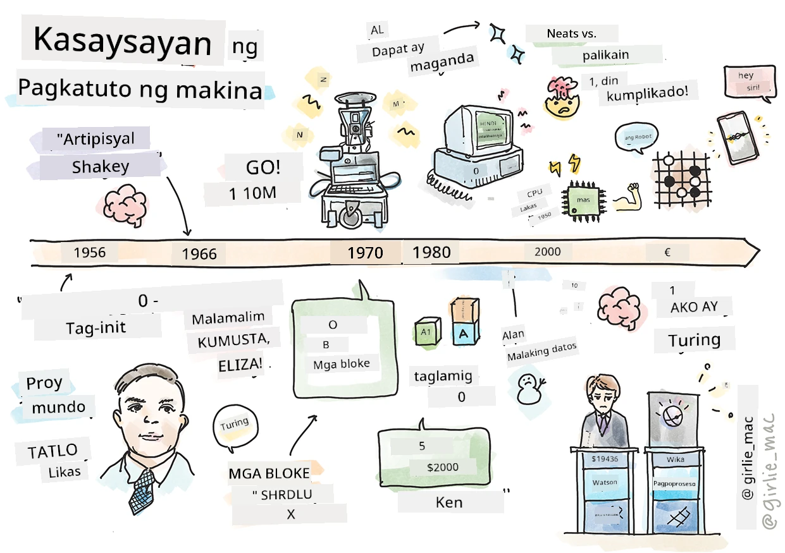
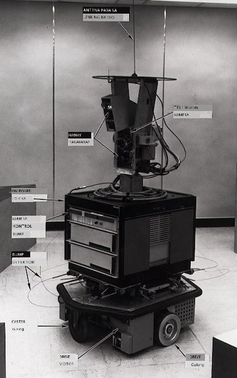
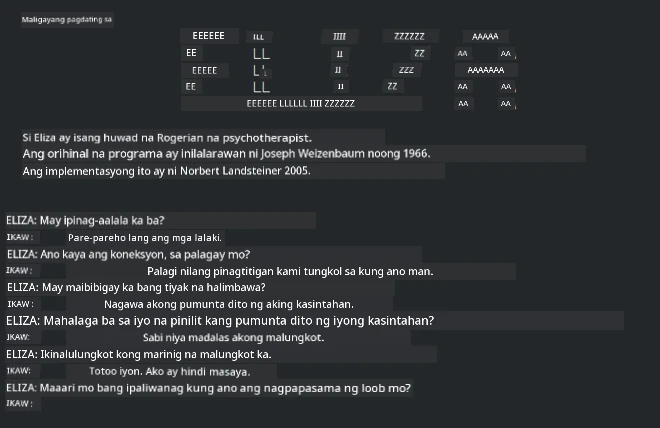

# Kasaysayan ng machine learning

> Sketchnote ni [Tomomi Imura](https://www.twitter.com/girlie_mac)

## [Pre-lektura na pagsusulit](https://ff-quizzes.netlify.app/en/ml/)

---

> 🎥 I-click ang larawan sa itaas para sa isang maikling video na tumatalakay sa leksyong ito.

Sa leksyon na ito, tatalakayin natin ang mga pangunahing milestones sa kasaysayan ng machine learning at artificial intelligence.

Ang kasaysayan ng artificial intelligence (AI) bilang isang larangan ay magkaugnay sa kasaysayan ng machine learning, dahil ang mga algorithm at pag-unlad sa komputasyon na sumusuporta sa ML ay nakaambag sa pagbuo ng AI. Magandang tandaan na, habang ang mga larangang ito bilang hiwalay na mga lugar ng pagsisiyasat ay nagsimulang maging malinaw noong 1950s, mga mahahalagang [algorithmic, statistical, mathematical, computational at technical na pagtuklas](https://wikipedia.org/wiki/Timeline_of_machine_learning) ay nauna at sumalubong sa panahong iyon. Sa katunayan, ang mga tao ay nag-iisip tungkol sa mga tanong na ito sa loob ng [daang taon](https://wikipedia.org/wiki/History_of_artificial_intelligence): tinalakay sa artikulong ito ang mga makasaysayang intelektwal na pundasyon ng ideya ng 'nagmumuni-muni na makina.'

---
## Mga kilalang pagtuklas

- 1763, 1812 [Teorema ni Bayes](https://wikipedia.org/wiki/Bayes%27_theorem) at ang mga nauna nito. Ang teoremang ito at ang mga aplikasyon nito ang pundasyon ng inference, na naglalarawan ng posibilidad ng isang pangyayari batay sa naunang kaalaman.
- 1805 [Teorya ng Least Square](https://wikipedia.org/wiki/Least_squares) ng Pranses na matematiko na si Adrien-Marie Legendre. Ang teoryang ito, na matututuhan mo sa ating yunit ng Regression, ay tumutulong sa pag-angkop ng datos.
- 1913 [Markov Chains](https://wikipedia.org/wiki/Markov_chain), na ipinangalan sa Ruso na matematiko na si Andrey Markov, ay ginagamit upang ilarawan ang magkakasunod na posibleng pangyayari batay sa nakaraang estado.
- 1957 [Perceptron](https://wikipedia.org/wiki/Perceptron) ay isang uri ng linear classifier na nilikha ng Amerikanong sikologo na si Frank Rosenblatt na nagsilbing pundasyon sa pag-unlad ng deep learning.

---

- 1967 [Nearest Neighbor](https://wikipedia.org/wiki/Nearest_neighbor) ay isang algorithm na orihinal na dinisenyo para sa pagsasaayos ng mga ruta. Sa konteksto ng ML, ginagamit ito upang matukoy ang mga pattern.
- 1970 [Backpropagation](https://wikipedia.org/wiki/Backpropagation) ay ginagamit upang sanayin ang mga [feedforward neural networks](https://wikipedia.org/wiki/Feedforward_neural_network).
- 1982 [Recurrent Neural Networks](https://wikipedia.org/wiki/Recurrent_neural_network) ay mga artipisyal na neural networks na hinango mula sa feedforward neural networks na lumilikha ng temporal na mga grap.

✅ Magsaliksik nang kaunti. Anong iba pang mga petsa ang kapansin-pansin bilang mahalaga sa kasaysayan ng ML at AI?

---
## 1950: Mga makinang nag-iisip

Si Alan Turing, isang tunay na kahanga-hangang tao na pinili [ng publiko noong 2019](https://wikipedia.org/wiki/Icons:_The_Greatest_Person_of_the_20th_Century) bilang pinakamahalagang siyentipiko ng ika-20 siglo, ay kinikilala sa pagtulong sa paglalatag ng pundasyon para sa konsepto ng 'makinang maaaring mag-isip.' Nakipaglaban siya sa mga nagtatalo at sa kanyang sariling pangangailangan para sa ebidensyang empirikal ng konseptong ito sa pamamagitan ng paglikha ng [Turing Test](https://www.bbc.com/news/technology-18475646), na iyong susuriin sa mga leksyon ng NLP.

---
## 1956: Dartmouth Summer Research Project

"Ang Dartmouth Summer Research Project sa artificial intelligence ay isang mahalagang kaganapan para sa artificial intelligence bilang isang larangan," at dito nilikha ang terminong 'artificial intelligence' ([pinagmulan](https://250.dartmouth.edu/highlights/artificial-intelligence-ai-coined-dartmouth)).

> Ang bawat aspeto ng pagkatuto o anumang iba pang katangian ng katalinuhan ay maaaring ganap na mailarawan nang eksakto upang ang isang makina ay magawa upang gayahin ito.

---

Ang nanguna sa pananaliksik, propesor ng matematika na si John McCarthy, ay umaasa na "magpatuloy batay sa haka-haka na ang bawat aspeto ng pagkatuto o anumang iba pang katangian ng katalinuhan ay maaaring ganap na mailarawan nang eksakto upang ang isang makina ay magawa upang gayahin ito." Kabilang sa mga kalahok ay ang isa pang kilalang tao sa larangan, si Marvin Minsky.

Ang workshop ay kinilala sa pagsisimula at pagpapasigla ng ilang mga talakayan kabilang ang "pag-usbong ng mga simbolikong pamamaraan, mga sistemang nakatuon sa limitadong mga domain (maagang mga expert system), at mga deductive systems laban sa inductive systems." ([pinagmulan](https://wikipedia.org/wiki/Dartmouth_workshop)).

---
## 1956 - 1974: "Ang gintong mga taon"

Mula 1950s hanggang kalagitnaan ng '70s, mataas ang pag-asa na malulutas ng AI ang maraming problema. Noong 1967, sinabi ni Marvin Minsky nang may kumpiyansa na "Sa loob ng isang henerasyon ... ang problema ng paglikha ng 'artificial intelligence' ay malaki nang malulutas." (Minsky, Marvin (1967), Computation: Finite and Infinite Machines, Englewood Cliffs, N.J.: Prentice-Hall)

Yumabong ang pananaliksik sa natural language processing, pinino at pinalakas ang paghahanap, at nilikha ang konsepto ng 'micro-worlds,' kung saan natatapos ang mga simpleng gawain gamit ang mga direktang tagubiling ginagamit ang ordinaryong wika.

---

Magandang pinondohan ang pananaliksik ng mga ahensiya ng gobyerno, may mga pag-unlad sa komputasyon at mga algorithm, at nakabuo ng mga prototype ng matatalinong makina. Ilan sa mga makinaryang ito ay:

* [Shakey the robot](https://wikipedia.org/wiki/Shakey_the_robot), na kayang magmaniobra at magpasya kung paano tutuparin ang mga gawain nang 'matatalino'.

    
    > Shakey noong 1972

---

* Eliza, isang maagang 'chatterbot', ay kayang makipag-usap sa mga tao at kumilos bilang isang primitibong 'terapista'. Malalaman mo ang higit pa tungkol kay Eliza sa mga leksyon sa NLP.

    
    > Isang bersyon ng Eliza, isang chatbot

---

* Ang "Blocks world" ay isang halimbawa ng micro-world kung saan maaaring itambak at ayusin ang mga bloke, at mga eksperimento sa pagtuturo sa mga makina na gumawa ng mga desisyon ay maaaring subukan. Ang mga pag-unlad na ginawa gamit ang mga aklatan tulad ng [SHRDLU](https://wikipedia.org/wiki/SHRDLU) ay nagpasulong ng language processing.

    

    > 🎥 I-click ang larawan sa itaas para sa isang video: Blocks world with SHRDLU

---
## 1974 - 1980: "AI Winter"

Sa kalagitnaan ng 1970s, naging malinaw na ang kahirapan sa paggawa ng 'matatalinong makina' ay naibawas nang malaki at ang pangako nito, dahil sa limitadong lakas-kompyut, ay na-exaggerate. Mga pondo ay humina at bumagal ang kumpiyansa sa larangan. Ilang isyung nakaapekto sa kumpiyansa ay:
---
- **Mga limitasyon**. Napakaliit ng compute power.
- **Combinatorial explosion**. Ang dami ng mga parameter na kailangang sanayin ay lumaki nang eksponensyal habang mas maraming inaasahan mula sa mga kompyuter, nang walang kasabay na pag-unlad ng compute power at kakayahan.
- **Kakulangan ng datos**. May kakulangan sa datos na pumigil sa proseso ng pagsusuri, pagbuo, at pagpapahusay ng mga algorithm.
- **Tama ba ang mga tanong na tinatanong natin?**. Ang mismong mga tanong na tinatanong ay sinimulang kuwestiyunin. Nagsimulang makatanggap ng kritisismo ang mga mananaliksik tungkol sa kanilang mga pamamaraan:
  - Ang Turing tests ay nakatakdang pagdudahan sa pamamagitan ng, bukod sa iba pang mga ideya, ang 'chinese room theory' na nagsasabing, "ang pagprograma ng digital na kompyuter ay maaaring magmukhang nakaintindi ng wika ngunit hindi makagawa ng tunay na pag-unawa." ([pinagmulan](https://plato.stanford.edu/entries/chinese-room/))
  - Ang etika ng pagpapakilala ng mga artipisyal na intelihensiya tulad ng "terapistang" ELIZA sa lipunan ay hinamon.

---

Kasabay nito, nagsimulang mabuo ang iba't ibang mga paaralan ng pananaw sa AI. Naitatag ang dikotomya sa pagitan ng ["scruffy" vs. "neat AI"](https://wikipedia.org/wiki/Neats_and_scruffies) na mga pamamaraan. Ang mga _Scruffy_ na laborator ay nag-aayos ng mga programa nang maraming oras hanggang makamit ang nais na resulta. Ang mga _Neat_ na laborator ay "nakatuon sa lohika at pormal na paglutas ng problema." Ang ELIZA at SHRDLU ay kilalang _scruffy_ na mga sistema. Noong 1980s, habang lumitaw ang pangangailangan na gawing reproducible ang mga ML system, unti-unting nanguna ang _neat_ na pamamaraan dahil mas malinaw ang mga resulta nito.

---
## 1980s Expert systems

Habang lumalaki ang larangan, naging mas malinaw ang benepisyo nito sa negosyo, at noong 1980s dumami ang 'expert systems'. "Ang mga expert systems ay kabilang sa mga unang tunay na matagumpay na anyo ng software ng artificial intelligence (AI)." ([pinagmulan](https://wikipedia.org/wiki/Expert_system)).

Ang ganitong uri ng sistema ay actually _hybrid_, na binubuo ng isang bahagi ng rules engine na nagtatalaga ng mga pangangailangan sa negosyo, at isang inference engine na naggamit ng rules system upang maghinuha ng mga bagong katotohanan.

Sa panahong ito, tumaas din ang atensyon sa mga neural networks.

---
## 1987 - 1993: AI 'Chill'

Ang pagdami ng espesyalisadong hardware para sa expert systems ay nagkaroon ng negatibong epekto dahil naging sobra itong espesyalisado. Ang pag-usbong ng personal na kompyuter ay naging kompetensya rin sa mga malaki, espesyalista, at sentralisadong sistema. Nagsimula ang demokrasya sa kompyutasyon, at sa kalaunan ay nagbigay-daan ito sa modernong pagsabog ng big data.

---
## 1993 - 2011

Sa panahong ito, nagsimulang matugunan ng ML at AI ang ilan sa mga suliraning sanhi noon ng kakulangan sa datos at compute power. Ang dami ng datos ay mabilis na tumaas at naging mas malawak ang pagkakaroon nito, para sa mabuti at masama, lalung-lalo na sa pagdating ng smartphone noong bandang 2007. Ang compute power ay lumago nang eksponensyal, at kasabay nito ay umunlad ang mga algorithm. Nagsimula nang tumanda ang larangan habang ang mga malayang araw ng nakaraan ay nagsimulang maging isang tunay na disiplinang pang-agham.

---
## Ngayon

Sa kasalukuyan, ang machine learning at AI ay halos sumasakop sa bawat bahagi ng ating buhay. Ang panahong ito ay nangangailangan ng maingat na pag-unawa sa mga panganib at posibleng epekto ng mga algorithm na ito sa buhay ng tao. Gaya ng sinabi ni Brad Smith ng Microsoft, "Ang teknolohiya ng impormasyon ay nagtataas ng mga isyung nauugnay sa mga batayang proteksyon ng karapatang pantao tulad ng privacy at kalayaan sa pagpapahayag. Ang mga isyung ito ay nagpapataas ng responsibilidad para sa mga kumpanyang tech na lumilikha ng mga produktong ito. Sa aming pananaw, tinatawag din nila ang maingat na regulasyon ng gobyerno at ang pagbuo ng mga pamantayan tungkol sa katanggap-tanggap na mga gamit" ([pinagmulan](https://www.technologyreview.com/2019/12/18/102365/the-future-of-ais-impact-on-society/)).

---

Hindi pa tiyak kung ano ang dala ng hinaharap, ngunit mahalagang maunawaan ang mga sistemang pangkompyuter na ito pati na rin ang software at mga algorithm na nagpapatakbo sa kanila. Sana makatulong ang kursong ito upang mas maunawaan mo ito nang husto upang ikaw ang makapili para sa iyong sarili.

> 🎥 I-click ang larawan sa itaas para sa isang video: Tinalakay ni Yann LeCun ang kasaysayan ng deep learning sa leksyong ito

---
## 🚀Hamón

Siyasatin ang isa sa mga makasaysayang sandaling ito at alamin pa ang mga tao sa likod nito. May mga kawili-wiling mga karakter, at walang pang-agham na pagtuklas ang nilikha sa isang kultural na vacuum. Ano ang iyong natuklasan?

## [Post-lektura na pagsusulit](https://ff-quizzes.netlify.app/en/ml/)

---
## Review at Sariling Pag-aaral

Narito ang mga bagay na panuorin at pakinggan:

[Ang podcast na ito kung saan tinalakay ni Amy Boyd ang ebolusyon ng AI](http://runasradio.com/Shows/Show/739)

---

## Takdang-aralin

[Gumawa ng timeline](assignment.md)

---

<!-- CO-OP TRANSLATOR DISCLAIMER START -->
**Pagtatanggi**:
Ang dokumentong ito ay isinalin gamit ang serbisyo ng AI translation na [Co-op Translator](https://github.com/Azure/co-op-translator). Bagama't nagsusumikap kami para sa katumpakan, pakatandaan na ang awtomatikong pagsasalin ay maaaring maglaman ng mga pagkakamali o hindi pagkakatugma. Ang orihinal na dokumento sa orihinal nitong wika ang dapat ituring na pangunahing sanggunian. Para sa mahahalagang impormasyon, inirerekomenda ang propesyonal na pagsasalin ng tao. Hindi kami mananagot sa anumang maling pagkakaintindi o maling interpretasyon na nagmula sa paggamit ng pagsasaling ito.
<!-- CO-OP TRANSLATOR DISCLAIMER END -->