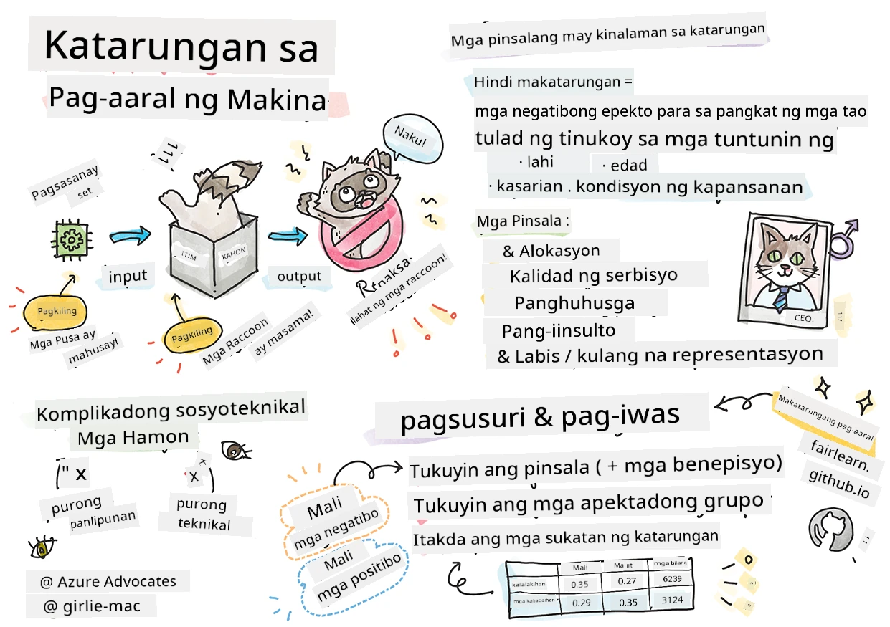

# Paggawa ng mga Solusyon sa Machine Learning gamit ang responsable na AI
 

> Sketchnote ni [Tomomi Imura](https://www.twitter.com/girlie_mac)

## [Pre-lecture quiz](https://ff-quizzes.netlify.app/en/ml/)
 
## Panimula

Sa kurikulm na ito, sisimulan mong tuklasin kung paano nakakaapekto ang machine learning sa ating pang-araw-araw na buhay. Kahit ngayon, ang mga sistema at modelo ay kasali sa mga gawain ng pang-araw-araw na paggawa ng desisyon, tulad ng mga diagnosis sa pangangalagang pangkalusugan, pag-apruba ng mga pautang o pagtukoy ng pandaraya. Kaya mahalaga na ang mga modelong ito ay gumana nang maayos upang makapagbigay ng mga resulta na mapagkakatiwalaan. Katulad ng anumang aplikasyon ng software, ang mga sistema ng AI ay maaaring hindi makamit ang mga inaasahan o magkaroon ng hindi kanais-nais na resulta. Kaya mahalaga na maunawaan at maipaliwanag ang pag-uugali ng isang AI na modelo.

Isipin kung ano ang maaaring mangyari kapag ang datos na ginagamit mo upang gumawa ng mga modelong ito ay kulang sa ilang demograpiko, tulad ng lahi, kasarian, pananaw pampolitika, relihiyon, o hindi pantay na kinakatawan ang mga demograpikong ito. Paano kung ang output ng modelo ay naipakahulugan upang paboran ang ilang demograpiko? Ano ang magiging epekto nito sa aplikasyon? Bukod dito, ano ang mangyayari kapag ang modelo ay nagkaroon ng masamang resulta at nakapipinsala sa mga tao? Sino ang may pananagutan sa pag-uugali ng mga sistema ng AI? Ito ang ilan sa mga tanong na tatalakayin natin sa kurikulm na ito.

Sa araling ito, ikaw ay:

- Magpapataas ng iyong kamalayan sa kahalagahan ng katarungan sa machine learning at mga pinsalang may kaugnayan sa katarungan.
- Maging pamilyar sa pagsasanay ng pagsusuri sa mga outliers at mga hindi pangkaraniwang senaryo upang matiyak ang pagiging maaasahan at kaligtasan
- Makakakuha ng pag-unawa sa pangangailangan na bigyang kapangyarihan ang lahat sa pamamagitan ng pagdidisenyo ng mga inklusibong sistema
- Tuklasin kung gaano kahalaga ang protektahan ang privacy at seguridad ng datos at mga tao
- Makita ang kahalagahan ng pagkakaroon ng glass box na pamamaraan upang ipaliwanag ang pag-uugali ng mga AI na modelo
- Maging maingat kung paano mahalaga ang pananagutan upang makabuo ng tiwala sa mga sistema ng AI

## Paunang Kaalaman

Bilang paunang kaalaman, mangyaring kunin ang "Responsible AI Principles" Learn Path at panoorin ang video sa ibaba tungkol sa paksa:

Matuto pa tungkol sa Responsable na AI sa pamamagitan ng pagsunod sa [Learning Path](https://docs.microsoft.com/learn/modules/responsible-ai-principles/?WT.mc_id=academic-77952-leestott)

> 🎥 Pindutin ang larawan sa itaas para sa video: Microsoft's Approach to Responsible AI

## Katarungan

Dapat tratuhin nang patas ng mga sistema ng AI ang lahat at iwasan ang pagapekto nang magkakaibang paraan sa mga magkakatulad na grupo ng mga tao. Halimbawa, kapag ang mga sistema ng AI ay nagbibigay ng gabay sa medikal na paggamot, aplikasyon ng pautang, o trabaho, dapat silang magbigay ng parehong rekomendasyon sa lahat na may magkakaparehong sintomas, kalagayan sa pananalapi, o kwalipikasyon sa propesyon. Bawat isa sa atin bilang tao ay may dala-dalang mga pinanggalingang pagkiling na nakakaapekto sa ating mga desisyon at kilos. Ang mga pagkiling na ito ay maaaring makikita sa datos na ginagamit natin upang sanayin ang mga sistema ng AI. Ang ganitong manipulasyon ay maaaring mangyari nang hindi sinasadya. Madalas mahirap malay-tao na malaman kung kailan ka nagdadagdag ng pagkiling sa datos.

**“Hindi patas”** ay sumasaklaw sa mga negatibong epekto, o "pinsala", para sa isang grupo ng mga tao, tulad ng mga tinutukoy ayon sa lahi, kasarian, edad, o katayuan sa kapansanan. Ang mga pangunahing pinsalang may kaugnayan sa katarungan ay maaaring iklase bilang:

- **Alokasyon**, kung halimbawa ay pinapaboran ang isang kasarian o etnisidad kaysa sa iba.
- **Kalidad ng serbisyo**. Kapag sinanay mo ang datos para sa isang tiyak na senaryo subalit mas komplikado ang realidad, magreresulta ito sa mahina na serbisyo. Halimbawa, isang dispenser ng sabon sa kamay na hindi makita ang mga taong may maitim na balat. [Reference](https://gizmodo.com/why-cant-this-soap-dispenser-identify-dark-skin-1797931773)
- **Pang-iinsulto**. Hindi patas na pagsaway at paglalagay ng label sa isang bagay o tao. Halimbawa, ang teknolohiya sa pag-label ng imahe ay kilalang maling inilalagay ang label sa mga larawan ng mga taong may maitim na balat bilang mga gorilya.
- **Sobra o kulang na representasyon**. Ang ideya ay may isang grupo na hindi nakikita sa isang tiyak na propesyon, at anumang serbisyo o tungkuling nagpapatuloy sa ganito ay nagdudulot ng pinsala.
- **Stereotyping**. Pag-uugnay sa isang grupo ng mga pre-natukoy na mga katangian. Halimbawa, isang sistema ng pagsasalin ng wika sa pagitan ng Ingles at Turkish ay maaaring magkaroon ng mga kamalian dahil sa mga salita na may stereotypical na kaugnayan sa kasarian.

> pagsasalin sa Turkish

> pagsasalin pabalik sa Ingles

Kapag nagdidisenyo at sumusubok ng mga sistema ng AI, kailangan nating matiyak na ang AI ay patas at hindi naka-program upang gumawa ng mga pagkiling o mapanirang desisyon, na ipinagbabawal din sa mga tao. Ang pagtiyak ng katarungan sa AI at machine learning ay nananatiling isang kumplikadong sociotechnical na hamon.

### Pagiging maaasahan at kaligtasan

Upang makabuo ng tiwala, ang mga sistema ng AI ay kailangang maging maaasahan, ligtas, at pare-pareho sa ilalim ng mga normal at hindi inaasahang mga kundisyon. Mahalaga na malaman kung paano kikilos ang mga sistema ng AI sa iba't ibang mga sitwasyon, lalo na kapag sila ay mga outliers. Kapag gumagawa ng mga solusyon sa AI, kailangan ng malaking pokus kung paano haharapin ang iba't ibang mga sitwasyon na maaaring maranasan ng mga solusyong ito. Halimbawa, ang isang self-driving na kotse ay kailangang unahin ang kaligtasan ng mga tao. Bilang resulta, ang AI na nagpapatakbo sa kotse ay kailangang isaalang-alang ang lahat ng posibleng senaryo na maaaring maranasan ng kotse tulad ng gabi, malalakas na bagyo o snowstorm, mga batang tumatakbo sa kalsada, mga alagang hayop, mga konstruksyon ng kalsada, atbp. Kung gaano kahusay ang kayang hawakan ng isang sistema ng AI sa malawak na hanay ng mga kundisyon nang maaasahan at ligtas ay nagpapakita ng antas ng pag-asang isinasaalang-alang ng data scientist o AI developer sa panahon ng disenyo o pagsubok ng sistema.

> [🎥 Pindutin dito para sa isang video: ](https://www.microsoft.com/videoplayer/embed/RE4vvIl)

### Inklusibidad

Ang mga sistema ng AI ay dapat idisenyo upang makisali at bigyang kapangyarihan ang lahat. Kapag nagdidisenyo at nagpapatupad ng mga sistema ng AI, tinutukoy at tinutugunan ng mga data scientist at AI developer ang mga potensyal na hadlang sa sistema na maaaring hindi sinasadyang mag-iwan ng mga tao. Halimbawa, mayroong 1 bilyong tao na may kapansanan sa buong mundo. Sa pag-unlad ng AI, maaari nilang mas madaling ma-access ang malawak na saklaw ng impormasyon at mga oportunidad sa kanilang pang-araw-araw na buhay. Sa pamamagitan ng pagtugon sa mga hadlang, lumilikha ito ng mga oportunidad upang mag-imbento at bumuo ng mga produktong AI na may mas mahusay na karanasan na kapaki-pakinabang sa lahat.

> [🎥 Pindutin dito para sa isang video: inklusibidad sa AI](https://www.microsoft.com/videoplayer/embed/RE4vl9v)

### Seguridad at privacy

Ang mga sistema ng AI ay dapat na ligtas at igalang ang privacy ng mga tao. Mas malaki ang kawalan ng tiwala ng mga tao sa mga sistema na inilalagay sa panganib ang kanilang privacy, impormasyon, o buhay. Kapag nagsasanay ng mga machine learning na modelo, umaasa tayo sa datos upang makagawa ng pinakamahuhusay na resulta. Sa paggawa nito, dapat isaalang-alang ang pinagmulan ng datos at integridad nito. Halimbawa, ang datos ba ay isinumite ng user o pampublikong available? Sunod, habang nagtatrabaho sa datos, mahalaga ang pagbuo ng mga sistema ng AI na makakaprotekta sa kumpidensyal na impormasyon at makatatagal sa mga pag-atake. Habang mas laganap ang AI, ang pagprotekta sa privacy at seguridad ng mahahalagang personal at pang-negosyong impormasyon ay nagiging mas kritikal at kumplikado. Ang mga isyu sa privacy at seguridad ng datos ay nangangailangan ng masusing pansin para sa AI dahil ang access sa datos ay mahalaga upang makagawa ang mga sistema ng AI ng tumpak at may batayan na mga prediksyon at desisyon tungkol sa mga tao.

> [🎥 Pindutin dito para sa isang video: seguridad sa AI](https://www.microsoft.com/videoplayer/embed/RE4voJF)

- Bilang isang industriya nakagawa kami ng malalaking pag-unlad sa Privacy at seguridad, na lubos na pinatibay ng mga regulasyon tulad ng GDPR (General Data Protection Regulation).
- Ngunit sa mga sistema ng AI kailangan nating kilalanin ang tensyon sa pagitan ng pangangailangan para sa mas maraming personal na datos upang gawing mas personal at epektibo ang mga sistema – at ang privacy.
- Katulad ng pagsilang ng mga nakakonektang computer sa internet, nakikita rin natin ang malaking pagdami ng mga isyu sa seguridad na may kaugnayan sa AI.
- Kasabay nito, nakita natin ang paggamit ng AI upang mapabuti ang seguridad. Halimbawa, karamihan sa mga modernong anti-virus scanners ay pinapatakbo ng mga AI heuristics ngayon.
- Kailangan nating matiyak na ang ating mga proseso sa Data Science ay naghahalo nang mapayapa sa pinakabagong mga kasanayan sa privacy at seguridad.

### Transparency
Dapat na maintindihan ang mga sistema ng AI. Isang mahalagang bahagi ng transparency ay ang pagpapaliwanag sa pag-uugali ng mga sistema ng AI at mga bahagi nito. Ang pagpapahusay sa pag-unawa sa mga sistema ng AI ay nangangailangan na maintindihan ng mga stakeholder kung paano at bakit ito gumagana upang matukoy kung may mga potensyal na isyu sa pagganap, mga alalahanin sa kaligtasan at privacy, mga pagkiling, mga gawi ng pagsasantabi, o hindi inaasahang mga resulta. Naniniwala rin kami na ang mga gumagamit ng mga sistema ng AI ay dapat maging tapat at bukas tungkol sa kung kailan, bakit, at paano nila pinipili gamitin ang mga ito, pati na rin ang mga limitasyon ng mga sistemang ginagamit nila. Halimbawa, kung ang isang bangko ay gumagamit ng isang sistema ng AI upang suportahan ang mga desisyon nito sa pautang sa mga consumer, mahalaga na suriin ang mga resulta at maunawaan kung aling datos ang nakakaimpluwensya sa mga rekomendasyon ng sistema. Nagsisimula nang i-regulate ng mga gobyerno ang AI sa iba't ibang industriya, kaya ang mga data scientist at mga organisasyon ay kailangang ipaliwanag kung ang isang AI na sistema ay sumusunod sa mga regulasyon, lalo na kung may hindi kanais-nais na resulta.

> [🎥 Pindutin dito para sa isang video: transparency sa AI](https://www.microsoft.com/videoplayer/embed/RE4voJF)

- Dahil napakakomplekado ng mga sistema ng AI, mahirap maintindihan kung paano sila gumagana at bigyang-kahulugan ang mga resulta.
- Ang kakulangan ng pag-unawa na ito ay nakakaapekto sa paraan ng pamamahala, pagpapatakbo, at pagdodokumento sa mga sistemang ito.
- Ang kakulangan ng pag-unawang ito ay higit na nakakaapekto sa mga desisyong ginawa gamit ang mga resulta na nilalabas ng mga sistemang ito.

### Pananagutan
 
Ang mga taong nagdidisenyo at nagpapatupad ng mga sistema ng AI ay dapat managot kung paano gumagana ang kanilang mga sistema. Ang pangangailangan para sa pananagutan ay lalong mahalaga sa mga sensitibong teknolohiya tulad ng facial recognition. Kamakailan lamang, lumalaki ang demand para sa facial recognition technology, lalo na mula sa mga organisasyon ng batas na nakikita ang potensyal ng teknolohiya sa mga gamit tulad ng paghahanap sa mga nawawalang bata. Gayunpaman, ang mga teknolohiyang ito ay maaaring gamitin ng isang gobyerno upang ilagay sa panganib ang mga pangunahing kalayaan ng kanilang mga mamamayan sa pamamagitan ng, halimbawa, pagpapa-igting ng tuloy-tuloy na pagmamanman sa mga partikular na indibidwal. Kaya, kailangang maging responsable ang mga data scientist at mga organisasyon sa kung paano nakaaapekto ang kanilang sistema ng AI sa mga indibidwal o lipunan.

> 🎥 Pindutin ang larawan sa itaas para sa video: Mga Babala tungkol sa Mass Surveillance sa Pamamagitan ng Facial Recognition

Sa huli, isa sa pinakamalaking tanong para sa ating henerasyon, bilang unang henerasyon na nagdadala ng AI sa lipunan, ay paano matitiyak na mananatiling may pananagutan ang mga computer sa mga tao at paano matitiyak na ang mga tao na nagdidisenyo ng computer ay mananatiling may pananagutan sa lahat ng iba pa.

## Pagsusuri ng Epekto

Bago sanayin ang isang machine learning na modelo, mahalaga na magsagawa ng pagsusuri ng epekto upang maunawaan ang layunin ng AI system; kung ano ang inaasahang gamit nito; saan ito ilalagay; at sino ang makikipag-ugnayan sa sistema. Mahalaga ito para sa mga tagasuri o tagasubok na nag-evaluate sa sistema upang malaman kung anu-anong mga salik ang isasaalang-alang sa pagtukoy ng mga potensyal na panganib at inaasahang mga epekto.

Ang mga sumusunod ay mga pokus kapag nagsasagawa ng pagsusuri ng epekto:

* **Masamang epekto sa mga indibidwal**. Ang pagiging mulat sa anumang paghihigpit o kinakailangan, di-suportadong paggamit o anumang kilalang limitasyon na nakahahadlang sa pagganap ng sistema ay mahalaga upang matiyak na hindi ginagamit ang sistema sa paraang maaaring makasama sa mga indibidwal.
* **Mga pangangailangan sa datos**. Ang pag-unawa kung paano at saan gagamitin ng sistema ang datos ay nagbibigay-daan sa mga tagasuri na tuklasin ang anumang kinakailangang datos na dapat isaalang-alang (hal., GDPR o HIPAA na mga regulasyon sa datos). Bukod dito, suriin kung sapat ang pinagmulan o dami ng datos para sa pagsasanay.
* **Buod ng epekto**. Magtipon ng listahan ng mga potensyal na pinsala na maaaring lumitaw mula sa paggamit ng sistema. Sa buong lifecycle ng ML, suriin kung ang mga isyung natukoy ay naiiwasan o natutugunan.
* **Nalalapat na mga layunin** para sa bawat isa sa anim na pangunahing prinsipyo. Suriin kung natutupad ang mga layunin mula sa bawat prinsipyo at kung may mga puwang.

## Pag-debug gamit ang responsable na AI

Katulad ng pag-debug ng isang software application, ang pag-debug ng isang sistema ng AI ay isang kinakailangang proseso ng pagtukoy at paglutas ng mga isyu sa sistema. Maraming salik ang maaaring makaapekto sa isang modelo na hindi gumana ayon sa inaasahan o responsableng paraan. Karamihan sa mga tradisyunal na sukatan ng pagganap ng modelo ay mga quantitavive na buod ng pagganap ng modelo, na hindi sapat upang suriin kung paano nilalabag ng modelo ang mga prinsipyo ng responsable na AI. Bukod dito, ang isang machine learning na modelo ay isang itim na kahon na nagpapahirap na maintindihan kung ano ang nagtutulak ng resulta nito o magbigay ng paliwanag kapag nagkamali ito. Sa kalaunan ng kursong ito, matututuhan natin kung paano gamitin ang Responsible AI dashboard upang makatulong sa pag-debug ng mga sistema ng AI. Ang dashboard ay nagbibigay ng holistikong kasangkapan para sa mga data scientist at AI developer upang magsagawa ng:

* **Pagsusuri ng error**. Upang tukuyin ang pamamahagi ng error ng modelo na maaaring makaapekto sa katarungan o pagiging maaasahan ng sistema.
* **Pangkalahatang-ideya ng modelo**. Upang matuklasan kung saan may mga hindi pagkakapantay-pantay sa pagganap ng modelo sa iba't ibang cohort ng datos.
* **Pagsusuri ng datos**. Upang maunawaan ang pamamahagi ng datos at matukoy ang anumang potensyal na pagkiling sa datos na maaaring magdala sa mga isyu sa katarungan, inklusibidad, at pagiging maaasahan.
* **Paliwanag sa modelo**. Upang maunawaan kung ano ang nakakaapekto o nakakaimpluwensya sa mga prediksyon ng modelo. Nakakatulong ito sa pagpapaliwanag ng pag-uugali ng modelo, na mahalaga para sa transparency at pananagutan.

## 🚀 Hamon
 
Upang maiwasan ang mga pinsala na maipakilala sa unang pagkakataon, dapat tayong:

- magkaroon ng pagkakaiba-iba ng mga pinagmulan at pananaw sa mga taong nagtatrabaho sa mga sistema
- mamuhunan sa mga dataset na sumasalamin sa pagkakaiba-iba ng ating lipunan
- bumuo ng mas mahusay na mga pamamaraan sa buong lifecycle ng machine learning upang tuklasin at itama ang responsable na AI kapag ito ay nangyayari

Isipin ang mga totoong buhay na senaryo kung saan maliwanag ang kawalan ng tiwala sa isang modelo sa paggawa at paggamit ng modelo. Ano pa ang dapat nating isaalang-alang?

## [Post-lecture quiz](https://ff-quizzes.netlify.app/en/ml/)

## Pagrepaso at Sariling Pag-aaral
 

Sa araling ito, natutunan mo ang ilang batayan ng mga konsepto ng katarungan at hindi katarungan sa machine learning.  
 
Panoorin ang workshop na ito upang mas malalim na tuklasin ang mga paksa: 

- Sa pagsisikap para sa responsableng AI: Pagsasagawa ng mga prinsipyo sa praktika nina Besmira Nushi, Mehrnoosh Sameki at Amit Sharma

> 🎥 I-click ang larawan sa itaas para sa isang video: RAI Toolbox: Isang open-source na balangkas para sa paggawa ng responsableng AI nina Besmira Nushi, Mehrnoosh Sameki, at Amit Sharma

Basahin din: 

- Sentro ng mga mapagkukunan ng RAI ng Microsoft: [Responsible AI Resources – Microsoft AI](https://www.microsoft.com/ai/responsible-ai-resources?activetab=pivot1%3aprimaryr4) 

- Pangkat ng pananaliksik ng FATE ng Microsoft: [FATE: Fairness, Accountability, Transparency, and Ethics in AI - Microsoft Research](https://www.microsoft.com/research/theme/fate/) 

RAI Toolbox: 

- [Responsible AI Toolbox GitHub repository](https://github.com/microsoft/responsible-ai-toolbox)

Basahin tungkol sa mga kasangkapan ng Azure Machine Learning upang matiyak ang katarungan:

- [Azure Machine Learning](https://docs.microsoft.com/azure/machine-learning/concept-fairness-ml?WT.mc_id=academic-77952-leestott) 

## Takdang Aralin

[Galugarin ang RAI Toolbox](assignment.md)

---

<!-- CO-OP TRANSLATOR DISCLAIMER START -->
**Pagtatanggi**:
Ang dokumentong ito ay isinalin gamit ang serbisyo ng AI translation na [Co-op Translator](https://github.com/Azure/co-op-translator). Bagama't nagsusumikap kami para sa katumpakan, pakatandaan na ang awtomatikong pagsasalin ay maaaring maglaman ng mga pagkakamali o hindi pagkakatugma. Ang orihinal na dokumento sa orihinal nitong wika ang dapat ituring na pangunahing sanggunian. Para sa mahahalagang impormasyon, inirerekomenda ang propesyonal na pagsasalin ng tao. Hindi kami mananagot sa anumang maling pagkakaintindi o maling interpretasyon na nagmula sa paggamit ng pagsasaling ito.
<!-- CO-OP TRANSLATOR DISCLAIMER END -->