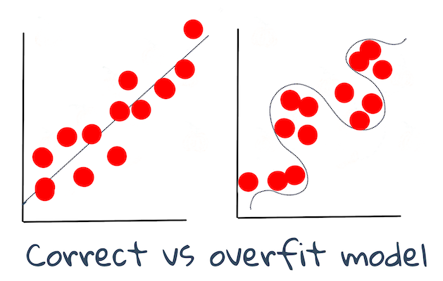

<!--
CO_OP_TRANSLATOR_METADATA:
{
  "original_hash": "dc4575225da159f2b06706e103ddba2a",
  "translation_date": "2025-08-29T13:40:41+00:00",
  "source_file": "1-Introduction/4-techniques-of-ML/README.md",
  "language_code": "tl"
}
-->
# Mga Teknik sa Machine Learning

Ang proseso ng pagbuo, paggamit, at pagpapanatili ng mga modelo ng machine learning at ang datos na ginagamit ng mga ito ay ibang-iba sa maraming iba pang mga workflow ng pag-develop. Sa araling ito, ating lilinawin ang prosesong ito at ilalahad ang mga pangunahing teknik na kailangan mong malaman. Ikaw ay:

- Mauunawaan ang mga prosesong bumubuo sa machine learning sa mataas na antas.
- Tuklasin ang mga pangunahing konsepto tulad ng 'mga modelo', 'mga prediksyon', at 'training data'.

## [Pre-lecture quiz](https://gray-sand-07a10f403.1.azurestaticapps.net/quiz/7/)

> 🎥 I-click ang larawan sa itaas para sa isang maikling video na nagpapaliwanag ng araling ito.

## Panimula

Sa mataas na antas, ang sining ng paglikha ng mga proseso ng machine learning (ML) ay binubuo ng ilang mga hakbang:

1. **Magdesisyon sa tanong**. Karamihan sa mga proseso ng ML ay nagsisimula sa pagtatanong ng isang tanong na hindi kayang sagutin ng isang simpleng conditional program o rules-based engine. Ang mga tanong na ito ay madalas na umiikot sa mga prediksyon batay sa koleksyon ng datos.
2. **Kolektahin at ihanda ang datos**. Upang masagot ang iyong tanong, kailangan mo ng datos. Ang kalidad at, kung minsan, ang dami ng iyong datos ang magtatakda kung gaano kahusay mong masasagot ang iyong tanong. Ang pag-visualize ng datos ay mahalagang aspeto ng yugtong ito. Kasama rin dito ang paghahati ng datos sa training at testing group upang makabuo ng modelo.
3. **Pumili ng paraan ng pagsasanay**. Depende sa iyong tanong at sa kalikasan ng iyong datos, kailangan mong pumili kung paano mo gustong sanayin ang isang modelo upang pinakamahusay na maipakita ang datos at makagawa ng tumpak na prediksyon.
4. **Sanayin ang modelo**. Gamit ang iyong training data, gagamit ka ng iba't ibang algorithm upang sanayin ang isang modelo na makilala ang mga pattern sa datos. Ang modelo ay maaaring gumamit ng internal weights na maaaring ayusin upang bigyang-priyoridad ang ilang bahagi ng datos kaysa sa iba upang makabuo ng mas mahusay na modelo.
5. **Suriin ang modelo**. Gamit ang datos na hindi pa nakikita (iyong testing data) mula sa iyong nakolektang set, susuriin mo kung paano gumagana ang modelo.
6. **Pag-tune ng mga parameter**. Batay sa performance ng iyong modelo, maaari mong ulitin ang proseso gamit ang iba't ibang mga parameter o variable na kumokontrol sa kilos ng mga algorithm na ginamit sa pagsasanay ng modelo.
7. **Mag-predict**. Gumamit ng bagong input upang subukan ang katumpakan ng iyong modelo.

## Anong tanong ang dapat itanong

Ang mga computer ay partikular na mahusay sa pagtuklas ng mga nakatagong pattern sa datos. Ang kakayahang ito ay napakahalaga para sa mga mananaliksik na may mga tanong tungkol sa isang partikular na larangan na hindi madaling masagot sa pamamagitan ng paggawa ng isang conditionally-based rules engine. Halimbawa, sa isang actuarial na gawain, maaaring makabuo ang isang data scientist ng mga handcrafted rules tungkol sa mortality ng mga naninigarilyo kumpara sa mga hindi naninigarilyo.

Kapag maraming iba pang mga variable ang isinama sa equation, gayunpaman, maaaring mas mahusay ang isang ML model sa pag-predict ng mga hinaharap na mortality rate batay sa nakaraang kasaysayan ng kalusugan. Isang mas masayang halimbawa ay ang paggawa ng prediksyon ng panahon para sa buwan ng Abril sa isang partikular na lugar batay sa datos na kinabibilangan ng latitude, longitude, pagbabago ng klima, kalapitan sa dagat, mga pattern ng jet stream, at iba pa.

✅ Ang [slide deck](https://www2.cisl.ucar.edu/sites/default/files/2021-10/0900%20June%2024%20Haupt_0.pdf) na ito tungkol sa mga modelo ng panahon ay nagbibigay ng isang historikal na perspektibo sa paggamit ng ML sa pagsusuri ng panahon.  

## Mga Gawain Bago ang Pagbuo

Bago magsimula sa pagbuo ng iyong modelo, may ilang mga gawain na kailangan mong kumpletuhin. Upang masubukan ang iyong tanong at makabuo ng hypothesis batay sa mga prediksyon ng modelo, kailangan mong tukuyin at i-configure ang ilang mga elemento.

### Datos

Upang masagot ang iyong tanong nang may katiyakan, kailangan mo ng sapat na dami ng datos na may tamang uri. Dalawang bagay ang kailangan mong gawin sa puntong ito:

- **Kolektahin ang datos**. Tandaan ang nakaraang aralin tungkol sa pagiging patas sa pagsusuri ng datos, kolektahin ang iyong datos nang maingat. Maging mulat sa mga pinagmulan ng datos na ito, anumang likas na bias na maaaring mayroon ito, at idokumento ang pinagmulan nito.
- **Ihanda ang datos**. May ilang mga hakbang sa proseso ng paghahanda ng datos. Maaaring kailanganin mong pagsama-samahin ang datos at gawing normal ito kung ito ay nagmula sa iba't ibang mga pinagmulan. Maaari mong pagandahin ang kalidad at dami ng datos sa pamamagitan ng iba't ibang mga pamamaraan tulad ng pag-convert ng mga string sa mga numero (tulad ng ginagawa natin sa [Clustering](../../5-Clustering/1-Visualize/README.md)). Maaari ka ring bumuo ng bagong datos batay sa orihinal (tulad ng ginagawa natin sa [Classification](../../4-Classification/1-Introduction/README.md)). Maaari mong linisin at i-edit ang datos (tulad ng gagawin natin bago ang [Web App](../../3-Web-App/README.md) na aralin). Sa wakas, maaaring kailanganin mo ring i-randomize at i-shuffle ito, depende sa iyong mga teknik sa pagsasanay.

✅ Pagkatapos kolektahin at iproseso ang iyong datos, maglaan ng sandali upang tingnan kung ang hugis nito ay magpapahintulot sa iyo na tugunan ang iyong nilalayong tanong. Maaaring ang datos ay hindi magiging mahusay sa iyong ibinigay na gawain, tulad ng natuklasan natin sa aming mga aralin sa [Clustering](../../5-Clustering/1-Visualize/README.md)!

### Mga Feature at Target

Ang isang [feature](https://www.datasciencecentral.com/profiles/blogs/an-introduction-to-variable-and-feature-selection) ay isang nasusukat na katangian ng iyong datos. Sa maraming dataset, ito ay ipinapahayag bilang isang heading ng column tulad ng 'petsa', 'laki', o 'kulay'. Ang iyong feature variable, na karaniwang kinakatawan bilang `X` sa code, ay kumakatawan sa input variable na gagamitin upang sanayin ang modelo.

Ang target ay ang bagay na sinusubukan mong hulaan. Ang target, na karaniwang kinakatawan bilang `y` sa code, ay kumakatawan sa sagot sa tanong na sinusubukan mong itanong sa iyong datos: sa Disyembre, anong **kulay** ng mga kalabasa ang magiging pinakamura? Sa San Francisco, aling mga kapitbahayan ang magkakaroon ng pinakamahusay na **presyo** ng real estate? Minsan ang target ay tinutukoy din bilang label attribute.

### Pagpili ng iyong feature variable

🎓 **Feature Selection at Feature Extraction** Paano mo malalaman kung aling variable ang pipiliin kapag bumubuo ng isang modelo? Malamang na dadaan ka sa isang proseso ng feature selection o feature extraction upang piliin ang tamang mga variable para sa pinaka-performant na modelo. Hindi sila pareho: "Ang feature extraction ay lumilikha ng mga bagong feature mula sa mga function ng orihinal na mga feature, samantalang ang feature selection ay nagbabalik ng isang subset ng mga feature." ([source](https://wikipedia.org/wiki/Feature_selection))

### I-visualize ang iyong datos

Isang mahalagang aspeto ng toolkit ng isang data scientist ay ang kakayahang i-visualize ang datos gamit ang ilang magagaling na library tulad ng Seaborn o MatPlotLib. Ang pagre-representa ng iyong datos nang biswal ay maaaring magpahintulot sa iyo na matuklasan ang mga nakatagong ugnayan na maaari mong magamit. Ang iyong mga visualization ay maaari ring makatulong sa iyo na matuklasan ang bias o hindi balanseng datos (tulad ng natuklasan natin sa [Classification](../../4-Classification/2-Classifiers-1/README.md)).

### Hatiin ang iyong dataset

Bago ang pagsasanay, kailangan mong hatiin ang iyong dataset sa dalawa o higit pang bahagi na may hindi pantay na laki ngunit mahusay pa ring kumakatawan sa datos.

- **Training**. Ang bahaging ito ng dataset ay ginagamit upang sanayin ang iyong modelo. Ang set na ito ay bumubuo ng karamihan ng orihinal na dataset.
- **Testing**. Ang test dataset ay isang independiyenteng grupo ng datos, madalas na kinuha mula sa orihinal na datos, na ginagamit mo upang kumpirmahin ang performance ng nabuo na modelo.
- **Validating**. Ang validation set ay isang mas maliit na independiyenteng grupo ng mga halimbawa na ginagamit mo upang i-tune ang mga hyperparameter ng modelo, o ang arkitektura nito, upang mapabuti ang modelo. Depende sa laki ng iyong datos at sa tanong na iyong tinatanong, maaaring hindi mo kailangang bumuo ng ikatlong set na ito (tulad ng nabanggit natin sa [Time Series Forecasting](../../7-TimeSeries/1-Introduction/README.md)).

## Pagbuo ng isang modelo

Gamit ang iyong training data, ang iyong layunin ay bumuo ng isang modelo, o isang estadistikal na representasyon ng iyong datos, gamit ang iba't ibang algorithm upang **sanayin** ito. Ang pagsasanay ng isang modelo ay inilalantad ito sa datos at hinahayaan itong gumawa ng mga hinuha tungkol sa mga pattern na natuklasan, napatunayan, at tinanggap o tinanggihan.

### Magdesisyon sa paraan ng pagsasanay

Depende sa iyong tanong at sa kalikasan ng iyong datos, pipili ka ng paraan upang sanayin ito. Sa pamamagitan ng pagdaan sa [Scikit-learn's documentation](https://scikit-learn.org/stable/user_guide.html) - na ginagamit natin sa kursong ito - maaari mong tuklasin ang maraming paraan upang sanayin ang isang modelo. Depende sa iyong karanasan, maaaring kailanganin mong subukan ang ilang iba't ibang mga paraan upang makabuo ng pinakamahusay na modelo. Malamang na dadaan ka sa isang proseso kung saan sinusuri ng mga data scientist ang performance ng isang modelo sa pamamagitan ng pagpapakain dito ng hindi pa nakikitang datos, sinusuri ang katumpakan, bias, at iba pang mga isyung nagpapababa ng kalidad, at pinipili ang pinakaangkop na paraan ng pagsasanay para sa gawain.

### Sanayin ang isang modelo

Gamit ang iyong training data, handa ka nang 'i-fit' ito upang lumikha ng isang modelo. Mapapansin mo na sa maraming ML library, makikita mo ang code na 'model.fit' - sa puntong ito mo ipapadala ang iyong feature variable bilang isang array ng mga halaga (karaniwang 'X') at isang target variable (karaniwang 'y').

### Suriin ang modelo

Kapag natapos na ang proseso ng pagsasanay (maaari itong tumagal ng maraming pag-ulit, o 'epochs', upang sanayin ang isang malaking modelo), magagawa mong suriin ang kalidad ng modelo sa pamamagitan ng paggamit ng test data upang masukat ang performance nito. Ang datos na ito ay isang subset ng orihinal na datos na hindi pa nasusuri ng modelo. Maaari kang mag-print ng isang talahanayan ng mga sukatan tungkol sa kalidad ng iyong modelo.

🎓 **Model fitting**

Sa konteksto ng machine learning, ang model fitting ay tumutukoy sa katumpakan ng pinagbabatayang function ng modelo habang sinusubukan nitong suriin ang datos na hindi nito pamilyar.

🎓 Ang **underfitting** at **overfitting** ay mga karaniwang problema na nagpapababa sa kalidad ng modelo, dahil ang modelo ay maaaring hindi sapat ang pagkaka-fit o masyadong fit. Nagdudulot ito ng modelo na gumawa ng mga prediksyon na masyadong malapit o masyadong malayo sa pagkakahanay sa training data nito. Ang isang overfit na modelo ay masyadong mahusay sa pag-predict ng training data dahil natutunan nito nang husto ang mga detalye at ingay ng datos. Ang isang underfit na modelo ay hindi tumpak dahil hindi nito kayang suriin nang maayos ang training data nito o ang datos na hindi pa nito 'nakikita'.

> Infographic ni [Jen Looper](https://twitter.com/jenlooper)

## Pag-tune ng mga parameter

Kapag natapos na ang iyong unang pagsasanay, obserbahan ang kalidad ng modelo at isaalang-alang ang pagpapabuti nito sa pamamagitan ng pag-tweak ng mga 'hyperparameter'. Magbasa pa tungkol sa proseso [sa dokumentasyon](https://docs.microsoft.com/en-us/azure/machine-learning/how-to-tune-hyperparameters?WT.mc_id=academic-77952-leestott).

## Prediksyon

Ito ang sandali kung saan maaari mong gamitin ang ganap na bagong datos upang subukan ang katumpakan ng iyong modelo. Sa isang 'applied' na setting ng ML, kung saan bumubuo ka ng mga web asset upang gamitin ang modelo sa produksyon, maaaring kabilang sa prosesong ito ang pagkolekta ng input ng user (halimbawa, isang pindot ng button) upang magtakda ng isang variable at ipadala ito sa modelo para sa inference, o pagsusuri.

Sa mga araling ito, matutuklasan mo kung paano gamitin ang mga hakbang na ito upang maghanda, bumuo, sumubok, suriin, at mag-predict - lahat ng mga kilos ng isang data scientist at higit pa, habang ikaw ay sumusulong sa iyong paglalakbay upang maging isang 'full stack' ML engineer.

---

## 🚀Hamunin

Gumuhit ng isang flow chart na nagpapakita ng mga hakbang ng isang ML practitioner. Nasaan ka ngayon sa prosesong ito? Saan mo inaasahan na mahihirapan ka? Ano ang tila madali para sa iyo?

## [Post-lecture quiz](https://gray-sand-07a10f403.1.azurestaticapps.net/quiz/8/)

## Review at Pag-aaral sa Sarili

Maghanap online ng mga panayam sa mga data scientist na naglalahad ng kanilang pang-araw-araw na gawain. Narito ang [isa](https://www.youtube.com/watch?v=Z3IjgbbCEfs).

## Takdang-Aralin

[Mag-interview ng isang data scientist](assignment.md)

---

**Paunawa**:  
Ang dokumentong ito ay isinalin gamit ang AI translation service na [Co-op Translator](https://github.com/Azure/co-op-translator). Bagama't sinisikap naming maging tumpak, pakitandaan na ang mga awtomatikong pagsasalin ay maaaring maglaman ng mga pagkakamali o hindi pagkakatugma. Ang orihinal na dokumento sa orihinal nitong wika ang dapat ituring na opisyal na sanggunian. Para sa mahalagang impormasyon, inirerekomenda ang propesyonal na pagsasalin ng tao. Hindi kami mananagot sa anumang hindi pagkakaunawaan o maling interpretasyon na maaaring magmula sa paggamit ng pagsasaling ito.