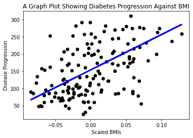

<!--
CO_OP_TRANSLATOR_METADATA:
{
  "original_hash": "6b1cb0e46d4c5b747eff6e3607642760",
  "translation_date": "2025-08-29T13:04:06+00:00",
  "source_file": "2-Regression/1-Tools/README.md",
  "language_code": "tl"
}
-->
# Magsimula sa Python at Scikit-learn para sa mga regression model


> Sketchnote ni [Tomomi Imura](https://www.twitter.com/girlie_mac)

## [Pre-lecture quiz](https://gray-sand-07a10f403.1.azurestaticapps.net/quiz/9/)

> ### [Ang araling ito ay available sa R!](../../../../2-Regression/1-Tools/solution/R/lesson_1.html)

## Panimula

Sa apat na araling ito, matutuklasan mo kung paano bumuo ng mga regression model. Tatalakayin natin kung para saan ang mga ito sa madaling panahon. Ngunit bago ka magsimula, siguraduhing mayroon kang tamang mga tool para simulan ang proseso!

Sa araling ito, matututunan mo kung paano:

- I-configure ang iyong computer para sa mga lokal na machine learning na gawain.
- Gumamit ng Jupyter notebooks.
- Gumamit ng Scikit-learn, kabilang ang pag-install.
- Tuklasin ang linear regression sa pamamagitan ng isang praktikal na ehersisyo.

## Mga Pag-install at Konfigurasyon

[](https://youtu.be/-DfeD2k2Kj0 "ML para sa mga nagsisimula - I-set up ang iyong mga tool para bumuo ng Machine Learning models")

> 🎥 I-click ang imahe sa itaas para sa isang maikling video tungkol sa pag-configure ng iyong computer para sa ML.

1. **I-install ang Python**. Siguraduhing naka-install ang [Python](https://www.python.org/downloads/) sa iyong computer. Gagamitin mo ang Python para sa maraming data science at machine learning na gawain. Karamihan sa mga computer system ay mayroon nang naka-install na Python. Mayroon ding mga kapaki-pakinabang na [Python Coding Packs](https://code.visualstudio.com/learn/educators/installers?WT.mc_id=academic-77952-leestott) na magpapadali sa setup para sa ilang user.

   Gayunpaman, ang ilang paggamit ng Python ay nangangailangan ng isang partikular na bersyon ng software, habang ang iba ay nangangailangan ng ibang bersyon. Para sa kadahilanang ito, kapaki-pakinabang na gumamit ng [virtual environment](https://docs.python.org/3/library/venv.html).

2. **I-install ang Visual Studio Code**. Siguraduhing naka-install ang Visual Studio Code sa iyong computer. Sundin ang mga tagubilin para sa [pag-install ng Visual Studio Code](https://code.visualstudio.com/) para sa basic na setup. Gagamitin mo ang Python sa Visual Studio Code sa kursong ito, kaya maaaring gusto mong mag-review kung paano [i-configure ang Visual Studio Code](https://docs.microsoft.com/learn/modules/python-install-vscode?WT.mc_id=academic-77952-leestott) para sa Python development.

   > Maging komportable sa Python sa pamamagitan ng pagdaan sa koleksyong ito ng [Learn modules](https://docs.microsoft.com/users/jenlooper-2911/collections/mp1pagggd5qrq7?WT.mc_id=academic-77952-leestott)
   >
   > [](https://youtu.be/yyQM70vi7V8 "I-set up ang Python gamit ang Visual Studio Code")
   >
   > 🎥 I-click ang imahe sa itaas para sa isang video: paggamit ng Python sa loob ng VS Code.

3. **I-install ang Scikit-learn**, sa pamamagitan ng pagsunod sa [mga tagubilin na ito](https://scikit-learn.org/stable/install.html). Dahil kailangan mong tiyakin na gumagamit ka ng Python 3, inirerekomenda na gumamit ka ng virtual environment. Tandaan, kung ini-install mo ang library na ito sa isang M1 Mac, may mga espesyal na tagubilin sa pahinang naka-link sa itaas.

4. **I-install ang Jupyter Notebook**. Kailangan mong [i-install ang Jupyter package](https://pypi.org/project/jupyter/).

## Ang iyong ML authoring environment

Gagamit ka ng **notebooks** para bumuo ng iyong Python code at lumikha ng mga machine learning model. Ang ganitong uri ng file ay karaniwang tool para sa mga data scientist, at makikilala sila sa pamamagitan ng kanilang suffix o extension `.ipynb`.

Ang notebooks ay isang interactive na environment na nagbibigay-daan sa developer na parehong mag-code at magdagdag ng mga tala at magsulat ng dokumentasyon sa paligid ng code, na kapaki-pakinabang para sa mga experimental o research-oriented na proyekto.

[](https://youtu.be/7E-jC8FLA2E "ML para sa mga nagsisimula - I-set up ang Jupyter Notebooks para simulan ang pagbuo ng regression models")

> 🎥 I-click ang imahe sa itaas para sa isang maikling video tungkol sa ehersisyong ito.

### Ehersisyo - gumamit ng notebook

Sa folder na ito, makikita mo ang file na _notebook.ipynb_.

1. Buksan ang _notebook.ipynb_ sa Visual Studio Code.

   Magsisimula ang isang Jupyter server gamit ang Python 3+. Makikita mo ang mga bahagi ng notebook na maaaring `run`, mga piraso ng code. Maaari mong patakbuhin ang isang code block, sa pamamagitan ng pagpili sa icon na mukhang play button.

2. Piliin ang `md` icon at magdagdag ng kaunting markdown, at ang sumusunod na teksto **# Welcome to your notebook**.

   Susunod, magdagdag ng ilang Python code.

3. I-type ang **print('hello notebook')** sa code block.
4. Piliin ang arrow para patakbuhin ang code.

   Makikita mo ang naka-print na pahayag:

    ```output
    hello notebook
    ```


Maaari mong ihalo ang iyong code sa mga komento para sa self-documentation ng notebook.

✅ Mag-isip ng sandali kung gaano kaiba ang working environment ng isang web developer kumpara sa isang data scientist.

## Pagsisimula sa Scikit-learn

Ngayon na naka-set up na ang Python sa iyong lokal na environment, at komportable ka na sa Jupyter notebooks, magpakomportable din tayo sa Scikit-learn (binibigkas na `sci` tulad ng `science`). Ang Scikit-learn ay nagbibigay ng [malawak na API](https://scikit-learn.org/stable/modules/classes.html#api-ref) para tulungan kang magsagawa ng mga ML na gawain.

Ayon sa kanilang [website](https://scikit-learn.org/stable/getting_started.html), "Ang Scikit-learn ay isang open source machine learning library na sumusuporta sa supervised at unsupervised learning. Nagbibigay din ito ng iba't ibang tool para sa model fitting, data preprocessing, model selection at evaluation, at marami pang ibang utilities."

Sa kursong ito, gagamitin mo ang Scikit-learn at iba pang mga tool para bumuo ng mga machine learning model para magsagawa ng tinatawag nating 'traditional machine learning' na mga gawain. Sadyang iniwasan namin ang neural networks at deep learning, dahil mas mahusay silang saklawin sa aming paparating na 'AI for Beginners' na kurikulum.

Ginagawang simple ng Scikit-learn ang pagbuo ng mga model at ang pagsusuri sa mga ito para magamit. Pangunahing nakatuon ito sa paggamit ng numeric data at naglalaman ng ilang ready-made na dataset para magamit bilang mga learning tool. Kasama rin dito ang mga pre-built na model para subukan ng mga estudyante. Tuklasin natin ang proseso ng pag-load ng prepackaged na data at paggamit ng built-in estimator para sa unang ML model gamit ang Scikit-learn sa ilang basic na data.

## Ehersisyo - ang iyong unang Scikit-learn notebook

> Ang tutorial na ito ay inspirasyon mula sa [linear regression example](https://scikit-learn.org/stable/auto_examples/linear_model/plot_ols.html#sphx-glr-auto-examples-linear-model-plot-ols-py) sa website ng Scikit-learn.

[](https://youtu.be/2xkXL5EUpS0 "ML para sa mga nagsisimula - Ang iyong Unang Linear Regression Project sa Python")

> 🎥 I-click ang imahe sa itaas para sa isang maikling video tungkol sa ehersisyong ito.

Sa file na _notebook.ipynb_ na nauugnay sa araling ito, i-clear ang lahat ng mga cell sa pamamagitan ng pagpindot sa 'trash can' icon.

Sa seksyong ito, gagamit ka ng isang maliit na dataset tungkol sa diabetes na built-in sa Scikit-learn para sa mga layunin ng pag-aaral. Isipin na gusto mong subukan ang isang paggamot para sa mga pasyenteng may diabetes. Ang mga Machine Learning model ay maaaring makatulong sa iyo na matukoy kung aling mga pasyente ang mas mahusay na tutugon sa paggamot, batay sa mga kumbinasyon ng mga variable. Kahit na isang napaka-basic na regression model, kapag na-visualize, maaaring magpakita ng impormasyon tungkol sa mga variable na makakatulong sa iyo na ayusin ang iyong mga teoretikal na clinical trial.

✅ Maraming uri ng regression methods, at kung alin ang pipiliin mo ay nakadepende sa sagot na hinahanap mo. Kung gusto mong hulaan ang posibleng taas ng isang tao batay sa edad, gagamit ka ng linear regression, dahil naghahanap ka ng **numeric value**. Kung interesado kang tuklasin kung ang isang uri ng pagkain ay dapat ituring na vegan o hindi, naghahanap ka ng **category assignment** kaya gagamit ka ng logistic regression. Matututo ka pa tungkol sa logistic regression sa susunod. Mag-isip ng kaunti tungkol sa ilang tanong na maaari mong itanong sa data, at kung alin sa mga pamamaraang ito ang mas angkop.

Simulan na natin ang gawain.

### I-import ang mga library

Para sa gawain na ito, mag-i-import tayo ng ilang library:

- **matplotlib**. Isang kapaki-pakinabang na [graphing tool](https://matplotlib.org/) na gagamitin natin para gumawa ng line plot.
- **numpy**. [numpy](https://numpy.org/doc/stable/user/whatisnumpy.html) ay isang kapaki-pakinabang na library para sa paghawak ng numeric data sa Python.
- **sklearn**. Ito ang [Scikit-learn](https://scikit-learn.org/stable/user_guide.html) library.

Mag-import ng ilang library para makatulong sa iyong mga gawain.

1. Magdagdag ng imports sa pamamagitan ng pag-type ng sumusunod na code:

   ```python
   import matplotlib.pyplot as plt
   import numpy as np
   from sklearn import datasets, linear_model, model_selection
   ```

   Sa itaas, nag-i-import ka ng `matplotlib`, `numpy` at nag-i-import ka ng `datasets`, `linear_model` at `model_selection` mula sa `sklearn`. Ang `model_selection` ay ginagamit para sa paghahati ng data sa training at test sets.

### Ang diabetes dataset

Ang built-in na [diabetes dataset](https://scikit-learn.org/stable/datasets/toy_dataset.html#diabetes-dataset) ay may kasamang 442 sample ng data tungkol sa diabetes, na may 10 feature variables, ilan sa mga ito ay:

- age: edad sa taon
- bmi: body mass index
- bp: average blood pressure
- s1 tc: T-Cells (isang uri ng white blood cells)

✅ Ang dataset na ito ay may kasamang konsepto ng 'sex' bilang isang feature variable na mahalaga sa pananaliksik tungkol sa diabetes. Maraming medical datasets ang may ganitong uri ng binary classification. Mag-isip ng kaunti tungkol sa kung paano maaaring maalis ng mga ganitong klasipikasyon ang ilang bahagi ng populasyon mula sa mga paggamot.

Ngayon, i-load ang X at y data.

> 🎓 Tandaan, ito ay supervised learning, at kailangan natin ng tinatawag na 'y' target.

Sa isang bagong code cell, i-load ang diabetes dataset sa pamamagitan ng pagtawag sa `load_diabetes()`. Ang input na `return_X_y=True` ay nagpapahiwatig na ang `X` ay magiging isang data matrix, at ang `y` ay magiging regression target.

1. Magdagdag ng ilang print commands para ipakita ang hugis ng data matrix at ang unang elemento nito:

    ```python
    X, y = datasets.load_diabetes(return_X_y=True)
    print(X.shape)
    print(X[0])
    ```

    Ang nakukuha mo bilang tugon ay isang tuple. Ang ginagawa mo ay i-assign ang dalawang unang halaga ng tuple sa `X` at `y` ayon sa pagkakabanggit. Matuto pa [tungkol sa tuples](https://wikipedia.org/wiki/Tuple).

    Makikita mo na ang data na ito ay may 442 item na nakaayos sa arrays na may 10 elemento:

    ```text
    (442, 10)
    [ 0.03807591  0.05068012  0.06169621  0.02187235 -0.0442235  -0.03482076
    -0.04340085 -0.00259226  0.01990842 -0.01764613]
    ```

    ✅ Mag-isip ng kaunti tungkol sa relasyon sa pagitan ng data at ng regression target. Ang linear regression ay nagtataya ng mga relasyon sa pagitan ng feature X at target variable y. Mahahanap mo ba ang [target](https://scikit-learn.org/stable/datasets/toy_dataset.html#diabetes-dataset) para sa diabetes dataset sa dokumentasyon? Ano ang ipinapakita ng dataset na ito, batay sa target?

2. Susunod, pumili ng bahagi ng dataset na ito para i-plot sa pamamagitan ng pagpili sa ika-3 column ng dataset. Magagawa mo ito sa pamamagitan ng paggamit ng `:` operator para piliin ang lahat ng rows, at pagkatapos ay piliin ang ika-3 column gamit ang index (2). Maaari mo ring i-reshape ang data para maging isang 2D array - na kinakailangan para sa plotting - sa pamamagitan ng paggamit ng `reshape(n_rows, n_columns)`. Kung ang isa sa mga parameter ay -1, ang kaukulang dimensyon ay awtomatikong kinakalkula.

   ```python
   X = X[:, 2]
   X = X.reshape((-1,1))
   ```

   ✅ Sa anumang oras, i-print ang data para suriin ang hugis nito.

3. Ngayon na handa na ang data para i-plot, maaari mong tingnan kung makakatulong ang isang machine para matukoy ang lohikal na paghahati sa pagitan ng mga numero sa dataset na ito. Para magawa ito, kailangan mong hatiin ang parehong data (X) at ang target (y) sa test at training sets. Ang Scikit-learn ay may simpleng paraan para gawin ito; maaari mong hatiin ang iyong test data sa isang ibinigay na punto.

   ```python
   X_train, X_test, y_train, y_test = model_selection.train_test_split(X, y, test_size=0.33)
   ```

4. Ngayon handa ka nang i-train ang iyong model! I-load ang linear regression model at i-train ito gamit ang iyong X at y training sets gamit ang `model.fit()`:

    ```python
    model = linear_model.LinearRegression()
    model.fit(X_train, y_train)
    ```

    ✅ Ang `model.fit()` ay isang function na madalas mong makikita sa maraming ML libraries tulad ng TensorFlow.

5. Pagkatapos, lumikha ng prediction gamit ang test data, gamit ang function na `predict()`. Ito ay gagamitin para iguhit ang linya sa pagitan ng mga grupo ng data.

    ```python
    y_pred = model.predict(X_test)
    ```

6. Ngayon oras na para ipakita ang data sa isang plot. Ang Matplotlib ay isang napaka-kapaki-pakinabang na tool para sa gawaing ito. Gumawa ng scatterplot ng lahat ng X at y test data, at gamitin ang prediction para iguhit ang linya sa pinaka-angkop na lugar, sa pagitan ng mga grupo ng data ng model.

    ```python
    plt.scatter(X_test, y_test,  color='black')
    plt.plot(X_test, y_pred, color='blue', linewidth=3)
    plt.xlabel('Scaled BMIs')
    plt.ylabel('Disease Progression')
    plt.title('A Graph Plot Showing Diabetes Progression Against BMI')
    plt.show()
    ```

   
✅ Pag-isipan mo kung ano ang nangyayari dito. Isang tuwid na linya ang dumadaan sa maraming maliliit na tuldok ng datos, pero ano nga ba ang ginagawa nito? Nakikita mo ba kung paano mo magagamit ang linyang ito upang mahulaan kung saan dapat ilagay ang isang bagong, hindi pa nakikitang punto ng datos kaugnay sa y axis ng plot? Subukang ilarawan sa mga salita ang praktikal na gamit ng modelong ito.

Binabati kita, nakagawa ka ng iyong unang linear regression model, nakalikha ng prediksyon gamit ito, at naipakita ito sa isang plot!

---
## 🚀Hamunin

I-plot ang ibang variable mula sa dataset na ito. Pahiwatig: i-edit ang linyang ito: `X = X[:,2]`. Batay sa target ng dataset na ito, ano ang kaya mong matuklasan tungkol sa pag-usad ng diabetes bilang isang sakit?

## [Post-lecture quiz](https://gray-sand-07a10f403.1.azurestaticapps.net/quiz/10/)

## Review & Pag-aaral sa Sarili

Sa tutorial na ito, gumamit ka ng simpleng linear regression, sa halip na univariate o multiple linear regression. Magbasa nang kaunti tungkol sa mga pagkakaiba ng mga pamamaraang ito, o panoorin ang [video na ito](https://www.coursera.org/lecture/quantifying-relationships-regression-models/linear-vs-nonlinear-categorical-variables-ai2Ef).

Magbasa pa tungkol sa konsepto ng regression at pag-isipan kung anong mga uri ng tanong ang maaaring masagot gamit ang teknik na ito. Kunin ang [tutorial na ito](https://docs.microsoft.com/learn/modules/train-evaluate-regression-models?WT.mc_id=academic-77952-leestott) upang palalimin ang iyong kaalaman.

## Takdang Aralin

[Isang Ibang Dataset](assignment.md)

---

**Paunawa**:  
Ang dokumentong ito ay isinalin gamit ang AI translation service na [Co-op Translator](https://github.com/Azure/co-op-translator). Bagama't sinisikap naming maging tumpak, pakitandaan na ang mga awtomatikong pagsasalin ay maaaring maglaman ng mga pagkakamali o hindi pagkakatugma. Ang orihinal na dokumento sa orihinal nitong wika ang dapat ituring na opisyal na sanggunian. Para sa mahalagang impormasyon, inirerekomenda ang propesyonal na pagsasalin ng tao. Hindi kami mananagot sa anumang hindi pagkakaunawaan o maling interpretasyon na maaaring magmula sa paggamit ng pagsasaling ito.