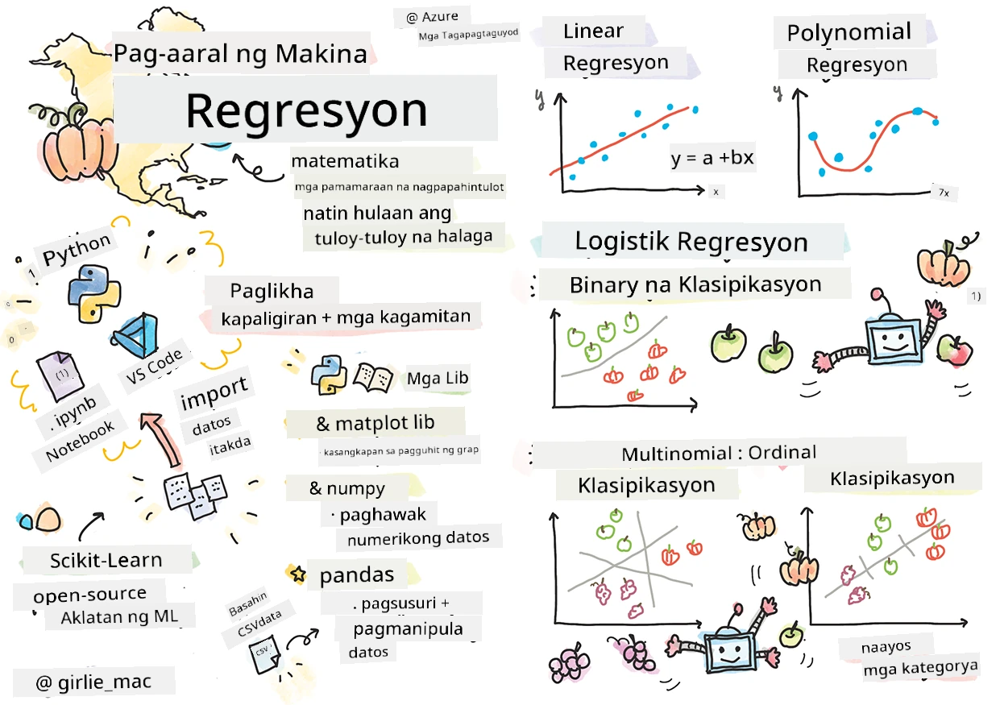
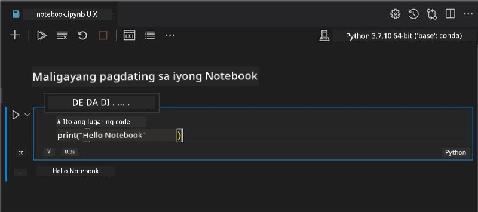
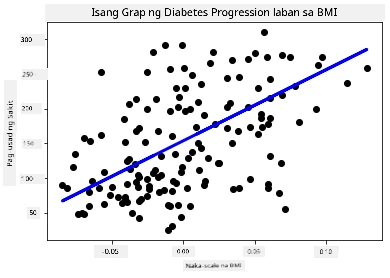

# Magsimula sa Python at Scikit-learn para sa mga modelo ng regression



> Sketchnote ni [Tomomi Imura](https://www.twitter.com/girlie_mac)

## [Pre-lecture quiz](https://ff-quizzes.netlify.app/en/ml/)

> ### [Available ang leksyong ito sa R!](../../../../2-Regression/1-Tools/solution/R/lesson_1.html)

## Introduksyon

Sa apat na araling ito, matutuklasan mo kung paano bumuo ng mga regression model. Tatalakayin natin kung para saan ang mga ito pagkatapos. Ngunit bago ka gumawa ng anumang bagay, siguraduhing meron kang tamang mga kagamitan upang simulan ang proseso!

Sa araling ito, matututuhan mo kung paano:

- I-configure ang iyong computer para sa mga lokal na gawain sa machine learning.
- Gumamit ng Jupyter Notebooks.
- Gumamit ng Scikit-learn, kabilang ang pag-install.
- Suriin ang linear regression sa isang praktikal na pagsasanay.

## Mga pag-install at konfigurasyon

[](https://youtu.be/-DfeD2k2Kj0 "ML para sa mga baguhan - I-set up ang iyong mga kagamitan para makapagsimula sa pagbuo ng Machine Learning models")

> 🎥 Pindutin ang larawan sa itaas para sa maikling video tungkol sa pag-configure ng iyong computer para sa ML.

1. **I-install ang Python**. Siguraduhing naka-install ang [Python](https://www.python.org/downloads/) sa iyong computer. Gagamitin mo ang Python para sa maraming gawain sa data science at machine learning. Karamihan sa mga sistema ng computer ay may nakalaang pag-install ng Python. Meron ding mga kapaki-pakinabang na [Python Coding Packs](https://code.visualstudio.com/learn/educators/installers?WT.mc_id=academic-77952-leestott) na makakatulong para mas madali ang setup para sa ilan.

   Gayunpaman, may ilang gamit ng Python na nangangailangan ng isang bersyon ng software, habang ang iba naman ay ibang bersyon. Dahil dito, kapaki-pakinabang ang gumamit ng [virtual environment](https://docs.python.org/3/library/venv.html).

2. **I-install ang Visual Studio Code**. Siguraduhing naka-install ang Visual Studio Code sa iyong computer. Sundin ang mga tagubiling ito para sa [pag-install ng Visual Studio Code](https://code.visualstudio.com/) para sa pangunahing pag-install. Gagamitin mo ang Python sa Visual Studio Code sa kursong ito, kaya maaaring gusto mong aralin kung paano [i-configure ang Visual Studio Code](https://docs.microsoft.com/learn/modules/python-install-vscode?WT.mc_id=academic-77952-leestott) para sa pag-develop ng Python.

   > Masanay sa Python sa pamamagitan ng pagdaan sa koleksyon ng mga [Learn modules](https://docs.microsoft.com/users/jenlooper-2911/collections/mp1pagggd5qrq7?WT.mc_id=academic-77952-leestott)
   >
   > [](https://youtu.be/yyQM70vi7V8 "I-setup ang Python gamit ang Visual Studio Code")
   >
   > 🎥 Pindutin ang larawan sa itaas para sa video: paggamit ng Python sa loob ng VS Code.

3. **I-install ang Scikit-learn**, sundin ang [mga tagubilin na ito](https://scikit-learn.org/stable/install.html). Dahil kailangan mong tiyakin na gagamit ka ng Python 3, inirerekomenda na gumamit ka ng virtual environment. Tandaan, kung ini-install mo ang library na ito sa M1 Mac, may espesyal na mga tagubilin sa pahinang naka-link sa itaas.

1. **I-install ang Jupyter Notebook**. Kakailanganin mong [i-install ang Jupyter package](https://pypi.org/project/jupyter/).

## Ang iyong ML authoring environment

Gagamit ka ng **notebooks** para i-develop ang iyong Python code at gumawa ng mga machine learning model. Ang ganitong uri ng file ay isang karaniwang kagamitan para sa mga data scientist, at makikilala ito sa kanilang suffix o extension na `.ipynb`.

Ang mga notebook ay isang interactive na kapaligiran na nagpapahintulot sa developer na parehong mag-code at magdagdag ng mga tala at magsulat ng dokumentasyon sa paligid ng code na napaka-kapaki-pakinabang para sa mga eksperimento o research-oriented na proyekto.

[](https://youtu.be/7E-jC8FLA2E "ML para sa mga baguhan - I-setup ang Jupyter Notebooks upang makapagsimula sa paggawa ng mga regression models")

> 🎥 Pindutin ang larawan sa itaas para sa maikling video na nagtuturo sa pagsasanay na ito.

### Pagsasanay - gumamit ng notebook

Sa folder na ito, makikita mo ang file na _notebook.ipynb_.

1. Buksan ang _notebook.ipynb_ sa Visual Studio Code.

   Mag-uumpisa ang Jupyter server na may Python 3+ na naka-start. Makikita mo ang mga bahagi ng notebook na maaaring `run`, mga piraso ng code. Maaari mong patakbuhin ang isang code block sa pamamagitan ng pagpili ng icon na mukhang play button.

1. Piliin ang `md` icon at magdagdag ng ilang markdown, at ang sumusunod na teksto **# Welcome to your notebook**.

   Pagkatapos, magdagdag ng ilang Python code.

1. I-type ang **print('hello notebook')** sa code block.
1. Piliin ang arrow para patakbuhin ang code.

   Dapat mong makita ang naka-print na pahayag:

    ```output
    hello notebook
    ```



Maaari mong salin-salin ang iyong code sa mga komentaryo para sa sarili mong dokumentasyon ng notebook.

✅ Isipin ng sandali kung gaano kaiba ang working environment ng isang web developer kumpara sa isang data scientist.

## Naka-set up na gamit ang Scikit-learn

Ngayon na naka-setup na ang Python sa iyong lokal na kapaligiran, at komportable ka na sa Jupyter Notebooks, maging komportable na rin tayo sa Scikit-learn (bigkasin itong `sci` tulad ng sa `science`). Nagbibigay ang Scikit-learn ng [malawak na API](https://scikit-learn.org/stable/modules/classes.html#api-ref) para tulungan kang magsagawa ng mga gawain sa ML.

Ayon sa kanilang [website](https://scikit-learn.org/stable/getting_started.html), "Ang Scikit-learn ay isang open source na machine learning library na sumusuporta sa supervised at unsupervised learning. Nagbibigay din ito ng iba’t ibang mga kasangkapan para sa model fitting, data preprocessing, model selection at evaluation, at marami pang iba."

Sa kursong ito, gagamitin mo ang Scikit-learn at iba pang mga tool upang bumuo ng machine learning models para maisagawa ang tinatawag nating 'traditional machine learning' na mga gawain. Sadyang kinaiwasan namin ang neural networks at deep learning, dahil mas mahusay itong tinatalakay sa paparating na 'AI for Beginners' na kurikulum namin.

Pinapadali ng Scikit-learn ang pagbuo ng mga modelo at kanilang pagsusuri para magamit. Nakatuon ito lalo na sa paggamit ng numeric na data at naglalaman ng ilang mga handang-gamitin na datasets bilang mga tool sa pag-aaral. Mayroon din itong mga pre-built na modelo na pwedeng subukan ng mga estudyante. Tuklasin muna natin ang proseso ng paglo-load ng prepackaged data at paggamit ng isang built-in estimator bilang unang ML model gamit ang Scikit-learn na may simpleng data.

## Pagsasanay - ang iyong unang Scikit-learn notebook

> Ang tutorial na ito ay hango sa [linear regression example](https://scikit-learn.org/stable/auto_examples/linear_model/plot_ols.html#sphx-glr-auto-examples-linear-model-plot-ols-py) sa website ng Scikit-learn.


[](https://youtu.be/2xkXL5EUpS0 "ML para sa mga baguhan - Ang iyong Unang Linear Regression Project sa Python")

> 🎥 Pindutin ang larawan sa itaas para sa maikling video na nagtuturo sa pagsasanay na ito.

Sa _notebook.ipynb_ na file na kaugnay ng araling ito, tanggalin ang lahat ng mga selula sa pamamagitan ng pagpindot sa icon na 'trash can'.

Sa seksyong ito, magtatrabaho ka gamit ang maliit na dataset tungkol sa diabetes na naka-built in sa Scikit-learn para sa layuning pampag-aaral. Isipin na gusto mong subukan ang isang paggamot para sa mga diabetic na pasyente. Makakatulong ang mga machine learning model upang tukuyin kung alin sa mga pasyente ang mas mahusay na tumugon sa paggamot, batay sa kombinasyon ng mga variable. Kahit ang isang napakasimpleng regression model, kapag na-visualize, ay maaaring magpakita ng impormasyon tungkol sa mga variable na makakatulong sa iyo na ayusin ang iyong mga teoretikal na clinical trials.

✅ Maraming uri ng mga pamamaraan ng regression, at nakadepende kung alin ang pipiliin mo sa sagot na hinahanap mo. Kung nais mong tukuyin ang malamang na taas para sa isang tao ng isang partikular na edad, gagamit ka ng linear regression, dahil naghahanap ka ng **numeric value**. Kung interesado kang malaman kung ang isang uri ng lutuin ay dapat ituring na vegan o hindi, naghahanap ka ng **category assignment** kaya gagamit ka ng logistic regression. Matututuhan mo pa ang tungkol sa logistic regression sa susunod. Isipin ng kaunti ang ilang mga tanong na maaari mong itanong sa data, at alin sa mga pamamaraang ito ang mas angkop.

Tara, simulan na natin ang gawain na ito.

### Import ng mga library

Para sa gawaing ito, mag-import tayo ng ilang mga library:

- **matplotlib**. Isang kapaki-pakinabang na [graphing tool](https://matplotlib.org/) at gagamitin natin ito upang gumawa ng line plot.
- **numpy**. [numpy](https://numpy.org/doc/stable/user/whatisnumpy.html) ay isang kapaki-pakinabang na library para sa paghawak ng numeric data sa Python.
- **sklearn**. Ito ang [Scikit-learn](https://scikit-learn.org/stable/user_guide.html) library.

Mag-import ng ilang mga library upang makatulong sa iyong mga gawain.

1. Magdagdag ng mga import sa pamamagitan ng pag-type ng sumusunod na code:

   ```python
   import matplotlib.pyplot as plt
   import numpy as np
   from sklearn import datasets, linear_model, model_selection
   ```

   Sa itaas, ini-import mo ang `matplotlib`, `numpy` at ini-import mo ang `datasets`, `linear_model` at `model_selection` mula sa `sklearn`. Ginagamit ang `model_selection` para hatiin ang data sa training at test sets.

### Ang diabetes dataset

Ang naka-built in na [diabetes dataset](https://scikit-learn.org/stable/datasets/toy_dataset.html#diabetes-dataset) ay may 442 halimbawa ng data tungkol sa diabetes, na may 10 feature variables, ilan sa mga ito ay kinabibilangan ng:

- age: edad sa taon
- bmi: body mass index
- bp: average blood pressure
- s1 tc: T-Cells (isang uri ng puting selula ng dugo)

✅ Kasama sa dataset na ito ang konsepto ng 'sex' bilang isang feature variable na mahalaga sa pananaliksik tungkol sa diabetes. Maraming mga medikal na dataset ang may ganitong binary classification. Isipin ng kaunti kung paano maaaring mapag-iiwanan ang ilang bahagi ng populasyon sa mga paggamot dahil sa ganitong mga kategorizasyon.

Ngayon, i-load ang X at y na data.

> 🎓 Tandaan, ito ay supervised learning, kaya kailangan natin ang isang tinatawag na 'y' target.

Sa isang bagong code cell, i-load ang diabetes dataset sa pamamagitan ng pagtawag sa `load_diabetes()`. Ang input na `return_X_y=True` ay nagsasaad na ang `X` ay magiging data matrix, at ang `y` ang regression target.

1. Magdagdag ng mga print command upang ipakita ang hugis ng data matrix at ang unang elemento nito:

    ```python
    X, y = datasets.load_diabetes(return_X_y=True)
    print(X.shape)
    print(X[0])
    ```

    Ang babalik sa iyo bilang tugon ay isang tuple. Ang ginagawa mo ay itinatakda ang unang dalawang halaga ng tuple bilang `X` at `y` ayon sa pagkakasunod.

    Makikita mo na ang data ay may 442 items na hugis mga array na may 10 elemento:

    ```text
    (442, 10)
    [ 0.03807591  0.05068012  0.06169621  0.02187235 -0.0442235  -0.03482076
    -0.04340085 -0.00259226  0.01990842 -0.01764613]
    ```

    ✅ Isipin ng kaunti ang relasyon sa pagitan ng data at ng regression target. Nagtataya ang linear regression ng mga relasyon sa pagitan ng feature X at target variable y. Makikita mo ba ang [target](https://scikit-learn.org/stable/datasets/toy_dataset.html#diabetes-dataset) para sa diabetes dataset sa dokumentasyon? Ano ang ipinapakita ng dataset na ito, batay sa target na iyon?

2. Sunod, piliin ang bahagi ng dataset na ito na ipaplot sa pamamagitan ng pagpili sa 3rd na kolum ng dataset. Magagawa ito gamit ang operator na `:` para piliin ang lahat ng hanay, at pagkatapos ay piliin ang 3rd na kolum gamit ang index (2). Maaari mo ring baguhin ang hugis ng data para maging 2D array - na kailangan sa pag-plot - gamit ang `reshape(n_rows, n_columns)`. Kapag ang isa sa mga parameter ay -1, awtomatikong kinakalkula ang dimensiyong iyon.

   ```python
   X = X[:, 2]
   X = X.reshape((-1,1))
   ```

   ✅ Sa anumang oras, i-print ang data upang macheck ang hugis nito.

3. Ngayon na may handang data na ipaplot, tingnan natin kung makakatulong ang makina sa pagtukoy ng lohikal na paghahati sa mga numero sa dataset na ito. Para gawin ito, kailangan mong hatiin ang data (X) at ang target (y) sa test at training sets. May directang paraan ang Scikit-learn para gawin ito; maaari mong hatiin ang iyong test data sa isang tiyak na punto.

   ```python
   X_train, X_test, y_train, y_test = model_selection.train_test_split(X, y, test_size=0.33)
   ```

4. Ngayon ay handa ka nang sanayin ang iyong modelo! I-load ang linear regression na modelo at sanayin ito gamit ang X at y training sets gamit ang `model.fit()`:

    ```python
    model = linear_model.LinearRegression()
    model.fit(X_train, y_train)
    ```

    ✅ Ang `model.fit()` ay isang function na makikita mo sa maraming ML libraries tulad ng TensorFlow

5. Pagkatapos, gumawa ng prediction gamit ang test data, gamit ang function na `predict()`. Gagamitin ito para iguhit ang linya sa pagitan ng mga grupo ng data

    ```python
    y_pred = model.predict(X_test)
    ```

6. Ngayon ay oras na para ipakita ang data sa isang plot. Ang Matplotlib ay isang napaka-kapaki-pakinabang na kasangkapan para sa gawaing ito. Gumawa ng scatterplot ng lahat ng X at y test data, at gamitin ang prediction para gumuhit ng linya sa pinaka-angkop na lugar, sa pagitan ng mga grupo ng data ng modelo.

    ```python
    plt.scatter(X_test, y_test,  color='black')
    plt.plot(X_test, y_pred, color='blue', linewidth=3)
    plt.xlabel('Scaled BMIs')
    plt.ylabel('Disease Progression')
    plt.title('A Graph Plot Showing Diabetes Progression Against BMI')
    plt.show()
    ```

   


   ✅ Mag-isip ng kaunti tungkol sa nangyayari dito. Isang tuwid na linya ang dumaraan sa maraming maliliit na tuldok ng data, pero ano ba talaga ang ginagawa nito? Nakikita mo ba kung paano mo dapat magagamit ang linyang ito para mahulaan kung saan dapat magkasya ang isang bagong, hindi pa nakikitang punto ng data kaugnay sa y axis ng plot? Subukang ilahad sa mga salita ang praktikal na gamit ng modelong ito.

Congratulations, nakabuo ka ng iyong unang linear regression model, gumawa ng prediction gamit ito, at naipakita ito sa isang plot!

---
## 🚀Challenge

I-plot ang isang ibang variable mula sa dataset na ito. Pahiwatig: i-edit ang linyang ito: `X = X[:,2]`. Sa target ng dataset na ito, ano ang iyong matutuklasan tungkol sa pag-usad ng diabetes bilang isang sakit?
## [Post-lecture quiz](https://ff-quizzes.netlify.app/en/ml/)

## Review & Self Study

Sa tutorial na ito, gumamit ka ng simple linear regression, sa halip na univariate o multiple linear regression. Basahin nang kaunti tungkol sa pagkakaiba ng mga metodong ito, o tingnan ang [video na ito](https://www.coursera.org/lecture/quantifying-relationships-regression-models/linear-vs-nonlinear-categorical-variables-ai2Ef)

Magbasa pa tungkol sa konsepto ng regression at pag-isipan kung anong mga uri ng tanong ang maaaring masagot gamit ang teknik na ito. Gawin ang [tutorial na ito](https://docs.microsoft.com/learn/modules/train-evaluate-regression-models?WT.mc_id=academic-77952-leestott) upang palalimin ang iyong pag-unawa.

## Assignment

[Isang ibang dataset](assignment.md)

---

<!-- CO-OP TRANSLATOR DISCLAIMER START -->
**Pagtatanggi**:
Ang dokumentong ito ay isinalin gamit ang serbisyo ng AI translation na [Co-op Translator](https://github.com/Azure/co-op-translator). Bagama't nagsusumikap kami para sa katumpakan, pakatandaan na ang awtomatikong pagsasalin ay maaaring maglaman ng mga pagkakamali o hindi pagkakatugma. Ang orihinal na dokumento sa orihinal nitong wika ang dapat ituring na pangunahing sanggunian. Para sa mahahalagang impormasyon, inirerekomenda ang propesyonal na pagsasalin ng tao. Hindi kami mananagot sa anumang maling pagkakaintindi o maling interpretasyon na nagmula sa paggamit ng pagsasaling ito.
<!-- CO-OP TRANSLATOR DISCLAIMER END -->