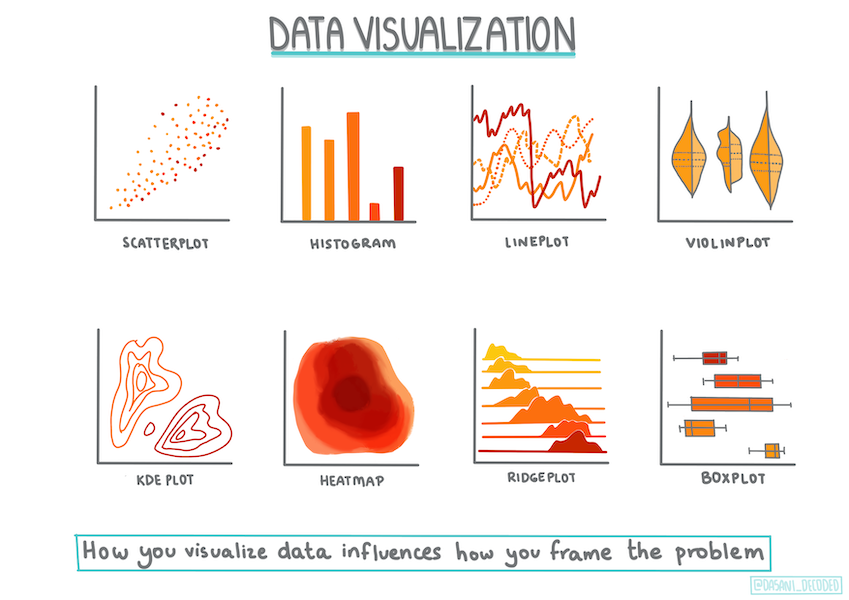
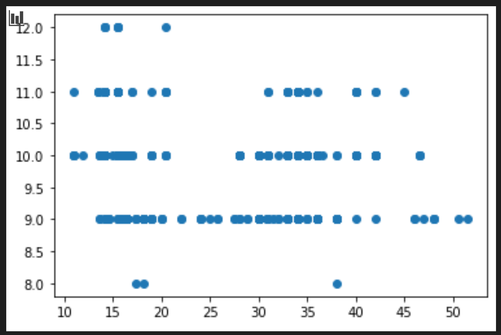

<!--
CO_OP_TRANSLATOR_METADATA:
{
  "original_hash": "a683e1fe430bb0d4a10b68f6ca15e0a6",
  "translation_date": "2025-08-29T13:06:51+00:00",
  "source_file": "2-Regression/2-Data/README.md",
  "language_code": "tl"
}
-->
# Gumawa ng regression model gamit ang Scikit-learn: ihanda at i-visualize ang data



Infographic ni [Dasani Madipalli](https://twitter.com/dasani_decoded)

## [Pre-lecture quiz](https://gray-sand-07a10f403.1.azurestaticapps.net/quiz/11/)

> ### [Ang araling ito ay available sa R!](../../../../2-Regression/2-Data/solution/R/lesson_2.html)

## Panimula

Ngayon na mayroon ka nang mga tool para simulan ang paggawa ng machine learning model gamit ang Scikit-learn, handa ka nang magtanong tungkol sa iyong data. Habang nagtatrabaho ka sa data at nag-aaplay ng mga solusyon sa ML, mahalagang maunawaan kung paano magtanong ng tamang tanong upang ma-unlock nang maayos ang potensyal ng iyong dataset.

Sa araling ito, matututuhan mo:

- Paano ihanda ang iyong data para sa paggawa ng modelo.
- Paano gamitin ang Matplotlib para sa data visualization.

## Pagtatanong ng tamang tanong sa iyong data

Ang tanong na nais mong masagot ang magpapasiya kung anong uri ng mga algorithm ng ML ang iyong gagamitin. At ang kalidad ng sagot na makukuha mo ay lubos na nakadepende sa kalikasan ng iyong data.

Tingnan ang [data](https://github.com/microsoft/ML-For-Beginners/blob/main/2-Regression/data/US-pumpkins.csv) na ibinigay para sa araling ito. Maaari mong buksan ang .csv file na ito sa VS Code. Sa mabilisang pagtingin, makikita agad na may mga blangko at halo ng mga string at numerikong data. Mayroon ding kakaibang column na tinatawag na 'Package' kung saan ang data ay halo ng 'sacks', 'bins', at iba pang halaga. Sa katunayan, medyo magulo ang data.

[](https://youtu.be/5qGjczWTrDQ "ML para sa mga baguhan - Paano Suriin at Linisin ang Dataset")

> 🎥 I-click ang larawan sa itaas para sa isang maikling video tungkol sa paghahanda ng data para sa araling ito.

Sa katunayan, bihira kang makakuha ng dataset na ganap na handa nang gamitin para gumawa ng ML model. Sa araling ito, matututuhan mo kung paano ihanda ang raw dataset gamit ang mga karaniwang Python library. Matututuhan mo rin ang iba't ibang teknik sa pag-visualize ng data.

## Case study: 'ang merkado ng kalabasa'

Sa folder na ito, makakakita ka ng isang .csv file sa root `data` folder na tinatawag na [US-pumpkins.csv](https://github.com/microsoft/ML-For-Beginners/blob/main/2-Regression/data/US-pumpkins.csv) na naglalaman ng 1757 linya ng data tungkol sa merkado ng kalabasa, na pinagsama-sama ayon sa lungsod. Ang data na ito ay raw data na kinuha mula sa [Specialty Crops Terminal Markets Standard Reports](https://www.marketnews.usda.gov/mnp/fv-report-config-step1?type=termPrice) na ipinamamahagi ng Kagawaran ng Agrikultura ng Estados Unidos.

### Paghahanda ng data

Ang data na ito ay nasa pampublikong domain. Maaari itong i-download sa maraming magkakahiwalay na file, bawat lungsod, mula sa website ng USDA. Upang maiwasan ang masyadong maraming magkakahiwalay na file, pinagsama-sama namin ang lahat ng data ng lungsod sa isang spreadsheet, kaya't medyo _naihanda_ na namin ang data. Ngayon, tingnan natin nang mas malapitan ang data.

### Ang data ng kalabasa - mga paunang konklusyon

Ano ang napapansin mo tungkol sa data na ito? Napansin mo na may halo ng mga string, numero, blangko, at kakaibang halaga na kailangan mong unawain.

Anong tanong ang maaari mong itanong sa data na ito gamit ang isang Regression technique? Paano ang "I-predict ang presyo ng kalabasa na ibinebenta sa isang partikular na buwan". Sa muling pagtingin sa data, may ilang pagbabago kang kailangang gawin upang makabuo ng tamang istruktura ng data para sa gawain.

## Ehersisyo - suriin ang data ng kalabasa

Gamitin natin ang [Pandas](https://pandas.pydata.org/), (ang pangalan ay nangangahulugang `Python Data Analysis`) isang tool na napaka-kapaki-pakinabang para sa paghubog ng data, upang suriin at ihanda ang data ng kalabasa.

### Una, suriin ang mga nawawalang petsa

Kailangan mo munang gumawa ng mga hakbang upang suriin ang mga nawawalang petsa:

1. I-convert ang mga petsa sa format ng buwan (ang mga ito ay mga petsa ng US, kaya ang format ay `MM/DD/YYYY`).
2. I-extract ang buwan sa isang bagong column.

Buksan ang _notebook.ipynb_ file sa Visual Studio Code at i-import ang spreadsheet sa isang bagong Pandas dataframe.

1. Gamitin ang `head()` function upang makita ang unang limang hilera.

    ```python
    import pandas as pd
    pumpkins = pd.read_csv('../data/US-pumpkins.csv')
    pumpkins.head()
    ```

    ✅ Anong function ang gagamitin mo upang makita ang huling limang hilera?

1. Suriin kung may nawawalang data sa kasalukuyang dataframe:

    ```python
    pumpkins.isnull().sum()
    ```

    May nawawalang data, ngunit maaaring hindi ito mahalaga para sa gawain.

1. Upang gawing mas madaling gamitin ang iyong dataframe, piliin lamang ang mga column na kailangan mo, gamit ang `loc` function na nag-eextract mula sa orihinal na dataframe ng isang grupo ng mga hilera (ipinasa bilang unang parameter) at mga column (ipinasa bilang pangalawang parameter). Ang expression na `:` sa kaso sa ibaba ay nangangahulugang "lahat ng hilera".

    ```python
    columns_to_select = ['Package', 'Low Price', 'High Price', 'Date']
    pumpkins = pumpkins.loc[:, columns_to_select]
    ```

### Pangalawa, tukuyin ang average na presyo ng kalabasa

Pag-isipan kung paano tukuyin ang average na presyo ng kalabasa sa isang partikular na buwan. Anong mga column ang pipiliin mo para sa gawaing ito? Pahiwatig: kakailanganin mo ang 3 column.

Solusyon: kunin ang average ng mga column na `Low Price` at `High Price` upang punan ang bagong column na Price, at i-convert ang column na Date upang ipakita lamang ang buwan. Sa kabutihang palad, ayon sa pagsusuri sa itaas, walang nawawalang data para sa mga petsa o presyo.

1. Upang kalkulahin ang average, idagdag ang sumusunod na code:

    ```python
    price = (pumpkins['Low Price'] + pumpkins['High Price']) / 2

    month = pd.DatetimeIndex(pumpkins['Date']).month

    ```

   ✅ Malaya kang mag-print ng anumang data na nais mong suriin gamit ang `print(month)`.

2. Ngayon, kopyahin ang iyong na-convert na data sa isang bagong Pandas dataframe:

    ```python
    new_pumpkins = pd.DataFrame({'Month': month, 'Package': pumpkins['Package'], 'Low Price': pumpkins['Low Price'],'High Price': pumpkins['High Price'], 'Price': price})
    ```

    Ang pag-print ng iyong dataframe ay magpapakita sa iyo ng isang malinis at maayos na dataset kung saan maaari kang bumuo ng iyong bagong regression model.

### Pero teka! May kakaiba dito

Kung titingnan mo ang column na `Package`, ang mga kalabasa ay ibinebenta sa maraming iba't ibang mga pagsasaayos. Ang ilan ay ibinebenta sa '1 1/9 bushel' na sukat, ang ilan sa '1/2 bushel' na sukat, ang ilan bawat kalabasa, ang ilan bawat libra, at ang ilan sa malalaking kahon na may iba't ibang lapad.

> Mukhang napakahirap timbangin nang pare-pareho ang mga kalabasa

Sa pagsisiyasat sa orihinal na data, kawili-wiling makita na ang anumang may `Unit of Sale` na katumbas ng 'EACH' o 'PER BIN' ay mayroon ding uri ng `Package` na bawat pulgada, bawat bin, o 'bawat isa'. Mukhang napakahirap timbangin nang pare-pareho ang mga kalabasa, kaya't i-filter natin ang mga ito sa pamamagitan ng pagpili lamang ng mga kalabasa na may string na 'bushel' sa kanilang column na `Package`.

1. Magdagdag ng filter sa itaas ng file, sa ilalim ng paunang pag-import ng .csv:

    ```python
    pumpkins = pumpkins[pumpkins['Package'].str.contains('bushel', case=True, regex=True)]
    ```

    Kung i-print mo ang data ngayon, makikita mo na nakakakuha ka lamang ng humigit-kumulang 415 na hilera ng data na naglalaman ng mga kalabasa ayon sa bushel.

### Pero teka! May isa pang bagay na kailangang gawin

Napansin mo ba na ang dami ng bushel ay nag-iiba bawat hilera? Kailangan mong gawing normal ang pagpepresyo upang maipakita mo ang pagpepresyo bawat bushel, kaya't gumawa ng ilang kalkulasyon upang gawing pare-pareho ito.

1. Idagdag ang mga linyang ito pagkatapos ng block na lumilikha ng bagong dataframe ng pumpkins:

    ```python
    new_pumpkins.loc[new_pumpkins['Package'].str.contains('1 1/9'), 'Price'] = price/(1 + 1/9)

    new_pumpkins.loc[new_pumpkins['Package'].str.contains('1/2'), 'Price'] = price/(1/2)
    ```

✅ Ayon sa [The Spruce Eats](https://www.thespruceeats.com/how-much-is-a-bushel-1389308), ang timbang ng isang bushel ay depende sa uri ng produkto, dahil ito ay isang sukat ng dami. "Ang isang bushel ng mga kamatis, halimbawa, ay dapat timbangin ng 56 pounds... Ang mga dahon at gulay ay kumukuha ng mas maraming espasyo na may mas kaunting timbang, kaya't ang isang bushel ng spinach ay 20 pounds lamang." Medyo komplikado ito! Huwag na nating alalahanin ang paggawa ng conversion mula bushel patungong pound, at sa halip ay magpresyo ayon sa bushel. Ang lahat ng pag-aaral na ito tungkol sa mga bushel ng kalabasa, gayunpaman, ay nagpapakita kung gaano kahalaga ang maunawaan ang kalikasan ng iyong data!

Ngayon, maaari mong suriin ang pagpepresyo bawat unit batay sa kanilang sukat ng bushel. Kung i-print mo ang data muli, makikita mo kung paano ito na-standardize.

✅ Napansin mo ba na ang mga kalabasa na ibinebenta bawat kalahating bushel ay napakamahal? Kaya mo bang alamin kung bakit? Pahiwatig: ang maliliit na kalabasa ay mas mahal kaysa sa malalaki, marahil dahil mas marami ang mga ito bawat bushel, dahil sa espasyong hindi nagagamit na kinuha ng isang malaking hollow pie pumpkin.

## Mga Estratehiya sa Visualization

Bahagi ng tungkulin ng data scientist ang ipakita ang kalidad at kalikasan ng data na kanilang pinagtatrabahuhan. Upang magawa ito, madalas silang gumagawa ng mga kawili-wiling visualization, o mga plot, graph, at chart, na nagpapakita ng iba't ibang aspeto ng data. Sa ganitong paraan, nagagawa nilang ipakita nang biswal ang mga relasyon at puwang na mahirap matuklasan.

[](https://youtu.be/SbUkxH6IJo0 "ML para sa mga baguhan - Paano I-visualize ang Data gamit ang Matplotlib")

> 🎥 I-click ang larawan sa itaas para sa isang maikling video tungkol sa pag-visualize ng data para sa araling ito.

Ang mga visualization ay maaari ring makatulong sa pagtukoy ng pinakaangkop na teknik ng machine learning para sa data. Ang isang scatterplot na tila sumusunod sa isang linya, halimbawa, ay nagpapahiwatig na ang data ay isang mahusay na kandidato para sa isang linear regression exercise.

Ang isang data visualization library na mahusay gumagana sa Jupyter notebooks ay ang [Matplotlib](https://matplotlib.org/) (na nakita mo rin sa nakaraang aralin).

> Magkaroon ng higit pang karanasan sa data visualization sa [mga tutorial na ito](https://docs.microsoft.com/learn/modules/explore-analyze-data-with-python?WT.mc_id=academic-77952-leestott).

## Ehersisyo - mag-eksperimento gamit ang Matplotlib

Subukang gumawa ng ilang mga pangunahing plot upang ipakita ang bagong dataframe na iyong nilikha. Ano ang ipapakita ng isang pangunahing line plot?

1. I-import ang Matplotlib sa itaas ng file, sa ilalim ng Pandas import:

    ```python
    import matplotlib.pyplot as plt
    ```

1. I-rerun ang buong notebook upang ma-refresh.
1. Sa ibaba ng notebook, magdagdag ng cell upang i-plot ang data bilang isang kahon:

    ```python
    price = new_pumpkins.Price
    month = new_pumpkins.Month
    plt.scatter(price, month)
    plt.show()
    ```

    

    Kapaki-pakinabang ba ang plot na ito? Mayroon bang anumang bagay tungkol dito na nakakagulat sa iyo?

    Hindi ito partikular na kapaki-pakinabang dahil ang ipinapakita lamang nito ay ang pagkalat ng mga puntos sa isang partikular na buwan.

### Gawing kapaki-pakinabang

Upang makagawa ng mga chart na nagpapakita ng kapaki-pakinabang na data, karaniwan mong kailangang i-group ang data sa isang paraan. Subukang gumawa ng isang plot kung saan ang y axis ay nagpapakita ng mga buwan at ang data ay nagpapakita ng distribusyon ng data.

1. Magdagdag ng cell upang lumikha ng isang grouped bar chart:

    ```python
    new_pumpkins.groupby(['Month'])['Price'].mean().plot(kind='bar')
    plt.ylabel("Pumpkin Price")
    ```

    

    Ito ay isang mas kapaki-pakinabang na data visualization! Mukhang ipinapakita nito na ang pinakamataas na presyo para sa mga kalabasa ay nangyayari sa Setyembre at Oktubre. Tugma ba ito sa iyong inaasahan? Bakit o bakit hindi?

---

## 🚀Hamunin

Galugarin ang iba't ibang uri ng visualization na inaalok ng Matplotlib. Alin sa mga uri ang pinakaangkop para sa mga regression problem?

## [Post-lecture quiz](https://gray-sand-07a10f403.1.azurestaticapps.net/quiz/12/)

## Review at Pag-aaral sa Sarili

Tingnan ang maraming paraan upang i-visualize ang data. Gumawa ng listahan ng iba't ibang mga library na magagamit at tandaan kung alin ang pinakamahusay para sa mga partikular na uri ng gawain, halimbawa 2D visualizations kumpara sa 3D visualizations. Ano ang natuklasan mo?

## Takdang-Aralin

[Paggalugad sa visualization](assignment.md)

---

**Paunawa**:  
Ang dokumentong ito ay isinalin gamit ang AI translation service na [Co-op Translator](https://github.com/Azure/co-op-translator). Bagama't sinisikap naming maging tumpak, pakitandaan na ang mga awtomatikong pagsasalin ay maaaring maglaman ng mga pagkakamali o hindi pagkakatugma. Ang orihinal na dokumento sa orihinal nitong wika ang dapat ituring na opisyal na sanggunian. Para sa mahalagang impormasyon, inirerekomenda ang propesyonal na pagsasalin ng tao. Hindi kami mananagot sa anumang hindi pagkakaunawaan o maling interpretasyon na dulot ng paggamit ng pagsasaling ito.