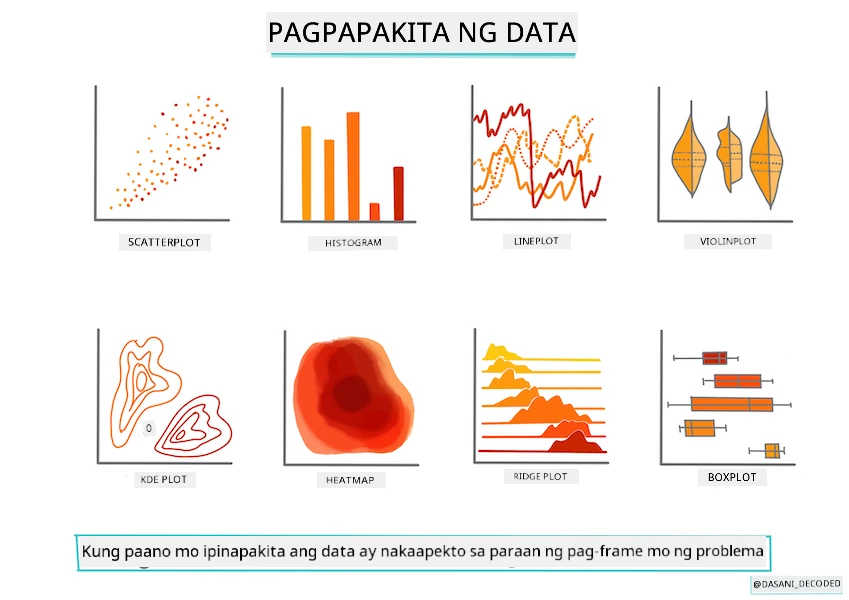
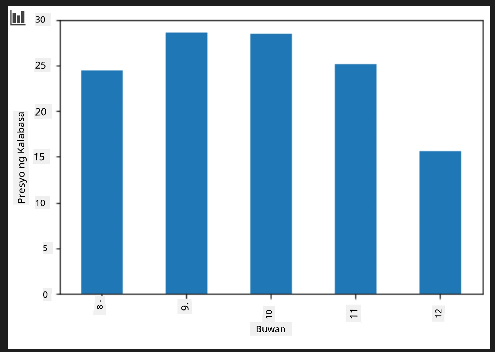
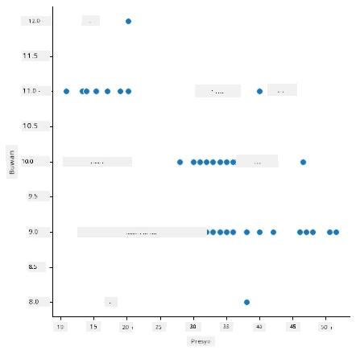
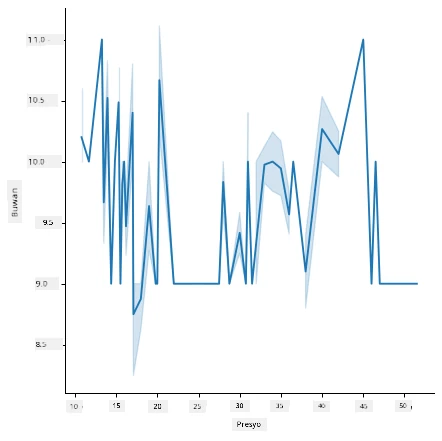
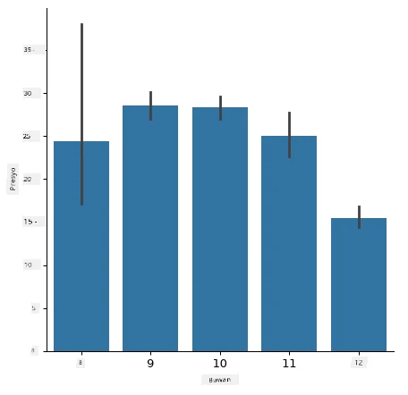
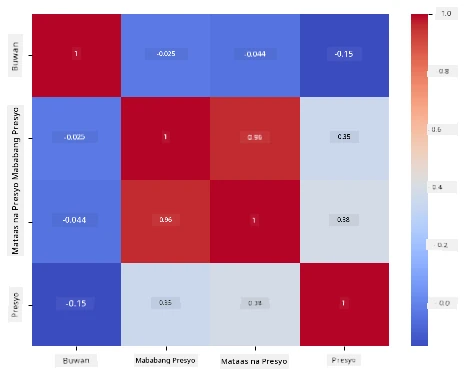

# Gumawa ng regression model gamit ang Scikit-learn: ihanda at ipakita ang data



Infographic ni [Dasani Madipalli](https://twitter.com/dasani_decoded)

## [Pre-lecture quiz](https://ff-quizzes.netlify.app/en/ml/)

> ### [Available ang leksyong ito sa R!](../../../../2-Regression/2-Data/solution/R/lesson_2.html)

## Panimula

Ngayon na naka-setup ka na gamit ang mga kailangang tools para simulan ang paggawa ng machine learning model gamit ang Scikit-learn, handa ka nang magtanong tungkol sa iyong data. Habang nagtatrabaho ka sa data at nag-aapply ng ML solutions, napakahalaga na maintindihan kung paano magtanong nang tama upang ma-unlock ng maayos ang potensyal ng iyong dataset.

Sa leksyong ito, matututuhan mo ang:

- Paano ihanda ang iyong data para sa paggawa ng modelo.
- Paano gamitin ang Matplotlib para sa pag-visualize ng data.
- Paano gamitin ang Seaborn para sa mas masining na pag-visualize ng data.

## Pagtatanong ng tamang tanong sa iyong data

Ang tanong na kailangang masagot ay magtatakda kung anong klase ng ML algorithms ang gagamitin mo. At ang kalidad ng sagot na matatanggap mo ay lubhang naka-depende sa kalikasan ng iyong data.

Tingnan ang [data](https://github.com/microsoft/ML-For-Beginners/blob/main/2-Regression/data/US-pumpkins.csv) na ibinigay para sa leksyong ito. Maaari mong buksan ang .csv file na ito sa VS Code. Sa mabilis na pagtingin, makikita mong may mga blanks at halo ng string at numeric na data. Mayroon ding kakaibang column na tinatawag na 'Package' kung saan ang data ay halo ng 'sacks', 'bins' at iba pang mga halaga. Ang data, sa katunayan, ay medyo magulo.

[](https://youtu.be/5qGjczWTrDQ "ML para sa mga nagsisimula - Paano Mag-Analyze at Mag-Clean ng Dataset")

> 🎥 I-click ang larawan sa itaas para sa isang maikling video na nagpapakita ng paghahanda ng data para sa leksyong ito.

Sa katunayan, hindi karaniwan na agad mong makuha ang dataset na handa nang gamitin para gumawa ng ML model. Sa leksyong ito, matututuhan mo kung paano maghanda ng raw dataset gamit ang mga standard Python libraries. Matututuhan mo rin ang iba't ibang teknik para i-visualize ang data.

## Case study: 'ang pamilihan ng kalabasa'

Sa folder na ito makikita mo ang isang .csv file sa root `data` folder na tinatawag na [US-pumpkins.csv](https://github.com/microsoft/ML-For-Beginners/blob/main/2-Regression/data/US-pumpkins.csv) na may 1757 na linya ng data tungkol sa pamilihan ng kalabasa, na nakaayos sa mga pangkat ayon sa lungsod. Ito ay raw data na kinuha mula sa [Specialty Crops Terminal Markets Standard Reports](https://www.marketnews.usda.gov/mnp/fv-report-config-step1?type=termPrice) na ipinamamahagi ng United States Department of Agriculture.

### Paghahanda ng data

Ang data na ito ay nasa public domain. Maaari itong i-download sa maraming hiwalay na files, bawat lungsod, mula sa website ng USDA. Upang maiwasan ang sobrang dami ng hiwalay na files, pinag-isa namin ang lahat ng data ng lungsod sa isang spreadsheet, kaya medyo _naihanda_ na ang data. Susunod, tingnan natin nang mabuti ang data.

### Ang data ng kalabasa - mga unang konklusyon

Ano ang napansin mo tungkol sa data na ito? Nakita mo na may halo ng string, numero, blanks at kakaibang mga halaga na kailangan mong maintindihan.

Anong tanong ang maaari mong itanong sa data na ito gamit ang regression technique? Paano ang "I-predict ang presyo ng kalabasa na binebenta sa isang takdang buwan". Sa muling pagtingin sa data, may ilang pagbabago kang kailangang gawin upang malikha ang tamang istraktura ng data para sa gawain.
## Ehersisyo - suriin ang data ng kalabasa

Gamitin natin ang [Pandas](https://pandas.pydata.org/), (ang pangalan ay nangangahulugang `Python Data Analysis`) isang tool na napakabisa para sa paghulma ng data, upang suriin at ihanda ang data ng kalabasa.

### Una, suriin ang mga nawawalang petsa

Kailangan mo munang gumawa ng mga hakbang para suriin ang mga nawawalang petsa:

1. I-convert ang mga petsa sa format ng buwan (ito ay mga petsa sa US, kaya ang format ay `MM/DD/YYYY`).
2. I-extract ang buwan sa isang bagong column.

Buksan ang _notebook.ipynb_ file sa Visual Studio Code at i-import ang spreadsheet sa isang bagong Pandas dataframe.

1. Gamitin ang `head()` function upang makita ang unang limang hanay.

    ```python
    import pandas as pd
    pumpkins = pd.read_csv('../data/US-pumpkins.csv')
    pumpkins.head()
    ```

    ✅ Anong function ang gagamitin mo para makita ang huling limang hanay?

1. Suriin kung may nawawalang data sa kasalukuyang dataframe:

    ```python
    pumpkins.isnull().sum()
    ```

    May nawawalang data, pero maaaring hindi ito mahalaga para sa task na ito.

1. Para gawing mas madali ang paggamit sa iyong dataframe, piliin lamang ang mga columns na kailangan mo, gamit ang `loc` function na kumukuha mula sa orihinal na dataframe ng grupo ng mga row (bilang unang parameter) at mga column (bilang pangalawang parameter). Ang expression na `:` sa ibaba ay nangangahulugang "lahat ng rows".

    ```python
    columns_to_select = ['Package', 'Low Price', 'High Price', 'Date']
    pumpkins = pumpkins.loc[:, columns_to_select]
    ```

### Pangalawa, tukuyin ang average na presyo ng kalabasa

Isipin kung paano matutukoy ang average na presyo ng kalabasa sa isang tiyak na buwan. Anong mga column ang pipiliin mo para sa gawain? Pahiwatig: kailangan mo ng 3 column.

Solusyon: kunin ang average ng `Low Price` at `High Price` columns upang mapunan ang bagong Price column, at i-convert ang Date column upang ipakita lamang ang buwan. Sa kabutihang-palad, ayon sa pagsusuri sa itaas, walang nawawalang data para sa mga petsa o presyo.

1. Para kalkulahin ang average, idagdag ang sumusunod na code:

    ```python
    price = (pumpkins['Low Price'] + pumpkins['High Price']) / 2

    month = pd.DatetimeIndex(pumpkins['Date']).month

    ```

   ✅ Malaya kang mag-print ng anumang data na gusto mong suriin gamit ang `print(month)`.

2. Ngayon, kopyahin ang iyong naka-convert na data sa isang bagong Pandas dataframe:

    ```python
    new_pumpkins = pd.DataFrame({'Month': month, 'Package': pumpkins['Package'], 'Low Price': pumpkins['Low Price'],'High Price': pumpkins['High Price'], 'Price': price})
    ```

    Ipinapakita ng pagpi-print ng iyong dataframe ang isang malinis at maayos na dataset na maaari mong gamitin para buuin ang bagong regression model.

### Pero teka! May kakaiba dito

Kung titingnan mo ang `Package` column, ang mga kalabasa ay binebenta sa iba't ibang paraan. Ang ilan ay binebenta sa '1 1/9 bushel' sukat, ang ilan sa '1/2 bushel', ilan bawat kalabasa, ilan bawat pound, at ilan sa malalaking kahon na may iba't ibang lapad.

> Mahirap timbangin nang konsistent ang mga kalabasa

Sa pagsusuri ng orihinal na data, kawili-wili na anumang may `Unit of Sale` na 'EACH' o 'PER BIN' ay mayroon ding uri ng `Package` na per inch, per bin, o 'each'. Mahirap timbangin nang konsistent ang mga kalabasa, kaya't salain natin ang data sa pamamagitan ng pagpili lamang ng mga kalabasa na may string na 'bushel' sa kanilang `Package` column.

1. Magdagdag ng filter sa itaas ng file, sa ilalim ng paunang pag-import ng .csv:

    ```python
    pumpkins = pumpkins[pumpkins['Package'].str.contains('bushel', case=True, regex=True)]
    ```

    Kung ipi-print mo ang data ngayon, makikita mo na nakuha mo lamang ang mga 415 na linya ng data na naglalaman ng mga kalabasa sa bushel.

### Pero teka! May isa pang kailangang gawin

Napansin mo ba na nag-iiba ang dami ng bushel sa bawat hanay? Kailangan mong i-normalize ang pagpe-presyo upang ipakita ang presyo kada bushel, kaya gumawa ng kaunting math para i-standardize ito.

1. Idagdag ang mga linya na ito pagkatapos ng block na lumilikha ng bagong_pumpkins dataframe:

    ```python
    new_pumpkins.loc[new_pumpkins['Package'].str.contains('1 1/9'), 'Price'] = price/(1 + 1/9)

    new_pumpkins.loc[new_pumpkins['Package'].str.contains('1/2'), 'Price'] = price/(1/2)
    ```

✅ Ayon sa [The Spruce Eats](https://www.thespruceeats.com/how-much-is-a-bushel-1389308), ang bigat ng isang bushel ay depende sa uri ng produkto, dahil ito ay pagsukat ng volume. "Ang isang bushel ng kamatis, halimbawa, ay dapat tumimbang ng 56 pounds... Ang mga dahon at gulay ay kumukuha ng mas maraming espasyo ngunit mababa ang timbang, kaya ang isang bushel ng spinach ay 20 pounds lamang." Medyo kumplikado lahat ito! Huwag na nating alalahanin ang conversion ng bushel-pounds, at tumuon na lamang sa pagpepresyo sa bushel. Ang pag-aaral ng bushel ng kalabasa na ito ay nagpapakita kung gaano kahalaga ang maintindihan ang kalikasan ng iyong data!

Ngayon, maaari mo nang suriin ang presyo kada yunit batay sa kanilang sukat ng bushel. Kung ipi-print mo muli ang data, makikita mo kung paano ito naging standardized.

✅ Napansin mo ba na ang mga kalabasa na binebenta ng half-bushel ay napakamahal? Kaya mo bang hulaan kung bakit? Pahiwatig: Ang maliliit na kalabasa ay mas mahal kumpara sa malalaki, marahil dahil mas marami sila kada bushel, dahil sa puwang na hindi nagagamit na sinasakop ng isang malaking lukbutan na kalabasa.

## Estratehiya sa Pag-visualize

Bahagi ng tungkulin ng data scientist ay ipakita ang kalidad at kalikasan ng data na kanilang pinagtatrabahuhan. Para dito, madalas silang gumagawa ng mga interesanteng visualizations, o mga plots, graphs, at charts, na nagpapakita ng iba't ibang aspeto ng data. Sa ganitong paraan, naipapakita nila sa visual na paraan ang mga relasyon at mga puwang na mahirap makita nang iba.

[](https://youtu.be/SbUkxH6IJo0 "ML para sa mga nagsisimula - Paano Mag-Visualize ng Data gamit ang Matplotlib")

> 🎥 I-click ang larawan sa itaas para sa maikling video na nagpapakita ng pag-visualize ng data para sa leksyong ito.

Makakatulong din ang mga visualization para matukoy ang pinaka-angkop na machine learning technique para sa data. Ang isang scatterplot na tila sumusunod sa isang linya, halimbawa, ay nagpapahiwatig na ang data ay magandang kandidato para sa linear regression exercise.

Isang data visualization library na mahusay gamitin sa Jupyter notebooks ay ang [Matplotlib](https://matplotlib.org/) (na nakita mo rin sa nakaraang leksyon).

> Magkaroon ng karagdagang karanasan sa data visualization sa [mga tutorial na ito](https://docs.microsoft.com/learn/modules/explore-analyze-data-with-python?WT.mc_id=academic-77952-leestott).

## Ehersisyo - subukan ang Matplotlib

Subukang gumawa ng mga pangunahing plots upang ipakita ang bagong dataframe na kakagawa mo lang. Ano kaya ang ipapakita ng isang basic line plot?

1. I-import ang Matplotlib sa itaas ng file, sa ilalim ng import ng Pandas:

    ```python
    import matplotlib.pyplot as plt
    ```

1. I-run muli ang buong notebook para ma-refresh.
1. Sa ibaba ng notebook, magdagdag ng cell para i-plot ang data bilang isang box:

    ```python
    price = new_pumpkins.Price
    month = new_pumpkins.Month
    plt.scatter(price, month)
    plt.show()
    ```

    

    Kapaki-pakinabang ba ang plot na ito? May nakakagulat ba dito sa iyo?

    Hindi ito gaanong kapaki-pakinabang dahil ipinapakita lamang nito ang iyong data bilang isang kalat ng mga puntos sa isang takdang buwan.

### Gawing kapaki-pakinabang

Para maging kapaki-pakinabang ang mga chart, kadalasan kailangan mong i-groups ang data. Subukan nating gumawa ng plot kung saan ang y axis ay nagpapakita ng mga buwan at ang data ay nagpapakita ng distribusyon ng data.

1. Magdagdag ng cell para gumawa ng grouped bar chart:

    ```python
    new_pumpkins.groupby(['Month'])['Price'].mean().plot(kind='bar')
    plt.ylabel("Pumpkin Price")
    ```

    

    Mas kapaki-pakinabang na data visualization ito! Tila nagpapahiwatig na ang pinakamataas na presyo ng kalabasa ay nangyayari sa Setyembre at Oktubre. Tumutugma ba ito sa iyong inaasahan? Bakit o bakit hindi?

## Ehersisyo - subukan ang Seaborn

Malakas ang Matplotlib, pero nangangailangan ng maraming code para makagawa ng isang pulidong chart. Ang [Seaborn](https://seaborn.pydata.org/) ay isang library na ginawa _sa ibabaw ng_ Matplotlib na disenyo para sa statistical data visualization. Gumagana ito nang direkta sa Pandas dataframes, nag-aapply ng magagandang default styles, at nagbibigay-daan sa paggawa ng mga nakaka-inform na plot gamit ang mas konting code. Dahil nagbabalik ang Seaborn ng mga Matplotlib objects, magagamit mo pa rin ang lahat ng alam mo tungkol sa Matplotlib para i-fine-tune ang resulta.

> Kung wala ka pang Seaborn, i-install ito gamit ang `pip install seaborn`.

1. I-import ang Seaborn sa itaas ng notebook, sa ilalim ng ibang mga import. Karaniwan itong ino-import bilang `sns`:

    ```python
    import seaborn as sns
    ```

### Scatter plots para ipakita ang mga relasyon

Malaking bahagi ng pag-explore ng data bago gumawa ng modelo ay ang paghahanap ng _relasyon_ sa pagitan ng mga variable. Ang [scatter plot](https://en.wikipedia.org/wiki/Scatter_plot) ay isa sa pinakamahusay na mga gamit dito: kung ang mga puntos ay tila sumusunod sa isang linya, maaaring correlated ang dalawang variables, na magandang palatandaan na maaaring gumana ang linear regression model.

1. Gawing muli ang price-to-month scatter plot mula noon, gamit ang Seaborn's [`relplot()`](https://seaborn.pydata.org/generated/seaborn.relplot.html) (relational plot), na direktang gumagamit ng iyong mga column sa dataframe:

    ```python
    sns.relplot(x="Price", y="Month", data=new_pumpkins)
    ```

    

    Pansinin kung paano mo ipinapasa ang _mga pangalan ng column_ at ang dataframe, at ang Seaborn ang bahala sa mga labels ng axis.

2. Maaari kang lumipat sa line plot sa pamamagitan ng paglalagay ng `kind="line"`. Nagdodrawing pa ang Seaborn ng shaded band na nagpapakita ng confidence interval sa paligid ng linya:

    ```python
    sns.relplot(x="Price", y="Month", kind="line", data=new_pumpkins)
    ```

    

    Medyo maingay ang data na ito kaya hindi ito ang pinakamalinaw na pagpipilian — pero ipinapakita nito kung gaano kadaling palitan ang uri ng chart sa Seaborn.

### Bar charts para ipakita ang distribusyon


Kanina ay ikaw ang nag-grupo ng data nang mano-mano upang gumawa ng bar chart gamit ang Matplotlib. Ang [`catplot()`](https://seaborn.pydata.org/generated/seaborn.catplot.html) (categorical plot) ng Seaborn ay kayang gawin ang pag-grupo at pag-aggregate para sa iyo. Sa default, `kind="bar"` nagpapakita ng mean ng bawat kategorya kasama ang itim na linya na nagpapahiwatig ng confidence interval.

1. Gumawa ng bar chart ng average na presyo kada buwan:

    ```python
    sns.catplot(x="Month", y="Price", data=new_pumpkins, kind="bar")
    ```

    

    Pinapatunayan nito ang nakita mo gamit ang Matplotlib — tumataas ang presyo mga Setyembre at Oktubre — ngunit visual din ng Seaborn kung gaano kalaki ang _pagkakaiba_ ng presyo sa bawat buwan.

### Heatmaps upang ipakita ang mga korelasyon

Ang scatter plots ay naghahambing ng dalawang variable sa isang pagkakataon. Kapag mayroon kang maraming numeric na kolum, ang [heatmap](https://en.wikipedia.org/wiki/Heat_map) ay nagpapakita ng lakas ng ugnayan sa pagitan ng _lahat_ ng pares ng kolum ng sabay-sabay. Ito ay isang karaniwang paraan upang makita kung aling mga feature ang pinaka-kaugnay bago pumili kung ano ang ipapakain sa modelo (at ang parehong uri ng tsart ay ginagamit din upang ipakita ang confusion matrices sa classification).

1. Gumawa ng correlation matrix gamit ang Pandas, pagkatapos iguhit ito gamit ang [`heatmap()`](https://seaborn.pydata.org/generated/seaborn.heatmap.html) ng Seaborn. Ang opsyong `annot=True` ay naglalagay ng mga halaga ng korelasyon sa bawat selda:

    ```python
    correlations = new_pumpkins[['Month', 'Low Price', 'High Price', 'Price']].corr()
    sns.heatmap(correlations, annot=True, cmap="coolwarm")
    ```

    

    Ang mga halagang malapit sa `1` (o `-1`) ay nangangahulugang malakas na _linear_ ang korelasyon ng mga kolum. Pansinin kung paano halos perpektong magkaugnay ang `Low Price` at `High Price`. Sa kabilang banda, ang `Month` ay nagpapakita lamang ng mahina na linear na korelasyon sa presyo — kahit na ipinakita ng bar chart sa itaas ang malinaw na pana-panahong pagtaas sa Setyembre at Oktubre. Isang mahalagang aral ito: ang correlation coefficient ay sumusukat lamang ng _diretsong-linya_ na ugnayan, kaya maaari nitong hindi makita ang mga pana-panahong o hindi linear na mga pattern. ✅ Bakit kapaki-pakinabang na tingnan ang heatmap *at* mga tsart tulad ng bar chart bago magpasya kung aling mga kolum ang gagamitin?

### Matplotlib o Seaborn?

Parehong kagiliw-giliw na malaman ang dalawang library:

- **Matplotlib** ay nagbibigay ng detalyadong kontrol sa bawat elemento ng tsart at ito ang pundasyon ng halos lahat ng iba pang Python plotting library.
- **Seaborn** ay nagbibigay ng mas mataas na antas ng mga function at magagandang default para sa mga estadistikal na tsart, direktang gumagana sa mga dataframe, at kadalasang mas mabilis para sa exploratory data analysis.

Karaniwang workflow ay gamitin ang Seaborn upang mabilis na siyasatin ang data, pagkatapos bumaba sa Matplotlib kapag kailangan ng pag-customize ng mga detalye.

---

## 🚀Hamunin

Siyasatin ang iba't ibang uri ng visualisasyon na inaalok ng Matplotlib at Seaborn. Alin sa mga uri ang pinakaangkop para sa mga problema sa regression?

## [Post-lecture quiz](https://ff-quizzes.netlify.app/en/ml/)

## Suriin at Pag-aralan Mag-isa

Tingnan ang maraming paraan ng pag-visualize ng data. Gumawa ng listahan ng iba't ibang library na available at tandaan kung alin ang pinakamahusay para sa ibat ibang uri ng mga gawain, halimbawa 2D visualizations vs. 3D visualizations. Ano ang iyong nadiskubre?

## Takdang-Aralin

[Paggalugad sa visualisasyon](assignment.md)

---

<!-- CO-OP TRANSLATOR DISCLAIMER START -->
**Pagtatanggi**:
Ang dokumentong ito ay isinalin gamit ang serbisyo ng AI translation na [Co-op Translator](https://github.com/Azure/co-op-translator). Bagama't nagsusumikap kami para sa katumpakan, pakatandaan na ang awtomatikong pagsasalin ay maaaring maglaman ng mga pagkakamali o hindi pagkakatugma. Ang orihinal na dokumento sa orihinal nitong wika ang dapat ituring na pangunahing sanggunian. Para sa mahahalagang impormasyon, inirerekomenda ang propesyonal na pagsasalin ng tao. Hindi kami mananagot sa anumang maling pagkakaintindi o maling interpretasyon na nagmula sa paggamit ng pagsasaling ito.
<!-- CO-OP TRANSLATOR DISCLAIMER END -->