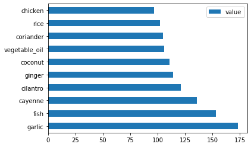
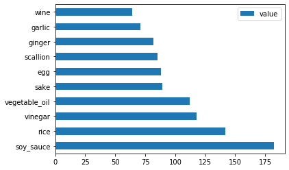
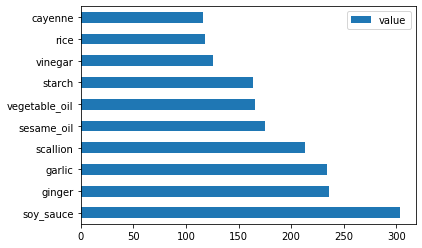
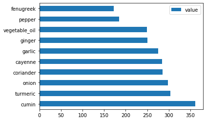

<!--
CO_OP_TRANSLATOR_METADATA:
{
  "original_hash": "76438ce4e5d48982d48f1b55c981caac",
  "translation_date": "2025-08-29T14:00:56+00:00",
  "source_file": "4-Classification/1-Introduction/README.md",
  "language_code": "tl"
}
-->
# Panimula sa klasipikasyon

Sa apat na araling ito, tatalakayin natin ang isa sa mga pangunahing aspeto ng klasikong machine learning - _klasipikasyon_. Gagamit tayo ng iba't ibang klasipikasyon na algorithm gamit ang isang dataset tungkol sa mga kahanga-hangang lutuin ng Asya at India. Sana'y gutom ka na!


> Ipagdiwang ang pan-Asian na mga lutuin sa mga araling ito! Larawan ni [Jen Looper](https://twitter.com/jenlooper)

Ang klasipikasyon ay isang anyo ng [supervised learning](https://wikipedia.org/wiki/Supervised_learning) na may pagkakatulad sa mga regression techniques. Kung ang machine learning ay tungkol sa paghula ng mga halaga o pangalan gamit ang mga dataset, ang klasipikasyon ay karaniwang nahahati sa dalawang grupo: _binary classification_ at _multiclass classification_.

[](https://youtu.be/eg8DJYwdMyg "Panimula sa klasipikasyon")

> 🎥 I-click ang larawan sa itaas para sa isang video: Ipinapakilala ni John Guttag ng MIT ang klasipikasyon

Tandaan:

- **Linear regression** ay tumulong sa iyo na hulaan ang relasyon sa pagitan ng mga variable at gumawa ng tumpak na prediksyon kung saan mahuhulog ang isang bagong datapoint kaugnay ng linya. Halimbawa, maaari mong hulaan _kung magkano ang presyo ng kalabasa sa Setyembre kumpara sa Disyembre_.
- **Logistic regression** ay tumulong sa iyo na tukuyin ang "binary categories": sa presyong ito, _ang kalabasa ba ay kulay kahel o hindi-kahel_?

Ang klasipikasyon ay gumagamit ng iba't ibang algorithm upang matukoy ang iba pang paraan ng pagtukoy ng label o klase ng isang datapoint. Gamitin natin ang dataset ng mga lutuin upang makita kung, sa pamamagitan ng pagmamasid sa isang grupo ng mga sangkap, maaari nating matukoy ang pinagmulan nitong lutuin.

## [Pre-lecture quiz](https://gray-sand-07a10f403.1.azurestaticapps.net/quiz/19/)

> ### [Ang araling ito ay available sa R!](../../../../4-Classification/1-Introduction/solution/R/lesson_10.html)

### Panimula

Ang klasipikasyon ay isa sa mga pangunahing gawain ng isang mananaliksik sa machine learning at data scientist. Mula sa simpleng klasipikasyon ng isang binary na halaga ("ang email bang ito ay spam o hindi?"), hanggang sa masalimuot na klasipikasyon ng imahe at segmentation gamit ang computer vision, laging kapaki-pakinabang na mauri ang data sa mga klase at makapagtanong tungkol dito.

Upang mailahad ang proseso sa mas siyentipikong paraan, ang iyong klasipikasyon na pamamaraan ay lumilikha ng isang predictive model na nagbibigay-daan sa iyong i-map ang relasyon sa pagitan ng mga input variable at output variable.


> Binary vs. multiclass na mga problema para sa mga klasipikasyon na algorithm. Infographic ni [Jen Looper](https://twitter.com/jenlooper)

Bago simulan ang proseso ng paglilinis ng ating data, pag-visualize nito, at paghahanda para sa ating mga ML na gawain, alamin muna natin ang iba't ibang paraan kung paano maaaring gamitin ang machine learning upang uriin ang data.

Hango mula sa [statistics](https://wikipedia.org/wiki/Statistical_classification), ang klasipikasyon gamit ang klasikong machine learning ay gumagamit ng mga feature, tulad ng `smoker`, `weight`, at `age` upang matukoy ang _posibilidad ng pagkakaroon ng X na sakit_. Bilang isang supervised learning technique na katulad ng mga regression exercises na ginawa mo kanina, ang iyong data ay may label at ginagamit ng mga ML algorithm ang mga label na ito upang uriin at hulaan ang mga klase (o 'features') ng isang dataset at i-assign ang mga ito sa isang grupo o resulta.

✅ Maglaan ng sandali upang isipin ang isang dataset tungkol sa mga lutuin. Ano ang maaaring masagot ng isang multiclass model? Ano ang maaaring masagot ng isang binary model? Paano kung gusto mong tukuyin kung ang isang partikular na lutuin ay malamang na gumagamit ng fenugreek? Paano kung gusto mong malaman kung, sa isang grocery bag na puno ng star anise, artichokes, cauliflower, at horseradish, makakagawa ka ng isang tipikal na Indian dish?

[](https://youtu.be/GuTeDbaNoEU "Crazy mystery baskets")

> 🎥 I-click ang larawan sa itaas para sa isang video. Ang buong premise ng palabas na 'Chopped' ay ang 'mystery basket' kung saan kailangang gumawa ang mga chef ng isang putahe mula sa random na pagpili ng mga sangkap. Siguradong makakatulong ang isang ML model!

## Hello 'classifier'

Ang tanong na nais nating itanong sa dataset ng mga lutuin ay isang **multiclass na tanong**, dahil mayroon tayong ilang potensyal na pambansang lutuin na maaaring pagpilian. Batay sa isang batch ng mga sangkap, aling mga klase ang babagay sa data?

Ang Scikit-learn ay nag-aalok ng iba't ibang algorithm na maaaring gamitin upang uriin ang data, depende sa uri ng problemang nais mong lutasin. Sa susunod na dalawang aralin, matututo ka tungkol sa ilan sa mga algorithm na ito.

## Ehersisyo - linisin at balansehin ang iyong data

Ang unang gawain bago simulan ang proyektong ito ay linisin at **balansehin** ang iyong data upang makakuha ng mas mahusay na resulta. Simulan sa blankong _notebook.ipynb_ file sa root ng folder na ito.

Ang unang kailangang i-install ay ang [imblearn](https://imbalanced-learn.org/stable/). Ito ay isang Scikit-learn package na magpapahintulot sa iyong mas mahusay na balansehin ang data (malalaman mo pa ang tungkol sa gawaing ito sa ilang sandali).

1. Upang i-install ang `imblearn`, patakbuhin ang `pip install`, tulad nito:

    ```python
    pip install imblearn
    ```

1. I-import ang mga package na kailangan mo upang ma-import ang iyong data at ma-visualize ito, at i-import din ang `SMOTE` mula sa `imblearn`.

    ```python
    import pandas as pd
    import matplotlib.pyplot as plt
    import matplotlib as mpl
    import numpy as np
    from imblearn.over_sampling import SMOTE
    ```

    Ngayon ay handa ka nang i-import ang data.

1. Ang susunod na gawain ay i-import ang data:

    ```python
    df  = pd.read_csv('../data/cuisines.csv')
    ```

   Ang paggamit ng `read_csv()` ay babasahin ang nilalaman ng csv file na _cusines.csv_ at ilalagay ito sa variable na `df`.

1. Tingnan ang hugis ng data:

    ```python
    df.head()
    ```

   Ang unang limang hilera ay ganito ang hitsura:

    ```output
    |     | Unnamed: 0 | cuisine | almond | angelica | anise | anise_seed | apple | apple_brandy | apricot | armagnac | ... | whiskey | white_bread | white_wine | whole_grain_wheat_flour | wine | wood | yam | yeast | yogurt | zucchini |
    | --- | ---------- | ------- | ------ | -------- | ----- | ---------- | ----- | ------------ | ------- | -------- | --- | ------- | ----------- | ---------- | ----------------------- | ---- | ---- | --- | ----- | ------ | -------- |
    | 0   | 65         | indian  | 0      | 0        | 0     | 0          | 0     | 0            | 0       | 0        | ... | 0       | 0           | 0          | 0                       | 0    | 0    | 0   | 0     | 0      | 0        |
    | 1   | 66         | indian  | 1      | 0        | 0     | 0          | 0     | 0            | 0       | 0        | ... | 0       | 0           | 0          | 0                       | 0    | 0    | 0   | 0     | 0      | 0        |
    | 2   | 67         | indian  | 0      | 0        | 0     | 0          | 0     | 0            | 0       | 0        | ... | 0       | 0           | 0          | 0                       | 0    | 0    | 0   | 0     | 0      | 0        |
    | 3   | 68         | indian  | 0      | 0        | 0     | 0          | 0     | 0            | 0       | 0        | ... | 0       | 0           | 0          | 0                       | 0    | 0    | 0   | 0     | 0      | 0        |
    | 4   | 69         | indian  | 0      | 0        | 0     | 0          | 0     | 0            | 0       | 0        | ... | 0       | 0           | 0          | 0                       | 0    | 0    | 0   | 0     | 1      | 0        |
    ```

1. Kumuha ng impormasyon tungkol sa data sa pamamagitan ng pagtawag sa `info()`:

    ```python
    df.info()
    ```

    Ang iyong output ay kahalintulad nito:

    ```output
    <class 'pandas.core.frame.DataFrame'>
    RangeIndex: 2448 entries, 0 to 2447
    Columns: 385 entries, Unnamed: 0 to zucchini
    dtypes: int64(384), object(1)
    memory usage: 7.2+ MB
    ```

## Ehersisyo - pag-aaral tungkol sa mga lutuin

Ngayon ay nagiging mas kawili-wili ang gawain. Tuklasin natin ang distribusyon ng data, bawat lutuin.

1. I-plot ang data bilang mga bar sa pamamagitan ng pagtawag sa `barh()`:

    ```python
    df.cuisine.value_counts().plot.barh()
    ```

    

    Mayroong limitadong bilang ng mga lutuin, ngunit ang distribusyon ng data ay hindi pantay. Maaari mo itong ayusin! Bago gawin ito, mag-explore pa ng kaunti.

1. Alamin kung gaano karaming data ang mayroon bawat lutuin at i-print ito:

    ```python
    thai_df = df[(df.cuisine == "thai")]
    japanese_df = df[(df.cuisine == "japanese")]
    chinese_df = df[(df.cuisine == "chinese")]
    indian_df = df[(df.cuisine == "indian")]
    korean_df = df[(df.cuisine == "korean")]
    
    print(f'thai df: {thai_df.shape}')
    print(f'japanese df: {japanese_df.shape}')
    print(f'chinese df: {chinese_df.shape}')
    print(f'indian df: {indian_df.shape}')
    print(f'korean df: {korean_df.shape}')
    ```

    Ang output ay ganito ang hitsura:

    ```output
    thai df: (289, 385)
    japanese df: (320, 385)
    chinese df: (442, 385)
    indian df: (598, 385)
    korean df: (799, 385)
    ```

## Pagtuklas ng mga sangkap

Ngayon ay maaari kang maghukay nang mas malalim sa data at alamin kung ano ang mga tipikal na sangkap bawat lutuin. Dapat mong linisin ang mga paulit-ulit na data na nagdudulot ng kalituhan sa pagitan ng mga lutuin, kaya't alamin natin ang problemang ito.

1. Gumawa ng isang function na `create_ingredient()` sa Python upang lumikha ng isang ingredient dataframe. Ang function na ito ay magsisimula sa pamamagitan ng pag-drop ng isang hindi kapaki-pakinabang na column at pag-aayos ng mga sangkap batay sa kanilang bilang:

    ```python
    def create_ingredient_df(df):
        ingredient_df = df.T.drop(['cuisine','Unnamed: 0']).sum(axis=1).to_frame('value')
        ingredient_df = ingredient_df[(ingredient_df.T != 0).any()]
        ingredient_df = ingredient_df.sort_values(by='value', ascending=False,
        inplace=False)
        return ingredient_df
    ```

   Ngayon ay maaari mong gamitin ang function na iyon upang makakuha ng ideya ng sampung pinakapopular na sangkap bawat lutuin.

1. Tawagin ang `create_ingredient()` at i-plot ito sa pamamagitan ng pagtawag sa `barh()`:

    ```python
    thai_ingredient_df = create_ingredient_df(thai_df)
    thai_ingredient_df.head(10).plot.barh()
    ```

    

1. Gawin ang pareho para sa data ng Japanese:

    ```python
    japanese_ingredient_df = create_ingredient_df(japanese_df)
    japanese_ingredient_df.head(10).plot.barh()
    ```

    

1. Ngayon para sa mga sangkap ng Chinese:

    ```python
    chinese_ingredient_df = create_ingredient_df(chinese_df)
    chinese_ingredient_df.head(10).plot.barh()
    ```

    

1. I-plot ang mga sangkap ng Indian:

    ```python
    indian_ingredient_df = create_ingredient_df(indian_df)
    indian_ingredient_df.head(10).plot.barh()
    ```

    

1. Sa wakas, i-plot ang mga sangkap ng Korean:

    ```python
    korean_ingredient_df = create_ingredient_df(korean_df)
    korean_ingredient_df.head(10).plot.barh()
    ```

    

1. Ngayon, i-drop ang mga pinakakaraniwang sangkap na nagdudulot ng kalituhan sa pagitan ng iba't ibang lutuin, sa pamamagitan ng pagtawag sa `drop()`:

   Lahat ay mahilig sa kanin, bawang, at luya!

    ```python
    feature_df= df.drop(['cuisine','Unnamed: 0','rice','garlic','ginger'], axis=1)
    labels_df = df.cuisine #.unique()
    feature_df.head()
    ```

## Balansehin ang dataset

Ngayon na nalinis mo na ang data, gamitin ang [SMOTE](https://imbalanced-learn.org/dev/references/generated/imblearn.over_sampling.SMOTE.html) - "Synthetic Minority Over-sampling Technique" - upang balansehin ito.

1. Tawagin ang `fit_resample()`, ang estratehiyang ito ay bumubuo ng mga bagong sample sa pamamagitan ng interpolation.

    ```python
    oversample = SMOTE()
    transformed_feature_df, transformed_label_df = oversample.fit_resample(feature_df, labels_df)
    ```

    Sa pamamagitan ng pagbabalanse ng iyong data, magkakaroon ka ng mas mahusay na resulta kapag inuri ito. Isipin ang isang binary classification. Kung karamihan ng iyong data ay isang klase, ang isang ML model ay mas madalas na huhulaan ang klaseng iyon, dahil lamang mas marami ang data para dito. Ang pagbabalanse ng data ay nag-aalis ng anumang pagkiling sa data at tumutulong na alisin ang imbalance na ito.

1. Ngayon ay maaari mong suriin ang bilang ng mga label bawat sangkap:

    ```python
    print(f'new label count: {transformed_label_df.value_counts()}')
    print(f'old label count: {df.cuisine.value_counts()}')
    ```

    Ang iyong output ay ganito ang hitsura:

    ```output
    new label count: korean      799
    chinese     799
    indian      799
    japanese    799
    thai        799
    Name: cuisine, dtype: int64
    old label count: korean      799
    indian      598
    chinese     442
    japanese    320
    thai        289
    Name: cuisine, dtype: int64
    ```

    Ang data ay malinis, balanse, at napakasarap!

1. Ang huling hakbang ay i-save ang iyong balanced data, kabilang ang mga label at feature, sa isang bagong dataframe na maaaring i-export sa isang file:

    ```python
    transformed_df = pd.concat([transformed_label_df,transformed_feature_df],axis=1, join='outer')
    ```

1. Maaari mong tingnan muli ang data gamit ang `transformed_df.head()` at `transformed_df.info()`. I-save ang isang kopya ng data na ito para magamit sa mga susunod na aralin:

    ```python
    transformed_df.head()
    transformed_df.info()
    transformed_df.to_csv("../data/cleaned_cuisines.csv")
    ```

    Ang sariwang CSV na ito ay matatagpuan na ngayon sa root data folder.

---

## 🚀Hamunin

Ang kurikulum na ito ay naglalaman ng ilang mga kawili-wiling dataset. Halungkatin ang mga `data` folder at tingnan kung mayroong mga dataset na angkop para sa binary o multi-class classification? Anong mga tanong ang maaari mong itanong sa dataset na ito?

## [Post-lecture quiz](https://gray-sand-07a10f403.1.azurestaticapps.net/quiz/20/)

## Review at Pag-aaral sa Sarili

Pag-aralan ang API ng SMOTE. Para sa anong mga use case ito pinakamahusay gamitin? Anong mga problema ang nalulutas nito?

## Takdang Aralin

[Galugarin ang mga pamamaraan ng klasipikasyon](assignment.md)

---

**Paunawa**:  
Ang dokumentong ito ay isinalin gamit ang AI translation service na [Co-op Translator](https://github.com/Azure/co-op-translator). Bagama't sinisikap naming maging tumpak, pakitandaan na ang mga awtomatikong pagsasalin ay maaaring maglaman ng mga pagkakamali o hindi pagkakatugma. Ang orihinal na dokumento sa orihinal nitong wika ang dapat ituring na opisyal na sanggunian. Para sa mahalagang impormasyon, inirerekomenda ang propesyonal na pagsasalin ng tao. Hindi kami mananagot sa anumang hindi pagkakaunawaan o maling interpretasyon na maaaring magmula sa paggamit ng pagsasaling ito.