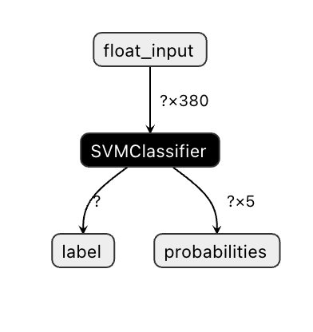
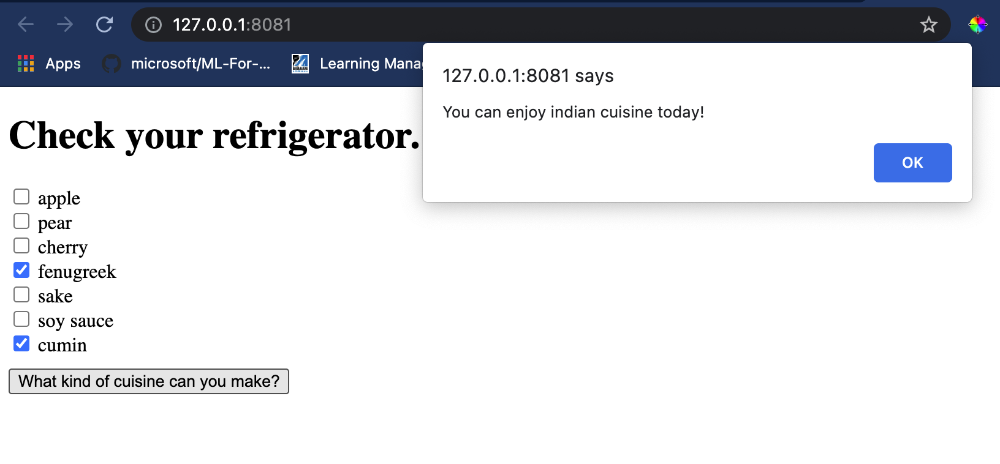

<!--
CO_OP_TRANSLATOR_METADATA:
{
  "original_hash": "ad2cf19d7490247558d20a6a59650d13",
  "translation_date": "2025-08-29T13:57:00+00:00",
  "source_file": "4-Classification/4-Applied/README.md",
  "language_code": "tl"
}
-->
# Gumawa ng Web App para sa Pagrekomenda ng Lutuin

Sa araling ito, gagawa ka ng isang classification model gamit ang ilan sa mga teknik na natutunan mo sa mga nakaraang aralin at gamit ang masarap na dataset ng lutuin na ginamit sa buong serye. Bukod dito, gagawa ka ng isang maliit na web app upang magamit ang isang naka-save na model, gamit ang web runtime ng Onnx.

Isa sa mga pinaka-kapaki-pakinabang na praktikal na gamit ng machine learning ay ang paggawa ng mga sistema ng rekomendasyon, at maaari kang magsimula sa direksyong iyon ngayon!

[](https://youtu.be/17wdM9AHMfg "Applied ML")

> 🎥 I-click ang imahe sa itaas para sa video: Ginawa ni Jen Looper ang isang web app gamit ang classified cuisine data

## [Pre-lecture quiz](https://gray-sand-07a10f403.1.azurestaticapps.net/quiz/25/)

Sa araling ito, matututunan mo:

- Paano gumawa ng model at i-save ito bilang Onnx model
- Paano gamitin ang Netron upang suriin ang model
- Paano gamitin ang iyong model sa isang web app para sa inference

## Gumawa ng iyong model

Ang paggawa ng applied ML systems ay mahalagang bahagi ng paggamit ng mga teknolohiyang ito para sa iyong mga sistema ng negosyo. Maaari mong gamitin ang mga model sa loob ng iyong mga web application (at sa gayon ay magamit ang mga ito sa offline na konteksto kung kinakailangan) gamit ang Onnx.

Sa isang [nakaraang aralin](../../3-Web-App/1-Web-App/README.md), gumawa ka ng Regression model tungkol sa mga sightings ng UFO, "pickled" ito, at ginamit ito sa isang Flask app. Bagama't ang arkitekturang ito ay napaka-kapaki-pakinabang, ito ay isang full-stack Python app, at maaaring kasama sa iyong mga pangangailangan ang paggamit ng JavaScript application.

Sa araling ito, maaari kang gumawa ng isang basic na JavaScript-based system para sa inference. Ngunit una, kailangan mong sanayin ang isang model at i-convert ito para magamit sa Onnx.

## Ehersisyo - sanayin ang classification model

Una, sanayin ang isang classification model gamit ang nilinis na dataset ng lutuin na ginamit natin.

1. Magsimula sa pag-import ng mga kapaki-pakinabang na library:

    ```python
    !pip install skl2onnx
    import pandas as pd 
    ```

    Kailangan mo ang '[skl2onnx](https://onnx.ai/sklearn-onnx/)' upang makatulong na i-convert ang iyong Scikit-learn model sa Onnx format.

1. Pagkatapos, gamitin ang iyong data sa parehong paraan na ginawa mo sa mga nakaraang aralin, sa pamamagitan ng pagbabasa ng CSV file gamit ang `read_csv()`:

    ```python
    data = pd.read_csv('../data/cleaned_cuisines.csv')
    data.head()
    ```

1. Alisin ang unang dalawang hindi kinakailangang column at i-save ang natitirang data bilang 'X':

    ```python
    X = data.iloc[:,2:]
    X.head()
    ```

1. I-save ang mga label bilang 'y':

    ```python
    y = data[['cuisine']]
    y.head()
    
    ```

### Simulan ang training routine

Gagamitin natin ang 'SVC' library na may magandang accuracy.

1. I-import ang mga naaangkop na library mula sa Scikit-learn:

    ```python
    from sklearn.model_selection import train_test_split
    from sklearn.svm import SVC
    from sklearn.model_selection import cross_val_score
    from sklearn.metrics import accuracy_score,precision_score,confusion_matrix,classification_report
    ```

1. Paghiwalayin ang training at test sets:

    ```python
    X_train, X_test, y_train, y_test = train_test_split(X,y,test_size=0.3)
    ```

1. Gumawa ng SVC Classification model tulad ng ginawa mo sa nakaraang aralin:

    ```python
    model = SVC(kernel='linear', C=10, probability=True,random_state=0)
    model.fit(X_train,y_train.values.ravel())
    ```

1. Ngayon, subukan ang iyong model, tawagin ang `predict()`:

    ```python
    y_pred = model.predict(X_test)
    ```

1. I-print ang classification report upang suriin ang kalidad ng model:

    ```python
    print(classification_report(y_test,y_pred))
    ```

    Tulad ng nakita natin dati, maganda ang accuracy:

    ```output
                    precision    recall  f1-score   support
    
         chinese       0.72      0.69      0.70       257
          indian       0.91      0.87      0.89       243
        japanese       0.79      0.77      0.78       239
          korean       0.83      0.79      0.81       236
            thai       0.72      0.84      0.78       224
    
        accuracy                           0.79      1199
       macro avg       0.79      0.79      0.79      1199
    weighted avg       0.79      0.79      0.79      1199
    ```

### I-convert ang iyong model sa Onnx

Siguraduhing gawin ang conversion gamit ang tamang bilang ng Tensor. Ang dataset na ito ay may 380 na sangkap na nakalista, kaya kailangan mong itala ang bilang na iyon sa `FloatTensorType`:

1. I-convert gamit ang tensor number na 380.

    ```python
    from skl2onnx import convert_sklearn
    from skl2onnx.common.data_types import FloatTensorType
    
    initial_type = [('float_input', FloatTensorType([None, 380]))]
    options = {id(model): {'nocl': True, 'zipmap': False}}
    ```

1. Gumawa ng onx at i-save bilang file **model.onnx**:

    ```python
    onx = convert_sklearn(model, initial_types=initial_type, options=options)
    with open("./model.onnx", "wb") as f:
        f.write(onx.SerializeToString())
    ```

    > Tandaan, maaari kang magpasa ng [mga opsyon](https://onnx.ai/sklearn-onnx/parameterized.html) sa iyong conversion script. Sa kasong ito, ipinasa namin ang 'nocl' bilang True at 'zipmap' bilang False. Dahil ito ay isang classification model, mayroon kang opsyon na alisin ang ZipMap na gumagawa ng listahan ng mga dictionary (hindi kinakailangan). Ang `nocl` ay tumutukoy sa impormasyon ng klase na kasama sa model. Bawasan ang laki ng iyong model sa pamamagitan ng pagtatakda ng `nocl` sa 'True'.

Ang pagtakbo ng buong notebook ngayon ay gagawa ng Onnx model at i-save ito sa folder na ito.

## Tingnan ang iyong model

Ang mga Onnx model ay hindi masyadong nakikita sa Visual Studio code, ngunit mayroong isang napakagandang libreng software na ginagamit ng maraming mananaliksik upang i-visualize ang model upang matiyak na ito ay maayos na ginawa. I-download ang [Netron](https://github.com/lutzroeder/Netron) at buksan ang iyong model.onnx file. Makikita mo ang iyong simpleng model na na-visualize, kasama ang 380 inputs at classifier na nakalista:



Ang Netron ay isang kapaki-pakinabang na tool upang makita ang iyong mga model.

Ngayon handa ka nang gamitin ang model na ito sa isang web app. Gumawa tayo ng app na magagamit kapag tumingin ka sa iyong refrigerator at sinusubukang alamin kung aling kombinasyon ng iyong mga natirang sangkap ang maaari mong gamitin upang magluto ng isang partikular na lutuin, ayon sa iyong model.

## Gumawa ng web application para sa rekomendasyon

Maaari mong gamitin ang iyong model nang direkta sa isang web app. Ang arkitekturang ito ay nagbibigay-daan din sa iyo na patakbuhin ito nang lokal at kahit offline kung kinakailangan. Magsimula sa pamamagitan ng paggawa ng isang `index.html` file sa parehong folder kung saan mo iniimbak ang iyong `model.onnx` file.

1. Sa file na ito _index.html_, idagdag ang sumusunod na markup:

    ```html
    <!DOCTYPE html>
    <html>
        <header>
            <title>Cuisine Matcher</title>
        </header>
        <body>
            ...
        </body>
    </html>
    ```

1. Ngayon, sa loob ng `body` tags, magdagdag ng kaunting markup upang ipakita ang isang listahan ng mga checkbox na sumasalamin sa ilang sangkap:

    ```html
    <h1>Check your refrigerator. What can you create?</h1>
            <div id="wrapper">
                <div class="boxCont">
                    <input type="checkbox" value="4" class="checkbox">
                    <label>apple</label>
                </div>
            
                <div class="boxCont">
                    <input type="checkbox" value="247" class="checkbox">
                    <label>pear</label>
                </div>
            
                <div class="boxCont">
                    <input type="checkbox" value="77" class="checkbox">
                    <label>cherry</label>
                </div>
    
                <div class="boxCont">
                    <input type="checkbox" value="126" class="checkbox">
                    <label>fenugreek</label>
                </div>
    
                <div class="boxCont">
                    <input type="checkbox" value="302" class="checkbox">
                    <label>sake</label>
                </div>
    
                <div class="boxCont">
                    <input type="checkbox" value="327" class="checkbox">
                    <label>soy sauce</label>
                </div>
    
                <div class="boxCont">
                    <input type="checkbox" value="112" class="checkbox">
                    <label>cumin</label>
                </div>
            </div>
            <div style="padding-top:10px">
                <button onClick="startInference()">What kind of cuisine can you make?</button>
            </div> 
    ```

    Tandaan na ang bawat checkbox ay binigyan ng value. Ang value na ito ay sumasalamin sa index kung saan matatagpuan ang sangkap ayon sa dataset. Halimbawa, ang Apple, sa listahang ito na naka-alpabeto, ay nasa ikalimang column, kaya ang value nito ay '4' dahil nagsisimula tayo sa pagbilang sa 0. Maaari mong konsultahin ang [ingredients spreadsheet](../../../../4-Classification/data/ingredient_indexes.csv) upang matuklasan ang index ng isang partikular na sangkap.

    Ipagpatuloy ang iyong trabaho sa index.html file, magdagdag ng script block kung saan tinatawag ang model pagkatapos ng huling pagsasara ng `</div>`.

1. Una, i-import ang [Onnx Runtime](https://www.onnxruntime.ai/):

    ```html
    <script src="https://cdn.jsdelivr.net/npm/onnxruntime-web@1.9.0/dist/ort.min.js"></script> 
    ```

    > Ang Onnx Runtime ay ginagamit upang paganahin ang pagpapatakbo ng iyong Onnx models sa iba't ibang hardware platforms, kabilang ang mga optimizations at isang API na magagamit.

1. Kapag nasa lugar na ang Runtime, maaari mo na itong tawagin:

    ```html
    <script>
        const ingredients = Array(380).fill(0);
        
        const checks = [...document.querySelectorAll('.checkbox')];
        
        checks.forEach(check => {
            check.addEventListener('change', function() {
                // toggle the state of the ingredient
                // based on the checkbox's value (1 or 0)
                ingredients[check.value] = check.checked ? 1 : 0;
            });
        });

        function testCheckboxes() {
            // validate if at least one checkbox is checked
            return checks.some(check => check.checked);
        }

        async function startInference() {

            let atLeastOneChecked = testCheckboxes()

            if (!atLeastOneChecked) {
                alert('Please select at least one ingredient.');
                return;
            }
            try {
                // create a new session and load the model.
                
                const session = await ort.InferenceSession.create('./model.onnx');

                const input = new ort.Tensor(new Float32Array(ingredients), [1, 380]);
                const feeds = { float_input: input };

                // feed inputs and run
                const results = await session.run(feeds);

                // read from results
                alert('You can enjoy ' + results.label.data[0] + ' cuisine today!')

            } catch (e) {
                console.log(`failed to inference ONNX model`);
                console.error(e);
            }
        }
               
    </script>
    ```

Sa code na ito, may ilang bagay na nangyayari:

1. Gumawa ka ng array ng 380 posibleng value (1 o 0) na itatakda at ipapadala sa model para sa inference, depende kung ang isang checkbox ng sangkap ay naka-check.
2. Gumawa ka ng array ng mga checkbox at isang paraan upang matukoy kung naka-check ang mga ito sa isang `init` function na tinatawag kapag nagsimula ang application. Kapag ang isang checkbox ay naka-check, ang `ingredients` array ay binabago upang sumalamin sa napiling sangkap.
3. Gumawa ka ng `testCheckboxes` function na nagche-check kung may naka-check na checkbox.
4. Ginamit mo ang `startInference` function kapag pinindot ang button at, kung may naka-check na checkbox, sinimulan mo ang inference.
5. Ang inference routine ay kinabibilangan ng:
   1. Pag-set up ng asynchronous load ng model
   2. Paglikha ng Tensor structure na ipapadala sa model
   3. Paglikha ng 'feeds' na sumasalamin sa `float_input` input na ginawa mo noong sinasanay ang iyong model (maaari mong gamitin ang Netron upang i-verify ang pangalan)
   4. Pagpapadala ng mga 'feeds' sa model at paghihintay ng tugon

## Subukan ang iyong application

Buksan ang isang terminal session sa Visual Studio Code sa folder kung saan matatagpuan ang iyong index.html file. Siguraduhing mayroon kang [http-server](https://www.npmjs.com/package/http-server) na naka-install globally, at i-type ang `http-server` sa prompt. Magbubukas ang isang localhost at maaari mong tingnan ang iyong web app. Tingnan kung anong lutuin ang inirerekomenda batay sa iba't ibang sangkap:



Binabati kita, nakagawa ka ng isang 'recommendation' web app na may ilang fields. Maglaan ng oras upang palawakin ang sistemang ito!

## 🚀Hamunin

Ang iyong web app ay napaka-minimal, kaya ipagpatuloy ang pagpapalawak nito gamit ang mga sangkap at kanilang mga index mula sa [ingredient_indexes](../../../../4-Classification/data/ingredient_indexes.csv) data. Anong mga kombinasyon ng lasa ang gumagana upang makagawa ng isang partikular na pambansang ulam?

## [Post-lecture quiz](https://gray-sand-07a10f403.1.azurestaticapps.net/quiz/26/)

## Review & Self Study

Bagama't ang araling ito ay bahagyang tumalakay sa utility ng paggawa ng sistema ng rekomendasyon para sa mga sangkap ng pagkain, ang larangang ito ng ML applications ay napakayaman sa mga halimbawa. Magbasa pa tungkol sa kung paano binubuo ang mga sistemang ito:

- https://www.sciencedirect.com/topics/computer-science/recommendation-engine
- https://www.technologyreview.com/2014/08/25/171547/the-ultimate-challenge-for-recommendation-engines/
- https://www.technologyreview.com/2015/03/23/168831/everything-is-a-recommendation/

## Takdang Aralin

[Magbuo ng bagong recommender](assignment.md)

---

**Paunawa**:  
Ang dokumentong ito ay isinalin gamit ang AI translation service na [Co-op Translator](https://github.com/Azure/co-op-translator). Bagama't sinisikap naming maging tumpak, tandaan na ang mga awtomatikong pagsasalin ay maaaring maglaman ng mga pagkakamali o hindi pagkakatugma. Ang orihinal na dokumento sa kanyang katutubong wika ang dapat ituring na opisyal na sanggunian. Para sa mahalagang impormasyon, inirerekomenda ang propesyonal na pagsasalin ng tao. Hindi kami mananagot sa anumang hindi pagkakaunawaan o maling interpretasyon na maaaring magmula sa paggamit ng pagsasaling ito.