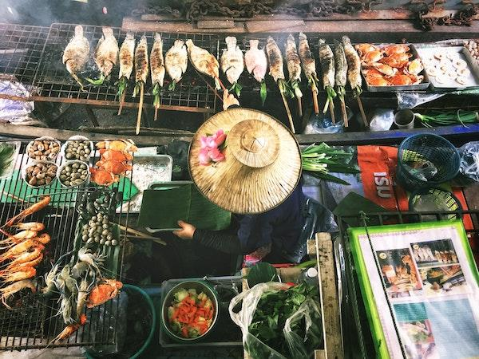

<!--
CO_OP_TRANSLATOR_METADATA:
{
  "original_hash": "74e809ffd1e613a1058bbc3e9600859e",
  "translation_date": "2025-08-29T13:51:56+00:00",
  "source_file": "4-Classification/README.md",
  "language_code": "tl"
}
-->
# Pagsisimula sa klasipikasyon

## Paksang Rehiyonal: Masasarap na Lutuing Asyano at Indian 🍜

Sa Asya at India, ang mga tradisyon sa pagkain ay napaka-diverse at napakasarap! Tingnan natin ang datos tungkol sa mga lutuing rehiyonal upang maunawaan ang kanilang mga sangkap.

> Larawan ni <a href="https://unsplash.com/@changlisheng?utm_source=unsplash&utm_medium=referral&utm_content=creditCopyText">Lisheng Chang</a> sa <a href="https://unsplash.com/s/photos/asian-food?utm_source=unsplash&utm_medium=referral&utm_content=creditCopyText">Unsplash</a>
  
## Ano ang iyong matututuhan

Sa seksyong ito, palalawakin mo ang iyong naunang pag-aaral tungkol sa Regression at matututuhan ang iba pang mga classifier na maaari mong gamitin upang mas maunawaan ang datos.

> May mga kapaki-pakinabang na low-code na tool na makakatulong sa iyong matutunan ang paggamit ng mga classification model. Subukan ang [Azure ML para sa gawaing ito](https://docs.microsoft.com/learn/modules/create-classification-model-azure-machine-learning-designer/?WT.mc_id=academic-77952-leestott)

## Mga Aralin

1. [Panimula sa klasipikasyon](1-Introduction/README.md)
2. [Mas maraming classifier](2-Classifiers-1/README.md)
3. [Iba pang mga classifier](3-Classifiers-2/README.md)
4. [Applied ML: gumawa ng web app](4-Applied/README.md)

## Mga Kredito

Ang "Pagsisimula sa klasipikasyon" ay isinulat nang may ♥️ nina [Cassie Breviu](https://www.twitter.com/cassiebreviu) at [Jen Looper](https://www.twitter.com/jenlooper)

Ang dataset ng masasarap na lutuin ay kinuha mula sa [Kaggle](https://www.kaggle.com/hoandan/asian-and-indian-cuisines).

---

**Paunawa**:  
Ang dokumentong ito ay isinalin gamit ang AI translation service na [Co-op Translator](https://github.com/Azure/co-op-translator). Bagama't sinisikap naming maging tumpak, pakitandaan na ang mga awtomatikong pagsasalin ay maaaring maglaman ng mga pagkakamali o hindi pagkakatugma. Ang orihinal na dokumento sa orihinal nitong wika ang dapat ituring na opisyal na sanggunian. Para sa mahalagang impormasyon, inirerekomenda ang propesyonal na pagsasalin ng tao. Hindi kami mananagot sa anumang hindi pagkakaunawaan o maling interpretasyon na maaaring magmula sa paggamit ng pagsasaling ito.