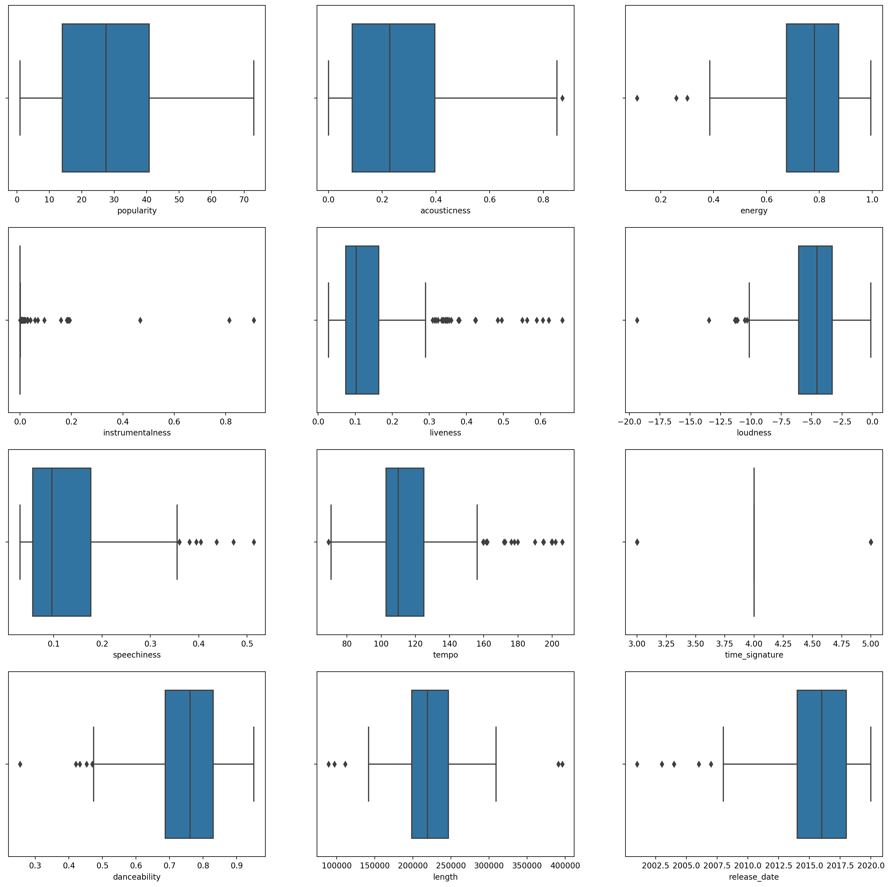

<!--
CO_OP_TRANSLATOR_METADATA:
{
  "original_hash": "085d571097d201810720df4cd379f8c2",
  "translation_date": "2025-08-29T13:27:11+00:00",
  "source_file": "5-Clustering/2-K-Means/README.md",
  "language_code": "tl"
}
-->
# K-Means clustering

## [Pre-lecture quiz](https://gray-sand-07a10f403.1.azurestaticapps.net/quiz/29/)

Sa araling ito, matututuhan mo kung paano lumikha ng mga cluster gamit ang Scikit-learn at ang Nigerian music dataset na na-import mo noong nakaraan. Tatalakayin natin ang mga pangunahing kaalaman ng K-Means para sa Clustering. Tandaan na, tulad ng natutunan mo sa nakaraang aralin, maraming paraan upang magtrabaho gamit ang mga cluster at ang pamamaraan na gagamitin mo ay nakadepende sa iyong data. Susubukan natin ang K-Means dahil ito ang pinakakaraniwang clustering technique. Tara, simulan na natin!

Mga terminong matututuhan mo:

- Silhouette scoring  
- Elbow method  
- Inertia  
- Variance  

## Panimula

Ang [K-Means Clustering](https://wikipedia.org/wiki/K-means_clustering) ay isang pamamaraan na nagmula sa larangan ng signal processing. Ginagamit ito upang hatiin at i-partition ang mga grupo ng data sa 'k' na mga cluster gamit ang serye ng mga obserbasyon. Ang bawat obserbasyon ay naglalayong i-grupo ang isang datapoint na pinakamalapit sa pinakamalapit na 'mean', o ang gitnang punto ng isang cluster.

Ang mga cluster ay maaaring makita bilang [Voronoi diagrams](https://wikipedia.org/wiki/Voronoi_diagram), na naglalaman ng isang punto (o 'seed') at ang kaukulang rehiyon nito.


> infographic ni [Jen Looper](https://twitter.com/jenlooper)

Ang proseso ng K-Means clustering ay [isinasagawa sa tatlong hakbang](https://scikit-learn.org/stable/modules/clustering.html#k-means):

1. Pinipili ng algorithm ang k bilang dami ng mga sentro ng punto sa pamamagitan ng pag-sample mula sa dataset. Pagkatapos nito, inuulit nito ang mga sumusunod:
    1. Ina-assign ang bawat sample sa pinakamalapit na centroid.
    2. Lumilikha ng mga bagong centroid sa pamamagitan ng pagkuha ng mean value ng lahat ng sample na na-assign sa mga naunang centroid.
    3. Kinakalkula ang pagkakaiba sa pagitan ng mga bagong centroid at mga lumang centroid at inuulit ang proseso hanggang sa maging stable ang mga centroid.

Isang kahinaan ng paggamit ng K-Means ay kailangan mong itakda ang 'k', na siyang bilang ng mga centroid. Sa kabutihang-palad, ang 'elbow method' ay tumutulong upang tantiyahin ang isang magandang panimulang halaga para sa 'k'. Susubukan mo ito sa ilang sandali.

## Prerequisite

Gagamitin mo ang [_notebook.ipynb_](https://github.com/microsoft/ML-For-Beginners/blob/main/5-Clustering/2-K-Means/notebook.ipynb) file ng araling ito na naglalaman ng data import at paunang paglilinis na ginawa mo sa nakaraang aralin.

## Ehersisyo - paghahanda

Simulan sa muling pagtingin sa data ng mga kanta.

1. Gumawa ng boxplot sa pamamagitan ng pagtawag sa `boxplot()` para sa bawat column:

    ```python
    plt.figure(figsize=(20,20), dpi=200)
    
    plt.subplot(4,3,1)
    sns.boxplot(x = 'popularity', data = df)
    
    plt.subplot(4,3,2)
    sns.boxplot(x = 'acousticness', data = df)
    
    plt.subplot(4,3,3)
    sns.boxplot(x = 'energy', data = df)
    
    plt.subplot(4,3,4)
    sns.boxplot(x = 'instrumentalness', data = df)
    
    plt.subplot(4,3,5)
    sns.boxplot(x = 'liveness', data = df)
    
    plt.subplot(4,3,6)
    sns.boxplot(x = 'loudness', data = df)
    
    plt.subplot(4,3,7)
    sns.boxplot(x = 'speechiness', data = df)
    
    plt.subplot(4,3,8)
    sns.boxplot(x = 'tempo', data = df)
    
    plt.subplot(4,3,9)
    sns.boxplot(x = 'time_signature', data = df)
    
    plt.subplot(4,3,10)
    sns.boxplot(x = 'danceability', data = df)
    
    plt.subplot(4,3,11)
    sns.boxplot(x = 'length', data = df)
    
    plt.subplot(4,3,12)
    sns.boxplot(x = 'release_date', data = df)
    ```

    Medyo maingay ang data na ito: sa pamamagitan ng pagmamasid sa bawat column bilang isang boxplot, makikita mo ang mga outlier.

    

Maaari mong suriin ang dataset at alisin ang mga outlier na ito, ngunit magiging mas kaunti ang data.

1. Sa ngayon, piliin kung aling mga column ang gagamitin mo para sa iyong clustering exercise. Pumili ng mga may magkatulad na saklaw at i-encode ang column na `artist_top_genre` bilang numeric data:

    ```python
    from sklearn.preprocessing import LabelEncoder
    le = LabelEncoder()
    
    X = df.loc[:, ('artist_top_genre','popularity','danceability','acousticness','loudness','energy')]
    
    y = df['artist_top_genre']
    
    X['artist_top_genre'] = le.fit_transform(X['artist_top_genre'])
    
    y = le.transform(y)
    ```

1. Ngayon, kailangan mong pumili kung ilang cluster ang itatarget. Alam mong mayroong 3 genre ng kanta na nakuha natin mula sa dataset, kaya subukan natin ang 3:

    ```python
    from sklearn.cluster import KMeans
    
    nclusters = 3 
    seed = 0
    
    km = KMeans(n_clusters=nclusters, random_state=seed)
    km.fit(X)
    
    # Predict the cluster for each data point
    
    y_cluster_kmeans = km.predict(X)
    y_cluster_kmeans
    ```

Makikita mo ang isang array na naka-print na may mga predicted cluster (0, 1, o 2) para sa bawat row ng dataframe.

1. Gamitin ang array na ito upang kalkulahin ang 'silhouette score':

    ```python
    from sklearn import metrics
    score = metrics.silhouette_score(X, y_cluster_kmeans)
    score
    ```

## Silhouette score

Maghanap ng silhouette score na mas malapit sa 1. Ang score na ito ay nag-iiba mula -1 hanggang 1, at kung ang score ay 1, ang cluster ay dense at maayos na hiwalay mula sa ibang mga cluster. Ang halaga na malapit sa 0 ay kumakatawan sa mga overlapping cluster na may mga sample na napakalapit sa decision boundary ng mga kalapit na cluster. [(Source)](https://dzone.com/articles/kmeans-silhouette-score-explained-with-python-exam)

Ang ating score ay **.53**, kaya nasa gitna. Ipinapakita nito na ang ating data ay hindi masyadong angkop para sa ganitong uri ng clustering, ngunit magpatuloy tayo.

### Ehersisyo - gumawa ng modelo

1. I-import ang `KMeans` at simulan ang clustering process.

    ```python
    from sklearn.cluster import KMeans
    wcss = []
    
    for i in range(1, 11):
        kmeans = KMeans(n_clusters = i, init = 'k-means++', random_state = 42)
        kmeans.fit(X)
        wcss.append(kmeans.inertia_)
    
    ```

    May ilang bahagi dito na nangangailangan ng paliwanag.

    > 🎓 range: Ito ang mga iteration ng clustering process.

    > 🎓 random_state: "Tinutukoy ang random number generation para sa centroid initialization." [Source](https://scikit-learn.org/stable/modules/generated/sklearn.cluster.KMeans.html#sklearn.cluster.KMeans)

    > 🎓 WCSS: "within-cluster sums of squares" na sumusukat sa squared average distance ng lahat ng mga punto sa loob ng isang cluster sa cluster centroid. [Source](https://medium.com/@ODSC/unsupervised-learning-evaluating-clusters-bd47eed175ce).

    > 🎓 Inertia: Sinusubukan ng K-Means algorithm na pumili ng mga centroid upang mabawasan ang 'inertia', "isang sukatan kung gaano ka-coherent ang mga cluster sa loob." [Source](https://scikit-learn.org/stable/modules/clustering.html). Ang halaga ay idinadagdag sa wcss variable sa bawat iteration.

    > 🎓 k-means++: Sa [Scikit-learn](https://scikit-learn.org/stable/modules/clustering.html#k-means) maaari mong gamitin ang 'k-means++' optimization, na "nag-i-initialize ng mga centroid upang maging (karaniwang) malayo sa isa't isa, na nagreresulta sa mas magagandang resulta kaysa sa random initialization.

### Elbow method

Noong una, inakala mo na, dahil may 3 genre ng kanta kang tinarget, dapat kang pumili ng 3 cluster. Ngunit totoo ba ito?

1. Gamitin ang 'elbow method' upang makasiguro.

    ```python
    plt.figure(figsize=(10,5))
    sns.lineplot(x=range(1, 11), y=wcss, marker='o', color='red')
    plt.title('Elbow')
    plt.xlabel('Number of clusters')
    plt.ylabel('WCSS')
    plt.show()
    ```

    Gamitin ang `wcss` variable na ginawa mo sa nakaraang hakbang upang lumikha ng isang chart na nagpapakita kung saan ang 'bend' sa elbow, na nagpapahiwatig ng pinakamainam na bilang ng mga cluster. Marahil nga ay **3** ito!

    

## Ehersisyo - ipakita ang mga cluster

1. Subukan muli ang proseso, sa pagkakataong ito ay itakda ang tatlong cluster, at ipakita ang mga cluster bilang isang scatterplot:

    ```python
    from sklearn.cluster import KMeans
    kmeans = KMeans(n_clusters = 3)
    kmeans.fit(X)
    labels = kmeans.predict(X)
    plt.scatter(df['popularity'],df['danceability'],c = labels)
    plt.xlabel('popularity')
    plt.ylabel('danceability')
    plt.show()
    ```

1. Suriin ang katumpakan ng modelo:

    ```python
    labels = kmeans.labels_
    
    correct_labels = sum(y == labels)
    
    print("Result: %d out of %d samples were correctly labeled." % (correct_labels, y.size))
    
    print('Accuracy score: {0:0.2f}'. format(correct_labels/float(y.size)))
    ```

    Ang katumpakan ng modelong ito ay hindi masyadong maganda, at ang hugis ng mga cluster ay nagbibigay ng pahiwatig kung bakit.

    

    Ang data na ito ay masyadong hindi balanse, masyadong kaunti ang correlation, at masyadong malaki ang variance sa pagitan ng mga halaga ng column upang ma-cluster nang maayos. Sa katunayan, ang mga cluster na nabuo ay malamang na malaki ang impluwensya o skewed ng tatlong kategorya ng genre na tinukoy natin sa itaas. Isang proseso ng pagkatuto ito!

    Sa dokumentasyon ng Scikit-learn, makikita mo na ang isang modelo tulad nito, na may mga cluster na hindi masyadong malinaw ang pagkakahiwalay, ay may problema sa 'variance':

    
    > Infographic mula sa Scikit-learn

## Variance

Ang variance ay tinutukoy bilang "ang average ng mga squared differences mula sa Mean" [(Source)](https://www.mathsisfun.com/data/standard-deviation.html). Sa konteksto ng problemang ito sa clustering, tumutukoy ito sa data kung saan ang mga numero ng ating dataset ay may tendensiyang lumihis nang sobra mula sa mean.

✅ Ito ay isang magandang pagkakataon upang pag-isipan ang lahat ng paraan upang maitama ang isyung ito. Ayusin pa ang data? Gumamit ng ibang mga column? Gumamit ng ibang algorithm? Pahiwatig: Subukang [i-scale ang iyong data](https://www.mygreatlearning.com/blog/learning-data-science-with-k-means-clustering/) upang i-normalize ito at subukan ang ibang mga column.

> Subukan ang '[variance calculator](https://www.calculatorsoup.com/calculators/statistics/variance-calculator.php)' upang mas maunawaan ang konsepto.

---

## 🚀Hamunin

Maglaan ng oras sa notebook na ito, at ayusin ang mga parameter. Mapapabuti mo ba ang katumpakan ng modelo sa pamamagitan ng mas maayos na paglilinis ng data (halimbawa, pag-aalis ng mga outlier)? Maaari kang gumamit ng weights upang bigyan ng mas malaking timbang ang ilang data samples. Ano pa ang maaari mong gawin upang makabuo ng mas magagandang cluster?

Pahiwatig: Subukang i-scale ang iyong data. Mayroong naka-comment na code sa notebook na nagdadagdag ng standard scaling upang gawing mas magkahawig ang mga column ng data sa isa't isa sa mga tuntunin ng saklaw. Mapapansin mo na habang bumababa ang silhouette score, ang 'kink' sa elbow graph ay nagiging mas maayos. Ito ay dahil ang hindi pag-scale ng data ay nagpapahintulot sa data na may mas kaunting variance na magkaroon ng mas malaking timbang. Basahin pa ang tungkol sa problemang ito [dito](https://stats.stackexchange.com/questions/21222/are-mean-normalization-and-feature-scaling-needed-for-k-means-clustering/21226#21226).

## [Post-lecture quiz](https://gray-sand-07a10f403.1.azurestaticapps.net/quiz/30/)

## Review at Pag-aaral sa Sarili

Tingnan ang isang K-Means Simulator [tulad nito](https://user.ceng.metu.edu.tr/~akifakkus/courses/ceng574/k-means/). Maaari mong gamitin ang tool na ito upang makita ang mga sample data points at matukoy ang mga centroid nito. Maaari mong i-edit ang randomness ng data, bilang ng mga cluster, at bilang ng mga centroid. Nakakatulong ba ito upang magkaroon ka ng ideya kung paano maaaring i-grupo ang data?

Tingnan din ang [handout na ito tungkol sa K-Means](https://stanford.edu/~cpiech/cs221/handouts/kmeans.html) mula sa Stanford.

## Takdang Aralin

[Subukan ang iba't ibang clustering methods](assignment.md)

---

**Paunawa**:  
Ang dokumentong ito ay isinalin gamit ang AI translation service na [Co-op Translator](https://github.com/Azure/co-op-translator). Bagama't sinisikap naming maging tumpak, tandaan na ang mga awtomatikong pagsasalin ay maaaring maglaman ng mga pagkakamali o hindi pagkakatugma. Ang orihinal na dokumento sa kanyang katutubong wika ang dapat ituring na opisyal na sanggunian. Para sa mahalagang impormasyon, inirerekomenda ang propesyonal na pagsasalin ng tao. Hindi kami mananagot sa anumang hindi pagkakaunawaan o maling interpretasyon na maaaring magmula sa paggamit ng pagsasaling ito.