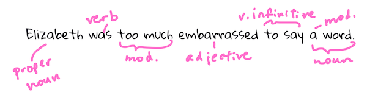

<!--
CO_OP_TRANSLATOR_METADATA:
{
  "original_hash": "6534e145d52a3890590d27be75386e5d",
  "translation_date": "2025-08-29T14:21:28+00:00",
  "source_file": "6-NLP/2-Tasks/README.md",
  "language_code": "tl"
}
-->
# Mga Karaniwang Gawain at Teknik sa Natural Language Processing

Para sa karamihan ng mga gawain sa *natural language processing* (NLP), kailangang hatiin, suriin, at itala ang teksto o i-cross reference ito gamit ang mga patakaran at data set. Ang mga gawaing ito ay nagbibigay-daan sa programmer na maunawaan ang _kahulugan_, _layunin_, o kahit ang _dalas_ ng mga salita at termino sa isang teksto.

## [Pre-lecture quiz](https://gray-sand-07a10f403.1.azurestaticapps.net/quiz/33/)

Tuklasin natin ang mga karaniwang teknik na ginagamit sa pagproseso ng teksto. Kapag pinagsama sa machine learning, ang mga teknik na ito ay tumutulong sa iyo na masuri ang malaking dami ng teksto nang mas episyente. Gayunpaman, bago gamitin ang ML sa mga gawaing ito, unawain muna natin ang mga problemang kinakaharap ng isang NLP specialist.

## Mga Karaniwang Gawain sa NLP

May iba't ibang paraan upang suriin ang isang teksto na iyong pinagtatrabahuhan. May mga gawain kang maaaring isagawa, at sa pamamagitan ng mga gawaing ito, nagkakaroon ka ng mas malalim na pag-unawa sa teksto at nakakapagbuo ng mga konklusyon. Karaniwan, isinasagawa ang mga gawaing ito nang sunud-sunod.

### Tokenization

Ang unang hakbang na karaniwang ginagawa ng karamihan sa mga NLP algorithm ay ang paghahati ng teksto sa mga token o salita. Bagama't mukhang simple ito, ang pagsasaalang-alang sa mga bantas at iba't ibang delimiters ng salita at pangungusap sa iba't ibang wika ay maaaring maging mahirap. Maaaring kailanganin mong gumamit ng iba't ibang paraan upang matukoy ang mga hangganan.


> Tokenizing ng isang pangungusap mula sa **Pride and Prejudice**. Infographic ni [Jen Looper](https://twitter.com/jenlooper)

### Embeddings

Ang [Word embeddings](https://wikipedia.org/wiki/Word_embedding) ay isang paraan upang gawing numerikal ang iyong data ng teksto. Ginagawa ang embeddings sa paraang ang mga salitang may magkatulad na kahulugan o madalas gamitin nang magkasama ay nagkakaroon ng clustering.


> "I have the highest respect for your nerves, they are my old friends." - Word embeddings para sa isang pangungusap sa **Pride and Prejudice**. Infographic ni [Jen Looper](https://twitter.com/jenlooper)

✅ Subukan ang [kawili-wiling tool na ito](https://projector.tensorflow.org/) upang mag-eksperimento sa word embeddings. Ang pag-click sa isang salita ay nagpapakita ng mga cluster ng magkatulad na salita: 'toy' ay nagkakaroon ng cluster kasama ang 'disney', 'lego', 'playstation', at 'console'.

### Parsing at Part-of-speech Tagging

Ang bawat salitang na-tokenize ay maaaring i-tag bilang bahagi ng pananalita - tulad ng pangngalan, pandiwa, o pang-uri. Ang pangungusap na `the quick red fox jumped over the lazy brown dog` ay maaaring i-POS tag bilang fox = pangngalan, jumped = pandiwa.



> Parsing ng isang pangungusap mula sa **Pride and Prejudice**. Infographic ni [Jen Looper](https://twitter.com/jenlooper)

Ang parsing ay ang pagkilala kung aling mga salita ang magkakaugnay sa isang pangungusap - halimbawa, ang `the quick red fox jumped` ay isang adjective-noun-verb sequence na hiwalay sa `lazy brown dog` sequence.

### Dalas ng Salita at Parirala

Isang kapaki-pakinabang na proseso kapag sinusuri ang malaking dami ng teksto ay ang paggawa ng diksyunaryo ng bawat salita o parirala ng interes at kung gaano ito kadalas lumitaw. Ang pariralang `the quick red fox jumped over the lazy brown dog` ay may word frequency na 2 para sa "the."

Tingnan natin ang isang halimbawa ng teksto kung saan binibilang natin ang dalas ng mga salita. Ang tula ni Rudyard Kipling na "The Winners" ay naglalaman ng sumusunod na taludtod:

```output
What the moral? Who rides may read.
When the night is thick and the tracks are blind
A friend at a pinch is a friend, indeed,
But a fool to wait for the laggard behind.
Down to Gehenna or up to the Throne,
He travels the fastest who travels alone.
```

Dahil ang dalas ng parirala ay maaaring case insensitive o case sensitive depende sa pangangailangan, ang pariralang `a friend` ay may dalas na 2, ang `the` ay may dalas na 6, at ang `travels` ay 2.

### N-grams

Ang isang teksto ay maaaring hatiin sa mga sunod-sunod na salita na may nakatakdang haba: isang salita (unigram), dalawang salita (bigram), tatlong salita (trigram), o anumang bilang ng salita (n-grams).

Halimbawa, ang `the quick red fox jumped over the lazy brown dog` na may n-gram score na 2 ay nagbubunga ng sumusunod na n-grams:

1. the quick  
2. quick red  
3. red fox  
4. fox jumped  
5. jumped over  
6. over the  
7. the lazy  
8. lazy brown  
9. brown dog  

Mas madaling ma-visualize ito bilang isang sliding box sa pangungusap. Narito ito para sa n-grams ng 3 salita, ang n-gram ay naka-bold sa bawat pangungusap:

1.   <u>**the quick red**</u> fox jumped over the lazy brown dog  
2.   the **<u>quick red fox</u>** jumped over the lazy brown dog  
3.   the quick **<u>red fox jumped</u>** over the lazy brown dog  
4.   the quick red **<u>fox jumped over</u>** the lazy brown dog  
5.   the quick red fox **<u>jumped over the</u>** lazy brown dog  
6.   the quick red fox jumped **<u>over the lazy</u>** brown dog  
7.   the quick red fox jumped over <u>**the lazy brown**</u> dog  
8.   the quick red fox jumped over the **<u>lazy brown dog</u>**  


> N-gram value na 3: Infographic ni [Jen Looper](https://twitter.com/jenlooper)

### Pagkuha ng Noun Phrase

Sa karamihan ng mga pangungusap, mayroong pangngalan na siyang paksa o layon ng pangungusap. Sa Ingles, madalas itong makikilala sa pagkakaroon ng 'a', 'an', o 'the' bago ito. Ang pagkilala sa paksa o layon ng isang pangungusap sa pamamagitan ng 'pagkuha ng noun phrase' ay isang karaniwang gawain sa NLP kapag sinusubukang unawain ang kahulugan ng isang pangungusap.

✅ Sa pangungusap na "I cannot fix on the hour, or the spot, or the look or the words, which laid the foundation. It is too long ago. I was in the middle before I knew that I had begun.", kaya mo bang tukuyin ang mga noun phrases?

Sa pangungusap na `the quick red fox jumped over the lazy brown dog` mayroong 2 noun phrases: **quick red fox** at **lazy brown dog**.

### Sentiment Analysis

Ang isang pangungusap o teksto ay maaaring suriin para sa damdamin, o kung gaano ito *positibo* o *negatibo*. Ang damdamin ay sinusukat sa *polarity* at *objectivity/subjectivity*. Ang polarity ay sinusukat mula -1.0 hanggang 1.0 (negatibo hanggang positibo) at 0.0 hanggang 1.0 (pinaka-objective hanggang pinaka-subjective).

✅ Sa susunod, malalaman mo na may iba't ibang paraan upang matukoy ang damdamin gamit ang machine learning, ngunit isang paraan ay ang pagkakaroon ng listahan ng mga salita at parirala na inuri bilang positibo o negatibo ng isang eksperto at ilapat ang modelong iyon sa teksto upang makalkula ang polarity score. Nakikita mo ba kung paano ito gumagana sa ilang pagkakataon at hindi sa iba?

### Inflection

Ang inflection ay nagbibigay-daan sa iyo na kunin ang isahan o maramihan ng isang salita.

### Lemmatization

Ang *lemma* ay ang ugat o pangunahing salita para sa isang hanay ng mga salita, halimbawa, ang *flew*, *flies*, *flying* ay may lemma na pandiwang *fly*.

Mayroon ding mga kapaki-pakinabang na database na magagamit para sa mga mananaliksik ng NLP, partikular:

### WordNet

Ang [WordNet](https://wordnet.princeton.edu/) ay isang database ng mga salita, kasingkahulugan, kasalungat, at maraming iba pang detalye para sa bawat salita sa iba't ibang wika. Napakakapal nito sa mga pagsasalin, spell checker, o anumang uri ng mga tool sa wika.

## Mga Aklatan ng NLP

Sa kabutihang palad, hindi mo kailangang buuin ang lahat ng mga teknik na ito mula sa simula, dahil may mga mahusay na Python libraries na magagamit na ginagawang mas madali para sa mga developer na hindi dalubhasa sa natural language processing o machine learning. Ang mga susunod na aralin ay may higit pang mga halimbawa ng mga ito, ngunit dito ay matututo ka ng ilang kapaki-pakinabang na halimbawa upang matulungan ka sa susunod na gawain.

### Ehersisyo - gamit ang `TextBlob` library

Gamitin natin ang isang library na tinatawag na TextBlob dahil naglalaman ito ng mga kapaki-pakinabang na API para sa pagharap sa mga ganitong uri ng gawain. Ang TextBlob ay "nakatayo sa malalaking balikat ng [NLTK](https://nltk.org) at [pattern](https://github.com/clips/pattern), at mahusay na nakikipag-ugnayan sa pareho." Mayroon itong malaking dami ng ML na naka-embed sa API nito.

> Tandaan: Isang kapaki-pakinabang na [Quick Start](https://textblob.readthedocs.io/en/dev/quickstart.html#quickstart) na gabay ay magagamit para sa TextBlob na inirerekomenda para sa mga bihasang Python developer.

Kapag sinusubukang tukuyin ang *noun phrases*, nag-aalok ang TextBlob ng ilang mga opsyon ng extractors upang mahanap ang mga noun phrases.

1. Tingnan ang `ConllExtractor`.

    ```python
    from textblob import TextBlob
    from textblob.np_extractors import ConllExtractor
    # import and create a Conll extractor to use later 
    extractor = ConllExtractor()
    
    # later when you need a noun phrase extractor:
    user_input = input("> ")
    user_input_blob = TextBlob(user_input, np_extractor=extractor)  # note non-default extractor specified
    np = user_input_blob.noun_phrases                                    
    ```

    > Ano ang nangyayari dito? Ang [ConllExtractor](https://textblob.readthedocs.io/en/dev/api_reference.html?highlight=Conll#textblob.en.np_extractors.ConllExtractor) ay "isang noun phrase extractor na gumagamit ng chunk parsing na sinanay gamit ang ConLL-2000 training corpus." Ang ConLL-2000 ay tumutukoy sa 2000 Conference on Computational Natural Language Learning. Bawat taon, ang kumperensya ay nagho-host ng workshop upang harapin ang isang mahirap na problema sa NLP, at noong 2000 ito ay noun chunking. Ang isang modelo ay sinanay sa Wall Street Journal, gamit ang "mga seksyon 15-18 bilang training data (211727 tokens) at seksyon 20 bilang test data (47377 tokens)". Maaari mong tingnan ang mga pamamaraan na ginamit [dito](https://www.clips.uantwerpen.be/conll2000/chunking/) at ang [mga resulta](https://ifarm.nl/erikt/research/np-chunking.html).

### Hamon - pagpapabuti ng iyong bot gamit ang NLP

Sa nakaraang aralin, gumawa ka ng isang napakasimpleng Q&A bot. Ngayon, gagawin mong mas "sympathetic" si Marvin sa pamamagitan ng pagsusuri sa iyong input para sa damdamin at pag-print ng tugon na tumutugma sa damdamin. Kailangan mo ring tukuyin ang isang `noun_phrase` at magtanong tungkol dito.

Ang iyong mga hakbang sa paggawa ng mas mahusay na conversational bot:

1. Mag-print ng mga tagubilin na nagpapayo sa user kung paano makipag-ugnayan sa bot  
2. Simulan ang loop  
   1. Tanggapin ang input ng user  
   2. Kung ang user ay humiling na lumabas, pagkatapos ay lumabas  
   3. Iproseso ang input ng user at tukuyin ang angkop na tugon sa damdamin  
   4. Kung may natukoy na noun phrase sa damdamin, gawing maramihan ito at magtanong ng higit pang input tungkol sa paksang iyon  
   5. I-print ang tugon  
3. Bumalik sa hakbang 2  

Narito ang code snippet upang tukuyin ang damdamin gamit ang TextBlob. Tandaan na may apat na *gradients* lamang ng tugon sa damdamin (maaari kang magkaroon ng higit pa kung nais mo):

```python
if user_input_blob.polarity <= -0.5:
  response = "Oh dear, that sounds bad. "
elif user_input_blob.polarity <= 0:
  response = "Hmm, that's not great. "
elif user_input_blob.polarity <= 0.5:
  response = "Well, that sounds positive. "
elif user_input_blob.polarity <= 1:
  response = "Wow, that sounds great. "
```

Narito ang ilang sample output bilang gabay (ang input ng user ay nasa mga linyang nagsisimula sa >):

```output
Hello, I am Marvin, the friendly robot.
You can end this conversation at any time by typing 'bye'
After typing each answer, press 'enter'
How are you today?
> I am ok
Well, that sounds positive. Can you tell me more?
> I went for a walk and saw a lovely cat
Well, that sounds positive. Can you tell me more about lovely cats?
> cats are the best. But I also have a cool dog
Wow, that sounds great. Can you tell me more about cool dogs?
> I have an old hounddog but he is sick
Hmm, that's not great. Can you tell me more about old hounddogs?
> bye
It was nice talking to you, goodbye!
```

Ang isang posibleng solusyon sa gawain ay [dito](https://github.com/microsoft/ML-For-Beginners/blob/main/6-NLP/2-Tasks/solution/bot.py)

✅ Pagsusuri ng Kaalaman

1. Sa tingin mo ba ang mga "sympathetic" na tugon ay maaaring 'lokohin' ang isang tao na isipin na ang bot ay talagang nauunawaan sila?  
2. Ginagawa bang mas 'kapani-paniwala' ng pagtukoy sa noun phrase ang bot?  
3. Bakit magiging kapaki-pakinabang ang pagkuha ng 'noun phrase' mula sa isang pangungusap?  

---

Ipatupad ang bot sa nakaraang pagsusuri ng kaalaman at subukan ito sa isang kaibigan. Maloloko ba sila nito? Kaya mo bang gawing mas 'kapani-paniwala' ang iyong bot?

## 🚀Hamon

Kunin ang isang gawain sa nakaraang pagsusuri ng kaalaman at subukang ipatupad ito. Subukan ang bot sa isang kaibigan. Maloloko ba sila nito? Kaya mo bang gawing mas 'kapani-paniwala' ang iyong bot?

## [Post-lecture quiz](https://gray-sand-07a10f403.1.azurestaticapps.net/quiz/34/)

## Pagsusuri at Pag-aaral sa Sarili

Sa mga susunod na aralin, matututo ka pa tungkol sa sentiment analysis. Mag-research tungkol sa kawili-wiling teknik na ito sa mga artikulo tulad ng mga nasa [KDNuggets](https://www.kdnuggets.com/tag/nlp)

## Takdang Aralin

[Pag-usapan ang bot](assignment.md)

---

**Paunawa**:  
Ang dokumentong ito ay isinalin gamit ang AI translation service na [Co-op Translator](https://github.com/Azure/co-op-translator). Bagama't sinisikap naming maging tumpak, pakitandaan na ang mga awtomatikong pagsasalin ay maaaring maglaman ng mga pagkakamali o hindi pagkakatugma. Ang orihinal na dokumento sa orihinal nitong wika ang dapat ituring na opisyal na sanggunian. Para sa mahalagang impormasyon, inirerekomenda ang propesyonal na pagsasalin ng tao. Hindi kami mananagot sa anumang hindi pagkakaunawaan o maling interpretasyon na maaaring magmula sa paggamit ng pagsasaling ito.