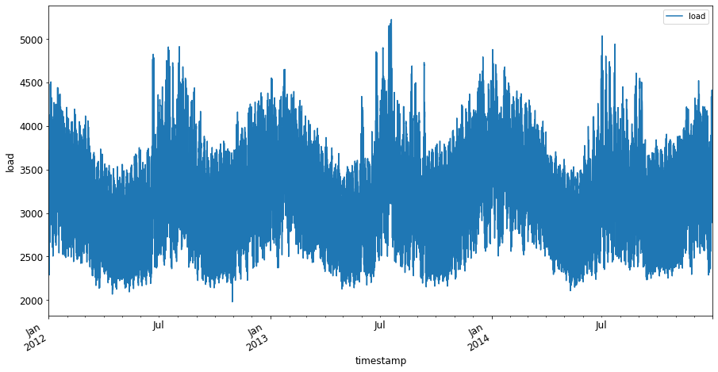

<!--
CO_OP_TRANSLATOR_METADATA:
{
  "original_hash": "3150d40f36a77857316ecaed5f31e856",
  "translation_date": "2025-08-29T13:14:12+00:00",
  "source_file": "7-TimeSeries/1-Introduction/README.md",
  "language_code": "tl"
}
-->
# Panimula sa Pagtataya ng Time Series


> Sketchnote ni [Tomomi Imura](https://www.twitter.com/girlie_mac)

Sa araling ito at sa susunod, matututo ka ng kaunti tungkol sa pagtataya ng time series, isang kawili-wili at mahalagang bahagi ng kaalaman ng isang ML scientist na hindi gaanong kilala kumpara sa ibang mga paksa. Ang pagtataya ng time series ay parang 'crystal ball': batay sa nakaraang performance ng isang variable tulad ng presyo, maaari mong hulaan ang posibleng halaga nito sa hinaharap.

[](https://youtu.be/cBojo1hsHiI "Panimula sa pagtataya ng time series")

> 🎥 I-click ang larawan sa itaas para sa isang video tungkol sa pagtataya ng time series

## [Pre-lecture quiz](https://gray-sand-07a10f403.1.azurestaticapps.net/quiz/41/)

Ito ay isang kapaki-pakinabang at kawili-wiling larangan na may tunay na halaga sa negosyo, dahil sa direktang aplikasyon nito sa mga problema sa pagpepresyo, imbentaryo, at mga isyu sa supply chain. Habang ang mga deep learning techniques ay nagsisimula nang gamitin upang makakuha ng mas maraming insight para mas mahusay na mahulaan ang performance sa hinaharap, ang pagtataya ng time series ay nananatiling isang larangan na malaki ang naiaambag ng mga klasikong ML techniques.

> Ang kapaki-pakinabang na kurikulum ng time series ng Penn State ay matatagpuan [dito](https://online.stat.psu.edu/stat510/lesson/1)

## Panimula

Ipagpalagay na ikaw ay nagmementena ng isang array ng mga smart parking meter na nagbibigay ng data tungkol sa kung gaano kadalas at gaano katagal ang paggamit nito sa paglipas ng panahon.

> Paano kung kaya mong hulaan, batay sa nakaraang performance ng metro, ang halaga nito sa hinaharap ayon sa mga batas ng supply at demand?

Ang tumpak na paghula kung kailan dapat kumilos upang makamit ang iyong layunin ay isang hamon na maaaring harapin gamit ang pagtataya ng time series. Hindi man ikatutuwa ng mga tao na masisingil sila ng mas mahal sa abalang oras habang naghahanap ng paradahan, ngunit ito ay tiyak na isang paraan upang makalikom ng kita para sa paglilinis ng mga kalye!

Tuklasin natin ang ilang uri ng mga algorithm ng time series at simulan ang isang notebook upang linisin at ihanda ang ilang data. Ang data na iyong susuriin ay kinuha mula sa GEFCom2014 forecasting competition. Binubuo ito ng 3 taon ng oras-oras na datos ng kuryente at temperatura mula 2012 hanggang 2014. Batay sa mga makasaysayang pattern ng kuryente at temperatura, maaari mong hulaan ang mga halaga ng kuryente sa hinaharap.

Sa halimbawang ito, matututo kang mag-forecast ng isang hakbang pasulong, gamit lamang ang makasaysayang load data. Gayunpaman, bago magsimula, mahalagang maunawaan kung ano ang nangyayari sa likod ng mga eksena.

## Ilang mga Depinisyon

Kapag narinig mo ang terminong 'time series', kailangan mong maunawaan ang paggamit nito sa iba't ibang konteksto.

🎓 **Time series**

Sa matematika, "ang time series ay isang serye ng mga data point na naka-index (o nakalista o naka-graph) sa pagkakasunod-sunod ng oras. Kadalasan, ang time series ay isang pagkakasunod-sunod na kinuha sa magkakasunod na pantay na pagitan ng oras." Isang halimbawa ng time series ay ang pang-araw-araw na closing value ng [Dow Jones Industrial Average](https://wikipedia.org/wiki/Time_series). Ang paggamit ng mga time series plots at statistical modeling ay madalas na makikita sa signal processing, weather forecasting, earthquake prediction, at iba pang larangan kung saan nagaganap ang mga kaganapan at maaaring i-plot ang mga data point sa paglipas ng panahon.

🎓 **Time series analysis**

Ang time series analysis ay ang pagsusuri ng nabanggit na time series data. Ang time series data ay maaaring magkaroon ng iba't ibang anyo, kabilang ang 'interrupted time series' na tumutukoy sa mga pattern sa ebolusyon ng time series bago at pagkatapos ng isang interrupting event. Ang uri ng pagsusuri na kinakailangan para sa time series ay nakadepende sa kalikasan ng data. Ang time series data mismo ay maaaring nasa anyo ng serye ng mga numero o karakter.

Ang pagsusuri na isasagawa ay gumagamit ng iba't ibang mga pamamaraan, kabilang ang frequency-domain at time-domain, linear at nonlinear, at iba pa. [Matuto pa](https://www.itl.nist.gov/div898/handbook/pmc/section4/pmc4.htm) tungkol sa maraming paraan upang suriin ang ganitong uri ng data.

🎓 **Time series forecasting**

Ang time series forecasting ay ang paggamit ng isang modelo upang mahulaan ang mga halaga sa hinaharap batay sa mga pattern na ipinakita ng mga nakalap na datos sa nakaraan. Bagaman posible ang paggamit ng regression models upang suriin ang time series data, na may time indices bilang x variables sa isang plot, ang ganitong data ay pinakamahusay na sinusuri gamit ang mga espesyal na uri ng modelo.

Ang time series data ay isang listahan ng mga ordered observations, hindi tulad ng data na maaaring suriin gamit ang linear regression. Ang pinakakaraniwang modelo ay ang ARIMA, isang akronim na nangangahulugang "Autoregressive Integrated Moving Average".

[ARIMA models](https://online.stat.psu.edu/stat510/lesson/1/1.1) ay "inuugnay ang kasalukuyang halaga ng isang serye sa mga nakaraang halaga at mga nakaraang prediction errors." Ang mga ito ay pinakaangkop para sa pagsusuri ng time-domain data, kung saan ang data ay nakaayos ayon sa oras.

> Mayroong ilang uri ng ARIMA models, na maaari mong matutunan [dito](https://people.duke.edu/~rnau/411arim.htm) at tatalakayin mo sa susunod na aralin.

Sa susunod na aralin, gagawa ka ng isang ARIMA model gamit ang [Univariate Time Series](https://itl.nist.gov/div898/handbook/pmc/section4/pmc44.htm), na nakatuon sa isang variable na nagbabago ng halaga sa paglipas ng panahon. Isang halimbawa ng ganitong uri ng data ay [ang dataset na ito](https://itl.nist.gov/div898/handbook/pmc/section4/pmc4411.htm) na nagtatala ng buwanang konsentrasyon ng CO2 sa Mauna Loa Observatory:

|  CO2   | YearMonth | Year  | Month |
| :----: | :-------: | :---: | :---: |
| 330.62 |  1975.04  | 1975  |   1   |
| 331.40 |  1975.13  | 1975  |   2   |
| 331.87 |  1975.21  | 1975  |   3   |
| 333.18 |  1975.29  | 1975  |   4   |
| 333.92 |  1975.38  | 1975  |   5   |
| 333.43 |  1975.46  | 1975  |   6   |
| 331.85 |  1975.54  | 1975  |   7   |
| 330.01 |  1975.63  | 1975  |   8   |
| 328.51 |  1975.71  | 1975  |   9   |
| 328.41 |  1975.79  | 1975  |  10   |
| 329.25 |  1975.88  | 1975  |  11   |
| 330.97 |  1975.96  | 1975  |  12   |

✅ Tukuyin ang variable na nagbabago sa paglipas ng panahon sa dataset na ito.

## Mga Katangian ng Time Series Data na Dapat Isaalang-alang

Kapag tinitingnan ang time series data, maaaring mapansin mo na mayroon itong [mga partikular na katangian](https://online.stat.psu.edu/stat510/lesson/1/1.1) na kailangan mong isaalang-alang at bawasan upang mas maunawaan ang mga pattern nito. Kung ituturing mo ang time series data bilang posibleng nagbibigay ng isang 'signal' na nais mong suriin, ang mga katangiang ito ay maaaring ituring bilang 'ingay'. Kadalasan, kailangan mong bawasan ang 'ingay' na ito sa pamamagitan ng paggamit ng ilang mga statistical techniques.

Narito ang ilang mga konsepto na dapat mong malaman upang magamit ang time series:

🎓 **Trends**

Ang trends ay tinutukoy bilang mga nasusukat na pagtaas at pagbaba sa paglipas ng panahon. [Basahin pa](https://machinelearningmastery.com/time-series-trends-in-python). Sa konteksto ng time series, ito ay tungkol sa kung paano gamitin at, kung kinakailangan, alisin ang mga trends mula sa iyong time series.

🎓 **[Seasonality](https://machinelearningmastery.com/time-series-seasonality-with-python/)**

Ang seasonality ay tinutukoy bilang mga periodic fluctuations, tulad ng holiday rushes na maaaring makaapekto sa benta, halimbawa. [Tingnan](https://itl.nist.gov/div898/handbook/pmc/section4/pmc443.htm) kung paano ipinapakita ng iba't ibang uri ng plots ang seasonality sa data.

🎓 **Outliers**

Ang outliers ay mga data point na malayo sa karaniwang variance ng data.

🎓 **Long-run cycle**

Bukod sa seasonality, maaaring magpakita ang data ng long-run cycle tulad ng isang economic downturn na tumatagal ng higit sa isang taon.

🎓 **Constant variance**

Sa paglipas ng panahon, ang ilang data ay nagpapakita ng constant fluctuations, tulad ng paggamit ng enerhiya sa araw at gabi.

🎓 **Abrupt changes**

Maaaring magpakita ang data ng biglaang pagbabago na maaaring mangailangan ng karagdagang pagsusuri. Halimbawa, ang biglaang pagsasara ng mga negosyo dahil sa COVID ay nagdulot ng mga pagbabago sa data.

✅ Narito ang isang [halimbawang time series plot](https://www.kaggle.com/kashnitsky/topic-9-part-1-time-series-analysis-in-python) na nagpapakita ng pang-araw-araw na paggastos sa in-game currency sa loob ng ilang taon. Maaari mo bang tukuyin ang alinman sa mga katangiang nakalista sa itaas sa data na ito?


## Ehersisyo - Pagsisimula sa Data ng Paggamit ng Kuryente

Simulan natin ang paggawa ng isang time series model upang mahulaan ang paggamit ng kuryente sa hinaharap batay sa nakaraang paggamit.

> Ang data sa halimbawang ito ay kinuha mula sa GEFCom2014 forecasting competition. Binubuo ito ng 3 taon ng oras-oras na datos ng kuryente at temperatura mula 2012 hanggang 2014.
>
> Tao Hong, Pierre Pinson, Shu Fan, Hamidreza Zareipour, Alberto Troccoli at Rob J. Hyndman, "Probabilistic energy forecasting: Global Energy Forecasting Competition 2014 and beyond", International Journal of Forecasting, vol.32, no.3, pp 896-913, July-September, 2016.

1. Sa folder na `working` ng araling ito, buksan ang _notebook.ipynb_ file. Simulan sa pagdaragdag ng mga library na makakatulong sa iyong mag-load at mag-visualize ng data:

    ```python
    import os
    import matplotlib.pyplot as plt
    from common.utils import load_data
    %matplotlib inline
    ```

    Tandaan, ginagamit mo ang mga file mula sa kasamang `common` folder na nagse-set up ng iyong environment at nagha-handle ng pag-download ng data.

2. Susunod, suriin ang data bilang isang dataframe sa pamamagitan ng pagtawag sa `load_data()` at `head()`:

    ```python
    data_dir = './data'
    energy = load_data(data_dir)[['load']]
    energy.head()
    ```

    Makikita mo na mayroong dalawang column na kumakatawan sa petsa at load:

    |                     |  load  |
    | :-----------------: | :----: |
    | 2012-01-01 00:00:00 | 2698.0 |
    | 2012-01-01 01:00:00 | 2558.0 |
    | 2012-01-01 02:00:00 | 2444.0 |
    | 2012-01-01 03:00:00 | 2402.0 |
    | 2012-01-01 04:00:00 | 2403.0 |

3. Ngayon, i-plot ang data sa pamamagitan ng pagtawag sa `plot()`:

    ```python
    energy.plot(y='load', subplots=True, figsize=(15, 8), fontsize=12)
    plt.xlabel('timestamp', fontsize=12)
    plt.ylabel('load', fontsize=12)
    plt.show()
    ```

    

4. Ngayon, i-plot ang unang linggo ng Hulyo 2014, sa pamamagitan ng pagbibigay nito bilang input sa `energy` gamit ang `[mula petsa]: [hanggang petsa]` na pattern:

    ```python
    energy['2014-07-01':'2014-07-07'].plot(y='load', subplots=True, figsize=(15, 8), fontsize=12)
    plt.xlabel('timestamp', fontsize=12)
    plt.ylabel('load', fontsize=12)
    plt.show()
    ```

    

    Isang magandang plot! Tingnan ang mga plot na ito at subukang tukuyin ang alinman sa mga katangiang nakalista sa itaas. Ano ang maaari nating masabi sa pamamagitan ng pag-visualize ng data?

Sa susunod na aralin, gagawa ka ng isang ARIMA model upang lumikha ng ilang mga forecast.

---

## 🚀Hamunin

Gumawa ng listahan ng lahat ng mga industriya at larangan ng pag-aaral na sa tingin mo ay makikinabang mula sa pagtataya ng time series. Makakaisip ka ba ng aplikasyon ng mga teknik na ito sa sining? Sa Econometrics? Ekolohiya? Retail? Industriya? Pananalapi? Saan pa?

## [Post-lecture quiz](https://gray-sand-07a10f403.1.azurestaticapps.net/quiz/42/)

## Pagsusuri at Pag-aaral sa Sarili

Bagaman hindi natin ito tatalakayin dito, ang neural networks ay minsang ginagamit upang mapahusay ang mga klasikong pamamaraan ng pagtataya ng time series. Basahin pa ang tungkol dito [sa artikulong ito](https://medium.com/microsoftazure/neural-networks-for-forecasting-financial-and-economic-time-series-6aca370ff412)

## Takdang Aralin

[Mag-visualize ng mas maraming time series](assignment.md)

---

**Paunawa**:  
Ang dokumentong ito ay isinalin gamit ang AI translation service na [Co-op Translator](https://github.com/Azure/co-op-translator). Bagama't sinisikap naming maging tumpak, pakitandaan na ang mga awtomatikong pagsasalin ay maaaring maglaman ng mga pagkakamali o hindi pagkakatugma. Ang orihinal na dokumento sa orihinal nitong wika ang dapat ituring na opisyal na sanggunian. Para sa mahalagang impormasyon, inirerekomenda ang propesyonal na pagsasalin ng tao. Hindi kami mananagot sa anumang hindi pagkakaunawaan o maling interpretasyon na maaaring magmula sa paggamit ng pagsasaling ito.