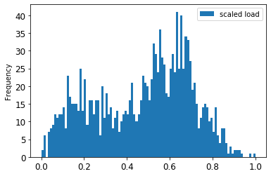
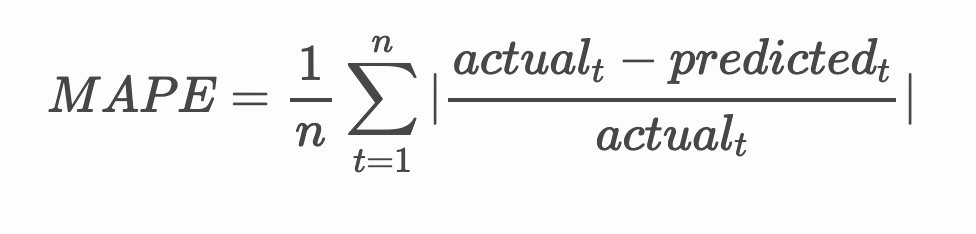

<!--
CO_OP_TRANSLATOR_METADATA:
{
  "original_hash": "2f400075e003e749fdb0d6b3b4787a99",
  "translation_date": "2025-08-29T13:10:49+00:00",
  "source_file": "7-TimeSeries/2-ARIMA/README.md",
  "language_code": "tl"
}
-->
# Pagtataya ng Time Series gamit ang ARIMA

Sa nakaraang aralin, natutunan mo ang kaunti tungkol sa pagtataya ng time series at nag-load ng dataset na nagpapakita ng pagbabago-bago ng electrical load sa loob ng isang panahon.

[](https://youtu.be/IUSk-YDau10 "Panimula sa ARIMA")

> 🎥 I-click ang larawan sa itaas para sa isang video: Isang maikling pagpapakilala sa mga ARIMA model. Ang halimbawa ay ginawa sa R, ngunit ang mga konsepto ay pangkalahatan.

## [Pre-lecture quiz](https://gray-sand-07a10f403.1.azurestaticapps.net/quiz/43/)

## Panimula

Sa araling ito, matutuklasan mo ang isang partikular na paraan ng paggawa ng mga modelo gamit ang [ARIMA: *A*uto*R*egressive *I*ntegrated *M*oving *A*verage](https://wikipedia.org/wiki/Autoregressive_integrated_moving_average). Ang mga ARIMA model ay partikular na angkop para sa data na nagpapakita ng [non-stationarity](https://wikipedia.org/wiki/Stationary_process).

## Mga Pangunahing Konsepto

Upang magamit ang ARIMA, may ilang mga konsepto na kailangan mong malaman:

- 🎓 **Stationarity**. Sa konteksto ng estadistika, ang stationarity ay tumutukoy sa data na ang distribusyon ay hindi nagbabago kapag inilipat sa oras. Ang non-stationary na data, samakatuwid, ay nagpapakita ng pagbabago-bago dahil sa mga trend na kailangang baguhin upang ma-analisa. Halimbawa, ang seasonality ay maaaring magdulot ng pagbabago-bago sa data at maaaring alisin sa pamamagitan ng proseso ng 'seasonal-differencing'.

- 🎓 **[Differencing](https://wikipedia.org/wiki/Autoregressive_integrated_moving_average#Differencing)**. Ang differencing ng data, mula sa estadistikal na konteksto, ay tumutukoy sa proseso ng pagbabago ng non-stationary na data upang gawing stationary sa pamamagitan ng pag-aalis ng hindi pare-parehong trend. "Ang differencing ay nag-aalis ng mga pagbabago sa antas ng isang time series, inaalis ang trend at seasonality, at sa gayon ay pinapatatag ang mean ng time series." [Paper ni Shixiong et al](https://arxiv.org/abs/1904.07632)

## ARIMA sa Konteksto ng Time Series

Tingnan natin ang mga bahagi ng ARIMA upang mas maunawaan kung paano ito nakakatulong sa pagmomodelo ng time series at sa paggawa ng mga prediksyon.

- **AR - para sa AutoRegressive**. Ang mga autoregressive model, tulad ng ipinahihiwatig ng pangalan, ay tumitingin 'pabalik' sa oras upang suriin ang mga nakaraang halaga sa iyong data at gumawa ng mga palagay tungkol dito. Ang mga nakaraang halagang ito ay tinatawag na 'lags'. Halimbawa, ang data na nagpapakita ng buwanang benta ng mga lapis. Ang kabuuang benta bawat buwan ay itinuturing na isang 'evolving variable' sa dataset. Ang modelong ito ay binubuo bilang "ang evolving variable ng interes ay nire-regress sa sarili nitong lagged (i.e., nakaraang) mga halaga." [wikipedia](https://wikipedia.org/wiki/Autoregressive_integrated_moving_average)

- **I - para sa Integrated**. Sa kaibahan sa mga katulad na 'ARMA' model, ang 'I' sa ARIMA ay tumutukoy sa *[integrated](https://wikipedia.org/wiki/Order_of_integration)* na aspeto nito. Ang data ay 'integrated' kapag ang mga hakbang ng differencing ay inilapat upang maalis ang non-stationarity.

- **MA - para sa Moving Average**. Ang [moving-average](https://wikipedia.org/wiki/Moving-average_model) na aspeto ng modelong ito ay tumutukoy sa output variable na natutukoy sa pamamagitan ng pagmamasid sa kasalukuyan at nakaraang mga halaga ng lags.

Sa madaling salita: Ang ARIMA ay ginagamit upang gawing akma ang isang modelo sa espesyal na anyo ng time series data hangga't maaari.

## Ehersisyo - Gumawa ng ARIMA Model

Buksan ang [_/working_](https://github.com/microsoft/ML-For-Beginners/tree/main/7-TimeSeries/2-ARIMA/working) na folder sa araling ito at hanapin ang [_notebook.ipynb_](https://github.com/microsoft/ML-For-Beginners/blob/main/7-TimeSeries/2-ARIMA/working/notebook.ipynb) na file.

1. Patakbuhin ang notebook upang i-load ang `statsmodels` Python library; kakailanganin mo ito para sa mga ARIMA model.

1. I-load ang mga kinakailangang library.

1. Ngayon, i-load ang ilang karagdagang library na kapaki-pakinabang para sa pag-plot ng data:

    ```python
    import os
    import warnings
    import matplotlib.pyplot as plt
    import numpy as np
    import pandas as pd
    import datetime as dt
    import math

    from pandas.plotting import autocorrelation_plot
    from statsmodels.tsa.statespace.sarimax import SARIMAX
    from sklearn.preprocessing import MinMaxScaler
    from common.utils import load_data, mape
    from IPython.display import Image

    %matplotlib inline
    pd.options.display.float_format = '{:,.2f}'.format
    np.set_printoptions(precision=2)
    warnings.filterwarnings("ignore") # specify to ignore warning messages
    ```

1. I-load ang data mula sa `/data/energy.csv` na file sa isang Pandas dataframe at tingnan ito:

    ```python
    energy = load_data('./data')[['load']]
    energy.head(10)
    ```

1. I-plot ang lahat ng available na energy data mula Enero 2012 hanggang Disyembre 2014. Walang dapat ikagulat dahil nakita na natin ang data na ito sa nakaraang aralin:

    ```python
    energy.plot(y='load', subplots=True, figsize=(15, 8), fontsize=12)
    plt.xlabel('timestamp', fontsize=12)
    plt.ylabel('load', fontsize=12)
    plt.show()
    ```

    Ngayon, gumawa tayo ng modelo!

### Gumawa ng Training at Testing Dataset

Ngayon na na-load mo na ang data, maaari mo na itong hatiin sa train at test set. Ite-train mo ang iyong modelo sa train set. Gaya ng dati, pagkatapos ng training ng modelo, susuriin mo ang katumpakan nito gamit ang test set. Kailangan mong tiyakin na ang test set ay sumasaklaw sa mas huling panahon kumpara sa training set upang matiyak na ang modelo ay hindi makakakuha ng impormasyon mula sa mga hinaharap na panahon.

1. Maglaan ng dalawang buwang panahon mula Setyembre 1 hanggang Oktubre 31, 2014 para sa training set. Ang test set ay magsasama ng dalawang buwang panahon mula Nobyembre 1 hanggang Disyembre 31, 2014:

    ```python
    train_start_dt = '2014-11-01 00:00:00'
    test_start_dt = '2014-12-30 00:00:00'
    ```

    Dahil ang data na ito ay sumasalamin sa pang-araw-araw na pagkonsumo ng enerhiya, mayroong isang malakas na pattern ng seasonality, ngunit ang pagkonsumo ay pinaka-katulad sa pagkonsumo sa mga mas kamakailang araw.

1. I-visualize ang mga pagkakaiba:

    ```python
    energy[(energy.index < test_start_dt) & (energy.index >= train_start_dt)][['load']].rename(columns={'load':'train'}) \
        .join(energy[test_start_dt:][['load']].rename(columns={'load':'test'}), how='outer') \
        .plot(y=['train', 'test'], figsize=(15, 8), fontsize=12)
    plt.xlabel('timestamp', fontsize=12)
    plt.ylabel('load', fontsize=12)
    plt.show()
    ```

    

    Samakatuwid, ang paggamit ng isang medyo maliit na window ng oras para sa pagte-train ng data ay dapat na sapat.

    > Tandaan: Dahil ang function na ginagamit natin upang i-fit ang ARIMA model ay gumagamit ng in-sample validation habang nagte-train, hindi na tayo gagamit ng validation data.

### Ihanda ang Data para sa Training

Ngayon, kailangan mong ihanda ang data para sa training sa pamamagitan ng pagsasagawa ng filtering at scaling ng iyong data. I-filter ang iyong dataset upang isama lamang ang mga kinakailangang panahon at mga column, at i-scale ito upang matiyak na ang data ay naka-project sa interval na 0,1.

1. I-filter ang orihinal na dataset upang isama lamang ang mga nabanggit na panahon bawat set at isama lamang ang kinakailangang column na 'load' kasama ang petsa:

    ```python
    train = energy.copy()[(energy.index >= train_start_dt) & (energy.index < test_start_dt)][['load']]
    test = energy.copy()[energy.index >= test_start_dt][['load']]

    print('Training data shape: ', train.shape)
    print('Test data shape: ', test.shape)
    ```

    Makikita mo ang hugis ng data:

    ```output
    Training data shape:  (1416, 1)
    Test data shape:  (48, 1)
    ```

1. I-scale ang data upang mapunta ito sa saklaw na (0, 1).

    ```python
    scaler = MinMaxScaler()
    train['load'] = scaler.fit_transform(train)
    train.head(10)
    ```

1. I-visualize ang orihinal kumpara sa scaled na data:

    ```python
    energy[(energy.index >= train_start_dt) & (energy.index < test_start_dt)][['load']].rename(columns={'load':'original load'}).plot.hist(bins=100, fontsize=12)
    train.rename(columns={'load':'scaled load'}).plot.hist(bins=100, fontsize=12)
    plt.show()
    ```

    

    > Ang orihinal na data

    

    > Ang scaled na data

1. Ngayon na na-calibrate mo na ang scaled na data, maaari mo nang i-scale ang test data:

    ```python
    test['load'] = scaler.transform(test)
    test.head()
    ```

### Ipatupad ang ARIMA

Panahon na upang ipatupad ang ARIMA! Gagamitin mo na ngayon ang `statsmodels` library na na-install mo kanina.

Ngayon kailangan mong sundin ang ilang hakbang:

   1. Tukuyin ang modelo sa pamamagitan ng pagtawag sa `SARIMAX()` at paglalagay ng mga parameter ng modelo: p, d, at q parameters, at P, D, at Q parameters.
   2. Ihanda ang modelo para sa training data sa pamamagitan ng pagtawag sa `fit()` function.
   3. Gumawa ng mga prediksyon sa pamamagitan ng pagtawag sa `forecast()` function at pagtukoy ng bilang ng mga hakbang (ang `horizon`) na ipi-predict.

> 🎓 Ano ang mga parameter na ito? Sa isang ARIMA model, mayroong 3 parameter na ginagamit upang makatulong sa pagmomodelo ng mga pangunahing aspeto ng time series: seasonality, trend, at noise. Ang mga parameter na ito ay:

`p`: ang parameter na nauugnay sa auto-regressive na aspeto ng modelo, na sumasaklaw sa *nakaraang* mga halaga.  
`d`: ang parameter na nauugnay sa integrated na bahagi ng modelo, na nakakaapekto sa dami ng *differencing* (🎓 tandaan ang differencing 👆?) na ilalapat sa isang time series.  
`q`: ang parameter na nauugnay sa moving-average na bahagi ng modelo.

> Tandaan: Kung ang iyong data ay may seasonal na aspeto - tulad ng data na ito - gagamit tayo ng seasonal ARIMA model (SARIMA). Sa kasong iyon, kailangan mong gumamit ng isa pang set ng mga parameter: `P`, `D`, at `Q` na naglalarawan ng parehong mga asosasyon tulad ng `p`, `d`, at `q`, ngunit tumutukoy sa mga seasonal na bahagi ng modelo.

1. Magsimula sa pamamagitan ng pagtatakda ng iyong gustong horizon value. Subukan natin ang 3 oras:

    ```python
    # Specify the number of steps to forecast ahead
    HORIZON = 3
    print('Forecasting horizon:', HORIZON, 'hours')
    ```

    Ang pagpili ng pinakamahusay na mga halaga para sa mga parameter ng ARIMA model ay maaaring maging mahirap dahil ito ay medyo subjective at nangangailangan ng oras. Maaari mong isaalang-alang ang paggamit ng `auto_arima()` function mula sa [`pyramid` library](https://alkaline-ml.com/pmdarima/0.9.0/modules/generated/pyramid.arima.auto_arima.html).

1. Sa ngayon, subukan ang ilang manu-manong pagpili upang makahanap ng magandang modelo.

    ```python
    order = (4, 1, 0)
    seasonal_order = (1, 1, 0, 24)

    model = SARIMAX(endog=train, order=order, seasonal_order=seasonal_order)
    results = model.fit()

    print(results.summary())
    ```

    Isang talahanayan ng mga resulta ang ipi-print.

Nagawa mo na ang iyong unang modelo! Ngayon kailangan nating maghanap ng paraan upang suriin ito.

### Suriin ang Iyong Modelo

Upang suriin ang iyong modelo, maaari mong isagawa ang tinatawag na `walk forward` validation. Sa praktika, ang mga time series model ay muling tine-train tuwing may bagong data na magagamit. Pinapayagan nito ang modelo na gumawa ng pinakamahusay na prediksyon sa bawat hakbang ng oras.

Simula sa simula ng time series gamit ang teknik na ito, i-train ang modelo sa train dataset. Pagkatapos ay gumawa ng prediksyon sa susunod na hakbang ng oras. Ang prediksyon ay sinusuri laban sa kilalang halaga. Ang training set ay pagkatapos ay pinalalawak upang isama ang kilalang halaga at inuulit ang proseso.

> Tandaan: Dapat mong panatilihing nakapirmi ang window ng training set para sa mas mahusay na training upang sa tuwing magdaragdag ka ng bagong obserbasyon sa training set, aalisin mo ang obserbasyon mula sa simula ng set.

Ang prosesong ito ay nagbibigay ng mas matibay na pagtatantiya kung paano magpe-perform ang modelo sa praktika. Gayunpaman, may computational cost ito dahil sa paglikha ng maraming modelo. Katanggap-tanggap ito kung maliit ang data o simple ang modelo, ngunit maaaring maging isyu sa mas malaking sukat.

Ang walk-forward validation ay ang gold standard ng pagsusuri ng time series model at inirerekomenda para sa iyong sariling mga proyekto.

1. Una, gumawa ng test data point para sa bawat HORIZON step.

    ```python
    test_shifted = test.copy()

    for t in range(1, HORIZON+1):
        test_shifted['load+'+str(t)] = test_shifted['load'].shift(-t, freq='H')

    test_shifted = test_shifted.dropna(how='any')
    test_shifted.head(5)
    ```

    |            |          | load | load+1 | load+2 |
    | ---------- | -------- | ---- | ------ | ------ |
    | 2014-12-30 | 00:00:00 | 0.33 | 0.29   | 0.27   |
    | 2014-12-30 | 01:00:00 | 0.29 | 0.27   | 0.27   |
    | 2014-12-30 | 02:00:00 | 0.27 | 0.27   | 0.30   |
    | 2014-12-30 | 03:00:00 | 0.27 | 0.30   | 0.41   |
    | 2014-12-30 | 04:00:00 | 0.30 | 0.41   | 0.57   |

    Ang data ay inilipat nang pahalang ayon sa horizon point nito.

1. Gumawa ng mga prediksyon sa iyong test data gamit ang sliding window approach sa isang loop na kasinghaba ng test data:

    ```python
    %%time
    training_window = 720 # dedicate 30 days (720 hours) for training

    train_ts = train['load']
    test_ts = test_shifted

    history = [x for x in train_ts]
    history = history[(-training_window):]

    predictions = list()

    order = (2, 1, 0)
    seasonal_order = (1, 1, 0, 24)

    for t in range(test_ts.shape[0]):
        model = SARIMAX(endog=history, order=order, seasonal_order=seasonal_order)
        model_fit = model.fit()
        yhat = model_fit.forecast(steps = HORIZON)
        predictions.append(yhat)
        obs = list(test_ts.iloc[t])
        # move the training window
        history.append(obs[0])
        history.pop(0)
        print(test_ts.index[t])
        print(t+1, ': predicted =', yhat, 'expected =', obs)
    ```

    Mapapanood mo ang training na nagaganap:

    ```output
    2014-12-30 00:00:00
    1 : predicted = [0.32 0.29 0.28] expected = [0.32945389435989236, 0.2900626678603402, 0.2739480752014323]

    2014-12-30 01:00:00
    2 : predicted = [0.3  0.29 0.3 ] expected = [0.2900626678603402, 0.2739480752014323, 0.26812891674127126]

    2014-12-30 02:00:00
    3 : predicted = [0.27 0.28 0.32] expected = [0.2739480752014323, 0.26812891674127126, 0.3025962399283795]
    ```

1. Ihambing ang mga prediksyon sa aktwal na load:

    ```python
    eval_df = pd.DataFrame(predictions, columns=['t+'+str(t) for t in range(1, HORIZON+1)])
    eval_df['timestamp'] = test.index[0:len(test.index)-HORIZON+1]
    eval_df = pd.melt(eval_df, id_vars='timestamp', value_name='prediction', var_name='h')
    eval_df['actual'] = np.array(np.transpose(test_ts)).ravel()
    eval_df[['prediction', 'actual']] = scaler.inverse_transform(eval_df[['prediction', 'actual']])
    eval_df.head()
    ```

    Output  
    |     |            | timestamp | h   | prediction | actual   |
    | --- | ---------- | --------- | --- | ---------- | -------- |
    | 0   | 2014-12-30 | 00:00:00  | t+1 | 3,008.74   | 3,023.00 |
    | 1   | 2014-12-30 | 01:00:00  | t+1 | 2,955.53   | 2,935.00 |
    | 2   | 2014-12-30 | 02:00:00  | t+1 | 2,900.17   | 2,899.00 |
    | 3   | 2014-12-30 | 03:00:00  | t+1 | 2,917.69   | 2,886.00 |
    | 4   | 2014-12-30 | 04:00:00  | t+1 | 2,946.99   | 2,963.00 |

    Obserbahan ang prediksyon ng oras-oras na data, kumpara sa aktwal na load. Gaano ito katumpak?

### Suriin ang Katumpakan ng Modelo

Suriin ang katumpakan ng iyong modelo sa pamamagitan ng pagsubok sa mean absolute percentage error (MAPE) nito sa lahat ng prediksyon.
> **🧮 Ipakita ang matematika**
>
> 
>
> Ang [MAPE](https://www.linkedin.com/pulse/what-mape-mad-msd-time-series-allameh-statistics/) ay ginagamit upang ipakita ang katumpakan ng prediksyon bilang isang ratio na tinutukoy ng pormula sa itaas. Ang pagkakaiba sa pagitan ng aktwal at prediksyon ay hinahati sa aktwal. 
>
> "Ang absolute value sa kalkulasyong ito ay iniipon para sa bawat forecasted na punto sa oras at hinahati sa bilang ng mga fitted na puntos n." [wikipedia](https://wikipedia.org/wiki/Mean_absolute_percentage_error)
1. Ipakita ang equation sa code:

    ```python
    if(HORIZON > 1):
        eval_df['APE'] = (eval_df['prediction'] - eval_df['actual']).abs() / eval_df['actual']
        print(eval_df.groupby('h')['APE'].mean())
    ```

1. Kalkulahin ang MAPE ng isang hakbang:

    ```python
    print('One step forecast MAPE: ', (mape(eval_df[eval_df['h'] == 't+1']['prediction'], eval_df[eval_df['h'] == 't+1']['actual']))*100, '%')
    ```

    MAPE ng forecast sa isang hakbang:  0.5570581332313952 %

1. I-print ang MAPE ng multi-step forecast:

    ```python
    print('Multi-step forecast MAPE: ', mape(eval_df['prediction'], eval_df['actual'])*100, '%')
    ```

    ```output
    Multi-step forecast MAPE:  1.1460048657704118 %
    ```

    Mas mababa ang numero, mas maganda: isipin na ang forecast na may MAPE na 10 ay may pagkakamali ng 10%.

1. Ngunit gaya ng lagi, mas madali makita ang ganitong uri ng sukat ng katumpakan sa biswal, kaya't i-plot natin ito:

    ```python
     if(HORIZON == 1):
        ## Plotting single step forecast
        eval_df.plot(x='timestamp', y=['actual', 'prediction'], style=['r', 'b'], figsize=(15, 8))

    else:
        ## Plotting multi step forecast
        plot_df = eval_df[(eval_df.h=='t+1')][['timestamp', 'actual']]
        for t in range(1, HORIZON+1):
            plot_df['t+'+str(t)] = eval_df[(eval_df.h=='t+'+str(t))]['prediction'].values

        fig = plt.figure(figsize=(15, 8))
        ax = plt.plot(plot_df['timestamp'], plot_df['actual'], color='red', linewidth=4.0)
        ax = fig.add_subplot(111)
        for t in range(1, HORIZON+1):
            x = plot_df['timestamp'][(t-1):]
            y = plot_df['t+'+str(t)][0:len(x)]
            ax.plot(x, y, color='blue', linewidth=4*math.pow(.9,t), alpha=math.pow(0.8,t))

        ax.legend(loc='best')

    plt.xlabel('timestamp', fontsize=12)
    plt.ylabel('load', fontsize=12)
    plt.show()
    ```

    

🏆 Isang napakagandang plot, nagpapakita ng model na may mahusay na katumpakan. Magaling!

---

## 🚀Hamunin

Suriin ang iba't ibang paraan para subukan ang katumpakan ng isang Time Series Model. Tinalakay natin ang MAPE sa araling ito, ngunit may iba pa bang mga pamamaraan na maaari mong gamitin? Mag-research at magdagdag ng anotasyon. Isang kapaki-pakinabang na dokumento ay matatagpuan [dito](https://otexts.com/fpp2/accuracy.html)

## [Post-lecture quiz](https://gray-sand-07a10f403.1.azurestaticapps.net/quiz/44/)

## Review at Pag-aaral sa Sarili

Ang araling ito ay tumatalakay lamang sa mga pangunahing kaalaman ng Time Series Forecasting gamit ang ARIMA. Maglaan ng oras upang palalimin ang iyong kaalaman sa pamamagitan ng pagsuri sa [repository na ito](https://microsoft.github.io/forecasting/) at sa iba't ibang uri ng modelo nito upang matutunan ang iba pang paraan ng paggawa ng Time Series models.

## Takdang-Aralin

[Isang bagong ARIMA model](assignment.md)

---

**Paunawa**:  
Ang dokumentong ito ay isinalin gamit ang AI translation service na [Co-op Translator](https://github.com/Azure/co-op-translator). Bagama't sinisikap naming maging tumpak, pakitandaan na ang mga awtomatikong pagsasalin ay maaaring maglaman ng mga pagkakamali o hindi pagkakatugma. Ang orihinal na dokumento sa kanyang katutubong wika ang dapat ituring na opisyal na sanggunian. Para sa mahalagang impormasyon, inirerekomenda ang propesyonal na pagsasalin ng tao. Hindi kami mananagot sa anumang hindi pagkakaunawaan o maling interpretasyon na dulot ng paggamit ng pagsasaling ito.