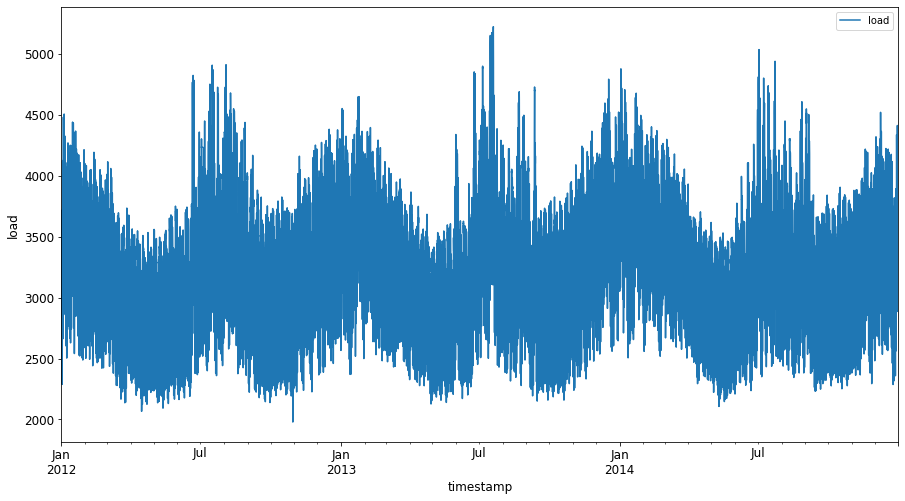
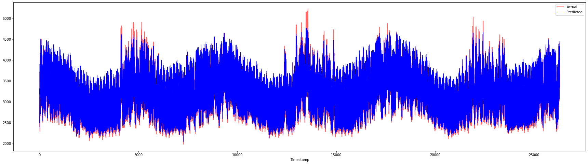

<!--
CO_OP_TRANSLATOR_METADATA:
{
  "original_hash": "f80e513b3279869e7661e3190cc83076",
  "translation_date": "2025-08-29T13:17:17+00:00",
  "source_file": "7-TimeSeries/3-SVR/README.md",
  "language_code": "tl"
}
-->
# Pagtataya ng Time Series gamit ang Support Vector Regressor

Sa nakaraang aralin, natutunan mo kung paano gamitin ang ARIMA model para gumawa ng mga prediksyon sa time series. Ngayon, tatalakayin natin ang Support Vector Regressor model, isang uri ng regressor model na ginagamit para hulaan ang mga tuloy-tuloy na datos.

## [Pre-lecture quiz](https://gray-sand-07a10f403.1.azurestaticapps.net/quiz/51/) 

## Panimula

Sa araling ito, matutuklasan mo ang isang partikular na paraan ng paggawa ng mga modelo gamit ang [**SVM**: **S**upport **V**ector **M**achine](https://en.wikipedia.org/wiki/Support-vector_machine) para sa regression, o **SVR: Support Vector Regressor**. 

### SVR sa konteksto ng time series [^1]

Bago maunawaan ang kahalagahan ng SVR sa prediksyon ng time series, narito ang ilang mahahalagang konsepto na kailangan mong malaman:

- **Regression:** Isang supervised learning technique na ginagamit upang hulaan ang tuloy-tuloy na mga halaga mula sa isang hanay ng mga input. Ang ideya ay magkasya ng isang kurba (o linya) sa feature space na may pinakamaraming bilang ng mga data point. [I-click dito](https://en.wikipedia.org/wiki/Regression_analysis) para sa karagdagang impormasyon.
- **Support Vector Machine (SVM):** Isang uri ng supervised machine learning model na ginagamit para sa classification, regression, at outliers detection. Ang modelo ay isang hyperplane sa feature space, na sa kaso ng classification ay nagsisilbing boundary, at sa kaso ng regression ay nagsisilbing best-fit line. Sa SVM, karaniwang ginagamit ang Kernel function upang i-transform ang dataset sa isang space na may mas mataas na bilang ng dimensyon, upang mas madaling maihiwalay ang mga ito. [I-click dito](https://en.wikipedia.org/wiki/Support-vector_machine) para sa karagdagang impormasyon tungkol sa SVMs.
- **Support Vector Regressor (SVR):** Isang uri ng SVM na ginagamit upang mahanap ang best-fit line (na sa kaso ng SVM ay isang hyperplane) na may pinakamaraming bilang ng mga data point.

### Bakit SVR? [^1]

Sa nakaraang aralin, natutunan mo ang tungkol sa ARIMA, na isang matagumpay na statistical linear method para sa pag-forecast ng time series data. Gayunpaman, sa maraming kaso, ang time series data ay may *non-linearity* na hindi kayang i-map ng mga linear na modelo. Sa ganitong mga kaso, ang kakayahan ng SVM na isaalang-alang ang non-linearity sa datos para sa regression tasks ay nagiging dahilan kung bakit matagumpay ang SVR sa time series forecasting.

## Ehersisyo - gumawa ng SVR model

Ang mga unang hakbang para sa paghahanda ng datos ay pareho sa nakaraang aralin tungkol sa [ARIMA](https://github.com/microsoft/ML-For-Beginners/tree/main/7-TimeSeries/2-ARIMA). 

Buksan ang [_/working_](https://github.com/microsoft/ML-For-Beginners/tree/main/7-TimeSeries/3-SVR/working) folder sa araling ito at hanapin ang [_notebook.ipynb_](https://github.com/microsoft/ML-For-Beginners/blob/main/7-TimeSeries/3-SVR/working/notebook.ipynb) file.[^2]

1. Patakbuhin ang notebook at i-import ang mga kinakailangang library:  [^2]

   ```python
   import sys
   sys.path.append('../../')
   ```

   ```python
   import os
   import warnings
   import matplotlib.pyplot as plt
   import numpy as np
   import pandas as pd
   import datetime as dt
   import math
   
   from sklearn.svm import SVR
   from sklearn.preprocessing import MinMaxScaler
   from common.utils import load_data, mape
   ```

2. I-load ang data mula sa `/data/energy.csv` file papunta sa isang Pandas dataframe at tingnan ito:  [^2]

   ```python
   energy = load_data('../../data')[['load']]
   ```

3. I-plot ang lahat ng available na energy data mula Enero 2012 hanggang Disyembre 2014: [^2]

   ```python
   energy.plot(y='load', subplots=True, figsize=(15, 8), fontsize=12)
   plt.xlabel('timestamp', fontsize=12)
   plt.ylabel('load', fontsize=12)
   plt.show()
   ```

   

   Ngayon, gawin natin ang ating SVR model.

### Gumawa ng training at testing datasets

Ngayon na na-load na ang iyong data, maaari mo na itong hatiin sa train at test sets. Pagkatapos, i-reshape ang data upang makabuo ng isang time-step based dataset na kakailanganin para sa SVR. Ite-train mo ang iyong modelo sa train set. Kapag natapos na ang training ng modelo, susuriin mo ang katumpakan nito sa training set, testing set, at pagkatapos ay sa buong dataset upang makita ang kabuuang performance. Kailangan mong tiyakin na ang test set ay sumasaklaw sa mas huling panahon kumpara sa training set upang matiyak na ang modelo ay hindi makakakuha ng impormasyon mula sa mga hinaharap na panahon [^2] (isang sitwasyon na tinatawag na *Overfitting*).

1. Maglaan ng dalawang-buwang panahon mula Setyembre 1 hanggang Oktubre 31, 2014 para sa training set. Ang test set ay magsasama ng dalawang-buwang panahon mula Nobyembre 1 hanggang Disyembre 31, 2014: [^2]

   ```python
   train_start_dt = '2014-11-01 00:00:00'
   test_start_dt = '2014-12-30 00:00:00'
   ```

2. I-visualize ang mga pagkakaiba: [^2]

   ```python
   energy[(energy.index < test_start_dt) & (energy.index >= train_start_dt)][['load']].rename(columns={'load':'train'}) \
       .join(energy[test_start_dt:][['load']].rename(columns={'load':'test'}), how='outer') \
       .plot(y=['train', 'test'], figsize=(15, 8), fontsize=12)
   plt.xlabel('timestamp', fontsize=12)
   plt.ylabel('load', fontsize=12)
   plt.show()
   ```

   

### Ihanda ang data para sa training

Ngayon, kailangan mong ihanda ang data para sa training sa pamamagitan ng pag-filter at pag-scale ng iyong data. I-filter ang iyong dataset upang isama lamang ang mga kinakailangang panahon at mga column, at i-scale ito upang matiyak na ang data ay nasa interval na 0,1.

1. I-filter ang orihinal na dataset upang isama lamang ang mga nabanggit na panahon bawat set at isama lamang ang kinakailangang column na 'load' kasama ang petsa: [^2]

   ```python
   train = energy.copy()[(energy.index >= train_start_dt) & (energy.index < test_start_dt)][['load']]
   test = energy.copy()[energy.index >= test_start_dt][['load']]
   
   print('Training data shape: ', train.shape)
   print('Test data shape: ', test.shape)
   ```

   ```output
   Training data shape:  (1416, 1)
   Test data shape:  (48, 1)
   ```
   
2. I-scale ang training data upang ito ay nasa saklaw na (0, 1): [^2]

   ```python
   scaler = MinMaxScaler()
   train['load'] = scaler.fit_transform(train)
   ```
   
4. Ngayon, i-scale ang testing data: [^2]

   ```python
   test['load'] = scaler.transform(test)
   ```

### Gumawa ng data gamit ang time-steps [^1]

Para sa SVR, kailangan mong i-transform ang input data upang maging anyong `[batch, timesteps]`. Kaya, i-reshape ang umiiral na `train_data` at `test_data` upang magkaroon ng bagong dimensyon na tumutukoy sa timesteps.

```python
# Converting to numpy arrays
train_data = train.values
test_data = test.values
```

Para sa halimbawang ito, gagamitin natin ang `timesteps = 5`. Kaya, ang mga input sa modelo ay ang data para sa unang 4 na timesteps, at ang output ay ang data para sa ika-5 timestep.

```python
timesteps=5
```

Pag-convert ng training data sa 2D tensor gamit ang nested list comprehension:

```python
train_data_timesteps=np.array([[j for j in train_data[i:i+timesteps]] for i in range(0,len(train_data)-timesteps+1)])[:,:,0]
train_data_timesteps.shape
```

```output
(1412, 5)
```

Pag-convert ng testing data sa 2D tensor:

```python
test_data_timesteps=np.array([[j for j in test_data[i:i+timesteps]] for i in range(0,len(test_data)-timesteps+1)])[:,:,0]
test_data_timesteps.shape
```

```output
(44, 5)
```

Pagpili ng inputs at outputs mula sa training at testing data:

```python
x_train, y_train = train_data_timesteps[:,:timesteps-1],train_data_timesteps[:,[timesteps-1]]
x_test, y_test = test_data_timesteps[:,:timesteps-1],test_data_timesteps[:,[timesteps-1]]

print(x_train.shape, y_train.shape)
print(x_test.shape, y_test.shape)
```

```output
(1412, 4) (1412, 1)
(44, 4) (44, 1)
```

### Ipatupad ang SVR [^1]

Ngayon, oras na upang ipatupad ang SVR. Para sa karagdagang impormasyon tungkol sa implementasyong ito, maaari kang sumangguni sa [dokumentasyong ito](https://scikit-learn.org/stable/modules/generated/sklearn.svm.SVR.html). Para sa ating implementasyon, sundin ang mga hakbang na ito:

1. Tukuyin ang modelo sa pamamagitan ng pagtawag sa `SVR()` at paglagay ng mga hyperparameter ng modelo: kernel, gamma, c, at epsilon.
2. Ihanda ang modelo para sa training data sa pamamagitan ng pagtawag sa `fit()` function.
3. Gumawa ng mga prediksyon gamit ang `predict()` function.

Ngayon, gagawa tayo ng SVR model. Dito, gagamitin natin ang [RBF kernel](https://scikit-learn.org/stable/modules/svm.html#parameters-of-the-rbf-kernel), at itatakda ang mga hyperparameter na gamma, C, at epsilon bilang 0.5, 10, at 0.05 ayon sa pagkakasunod.

```python
model = SVR(kernel='rbf',gamma=0.5, C=10, epsilon = 0.05)
```

#### I-fit ang modelo sa training data [^1]

```python
model.fit(x_train, y_train[:,0])
```

```output
SVR(C=10, cache_size=200, coef0=0.0, degree=3, epsilon=0.05, gamma=0.5,
    kernel='rbf', max_iter=-1, shrinking=True, tol=0.001, verbose=False)
```

#### Gumawa ng mga prediksyon gamit ang modelo [^1]

```python
y_train_pred = model.predict(x_train).reshape(-1,1)
y_test_pred = model.predict(x_test).reshape(-1,1)

print(y_train_pred.shape, y_test_pred.shape)
```

```output
(1412, 1) (44, 1)
```

Nagawa mo na ang iyong SVR! Ngayon, kailangan nating suriin ito.

### Suriin ang iyong modelo [^1]

Para sa pagsusuri, una nating i-scale pabalik ang data sa orihinal nitong sukat. Pagkatapos, upang suriin ang performance, i-plot ang orihinal at predicted na time series plot, at i-print ang resulta ng MAPE.

I-scale pabalik ang predicted at orihinal na output:

```python
# Scaling the predictions
y_train_pred = scaler.inverse_transform(y_train_pred)
y_test_pred = scaler.inverse_transform(y_test_pred)

print(len(y_train_pred), len(y_test_pred))
```

```python
# Scaling the original values
y_train = scaler.inverse_transform(y_train)
y_test = scaler.inverse_transform(y_test)

print(len(y_train), len(y_test))
```

#### Suriin ang performance ng modelo sa training at testing data [^1]

Kunin ang mga timestamp mula sa dataset upang ipakita sa x-axis ng ating plot. Tandaan na ginagamit natin ang unang ```timesteps-1``` na mga halaga bilang input para sa unang output, kaya ang mga timestamp para sa output ay magsisimula pagkatapos nito.

```python
train_timestamps = energy[(energy.index < test_start_dt) & (energy.index >= train_start_dt)].index[timesteps-1:]
test_timestamps = energy[test_start_dt:].index[timesteps-1:]

print(len(train_timestamps), len(test_timestamps))
```

```output
1412 44
```

I-plot ang mga prediksyon para sa training data:

```python
plt.figure(figsize=(25,6))
plt.plot(train_timestamps, y_train, color = 'red', linewidth=2.0, alpha = 0.6)
plt.plot(train_timestamps, y_train_pred, color = 'blue', linewidth=0.8)
plt.legend(['Actual','Predicted'])
plt.xlabel('Timestamp')
plt.title("Training data prediction")
plt.show()
```


I-print ang MAPE para sa training data:

```python
print('MAPE for training data: ', mape(y_train_pred, y_train)*100, '%')
```

```output
MAPE for training data: 1.7195710200875551 %
```

I-plot ang mga prediksyon para sa testing data:

```python
plt.figure(figsize=(10,3))
plt.plot(test_timestamps, y_test, color = 'red', linewidth=2.0, alpha = 0.6)
plt.plot(test_timestamps, y_test_pred, color = 'blue', linewidth=0.8)
plt.legend(['Actual','Predicted'])
plt.xlabel('Timestamp')
plt.show()
```


I-print ang MAPE para sa testing data:

```python
print('MAPE for testing data: ', mape(y_test_pred, y_test)*100, '%')
```

```output
MAPE for testing data:  1.2623790187854018 %
```

🏆 Napakagandang resulta sa testing dataset!

### Suriin ang performance ng modelo sa buong dataset [^1]

```python
# Extracting load values as numpy array
data = energy.copy().values

# Scaling
data = scaler.transform(data)

# Transforming to 2D tensor as per model input requirement
data_timesteps=np.array([[j for j in data[i:i+timesteps]] for i in range(0,len(data)-timesteps+1)])[:,:,0]
print("Tensor shape: ", data_timesteps.shape)

# Selecting inputs and outputs from data
X, Y = data_timesteps[:,:timesteps-1],data_timesteps[:,[timesteps-1]]
print("X shape: ", X.shape,"\nY shape: ", Y.shape)
```

```output
Tensor shape:  (26300, 5)
X shape:  (26300, 4) 
Y shape:  (26300, 1)
```

```python
# Make model predictions
Y_pred = model.predict(X).reshape(-1,1)

# Inverse scale and reshape
Y_pred = scaler.inverse_transform(Y_pred)
Y = scaler.inverse_transform(Y)
```

```python
plt.figure(figsize=(30,8))
plt.plot(Y, color = 'red', linewidth=2.0, alpha = 0.6)
plt.plot(Y_pred, color = 'blue', linewidth=0.8)
plt.legend(['Actual','Predicted'])
plt.xlabel('Timestamp')
plt.show()
```



```python
print('MAPE: ', mape(Y_pred, Y)*100, '%')
```

```output
MAPE:  2.0572089029888656 %
```

🏆 Napakagandang mga plot, nagpapakita ng modelo na may mahusay na katumpakan. Magaling!

---

## 🚀Hamunin

- Subukang baguhin ang mga hyperparameter (gamma, C, epsilon) habang ginagawa ang modelo at suriin ito sa data upang makita kung aling set ng hyperparameter ang nagbibigay ng pinakamahusay na resulta sa testing data. Para sa karagdagang impormasyon tungkol sa mga hyperparameter na ito, maaari kang sumangguni sa dokumento [dito](https://scikit-learn.org/stable/modules/svm.html#parameters-of-the-rbf-kernel). 
- Subukang gumamit ng iba't ibang kernel functions para sa modelo at suriin ang kanilang performance sa dataset. Makakatulong ang dokumento na matatagpuan [dito](https://scikit-learn.org/stable/modules/svm.html#kernel-functions).
- Subukang gumamit ng iba't ibang halaga para sa `timesteps` para sa modelo upang tumingin pabalik para gumawa ng prediksyon.

## [Post-lecture quiz](https://gray-sand-07a10f403.1.azurestaticapps.net/quiz/52/)

## Review at Pag-aaral sa Sarili

Ang araling ito ay nagpakilala sa aplikasyon ng SVR para sa Time Series Forecasting. Para sa karagdagang impormasyon tungkol sa SVR, maaari kang sumangguni sa [blog na ito](https://www.analyticsvidhya.com/blog/2020/03/support-vector-regression-tutorial-for-machine-learning/). Ang [dokumentasyong ito sa scikit-learn](https://scikit-learn.org/stable/modules/svm.html) ay nagbibigay ng mas komprehensibong paliwanag tungkol sa SVMs sa pangkalahatan, [SVRs](https://scikit-learn.org/stable/modules/svm.html#regression), at iba pang detalye ng implementasyon tulad ng iba't ibang [kernel functions](https://scikit-learn.org/stable/modules/svm.html#kernel-functions) na maaaring gamitin, at ang kanilang mga parameter.

## Takdang Aralin

[Isang bagong SVR model](assignment.md)

## Mga Kredito

[^1]: Ang teksto, code, at output sa seksyong ito ay kontribusyon ni [@AnirbanMukherjeeXD](https://github.com/AnirbanMukherjeeXD)  
[^2]: Ang teksto, code, at output sa seksyong ito ay kinuha mula sa [ARIMA](https://github.com/microsoft/ML-For-Beginners/tree/main/7-TimeSeries/2-ARIMA)

---

**Paunawa**:  
Ang dokumentong ito ay isinalin gamit ang AI translation service na [Co-op Translator](https://github.com/Azure/co-op-translator). Bagama't sinisikap naming maging tumpak, pakitandaan na ang mga awtomatikong pagsasalin ay maaaring maglaman ng mga pagkakamali o hindi pagkakatugma. Ang orihinal na dokumento sa orihinal nitong wika ang dapat ituring na opisyal na sanggunian. Para sa mahalagang impormasyon, inirerekomenda ang propesyonal na pagsasalin ng tao. Hindi kami mananagot sa anumang hindi pagkakaunawaan o maling interpretasyon na maaaring magmula sa paggamit ng pagsasaling ito.