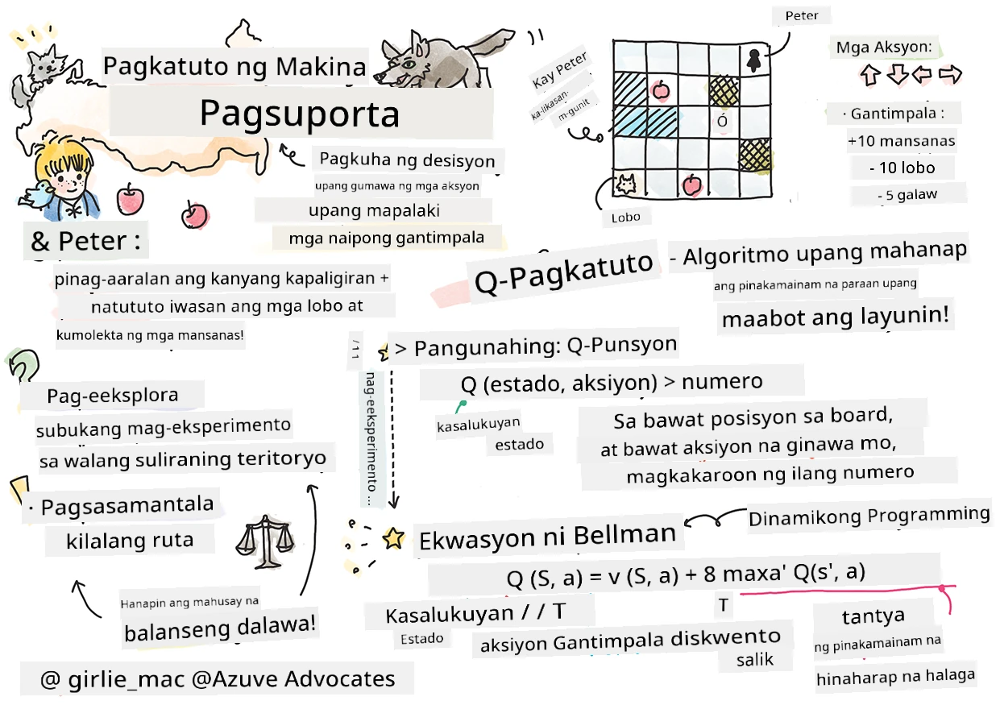
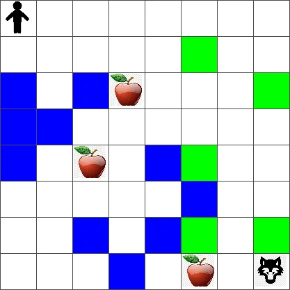

# Panimula sa Reinforcement Learning at Q-Learning


> Sketchnote ni [Tomomi Imura](https://www.twitter.com/girlie_mac)

Kinasasangkutan ng reinforcement learning ang tatlong mahahalagang konsepto: ang ahente, ilang estado, at isang set ng mga aksyon bawat estado. Sa pamamagitan ng pagsasagawa ng isang aksyon sa isang tinukoy na estado, ang ahente ay binibigyan ng gantimpala. Isipin muli ang laro sa computer na Super Mario. Ikaw si Mario, nasa isang antas ng laro, nakatayo sa tabi ng gilid ng bangin. Sa itaas mo ay isang barya. Ikaw bilang Mario, sa isang antas ng laro, sa isang tiyak na posisyon ... iyon ang iyong estado. Ang paglipat ng isang hakbang pakanan (isang aksyon) ay magtutulak sa iyo na malaglag sa gilid, at iyon ay magbibigay sa iyo ng mababang numerikal na puntos. Gayunpaman, ang pagpindot sa jump button ay magbibigay-daan sa iyo upang makakuha ng puntos at mananatili kang buhay. Iyon ay isang positibong kinalabasan at dapat kang bigyan ng positibong numerikal na puntos.

Sa pamamagitan ng paggamit ng reinforcement learning at isang simulator (ang laro), maaari mong matutunan kung paano laruin ang laro upang makatanggap ng pinakadakilang gantimpala na nananatiling buhay at nakakakuha ng maraming puntos hangga't maaari.

[](https://www.youtube.com/watch?v=lDq_en8RNOo)

> 🎥 I-click ang larawan sa itaas upang pakinggan si Dmitry na tinatalakay ang Reinforcement Learning

## [Pre-lecture quiz](https://ff-quizzes.netlify.app/en/ml/)

## Mga Kinakailangan at Setup

Sa leksyong ito, mag-eeksperimento tayo gamit ang ilang code sa Python. Dapat kang makapagpatakbo ng Jupyter Notebook code mula sa leksyon na ito, alinman sa iyong computer o sa cloud.

Maaari mong buksan ang [lesson notebook](https://github.com/microsoft/ML-For-Beginners/blob/main/8-Reinforcement/1-QLearning/notebook.ipynb) at sundan ang leksyon upang makabuo.

> **Tandaan:** Kung binubuksan mo ang code na ito mula sa cloud, kailangan mo ring kunin ang [`rlboard.py`](https://github.com/microsoft/ML-For-Beginners/blob/main/8-Reinforcement/1-QLearning/rlboard.py) na file, na ginagamit sa notebook code. Idagdag ito sa parehong direktoryo ng notebook.

## Panimula

Sa leksyong ito, susuriin natin ang mundo ng **[Peter and the Wolf](https://en.wikipedia.org/wiki/Peter_and_the_Wolf)**, na inspirasyon mula sa isang musikal na kuwentong-bayang isinulat ng isang Ruso na kompositor, si [Sergei Prokofiev](https://en.wikipedia.org/wiki/Sergei_Prokofiev). Gagamitin natin ang **Reinforcement Learning** upang hayaan si Peter na tuklasin ang kanyang paligid, mangalap ng mga masasarap na mansanas at iwasan ang pagharap sa lobo.

**Reinforcement Learning** (RL) ay isang teknik ng pagkatuto na nagbibigay-daan sa atin na matutunan ang pinakamainam na kilos ng isang **ahente** sa ilang **kapaligiran** sa pamamagitan ng maraming eksperimento. Ang isang ahente sa kapaligiran na ito ay dapat magkaroon ng **layunin**, na tinutukoy ng isang **reward function**.

## Ang kapaligiran

Para sa kasimplehan, isipin natin ang mundo ni Peter bilang isang parisukat na board na may sukat na `width` x `height`, ganito:



Bawat cell sa board na ito ay maaaring:

* **lupa**, kung saan maaaring maglakad si Peter at iba pang mga nilalang.
* **tubig**, na syempre ay hindi maaaring lakaran.
* isang **puno** o **damo**, isang lugar kung saan maaaring magpahinga.
* isang **mansanas**, na kumakatawan sa isang bagay na ikalulugod ni Peter na matagpuan upang mapakain ang kanyang sarili.
* isang **lobo**, na delikado at dapat iwasan.

Mayroong hiwalay na Python module, [`rlboard.py`](https://github.com/microsoft/ML-For-Beginners/blob/main/8-Reinforcement/1-QLearning/rlboard.py), na naglalaman ng code para makatrabaho ang kapaligirang ito. Dahil hindi mahalaga ang code na ito para sa pag-unawa sa ating mga konsepto, i-import natin ang module at gagamitin ito upang gumawa ng sample board (code block 1):

```python
from rlboard import *

width, height = 8,8
m = Board(width,height)
m.randomize(seed=13)
m.plot()
```

Dapat ipakita ng code na ito ang isang larawan ng kapaligiran na katulad ng nasa itaas.

## Mga aksyon at polisiya

Sa ating halimbawa, layunin ni Peter na matagpuan ang isang mansanas, habang iniiwasan ang lobo at iba pang mga balakid. Upang magawa ito, maaari siyang maglakad hanggang matagpuan niya ang mansanas.

Kaya, sa anumang posisyon, maaari siyang pumili mula sa mga sumusunod na aksyon: pataas, pababa, pakaliwa at pakanan.

Itutukoy natin ang mga aksyon na ito bilang isang diksyunaryo, at ima-map ang mga ito sa mga pares ng kaukulang pagbabago sa koordinado. Halimbawa, ang paggalaw pakanan (`R`) ay tumutugma sa pares na `(1,0)`. (code block 2):

```python
actions = { "U" : (0,-1), "D" : (0,1), "L" : (-1,0), "R" : (1,0) }
action_idx = { a : i for i,a in enumerate(actions.keys()) }
```

Upang ibuod, ang estratehiya at layunin ng senaryong ito ay ang mga sumusunod:

- **Ang estratehiya**, ng ating ahente (si Peter) ay tinutukoy ng tinatawag na **polisiya**. Ang polisiya ay isang function na nagbabalik ng aksyon sa anumang ibinigay na estado. Sa ating kaso, ang estado ng problema ay kinakatawan ng board, kabilang ang kasalukuyang posisyon ng manlalaro.

- **Ang layunin**, ng reinforcement learning ay sa huli ay matutunan ang isang mabuting polisiya na magpapahintulot sa atin na malutas ang problema nang episyente. Gayunpaman, bilang panimulang punto, isaalang-alang natin ang pinakasimpleng polisiya na tinatawag na **random walk**.

## Random walk

Unahin nating lutasin ang ating problema sa pamamagitan ng pagpapatupad ng isang estratehiya ng random walk. Sa random walk, pipili tayo nang random ng susunod na aksyon mula sa mga pinapahintulutang aksyon, hanggang sa maabot natin ang mansanas (code block 3).

1. Ipatupad ang random walk gamit ang kodigo sa ibaba:

    ```python
    def random_policy(m):
        return random.choice(list(actions))
    
    def walk(m,policy,start_position=None):
        n = 0 # bilang ng mga hakbang
        # itakda ang panimulang posisyon
        if start_position:
            m.human = start_position 
        else:
            m.random_start()
        while True:
            if m.at() == Board.Cell.apple:
                return n # tagumpay!
            if m.at() in [Board.Cell.wolf, Board.Cell.water]:
                return -1 # kinain ng lobo o nalunod
            while True:
                a = actions[policy(m)]
                new_pos = m.move_pos(m.human,a)
                if m.is_valid(new_pos) and m.at(new_pos)!=Board.Cell.water:
                    m.move(a) # isagawa ang aktwal na galaw
                    break
            n+=1
    
    walk(m,random_policy)
    ```

    Ang tawag sa `walk` ay dapat bumalik ng haba ng kaukulang landas, na maaaring mag-iba sa bawat pagtakbo.

1. Patakbuhin ang walk experiment ng ilang ulit (halimbawa, 100), at i-print ang mga resulta ng estadistika (code block 4):

    ```python
    def print_statistics(policy):
        s,w,n = 0,0,0
        for _ in range(100):
            z = walk(m,policy)
            if z<0:
                w+=1
            else:
                s += z
                n += 1
        print(f"Average path length = {s/n}, eaten by wolf: {w} times")
    
    print_statistics(random_policy)
    ```

    Pansinin na ang average na haba ng isang landas ay nasa paligid ng 30-40 hakbang, na medyo marami, kung ikukumpara na ang average na distansya sa pinakamalapit na mansanas ay nasa 5-6 hakbang lamang.

    Maaari mo ring makita kung ano ang hitsura ng paggalaw ni Peter habang nasa random walk:

    

## Reward function

Upang maging mas matalino ang ating polisiya, kailangan nating maunawaan kung alin sa mga galaw ang "mas mabuti" kaysa sa iba. Upang magawa ito, kailangan nating tukuyin ang ating layunin.

Maaari nating tukuyin ang layunin sa pamamagitan ng isang **reward function**, na magbabalik ng ilang halaga ng puntos para sa bawat estado. Mas mataas ang numero, mas mabuti ang reward function. (code block 5)

```python
move_reward = -0.1
goal_reward = 10
end_reward = -10

def reward(m,pos=None):
    pos = pos or m.human
    if not m.is_valid(pos):
        return end_reward
    x = m.at(pos)
    if x==Board.Cell.water or x == Board.Cell.wolf:
        return end_reward
    if x==Board.Cell.apple:
        return goal_reward
    return move_reward
```

Isang kawili-wiling bagay tungkol sa mga reward functions ay sa karamihan ng mga kaso, *binibigyan lang tayo ng malaking gantimpala sa dulo ng laro*. Nangangahulugan ito na ang ating algorithm ay dapat may kakayahang tandaan ang mga "magandang" hakbang na nagdala sa positibong gantimpala sa dulo, at dagdagan ang kahalagahan nito. Gayundin, lahat ng galaw na nagdala sa masamang resulta ay dapat na hadlangan.

## Q-Learning

Ang isang algorithm na tatalakayin natin dito ay tinatawag na **Q-Learning**. Sa algorithm na ito, ang polisiya ay tinutukoy ng isang function (o isang istraktura ng data) na tinatawag na **Q-Table**. Itinatala nito ang "kabutihan" ng bawat isa sa mga aksyon sa isang partikular na estado.

Tinawag itong Q-Table dahil madalas itong isinasalarawan bilang isang table, o multi-dimensional array. Dahil ang ating board ay may sukat na `width` x `height`, maaari nating ilarawan ang Q-Table gamit ang isang numpy array na may hugis na `width` x `height` x `len(actions)`: (code block 6)

```python
Q = np.ones((width,height,len(actions)),dtype=np.float)*1.0/len(actions)
```

Pansinin na ini-initialize natin ang lahat ng mga halaga ng Q-Table sa pantay na halaga, sa ating kaso - 0.25. Ito ay tumutugma sa polisiya ng "random walk", dahil lahat ng galaw sa bawat estado ay pantay na mabuti. Maaari nating ipasa ang Q-Table sa function na `plot` upang makita ang talahanayan sa board: `m.plot(Q)`.


Sa gitna ng bawat cell ay mayroong isang "pana" na nagpapahiwatig ng pinaprefer na direksyon ng pagkilos. Dahil pantay-pantay ang lahat ng direksyon, isang tuldok ang ipinapakita.

Ngayon kailangan nating patakbuhin ang simulasyon, tuklasin ang ating kapaligiran, at matutunan ang mas mahusay na distribusyon ng halaga ng Q-Table, na magpapahintulot sa atin na mabilis na mahanap ang landas patungo sa mansanas.

## Kahulugan ng Q-Learning: Bellman Equation

Kapag nagsimula na tayong gumalaw, ang bawat aksyon ay magkakaroon ng kaukulang gantimpala, i.e. teoritikal na maaari nating piliin ang susunod na aksyon batay sa pinakamataas na agarang gantimpala. Gayunpaman, sa karamihan ng mga estado, ang galaw ay hindi makakamit ang ating layunin na maabot ang mansanas, kaya hindi natin agarang matutukoy kung aling direksyon ang mas mahusay.

> Tandaan na hindi ang agarang resulta ang mahalaga, kundi ang huling resulta, na makukuha natin sa pagtatapos ng simulasyon.

Upang isaalang-alang ang delayed reward na ito, kailangan nating gamitin ang mga prinsipyo ng **[dynamic programming](https://en.wikipedia.org/wiki/Dynamic_programming)**, na nagbibigay-daan sa atin na pag-isipan ang ating problema nang recursive.

Ipinalagay na tayo ay nasa estado *s* ngayon, at nais nating lumipat sa susunod na estado *s'*. Sa paggawa nito, makakatanggap tayo ng agarang gantimpala *r(s,a)*, na tinukoy ng reward function, kasama ng ilang gantimpala sa hinaharap. Kung ipagpapalagay nating tama ang representasyon ng ating Q-Table sa "kapakipakinabang" ng bawat aksyon, sa estado *s'* pipili tayo ng aksyon *a* na tumutugma sa maximum na halaga ng *Q(s',a')*. Kaya, ang pinakamainam na gantimpala sa hinaharap na maaari nating makuha sa estado *s* ay itutukoy bilang `max`<sub>a'</sub>*Q(s',a')* (ang maximum dito ay kinakalkula sa lahat ng posibleng aksyon *a'* sa estado *s'*).

Ito ang nagbibigay ng **Bellman formula** para sa pagkalkula ng halaga ng Q-Table sa estado *s*, ibinigay ang aksyon *a*:


Dito γ ay ang tinatawag na **discount factor** na tumutukoy kung hanggang saan mo gustong pahalagahan ang kasalukuyang gantimpala kumpara sa gantimpala sa hinaharap at vice versa.

## Algorithm ng Pagkatuto

Batay sa ekwasyon sa itaas, maaari na nating isulat ang pseudo-code para sa ating learning algorithm:

* I-initialize ang Q-Table Q na may pantay-pantay na numero para sa lahat ng estado at aksyon
* Itakda ang learning rate α ← 1
* Ulitin ang simulasyon nang maraming beses
   1. Magsimula sa random na posisyon
   1. Ulitin
        1. Pumili ng aksyon *a* sa estado *s*
        2. Isagawa ang aksyon sa pamamagitan ng paglipat sa bagong estado *s'*
        3. Kung makaharap tayo ng end-of-game condition, o maliit lang ang kabuuang gantimpala - lumabas sa simulasyon  
        4. Kalkulahin ang gantimpala *r* sa bagong estado
        5. I-update ang Q-Function ayon sa Bellman equation: *Q(s,a)* ← *(1-α)Q(s,a)+α(r+γ max<sub>a'</sub>Q(s',a'))*
        6. *s* ← *s'*
        7. I-update ang kabuuang gantimpala at bawasan ang α.

## Exploit kumpara sa explore

Sa algorithm sa itaas, hindi natin tinukoy kung paano eksaktong pipili ng aksyon sa hakbang 2.1. Kung pipili tayo ng aksyon nang random, mag-eexplore tayo nang random sa kapaligiran, at malamang na madalas tayong mamatay gayundin mag-eexplore ng mga lugar na hindi natin karaniwang pupuntahan. Isang alternatibong paraan ay ang **exploit** ng Q-Table values na alam na natin, at kaya pipiliin ang pinakamahusay na aksyon (na may mas mataas na Q-Table value) sa estado *s*. Gayunpaman, pipigilan tayo nito mula sa pag-explore ng ibang mga estado, at malamang na hindi natin mahahanap ang pinakamainam na solusyon.

Kaya, ang pinakamahusay na paraan ay magkaroon ng balanse sa pagitan ng exploration at exploitation. Magagawa ito sa pamamagitan ng pagpili ng aksyon sa estado *s* na may mga probabilidad na proporsyonal sa mga halaga sa Q-Table. Sa simula, kapag pantay-pantay ang mga halaga ng Q-Table, ito ay magiging katulad ng random na pagpili, ngunit habang mas maraming nalalaman natin tungkol sa ating kapaligiran, magiging mas malamang na sundan natin ang pinakamainam na ruta habang pinapayagan ang ahente na paminsan-minsang pumili ng hindi pa natutuklasang landas.

## Implementasyon sa Python

Handa na tayo ngayon upang ipatupad ang learning algorithm. Bago natin gawin iyon, kailangan din natin ng isang function na magko-convert ng arbitraryong mga numero sa Q-Table sa isang vector ng mga probabilidad para sa mga kaukulang aksyon.

1. Gumawa ng function na `probs()`:

    ```python
    def probs(v,eps=1e-4):
        v = v-v.min()+eps
        v = v/v.sum()
        return v
    ```

    Nagdagdag tayo ng ilang `eps` sa orihinal na vector upang maiwasan ang paghahati sa 0 sa unang kaso, kung saan lahat ng bahagi ng vector ay magkapareho.

Patakbuhin ang learning algorithm sa pamamagitan ng 5000 eksperimento, na tinatawag ding **epochs**: (code block 8)
```python
    for epoch in range(5000):
    
        # Pumili ng panimulang punto
        m.random_start()
        
        # Magsimulang maglakbay
        n=0
        cum_reward = 0
        while True:
            x,y = m.human
            v = probs(Q[x,y])
            a = random.choices(list(actions),weights=v)[0]
            dpos = actions[a]
            m.move(dpos,check_correctness=False) # Pinapayagan naming lumabas ang manlalaro sa board, na nagtatapos sa episode
            r = reward(m)
            cum_reward += r
            if r==end_reward or cum_reward < -1000:
                lpath.append(n)
                break
            alpha = np.exp(-n / 10e5)
            gamma = 0.5
            ai = action_idx[a]
            Q[x,y,ai] = (1 - alpha) * Q[x,y,ai] + alpha * (r + gamma * Q[x+dpos[0], y+dpos[1]].max())
            n+=1
```

Pagkatapos patakbuhin ang algorithm na ito, ang Q-Table ay dapat na na-update ng mga halagang naglalarawan ng atraksyon ng iba't ibang aksyon sa bawat hakbang. Maaari nating subukang biswal na ipakita ang Q-Table sa pamamagitan ng pagplor ng vector sa bawat cell na magtuturo sa nais na direksyon ng pagkilos. Para sa kasimplehan, gumuhit tayo ng maliit na bilog imbis na arrow head.


## Pag-check ng polisiya

Dahil ang Q-Table ay naglilista ng "kapakinabangan" ng bawat aksyon sa bawat estado, madali itong gamitin upang tukuyin ang episyenteng paglalakbay sa ating mundo. Sa pinakasimpleng kaso, maaari nating piliin ang aksyon na may pinakamataas na halaga sa Q-Table: (code block 9)

```python
def qpolicy_strict(m):
        x,y = m.human
        v = probs(Q[x,y])
        a = list(actions)[np.argmax(v)]
        return a

walk(m,qpolicy_strict)
```


> Kung susubukan mo ang code sa itaas nang ilang ulit, maaaring mapansin mo na minsan ito ay "nahuhuli", at kailangan mong pindutin ang STOP button sa notebook upang interrupt ito. Nangyayari ito dahil maaaring may mga sitwasyon kung saan ang dalawang estado ay "nagtuturo" sa isa't isa sa terminong ng optimal na Q-Value, kung saan ang ahente ay nauuwi sa paggalaw sa pagitan ng mga estadong iyon nang walang katapusan.

## 🚀Hamunin

> **Gawain 1:** Baguhin ang `walk` function upang limitahan ang maximum na haba ng landas sa isang tiyak na bilang ng mga hakbang (sabihin nating 100), at panoorin ang code sa itaas na ibalik ang halagang ito paminsan-minsan.

> **Gawain 2:** Baguhin ang `walk` function upang hindi ito bumalik sa mga lugar kung saan ito ay nakapunta na dati. Mapipigilan nito ang `walk` na paulit-ulit, ngunit maaari pa rin ang ahente na "mapitik" sa isang lokasyon kung saan hindi ito makakatakas.

## Navigasyon

Ang mas mabuting patakaran sa navigasyon ay ang ginamit natin sa panahon ng pagsasanay, na pinagsasama ang exploitation at exploration. Sa patakarang ito, pipili tayo ng bawat aksyon na may tiyak na probabilidad, na proporsyonal sa mga halaga sa Q-Table. Ang estrategiyang ito ay maaari pa ring magresulta sa pagbabalik ng ahente sa isang posisyon na kanyang nasiyasat na, ngunit, tulad ng makikita mo sa code sa ibaba, nagreresulta ito sa napakaikling karaniwang landas patungo sa nais na lokasyon (tandaan na ang `print_statistics` ay nagpapatakbo ng simulation nang 100 beses): (code block 10)

```python
def qpolicy(m):
        x,y = m.human
        v = probs(Q[x,y])
        a = random.choices(list(actions),weights=v)[0]
        return a

print_statistics(qpolicy)
```

Pagkatapos patakbuhin ang code na ito, dapat kang makakuha ng mas maliit na average na haba ng landas kaysa dati, sa saklaw na 3-6.

## Pagsusuri sa proseso ng pagkatuto

Tulad ng nabanggit namin, ang proseso ng pagkatuto ay isang balanse sa pagitan ng exploration at exploitation ng nalinang na kaalaman tungkol sa estruktura ng espasyo ng problema. Nakita natin na ang mga resulta ng pagkatuto (ang kakayahan na tulungan ang isang ahente na makahanap ng maikling landas patungo sa layunin) ay bumuti, ngunit kawili-wili ring obserbahan kung paano kumikilos ang average na haba ng landas sa panahon ng proseso ng pagkatuto:


Ang mga natutunan ay maaaring ibuod bilang:

- **Tumataas ang average na haba ng landas**. Nakikita natin dito na sa simula, tumataas ang average na haba ng landas. Marahil ito ay dahil kapag wala tayong alam tungkol sa kapaligiran, malamang na maipit tayo sa mga hindi magandang estado, tubig o lobo. Habang natututo tayo nang higit pa at nagsisimulang gamitin ang kaalamang ito, maaari nating tuklasin ang kapaligiran nang mas matagal, ngunit hindi pa rin natin masyadong alam kung saan ang mga mansanas.

- **Bumababa ang haba ng landas, habang mas natututo tayo**. Kapag natututo na tayo nang sapat, mas madali para sa ahente na marating ang layunin, at nagsisimulang bumaba ang haba ng landas. Gayunpaman, bukas pa rin tayo sa exploration, kaya madalas tayong lumalayo sa pinakamahusay na landas, at sumusubok ng mga bagong opsyon, na nagpapahaba ng landas kaysa optimal.

- **Biglang tumataas ang haba**. Napapansin din natin sa grap na ito na sa ilang punto, biglang tumaas ang haba. Ito ay nagpapahiwatig ng stochastic na katangian ng proseso, at na maaari nating "masira" ang mga coefficient ng Q-Table sa ilang punto sa pamamagitan ng pagsulat ng mga ito gamit ang mga bagong halaga. Dapat itong mabawasan sa pamamagitan ng pagbaba ng learning rate (halimbawa, sa pagtatapos ng pagsasanay, binabago lang natin ang mga halaga ng Q-Table sa maliit na halaga).

Sa pangkalahatan, mahalagang tandaan na ang tagumpay at kalidad ng proseso ng pagkatuto ay malaki ang nakasalalay sa mga parameter, gaya ng learning rate, learning rate decay, at discount factor. Karaniwang tinatawag ang mga ito na **hyperparameters**, upang maiba ito sa mga **parameters**, na ina-optimize natin sa panahon ng pagsasanay (halimbawa, mga coefficient ng Q-Table). Ang proseso ng paghahanap ng pinakamagandang halaga ng hyperparameter ay tinatawag na **hyperparameter optimization**, at ito ay nararapat ng hiwalay na paksa.

## [Post-lecture quiz](https://ff-quizzes.netlify.app/en/ml/)

## Takdang Aralin 
[Isang Mas Realistikong Mundo](assignment.md)

---

<!-- CO-OP TRANSLATOR DISCLAIMER START -->
**Pagtatanggi**:
Ang dokumentong ito ay isinalin gamit ang serbisyo ng AI translation na [Co-op Translator](https://github.com/Azure/co-op-translator). Bagama't nagsusumikap kami para sa katumpakan, pakatandaan na ang awtomatikong pagsasalin ay maaaring maglaman ng mga pagkakamali o hindi pagkakatugma. Ang orihinal na dokumento sa orihinal nitong wika ang dapat ituring na pangunahing sanggunian. Para sa mahahalagang impormasyon, inirerekomenda ang propesyonal na pagsasalin ng tao. Hindi kami mananagot sa anumang maling pagkakaintindi o maling interpretasyon na nagmula sa paggamit ng pagsasaling ito.
<!-- CO-OP TRANSLATOR DISCLAIMER END -->