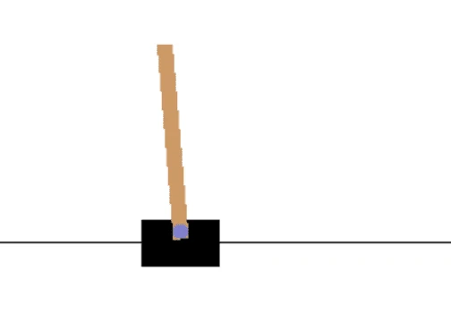

# CartPole Skating

Ang problemang tinutugunan natin sa nakaraang aralin ay maaaring parang larong laro lamang, hindi talaga naaangkop sa mga totoong sitwasyon sa buhay. Ngunit hindi ito ang kaso, dahil maraming totoong problema sa mundo ang may katulad na sitwasyon - kabilang ang paglalaro ng Chess o Go. Magkakatulad sila, dahil mayroon din tayong board na may mga itinakdang patakaran at isang **diskretong estado**.

## [Pre-lecture quiz](https://ff-quizzes.netlify.app/en/ml/)

## Panimula

Sa araling ito ay gagamitin natin ang parehong mga prinsipyo ng Q-Learning sa isang problemang may **tuloy-tuloy na estado**, ibig sabihin, ang estado ay ibinibigay ng isa o higit pang mga totoong numero. Tututukan natin ang sumusunod na problema:

> **Problema**: Kung nais ni Peter na makatakas mula sa lobo, kailangan niyang makagalaw nang mas mabilis. Makikita natin kung paano matututo si Peter na mag-skate, partikular, kung paano mapanatili ang balanse, gamit ang Q-Learning.


> Nagiging malikhain si Peter at ang kanyang mga kaibigan para makatakas sa lobo! Larawan mula kay [Jen Looper](https://twitter.com/jenlooper)

Gagamit tayo ng isang pinaikling bersyon ng pagbalanse na kilala bilang **CartPole** problema. Sa mundo ng cartpole, mayroon tayong pahalang na slider na maaaring ilipat pakaliwa o pakanan, at ang layunin ay balansehin ang isang patayong poste sa ibabaw ng slider.



## Mga Kinakailangan

Sa araling ito, gagamit tayo ng isang library na tinatawag na **OpenAI Gym** upang simulahin ang iba't ibang **kapaligiran**. Maaari mong patakbuhin ang code ng araling ito nang lokal (hal., mula sa Visual Studio Code), kung saan ang simulation ay magbubukas sa bagong bintana. Kapag tumakbo ang code online, maaaring kailangan mong gumawa ng ilang pagbabago sa code, gaya ng nakasaad [dito](https://towardsdatascience.com/rendering-openai-gym-envs-on-binder-and-google-colab-536f99391cc7).

## OpenAI Gym

Sa nakaraang aralin, ang mga patakaran ng laro at ang estado ay ibinigay ng `Board` na klase na ating inilagay. Dito gagamit tayo ng isang espesyal na **simulation environment**, na magsisimula ng pisika sa likod ng balanse ng poste. Isa sa mga pinakasikat na simulation environment para sa pagsasanay ng mga reinforcement learning algorithm ay tinatawag na [Gym](https://gym.openai.com/), na pinangangasiwaan ng [OpenAI](https://openai.com/). Sa pamamagitan ng paggamit ng gym na ito, maaari tayong gumawa ng iba't ibang **kapaligiran** mula sa simulation ng cartpole hanggang sa mga larong Atari.

> **Tandaan**: Maaari mong makita ang iba pang mga kapaligiran mula sa OpenAI Gym [dito](https://gym.openai.com/envs/#classic_control).

Una, i-install natin ang gym at i-import ang mga kinakailangang library (code block 1):

```python
import sys
!{sys.executable} -m pip install gym 

import gym
import matplotlib.pyplot as plt
import numpy as np
import random
```

## Ehersisyo - i-initialize ang cartpole environment

Para magtrabaho sa problemang pagbalanse ng cartpole, kailangan nating i-initialize ang kaukulang environment. Ang bawat environment ay may kaugnayan sa isang:

- **Observation space** na nagtutukoy ng istruktura ng impormasyong natatanggap natin mula sa environment. Sa cartpole na problema, natatanggap natin ang posisyon ng poste, bilis, at ilan pang mga halaga.

- **Action space** na nagtutukoy ng mga posibleng aksyon. Sa ating kaso, ang action space ay discrete, at binubuo ng dalawang aksyon - **kaliwa** at **kanan**. (code block 2)

1. Para i-initialize, i-type ang sumusunod na code:

    ```python
    env = gym.make("CartPole-v1")
    print(env.action_space)
    print(env.observation_space)
    print(env.action_space.sample())
    ```

Para makita kung paano gumagana ang environment, patakbuhin natin ang isang maikling simulation na may 100 hakbang. Sa bawat hakbang, magbibigay tayo ng isa sa mga aksyon na gagawin - sa simulation na ito ay pipili lamang tayo nang random ng aksyon mula sa `action_space`.

1. Patakbuhin ang code sa ibaba at tingnan kung ano ang mangyayari.

    ✅ Tandaan na mas mainam patakbuhin ang code na ito sa lokal na pag-install ng Python! (code block 3)

    ```python
    env.reset()
    
    for i in range(100):
       env.render()
       env.step(env.action_space.sample())
    env.close()
    ```

    Makikita mo ng halos ganito ang imahe:

    

1. Sa panahon ng simulation, kailangan natin kumuha ng mga obserbasyon upang makapagdesisyon kung paano kumilos. Sa katunayan, ang step function ay nagbabalik ng kasalukuyang mga obserbasyon, isang reward function, at ang done flag na nagsasaad kung may saysay pa ba na ipagpatuloy ang simulation o hindi: (code block 4)

    ```python
    env.reset()
    
    done = False
    while not done:
       env.render()
       obs, rew, done, info = env.step(env.action_space.sample())
       print(f"{obs} -> {rew}")
    env.close()
    ```

    Makikita mo ito sa output ng notebook na ganito:

    ```text
    [ 0.03403272 -0.24301182  0.02669811  0.2895829 ] -> 1.0
    [ 0.02917248 -0.04828055  0.03248977  0.00543839] -> 1.0
    [ 0.02820687  0.14636075  0.03259854 -0.27681916] -> 1.0
    [ 0.03113408  0.34100283  0.02706215 -0.55904489] -> 1.0
    [ 0.03795414  0.53573468  0.01588125 -0.84308041] -> 1.0
    ...
    [ 0.17299878  0.15868546 -0.20754175 -0.55975453] -> 1.0
    [ 0.17617249  0.35602306 -0.21873684 -0.90998894] -> 1.0
    ```

    Ang observation vector na ibinabalik sa bawat hakbang ng simulation ay naglalaman ng mga sumusunod na halaga:
    - Posisyon ng cart
    - Bilis ng cart
    - Anggulo ng poste
    - Bilis ng pag-ikot ng poste

1. Kunin ang pinakamababa at pinakamataas na halaga ng mga numerong iyon: (code block 5)

    ```python
    print(env.observation_space.low)
    print(env.observation_space.high)
    ```

    Mapapansin mo rin na ang reward na halaga sa bawat hakbang ng simulation ay palaging 1. Ito ay dahil ang ating layunin ay mabuhay nang pinakamatagal, ibig sabihin, panatilihin ang poste sa makatwirang patayong posisyon sa pinakamahabang panahon.

    ✅ Sa katunayan, ang CartPole simulation ay itinuturing na nalutas kung makakakuha tayo ng average reward na 195 sa loob ng 100 magkasunod na pagsubok.

## Pagdiskreto ng Estado

Sa Q-Learning, kailangan nating bumuo ng Q-Table na nagtutukoy kung ano ang gagawin sa bawat estado. Upang magawa ito, kailangan nating gawing **diskreto** ang estado, mas partikular, dapat itong magkaroon ng hangganang bilang ng mga diskretong halaga. Kaya, kailangan nating **i-diskreto** ang ating mga obserbasyon, inilalapat ito sa isang hangganang hanay ng mga estado.

May ilang paraan para gawin ito:

- **Hatiin sa mga bins**. Kung alam natin ang pagitan ng isang partikular na halaga, maaari nating hatiin ang pagitan na ito sa ilang bilang ng mga **bins**, at pagkatapos ay palitan ang halaga ng bilang ng bin kung saan ito kabilang. Maaari itong gawin gamit ang numpy [`digitize`](https://numpy.org/doc/stable/reference/generated/numpy.digitize.html) na paraan. Sa ganitong kaso, eksaktong malalaman natin ang laki ng estado, dahil ito ay nakasalalay sa bilang ng mga bin na pinili natin para sa digitalization.
  
✅ Maaari tayong gumamit ng linear interpolation upang ilagay ang mga halaga sa isang hangganang pagitan (halimbawa, mula -20 hanggang 20), at pagkatapos ay gawing integer ang mga numero sa pamamagitan ng pag-round. Nagbibigay ito ng kaunting mas kaunting kontrol sa laki ng estado, lalo na kung hindi natin alam ang eksaktong saklaw ng mga input na halaga. Halimbawa, sa ating kaso, 2 sa 4 na halaga ay walang mga itinatakdang itaas/ibabang hangganan ng mga halaga, na maaaring magresulta sa walang katapusang bilang ng mga estado.

Sa ating halimbawa, pipiliin natin ang pangalawang paraan. Tulad ng mapapansin mo mamaya, sa kabila ng hindi itinatakdang mga itaas/ibabang hangganan, bihira lamang kuhanin ng mga halagang iyon ang mga halaga sa labas ng tiyak na mga hangganang interval, kaya ang mga estado na may matinding mga halaga ay magiging bihira.

1. Narito ang function na tatanggap ng obserbasyon mula sa ating modelo at gagawa ng tuple ng 4 na integer na halaga: (code block 6)

    ```python
    def discretize(x):
        return tuple((x/np.array([0.25, 0.25, 0.01, 0.1])).astype(np.int))
    ```

1. Tuklasin natin ang isa pang paraan ng pagdiskreto gamit ang mga bins: (code block 7)

    ```python
    def create_bins(i,num):
        return np.arange(num+1)*(i[1]-i[0])/num+i[0]
    
    print("Sample bins for interval (-5,5) with 10 bins\n",create_bins((-5,5),10))
    
    ints = [(-5,5),(-2,2),(-0.5,0.5),(-2,2)] # mga pagitan ng mga halaga para sa bawat parametro
    nbins = [20,20,10,10] # bilang ng mga lalagyan para sa bawat parametro
    bins = [create_bins(ints[i],nbins[i]) for i in range(4)]
    
    def discretize_bins(x):
        return tuple(np.digitize(x[i],bins[i]) for i in range(4))
    ```

1. Patakbuhin natin ngayon ang isang maikling simulation at obserbahan ang mga diskretong halaga ng environment. Subukan mo ang pareho `discretize` at `discretize_bins` at tingnan kung may pagkakaiba.

    ✅ Ang discretize_bins ay nagbabalik ng bilang ng bin, na 0-based. Kaya para sa mga halaga ng input variable na malapit sa 0, ibinabalik nito ang numero mula sa gitna ng interval (10). Sa discretize, hindi natin pinansin ang saklaw ng output values, kaya maaari itong maging negatibo, kaya ang mga estado ay hindi na-shift, at ang 0 ay tumutugma sa 0. (code block 8)

    ```python
    env.reset()
    
    done = False
    while not done:
       #ipakita.env()
       obs, rew, done, info = env.step(env.action_space.sample())
       #print(paghati_hati_bins(obs))
       print(discretize(obs))
    env.close()
    ```

    ✅ I-uncomment ang linya na nagsisimula sa env.render kung gusto mong makita kung paano gumagana ang environment. Kung hindi, maaari mo itong patakbuhin sa background, na mas mabilis. Gagamitin natin ang "invisible" na pagpapatakbo na ito sa ating proseso ng Q-Learning.

## Ang istruktura ng Q-Table

Sa nakaraang aralin, ang estado ay isang simpleng pares ng numero mula 0 hanggang 8, kaya naging madali na i-representa ang Q-Table bilang isang numpy tensor na may hugis na 8x8x2. Kung gagamit tayo ng bins discretization, ang laki ng ating state vector ay kilala rin, kaya maaari nating gamitin ang parehong pamamaraang ito at i-representa ang estado bilang isang array ng hugis 20x20x10x10x2 (dito, ang 2 ay dimensyon ng action space, at ang mga pangunahing dimensyon ay tumutukoy sa bilang ng mga bin na pinili nating gamitin para sa bawat parameter sa observation space).

Gayunpaman, minsan hindi alam ang tumpak na dimensyon ng observation space. Sa kaso ng `discretize` na function, maaaring hindi tayo sigurado na ang ating estado ay mananatili sa loob ng ilang limitasyon, dahil ang ilan sa mga orihinal na halaga ay walang hangganan. Kaya, gagamit tayo ng ibang pamamaraan at i-representa ang Q-Table bilang isang diksyunaryo.

1. Gamitin ang pares na *(state, action)* bilang susi ng diksyunaryo, at ang halaga ay magiging kaugnay na Q-Table entry. (code block 9)

    ```python
    Q = {}
    actions = (0,1)
    
    def qvalues(state):
        return [Q.get((state,a),0) for a in actions]
    ```

    Dito rin tayo nagtatakda ng function na `qvalues()`, na nagbabalik ng listahan ng mga halaga ng Q-Table para sa isang ibinigay na estado na tumutugma sa lahat ng posibleng mga aksyon. Kapag wala ang entry sa Q-Table, magbabalik tayo ng 0 bilang default.

## Simulan natin ang Q-Learning

Handa na tayong turuan si Peter na magbalanse!

1. Una, itakda natin ang ilang hyperparameters: (code block 10)

    ```python
    # mga hyperparameter
    alpha = 0.3
    gamma = 0.9
    epsilon = 0.90
    ```

    Dito, ang `alpha` ay ang **learning rate** na nagtutukoy kung hanggang saan natin dapat baguhin ang kasalukuyang mga halaga ng Q-Table sa bawat hakbang. Sa nakaraang aralin nagsimula tayo sa 1, at pagkatapos ay unti-unting binawasan ang `alpha` habang ang pagsasanay ay nagpapatuloy. Sa halimbawa na ito, panatilihin natin itong constant para sa pagiging simple, at maaari kang mag-eksperimento sa pag-adjust ng mga halaga ng `alpha` mamaya.

    Ang `gamma` ay ang **discount factor** na nagpapakita kung hanggang kailan natin priyoridadin ang hinaharap na reward kaysa sa kasalukuyang reward.

    Ang `epsilon` ay ang **exploration/exploitation factor** na tumutukoy kung mas gusto natin ang exploration kaysa exploitation o kabaligtaran. Sa ating algorithm, sa `epsilon` porsyento ng mga kaso ay pipili tayo ng susunod na aksyon ayon sa mga halaga ng Q-Table, at sa natitirang mga kaso ay magsasagawa tayo ng random na aksyon. Pinapayagan tayo nitong tuklasin ang mga bahagi ng search space na hindi pa natin nasusubukan.

    ✅ Sa konteksto ng pagbalanse - ang pagpili ng random na aksyon (exploration) ay magsisilbing isang random na palo sa maling direksyon, at kailangang matuto ang poste kung paano ibalik ang balanse mula sa mga "pagkakamaling" iyon.

### Pagbutihin ang algorithm

Maaari rin nating gawin ang dalawang pagpapabuti sa ating algorithm mula sa nakaraang aralin:

- **Kalkulahin ang average cumulative reward**, sa isang bilang ng mga simulation. Ipi-print natin ang progreso bawat 5000 na iterasyon, at aaralin ang average ng ating cumulative reward sa loob ng panahong iyon. Nangangahulugan ito na kung makakakuha tayo ng higit sa 195 na puntos - maaari nating ituring na nalutas ang problema, na may mas mataas na kalidad kaysa sa kinakailangan.
  
- **Kalkulahin ang maximum average cumulative result**, `Qmax`, at itatago natin ang Q-Table na tumutugma sa resulta na iyon. Kapag pinatakbo mo ang training mapapansin mo na minsan ang average cumulative result ay nagsisimulang bumaba, kaya nais nating panatilihin ang mga halaga ng Q-Table na tumutukoy sa pinakamahusay na modelong naobserbahan sa panahon ng pagsasanay.

1. Kolektahin lahat ng cumulative rewards sa bawat simulation sa `rewards` vector para sa susunod na pag-plot. (code block  11)

    ```python
    def probs(v,eps=1e-4):
        v = v-v.min()+eps
        v = v/v.sum()
        return v
    
    Qmax = 0
    cum_rewards = []
    rewards = []
    for epoch in range(100000):
        obs = env.reset()
        done = False
        cum_reward=0
        # == gawin ang simulasyon ==
        while not done:
            s = discretize(obs)
            if random.random()<epsilon:
                # pagsasamantala - piliin ang aksyon ayon sa mga posibilidad ng Q-Table
                v = probs(np.array(qvalues(s)))
                a = random.choices(actions,weights=v)[0]
            else:
                # paggalugad - pumili ng aksyon nang random
                a = np.random.randint(env.action_space.n)
    
            obs, rew, done, info = env.step(a)
            cum_reward+=rew
            ns = discretize(obs)
            Q[(s,a)] = (1 - alpha) * Q.get((s,a),0) + alpha * (rew + gamma * max(qvalues(ns)))
        cum_rewards.append(cum_reward)
        rewards.append(cum_reward)
        # == Panandaliang iprint ang mga resulta at kalkulahin ang average na gantimpala ==
        if epoch%5000==0:
            print(f"{epoch}: {np.average(cum_rewards)}, alpha={alpha}, epsilon={epsilon}")
            if np.average(cum_rewards) > Qmax:
                Qmax = np.average(cum_rewards)
                Qbest = Q
            cum_rewards=[]
    ```

Ano ang maaaring mapansin mula sa mga resulta:

- **Malapit sa ating layunin**. Malapit na tayong maabot ang layuning makakuha ng 195 cumulative rewards sa loob ng higit sa 100 magkasunod na pagtakbo ng simulation, o maaaring nakamit na natin ito! Kahit pa makakuha tayo ng mas maliit na mga numero, hindi pa natin tiyak, dahil ang average ay kinuwenta sa 5000 na pagtakbo, at 100 lamang ang kinakailangan sa pormal na pamantayan.
  
- **Nagsisimulang bumaba ang reward**. Minsan nagsisimulang bumaba ang reward, na nangangahulugang maaari nating "sirain" ang mga natutunan nang mga halaga sa Q-Table gamit ang iba na nagpapalala ng sitwasyon.

Mas malinaw na mapapansin ito kung ipi-plot natin ang progreso ng training.

## Pag-plot ng Progreso ng Pagsasanay

Sa panahon ng pagsasanay, nakolekta natin ang halaga ng cumulative reward sa bawat iterasyon sa loob ng `rewards` vector. Ganito ang hitsura kapag ipini-plot ito laban sa bilang ng iterasyon:

```python
plt.plot(rewards)
```


Mula sa grap na ito, hindi posible na malaman ang anumang bagay, dahil dulot ng kalikasan ng stochastic training process, ang haba ng mga session ng training ay napakahaba ang pagkakaiba. Para magkaroon ng mas malinaw na pagkakaintindi sa grap, maaari nating kalkulahin ang **running average** sa serye ng mga eksperimento, sabihin natin 100. Maaari itong gawin nang madaling gamit ang `np.convolve`: (code block 12)

```python
def running_average(x,window):
    return np.convolve(x,np.ones(window)/window,mode='valid')

plt.plot(running_average(rewards,100))
```


## Pagbabago ng hyperparameters

Para gawing mas matatag ang pagkatuto, makatuwiran na i-adjust ang ilan sa ating mga hyperparameters habang nagpapatuloy ang pagsasanay. Partikular:

- **Para sa learning rate**, `alpha`, maaari tayong magsimula sa mga halagang malapit sa 1, at pagkatapos ay unti-unting babaan ang parametro. Sa paglipas ng panahon, magkakaroon tayo ng magagandang probabilidad sa Q-Table, kaya dapat natin itong i-adjust nang bahagya, at huwag ganap na palitan ng mga bagong halaga.

- **Dagdagan ang epsilon**. Maaaring gusto nating unti-unting dagdagan ang `epsilon`, upang mas konti ang exploration at mas marami ang exploitation. Mukhang makatuwiran na magsimula sa mababang halaga ng `epsilon`, at unti-unting itaas ito hanggang halos 1.

> **Gawain 1**: Maglaro sa mga halaga ng hyperparameter at tingnan kung makakamit mo ang mas mataas na cumulative reward. Nakukuha mo ba ang higit sa 195?


> **Gawain 2**: Upang pormal na malutas ang problema, kailangan mong makakuha ng average na gantimpala na 195 sa loob ng 100 sunod-sunod na pagsubok. Sukatin iyon habang nagsasanay at tiyaking pormal mo nang nalutas ang problema!

## Makita ang resulta sa aksyon

Magiging kawili-wili na talagang makita kung paano kumikilos ang sinanay na modelo. Patakbuhin natin ang simulasyon at sundin ang parehong estratehiya ng pagpili ng aksyon gaya ng sa panahon ng pagsasanay, sampling ayon sa probability distribution sa Q-Table: (code block 13)

```python
obs = env.reset()
done = False
while not done:
   s = discretize(obs)
   env.render()
   v = probs(np.array(qvalues(s)))
   a = random.choices(actions,weights=v)[0]
   obs,_,done,_ = env.step(a)
env.close()
```

Dapat kang makakita ng isang bagay na tulad nito:


---

## 🚀Hamunin

> **Gawain 3**: Dito, ginagamit natin ang huling kopya ng Q-Table, na maaaring hindi ang pinakamainam. Tandaan na itinatago natin ang pinakamagandang gumaganang Q-Table sa variable na `Qbest`! Subukan ang parehong halimbawa gamit ang pinakamagandang gumaganang Q-Table sa pamamagitan ng pagkopya ng `Qbest` papunta sa `Q` at tingnan kung mapapansin mo ang pagkakaiba.

> **Gawain 4**: Dito, hindi tayo pumipili ng pinakamainam na aksyon sa bawat hakbang, kundi sampling ayon sa katumbas na probability distribution. Mas makatuwiran ba na palaging piliin ang pinakamainam na aksyon, na may pinakamataas na halaga sa Q-Table? Maaaring gawin ito gamit ang `np.argmax` na function para malaman ang numero ng aksyon na may pinakamataas na halaga sa Q-Table. Ipatupad ang estratehiyang ito at tingnan kung napapabuti nito ang pagbalanse.

## [Post-lecture quiz](https://ff-quizzes.netlify.app/en/ml/)

## Takdang Aralin
[Sanayin ang Mountain Car](assignment.md)

## Konklusyon

Natutunan na natin ngayon kung paano sanayin ang mga ahente upang makamit ang magagandang resulta sa pamamagitan lamang ng pagbibigay sa kanila ng reward function na naglalarawan ng ninanais na estado ng laro, at sa pagbibigay ng pagkakataon sa kanila na matalinhagang tuklasin ang search space. Matagumpay nating naipinatupad ang Q-Learning algorithm sa mga kaso ng discrete at continuous na mga kapaligiran, pero may discrete na mga aksyon.

Mahalaga ring pag-aralan ang mga sitwasyon kung saan ang action state ay continuous din, at kung ang observation space ay mas kumplikado, gaya ng imahe mula sa screen ng laro sa Atari. Sa mga problemang iyon, madalas nating kailanganing gumamit ng mas makapangyarihang mga teknik sa machine learning, gaya ng neural networks, upang makamit ang magagandang resulta. Ang mga mas advanced na paksa na iyon ay bahagi ng ating paparating na mas advanced na kurso sa AI.

---

<!-- CO-OP TRANSLATOR DISCLAIMER START -->
**Pagtatanggi**:
Ang dokumentong ito ay isinalin gamit ang serbisyo ng AI translation na [Co-op Translator](https://github.com/Azure/co-op-translator). Bagama't nagsusumikap kami para sa katumpakan, pakatandaan na ang awtomatikong pagsasalin ay maaaring maglaman ng mga pagkakamali o hindi pagkakatugma. Ang orihinal na dokumento sa orihinal nitong wika ang dapat ituring na pangunahing sanggunian. Para sa mahahalagang impormasyon, inirerekomenda ang propesyonal na pagsasalin ng tao. Hindi kami mananagot sa anumang maling pagkakaintindi o maling interpretasyon na nagmula sa paggamit ng pagsasaling ito.
<!-- CO-OP TRANSLATOR DISCLAIMER END -->