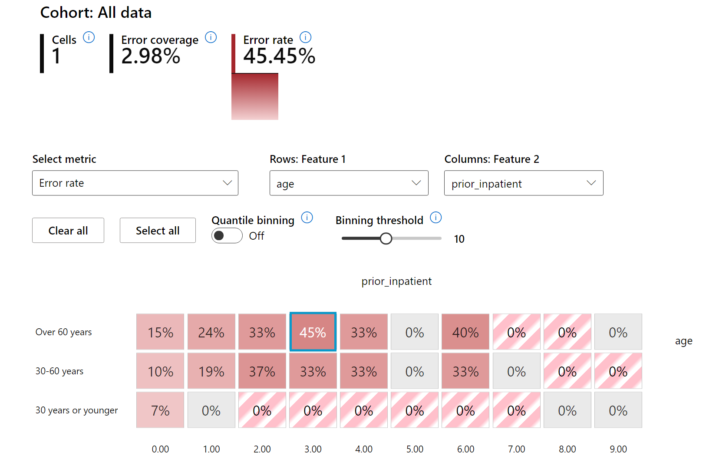

<!--
CO_OP_TRANSLATOR_METADATA:
{
  "original_hash": "ba0f6e1019351351c8ee4c92867b6a0b",
  "translation_date": "2025-08-29T13:34:14+00:00",
  "source_file": "9-Real-World/2-Debugging-ML-Models/README.md",
  "language_code": "tl"
}
-->
# Postscript: Pag-debug ng Modelo sa Machine Learning gamit ang mga Komponent ng Responsible AI Dashboard

## [Pre-lecture quiz](https://gray-sand-07a10f403.1.azurestaticapps.net/quiz/5/)

## Panimula

Ang machine learning ay may malaking epekto sa ating pang-araw-araw na buhay. Ang AI ay unti-unting nagiging bahagi ng mga mahahalagang sistema na nakakaapekto sa atin bilang indibidwal at sa lipunan, mula sa pangangalaga ng kalusugan, pananalapi, edukasyon, at trabaho. Halimbawa, ang mga sistema at modelo ay ginagamit sa mga pang-araw-araw na desisyon tulad ng diagnosis sa kalusugan o pagtukoy ng pandaraya. Dahil dito, ang mabilis na pag-unlad ng AI at ang mas pinalawak na paggamit nito ay nagdudulot ng mas mataas na inaasahan mula sa lipunan at mas mahigpit na regulasyon bilang tugon. Patuloy nating nakikita ang mga pagkakataon kung saan ang mga sistema ng AI ay hindi natutugunan ang mga inaasahan; nagdadala ito ng mga bagong hamon; at nagsisimula nang magpatupad ng regulasyon ang mga gobyerno sa mga solusyon ng AI. Kaya mahalaga na ang mga modelong ito ay masusing suriin upang makapagbigay ng patas, maaasahan, inklusibo, transparent, at responsableng resulta para sa lahat.

Sa kurikulum na ito, tatalakayin natin ang mga praktikal na tool na maaaring gamitin upang suriin kung ang isang modelo ay may mga isyu sa Responsible AI. Ang tradisyunal na mga teknik sa pag-debug ng machine learning ay kadalasang nakabatay sa mga kalkulasyong dami tulad ng pinagsama-samang katumpakan o average na error loss. Isipin kung ano ang maaaring mangyari kapag ang data na ginagamit mo upang bumuo ng mga modelong ito ay kulang sa ilang demograpiko, tulad ng lahi, kasarian, pananaw sa politika, relihiyon, o hindi pantay na kinakatawan ang mga demograpikong ito. Paano kung ang output ng modelo ay pabor sa ilang demograpiko? Maaari itong magdulot ng labis o kulang na representasyon ng mga sensitibong grupo ng tampok na nagreresulta sa mga isyu sa pagiging patas, inklusibo, o maaasahan ng modelo. Isa pang salik ay ang mga modelo ng machine learning ay itinuturing na "black boxes," na nagpapahirap sa pag-unawa at pagpapaliwanag kung ano ang nag-uudyok sa prediksyon ng modelo. Ang lahat ng ito ay mga hamon na kinakaharap ng mga data scientist at AI developer kapag wala silang sapat na tool upang i-debug at suriin ang pagiging patas o pagiging mapagkakatiwalaan ng isang modelo.

Sa araling ito, matututuhan mo ang pag-debug ng iyong mga modelo gamit ang:

- **Error Analysis**: Tukuyin kung saan sa distribusyon ng iyong data ang modelo ay may mataas na error rates.
- **Model Overview**: Magsagawa ng comparative analysis sa iba't ibang data cohorts upang matuklasan ang mga pagkakaiba sa performance metrics ng iyong modelo.
- **Data Analysis**: Suriin kung saan maaaring may labis o kulang na representasyon ng iyong data na maaaring magdulot ng bias sa modelo upang paboran ang isang demograpiko laban sa iba.
- **Feature Importance**: Unawain kung aling mga tampok ang nag-uudyok sa prediksyon ng iyong modelo sa global o lokal na antas.

## Paunang Kaalaman

Bilang paunang kaalaman, mangyaring suriin ang [Responsible AI tools for developers](https://www.microsoft.com/ai/ai-lab-responsible-ai-dashboard)

> 

## Error Analysis

Ang tradisyunal na mga performance metrics ng modelo na ginagamit upang sukatin ang katumpakan ay kadalasang mga kalkulasyon batay sa tama vs maling prediksyon. Halimbawa, ang pagtukoy na ang isang modelo ay tama 89% ng oras na may error loss na 0.001 ay maaaring ituring na magandang performance. Gayunpaman, ang mga error ay kadalasang hindi pantay na ipinamamahagi sa iyong dataset. Maaaring makakuha ka ng 89% na accuracy score ng modelo ngunit matuklasan na may mga rehiyon ng iyong data kung saan nabibigo ang modelo 42% ng oras. Ang epekto ng mga pattern ng pagkabigo na ito sa ilang grupo ng data ay maaaring magdulot ng mga isyu sa pagiging patas o pagiging maaasahan. Mahalagang maunawaan ang mga lugar kung saan mahusay o hindi mahusay ang performance ng modelo. Ang mga rehiyon ng data kung saan may mataas na bilang ng mga kamalian sa iyong modelo ay maaaring maging mahalagang demograpiko ng data.

Ang Error Analysis component sa RAI dashboard ay nagpapakita kung paano ipinamamahagi ang pagkabigo ng modelo sa iba't ibang cohorts gamit ang tree visualization. Ito ay kapaki-pakinabang sa pagtukoy ng mga tampok o lugar kung saan may mataas na error rate sa iyong dataset. Sa pamamagitan ng pagtingin kung saan nagmumula ang karamihan ng mga kamalian ng modelo, maaari mong simulan ang pagsisiyasat sa ugat ng problema. Maaari ka ring lumikha ng mga cohort ng data upang magsagawa ng pagsusuri. Ang mga cohort ng data na ito ay tumutulong sa proseso ng pag-debug upang matukoy kung bakit maganda ang performance ng modelo sa isang cohort ngunit may kamalian sa iba.

Ang mga visual indicator sa tree map ay tumutulong sa mas mabilis na pagtukoy ng mga problemang lugar. Halimbawa, ang mas madilim na lilim ng pulang kulay sa isang tree node ay nagpapahiwatig ng mas mataas na error rate.

Ang heat map ay isa pang visualization functionality na maaaring gamitin ng mga user upang suriin ang error rate gamit ang isa o dalawang tampok upang matukoy ang kontribusyon sa mga kamalian ng modelo sa buong dataset o cohorts.

Gamitin ang error analysis kapag kailangan mong:

* Makakuha ng mas malalim na pag-unawa kung paano ipinamamahagi ang mga pagkabigo ng modelo sa isang dataset at sa iba't ibang input at feature dimensions.
* Hatiin ang pinagsama-samang performance metrics upang awtomatikong matuklasan ang mga erroneous cohorts na magbibigay impormasyon sa iyong targeted mitigation steps.

## Model Overview

Ang pagsusuri sa performance ng isang machine learning model ay nangangailangan ng holistic na pag-unawa sa pag-uugali nito. Maaaring makamit ito sa pamamagitan ng pagsusuri sa higit sa isang metric tulad ng error rate, accuracy, recall, precision, o MAE (Mean Absolute Error) upang matukoy ang mga pagkakaiba sa performance metrics. Ang isang performance metric ay maaaring mukhang maganda, ngunit maaaring maipakita ang mga kamalian sa ibang metric. Bukod dito, ang paghahambing ng mga metrics para sa mga pagkakaiba sa buong dataset o cohorts ay nakakatulong upang makita kung saan mahusay o hindi mahusay ang performance ng modelo. Ito ay lalong mahalaga sa pagsusuri ng performance ng modelo sa mga sensitibo vs hindi sensitibong tampok (hal., lahi ng pasyente, kasarian, o edad) upang matuklasan ang potensyal na hindi pagiging patas ng modelo. Halimbawa, ang pagtuklas na ang modelo ay mas maraming kamalian sa isang cohort na may sensitibong tampok ay maaaring magpakita ng potensyal na hindi pagiging patas ng modelo.

Ang Model Overview component ng RAI dashboard ay tumutulong hindi lamang sa pagsusuri ng performance metrics ng representasyon ng data sa isang cohort, kundi nagbibigay din ito ng kakayahan sa mga user na ihambing ang pag-uugali ng modelo sa iba't ibang cohorts.

Ang functionality ng feature-based analysis ng component ay nagbibigay-daan sa mga user na mag-focus sa mga subgroup ng data sa loob ng isang partikular na tampok upang matukoy ang mga anomalya sa mas detalyadong antas. Halimbawa, ang dashboard ay may built-in intelligence upang awtomatikong bumuo ng mga cohort para sa isang user-selected feature (hal., *"time_in_hospital < 3"* o *"time_in_hospital >= 7"*). Pinapayagan nito ang user na ihiwalay ang isang partikular na tampok mula sa mas malaking grupo ng data upang makita kung ito ay isang pangunahing salik sa mga kamalian ng modelo.

Ang Model Overview component ay sumusuporta sa dalawang klase ng disparity metrics:

**Disparity sa performance ng modelo**: Ang mga set ng metrics na ito ay kinakalkula ang disparity (pagkakaiba) sa mga halaga ng napiling performance metric sa iba't ibang subgroup ng data. Narito ang ilang halimbawa:

* Disparity sa accuracy rate
* Disparity sa error rate
* Disparity sa precision
* Disparity sa recall
* Disparity sa mean absolute error (MAE)

**Disparity sa selection rate**: Ang metric na ito ay naglalaman ng pagkakaiba sa selection rate (favorable prediction) sa mga subgroup. Halimbawa nito ay ang disparity sa loan approval rates. Ang selection rate ay nangangahulugan ng fraction ng data points sa bawat klase na na-classify bilang 1 (sa binary classification) o distribusyon ng prediction values (sa regression).

## Data Analysis

> "Kung pinilit mo ang data nang matagal, aamin ito sa kahit ano" - Ronald Coase

Ang pahayag na ito ay mukhang matindi, ngunit totoo na ang data ay maaaring manipulahin upang suportahan ang anumang konklusyon. Ang ganitong manipulasyon ay minsan nangyayari nang hindi sinasadya. Bilang tao, lahat tayo ay may bias, at madalas mahirap malaman kung kailan tayo nagdadala ng bias sa data. Ang pagtiyak ng pagiging patas sa AI at machine learning ay nananatiling isang kumplikadong hamon.

Ang data ay isang malaking blind spot para sa tradisyunal na performance metrics ng modelo. Maaaring mataas ang accuracy scores mo, ngunit hindi nito palaging naipapakita ang bias sa ilalim ng data na maaaring nasa iyong dataset. Halimbawa, kung ang dataset ng mga empleyado ay may 27% na kababaihan sa mga posisyon ng ehekutibo sa isang kumpanya at 73% na kalalakihan sa parehong antas, ang isang AI model para sa job advertising na sinanay sa data na ito ay maaaring mag-target ng karamihan sa mga kalalakihan para sa senior level job positions. Ang imbalance na ito sa data ay nagdulot ng bias sa prediksyon ng modelo upang paboran ang isang kasarian. Ipinapakita nito ang isang isyu sa pagiging patas kung saan may gender bias sa AI model.

Ang Data Analysis component sa RAI dashboard ay tumutulong upang matukoy ang mga lugar kung saan may labis o kulang na representasyon sa dataset. Tinutulungan nito ang mga user na suriin ang ugat ng mga kamalian at isyu sa pagiging patas na dulot ng imbalance sa data o kakulangan ng representasyon ng isang partikular na grupo ng data. Binibigyan nito ang mga user ng kakayahan na i-visualize ang mga dataset batay sa predicted at actual outcomes, error groups, at mga partikular na tampok. Minsan, ang pagtuklas ng underrepresented na grupo ng data ay maaari ring magpakita na ang modelo ay hindi natututo nang maayos, kaya mataas ang mga kamalian. Ang pagkakaroon ng modelo na may bias sa data ay hindi lamang isang isyu sa pagiging patas kundi nagpapakita rin na ang modelo ay hindi inklusibo o maaasahan.

Gamitin ang data analysis kapag kailangan mong:

* Galugarin ang mga istatistika ng iyong dataset sa pamamagitan ng pagpili ng iba't ibang filter upang hatiin ang iyong data sa iba't ibang dimensyon (kilala rin bilang cohorts).
* Unawain ang distribusyon ng iyong dataset sa iba't ibang cohorts at feature groups.
* Tukuyin kung ang iyong mga natuklasan na may kaugnayan sa pagiging patas, error analysis, at causality (na nakuha mula sa iba pang mga component ng dashboard) ay resulta ng distribusyon ng iyong dataset.
* Magpasya kung saang mga lugar dapat mangolekta ng mas maraming data upang mabawasan ang mga kamalian na dulot ng mga isyu sa representasyon, label noise, feature noise, label bias, at mga katulad na salik.

## Model Interpretability

Ang mga modelo ng machine learning ay kadalasang itinuturing na "black boxes." Ang pag-unawa kung aling mga pangunahing tampok ng data ang nag-uudyok sa prediksyon ng modelo ay maaaring maging hamon. Mahalagang magbigay ng transparency kung bakit gumagawa ng isang partikular na prediksyon ang modelo. Halimbawa, kung ang isang AI system ay nagpredikta na ang isang diabetic na pasyente ay nasa panganib na ma-readmit sa ospital sa loob ng mas mababa sa 30 araw, dapat itong magbigay ng mga sumusuportang data na nagdulot ng prediksyon nito. Ang pagkakaroon ng mga sumusuportang data indicator ay nagdadala ng transparency upang matulungan ang mga clinician o ospital na makagawa ng mas maayos na desisyon. Bukod dito, ang kakayahang ipaliwanag kung bakit gumawa ng prediksyon ang modelo para sa isang indibidwal na pasyente ay nagbibigay ng accountability sa mga regulasyon sa kalusugan. Kapag ginagamit mo ang mga modelo ng machine learning sa mga paraan na nakakaapekto sa buhay ng mga tao, mahalagang maunawaan at maipaliwanag kung ano ang nag-uudyok sa pag-uugali ng modelo. Ang model explainability at interpretability ay tumutulong upang sagutin ang mga tanong sa mga sitwasyon tulad ng:

* Pag-debug ng modelo: Bakit nagkamali ang aking modelo? Paano ko mapapabuti ang aking modelo?
* Pakikipagtulungan ng tao at AI: Paano ko mauunawaan at mapagkakatiwalaan ang mga desisyon ng modelo?
* Pagsunod sa regulasyon: Natutugunan ba ng aking modelo ang mga legal na kinakailangan?

Ang Feature Importance component ng RAI dashboard ay tumutulong sa pag-debug at pagkuha ng komprehensibong pag-unawa kung paano gumagawa ng prediksyon ang modelo. Ito rin ay kapaki-pakinabang na tool para sa mga propesyonal sa machine learning at mga tagapagdesisyon upang ipaliwanag at ipakita ang ebidensya ng mga tampok na nakakaapekto sa pag-uugali ng modelo para sa pagsunod sa regulasyon. Bukod dito, maaaring tuklasin ng mga user ang parehong global at local explanations upang ma-validate kung aling mga tampok ang nag-uudyok sa prediksyon ng modelo. Ang global explanations ay naglilista ng mga pangunahing tampok na nakaapekto sa pangkalahatang prediksyon ng modelo. Ang local explanations ay nagpapakita kung aling mga tampok ang nagdulot ng prediksyon ng modelo para sa isang indibidwal na kaso. Ang kakayahang suriin ang local explanations ay kapaki-pakinabang din sa pag-debug o pag-audit ng isang partikular na kaso upang mas maunawaan at maipaliwanag kung bakit gumawa ng tama o maling prediksyon ang modelo.

* Global explanations: Halimbawa, anong mga tampok ang nakaapekto sa pangkalahatang pag-uugali ng isang diabetes hospital readmission model?
* Local explanations: Halimbawa, bakit ang isang diabetic na pasyente na higit sa 60 taong gulang na may mga nakaraang hospitalizations ay napredikta na ma-readmit o hindi ma-readmit sa loob ng 30 araw pabalik sa ospital?

Sa proseso ng pag-debug ng pagsusuri sa performance ng modelo sa iba't ibang cohorts, ipinapakita ng Feature Importance kung anong antas ng epekto ang mayroon ang isang tampok sa iba't ibang cohorts. Tumutulong ito upang maipakita ang mga anomalya kapag inihambing ang antas ng impluwensya ng tampok sa pag-uudyok ng mga kamalian ng modelo. Ang Feature Importance component ay maaaring magpakita kung aling mga halaga sa isang tampok ang positibo o negatibong nakaapekto sa resulta ng modelo. Halimbawa, kung ang modelo ay gumawa ng maling prediksyon, binibigyan ka ng component ng kakayahan na mag-drill down at tukuyin kung anong mga tampok o halaga ng tampok ang nagdulot ng prediksyon. Ang antas ng detalye na ito ay tumutulong hindi lamang sa pag-debug kundi nagbibigay din ng transparency at accountability sa mga sitwasyon ng pag-audit. Sa wakas, ang component ay maaaring tumulong upang matukoy ang mga isyu sa pagiging patas. Halimbawa, kung ang isang sensitibong tampok tulad ng etnisidad o kasarian ay may mataas na impluwensya sa pag-uudyok ng prediksyon ng modelo, maaaring ito ay senyales ng bias sa lahi o kasarian sa modelo.

Gamitin ang interpretability kapag kailangan mong:

* Tukuyin kung gaano mapagkakatiwalaan ang mga prediksyon ng iyong AI system sa pamamagitan ng pag-unawa kung aling mga tampok ang pinakamahalaga para sa mga prediksyon.
* Lapitan ang pag-debug ng iyong modelo sa pamamagitan ng pag-unawa dito muna at pagtukoy kung ang modelo ay gumagamit ng mga tamang tampok o maling correlations lamang.
* Tuklasin ang mga potensyal na pinagmumulan ng hindi pagiging patas sa pamamagitan ng pag-unawa kung ang modelo ay batay sa mga sensitibong tampok o sa mga tampok na lubos na nauugnay sa mga ito.
* Bumuo ng tiwala ng user sa mga desisyon ng modelo sa pamamagitan ng pagbuo ng local explanations upang ipakita ang kanilang mga resulta.
* Kumpletuhin ang regulatory audit ng isang AI system upang i-validate ang mga modelo at subaybayan ang epekto ng mga desisyon ng modelo sa mga tao.

## Konklusyon

Ang lahat ng mga component ng RAI dashboard ay mga praktikal na tool upang matulungan kang bumuo ng mga modelo ng machine learning na mas hindi nakakapinsala at mas mapagkakatiwalaan sa lipunan. Pinapabuti nito ang pag-iwas sa mga banta sa karapatang pantao; diskriminasyon o pag-aalis sa ilang grupo sa mga oportunidad sa buhay; at ang panganib ng pisikal o sikolohikal na pinsala. Tumutulong din ito upang bumuo ng tiwala sa mga desisyon
- **Sobra o kulang na representasyon**. Ang ideya ay may isang grupo na hindi nakikita sa isang partikular na propesyon, at anumang serbisyo o function na patuloy na nagpo-promote nito ay nagdudulot ng pinsala.

### Azure RAI dashboard

[Azure RAI dashboard](https://learn.microsoft.com/en-us/azure/machine-learning/concept-responsible-ai-dashboard?WT.mc_id=aiml-90525-ruyakubu) ay binuo gamit ang mga open-source na tools na ginawa ng mga nangungunang akademikong institusyon at organisasyon, kabilang ang Microsoft. Ang mga ito ay mahalaga para sa mga data scientist at AI developer upang mas maunawaan ang ugali ng modelo, matuklasan, at mabawasan ang mga hindi kanais-nais na isyu mula sa mga AI model.

- Alamin kung paano gamitin ang iba't ibang bahagi sa pamamagitan ng pag-check sa RAI dashboard [docs.](https://learn.microsoft.com/en-us/azure/machine-learning/how-to-responsible-ai-dashboard?WT.mc_id=aiml-90525-ruyakubu)

- Tingnan ang ilang RAI dashboard [sample notebooks](https://github.com/Azure/RAI-vNext-Preview/tree/main/examples/notebooks) para sa pag-debug ng mas responsableng AI scenarios sa Azure Machine Learning.

---

## 🚀 Hamon

Upang maiwasan ang pagpasok ng statistical o data biases mula sa simula, dapat nating:

- magkaroon ng iba't ibang background at pananaw sa mga taong nagtatrabaho sa mga sistema
- mag-invest sa mga dataset na sumasalamin sa pagkakaiba-iba ng ating lipunan
- mag-develop ng mas mahusay na mga pamamaraan para sa pagtuklas at pagwawasto ng bias kapag ito ay nangyari

Pag-isipan ang mga totoong sitwasyon kung saan halata ang kawalan ng katarungan sa paggawa at paggamit ng modelo. Ano pa ang dapat nating isaalang-alang?

## [Post-lecture quiz](https://gray-sand-07a10f403.1.azurestaticapps.net/quiz/6/)

## Review & Self Study

Sa araling ito, natutunan mo ang ilang praktikal na tools para maisama ang responsableng AI sa machine learning.

Panoorin ang workshop na ito upang mas malalim na talakayin ang mga paksa:

- Responsible AI Dashboard: Isang lugar para sa operationalizing RAI sa praktika nina Besmira Nushi at Mehrnoosh Sameki

> 🎥 I-click ang imahe sa itaas para sa video: Responsible AI Dashboard: Isang lugar para sa operationalizing RAI sa praktika nina Besmira Nushi at Mehrnoosh Sameki

Gamitin ang mga sumusunod na materyales upang matuto pa tungkol sa responsableng AI at kung paano bumuo ng mas mapagkakatiwalaang mga modelo:

- Mga tool ng Microsoft RAI dashboard para sa pag-debug ng ML models: [Responsible AI tools resources](https://aka.ms/rai-dashboard)

- Tuklasin ang Responsible AI toolkit: [Github](https://github.com/microsoft/responsible-ai-toolbox)

- Resource center ng Microsoft RAI: [Responsible AI Resources – Microsoft AI](https://www.microsoft.com/ai/responsible-ai-resources?activetab=pivot1%3aprimaryr4)

- FATE research group ng Microsoft: [FATE: Fairness, Accountability, Transparency, and Ethics in AI - Microsoft Research](https://www.microsoft.com/research/theme/fate/)

## Takdang-Aralin

[Explore RAI dashboard](assignment.md)

---

**Paunawa**:  
Ang dokumentong ito ay isinalin gamit ang AI translation service na [Co-op Translator](https://github.com/Azure/co-op-translator). Bagama't sinisikap naming maging tumpak, tandaan na ang mga awtomatikong pagsasalin ay maaaring maglaman ng mga pagkakamali o hindi pagkakatugma. Ang orihinal na dokumento sa kanyang katutubong wika ang dapat ituring na opisyal na sanggunian. Para sa mahalagang impormasyon, inirerekomenda ang propesyonal na pagsasalin ng tao. Hindi kami mananagot sa anumang hindi pagkakaunawaan o maling interpretasyon na dulot ng paggamit ng pagsasaling ito.