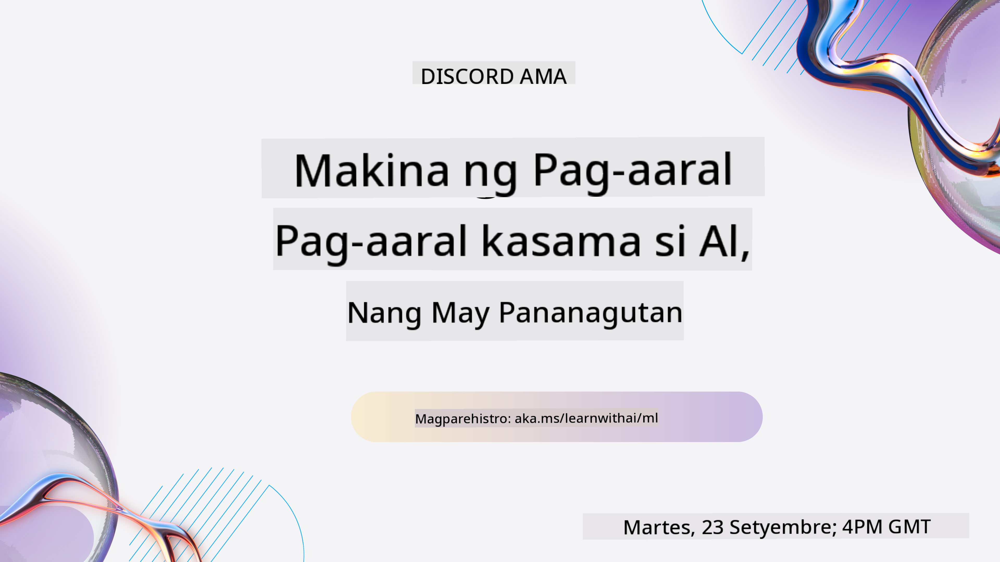
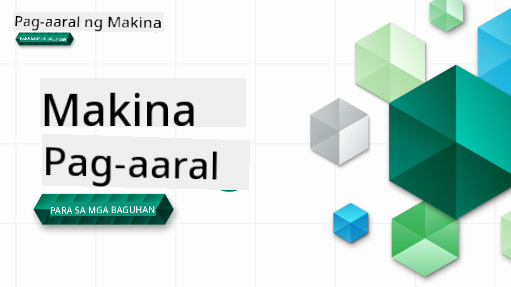

<!--
CO_OP_TRANSLATOR_METADATA:
{
  "original_hash": "7a13afb3674838f557d61f8d67e4d5f8",
  "translation_date": "2025-10-24T09:17:55+00:00",
  "source_file": "README.md",
  "language_code": "tl"
}
-->

### 🌐 Suporta sa Iba't Ibang Wika

#### Sinusuportahan sa pamamagitan ng GitHub Action (Automated at Laging Napapanahon)

<!-- CO-OP TRANSLATOR LANGUAGES TABLE START -->
[Arabic](../ar/README.md) | [Bengali](../bn/README.md) | [Bulgarian](../bg/README.md) | [Burmese (Myanmar)](../my/README.md) | [Chinese (Simplified)](../zh/README.md) | [Chinese (Traditional, Hong Kong)](../hk/README.md) | [Chinese (Traditional, Macau)](../mo/README.md) | [Chinese (Traditional, Taiwan)](../tw/README.md) | [Croatian](../hr/README.md) | [Czech](../cs/README.md) | [Danish](../da/README.md) | [Dutch](../nl/README.md) | [Estonian](../et/README.md) | [Finnish](../fi/README.md) | [French](../fr/README.md) | [German](../de/README.md) | [Greek](../el/README.md) | [Hebrew](../he/README.md) | [Hindi](../hi/README.md) | [Hungarian](../hu/README.md) | [Indonesian](../id/README.md) | [Italian](../it/README.md) | [Japanese](../ja/README.md) | [Korean](../ko/README.md) | [Lithuanian](../lt/README.md) | [Malay](../ms/README.md) | [Marathi](../mr/README.md) | [Nepali](../ne/README.md) | [Norwegian](../no/README.md) | [Persian (Farsi)](../fa/README.md) | [Polish](../pl/README.md) | [Portuguese (Brazil)](../br/README.md) | [Portuguese (Portugal)](../pt/README.md) | [Punjabi (Gurmukhi)](../pa/README.md) | [Romanian](../ro/README.md) | [Russian](../ru/README.md) | [Serbian (Cyrillic)](../sr/README.md) | [Slovak](../sk/README.md) | [Slovenian](../sl/README.md) | [Spanish](../es/README.md) | [Swahili](../sw/README.md) | [Swedish](../sv/README.md) | [Tagalog (Filipino)](./README.md) | [Tamil](../ta/README.md) | [Thai](../th/README.md) | [Turkish](../tr/README.md) | [Ukrainian](../uk/README.md) | [Urdu](../ur/README.md) | [Vietnamese](../vi/README.md)
<!-- CO-OP TRANSLATOR LANGUAGES TABLE END -->

#### Sumali sa Aming Komunidad

May ongoing na Discord series na "Learn with AI", alamin ang higit pa at sumali sa amin sa [Learn with AI Series](https://aka.ms/learnwithai/discord) mula Setyembre 18 - 30, 2025. Makakakuha ka ng mga tips at tricks sa paggamit ng GitHub Copilot para sa Data Science.

# Machine Learning para sa mga Baguhan - Isang Kurikulum

> 🌍 Maglakbay sa buong mundo habang tinutuklas ang Machine Learning sa pamamagitan ng kultura ng iba't ibang bansa 🌍

Ang mga Cloud Advocates sa Microsoft ay masayang nag-aalok ng 12-linggong, 26-leksyon na kurikulum tungkol sa **Machine Learning**. Sa kurikulum na ito, matututo ka tungkol sa tinatawag na **classic machine learning**, gamit ang Scikit-learn bilang pangunahing library at iiwasan ang deep learning, na saklaw sa aming [AI for Beginners' curriculum](https://aka.ms/ai4beginners). Ipares ang mga leksyon na ito sa aming ['Data Science for Beginners' curriculum](https://aka.ms/ds4beginners), din!

Sumama sa amin sa paglalakbay sa buong mundo habang ina-apply ang mga klasikong teknik na ito sa data mula sa iba't ibang bahagi ng mundo. Ang bawat leksyon ay may kasamang pre- at post-lesson quizzes, nakasulat na mga tagubilin para sa pagsasagawa ng leksyon, solusyon, takdang-aralin, at marami pa. Ang aming project-based na pedagogy ay nagbibigay-daan sa iyo na matuto habang gumagawa, isang napatunayang paraan para mas matutunan ang mga bagong kasanayan.

**✍️ Taos-pusong pasasalamat sa aming mga may-akda** Jen Looper, Stephen Howell, Francesca Lazzeri, Tomomi Imura, Cassie Breviu, Dmitry Soshnikov, Chris Noring, Anirban Mukherjee, Ornella Altunyan, Ruth Yakubu at Amy Boyd

**🎨 Salamat din sa aming mga ilustrador** Tomomi Imura, Dasani Madipalli, at Jen Looper

**🙏 Espesyal na pasasalamat 🙏 sa aming Microsoft Student Ambassador na mga may-akda, reviewer, at tagapag-ambag ng nilalaman**, partikular sina Rishit Dagli, Muhammad Sakib Khan Inan, Rohan Raj, Alexandru Petrescu, Abhishek Jaiswal, Nawrin Tabassum, Ioan Samuila, at Snigdha Agarwal

**🤩 Dagdag na pasasalamat sa Microsoft Student Ambassadors Eric Wanjau, Jasleen Sondhi, at Vidushi Gupta para sa aming mga R lessons!**

# Pagsisimula

Sundin ang mga hakbang na ito:
1. **I-Fork ang Repository**: I-click ang "Fork" button sa kanang-itaas na bahagi ng pahinang ito.
2. **I-Clone ang Repository**:   `git clone https://github.com/microsoft/ML-For-Beginners.git`

> [hanapin ang lahat ng karagdagang resources para sa kursong ito sa aming Microsoft Learn collection](https://learn.microsoft.com/en-us/collections/qrqzamz1nn2wx3?WT.mc_id=academic-77952-bethanycheum)

> 🔧 **Kailangan ng tulong?** Tingnan ang aming [Troubleshooting Guide](TROUBLESHOOTING.md) para sa mga solusyon sa karaniwang mga isyu sa pag-install, setup, at pagtakbo ng mga leksyon.

**[Mga Mag-aaral](https://aka.ms/student-page)**, upang magamit ang kurikulum na ito, i-fork ang buong repo sa iyong sariling GitHub account at kumpletuhin ang mga exercises nang mag-isa o kasama ang grupo:

- Magsimula sa pre-lecture quiz.
- Basahin ang leksyon at kumpletuhin ang mga aktibidad, huminto at magmuni-muni sa bawat knowledge check.
- Subukang gawin ang mga proyekto sa pamamagitan ng pag-unawa sa mga leksyon sa halip na i-run ang solution code; gayunpaman, ang code na iyon ay makikita sa `/solution` folders sa bawat project-oriented na leksyon.
- Gawin ang post-lecture quiz.
- Kumpletuhin ang challenge.
- Kumpletuhin ang takdang-aralin.
- Pagkatapos makumpleto ang isang grupo ng leksyon, bisitahin ang [Discussion Board](https://github.com/microsoft/ML-For-Beginners/discussions) at "matuto nang malakas" sa pamamagitan ng pag-fill out ng angkop na PAT rubric. Ang 'PAT' ay isang Progress Assessment Tool na isang rubric na iyong pinupunan upang higit pang mapalalim ang iyong pag-aaral. Maaari ka ring mag-react sa ibang mga PATs upang matuto nang sama-sama.

> Para sa karagdagang pag-aaral, inirerekomenda naming sundan ang mga [Microsoft Learn](https://docs.microsoft.com/en-us/users/jenlooper-2911/collections/k7o7tg1gp306q4?WT.mc_id=academic-77952-leestott) modules at learning paths.

**Mga Guro**, mayroon kaming [ilang mga mungkahi](for-teachers.md) kung paano gamitin ang kurikulum na ito.

---

## Mga Video Walkthrough

Ang ilan sa mga leksyon ay available bilang maikling video. Makikita ang mga ito sa mga leksyon, o sa [ML for Beginners playlist sa Microsoft Developer YouTube channel](https://aka.ms/ml-beginners-videos) sa pamamagitan ng pag-click sa imahe sa ibaba.

---

## Kilalanin ang Team

**Gif ni** [Mohit Jaisal](https://linkedin.com/in/mohitjaisal)

> 🎥 I-click ang imahe sa itaas para sa isang video tungkol sa proyekto at sa mga taong lumikha nito!

---

## Pedagohiya

Pinili namin ang dalawang prinsipyo ng pagtuturo habang binubuo ang kurikulum na ito: tiyakin na ito ay hands-on **project-based** at na ito ay may kasamang **madalas na quizzes**. Bukod dito, ang kurikulum na ito ay may karaniwang **tema** upang bigyan ito ng pagkakaugnay.

Sa pamamagitan ng pagtiyak na ang nilalaman ay naaayon sa mga proyekto, ang proseso ay nagiging mas nakakaengganyo para sa mga mag-aaral at mas tumatatak ang mga konsepto. Bukod dito, ang mababang antas ng quiz bago ang klase ay nagtatakda ng intensyon ng mag-aaral patungo sa pag-aaral ng isang paksa, habang ang pangalawang quiz pagkatapos ng klase ay higit pang nagpapalalim ng pagkatuto. Ang kurikulum na ito ay dinisenyo upang maging flexible at masaya at maaaring kunin nang buo o bahagi lamang. Ang mga proyekto ay nagsisimula sa maliit at nagiging mas kumplikado sa pagtatapos ng 12-linggong cycle. Ang kurikulum na ito ay may kasamang postscript sa mga real-world na aplikasyon ng ML, na maaaring gamitin bilang extra credit o bilang batayan para sa talakayan.

> Hanapin ang aming [Code of Conduct](CODE_OF_CONDUCT.md), [Contributing](CONTRIBUTING.md), [Translation](TRANSLATIONS.md), at [Troubleshooting](TROUBLESHOOTING.md) na mga gabay. Malugod naming tinatanggap ang inyong mga makabuluhang feedback!

## Ang bawat leksyon ay may kasamang

- opsyonal na sketchnote
- opsyonal na karagdagang video
- video walkthrough (ilang leksyon lamang)
- [pre-lecture warmup quiz](https://ff-quizzes.netlify.app/en/ml/)
- nakasulat na leksyon
- para sa mga project-based na leksyon, step-by-step na gabay kung paano buuin ang proyekto
- knowledge checks
- isang challenge
- karagdagang babasahin
- takdang-aralin
- [post-lecture quiz](https://ff-quizzes.netlify.app/en/ml/)

> **Tungkol sa mga wika**: Ang mga leksyon na ito ay pangunahing nakasulat sa Python, ngunit marami rin ang available sa R. Upang makumpleto ang isang R lesson, pumunta sa `/solution` folder at hanapin ang mga R lessons. Mayroon silang .rmd extension na kumakatawan sa isang **R Markdown** file na maaaring tukuyin bilang isang embedding ng `code chunks` (ng R o iba pang wika) at isang `YAML header` (na gumagabay kung paano i-format ang mga output tulad ng PDF) sa isang `Markdown document`. Bilang ganito, ito ay nagsisilbing isang halimbawa ng authoring framework para sa data science dahil pinapayagan nitong pagsamahin ang iyong code, ang output nito, at ang iyong mga saloobin sa pamamagitan ng pagsulat ng mga ito sa Markdown. Bukod dito, ang mga R Markdown documents ay maaaring i-render sa mga output formats tulad ng PDF, HTML, o Word.

> **Tungkol sa quizzes**: Ang lahat ng quizzes ay nasa [Quiz App folder](../../quiz-app), para sa kabuuang 52 quizzes na may tig-tatlong tanong bawat isa. Ang mga ito ay naka-link mula sa loob ng mga leksyon ngunit ang quiz app ay maaaring patakbuhin nang lokal; sundin ang mga tagubilin sa `quiz-app` folder upang i-host nang lokal o i-deploy sa Azure.

| Numero ng Leksyon |                             Paksa                              |                   Pangkat ng Leksyon                   | Mga Layunin sa Pagkatuto                                                                                                             |                                                              Naka-link na Leksyon                                                               |                        May-akda                        |
| :-----------: | :------------------------------------------------------------: | :-------------------------------------------------: | ------------------------------------------------------------------------------------------------------------------------------- | :--------------------------------------------------------------------------------------------------------------------------------------: | :--------------------------------------------------: |
|      01       |                Panimula sa machine learning                    |      [Panimula](1-Introduction/README.md)           | Alamin ang mga pangunahing konsepto sa likod ng machine learning                                                                |                                             [Aralin](1-Introduction/1-intro-to-ML/README.md)                                             |                       Muhammad                       |
|      02       |                Kasaysayan ng machine learning                  |      [Panimula](1-Introduction/README.md)           | Alamin ang kasaysayan ng larangang ito                                                                                          |                                            [Aralin](1-Introduction/2-history-of-ML/README.md)                                            |                     Jen at Amy                       |
|      03       |                 Katarungan at machine learning                 |      [Panimula](1-Introduction/README.md)           | Ano ang mga mahahalagang isyung pilosopikal tungkol sa katarungan na dapat isaalang-alang ng mga mag-aaral sa paggawa ng mga modelo ng ML? |                                              [Aralin](1-Introduction/3-fairness/README.md)                                               |                        Tomomi                        |
|      04       |                Mga Teknik para sa machine learning             |      [Panimula](1-Introduction/README.md)           | Anong mga teknik ang ginagamit ng mga mananaliksik ng ML sa paggawa ng mga modelo ng ML?                                        |                                          [Aralin](1-Introduction/4-techniques-of-ML/README.md)                                           |                    Chris at Jen                      |
|      05       |                   Panimula sa regression                       |        [Regression](2-Regression/README.md)         | Simulan ang paggamit ng Python at Scikit-learn para sa mga regression model                                                     |         [Python](2-Regression/1-Tools/README.md) • [R](../../2-Regression/1-Tools/solution/R/lesson_1.html)         |      Jen • Eric Wanjau       |
|      06       |                Presyo ng kalabasa sa Hilagang Amerika 🎃       |        [Regression](2-Regression/README.md)         | I-visualize at linisin ang data bilang paghahanda para sa ML                                                                      |          [Python](2-Regression/2-Data/README.md) • [R](../../2-Regression/2-Data/solution/R/lesson_2.html)          |      Jen • Eric Wanjau       |
|      07       |                Presyo ng kalabasa sa Hilagang Amerika 🎃       |        [Regression](2-Regression/README.md)         | Gumawa ng linear at polynomial regression models                                                                                 |        [Python](2-Regression/3-Linear/README.md) • [R](../../2-Regression/3-Linear/solution/R/lesson_3.html)        |      Jen at Dmitry • Eric Wanjau       |
|      08       |                Presyo ng kalabasa sa Hilagang Amerika 🎃       |        [Regression](2-Regression/README.md)         | Gumawa ng logistic regression model                                                                                              |     [Python](2-Regression/4-Logistic/README.md) • [R](../../2-Regression/4-Logistic/solution/R/lesson_4.html)      |      Jen • Eric Wanjau       |
|      09       |                          Isang Web App 🔌                      |           [Web App](3-Web-App/README.md)            | Gumawa ng web app para magamit ang iyong na-train na modelo                                                                      |                                                 [Python](3-Web-App/1-Web-App/README.md)                                                  |                         Jen                          |
|      10       |                 Panimula sa classification                     |    [Classification](4-Classification/README.md)     | Linisin, ihanda, at i-visualize ang iyong data; panimula sa classification                                                       | [Python](4-Classification/1-Introduction/README.md) • [R](../../4-Classification/1-Introduction/solution/R/lesson_10.html)  | Jen at Cassie • Eric Wanjau |
|      11       |             Masasarap na Asian at Indian na lutuin 🍜          |    [Classification](4-Classification/README.md)     | Panimula sa classifiers                                                                                                         | [Python](4-Classification/2-Classifiers-1/README.md) • [R](../../4-Classification/2-Classifiers-1/solution/R/lesson_11.html) | Jen at Cassie • Eric Wanjau |
|      12       |             Masasarap na Asian at Indian na lutuin 🍜          |    [Classification](4-Classification/README.md)     | Higit pang classifiers                                                                                                          | [Python](4-Classification/3-Classifiers-2/README.md) • [R](../../4-Classification/3-Classifiers-2/solution/R/lesson_12.html) | Jen at Cassie • Eric Wanjau |
|      13       |             Masasarap na Asian at Indian na lutuin 🍜          |    [Classification](4-Classification/README.md)     | Gumawa ng recommender web app gamit ang iyong modelo                                                                             |                                              [Python](4-Classification/4-Applied/README.md)                                              |                         Jen                          |
|      14       |                   Panimula sa clustering                       |        [Clustering](5-Clustering/README.md)         | Linisin, ihanda, at i-visualize ang iyong data; Panimula sa clustering                                                           |         [Python](5-Clustering/1-Visualize/README.md) • [R](../../5-Clustering/1-Visualize/solution/R/lesson_14.html)         |      Jen • Eric Wanjau       |
|      15       |              Pagsusuri sa Panlasa ng Musika ng Nigeria 🎧      |        [Clustering](5-Clustering/README.md)         | Suriin ang K-Means clustering method                                                                                            |           [Python](5-Clustering/2-K-Means/README.md) • [R](../../5-Clustering/2-K-Means/solution/R/lesson_15.html)           |      Jen • Eric Wanjau       |
|      16       |        Panimula sa natural language processing ☕️             |   [Natural language processing](6-NLP/README.md)    | Alamin ang mga pangunahing kaalaman tungkol sa NLP sa pamamagitan ng paggawa ng simpleng bot                                     |                                             [Python](6-NLP/1-Introduction-to-NLP/README.md)                                              |                       Stephen                        |
|      17       |                      Karaniwang Gawain sa NLP ☕️              |   [Natural language processing](6-NLP/README.md)    | Palalimin ang iyong kaalaman sa NLP sa pamamagitan ng pag-unawa sa mga karaniwang gawain na kinakailangan sa pagproseso ng mga istruktura ng wika |                                                    [Python](6-NLP/2-Tasks/README.md)                                                     |                       Stephen                        |
|      18       |             Pagsasalin at pagsusuri ng damdamin ♥️            |   [Natural language processing](6-NLP/README.md)    | Pagsasalin at pagsusuri ng damdamin gamit ang mga akda ni Jane Austen                                                           |                                            [Python](6-NLP/3-Translation-Sentiment/README.md)                                             |                       Stephen                        |
|      19       |                  Mga Romantikong Hotel sa Europa ♥️           |   [Natural language processing](6-NLP/README.md)    | Pagsusuri ng damdamin gamit ang mga review ng hotel 1                                                                           |                                               [Python](6-NLP/4-Hotel-Reviews-1/README.md)                                                |                       Stephen                        |
|      20       |                  Mga Romantikong Hotel sa Europa ♥️           |   [Natural language processing](6-NLP/README.md)    | Pagsusuri ng damdamin gamit ang mga review ng hotel 2                                                                           |                                               [Python](6-NLP/5-Hotel-Reviews-2/README.md)                                                |                       Stephen                        |
|      21       |            Panimula sa time series forecasting                |        [Time series](7-TimeSeries/README.md)        | Panimula sa time series forecasting                                                                                            |                                             [Python](7-TimeSeries/1-Introduction/README.md)                                              |                      Francesca                       |
|      22       | ⚡️ Paggamit ng Kuryente sa Mundo ⚡️ - time series forecasting gamit ang ARIMA |        [Time series](7-TimeSeries/README.md)        | Time series forecasting gamit ang ARIMA                                                                                         |                                                 [Python](7-TimeSeries/2-ARIMA/README.md)                                                 |                      Francesca                       |
|      23       |  ⚡️ Paggamit ng Kuryente sa Mundo ⚡️ - time series forecasting gamit ang SVR  |        [Time series](7-TimeSeries/README.md)        | Time series forecasting gamit ang Support Vector Regressor                                                                      |                                                  [Python](7-TimeSeries/3-SVR/README.md)                                                  |                       Anirban                        |
|      24       |             Panimula sa reinforcement learning                | [Reinforcement learning](8-Reinforcement/README.md) | Panimula sa reinforcement learning gamit ang Q-Learning                                                                         |                                             [Python](8-Reinforcement/1-QLearning/README.md)                                              |                        Dmitry                        |
|      25       |                 Tulungan si Peter na iwasan ang lobo! 🐺      | [Reinforcement learning](8-Reinforcement/README.md) | Reinforcement learning Gym                                                                                                      |                                                [Python](8-Reinforcement/2-Gym/README.md)                                                 |                        Dmitry                        |
|  Postscript   |            Mga Real-World Scenario at Aplikasyon ng ML        |      [ML in the Wild](9-Real-World/README.md)       | Mga kawili-wili at kapana-panabik na aplikasyon ng classical ML                                                                 |                                             [Aralin](9-Real-World/1-Applications/README.md)                                              |                         Team                         |
|  Postscript   |            Pag-debug ng Modelo sa ML gamit ang RAI dashboard |      [ML in the Wild](9-Real-World/README.md)       | Pag-debug ng Modelo sa Machine Learning gamit ang mga bahagi ng Responsible AI dashboard                                        |                                             [Aralin](9-Real-World/2-Debugging-ML-Models/README.md)                                              |                         Ruth Yakubu                       |

> [hanapin ang lahat ng karagdagang resources para sa kursong ito sa aming Microsoft Learn collection](https://learn.microsoft.com/en-us/collections/qrqzamz1nn2wx3?WT.mc_id=academic-77952-bethanycheum)

## Offline na access

Maaari mong patakbuhin ang dokumentasyong ito offline gamit ang [Docsify](https://docsify.js.org/#/). I-fork ang repo na ito, [i-install ang Docsify](https://docsify.js.org/#/quickstart) sa iyong lokal na makina, at pagkatapos sa root folder ng repo na ito, i-type ang `docsify serve`. Ang website ay magsisilbi sa port 3000 sa iyong localhost: `localhost:3000`.

## PDFs

Hanapin ang PDF ng kurikulum na may mga link [dito](https://microsoft.github.io/ML-For-Beginners/pdf/readme.pdf).

## 🎒 Iba Pang Kurso 

Ang aming team ay gumagawa ng iba pang mga kurso! Tingnan:

### Azure / Edge / MCP / Agents

---

### Generative AI Series

[-9333EA?style=for-the-badge&labelColor=E5E7EB&color=9333EA)](https://github.com/microsoft/Generative-AI-for-beginners-dotnet?WT.mc_id=academic-105485-koreyst)
[-C084FC?style=for-the-badge&labelColor=E5E7EB&color=C084FC)](https://github.com/microsoft/generative-ai-for-beginners-java?WT.mc_id=academic-105485-koreyst)
[-E879F9?style=for-the-badge&labelColor=E5E7EB&color=E879F9)](https://github.com/microsoft/generative-ai-with-javascript?WT.mc_id=academic-105485-koreyst)

---

### Pangunahing Pag-aaral
  
  
  
  
  
  
  

---

### Copilot Series  
  
  
  

## Paghingi ng Tulong  

Kung nahihirapan ka o may mga tanong tungkol sa paggawa ng mga AI apps, sumali sa:  

  

Kung may feedback ka sa produkto o nakakaranas ng mga error habang gumagawa, bisitahin:  

  

---

**Paunawa**:  
Ang dokumentong ito ay isinalin gamit ang AI translation service na [Co-op Translator](https://github.com/Azure/co-op-translator). Bagamat sinisikap naming maging tumpak, mangyaring tandaan na ang mga awtomatikong pagsasalin ay maaaring maglaman ng mga pagkakamali o hindi pagkakatugma. Ang orihinal na dokumento sa kanyang katutubong wika ang dapat ituring na opisyal na sanggunian. Para sa mahalagang impormasyon, inirerekomenda ang propesyonal na pagsasalin ng tao. Hindi kami mananagot sa anumang hindi pagkakaunawaan o maling interpretasyon na dulot ng paggamit ng pagsasaling ito.