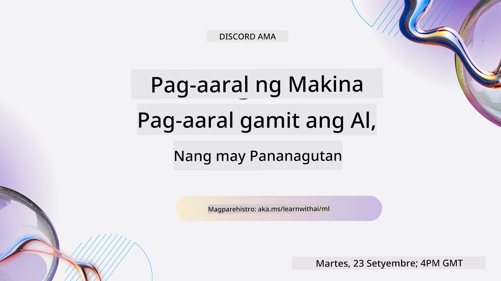
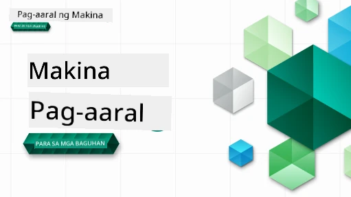

[](https://github.com/microsoft/ML-For-Beginners/blob/master/LICENSE)
[](https://GitHub.com/microsoft/ML-For-Beginners/graphs/contributors/)
[](https://GitHub.com/microsoft/ML-For-Beginners/issues/)
[](https://GitHub.com/microsoft/ML-For-Beginners/pulls/)
[](http://makeapullrequest.com)

[](https://GitHub.com/microsoft/ML-For-Beginners/watchers/)
[](https://GitHub.com/microsoft/ML-For-Beginners/network/)
[](https://GitHub.com/microsoft/ML-For-Beginners/stargazers/)

### 🌐 Suporta sa Maramihang Wika

#### Sinusuportahan sa pamamagitan ng GitHub Action (Automatiko at Palaging Napapanahon)

<!-- CO-OP TRANSLATOR LANGUAGES TABLE START -->
[Arabic](../ar/README.md) | [Bengali](../bn/README.md) | [Bulgarian](../bg/README.md) | [Burmese (Myanmar)](../my/README.md) | [Chinese (Simplified)](../zh-CN/README.md) | [Chinese (Traditional, Hong Kong)](../zh-HK/README.md) | [Chinese (Traditional, Macau)](../zh-MO/README.md) | [Chinese (Traditional, Taiwan)](../zh-TW/README.md) | [Croatian](../hr/README.md) | [Czech](../cs/README.md) | [Danish](../da/README.md) | [Dutch](../nl/README.md) | [Estonian](../et/README.md) | [Finnish](../fi/README.md) | [French](../fr/README.md) | [German](../de/README.md) | [Greek](../el/README.md) | [Hebrew](../he/README.md) | [Hindi](../hi/README.md) | [Hungarian](../hu/README.md) | [Indonesian](../id/README.md) | [Italian](../it/README.md) | [Japanese](../ja/README.md) | [Kannada](../kn/README.md) | [Khmer](../km/README.md) | [Korean](../ko/README.md) | [Lithuanian](../lt/README.md) | [Malay](../ms/README.md) | [Malayalam](../ml/README.md) | [Marathi](../mr/README.md) | [Nepali](../ne/README.md) | [Nigerian Pidgin](../pcm/README.md) | [Norwegian](../no/README.md) | [Persian (Farsi)](../fa/README.md) | [Polish](../pl/README.md) | [Portuguese (Brazil)](../pt-BR/README.md) | [Portuguese (Portugal)](../pt-PT/README.md) | [Punjabi (Gurmukhi)](../pa/README.md) | [Romanian](../ro/README.md) | [Russian](../ru/README.md) | [Serbian (Cyrillic)](../sr/README.md) | [Slovak](../sk/README.md) | [Slovenian](../sl/README.md) | [Spanish](../es/README.md) | [Swahili](../sw/README.md) | [Swedish](../sv/README.md) | [Tagalog (Filipino)](./README.md) | [Tamil](../ta/README.md) | [Telugu](../te/README.md) | [Thai](../th/README.md) | [Turkish](../tr/README.md) | [Ukrainian](../uk/README.md) | [Urdu](../ur/README.md) | [Vietnamese](../vi/README.md)

> **Mas gusto mo bang Mag-clone nang Lokal?**
>
> Kasama sa repository na ito ang mahigit 50 lengguwahe na pagsasalin na lubos na nagpapalaki ng laki ng pag-download. Para mag-clone nang walang mga pagsasalin, gamitin ang sparse checkout:
>
> **Bash / macOS / Linux:**
> ```bash
> git clone --filter=blob:none --sparse https://github.com/microsoft/ML-For-Beginners.git
> cd ML-For-Beginners
> git sparse-checkout set --no-cone '/*' '!translations' '!translated_images'
> ```
>
> **CMD (Windows):**
> ```cmd
> git clone --filter=blob:none --sparse https://github.com/microsoft/ML-For-Beginners.git
> cd ML-For-Beginners
> git sparse-checkout set --no-cone "/*" "!translations" "!translated_images"
> ```
>
> Bibigyan ka nito ng lahat ng kailangan mo para matapos ang kurso nang mas mabilis ang pag-download.
<!-- CO-OP TRANSLATOR LANGUAGES TABLE END -->

#### Sumali sa Aming Komunidad

[](https://discord.gg/nTYy5BXMWG)

Mayroon kaming patuloy na serye sa Discord na "learn with AI," alamin pa at sumali sa amin sa [Learn with AI Series](https://aka.ms/learnwithai/discord) mula Setyembre 18 - 30, 2025. Makakakuha ka ng mga tip at trick sa paggamit ng GitHub Copilot para sa Data Science.



# Machine Learning para sa mga Baguhan - Isang Kurikulum

> 🌍 Maglakbay tayo sa buong mundo habang tinutuklas natin ang Machine Learning sa pamamagitan ng mga kultura ng mundo 🌍

Ikinagagalak ng mga Cloud Advocates ng Microsoft na mag-alok ng 12-linggong, 26-leksyon na kurikulum tungkol sa **Machine Learning**. Sa kurikulum na ito, matututuhan mo ang kung ano ang tinatawag na **classic machine learning**, gamit ang pangunahing Scikit-learn bilang library at iniiwasan ang deep learning, na kasama naman sa aming [AI for Beginners' curriculum](https://aka.ms/ai4beginners). Kombinahin ang mga leksyong ito sa aming ['Data Science for Beginners' curriculum](https://aka.ms/ds4beginners), din!

Maglakbay kasama namin sa buong mundo habang inilalapat natin ang mga klasikong teknik na ito sa datos mula sa maraming bahagi ng mundo. Bawat leksyon ay may mga pagsusulit bago at pagkatapos ng leksyon, nakasulat na mga tagubilin para matapos ang leksyon, solusyon, takdang-aralin, at iba pa. Ang aming pedagohiyang nakabatay sa proyekto ay nagpapahintulot sa iyo na matuto habang gumagawa, isang subok na paraan para manatili ang bagong mga kasanayan.

**✍️ Malugod na pasasalamat sa aming mga may-akda** Jen Looper, Stephen Howell, Francesca Lazzeri, Tomomi Imura, Cassie Breviu, Dmitry Soshnikov, Chris Noring, Anirban Mukherjee, Ornella Altunyan, Ruth Yakubu at Amy Boyd

**🎨 Pasasalamat din sa aming mga ilustrador** Tomomi Imura, Dasani Madipalli, at Jen Looper

**🙏 Espesyal na pasasalamat 🙏 sa aming Microsoft Student Ambassador mga may-akda, tagasuri, at mga nag-ambag ng nilalaman**, lalo na kina Rishit Dagli, Muhammad Sakib Khan Inan, Rohan Raj, Alexandru Petrescu, Abhishek Jaiswal, Nawrin Tabassum, Ioan Samuila, at Snigdha Agarwal

**🤩 Dagdag pa na pasasalamat sa Microsoft Student Ambassadors Eric Wanjau, Jasleen Sondhi, at Vidushi Gupta para sa aming mga leksyon sa R!**

# Pagsisimula

Sundin ang mga hakbang na ito:
1. **I-fork ang Repositoryo**: I-click ang "Fork" na button sa kanang itaas na bahagi ng pahinang ito.
2. **I-clone ang Repositoryo**:   `git clone https://github.com/microsoft/ML-For-Beginners.git`

> 💡 **Tip para sa Mabilis na Pagsisimula:** Gusto mo bang magsimula sa browser nang hindi nagse-setup ng Python locally? Gamitin ang [GitHub Codespaces](https://github.com/features/codespaces) para gumawa ng cloud development environment para sa iyong fork. Buksan ang berdeng **Code** na menu, piliin ang **Codespaces**, at gumawa ng codespace; i-install ang mga kinakailangang dependencies ng bawat leksyon dito ayon sa pangangailangan.

> [hanapin lahat ng karagdagang mga resources para sa kursong ito sa aming koleksyon sa Microsoft Learn](https://learn.microsoft.com/en-us/collections/qrqzamz1nn2wx3?WT.mc_id=academic-77952-bethanycheum)

> 🔧 **Kailangan ng tulong?** Tingnan ang aming [Troubleshooting Guide](TROUBLESHOOTING.md) para sa mga solusyon sa karaniwang problema sa pag-install, setup, at pagpapatakbo ng mga leksyon.


**[Mga Estudyante](https://aka.ms/student-page)**, para magamit ang kurikulum na ito, i-fork ang buong repo sa iyong sariling GitHub account at tapusin ang mga gawain nang mag-isa o kasama ang grupo:

- Magsimula sa pre-lecture quiz.
- Basahin ang leksyon at gawin ang mga aktibidad, huminto at magnilay sa bawat pagsusuri ng kaalaman.
- Subukang gawin ang mga proyekto sa pamamagitan ng pag-unawa sa mga leksyon kaysa lamang pagpapatakbo ng solusyong code; gayunpaman, ang code ay available sa mga `/solution` na folder sa bawat project-oriented na leksyon.
- Kunin ang post-lecture quiz.
- Kumpletuhin ang hamon.
- Kumpletuhin ang takdang-aralin.
- Pagkatapos makumpleto ang isang pangkat ng leksyon, bumisita sa [Discussion Board](https://github.com/microsoft/ML-For-Beginners/discussions) at "matuto nang malakas" sa pamamagitan ng pagpuno ng angkop na PAT rubric. Ang 'PAT' ay isang Progress Assessment Tool na isang rubric na pinupuno mo para palalimin ang iyong pagkatuto. Maaari ka ring mag-react sa ibang mga PAT upang sama-sama tayong matuto.

> Para sa karagdagang pag-aaral, inirerekomenda naming sundan ang mga [Microsoft Learn](https://docs.microsoft.com/en-us/users/jenlooper-2911/collections/k7o7tg1gp306q4?WT.mc_id=academic-77952-leestott) na mga module at learning paths.

**Mga Guro**, may [pinagsama kaming ilang mungkahi](for-teachers.md) kung paano gamitin ang kurikulum na ito.

---

## Mga Video na walkthrough

Ang ilan sa mga leksyon ay available bilang maikling anyo ng video. Makikita mo ang lahat ng ito na naka-inline sa mga leksyon, o sa [ML for Beginners playlist sa Microsoft Developer YouTube channel](https://aka.ms/ml-beginners-videos) sa pamamagitan ng pag-click sa larawan sa ibaba.

[](https://aka.ms/ml-beginners-videos)

---

## Kilalanin ang Team

[](https://youtu.be/Tj1XWrDSYJU)

**Gif ni** [Mohit Jaisal](https://linkedin.com/in/mohitjaisal)

> 🎥 I-click ang larawan sa itaas para sa isang video tungkol sa proyekto at sa mga taong gumawa nito!

---

## Pedagohiya

Pinili namin ang dalawang pedagogical na prinsipyo habang binubuo ang kurikulum na ito: tiyakin na ito ay hands-on at **nakabatay sa proyekto** at may kasamang **madalas na pagsusulit**. Bukod dito, ang kurikulum na ito ay may isang pangkaraniwang **tema** para magbigay ng pagkakaugnay-ugnay.

Sa pagtiyak na ang nilalaman ay kaugnay ng mga proyekto, ginagawa nitong mas kawili-wili para sa mga estudyante ang proseso at mapapalawak ang retention ng mga konsepto. Bukod dito, ang mababang-peligro na pagsusulit bago ang klase ay naglalagay ng intensyon ng estudyante sa pag-aaral ng paksa, habang ang pangalawang pagsusulit pagkatapos ng klase ay nagbibigay ng karagdagang retention. Ang kurikulum na ito ay dinisenyo upang maging flexible at masaya at maaaring kunin nang buo o bahagya. Ang mga proyekto ay nagsisimula nang maliit at humihirap habang papalapit sa katapusan ng 12-linggong siklo. Kasama rin sa kurikulum na ito ang isang postskript sa mga totoong aplikasyon ng ML, na maaaring gamitin bilang dagdag na kredito o bilang base sa diskusyon.

> Hanapin ang aming [Code of Conduct](CODE_OF_CONDUCT.md), [Contributing](CONTRIBUTING.md), [Translations](..), at [Troubleshooting](TROUBLESHOOTING.md) na mga patnubay. Malugod naming tinatanggap ang iyong makabuluhang puna!

## Bawat leksyon ay may kasamang

- opsyonal na sketchnote
- opsyonal na panustos na video
- video walkthrough (ilan lang sa mga leksyon)
- [pre-lecture warmup quiz](https://ff-quizzes.netlify.app/en/ml/)
- nakasulat na leksyon
- para sa mga project-based na leksyon, mga sunod-sunod na gabay kung paano bumuo ng proyekto
- pagsusuri ng kaalaman
- isang hamon
- karagdagang pagbasa
- takdang-aralin
- [post-lecture quiz](https://ff-quizzes.netlify.app/en/ml/)

> **Isang tala tungkol sa mga wika**: Ang mga leksyon na ito ay pangunahing nakasulat sa Python, ngunit marami rin ang available sa R. Para matapos ang isang R leksyon, pumunta sa `/solution` na folder at hanapin ang mga leksyon sa R. Mayroon itong .rmd na ekstensyon na kumakatawan sa isang **R Markdown** na file na maaaring tukuyin bilang isang pag-embed ng `code chunks` (ng R o iba pang mga wika) at isang `YAML header` (na gumagabay kung paano i-format ang mga output tulad ng PDF) sa isang `Markdown document`. Dahil dito, nagsisilbi itong isang mahuhusay na framework para sa pag-aakda para sa data science dahil pinapayagan kang pag-isahin ang iyong code, ang output nito, at ang iyong mga ideya sa pamamagitan ng pagsulat nito sa Markdown. Bukod pa rito, ang mga R Markdown na dokumento ay maaaring ipakita sa mga output na format tulad ng PDF, HTML, o Word.

> **Isang tala tungkol sa mga pagsusulit**: Lahat ng pagsusulit ay nasa loob ng [Quiz App folder](../../quiz-app), para sa kabuuang 52 na pagsusulit na may tig-tatlong tanong bawat isa. Nakalink ang mga ito mula sa loob ng mga leksyon pero ang quiz app ay maaring patakbuhin lokal; sundin ang mga tagubilin sa `quiz-app` na folder para mag-host lokal o mag-deploy sa Azure.

| Lesson Number |                             Topic                              |                   Lesson Grouping                   | Learning Objectives                                                                                                             |                                                              Linked Lesson                                                               |                        Author                        |
| :-----------: | :------------------------------------------------------------: | :-------------------------------------------------: | ------------------------------------------------------------------------------------------------------------------------------- | :--------------------------------------------------------------------------------------------------------------------------------------: | :--------------------------------------------------: |
|      01       |                Panimula sa machine learning                   |      [Introduction](1-Introduction/README.md)       | Alamin ang mga pangunahing konsepto sa likod ng machine learning                                                                     |                                             [Lesson](1-Introduction/1-intro-to-ML/README.md)                                             |                       Muhammad                       |
|      02       |                  Kasaysayan ng machine learning                |      [Introduction](1-Introduction/README.md)       | Alamin ang kasaysayan sa likod ng larangang ito                                                                                      |                                            [Lesson](1-Introduction/2-history-of-ML/README.md)                                            |                     Jen and Amy                      |
|      03       |                Katarungan at machine learning                  |      [Introduction](1-Introduction/README.md)       | Ano ang mga mahalagang pilosopikal na isyu tungkol sa katarungan na dapat isaalang-alang ng mga estudyante kapag bumubuo at nag-aaplay ng mga modelo ng ML? |                                              [Lesson](1-Introduction/3-fairness/README.md)                                               |                        Tomomi                        |
|      04       |                Mga teknik para sa machine learning             |      [Introduction](1-Introduction/README.md)       | Anong mga teknik ang ginagamit ng mga mananaliksik ng ML para bumuo ng mga modelo ng ML?                                            |                                          [Lesson](1-Introduction/4-techniques-of-ML/README.md)                                           |                    Chris and Jen                     |
|      05       |                   Panimula sa regression                       |        [Regression](2-Regression/README.md)         | Magsimula gamit ang Python at Scikit-learn para sa mga modelo ng regression                                                           |         [Python](2-Regression/1-Tools/README.md) • [R](../../2-Regression/1-Tools/solution/R/lesson_1.html)         |      Jen • Eric Wanjau       |
|      06       |                Mga presyo ng kalabasa sa Hilagang Amerika 🎃          |        [Regression](2-Regression/README.md)         | I-visualize at linisin ang data bilang paghahanda para sa ML                                                                        |          [Python](2-Regression/2-Data/README.md) • [R](../../2-Regression/2-Data/solution/R/lesson_2.html)          |      Jen • Eric Wanjau       |
|      07       |                Mga presyo ng kalabasa sa Hilagang Amerika 🎃          |        [Regression](2-Regression/README.md)         | Bumuo ng linear at polynomial na mga modelo ng regression                                                                            |        [Python](2-Regression/3-Linear/README.md) • [R](../../2-Regression/3-Linear/solution/R/lesson_3.html)        |      Jen and Dmitry • Eric Wanjau       |
|      08       |                Mga presyo ng kalabasa sa Hilagang Amerika 🎃          |        [Regression](2-Regression/README.md)         | Bumuo ng isang logistic regression model                                                                                            |     [Python](2-Regression/4-Logistic/README.md) • [R](../../2-Regression/4-Logistic/solution/R/lesson_4.html)      |      Jen • Eric Wanjau       |
|      09       |                          Isang Web App 🔌                          |           [Web App](3-Web-App/README.md)            | Gumawa ng web app para gamitin ang iyong na-train na modelo                                                                        |                                                 [Python](3-Web-App/1-Web-App/README.md)                                                  |                         Jen                          |
|      10       |                 Panimula sa classification                      |    [Classification](4-Classification/README.md)     | Linisin, i-prep, at i-visualize ang iyong data; panimula sa classification                                                        | [Python](4-Classification/1-Introduction/README.md) • [R](../../4-Classification/1-Introduction/solution/R/lesson_10.html)  | Jen and Cassie • Eric Wanjau |
|      11       |             Masasarap na lutuing Asyano at Indian 🍜             |    [Classification](4-Classification/README.md)     | Panimula sa mga classifier                                                                                                         | [Python](4-Classification/2-Classifiers-1/README.md) • [R](../../4-Classification/2-Classifiers-1/solution/R/lesson_11.html) | Jen and Cassie • Eric Wanjau |
|      12       |             Masasarap na lutuing Asyano at Indian 🍜             |    [Classification](4-Classification/README.md)     | Higit pang mga classifier                                                                                                          | [Python](4-Classification/3-Classifiers-2/README.md) • [R](../../4-Classification/3-Classifiers-2/solution/R/lesson_12.html) | Jen and Cassie • Eric Wanjau |
|      13       |             Masasarap na lutuing Asyano at Indian 🍜             |    [Classification](4-Classification/README.md)     | Gumawa ng recommender web app gamit ang iyong modelo                                                                             |                                              [Python](4-Classification/4-Applied/README.md)                                              |                         Jen                          |
|      14       |                   Panimula sa clustering                      |        [Clustering](5-Clustering/README.md)         | Linisin, i-prep, at i-visualize ang iyong data; panimula sa clustering                                                               |         [Python](5-Clustering/1-Visualize/README.md) • [R](../../5-Clustering/1-Visualize/solution/R/lesson_14.html)         |      Jen • Eric Wanjau       |
|      15       |              Pagsisiyasat sa Nigerian Musical Tastes 🎧             |        [Clustering](5-Clustering/README.md)         | Siyasatin ang K-Means clustering method                                                                                           |           [Python](5-Clustering/2-K-Means/README.md) • [R](../../5-Clustering/2-K-Means/solution/R/lesson_15.html)           |      Jen • Eric Wanjau       |
|      16       |        Panimula sa natural language processing ☕️             |   [Natural language processing](6-NLP/README.md)    | Alamin ang mga batayan tungkol sa NLP sa pamamagitan ng paggawa ng isang simpleng bot                                               |                                             [Python](6-NLP/1-Introduction-to-NLP/README.md)                                              |                       Stephen                        |
|      17       |                      Karaniwang mga Gawain sa NLP ☕️                      |   [Natural language processing](6-NLP/README.md)    | Palalimin ang iyong kaalaman sa NLP sa pamamagitan ng pag-unawa sa mga karaniwang gawain na kailangan kapag humaharap sa mga istruktura ng wika |                                                    [Python](6-NLP/2-Tasks/README.md)                                                     |                       Stephen                        |
|      18       |             Pagsasalin at pagsusuri ng damdamin ♥️              |   [Natural language processing](6-NLP/README.md)    | Pagsasalin at pagsusuri ng damdamin gamit si Jane Austen                                                                           |                                            [Python](6-NLP/3-Translation-Sentiment/README.md)                                             |                       Stephen                        |
|      19       |                  Mga romantikong hotel sa Europa ♥️                  |   [Natural language processing](6-NLP/README.md)    | Pagsusuri ng damdamin gamit ang mga review ng hotel 1                                                                             |                                               [Python](6-NLP/4-Hotel-Reviews-1/README.md)                                                |                       Stephen                        |
|      20       |                  Mga romantikong hotel sa Europa ♥️                  |   [Natural language processing](6-NLP/README.md)    | Pagsusuri ng damdamin gamit ang mga review ng hotel 2                                                                             |                                               [Python](6-NLP/5-Hotel-Reviews-2/README.md)                                                |                       Stephen                        |
|      21       |            Panimula sa time series forecasting                  |        [Time series](7-TimeSeries/README.md)        | Panimula sa time series forecasting                                                                                              |                                             [Python](7-TimeSeries/1-Introduction/README.md)                                              |                      Francesca                       |
|      22       | ⚡️ Paggamit ng Kuryente sa Mundo ⚡️ - time series forecasting gamit ang ARIMA |        [Time series](7-TimeSeries/README.md)        | Time series forecasting gamit ang ARIMA                                                                                            |                                                 [Python](7-TimeSeries/2-ARIMA/README.md)                                                 |                      Francesca                       |
|      23       |  ⚡️ Paggamit ng Kuryente sa Mundo ⚡️ - time series forecasting gamit ang SVR  |        [Time series](7-TimeSeries/README.md)        | Time series forecasting gamit ang Support Vector Regressor                                                                        |                                                  [Python](7-TimeSeries/3-SVR/README.md)                                                  |                       Anirban                        |
|      24       |             Panimula sa reinforcement learning                  | [Reinforcement learning](8-Reinforcement/README.md) | Panimula sa reinforcement learning gamit ang Q-Learning                                                                           |                                             [Python](8-Reinforcement/1-QLearning/README.md)                                              |                        Dmitry                        |
|      25       |                 Tulungan si Peter na umiwas sa lobo! 🐺               | [Reinforcement learning](8-Reinforcement/README.md) | Reinforcement learning Gym                                                                                                       |                                                [Python](8-Reinforcement/2-Gym/README.md)                                                 |                        Dmitry                        |
|  Postscript   |            Mga totoong senaryo at aplikasyon ng ML                   |      [ML in the Wild](9-Real-World/README.md)       | Mga kawili-wili at nagpapakita ng totoong aplikasyon ng klasikong ML                                                               |                                             [Lesson](9-Real-World/1-Applications/README.md)                                              |                         Team                         |
|  Postscript   |            Pag-debug ng Modelo sa ML gamit ang RAI dashboard            |      [ML in the Wild](9-Real-World/README.md)       | Pag-debug ng Modelo sa Machine Learning gamit ang mga komponent ng Responsible AI dashboard                                          |                                             [Lesson](9-Real-World/2-Debugging-ML-Models/README.md)                                              |                     Ruth Yakubu                      |

> [hanapin lahat ng karagdagang mga resource para sa kursong ito sa aming Microsoft Learn collection](https://learn.microsoft.com/en-us/collections/qrqzamz1nn2wx3?WT.mc_id=academic-77952-bethanycheum)

## Offline access

Maaari mong patakbuhin ang dokumentasyong ito offline gamit ang [Docsify](https://docsify.js.org/#/). I-fork ang repo na ito, [i-install ang Docsify](https://docsify.js.org/#/quickstart) sa iyong lokal na makina, at pagkatapos sa root folder ng repo na ito, isulat ang `docsify serve`. Ang website ay ihahain sa port 3000 sa iyong localhost: `localhost:3000`.

## PDFs

Hanapin ang pdf ng kurikulum na may mga link [dito](https://microsoft.github.io/ML-For-Beginners/pdf/readme.pdf).


## 🎒 Ibang Mga Kurso 

Gumagawa ang aming koponan ng iba pang mga kurso! Tingnan:

<!-- CO-OP TRANSLATOR OTHER COURSES START -->
### LangChain
[](https://aka.ms/langchain4j-for-beginners)
[](https://aka.ms/langchainjs-for-beginners?WT.mc_id=m365-94501-dwahlin)
[](https://github.com/microsoft/langchain-for-beginners?WT.mc_id=m365-94501-dwahlin)
---

### Azure / Edge / MCP / Mga Ahente
[](https://github.com/microsoft/AZD-for-beginners?WT.mc_id=academic-105485-koreyst)
[](https://github.com/microsoft/edgeai-for-beginners?WT.mc_id=academic-105485-koreyst)
[](https://github.com/microsoft/mcp-for-beginners?WT.mc_id=academic-105485-koreyst)
[](https://github.com/microsoft/ai-agents-for-beginners?WT.mc_id=academic-105485-koreyst)

---
 
### Generative AI Series
[](https://github.com/microsoft/generative-ai-for-beginners?WT.mc_id=academic-105485-koreyst)
[-9333EA?style=for-the-badge&labelColor=E5E7EB&color=9333EA)](https://github.com/microsoft/Generative-AI-for-beginners-dotnet?WT.mc_id=academic-105485-koreyst)
[-C084FC?style=for-the-badge&labelColor=E5E7EB&color=C084FC)](https://github.com/microsoft/generative-ai-for-beginners-java?WT.mc_id=academic-105485-koreyst)
[-E879F9?style=for-the-badge&labelColor=E5E7EB&color=E879F9)](https://github.com/microsoft/generative-ai-with-javascript?WT.mc_id=academic-105485-koreyst)

---
 
### Pangunahing Pag-aaral
[](https://aka.ms/ml-beginners?WT.mc_id=academic-105485-koreyst)
[](https://aka.ms/datascience-beginners?WT.mc_id=academic-105485-koreyst)
[](https://aka.ms/ai-beginners?WT.mc_id=academic-105485-koreyst)
[](https://github.com/microsoft/Security-101?WT.mc_id=academic-96948-sayoung)
[](https://aka.ms/webdev-beginners?WT.mc_id=academic-105485-koreyst)
[](https://aka.ms/iot-beginners?WT.mc_id=academic-105485-koreyst)
[](https://github.com/microsoft/xr-development-for-beginners?WT.mc_id=academic-105485-koreyst)

---
 
### Copilot Series
[](https://aka.ms/GitHubCopilotAI?WT.mc_id=academic-105485-koreyst)
[](https://github.com/microsoft/mastering-github-copilot-for-dotnet-csharp-developers?WT.mc_id=academic-105485-koreyst)
[](https://github.com/microsoft/CopilotAdventures?WT.mc_id=academic-105485-koreyst)
<!-- CO-OP TRANSLATOR OTHER COURSES END -->

## Pagkuha ng Tulong

Kung kailangan mo ng tulong o may mga tanong habang nag-aaral ng Machine Learning o gumagawa ng mga AI application, huwag mag-alala — may tulong na magagamit.

Maaari kang sumali sa mga talakayan kasama ang ibang mga nag-aaral at developer, magtanong, at magbahagi ng iyong mga ideya sa komunidad.

- Sumali sa komunidad para magtanong at matuto kasama ang iba
- Talakayin ang mga konsepto ng Machine Learning at mga ideya sa proyekto
- Kumuha ng gabay mula sa mga bihasang developer

Ang isang suportadong komunidad ay mahusay na paraan upang palaguin ang iyong mga kakayahan at mas mabilis na malutas ang mga problema.

[Microsoft Foundry Discord Community](https://discord.gg/nTYy5BXMWG)

Kung makatagpo ka ng bugs, errors, o may mga suhestiyon para sa pagpapabuti, maaari ka ring magbukas ng **Isyu** sa repositoryong ito para i-report ang problema.

Para sa feedback sa produkto o para maghanap ng mga existing na post sa komunidad, bisitahin ang Developer Forum:

[](https://aka.ms/foundry/forum)

## Mga Karagdagang Tip sa Pag-aaral

- Balikan ang mga notebook pagkatapos ng bawat aralin para sa mas mahusay na pag-unawa.
- Magpraktis ng pag-implementa ng mga algorithm nang mag-isa.
- Siyasatin ang mga totoong dataset gamit ang mga natutunang konsepto.

---

<!-- CO-OP TRANSLATOR DISCLAIMER START -->
**Pagtatanggi**:
Ang dokumentong ito ay isinalin gamit ang serbisyo ng AI translation na [Co-op Translator](https://github.com/Azure/co-op-translator). Bagama't nagsusumikap kami para sa katumpakan, pakatandaan na ang awtomatikong pagsasalin ay maaaring maglaman ng mga pagkakamali o hindi pagkakatugma. Ang orihinal na dokumento sa orihinal nitong wika ang dapat ituring na pangunahing sanggunian. Para sa mahahalagang impormasyon, inirerekomenda ang propesyonal na pagsasalin ng tao. Hindi kami mananagot sa anumang maling pagkakaintindi o maling interpretasyon na nagmula sa paggamit ng pagsasaling ito.
<!-- CO-OP TRANSLATOR DISCLAIMER END -->