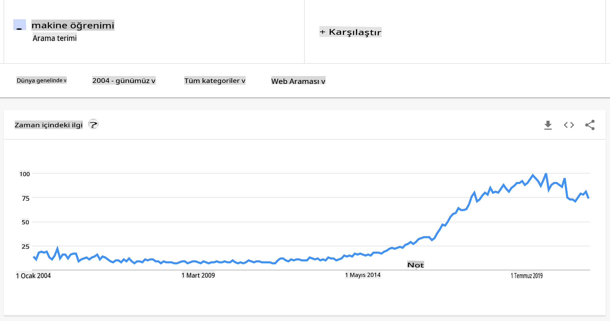
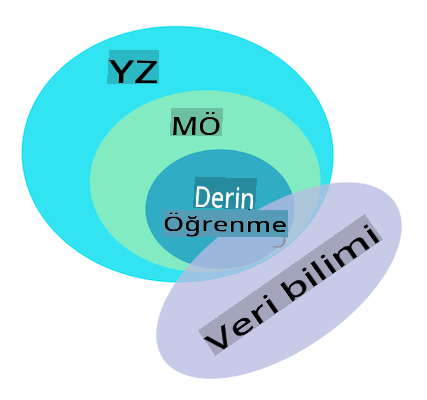

# Makine Öğrenimine Giriş

## [Ders Öncesi Test](https://gray-sand-07a10f403.1.azurestaticapps.net/quiz/1/)

---

> 🎥 Bu dersi işleyen kısa bir video için yukarıdaki resme tıklayın.

Yeni başlayanlar için klasik makine öğrenimi konusundaki bu kursa hoş geldiniz! Bu konuya tamamen yeni olsanız da, deneyimli bir ML uygulayıcısı olarak belirli bir alanı tazelemek isteseniz de, bize katıldığınız için mutluyuz! ML çalışmanıza dostça bir başlangıç noktası oluşturmak istiyoruz ve [geri bildiriminizi](https://github.com/microsoft/ML-For-Beginners/discussions) değerlendirmek, yanıtlamak ve dahil etmekten memnuniyet duyarız.

> 🎥 MIT'den John Guttag'ın makine öğrenimini tanıttığı video için yukarıdaki resme tıklayın

---
## Makine Öğrenimi ile Başlamak

Bu müfredata başlamadan önce, bilgisayarınızı yerel olarak notebook'ları çalıştırmaya hazır hale getirmeniz gerekiyor.

- **Bilgisayarınızı bu videolarla yapılandırın**. Sisteminizde [Python nasıl kurulur](https://youtu.be/CXZYvNRIAKM) ve geliştirme için bir [metin editörü nasıl ayarlanır](https://youtu.be/EU8eayHWoZg) öğrenmek için aşağıdaki bağlantıları kullanın.
- **Python öğrenin**. Ayrıca bu kursta kullandığımız, veri bilimciler için faydalı bir programlama dili olan [Python](https://docs.microsoft.com/learn/paths/python-language/?WT.mc_id=academic-77952-leestott) hakkında temel bir anlayışa sahip olmanız önerilir.
- **Node.js ve JavaScript öğrenin**. Bu kursta web uygulamaları oluştururken birkaç kez JavaScript kullanacağız, bu nedenle [node](https://nodejs.org) ve [npm](https://www.npmjs.com/) kurulu olmalı ve hem Python hem de JavaScript geliştirme için [Visual Studio Code](https://code.visualstudio.com/) kullanılabilir olmalıdır.
- **GitHub hesabı oluşturun**. Bizi burada [GitHub](https://github.com) üzerinde bulduğunuza göre, muhtemelen bir hesabınız vardır, ancak yoksa bir hesap oluşturun ve bu müfredatı kendi kullanımınıza forklayın. (Bize bir yıldız vermekten çekinmeyin 😊)
- **Scikit-learn'i keşfedin**. Bu derslerde referans verdiğimiz bir dizi ML kütüphanesi olan [Scikit-learn](https://scikit-learn.org/stable/user_guide.html) ile tanışın.

---
## Makine Öğrenimi Nedir?

'Makine öğrenimi' terimi, günümüzün en popüler ve sık kullanılan terimlerinden biridir. Teknolojiye aşina iseniz, hangi alanda çalışıyor olursanız olun, bu terimi en az bir kez duymuş olma ihtimaliniz oldukça yüksektir. Ancak, makine öğreniminin mekanikleri çoğu insan için bir gizemdir. Makine öğrenimine yeni başlayan biri için konu bazen bunaltıcı olabilir. Bu nedenle, makine öğreniminin ne olduğunu anlamak ve pratik örneklerle adım adım öğrenmek önemlidir.

---
## Hype Eğrisi

> Google Trends, 'makine öğrenimi' teriminin son zamanlardaki 'hype eğrisini' gösteriyor

---
## Gizemli Bir Evren

Büyüleyici gizemlerle dolu bir evrende yaşıyoruz. Stephen Hawking, Albert Einstein ve daha birçok büyük bilim insanı, etrafımızdaki dünyanın gizemlerini ortaya çıkaran anlamlı bilgileri aramak için hayatlarını adadılar. Bu, öğrenmenin insan halidir: Bir insan çocuğu yeni şeyler öğrenir ve büyüdükçe dünyasının yapısını yıl yıl keşfeder.

---
## Çocuğun Beyni

Bir çocuğun beyni ve duyuları, çevresindeki gerçekleri algılar ve hayatın gizli kalıplarını yavaş yavaş öğrenir, bu da çocuğun öğrenilen kalıpları tanımlamak için mantıksal kurallar oluşturmasına yardımcı olur. İnsan beyninin öğrenme süreci, insanları bu dünyanın en sofistike canlısı yapar. Gizli kalıpları keşfederek sürekli öğrenmek ve ardından bu kalıplar üzerinde yenilik yapmak, yaşamımız boyunca kendimizi daha iyi hale getirmemizi sağlar. Bu öğrenme kapasitesi ve evrimleşme yeteneği, [beyin plastisitesi](https://www.simplypsychology.org/brain-plasticity.html) adlı bir kavramla ilgilidir. Yüzeysel olarak, insan beyninin öğrenme süreci ile makine öğrenimi kavramları arasında bazı motive edici benzerlikler çizebiliriz.

---
## İnsan Beyni

[İnsan beyni](https://www.livescience.com/29365-human-brain.html), gerçek dünyadan şeyleri algılar, algılanan bilgileri işler, rasyonel kararlar alır ve duruma göre belirli eylemler gerçekleştirir. Buna zeki davranmak diyoruz. Zeki davranış sürecinin bir benzerini bir makineye programladığımızda, buna yapay zeka (AI) denir.

---
## Bazı Terminoloji

Terimler karıştırılabilse de, makine öğrenimi (ML), yapay zekanın önemli bir alt kümesidir. **ML, rasyonel karar verme sürecini doğrulamak için algılanan verilerden anlamlı bilgiler ortaya çıkarmak ve gizli kalıpları bulmak için özel algoritmalar kullanmakla ilgilidir**.

---
## AI, ML, Derin Öğrenme

> AI, ML, derin öğrenme ve veri bilimi arasındaki ilişkileri gösteren bir diyagram. [Jen Looper](https://twitter.com/jenlooper) tarafından [bu grafik](https://softwareengineering.stackexchange.com/questions/366996/distinction-between-ai-ml-neural-networks-deep-learning-and-data-mining) ilham alınarak hazırlanan infografik

---
## Kapsanacak Konular

Bu müfredatta, bir başlangıcın bilmesi gereken makine öğreniminin temel kavramlarını ele alacağız. Öğrencilerin temel bilgileri öğrenmek için kullandığı mükemmel bir kütüphane olan Scikit-learn'i kullanarak 'klasik makine öğrenimi' dediğimiz şeyi kapsıyoruz. Yapay zeka veya derin öğrenmenin daha geniş kavramlarını anlamak için, makine öğreniminin güçlü bir temel bilgisine sahip olmak gereklidir ve bu bilgiyi burada sunmak istiyoruz.

---
## Bu Kursta Öğrenecekleriniz:

- makine öğreniminin temel kavramları
- ML'nin tarihi
- ML ve adalet
- regresyon ML teknikleri
- sınıflandırma ML teknikleri
- kümeleme ML teknikleri
- doğal dil işleme ML teknikleri
- zaman serisi tahminleme ML teknikleri
- pekiştirmeli öğrenme
- ML'nin gerçek dünya uygulamaları

---
## Kapsamayacağımız Konular

- derin öğrenme
- sinir ağları
- AI

Daha iyi bir öğrenme deneyimi sağlamak için, sinir ağlarının karmaşıklıklarından, 'derin öğrenme' - sinir ağları kullanarak çok katmanlı model oluşturma - ve AI'dan kaçınacağız, bunları farklı bir müfredatta ele alacağız. Ayrıca, bu daha geniş alanın bir yönüne odaklanmak için gelecek veri bilimi müfredatını sunacağız.

---
## Neden Makine Öğrenimi Çalışmalıyız?

Sistemler perspektifinden makine öğrenimi, verilerden gizli kalıpları öğrenerek akıllı kararlar almaya yardımcı olan otomatik sistemlerin oluşturulması olarak tanımlanır.

Bu motivasyon, insan beyninin dış dünyadan algıladığı verilere dayanarak belirli şeyleri nasıl öğrendiğinden gevşek bir şekilde ilham almıştır.

✅ Bir işin neden makine öğrenimi stratejilerini kullanmak isteyebileceğini düşünün, sabit kodlanmış kurallara dayalı bir motor oluşturmak yerine.

---
## Makine Öğrenimi Uygulamaları

Makine öğrenimi uygulamaları artık hemen her yerde ve akıllı telefonlarımız, bağlı cihazlarımız ve diğer sistemler tarafından üretilen veriler kadar yaygın. En son teknoloji makine öğrenimi algoritmalarının muazzam potansiyelini göz önünde bulundurarak, araştırmacılar, çok boyutlu ve çok disiplinli gerçek yaşam problemlerini büyük olumlu sonuçlarla çözme yeteneklerini araştırıyorlar.

---
## Uygulamalı ML Örnekleri

**Makine öğrenimini birçok şekilde kullanabilirsiniz**:

- Bir hastanın tıbbi geçmişinden veya raporlarından hastalık olasılığını tahmin etmek için.
- Hava durumu verilerini kullanarak hava olaylarını tahmin etmek için.
- Bir metnin duyarlılığını anlamak için.
- Propagandanın yayılmasını durdurmak için sahte haberleri tespit etmek için.

Finans, ekonomi, yer bilimi, uzay keşfi, biyomedikal mühendislik, bilişsel bilim ve hatta beşeri bilimler alanları, alanlarının zorlu, veri işleme ağırlıklı sorunlarını çözmek için makine öğrenimini benimsemiştir.

---
## Sonuç

Makine öğrenimi, gerçek dünyadan veya üretilmiş verilerden anlamlı içgörüler bularak kalıp keşfetme sürecini otomatikleştirir. İş, sağlık ve finans uygulamaları da dahil olmak üzere birçok alanda son derece değerli olduğunu kanıtlamıştır.

Yakın gelecekte, makine öğreniminin temellerini anlamak, yaygın olarak benimsenmesi nedeniyle herhangi bir alandaki insanlar için bir zorunluluk haline gelecektir.

---
# 🚀 Meydan Okuma

Kağıt üzerinde veya [Excalidraw](https://excalidraw.com/) gibi bir çevrimiçi uygulama kullanarak, AI, ML, derin öğrenme ve veri bilimi arasındaki farkları anladığınızı çizin. Bu tekniklerin her birinin çözmede iyi olduğu problemler hakkında bazı fikirler ekleyin.

# [Ders Sonrası Test](https://gray-sand-07a10f403.1.azurestaticapps.net/quiz/2/)

---
# İnceleme & Kendi Kendine Çalışma

Bulutta ML algoritmalarıyla nasıl çalışabileceğiniz hakkında daha fazla bilgi edinmek için bu [Öğrenme Yolunu](https://docs.microsoft.com/learn/paths/create-no-code-predictive-models-azure-machine-learning/?WT.mc_id=academic-77952-leestott) takip edin.

ML'nin temelleri hakkında bir [Öğrenme Yolu](https://docs.microsoft.com/learn/modules/introduction-to-machine-learning/?WT.mc_id=academic-77952-leestott) alın.

---
# Ödev

[Başlamak için](assignment.md)

**Feragatname**: 
Bu belge, makine tabanlı yapay zeka çeviri hizmetleri kullanılarak çevrilmiştir. Doğruluk için çaba göstersek de, otomatik çevirilerin hata veya yanlışlıklar içerebileceğini lütfen unutmayın. Orijinal belge, kendi dilinde yetkili kaynak olarak kabul edilmelidir. Kritik bilgiler için profesyonel insan çevirisi önerilir. Bu çevirinin kullanımından doğabilecek yanlış anlaşılmalar veya yanlış yorumlamalardan sorumlu değiliz.