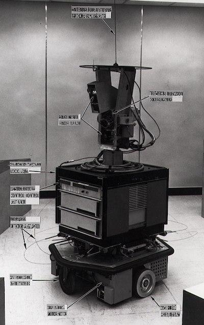
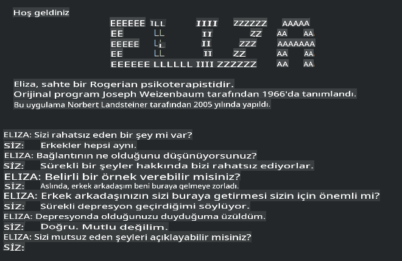

# Makine Öğrenmesinin Tarihi

> Sketchnote: [Tomomi Imura](https://www.twitter.com/girlie_mac)

## [Ders Öncesi Quiz](https://gray-sand-07a10f403.1.azurestaticapps.net/quiz/3/)

---

> 🎥 Bu dersi içeren kısa bir video için yukarıdaki resme tıklayın.

Bu derste, makine öğrenmesi ve yapay zekanın tarihindeki önemli dönüm noktalarını inceleyeceğiz.

Yapay zekanın (AI) bir alan olarak tarihi, makine öğrenmesinin tarihi ile iç içedir, çünkü ML'yi destekleyen algoritmalar ve hesaplama ilerlemeleri AI'nın gelişimine katkıda bulunmuştur. Bu alanların ayrı araştırma alanları olarak 1950'lerde şekillenmeye başladığını hatırlamak faydalıdır, önemli [algoritmik, istatistiksel, matematiksel, hesaplama ve teknik keşifler](https://wikipedia.org/wiki/Timeline_of_machine_learning) bu dönemin öncesinde ve sonrasında gerçekleşmiştir. Aslında, insanlar bu sorular hakkında [yüzlerce yıldır](https://wikipedia.org/wiki/History_of_artificial_intelligence) düşünmektedir: bu makale, 'düşünen makine' fikrinin tarihsel entelektüel temellerini tartışmaktadır.

---
## Önemli Keşifler

- 1763, 1812 [Bayes Teoremi](https://wikipedia.org/wiki/Bayes%27_theorem) ve öncülleri. Bu teorem ve uygulamaları, bir olayın gerçekleşme olasılığını önceki bilgiye dayanarak tanımlayan çıkarımın temelini oluşturur.
- 1805 [En Küçük Kareler Teorisi](https://wikipedia.org/wiki/Least_squares) Fransız matematikçi Adrien-Marie Legendre tarafından. Bu teori, veri uyumlamada yardımcı olur ve Regresyon birimimizde öğreneceksiniz.
- 1913 [Markov Zincirleri](https://wikipedia.org/wiki/Markov_chain), Rus matematikçi Andrey Markov'un adını taşır ve önceki bir duruma dayalı olarak olası olaylar dizisini tanımlar.
- 1957 [Perceptron](https://wikipedia.org/wiki/Perceptron) Amerikan psikolog Frank Rosenblatt tarafından icat edilen bir tür lineer sınıflandırıcıdır ve derin öğrenmede ilerlemelerin temelini oluşturur.

---

- 1967 [En Yakın Komşu](https://wikipedia.org/wiki/Nearest_neighbor) başlangıçta rota haritalamak için tasarlanmış bir algoritmadır. ML bağlamında desenleri tespit etmek için kullanılır.
- 1970 [Geri Yayılım](https://wikipedia.org/wiki/Backpropagation) [ileri beslemeli sinir ağlarını](https://wikipedia.org/wiki/Feedforward_neural_network) eğitmek için kullanılır.
- 1982 [Yinelemeli Sinir Ağları](https://wikipedia.org/wiki/Recurrent_neural_network) ileri beslemeli sinir ağlarından türetilen ve zamansal grafikler oluşturan yapay sinir ağlarıdır.

✅ Biraz araştırma yapın. ML ve AI tarihinde öne çıkan diğer tarihler nelerdir?

---
## 1950: Düşünen Makineler

2019 yılında [kamuoyu tarafından](https://wikipedia.org/wiki/Icons:_The_Greatest_Person_of_the_20th_Century) 20. yüzyılın en büyük bilim insanı olarak seçilen gerçekten olağanüstü bir kişi olan Alan Turing, 'düşünebilen bir makine' kavramının temellerini atmaya yardımcı olduğu için takdir edilir. Bu kavramın ampirik kanıtlarına duyduğu ihtiyaç ve karşıt görüşlerle başa çıkmak için [Turing Testi](https://www.bbc.com/news/technology-18475646) oluşturdu; bu testi NLP derslerimizde keşfedeceksiniz.

---
## 1956: Dartmouth Yaz Araştırma Projesi

"Yapay zeka alanı için dönüm noktası olan Dartmouth Yaz Araştırma Projesi," ve burada 'yapay zeka' terimi icat edilmiştir ([kaynak](https://250.dartmouth.edu/highlights/artificial-intelligence-ai-coined-dartmouth)).

> Öğrenmenin veya zekanın herhangi bir özelliğinin o kadar kesin bir şekilde tanımlanabileceği ki bir makine bunu simüle edebilir.

---

Baş araştırmacı, matematik profesörü John McCarthy, "Öğrenmenin veya zekanın herhangi bir özelliğinin o kadar kesin bir şekilde tanımlanabileceği ki bir makine bunu simüle edebilir" hipotezine dayalı olarak ilerlemeyi umuyordu. Katılımcılar arasında alanın diğer bir aydınlanmış ismi Marvin Minsky de vardı.

Çalıştay, "sembolik yöntemlerin yükselişi, sınırlı alanlara odaklanan sistemler (erken uzman sistemler) ve çıkarımsal sistemler ile tümevarımsal sistemler arasındaki tartışmaların" başlatılması ve teşvik edilmesiyle tanınır ([kaynak](https://wikipedia.org/wiki/Dartmouth_workshop)).

---
## 1956 - 1974: "Altın Yıllar"

1950'lerden 1970'lerin ortalarına kadar, AI'nın birçok sorunu çözebileceği umuduyla büyük bir iyimserlik hakimdi. 1967'de Marvin Minsky, "Bir nesil içinde ... 'yapay zeka' yaratma sorunu büyük ölçüde çözülecek" diye güvenle belirtti (Minsky, Marvin (1967), Computation: Finite and Infinite Machines, Englewood Cliffs, N.J.: Prentice-Hall).

Doğal dil işleme araştırmaları gelişti, arama daha rafine ve güçlü hale geldi ve 'mikro-dünyalar' konsepti oluşturuldu, burada basit görevler düz dil talimatları kullanılarak tamamlandı.

---

Araştırmalar devlet kurumları tarafından iyi finanse edildi, hesaplama ve algoritmalar konusunda ilerlemeler kaydedildi ve akıllı makinelerin prototipleri inşa edildi. Bu makinelerden bazıları şunlardır:

* [Shakey the robot](https://wikipedia.org/wiki/Shakey_the_robot), görevleri 'akıllıca' nasıl gerçekleştireceğine karar verebilen ve manevra yapabilen bir robottu.

    
    > 1972'de Shakey

---

* Eliza, erken bir 'chatterbot', insanlarla sohbet edebilen ve ilkel bir 'terapist' olarak hareket edebilen bir robottu. Eliza hakkında daha fazla bilgiyi NLP derslerimizde öğreneceksiniz.

    
    > Bir sohbet botu olan Eliza'nın bir versiyonu

---

* "Blocks world" blokların istiflenip sıralanabileceği ve makinelerin karar vermeyi öğrenme deneylerinin test edilebileceği bir mikro-dünya örneğiydi. [SHRDLU](https://wikipedia.org/wiki/SHRDLU) gibi kütüphanelerle yapılan ilerlemeler dil işlemenin ilerlemesine yardımcı oldu.

    

    > 🎥 Yukarıdaki resme tıklayarak bir video izleyin: SHRDLU ile Blocks world

---
## 1974 - 1980: "AI Kışı"

1970'lerin ortalarına gelindiğinde, 'akıllı makineler' yapmanın karmaşıklığının hafife alındığı ve mevcut hesaplama gücü göz önüne alındığında vaatlerinin abartıldığı ortaya çıktı. Fonlar kurudu ve alandaki güven yavaşladı. Güveni etkileyen bazı sorunlar şunlardı:
---
- **Sınırlamalar**. Hesaplama gücü çok sınırlıydı.
- **Kombinatoryal patlama**. Bilgisayarlardan daha fazla şey istendikçe eğitilmesi gereken parametrelerin sayısı üstel olarak arttı, ancak hesaplama gücü ve yetenekleri paralel olarak evrimleşmedi.
- **Veri kıtlığı**. Algoritmaların test edilmesi, geliştirilmesi ve rafine edilmesi sürecini engelleyen veri kıtlığı vardı.
- **Doğru soruları mı soruyoruz?**. Sorulan soruların kendisi sorgulanmaya başlandı. Araştırmacılar yaklaşımları hakkında eleştiriler almaya başladı:
  - Turing testleri, diğer fikirler arasında, 'Çin odası teorisi' aracılığıyla sorgulandı, bu teori "dijital bir bilgisayarı programlamanın dili anlamasını sağlayabileceğini ancak gerçek bir anlayış üretemeyeceğini" öne sürüyordu ([kaynak](https://plato.stanford.edu/entries/chinese-room/)).
  - "Terapist" ELIZA gibi yapay zekaların topluma tanıtılmasının etiği tartışıldı.

---

Aynı zamanda, çeşitli AI düşünce okulları oluşmaya başladı. ["Düzensiz" ve "düzenli AI"](https://wikipedia.org/wiki/Neats_and_scruffies) uygulamaları arasında bir ikilik oluştu. _Düzensiz_ laboratuvarlar, istedikleri sonuçları elde edene kadar programları saatlerce ayarladılar. _Düzenli_ laboratuvarlar "mantık ve resmi problem çözmeye" odaklandı. ELIZA ve SHRDLU, iyi bilinen _düzensiz_ sistemlerdi. 1980'lerde, ML sistemlerini tekrarlanabilir hale getirme talebi ortaya çıktıkça, _düzenli_ yaklaşım yavaş yavaş ön plana çıktı çünkü sonuçları daha açıklanabilir.

---
## 1980'ler Uzman Sistemler

Alan büyüdükçe, iş dünyasına olan faydası daha net hale geldi ve 1980'lerde 'uzman sistemlerin' yaygınlaşması da öyle. "Uzman sistemler, ilk gerçekten başarılı yapay zeka (AI) yazılım biçimleri arasındaydı." ([kaynak](https://wikipedia.org/wiki/Expert_system)).

Bu tür bir sistem aslında _hibrit_ bir yapıya sahiptir, kısmen iş gereksinimlerini tanımlayan bir kurallar motoru ve kurallar sisteminden yararlanarak yeni gerçekleri çıkaran bir çıkarım motorundan oluşur.

Bu dönemde ayrıca sinir ağlarına artan bir ilgi gösterildi.

---
## 1987 - 1993: AI 'Soğuması'

Uzman sistemlerin özelleşmiş donanımının yaygınlaşması, ne yazık ki, çok özelleşmiş hale gelmesine neden oldu. Kişisel bilgisayarların yükselişi de bu büyük, özelleşmiş, merkezi sistemlerle rekabet etti. Bilgi işlem demokratikleşmeye başlamıştı ve bu, sonunda büyük verinin modern patlamasına yol açtı.

---
## 1993 - 2011

Bu dönem, ML ve AI'nın daha önce veri ve hesaplama gücü eksikliği nedeniyle yaşanan bazı sorunları çözebilmesi için yeni bir dönem oldu. Veri miktarı hızla artmaya ve daha geniş çapta erişilebilir hale gelmeye başladı, özellikle 2007 civarında akıllı telefonların ortaya çıkmasıyla birlikte, hem iyi hem de kötü yönleriyle. Hesaplama gücü üstel olarak genişledi ve algoritmalar buna paralel olarak evrimleşti. Alan, geçmişin serbest günlerinin gerçek bir disipline dönüşmesiyle olgunlaşmaya başladı.

---
## Günümüz

Bugün makine öğrenmesi ve yapay zeka hayatımızın hemen her alanına dokunuyor. Bu dönem, bu algoritmaların insan yaşamı üzerindeki riskleri ve potansiyel etkilerini dikkatli bir şekilde anlamayı gerektirir. Microsoft'tan Brad Smith'in belirttiği gibi, "Bilgi teknolojisi, gizlilik ve ifade özgürlüğü gibi temel insan hakları korumalarının kalbine giden sorunları gündeme getiriyor. Bu sorunlar, bu ürünleri yaratan teknoloji şirketleri için sorumluluğu artırıyor. Bizim görüşümüze göre, aynı zamanda dikkatli hükümet düzenlemeleri ve kabul edilebilir kullanımlar etrafında normların geliştirilmesini gerektiriyor" ([kaynak](https://www.technologyreview.com/2019/12/18/102365/the-future-of-ais-impact-on-society/)).

---

Geleceğin ne getireceği henüz belli değil, ancak bu bilgisayar sistemlerini ve çalıştırdıkları yazılım ve algoritmaları anlamak önemlidir. Bu müfredatın, daha iyi bir anlayış kazanmanıza ve kendiniz karar vermenize yardımcı olacağını umuyoruz.

> 🎥 Yukarıdaki resme tıklayarak bir video izleyin: Yann LeCun bu derste derin öğrenmenin tarihini tartışıyor

---
## 🚀Meydan Okuma

Bu tarihi anlardan birine derinlemesine dalın ve arkasındaki insanlar hakkında daha fazla bilgi edinin. İlginç karakterler var ve hiçbir bilimsel keşif kültürel bir boşlukta yaratılmamıştır. Ne keşfediyorsunuz?

## [Ders Sonrası Quiz](https://gray-sand-07a10f403.1.azurestaticapps.net/quiz/4/)

---
## İnceleme ve Kendi Kendine Çalışma

İzlemeniz ve dinlemeniz için öğeler:

[Amy Boyd'un AI'nın evrimini tartıştığı bu podcast](http://runasradio.com/Shows/Show/739)

---

## Ödev

[Bir zaman çizelgesi oluşturun](assignment.md)

**Feragatname**: 
Bu belge, makine tabanlı yapay zeka çeviri hizmetleri kullanılarak çevrilmiştir. Doğruluk için çaba göstersek de, otomatik çevirilerin hata veya yanlışlıklar içerebileceğini lütfen unutmayın. Belgenin orijinal dili, yetkili kaynak olarak kabul edilmelidir. Kritik bilgiler için profesyonel insan çevirisi önerilmektedir. Bu çevirinin kullanımından kaynaklanan herhangi bir yanlış anlama veya yanlış yorumlamadan sorumlu değiliz.