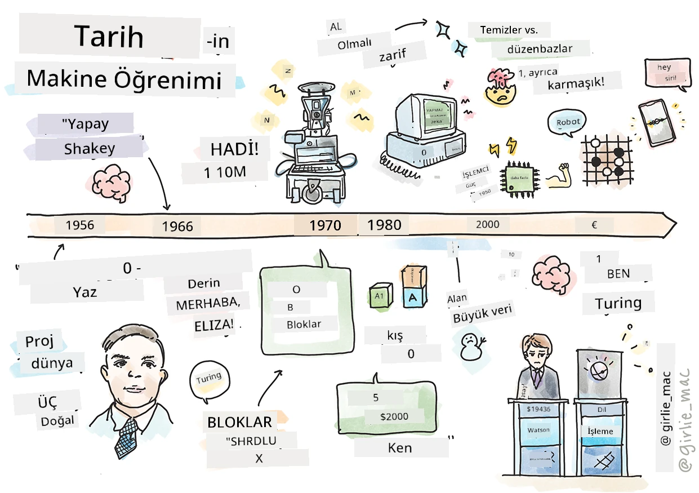
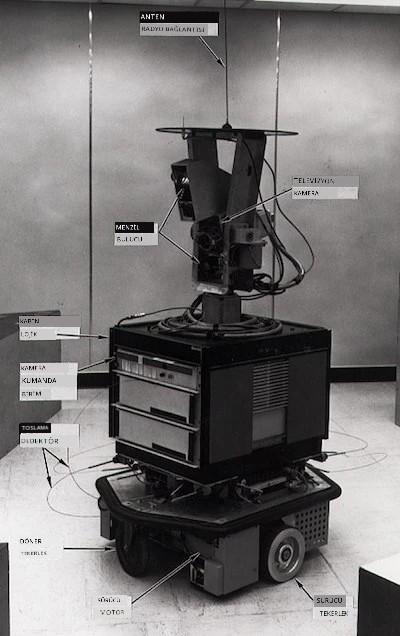
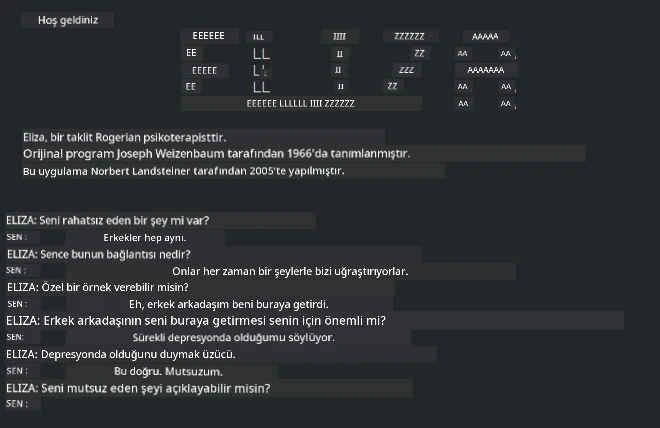

# Makine öğrenmesinin tarihi

> Sketchnote, [Tomomi Imura](https://www.twitter.com/girlie_mac) tarafından hazırlanmıştır

## [Ders öncesi quiz](https://ff-quizzes.netlify.app/en/ml/)

---

> 🎥 Bu dersin kısa videosunu izlemek için yukarıdaki resme tıklayın.

Bu derste, makine öğrenmesi ve yapay zekanın tarihindeki önemli dönüm noktalarını inceleyeceğiz.

Yapay zeka (YZ) alanının tarihi, makine öğrenmesinin tarihinden ayrılmaz biçimde iç içedir; çünkü ML'nin temelini oluşturan algoritmalar ve hesaplama gelişmeleri YZ'nin gelişimini beslemiştir. Bu alanların ayrı araştırma dalları olarak 1950’lerde belirginleşmeye başladığını hatırlamak faydalıdır, ancak önemli [algoritmik, istatistiksel, matematiksel, hesaplama ve teknik keşifler](https://wikipedia.org/wiki/Timeline_of_machine_learning) bu döneme önceki dönemlerde var olmuş ve üst üste binmiştir. Aslında, insanlar bu sorular üzerinde [yüzlerce yıldır](https://wikipedia.org/wiki/History_of_artificial_intelligence) düşünüyor: bu makale 'düşünen makina' fikrinin tarihsel entelektüel temellerini ele alır.

---
## Önemli keşifler

- 1763, 1812 [Bayes Teoremi](https://wikipedia.org/wiki/Bayes%27_theorem) ve öncülleri. Bu teorem ve uygulamaları, ön bilgiye dayanarak bir olayın gerçekleşme olasılığını tanımlayan çıkarımların temelini oluşturur.
- 1805 Fransız matematikçi Adrien-Marie Legendre tarafından geliştirilen [En Küçük Kareler Teorisi](https://wikipedia.org/wiki/Least_squares). Bu teori, Regresyon birimimizde öğreneceğiniz gibi, veri uyumunda yardımcı olur.
- 1913 Rus matematikçi Andrey Markov'un adını taşıyan [Markov Zincirleri](https://wikipedia.org/wiki/Markov_chain), önceki duruma bağlı olarak olası olayların sırasını tanımlamak için kullanılır.
- 1957 Amerikalı psikolog Frank Rosenblatt tarafından icat edilen ve derin öğrenmedeki gelişmelerin temelini oluşturan [Perceptron](https://wikipedia.org/wiki/Perceptron) tipi bir doğrusal sınıflandırıcıdır.

---

- 1967 [En Yakın Komşu](https://wikipedia.org/wiki/Nearest_neighbor) algoritması, başlangıçta rota haritalamak için tasarlanmıştır. Makine öğrenimi bağlamında desenleri tespit etmek için kullanılır.
- 1970 [Geri Yayılım](https://wikipedia.org/wiki/Backpropagation) algoritması, [ileri beslemeli sinir ağlarını](https://wikipedia.org/wiki/Feedforward_neural_network) eğitmek için kullanılır.
- 1982 [Tekrarlayan Sinir Ağları](https://wikipedia.org/wiki/Recurrent_neural_network), zamanı temel alan grafikler yaratan yapay sinir ağlarıdır ve ileri beslemeli ağlardan türemiştir.

✅ Küçük bir araştırma yapın. Makine öğrenimi ve yapay zeka tarihindeki başka hangi tarihler dönüm noktası olarak öne çıkar?

---
## 1950: Düşünen makineler

Gerçekten sıra dışı bir kişilik olan Alan Turing, [2019’da halk tarafından](https://wikipedia.org/wiki/Icons:_The_Greatest_Person_of_the_20th_Century) 20. yüzyılın en büyük bilim insanı seçildi ve ‘düşünebilen bir makine’ kavramının temelini atmakta yardımcı olduğuna inanılır. Bu kavrama itiraz edenlerle ve bu kavrama dair kendi ampirik kanıt ihtiyacıyla mücadele ederken, NLP derslerinde inceleyeceğiniz [Turing Testi](https://www.bbc.com/news/technology-18475646)ni geliştirdi.

---
## 1956: Dartmouth Yaz Araştırma Projesi

"Yapay zekâ alanında Dartmouth Yaz Araştırma Projesi, alan için dönüm noktası oldu" ve burada ‘yapay zeka’ terimi ilk kez ortaya atıldı ([kaynak](https://250.dartmouth.edu/highlights/artificial-intelligence-ai-coined-dartmouth)).

> Öğrenmenin veya zekanın herhangi bir yönü prensipte o kadar kesin tanımlanabilir ki, bunu simüle eden bir makina yapılabilir.

---

Baş araştırmacı, matematik profesörü John McCarthy, "öğrenmenin veya zekanın herhangi bir yönünün prensipte o kadar kesin tanımlanabileceği ve bir makinanın bunu simüle edebileceği varsayımı ile ilerlemeyi" umuyordu. Katılımcılar arasında alanın diğer önemli isimlerinden Marvin Minsky yer aldı.

Atölye çalışması, "sembolik yöntemlerin yükselişi, sınırlı alanlara odaklanan sistemler (erken uzman sistemler) ve tümdengelimsel sistemler ile tümevarımsal sistemler arasındaki tartışmaların başlaması ve teşvik edilmesi" ile anılır ([kaynak](https://wikipedia.org/wiki/Dartmouth_workshop)).

---
## 1956 - 1974: "Altın yıllar"

1950’den 1970’lerin ortasına kadar, YZ’nin birçok problemi çözebileceği konusunda yüksek bir iyimserlik hakimdi. 1967’de Marvin Minsky, "Bir nesil içinde… 'yapay zeka' yaratma sorunu büyük ölçüde çözülecek." diye emin bir şekilde belirtmiştir. (Minsky, Marvin (1967), Computation: Finite and Infinite Machines, Englewood Cliffs, N.J.: Prentice-Hall)

Doğal dil işleme araştırmaları gelişti, arama daha da geliştirildi ve güçlendirildi, ve 'mikro-dünyalar' kavramı oluşturuldu; burada basit görevler basit dil komutlarıyla yapılıyordu.

---

Araştırmalar devlet kurumları tarafından iyi finanse edildi, hesaplamada ve algoritmalarda ilerlemeler kaydedildi, ve akıllı makinelerin prototipleri üretildi. Bunlardan bazıları şunlardır:

* Görevleri ‘akıllıca’ yapabilecek şekilde yönelip karar verebilen [Shakey robot](https://wikipedia.org/wiki/Shakey_the_robot).

    
    > 1972 yılında Shakey

---

* Erken bir 'sohbet botu' olan Eliza, insanlarla sohbet edebilir ve ilkel bir 'terapist' gibi davranabilirdi. NLP derslerinde Eliza hakkında daha fazla bilgi edineceksiniz.

    
    > Bir sohbet botu olan Eliza'nın bir versiyonu

---

* "Bloklar dünyası", blokların üst üste konup sıralanabileceği ve makinelerin karar vermeyi öğrenmelerinin denenebileceği bir mikro-dünya örneğiydi. [SHRDLU](https://wikipedia.org/wiki/SHRDLU) gibi kütüphanelerle yapılan gelişmeler, dil işlemeyi ileri taşıdı.

    

    > 🎥 Yukarıdaki resme video için tıklayın: SHRDLU ile bloklar dünyası

---
## 1974 - 1980: "YZ Kışı"

1970’lerin ortalarına gelindiğinde 'zeka makinesi' yaratmanın zorluğu ve vaatlerinin mevcut hesaplama gücüyle karşılanamayacağı anlaşılmıştı. Finansman kurudu ve alana güven azaldı. Güveni etkileyen bazı sorunlar şunlardı:
---
- **Sınırlamalar**. Hesaplama gücü çok sınırlıydı.
- **Kombinatoryal patlama**. Bilgisayarlardan daha çok şey istendikçe eğitilmesi gereken parametre sayısı üssel olarak arttı, ancak hesaplama gücü ve kabiliyeti bu artışa paralel gelişmedi.
- **Veri kıtlığı**. Algoritmaları test etme, geliştirme ve iyileştirme sürecini engelleyen veri eksikliği vardı.
- **Doğru soruları mı soruyoruz?**. Sorulan sorular sorgulanmaya başlandı. Araştırmacılar yaklaşımlarına yönelik eleştiriler aldı:
  - Turing testleri, "Çin odası teorisi" gibi fikirlerle sorgulandı; bu teori, "dijital bir bilgisayara programlama yaparak dil anlıyormuş gibi görünmesi sağlanabilir ancak gerçek anlayışı üretemez" der ([kaynak](https://plato.stanford.edu/entries/chinese-room/)).
  - "Terapist" ELIZA gibi yapay zekaların topluma tanıtılmasının etikliği tartışıldı.

---

Aynı zamanda, çeşitli YZ düşünce okulları oluşmaya başladı. ["dağınık" ve "düzenli YZ"](https://wikipedia.org/wiki/Neats_and_scruffies) uygulamaları arasında bir ikilik kuruldu. _Dağınık_ laboratuvarlar istedikleri sonuçları alıncaya kadar programları saatlerce değiştirdiler. _Düzenli_ laboratuvarlar "mantık ve formal problem çözmeye odaklandılar." ELIZA ve SHRDLU iyi bilinen _dağınık_ sistemlerdi. 1980'lerde ML sistemlerinin çoğaltılabilir olması talebi ortaya çıktıkça, _düzenli_ yaklaşım giderek ön plana çıktı; çünkü sonuçları daha açıklanabilirdi.

---
## 1980’ler Uzman Sistemler

Alan büyüdükçe, iş dünyasına faydaları daha belirgin oldu ve 1980'lerde 'uzman sistemler' yaygınlaştı. "Uzman sistemler, yapay zekâ (YZ) yazılımlarının ilk gerçekten başarılı biçimlerinden biridir." ([kaynak](https://wikipedia.org/wiki/Expert_system)).

Bu tür sistemler aslında _karma_ uygulamalardır ve kısmen iş gereksinimlerini belirleyen kurallar motorundan, kısmen de bu kurallar sistemini kullanarak yeni gerçekler çıkaran çıkarım motorundan oluşur.

Bu dönemde sinir ağlarına artan ilgi oldu.

---
## 1987 - 1993: YZ 'Durağanlığı'

Uzman sistemlerin donanımının fazla özelleşmesi olumsuz etki yaptı. Kişisel bilgisayarların yükselişi bu büyük, özel, merkezi sistemlerle rekabet etti. Bilgi işlem demokratikleşmeye başladı ve bu, sonunda büyük veri patlamasının yolunu açtı.

---
## 1993 - 2011

Bu çağ, veri ve hesaplama gücü eksikliğinin önceden neden olduğu sorunları çözmek için ML ve YZ için yeni bir dönem açtı. Veri miktarı hızla arttı ve daha geniş biçimde erişilebilir hale geldi; özellikle 2007 civarındaki akıllı telefonun ortaya çıkışıyla. Hesaplama gücü üssel olarak büyüdü ve algoritmalar da gelişti. Alan olgunlaşmaya başladı; geçmişin özgür, serbest günleri gerçek bir disipline dönüştü.

---
## Günümüz

Günümüzde makine öğrenimi ve YZ hayatımızın neredeyse her alanına dokunuyor. Bu çağ, algoritmaların insan hayatı üzerindeki risklerini ve potansiyel etkilerini dikkatle anlamayı gerektiriyor. Microsoft'tan Brad Smith’in de belirttiği gibi, "Bilgi teknolojisi gizlilik ve ifade özgürlüğü gibi temel insan hakları korumalarının özüne dokunan sorunları gündeme getiriyor. Bu sorunlar, bu ürünleri geliştiren teknoloji şirketleri için artan sorumluluklar doğurur. Bizim görüşümüze göre, aynı zamanda düşünceli hükümet düzenlemeleri ve kabul edilebilir kullanımlara dair normların geliştirilmesini gerektirir." ([kaynak](https://www.technologyreview.com/2019/12/18/102365/the-future-of-ais-impact-on-society/)).

---

Geleceğin ne getireceği henüz görülmedi, ancak bu bilgisayar sistemlerini ve onların çalıştırdığı yazılım ile algoritmaları anlamak önemlidir. Umarız bu müfredat, kendiniz için karar verebilecek derecede iyi bir anlayış kazanmanıza yardımcı olur.

> 🎥 Yukarıdaki resme dersin videosu için tıklayın: Yann LeCun derste derin öğrenmenin tarihini anlatıyor

---
## 🚀Meydan okuma

Bu tarihi anlardan birine dalın ve arkasındaki insanları daha fazla keşfedin. Büyüleyici karakterler var ve hiçbir bilimsel keşif kültürel bir vakumda yaratılmadı. Siz neler keşfediyorsunuz?

## [Ders sonrası quiz](https://ff-quizzes.netlify.app/en/ml/)

---
## Gözden Geçirme & Kendi Kendine Çalışma

İzlemeniz ve dinlemeniz gerekenler:

[Amy Boyd’un YZ'nin evrimini tartıştığı bu podcast](http://runasradio.com/Shows/Show/739)

---

## Ödev

[Bir zaman çizelgesi oluşturun](assignment.md)

---

<!-- CO-OP TRANSLATOR DISCLAIMER START -->
**Feragatname**:
Bu belge, AI çeviri hizmeti [Co-op Translator](https://github.com/Azure/co-op-translator) kullanılarak çevrilmiştir. Doğruluk için çaba sarf etsek de, otomatik çevirilerin hata veya yanlışlık içerebileceğini lütfen unutmayınız. Orijinal belge, kendi dilinde yetkili kaynak olarak kabul edilmelidir. Kritik bilgiler için profesyonel insan çevirisi önerilir. Bu çevirinin kullanımı sonucu ortaya çıkabilecek yanlış anlamalardan veya yanlış yorumlamalardan sorumlu değiliz.
<!-- CO-OP TRANSLATOR DISCLAIMER END -->