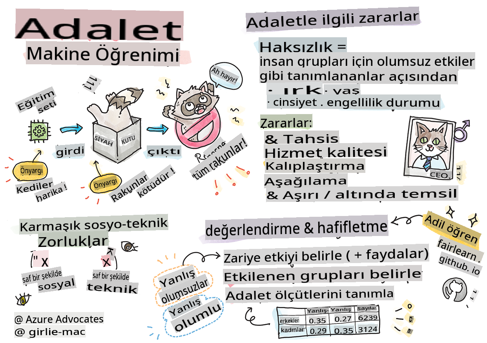

# Sorumlu AI ile Makine Öğrenimi Çözümleri Oluşturma
 

> Sketchnote by [Tomomi Imura](https://www.twitter.com/girlie_mac)

## [Ders Öncesi Quiz](https://gray-sand-07a10f403.1.azurestaticapps.net/quiz/5/)
 
## Giriş

Bu müfredatta, makine öğreniminin günlük hayatımızı nasıl etkileyebileceğini ve etkilediğini keşfetmeye başlayacaksınız. Şu anda bile, sağlık teşhisleri, kredi onayları veya dolandırıcılığı tespit etme gibi günlük karar verme görevlerinde sistemler ve modeller yer alıyor. Bu nedenle, bu modellerin güvenilir sonuçlar sağlamak için iyi çalışması önemlidir. Herhangi bir yazılım uygulaması gibi, AI sistemleri de beklentileri karşılamayacak veya istenmeyen sonuçlar doğuracaktır. Bu yüzden bir AI modelinin davranışını anlamak ve açıklayabilmek çok önemlidir.

Bu modelleri oluşturmak için kullandığınız veriler belirli demografik gruplardan yoksunsa, örneğin ırk, cinsiyet, siyasi görüş, din veya bu demografik grupları orantısız bir şekilde temsil ediyorsa ne olabilir? Modelin çıktısı bazı demografik grupları kayıracak şekilde yorumlandığında ne olur? Uygulama için sonuçları nedir? Ayrıca, modelin olumsuz bir sonucu olduğunda ve insanlara zarar verdiğinde ne olur? AI sistemlerinin davranışından kim sorumludur? Bu müfredatta bu soruları keşfedeceğiz.

Bu derste:

- Makine öğreniminde adaletin önemi ve adaletle ilgili zararlar konusunda farkındalık kazanacaksınız.
- Güvenilirlik ve güvenliği sağlamak için aykırı durumları ve olağandışı senaryoları keşfetme pratiğine aşina olacaksınız.
- Herkesi güçlendirmek için kapsayıcı sistemler tasarlama ihtiyacını anlayacaksınız.
- Verilerin ve insanların gizliliğini ve güvenliğini korumanın ne kadar önemli olduğunu keşfedeceksiniz.
- AI modellerinin davranışını açıklamak için şeffaf bir yaklaşımın önemini göreceksiniz.
- AI sistemlerine güven inşa etmek için hesap verebilirliğin ne kadar önemli olduğunun farkında olacaksınız.

## Önkoşul

Önkoşul olarak, "Sorumlu AI İlkeleri" öğrenme yolunu tamamlayın ve aşağıdaki videoyu izleyin:

Sorumlu AI hakkında daha fazla bilgi edinmek için bu [Öğrenme Yolu](https://docs.microsoft.com/learn/modules/responsible-ai-principles/?WT.mc_id=academic-77952-leestott) bağlantısını takip edin.

> 🎥 Yukarıdaki resme tıklayarak video izleyin: Microsoft'un Sorumlu AI Yaklaşımı

## Adalet

AI sistemleri herkese adil davranmalı ve benzer gruplardaki insanları farklı şekillerde etkilemekten kaçınmalıdır. Örneğin, AI sistemleri tıbbi tedavi, kredi başvuruları veya işe alım konusunda rehberlik sağladığında, benzer semptomlara, mali durumlara veya mesleki niteliklere sahip herkese aynı önerileri yapmalıdır. Hepimiz insan olarak, kararlarımızı ve eylemlerimizi etkileyen miras alınmış önyargılar taşırız. Bu önyargılar, AI sistemlerini eğitmek için kullandığımız verilerde de ortaya çıkabilir. Bu tür manipülasyonlar bazen istemeden olabilir. Verilerde önyargı yaratırken bunu bilinçli olarak fark etmek genellikle zordur.

**“Adaletsizlik”**, ırk, cinsiyet, yaş veya engellilik durumu gibi bir grup insan için olumsuz etkileri veya “zararları” kapsar. Başlıca adaletle ilgili zararlar şu şekilde sınıflandırılabilir:

- **Tahsis**, örneğin bir cinsiyet veya etnisitenin diğerine göre kayırılması.
- **Hizmet kalitesi**. Verileri belirli bir senaryo için eğitmek, ancak gerçekte çok daha karmaşık olması, kötü performans gösteren bir hizmete yol açar. Örneğin, koyu tenli insanları algılayamayan bir el sabunu dağıtıcısı. [Referans](https://gizmodo.com/why-cant-this-soap-dispenser-identify-dark-skin-1797931773)
- **Küçük düşürme**. Bir şeyi veya birini haksız yere eleştirme ve etiketleme. Örneğin, bir görüntü etiketleme teknolojisi, koyu tenli insanların görüntülerini goril olarak yanlış etiketlemiştir.
- **Aşırı veya yetersiz temsil**. Belirli bir grubun belirli bir meslekte görülmediği ve bu durumu teşvik eden herhangi bir hizmet veya işlevin zarara katkıda bulunduğu fikri.
- **Stereotipleştirme**. Belirli bir grubu önceden belirlenmiş özelliklerle ilişkilendirme. Örneğin, İngilizce ve Türkçe arasında çeviri yapan bir dil çeviri sistemi, cinsiyetle ilişkilendirilen kelimeler nedeniyle hatalar yapabilir.

> Türkçeye çeviri

> İngilizceye geri çeviri

AI sistemleri tasarlarken ve test ederken, AI'nın adil olduğundan ve önyargılı veya ayrımcı kararlar vermeye programlanmadığından emin olmalıyız, ki bu kararları insanlar da vermemelidir. AI ve makine öğreniminde adaleti sağlamak karmaşık bir sosyoteknik zorluktur.

### Güvenilirlik ve güvenlik

Güven inşa etmek için, AI sistemlerinin güvenilir, güvenli ve normal ve beklenmedik koşullar altında tutarlı olması gerekir. AI sistemlerinin çeşitli durumlarda nasıl davranacağını bilmek önemlidir, özellikle de aykırı durumlarda. AI çözümleri oluştururken, AI çözümlerinin karşılaşacağı geniş bir yelpazedeki durumları nasıl ele alacağına odaklanmak gerekir. Örneğin, kendi kendine giden bir araba, insanların güvenliğini en üst düzeyde tutmalıdır. Sonuç olarak, arabayı yönlendiren AI, gece, fırtınalar veya kar fırtınaları, sokakta koşan çocuklar, evcil hayvanlar, yol çalışmaları gibi arabanın karşılaşabileceği tüm olası senaryoları dikkate almalıdır. Bir AI sisteminin çeşitli koşulları güvenilir ve güvenli bir şekilde nasıl ele alabileceği, veri bilimci veya AI geliştiricisinin sistemin tasarımı veya test edilmesi sırasında ne kadar öngörülü olduğunu yansıtır.

> [🎥 Video için buraya tıklayın: ](https://www.microsoft.com/videoplayer/embed/RE4vvIl)

### Kapsayıcılık

AI sistemleri herkesin katılımını sağlamalı ve güçlendirmelidir. AI sistemlerini tasarlarken ve uygularken veri bilimciler ve AI geliştiriciler, sistemi istemeden dışlayabilecek potansiyel engelleri belirler ve ele alır. Örneğin, dünya genelinde 1 milyar engelli insan var. AI'nın ilerlemesiyle, günlük yaşamlarında geniş bir bilgi ve fırsat yelpazesine daha kolay erişebilirler. Engelleri ele alarak, herkesin yararına daha iyi deneyimler sunan AI ürünlerini yenilik yapmak ve geliştirmek için fırsatlar yaratır.

> [🎥 Video için buraya tıklayın: AI'da kapsayıcılık](https://www.microsoft.com/videoplayer/embed/RE4vl9v)

### Güvenlik ve gizlilik

AI sistemleri güvenli olmalı ve insanların gizliliğine saygı göstermelidir. Gizliliklerini, bilgilerini veya hayatlarını riske atan sistemlere insanlar daha az güvenir. Makine öğrenimi modellerini eğitirken, en iyi sonuçları elde etmek için verilere güveniriz. Bunu yaparken, verilerin kaynağı ve bütünlüğü dikkate alınmalıdır. Örneğin, veriler kullanıcı tarafından mı gönderildi yoksa kamuya açık mıydı? Sonrasında, verilerle çalışırken, gizli bilgileri koruyabilen ve saldırılara karşı dirençli AI sistemleri geliştirmek önemlidir. AI daha yaygın hale geldikçe, gizliliği korumak ve önemli kişisel ve ticari bilgileri güvence altına almak daha kritik ve karmaşık hale geliyor. AI için gizlilik ve veri güvenliği sorunları, veriye erişimin AI sistemlerinin insanlar hakkında doğru ve bilgilendirilmiş tahminler ve kararlar vermesi için gerekli olması nedeniyle özellikle dikkat gerektirir.

> [🎥 Video için buraya tıklayın: AI'da güvenlik](https://www.microsoft.com/videoplayer/embed/RE4voJF)

- Endüstri olarak, GDPR (Genel Veri Koruma Yönetmeliği) gibi düzenlemelerle büyük ölçüde ilerlemeler kaydettik.
- Ancak AI sistemleriyle, sistemleri daha kişisel ve etkili hale getirmek için daha fazla kişisel verilere ihtiyaç duyma ile gizlilik arasındaki gerilimi kabul etmeliyiz.
- İnternetle bağlantılı bilgisayarların doğuşunda olduğu gibi, AI ile ilgili güvenlik sorunlarının sayısında büyük bir artış görüyoruz.
- Aynı zamanda, AI'nın güvenliği artırmak için kullanıldığını gördük. Örneğin, çoğu modern antivirüs tarayıcıları bugün AI heuristikleri tarafından yönlendirilmektedir.
- Veri Bilimi süreçlerimizin en son gizlilik ve güvenlik uygulamalarıyla uyumlu olmasını sağlamalıyız.

### Şeffaflık
AI sistemleri anlaşılabilir olmalıdır. Şeffaflığın önemli bir parçası, AI sistemlerinin ve bileşenlerinin davranışını açıklamaktır. AI sistemlerinin anlaşılmasını iyileştirmek, paydaşların nasıl ve neden çalıştığını anlamalarını gerektirir, böylece potansiyel performans sorunlarını, güvenlik ve gizlilik endişelerini, önyargıları, dışlayıcı uygulamaları veya istenmeyen sonuçları belirleyebilirler. AI sistemlerini kullananların, ne zaman, neden ve nasıl kullandıklarını ve sistemlerinin sınırlamalarını açıkça belirtmeleri gerektiğine inanıyoruz. Örneğin, bir banka tüketici kredi kararlarını desteklemek için bir AI sistemi kullanıyorsa, sonuçları incelemek ve sistemin önerilerini hangi verilerin etkilediğini anlamak önemlidir. Hükümetler, AI'yı endüstriler arasında düzenlemeye başlıyor, bu nedenle veri bilimciler ve kuruluşlar, AI sisteminin düzenleyici gereksinimleri karşılayıp karşılamadığını, özellikle istenmeyen bir sonuç olduğunda açıklamalıdır.

> [🎥 Video için buraya tıklayın: AI'da şeffaflık](https://www.microsoft.com/videoplayer/embed/RE4voJF)

- AI sistemleri çok karmaşık olduğu için nasıl çalıştıklarını ve sonuçları nasıl yorumladıklarını anlamak zordur.
- Bu anlayış eksikliği, bu sistemlerin nasıl yönetildiğini, işletildiğini ve belgelenmesini etkiler.
- Daha da önemlisi, bu anlayış eksikliği, bu sistemlerin ürettiği sonuçları kullanarak yapılan kararları etkiler.

### Hesap Verebilirlik 

AI sistemlerini tasarlayan ve uygulayan kişiler, sistemlerinin nasıl çalıştığından sorumlu olmalıdır. Hesap verebilirlik ihtiyacı, özellikle yüz tanıma gibi hassas kullanım teknolojileri için çok önemlidir. Son zamanlarda, yüz tanıma teknolojisine olan talep artıyor, özellikle kayıp çocukları bulmak gibi kullanımlarda teknolojinin potansiyelini gören kolluk kuvvetleri tarafından. Ancak, bu teknolojiler, örneğin belirli bireylerin sürekli izlenmesini sağlayarak vatandaşların temel özgürlüklerini riske atmak için bir hükümet tarafından kullanılabilir. Bu nedenle, veri bilimciler ve kuruluşlar, AI sistemlerinin bireyleri veya toplumu nasıl etkilediğinden sorumlu olmalıdır.

> 🎥 Yukarıdaki resme tıklayarak video izleyin: Yüz Tanıma Yoluyla Kitle Gözetimi Uyarıları

Sonuçta, toplumda AI'yı tanıtan ilk nesil olarak, bilgisayarların insanlara hesap verebilir kalmasını nasıl sağlayacağımız ve bilgisayarları tasarlayan insanların diğer herkese hesap verebilir kalmasını nasıl sağlayacağımız, neslimizin en büyük sorularından biridir.

## Etki Değerlendirmesi 

Bir makine öğrenimi modelini eğitmeden önce, AI sisteminin amacını, beklenen kullanımını, nerede konuşlandırılacağını ve sistemle kimlerin etkileşime gireceğini anlamak için bir etki değerlendirmesi yapmak önemlidir. Bu, sistemi değerlendiren gözden geçirenler veya test ediciler için potansiyel riskleri ve beklenen sonuçları belirlerken dikkate alınması gereken faktörleri bilmeleri açısından yararlıdır.

Etki değerlendirmesi yaparken odaklanılması gereken alanlar şunlardır:

* **Bireyler üzerinde olumsuz etki**. Sistem performansını engelleyen herhangi bir kısıtlama veya gereksinim, desteklenmeyen kullanım veya bilinen sınırlamaların farkında olmak, sistemin bireylere zarar verebilecek şekilde kullanılmamasını sağlamak için hayati öneme sahiptir.
* **Veri gereksinimleri**. Sistemin verileri nasıl ve nerede kullanacağını anlamak, gözden geçirenlerin dikkate alması gereken veri gereksinimlerini (örneğin, GDPR veya HIPPA veri düzenlemeleri) araştırmalarını sağlar. Ayrıca, verinin kaynağı veya miktarının eğitime yeterli olup olmadığını inceleyin.
* **Etki özeti**. Sistemin kullanımından kaynaklanabilecek potansiyel zararların bir listesini toplayın. ML yaşam döngüsü boyunca, belirlenen sorunların hafifletilip hafifletilmediğini veya ele alınıp alınmadığını gözden geçirin.
* Altı temel ilkenin her biri için **uygulanabilir hedefler**. Her ilkenin hedeflerinin karşılanıp karşılanmadığını ve herhangi bir boşluk olup olmadığını değerlendirin.

## Sorumlu AI ile Hata Ayıklama  

Bir yazılım uygulamasında hata ayıklama gibi, bir AI sisteminde hata ayıklamak da sistemdeki sorunları belirleme ve çözme sürecidir. Bir modelin beklenildiği gibi veya sorumlu bir şekilde performans göstermemesine etki eden birçok faktör vardır. Çoğu geleneksel model performans metriği, bir modelin performansının nicel toplamlarıdır ve sorumlu AI ilkelerini nasıl ihlal ettiğini analiz etmek için yeterli değildir. Ayrıca, bir makine öğrenimi modeli, sonuçlarını neyin yönlendirdiğini anlamayı veya hata yaptığında açıklama yapmayı zorlaştıran bir kara kutudur. Bu kursun ilerleyen bölümlerinde, AI sistemlerinde hata ayıklamaya yardımcı olmak için Sorumlu AI panosunu nasıl kullanacağımızı öğreneceğiz. Pano, veri bilimciler ve AI geliştiricilerinin şu işlemleri yapmaları için kapsamlı bir araç sağlar:

* **Hata analizi**. Sistemin adaletini veya güvenilirliğini etkileyebilecek modelin hata dağılımını belirlemek.
* **Model genel görünümü**. Modelin performansında veri grupları arasında farklılıklar olup olmadığını keşfetmek.
* **Veri analizi**. Veri dağılımını anlamak ve adalet, kapsayıcılık ve güvenilirlik sorunlarına yol açabilecek potansiyel önyargıları belirlemek.
* **Model yorumlanabilirliği**. Modelin tahminlerini neyin etkilediğini veya yönlendirdiğini anlamak. Bu, modelin davranışını açıklamak için önemlidir ve şeffaflık ve hesap verebilirlik için kritiktir.

## 🚀 Meydan Okuma 
 
Zararların baştan itibaren ortaya çıkmasını önlemek için şunları yapmalıyız:

- Sistemler üzerinde çalışan insanların farklı geçmişlere ve perspektiflere sahip olmasını sağlamak
- Toplumumuzun çeşitliliğini yansıtan veri setlerine yatırım yapmak
- Makine öğrenimi yaşam döngüsü boyunca sorumlu AI'yı tespit etmek ve düzeltmek için daha iyi yöntemler geliştirmek

Model oluşturma ve kullanımında bir modelin güvenilmezliğinin belirgin olduğu gerçek hayat senaryolarını düşünün. Başka neleri göz önünde bulundurmalıyız?

## [Ders Sonrası Quiz](https://gray-sand-07a10f403.1.azurestaticapps.net/quiz/6/)
## İnceleme ve Kendi Kendine Çalışma 
 
Bu derste, makine öğreniminde adalet ve adaletsizlik kavramlarının bazı temel bilgilerini öğrendiniz.
 
Konulara daha derinlemesine dalmak için bu atölyeyi izleyin:

- Sorumlu AI Peşinde: Besmira Nushi, Mehrnoosh Sameki ve Amit Sharma tarafından ilkeleri pratiğe dökmek

> 🎥 Yukarıdaki resme tıklayarak video izleyin: Sorumlu AI Araç Kutusu: Sorumlu

**Feragatname**:
Bu belge, makine tabanlı AI çeviri hizmetleri kullanılarak çevrilmiştir. Doğruluk için çaba göstersek de, otomatik çevirilerin hata veya yanlışlıklar içerebileceğini lütfen unutmayın. Orijinal belgenin kendi dilindeki hali yetkili kaynak olarak kabul edilmelidir. Kritik bilgiler için profesyonel insan çevirisi tavsiye edilir. Bu çevirinin kullanımından kaynaklanan herhangi bir yanlış anlama veya yanlış yorumlamadan sorumlu değiliz.