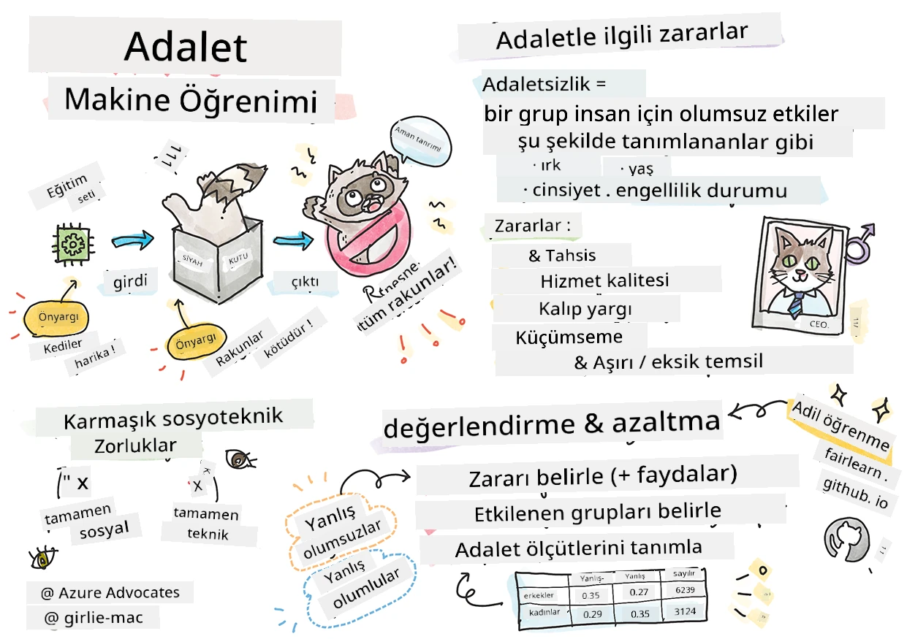
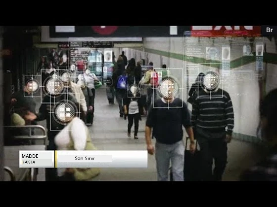

# Sorumlu Yapay Zeka ile Makine Öğrenimi çözümleri oluşturmak
 

> Sketchnote: [Tomomi Imura](https://www.twitter.com/girlie_mac)

## [Ders öncesi quiz](https://ff-quizzes.netlify.app/en/ml/)
 
## Giriş

Bu müfredatta, makine öğreniminin hayatımızı nasıl etkilediğini keşfetmeye başlayacaksınız. Hâlihazırda, sistemler ve modeller sağlık teşhisleri, kredi onayları veya dolandırıcılık tespiti gibi günlük karar verme görevlerinde yer almaktadır. Bu nedenle, bu modellerin güvenilir sonuçlar sağlamak için iyi çalışması önemlidir. Herhangi bir yazılım uygulaması gibi, yapay zeka sistemleri beklentileri karşılamayabilir veya istenmeyen sonuçlar doğurabilir. Bu yüzden, bir yapay zeka modelinin davranışını anlamak ve açıklamak çok önemlidir.

Bu modelleri oluşturmak için kullandığınız veriler belli demografik grupları, örneğin ırk, cinsiyet, politik görüş, din gibi özellikleri eksik barındırıyorsa ya da bu demografileri orantısız şekilde temsil ediyorsa ne olur? Modelin çıktısı bazı demografik grupları kayıracak şekilde yorumlanırsa ne olur? Uygulamanın sonucu ne olur? Ayrıca, model olumsuz bir sonuç üretip insanlara zarar verirse ne olur? Yapay zeka sistemlerinin davranışından kim sorumludur? Bu müfredatta bu gibi soruları keşfedeceğiz.

Bu derste:

- Makine öğreniminde adaletin ve adaletle ilgili zararların önemine farkındalık kazanacaksınız.
- Güvenilirlik ve güvenliği sağlamak için sıra dışı durumları ve aykırı değerleri keşfetme pratiğine alışacaksınız.
- Herkesi güçlendiren kapsayıcı sistemler tasarlamanın gerekliliğini anlayacaksınız.
- Verilerin ve insanların gizliliği ile güvenliğinin korunmasının ne denli hayati olduğunu keşfedeceksiniz.
- Yapay zeka modellerinin davranışını açıklayan bir cam kutu yaklaşımının önemini göreceksiniz.
- Yapay zeka sistemlerine olan güvenin temelinde sorumluluğun ne kadar hayati olduğunu fark edeceksiniz.

## Önkoşul

Önkoşul olarak, lütfen "Sorumlu Yapay Zeka İlkeleri" Öğrenme Yolunu tamamlayın ve aşağıdaki videoyu izleyin:

Bu [Öğrenme Yolunu](https://docs.microsoft.com/learn/modules/responsible-ai-principles/?WT.mc_id=academic-77952-leestott) takip ederek Sorumlu Yapay Zeka hakkında daha fazla bilgi edinin

> 🎥 Yukarıdaki resme tıklayarak videoyu izleyin: Microsoft'un Sorumlu Yapay Zekaya Yaklaşımı

## Adalet

Yapay zeka sistemleri herkese adil davranmalı ve benzer grupları farklı şekillerde etkilemekten kaçınmalıdır. Örneğin, yapay zeka sistemleri tıbbi tedavi, kredi başvuruları ya da istihdam konularında rehberlik sağlarken, benzer semptomları, finansal durumu veya mesleki nitelikleri olan herkese aynı önerileri yapmalıdır. İnsanlar olarak hepimizin kararlarımızı ve eylemlerimizi etkileyen doğuştan gelen önyargılarımız vardır. Bu önyargılar, yapay zeka sistemlerini eğitirken kullandığımız verilerde görülebilir. Bu tür manipülasyon bazen farkında olmadan gerçekleşebilir. Veriye bilinçli olarak ne zaman önyargı eklediğinizi anlamak çoğu zaman zordur.

**“Adaletsizlik”**, ırk, cinsiyet, yaş veya engellilik durumu gibi tanımlanan bir grup insan için ortaya çıkan olumsuz etkileri veya “zararları” kapsar. Temel adaletle ilgili zararlar şu şekilde sınıflandırılabilir:

- **Tahsis**: Örneğin, bir cinsiyet veya etnik grubun diğerine kıyasla tercih edilmesi.
- **Hizmet kalitesi**: Eğer veri yalnızca belirli bir senaryo için eğitilir ama gerçeklik çok daha karmaşıksa, bu kötü çalışan bir hizmete yol açar. Örneğin, koyu tenli insanları algılayamayan bir el sabunluğu. [Referans](https://gizmodo.com/why-cant-this-soap-dispenser-identify-dark-skin-1797931773)
- **Aşağılama**: Adaletsiz şekilde bir şeyi veya birini eleştirmek ve etiketlemek. Örneğin, bir görüntü etiketleme teknolojisi koyu tenli insanları maymun olarak yanlış etiketlemesiyle ünlüdür.
- **Aşırı veya az temsil**: Belirli bir grubun belli bir meslekte görülmemesi ve hizmetlerin veya fonksiyonların bunu sürdürmesi zarar vericidir.
- **Klişeleştirme**: Bir grubu önceden atanmış özelliklerle ilişkilendirmek. Örneğin, İngilizce-Türkçe çeviri sisteminde cinsiyetle ilgili klişeler nedeniyle yanlışlar oluşabilir.

> türkçeye çeviri

> ingilizceye geri çeviri

Yapay zeka sistemleri tasarlanırken ve test edilirken, yapay zekanın adil olması ve insanlara yasaklanan önyargılı veya ayrımcı kararlar vermeye programlanmadığından emin olunmalıdır. Yapay zekada ve makine öğreniminde adaletin garantilenmesi karmaşık bir sosyoteknik zorluktur.

### Güvenilirlik ve güvenlik

Güveni inşa etmek için yapay zeka sistemlerinin normal ve beklenmedik koşullar altında güvenilir, güvenli ve tutarlı olması gerekir. Yapay zeka sistemlerinin çeşitli durumlarda, özellikle sıra dışı durumlarda nasıl davranacağını bilmek önemlidir. Yapay zeka çözümleri oluştururken, bu çözümlerin karşılaşacağı geniş bir koşullar yelpazesine nasıl uyum sağlayacağına önemli ölçüde dikkat edilmelidir. Örneğin, otonom bir aracın insanların güvenliğini en öncelikle tutması gerekir. Bu nedenle, aracı besleyen yapay zekanın gece, fırtına, tipi, sokaktan koşan çocuklar, evcil hayvanlar, yol çalışmaları gibi tüm olası senaryoları dikkate alması gerekir. Bir yapay zeka sisteminin çok geniş koşulları ne kadar güvenilir ve güvenli şekilde yönetebildiği, veri bilimcisinin veya yapay zeka geliştiricisinin sistemi tasarlarken veya test ederken ne kadar öngördüğünü yansıtır.

> [🎥 Bir video için buraya tıklayın: ](https://www.microsoft.com/videoplayer/embed/RE4vvIl)

### Kapsayıcılık

Yapay zeka sistemleri herkesi kapsayacak ve güçlendirecek şekilde tasarlanmalıdır. Tasarım ve uygulama süreçlerinde veri bilimciler ve yapay zeka geliştiriciler, sistemi istemeden dışlayıcı kılabilecek potansiyel engelleri tanır ve çözerler. Örneğin dünyada 1 milyar engelli insan var. Yapay zeka ilerledikçe, bu kişiler günlük yaşamlarında bilgiye ve fırsatlara daha kolay erişebilirler. Engelleri çözerek, daha iyi deneyimlere sahip yapay zeka ürünleri geliştirme ve yenilik yapma fırsatları yaratılır ve bu herkesin yararına olur.

> [🎥 Yapay zekada kapsayıcılık videosu için buraya tıklayın](https://www.microsoft.com/videoplayer/embed/RE4vl9v)

### Güvenlik ve gizlilik

Yapay zeka sistemleri güvenli olmalı ve insanların gizliliğine saygı göstermelidir. Gizliliklerini, bilgilerini veya hayatlarını riske atan sistemlere insanların güveni daha azdır. Makine öğrenimi modellerini eğitirken en iyi sonuçları almaya çalışırız. Bu süreçte verinin kaynağı ve bütünlüğü göz önünde bulundurulmalıdır. Örneğin, veri kullanıcılardan mı yoksa kamuya açık mı? Devamında, veriler üzerinde çalışırken gizli bilgileri koruyabilen ve saldırılara dayanabilen yapay zeka sistemleri geliştirmek kritik önem taşır. Yapay zeka yaygınlaştıkça gizliliğin korunması ve önemli kişisel ve ticari bilgilerin güvenliği daha kritik ve karmaşık hale gelir. Yapay zeka için gizlilik ve veri güvenliği sorunlarına özellikle dikkat edilmelidir çünkü yapay zeka sistemlerinin doğru ve bilinçli tahminler ve kararlar verebilmesi için verilere erişim gereklidir.

> [🎥 Yapay zekada güvenlik videosu için buraya tıklayın](https://www.microsoft.com/videoplayer/embed/RE4voJF)

- Endüstri olarak, GDPR (Genel Veri Koruma Yönetmeliği) gibi düzenlemelerle önemli gizlilik ve güvenlik ilerlemeleri kaydettik.
- Ancak yapay zeka sistemlerinde, sistemleri daha kişisel ve etkili yapmak için daha fazla kişisel veriye ihtiyaç ile gizlilik arasında bir gerilim olduğunu kabul etmeliyiz.
- İnternetle bağlı bilgisayarların doğuşu gibi, yapay zekayla ilişkili güvenlik sorunlarında da büyük bir artış görüyoruz.
- Aynı zamanda yapay zekanın güvenliği iyileştirmek için kullanıldığını görüyoruz. Örneğin, çoğu modern antivirüs tarayıcısı artık yapay zeka sezgileriyle çalışıyor.
- Veri Bilimi süreçlerimizin en son gizlilik ve güvenlik uygulamalarıyla uyumlu olması gerekiyor.

### Şeffaflık
Yapay zeka sistemleri anlaşılabilir olmalıdır. Şeffaflığın kritik bir parçası, yapay zeka sistemlerinin ve bileşenlerinin davranışını açıklamaktır. Yapay zeka sistemlerinin anlaşılmasını geliştirmek, paydaşların sistemlerin nasıl ve neden işlediğini anlamasını gerektirir; bu sayede performans sorunlarını, güvenlik ve gizlilik endişelerini, önyargıları, dışlayıcı uygulamaları veya istenmeyen sonuçları tespit edebilirler. Ayrıca yapay zeka sistemlerini kullananların, bunları ne zaman, neden ve nasıl devreye aldıklarını ve hangi sınırlamalara sahip olduklarını dürüstçe açıklamaları gerektiğine inanıyoruz. Örneğin, bir banka yapay zeka sistemi kullanarak kredi kararlarını destekliyorsa, sonuçları inceleyip hangi verilerin sistemin önerilerini etkilediğini anlamak önemlidir. Hükümetler yapay zekayı düzenlemeye başladığı için, veri bilimciler ve kurumlar, bir yapay zeka sisteminin düzenleyici gereklilikleri karşılayıp karşılamadığını, özellikle istenmeyen sonuçlarda açıklamak zorundadır.

> [🎥 Yapay zekada şeffaflık videosu için buraya tıklayın](https://www.microsoft.com/videoplayer/embed/RE4voJF)

- Yapay zeka sistemleri çok karmaşık olduğundan, nasıl çalıştıklarını anlamak ve sonuçları yorumlamak zordur.
- Bu anlayış eksikliği, bu sistemlerin yönetilişi, uygulanışı ve belgelenişini etkiler.
- Daha da önemlisi, bu anlayış eksikliği, bu sistemlerin ürettiği sonuçlarla yapılan kararları etkiler.

### Sorumluluk  
 
Yapay zeka sistemlerini tasarlayan ve kullanan insanlar, sistemlerinin nasıl çalıştığından sorumlu olmalıdır. Yüz tanıma gibi hassas teknolojilerde sorumluluk özellikle önemlidir. Son zamanlarda, çalıntı çocukları bulmak gibi kullanımlarda potansiyel görülen bu teknolojiye, özellikle güvenlik güçlerinden yoğun talep artışı olmuştur. Ancak bu teknolojiler, örneğin belirli bireylerin sürekli gözetilmesini mümkün kılarak, bir hükümetin vatandaşlarının temel özgürlüklerini riske atacak şekilde kullanılabilir. Bu nedenle, veri bilimciler ve kurumlar, yapay zeka sistemlerinin bireyler veya toplum üzerindeki etkileri için sorumlu olmalıdır.

> 🎥 Yukarıdaki resme tıklayarak videoyu izleyin: Yüz Tanıma ile Kitlesel Gözetim Uyarısı

Sonuç olarak, AI'yı topluma getiren ilk nesil olarak bizim neslimize yönelen en büyük sorulardan biri, bilgisayarların insanlara karşı sorumlu kalmasını ve bilgisayarları tasarlayanların herkes karşısında sorumlu olmasını nasıl sağlayacağımızdır.

## Etki değerlendirmesi

Bir makine öğrenimi modeli eğitmeden önce, yapay zeka sisteminin amacını; kullanım şeklinin ne olduğunu; nerede uygulanacağını; ve sistemle kimlerin etkileşimde bulunacağını anlamak için etki değerlendirmesi yapmak önemlidir. Bu, sistemi inceleyen veya test eden kişilerin potansiyel riskleri ve beklenen sonuçları belirlerken hangi faktörleri göz önünde bulundurması gerektiğini bilmelerine yardımcı olur.

Etki değerlendirmesi yapılırken odaklanılan alanlar şunlardır:

* **Bireyler üzerindeki olumsuz etkiler**. Sistemin performansını engelleyen kısıtlamalar, desteklenmeyen kullanımlar veya bilinen sınırlamalar konusunda farkındalık, bireylere zarar verilmemesi için kritik öneme sahiptir.
* **Veri gereksinimleri**. Sistemin veriyi nasıl ve nerede kullanacağını anlamak, inceleyenlerin uyulması gereken veri gereksinimlerini (örneğin GDPR veya HIPAA gibi) araştırmasına olanak verir. Ayrıca, veri kaynağı ve miktarının eğitime yeterli olup olmadığını kontrol etmek gerekir.
* **Etki özeti**. Sistem kullanımından ortaya çıkabilecek olası zararların listesini toplamak. Makine öğrenimi yaşam döngüsü boyunca, belirlenen sorunların önlenip önlenmediğini incelemek.
* **Altı temel ilkenin her biri için uygulanabilir hedefler**. Her ilkenin hedeflerinin karşılanıp karşılanmadığını değerlendirmek ve varsa eksiklikleri belirlemek.

## Sorumlu yapay zeka ile hata ayıklama

Bir yazılım uygulamasına hata ayıklama yapılması gibi, bir yapay zeka sistemine hata ayıklama yapmak da sistemi etkileyen hataları belirleme ve çözme sürecidir. Bir modelin beklenen veya sorumlu şekilde çalışmamasını etkileyen birçok faktör vardır. Geleneksel performans metrikleri genellikle modelin performansının niceliksel toplamlarıdır ve modelin sorumlu yapay zeka ilkelerini nasıl ihlal ettiğini analiz etmek için yeterli değildir. Ayrıca, makine öğrenimi modeli çıktısını neyin etkilediğini anlamayı zorlaştıran kara kutu gibidir ve hata yaptığında açıklama yapmak zordur. Bu derste, yapay zeka sistemlerini hata ayıklamada yardımcı olan Sorumlu Yapay Zeka kontrol panelini nasıl kullanacağımızı öğreneceğiz. Kontrol paneli, veri bilimciler ve yapay zeka geliştiricileri için şu kapsamlı araçları sunar:

* **Hata analizi**. Sistemin adaletini veya güvenilirliğini etkileyebilecek hata dağılımının tespiti.
* **Model genel görünümü**. Modelin performansındaki farklılıkların veri kümeleri arasında nerede olduğunu keşfetmek.
* **Veri analizi**. Veri dağılımını anlayarak, adalet, kapsayıcılık ve güvenilirlik sorunlarına yol açabilecek önyargıları tespit etmek.
* **Model yorumlanabilirliği**. Modelin tahminlerini etkileyen faktörleri anlamak. Bu, şeffaflık ve sorumluluk için modelin davranışını açıklamada yardımcı olur.

## 🚀 Meydan okuma
 
Zararların baştan engellenmesi için:

- Sistemler üzerinde çalışan kişiler arasında çeşitli geçmişler ve bakış açıları olsun
- Toplumumuzun çeşitliliğini yansıtan veri setlerine yatırım yapılsın
- Makine öğrenimi yaşam döngüsü boyunca sorumlu yapay zekayı tespit edip düzeltmek için daha iyi yöntemler geliştirilsin

Model oluşturma ve kullanımı aşamalarında güvenilmezlik belirgin olduğu gerçek yaşam senaryolarını düşünün. Başka neleri dikkate almalıyız?

## [Ders sonrası quiz](https://ff-quizzes.netlify.app/en/ml/)

## Gözden geçirme ve kendi kendine çalışma
 

Bu derste, makine öğreniminde adalet ve adaletsizlik kavramlarının bazı temel bilgilerini öğrendiniz.  
 
Konulara daha derinlemesine dalmak için bu atölyeyi izleyin: 

- Sorumlu Yapay Zekanın Peşinde: İlkeleri Pratiğe Dökmek, Besmira Nushi, Mehrnoosh Sameki ve Amit Sharma tarafından

> 🎥 Video için yukarıdaki resme tıklayın: RAI Toolbox: Besmira Nushi, Mehrnoosh Sameki ve Amit Sharma tarafından hazırlanan sorumlu yapay zeka oluşturmak için açık kaynaklı bir çerçeve

Ayrıca, okuyun: 

- Microsoft’un RAI kaynak merkezi: [Sorumlu Yapay Zeka Kaynakları – Microsoft AI](https://www.microsoft.com/ai/responsible-ai-resources?activetab=pivot1%3aprimaryr4) 

- Microsoft’un FATE araştırma grubu: [FATE: Yapay Zekada Adalet, Hesap Verebilirlik, Şeffaflık ve Etik - Microsoft Araştırma](https://www.microsoft.com/research/theme/fate/) 

RAI Araç Kutusu: 

- [Sorumlu Yapay Zeka Araç Kutusu GitHub deposu](https://github.com/microsoft/responsible-ai-toolbox)

Azure Machine Learning'in adaleti sağlamak için araçları hakkında bilgi edinin:

- [Azure Machine Learning](https://docs.microsoft.com/azure/machine-learning/concept-fairness-ml?WT.mc_id=academic-77952-leestott) 

## Ödev

[RAI Araç Kutusunu Keşfet](assignment.md)

---

<!-- CO-OP TRANSLATOR DISCLAIMER START -->
**Feragatname**:
Bu belge, AI çeviri hizmeti [Co-op Translator](https://github.com/Azure/co-op-translator) kullanılarak çevrilmiştir. Doğruluk için çaba sarf etsek de, otomatik çevirilerin hata veya yanlışlık içerebileceğini lütfen unutmayınız. Orijinal belge, kendi dilinde yetkili kaynak olarak kabul edilmelidir. Kritik bilgiler için profesyonel insan çevirisi önerilir. Bu çevirinin kullanımı sonucu ortaya çıkabilecek yanlış anlamalardan veya yanlış yorumlamalardan sorumlu değiliz.
<!-- CO-OP TRANSLATOR DISCLAIMER END -->