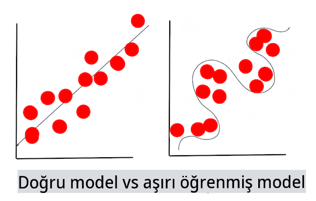

# Makine Öğrenimi Teknikleri

Makine öğrenimi modellerini oluşturma, kullanma ve sürdürme süreci ve kullandıkları veriler, birçok diğer geliştirme iş akışından çok farklı bir süreçtir. Bu derste, bu süreci açıklığa kavuşturacak ve bilmeniz gereken ana teknikleri özetleyeceğiz. Şunları yapacaksınız:

- Makine öğrenimini yüksek seviyede destekleyen süreçleri anlayın.
- 'Modeller', 'tahminler' ve 'eğitim verileri' gibi temel kavramları keşfedin.

## [Ders öncesi sınav](https://gray-sand-07a10f403.1.azurestaticapps.net/quiz/7/)

> 🎥 Bu derste ilerlemek için yukarıdaki görüntüye tıklayarak kısa bir video izleyin.

## Giriş

Yüksek seviyede, makine öğrenimi (ML) süreçlerini oluşturma sanatı birkaç adımdan oluşur:

1. **Soruyu belirleyin**. Çoğu ML süreci, basit bir koşullu program veya kurallara dayalı bir motorla cevaplanamayan bir soru sormakla başlar. Bu sorular genellikle bir veri koleksiyonuna dayalı tahminler etrafında döner.
2. **Veri toplayın ve hazırlayın**. Sorunuzu cevaplayabilmek için veriye ihtiyacınız var. Verinizin kalitesi ve bazen de miktarı, başlangıç sorunuza ne kadar iyi cevap verebileceğinizi belirleyecektir. Veriyi görselleştirmek bu aşamanın önemli bir parçasıdır. Bu aşama ayrıca veriyi bir model oluşturmak için eğitim ve test gruplarına ayırmayı da içerir.
3. **Eğitim yöntemini seçin**. Sorunuza ve verinizin doğasına bağlı olarak, verinizi en iyi yansıtacak ve doğru tahminler yapacak bir model eğitme yöntemini seçmeniz gerekecektir. Bu, ML sürecinizin belirli uzmanlık gerektiren ve genellikle önemli miktarda deneme gerektiren kısmıdır.
4. **Modeli eğitin**. Eğitim verilerinizi kullanarak, çeşitli algoritmalar kullanarak bir model eğitirsiniz ve verideki desenleri tanımayı öğrenirsiniz. Model, verinin bazı bölümlerini diğerlerine göre önceliklendirmek için ayarlanabilen içsel ağırlıkları kullanabilir ve böylece daha iyi bir model oluşturabilir.
5. **Modeli değerlendirin**. Topladığınız veri setinden daha önce hiç görülmemiş verileri (test verilerinizi) kullanarak modelin nasıl performans gösterdiğini görürsünüz.
6. **Parametre ayarı**. Modelinizin performansına bağlı olarak, modeli eğitmek için kullanılan algoritmaların davranışını kontrol eden farklı parametreler veya değişkenler kullanarak süreci yeniden yapabilirsiniz.
7. **Tahmin yapın**. Modelinizin doğruluğunu test etmek için yeni girdiler kullanın.

## Hangi soruyu sormalı

Bilgisayarlar, verilerde gizli kalmış desenleri keşfetmede özellikle yeteneklidir. Bu yetenek, belirli bir alanda kurallara dayalı bir motor oluşturarak kolayca cevaplanamayan soruları olan araştırmacılar için çok faydalıdır. Örneğin, bir aktüeryal görev verildiğinde, bir veri bilimcisi sigara içenler ile içmeyenler arasındaki ölüm oranları etrafında el yapımı kurallar oluşturabilir.

Ancak, birçok diğer değişken denklem içine girdiğinde, geçmiş sağlık geçmişine dayalı olarak gelecekteki ölüm oranlarını tahmin etmek için bir ML modeli daha verimli olabilir. Daha neşeli bir örnek, bir yerin Nisan ayındaki hava durumunu enlem, boylam, iklim değişikliği, okyanusa yakınlık, jet akımının desenleri ve daha fazlasını içeren verilere dayanarak tahmin etmektir.

✅ Bu [slayt sunumu](https://www2.cisl.ucar.edu/sites/default/files/2021-10/0900%20June%2024%20Haupt_0.pdf) hava durumu modelleri üzerinde ML kullanımı için tarihsel bir perspektif sunar.  

## Model oluşturma öncesi görevler

Modelinizi oluşturmaya başlamadan önce tamamlamanız gereken birkaç görev vardır. Sorunuzu test etmek ve bir modelin tahminlerine dayalı bir hipotez oluşturmak için birkaç öğeyi tanımlamanız ve yapılandırmanız gerekir.

### Veri

Sorunuzu herhangi bir kesinlikle cevaplayabilmek için doğru türde yeterli miktarda veriye ihtiyacınız var. Bu noktada yapmanız gereken iki şey vardır:

- **Veri toplayın**. Veri analizi dersindeki adaleti göz önünde bulundurarak verilerinizi dikkatle toplayın. Bu verilerin kaynaklarının farkında olun, sahip olabileceği herhangi bir önyargıyı bilin ve kökenini belgeleyin.
- **Veriyi hazırlayın**. Veri hazırlama sürecinde birkaç adım vardır. Veriler farklı kaynaklardan geliyorsa, verileri bir araya getirip normalleştirmeniz gerekebilir. Verinin kalitesini ve miktarını çeşitli yöntemlerle artırabilirsiniz, örneğin dizeleri sayılara dönüştürmek ( [Kümeleme](../../5-Clustering/1-Visualize/README.md) dersinde yaptığımız gibi). Ayrıca, orijinal veriye dayanarak yeni veriler oluşturabilirsiniz ( [Sınıflandırma](../../4-Classification/1-Introduction/README.md) dersinde yaptığımız gibi). Veriyi temizleyip düzenleyebilirsiniz ( [Web Uygulaması](../../3-Web-App/README.md) dersinden önce yapacağımız gibi). Son olarak, eğitim tekniklerinize bağlı olarak veriyi rastgeleleştirip karıştırmanız gerekebilir.

✅ Verilerinizi topladıktan ve işledikten sonra, verinin şeklinin amacınıza uygun olup olmadığını görmek için bir an durun. Verilerin, belirli bir görevinizde iyi performans göstermeyebileceği ortaya çıkabilir, [Kümeleme](../../5-Clustering/1-Visualize/README.md) derslerimizde keşfettiğimiz gibi!

### Özellikler ve Hedef

Bir [özellik](https://www.datasciencecentral.com/profiles/blogs/an-introduction-to-variable-and-feature-selection), verinizin ölçülebilir bir özelliğidir. Birçok veri setinde 'tarih', 'boyut' veya 'renk' gibi sütun başlıkları olarak ifade edilir. Özellik değişkeniniz, genellikle `X` olarak temsil edilir ve modeli eğitmek için kullanılacak giriş değişkenidir.

Bir hedef, tahmin etmeye çalıştığınız şeydir. Hedef genellikle `y` olarak temsil edilir ve verinizden sormaya çalıştığınız sorunun cevabını temsil eder: Aralık ayında hangi **renk** kabaklar en ucuz olacak? San Francisco'da hangi mahallelerde en iyi gayrimenkul **fiyatı** olacak? Bazen hedef, etiket özniteliği olarak da adlandırılır.

### Özellik değişkeninizi seçme

🎓 **Özellik Seçimi ve Özellik Çıkarımı** Model oluştururken hangi değişkeni seçeceğinizi nasıl bileceksiniz? Muhtemelen en performanslı model için doğru değişkenleri seçmek için bir özellik seçimi veya özellik çıkarımı sürecinden geçeceksiniz. Ancak bunlar aynı şey değildir: "Özellik çıkarımı, orijinal özelliklerin fonksiyonlarından yeni özellikler oluştururken, özellik seçimi özelliklerin bir alt kümesini döndürür." ([kaynak](https://wikipedia.org/wiki/Feature_selection))

### Verinizi görselleştirin

Veri bilimcisinin araç setinin önemli bir yönü, Seaborn veya MatPlotLib gibi çeşitli mükemmel kütüphaneleri kullanarak veriyi görselleştirme gücüdür. Verinizi görsel olarak temsil etmek, yararlanabileceğiniz gizli korelasyonları ortaya çıkarmanıza olanak tanıyabilir. Görselleştirmeleriniz ayrıca önyargı veya dengesiz veri keşfetmenize yardımcı olabilir ([Sınıflandırma](../../4-Classification/2-Classifiers-1/README.md) dersinde keşfettiğimiz gibi).

### Veri setinizi bölün

Eğitimden önce, veri setinizi eşit olmayan boyutlarda iki veya daha fazla parçaya bölmeniz gerekir.

- **Eğitim**. Veri setinin bu kısmı modeli eğitmek için kullanılır. Bu set, orijinal veri setinin çoğunluğunu oluşturur.
- **Test**. Bir test veri seti, genellikle orijinal verilerden toplanan bağımsız bir veri grubudur ve oluşturulan modelin performansını doğrulamak için kullanılır.
- **Doğrulama**. Bir doğrulama seti, modelin hiperparametrelerini veya mimarisini ayarlamak için kullanılan daha küçük bağımsız bir örnek grubudur. Verinizin boyutuna ve sorduğunuz soruya bağlı olarak, bu üçüncü seti oluşturmanız gerekmeyebilir ([Zaman Serisi Tahmini](../../7-TimeSeries/1-Introduction/README.md) dersinde belirttiğimiz gibi).

## Model oluşturma

Eğitim verilerinizi kullanarak, çeşitli algoritmalar kullanarak verinizin istatistiksel bir temsilini oluşturarak bir model oluşturmayı hedeflersiniz. Bir modeli eğitmek, onu veriye maruz bırakır ve keşfettiği, doğruladığı ve kabul ettiği veya reddettiği desenler hakkında varsayımlar yapmasına olanak tanır.

### Eğitim yöntemini seçin

Sorunuza ve verinizin doğasına bağlı olarak, onu eğitmek için bir yöntem seçeceksiniz. [Scikit-learn'ün belgelerini](https://scikit-learn.org/stable/user_guide.html) inceleyerek - bu derste kullandığımız - bir modeli eğitmenin birçok yolunu keşfedebilirsiniz. Deneyiminize bağlı olarak, en iyi modeli oluşturmak için birkaç farklı yöntemi denemeniz gerekebilir. Veri bilimcilerinin, modele görülmemiş veriler vererek performansını değerlendirdiği, doğruluk, önyargı ve diğer kaliteyi düşüren sorunları kontrol ettiği ve eldeki görev için en uygun eğitim yöntemini seçtiği bir süreçten geçmeniz muhtemeldir.

### Bir modeli eğitin

Eğitim verilerinizle donanmış olarak, onu bir model oluşturmak için 'fit' etmeye hazırsınız. Birçok ML kütüphanesinde 'model.fit' kodunu bulacağınızı fark edeceksiniz - bu sırada özellik değişkeninizi bir değerler dizisi (genellikle 'X') ve bir hedef değişkeni (genellikle 'y') olarak gönderirsiniz.

### Modeli değerlendirin

Eğitim süreci tamamlandığında (büyük bir modeli eğitmek için birçok yineleme veya 'epoch' gerekebilir), test verilerini kullanarak modelin kalitesini değerlendirebileceksiniz. Bu veri, modelin daha önce analiz etmediği orijinal verilerin bir alt kümesidir. Modelinizin kalitesi hakkında bir metrik tablosu yazdırabilirsiniz.

🎓 **Model uyumu**

Makine öğrenimi bağlamında, model uyumu, modelin altta yatan fonksiyonunun, tanımadığı verileri analiz etme girişimindeki doğruluğunu ifade eder.

🎓 **Aşırı uyum** ve **eksik uyum**, modelin kalitesini düşüren yaygın sorunlardır, çünkü model ya yeterince iyi uymaz ya da çok iyi uyum sağlar. Bu, modelin tahminlerini ya eğitim verilerine çok yakın ya da çok gevşek bir şekilde hizalamasına neden olur. Aşırı uyumlu bir model, verilerin ayrıntılarını ve gürültüsünü çok iyi öğrendiği için eğitim verilerini çok iyi tahmin eder. Eksik uyumlu bir model ise, ne eğitim verilerini ne de henüz 'görmediği' verileri doğru bir şekilde analiz edebilir.

> [Jen Looper](https://twitter.com/jenlooper) tarafından hazırlanan infografik

## Parametre ayarı

İlk eğitiminiz tamamlandığında, modelin kalitesini gözlemleyin ve 'hiperparametrelerini' ayarlayarak iyileştirmeyi düşünün. Süreç hakkında daha fazla bilgi için [belgelere](https://docs.microsoft.com/en-us/azure/machine-learning/how-to-tune-hyperparameters?WT.mc_id=academic-77952-leestott) göz atın.

## Tahmin

Bu, modelinizin doğruluğunu test etmek için tamamen yeni veriler kullanabileceğiniz andır. Bir üretim ortamında modeli kullanmak için web varlıkları oluşturduğunuz 'uygulamalı' bir ML ortamında, bu süreç, bir değişkeni ayarlamak ve değerlendirme veya çıkarım için modeli göndermek için kullanıcı girdisi (örneğin bir düğme basması) toplama işlemini içerebilir.

Bu derslerde, bir veri bilimcisinin tüm hareketlerini ve daha fazlasını yaparak, 'tam yığın' bir ML mühendisi olma yolculuğunuzda ilerledikçe bu adımları nasıl hazırlayacağınızı, oluşturacağınızı, test edeceğinizi, değerlendireceğinizi ve tahmin edeceğinizi keşfedeceksiniz.

---

## 🚀Meydan Okuma

Bir ML uygulayıcısının adımlarını yansıtan bir akış şeması çizin. Şu anda sürecin neresinde olduğunuzu düşünüyorsunuz? Nerede zorluk çekeceğinizi tahmin ediyorsunuz? Size ne kolay görünüyor?

## [Ders sonrası sınav](https://gray-sand-07a10f403.1.azurestaticapps.net/quiz/8/)

## Gözden Geçirme ve Kendi Kendine Çalışma

Günlük çalışmalarını tartışan veri bilimcilerle yapılan röportajları çevrimiçi arayın. İşte [bir tane](https://www.youtube.com/watch?v=Z3IjgbbCEfs).

## Ödev

[Bir veri bilimcisiyle röportaj yapın](assignment.md)

**Feragatname**:
Bu belge, makine tabanlı AI çeviri hizmetleri kullanılarak çevrilmiştir. Doğruluk için çaba sarf etsek de, otomatik çevirilerin hata veya yanlışlıklar içerebileceğini lütfen unutmayın. Orijinal belgenin kendi dilindeki hali, yetkili kaynak olarak kabul edilmelidir. Kritik bilgiler için profesyonel insan çevirisi önerilir. Bu çevirinin kullanımından kaynaklanan herhangi bir yanlış anlama veya yanlış yorumlamadan sorumlu değiliz.