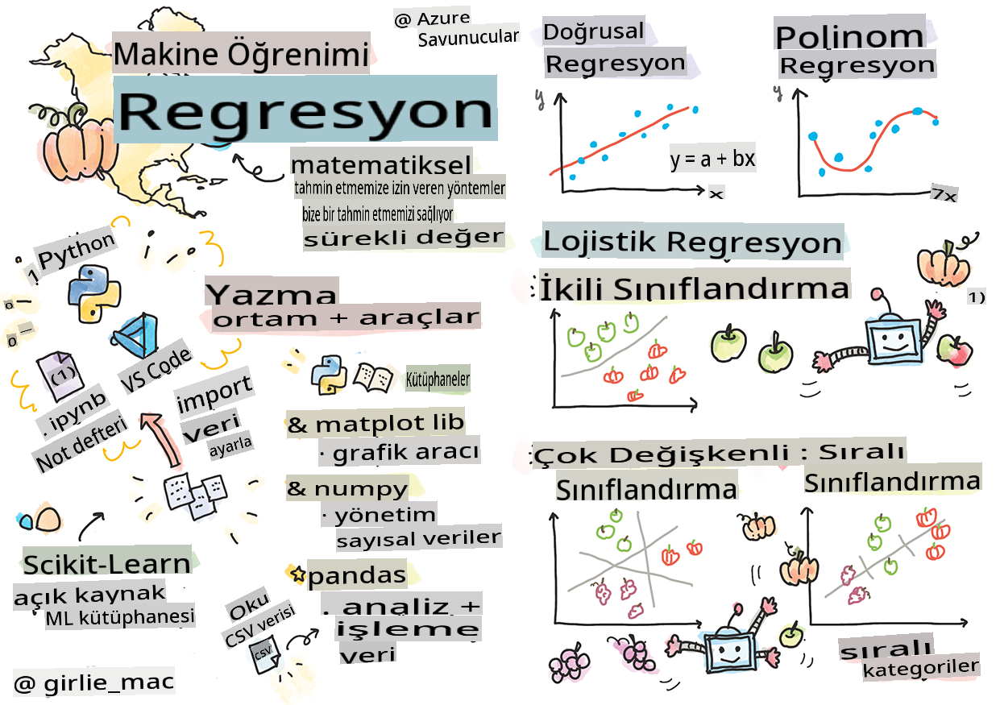
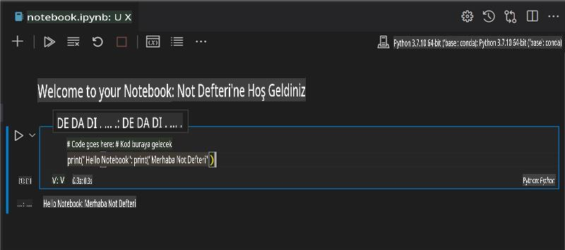
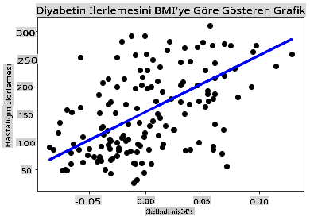

# Python ve Scikit-learn ile Regresyon Modellerine Başlayın



> Sketchnote [Tomomi Imura](https://www.twitter.com/girlie_mac) tarafından

## [Ders Öncesi Quiz](https://gray-sand-07a10f403.1.azurestaticapps.net/quiz/9/)

> ### [Bu ders R dilinde de mevcut!](../../../../2-Regression/1-Tools/solution/R/lesson_1.html)

## Giriş

Bu dört derste, regresyon modellerinin nasıl oluşturulacağını keşfedeceksiniz. Bunların ne işe yaradığını kısa süre içinde tartışacağız. Ancak herhangi bir şey yapmadan önce, süreci başlatmak için doğru araçlara sahip olduğunuzdan emin olun!

Bu derste şunları öğreneceksiniz:

- Bilgisayarınızı yerel makine öğrenimi görevleri için yapılandırma.
- Jupyter defterleri ile çalışma.
- Scikit-learn kullanımı, kurulum dahil.
- Uygulamalı bir egzersiz ile doğrusal regresyonu keşfetme.

## Kurulumlar ve yapılandırmalar

[](https://youtu.be/-DfeD2k2Kj0 "Yeni başlayanlar için ML - Makine Öğrenimi modelleri oluşturmak için araçlarınızı ayarlayın")

> 🎥 Bilgisayarınızı ML için yapılandırma konusunda kısa bir video için yukarıdaki resme tıklayın.

1. **Python'u yükleyin**. Bilgisayarınızda [Python](https://www.python.org/downloads/) yüklü olduğundan emin olun. Python'u birçok veri bilimi ve makine öğrenimi görevi için kullanacaksınız. Çoğu bilgisayar sistemi zaten bir Python kurulumu içerir. Ayrıca bazı kullanıcılar için kurulumu kolaylaştırmak adına kullanışlı [Python Kod Paketleri](https://code.visualstudio.com/learn/educators/installers?WT.mc_id=academic-77952-leestott) de mevcuttur.

   Ancak, Python'un bazı kullanımları yazılımın bir sürümünü gerektirirken, diğerleri farklı bir sürüm gerektirir. Bu nedenle, bir [sanal ortam](https://docs.python.org/3/library/venv.html) içinde çalışmak faydalıdır.

2. **Visual Studio Code'u yükleyin**. Bilgisayarınızda Visual Studio Code'un yüklü olduğundan emin olun. Temel kurulum için [Visual Studio Code'u yükleme](https://code.visualstudio.com/) talimatlarını izleyin. Bu kursta Python'u Visual Studio Code'da kullanacağınız için, Python geliştirme için [Visual Studio Code'u yapılandırma](https://docs.microsoft.com/learn/modules/python-install-vscode?WT.mc_id=academic-77952-leestott) konusunda bilgi edinmek isteyebilirsiniz.

   > Python ile rahat çalışmak için bu [Öğrenme modülleri](https://docs.microsoft.com/users/jenlooper-2911/collections/mp1pagggd5qrq7?WT.mc_id=academic-77952-leestott) koleksiyonunu inceleyin
   >
   > [](https://youtu.be/yyQM70vi7V8 "Visual Studio Code ile Python Kurulumu")
   >
   > 🎥 Yukarıdaki resme tıklayarak VS Code içinde Python kullanımı hakkında bir video izleyin.

3. **Scikit-learn'ü yükleyin**, [bu talimatları](https://scikit-learn.org/stable/install.html) izleyerek. Python 3 kullanmanız gerektiğinden, bir sanal ortam kullanmanız önerilir. Not: Bu kütüphaneyi bir M1 Mac'e yüklüyorsanız, yukarıdaki sayfada özel talimatlar bulunmaktadır.

4. **Jupyter Notebook'u yükleyin**. [Jupyter paketini yüklemeniz](https://pypi.org/project/jupyter/) gerekecek.

## Makine Öğrenimi Yazma Ortamınız

Python kodunuzu geliştirmek ve makine öğrenimi modelleri oluşturmak için **defterler** kullanacaksınız. Bu dosya türü veri bilimciler için yaygın bir araçtır ve uzantıları `.ipynb` ile tanımlanabilir.

Defterler, geliştiricinin hem kod yazmasına hem de kodun etrafında notlar ve dokümantasyon yazmasına olanak tanıyan etkileşimli bir ortamdır, bu da deneysel veya araştırma odaklı projeler için oldukça faydalıdır.

[](https://youtu.be/7E-jC8FLA2E "Yeni başlayanlar için ML - Regresyon modelleri oluşturmaya başlamak için Jupyter Defterlerini ayarlayın")

> 🎥 Bu egzersizi çalışırken kısa bir video için yukarıdaki resme tıklayın.

### Egzersiz - bir defterle çalışma

Bu klasörde, _notebook.ipynb_ dosyasını bulacaksınız.

1. _notebook.ipynb_ dosyasını Visual Studio Code'da açın.

   Python 3+ ile bir Jupyter sunucusu başlatılacak. Defterin bazı alanlarında `run`, kod parçaları bulacaksınız. Bir kod bloğunu çalıştırmak için, oynat düğmesi gibi görünen simgeyi seçebilirsiniz.

2. `md` simgesini seçin ve biraz markdown ve şu metni ekleyin **# Defterinize hoş geldiniz**.

   Sonra biraz Python kodu ekleyin.

3. Kod bloğuna **print('hello notebook')** yazın.
4. Kodu çalıştırmak için oku seçin.

   Yazdırılan ifadeyi görmelisiniz:

    ```output
    hello notebook
    ```



Kodunuzu yorumlarla birlikte ekleyerek defteri kendiliğinden belgelendirebilirsiniz.

✅ Bir web geliştiricisinin çalışma ortamının veri bilimcinin çalışma ortamından ne kadar farklı olduğunu bir düşünün.

## Scikit-learn ile Başlamak

Artık Python yerel ortamınızda ayarlandı ve Jupyter defterleriyle rahatça çalışıyorsunuz, hadi Scikit-learn ile de aynı rahatlığı sağlayalım (bunu `sci` as in `science` olarak telaffuz edin). Scikit-learn, ML görevlerini gerçekleştirmenize yardımcı olacak [geniş bir API](https://scikit-learn.org/stable/modules/classes.html#api-ref) sunar.

Web sitelerine göre ([website](https://scikit-learn.org/stable/getting_started.html)), "Scikit-learn, denetimli ve denetimsiz öğrenmeyi destekleyen açık kaynaklı bir makine öğrenimi kütüphanesidir. Ayrıca model uyarlama, veri ön işleme, model seçimi ve değerlendirme ve birçok diğer yardımcı araçlar sağlar."

Bu derste, Scikit-learn ve diğer araçları kullanarak 'geleneksel makine öğrenimi' görevlerini gerçekleştirmek için makine öğrenimi modelleri oluşturacaksınız. Sinir ağları ve derin öğrenmeden özellikle kaçındık, çünkü bunlar yakında çıkacak olan 'Yeni Başlayanlar için AI' müfredatımızda daha iyi ele alınmaktadır.

Scikit-learn, modelleri oluşturmayı ve kullanmak üzere değerlendirmeyi kolaylaştırır. Öncelikle sayısal verilerle çalışmaya odaklanır ve öğrenme araçları olarak kullanılabilecek birkaç hazır veri seti içerir. Ayrıca öğrencilerin denemesi için önceden oluşturulmuş modeller de içerir. Hazır paketlenmiş verileri yükleme sürecini ve bazı temel verilerle ilk ML modelimizi Scikit-learn ile kullanma sürecini keşfedelim.

## Egzersiz - ilk Scikit-learn defteriniz

> Bu eğitim, Scikit-learn'ün web sitesindeki [doğrusal regresyon örneğinden](https://scikit-learn.org/stable/auto_examples/linear_model/plot_ols.html#sphx-glr-auto-examples-linear-model-plot-ols-py) esinlenmiştir.

[](https://youtu.be/2xkXL5EUpS0 "Yeni başlayanlar için ML - Python'da İlk Doğrusal Regresyon Projeniz")

> 🎥 Bu egzersizi çalışırken kısa bir video için yukarıdaki resme tıklayın.

Bu derse bağlı _notebook.ipynb_ dosyasında, tüm hücreleri 'çöp kutusu' simgesine basarak temizleyin.

Bu bölümde, öğrenme amacıyla Scikit-learn'e dahil edilen diyabet hakkında küçük bir veri seti ile çalışacaksınız. Diyabet hastaları için bir tedaviyi test etmek istediğinizi hayal edin. Makine Öğrenimi modelleri, değişkenlerin kombinasyonlarına dayalı olarak hangi hastaların tedaviye daha iyi yanıt vereceğini belirlemenize yardımcı olabilir. Çok basit bir regresyon modeli bile, görselleştirildiğinde, teorik klinik denemelerinizi düzenlemenize yardımcı olacak değişkenler hakkında bilgi gösterebilir.

✅ Birçok türde regresyon yöntemi vardır ve hangisini seçeceğiniz, aradığınız cevaba bağlıdır. Belirli bir yaşta bir kişinin muhtemel boyunu tahmin etmek istiyorsanız, doğrusal regresyon kullanırsınız, çünkü **sayısal bir değer** arıyorsunuzdur. Bir tür mutfağın vegan olup olmadığını keşfetmekle ilgileniyorsanız, **kategori ataması** arıyorsunuzdur, bu yüzden lojistik regresyon kullanırsınız. Lojistik regresyon hakkında daha fazla bilgi edineceksiniz. Verilere sorabileceğiniz bazı soruları ve bu yöntemlerden hangisinin daha uygun olacağını düşünün.

Hadi bu göreve başlayalım.

### Kütüphaneleri İçe Aktarma

Bu görev için bazı kütüphaneleri içe aktaracağız:

- **matplotlib**. [grafik aracı](https://matplotlib.org/) ve bir çizgi grafiği oluşturmak için kullanacağız.
- **numpy**. [numpy](https://numpy.org/doc/stable/user/whatisnumpy.html) Python'da sayısal verileri işlemek için kullanışlı bir kütüphanedir.
- **sklearn**. Bu, [Scikit-learn](https://scikit-learn.org/stable/user_guide.html) kütüphanesidir.

Görevlerinizde yardımcı olması için bazı kütüphaneleri içe aktarın.

1. Aşağıdaki kodu yazarak içe aktarmaları ekleyin:

   ```python
   import matplotlib.pyplot as plt
   import numpy as np
   from sklearn import datasets, linear_model, model_selection
   ```

   Yukarıda `matplotlib`, `numpy` and you are importing `datasets`, `linear_model` and `model_selection` from `sklearn`. `model_selection` is used for splitting data into training and test sets.

### The diabetes dataset

The built-in [diabetes dataset](https://scikit-learn.org/stable/datasets/toy_dataset.html#diabetes-dataset) includes 442 samples of data around diabetes, with 10 feature variables, some of which include:

- age: age in years
- bmi: body mass index
- bp: average blood pressure
- s1 tc: T-Cells (a type of white blood cells)

✅ This dataset includes the concept of 'sex' as a feature variable important to research around diabetes. Many medical datasets include this type of binary classification. Think a bit about how categorizations such as this might exclude certain parts of a population from treatments.

Now, load up the X and y data.

> 🎓 Remember, this is supervised learning, and we need a named 'y' target.

In a new code cell, load the diabetes dataset by calling `load_diabetes()`. The input `return_X_y=True` signals that `X` will be a data matrix, and `y` olacak şekilde içe aktarıyorsunuz.

1. Veri matrisinin şeklini ve ilk öğesini göstermek için bazı yazdırma komutları ekleyin:

    ```python
    X, y = datasets.load_diabetes(return_X_y=True)
    print(X.shape)
    print(X[0])
    ```

    Geri aldığınız yanıt bir demettir. Demetin ilk iki değerini `X` and `y` olarak atıyorsunuz. Daha fazla bilgi için [demetler](https://wikipedia.org/wiki/Tuple) hakkında bilgi edinin.

    Bu verinin 10 elemanlı diziler halinde şekillendirilmiş 442 öğeye sahip olduğunu görebilirsiniz:

    ```text
    (442, 10)
    [ 0.03807591  0.05068012  0.06169621  0.02187235 -0.0442235  -0.03482076
    -0.04340085 -0.00259226  0.01990842 -0.01764613]
    ```

    ✅ Veri ve regresyon hedefi arasındaki ilişkiyi biraz düşünün. Doğrusal regresyon, X özelliği ile y hedef değişkeni arasındaki ilişkileri tahmin eder. Diyabet veri seti için [hedefi](https://scikit-learn.org/stable/datasets/toy_dataset.html#diabetes-dataset) dokümantasyonda bulabilir misiniz? Bu veri seti, hedefi göz önünde bulundurarak neyi gösteriyor?

2. Sonraki adım olarak, veri setinin 3. sütununu seçerek bir bölümünü çizmek için seçin. Bunu `:` operator to select all rows, and then selecting the 3rd column using the index (2). You can also reshape the data to be a 2D array - as required for plotting - by using `reshape(n_rows, n_columns)` kullanarak yapabilirsiniz. Parametrelerden biri -1 ise, ilgili boyut otomatik olarak hesaplanır.

   ```python
   X = X[:, 2]
   X = X.reshape((-1,1))
   ```

   ✅ Her zaman, verilerin şeklini kontrol etmek için yazdırabilirsiniz.

3. Artık çizilmeye hazır verileriniz olduğuna göre, bir makinenin bu veri setindeki sayılar arasında mantıklı bir ayrım yapıp yapamayacağını görebilirsiniz. Bunu yapmak için, hem verileri (X) hem de hedefi (y) test ve eğitim setlerine ayırmanız gerekir. Scikit-learn bunu yapmanın basit bir yolunu sunar; test verilerinizi belirli bir noktada bölebilirsiniz.

   ```python
   X_train, X_test, y_train, y_test = model_selection.train_test_split(X, y, test_size=0.33)
   ```

4. Artık modelinizi eğitmeye hazırsınız! Doğrusal regresyon modelini yükleyin ve `model.fit()` kullanarak X ve y eğitim setlerinizle eğitin:

    ```python
    model = linear_model.LinearRegression()
    model.fit(X_train, y_train)
    ```

    ✅ `model.fit()` is a function you'll see in many ML libraries such as TensorFlow

5. Then, create a prediction using test data, using the function `predict()`. Bu, veri grupları arasındaki çizgiyi çizmek için kullanılacaktır

    ```python
    y_pred = model.predict(X_test)
    ```

6. Şimdi verileri bir grafikte göstermenin zamanı geldi. Matplotlib bu görev için çok kullanışlı bir araçtır. Tüm X ve y test verilerinin bir dağılım grafiğini oluşturun ve tahmini kullanarak modelin veri grupları arasındaki en uygun yere bir çizgi çizin.

    ```python
    plt.scatter(X_test, y_test,  color='black')
    plt.plot(X_test, y_pred, color='blue', linewidth=3)
    plt.xlabel('Scaled BMIs')
    plt.ylabel('Disease Progression')
    plt.title('A Graph Plot Showing Diabetes Progression Against BMI')
    plt.show()
    ```

   

   ✅ Burada ne olduğunu biraz düşünün. Bir düz çizgi, birçok küçük veri noktası arasında geçiyor, ancak tam olarak ne yapıyor? Bu çizgiyi kullanarak yeni, görülmemiş bir veri noktasının grafiğin y ekseni ile ilişkili olarak nereye oturması gerektiğini tahmin edebilmeniz gerektiğini görebiliyor musunuz? Bu modelin pratik kullanımını kelimelerle ifade etmeye çalışın.

Tebrikler, ilk doğrusal regresyon modelinizi oluşturdunuz, onunla bir tahmin yaptınız ve bunu bir grafikte gösterdiniz!

---
## 🚀Meydan Okuma

Bu veri setinden farklı bir değişkeni çizin. İpucu: bu satırı düzenleyin: `X = X[:,2]`. Bu veri setinin hedefi göz önüne alındığında, diyabetin bir hastalık olarak ilerlemesi hakkında ne keşfedebiliyorsunuz?
## [Ders Sonrası Quiz](https://gray-sand-07a10f403.1.azurestaticapps.net/quiz/10/)

## Gözden Geçirme ve Kendi Kendine Çalışma

Bu derste, basit doğrusal regresyon ile çalıştınız, tek değişkenli veya çok değişkenli regresyon yerine. Bu yöntemler arasındaki farklar hakkında biraz okuyun veya [bu videoyu](https://www.coursera.org/lecture/quantifying-relationships-regression-models/linear-vs-nonlinear-categorical-variables-ai2Ef) izleyin.

Regresyon kavramı hakkında daha fazla bilgi edinin ve bu teknikle hangi tür soruların yanıtlanabileceğini düşünün. Bu [eğitimi](https://docs.microsoft.com/learn/modules/train-evaluate-regression-models?WT.mc_id=academic-77952-leestott) alarak bilginizi derinleştirin.

## Ödev

[Farklı bir veri seti](assignment.md)

**Feragatname**:
Bu belge, makine tabanlı AI çeviri hizmetleri kullanılarak çevrilmiştir. Doğruluğu sağlamak için çaba göstersek de, otomatik çevirilerin hata veya yanlışlıklar içerebileceğini lütfen unutmayın. Orijinal belgenin kendi dilindeki hali yetkili kaynak olarak kabul edilmelidir. Kritik bilgiler için profesyonel insan çevirisi önerilir. Bu çevirinin kullanımından kaynaklanan herhangi bir yanlış anlama veya yanlış yorumlamadan sorumlu değiliz.