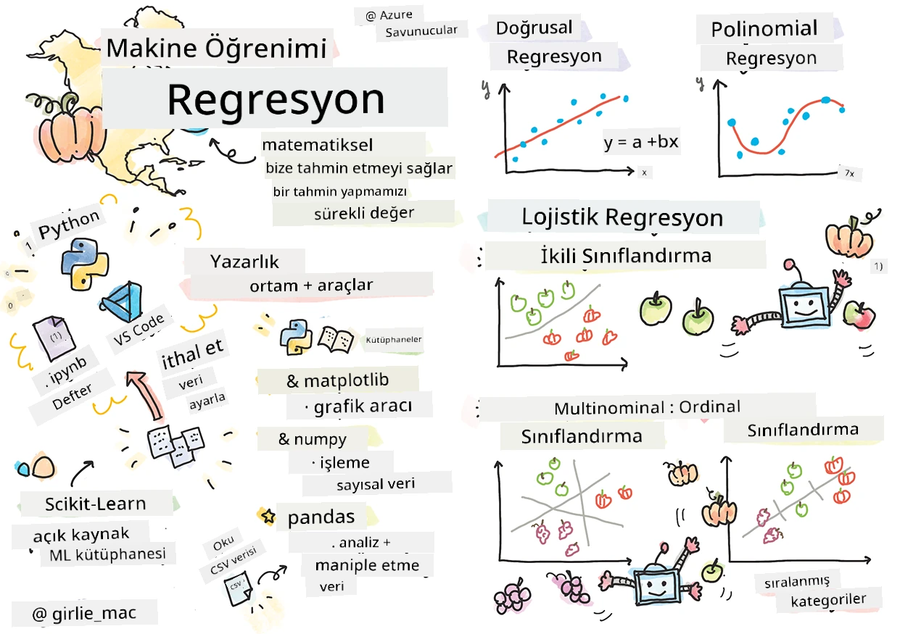
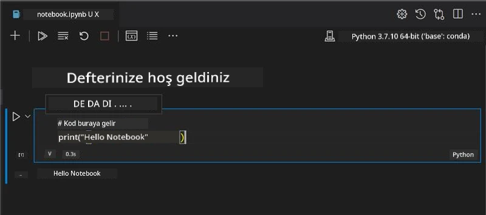
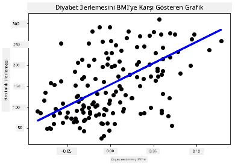

# Regresyon modelleri için Python ve Scikit-learn ile başlayın



> Sketchnote: [Tomomi Imura](https://www.twitter.com/girlie_mac)

## [Ders öncesi quiz](https://ff-quizzes.netlify.app/en/ml/)

> ### [Bu ders R dilinde de mevcuttur!](../../../../2-Regression/1-Tools/solution/R/lesson_1.html)

## Giriş

Bu dört derste, regresyon modelleri oluşturmayı keşfedeceksiniz. Bunun ne işe yaradığını kısa bir süre içinde tartışacağız. Fakat herhangi bir şeye başlamadan önce, süreci başlatmak için doğru araçlara sahip olduğunuzdan emin olun!

Bu derste, nasıl yapılacağını öğreneceksiniz:

- Yerel makine öğrenimi görevleri için bilgisayarınızı yapılandırmak.
- Jupyter Notebooks ile çalışmak.
- Kurulum dahil olmak üzere Scikit-learn kullanmak.
- Uygulamalı bir egzersizle doğrusal regresyonu keşfetmek.

## Kurulumlar ve yapılandırmalar

[](https://youtu.be/-DfeD2k2Kj0 "Yeni başlayanlar için ML - Makine Öğrenimi modelleri oluşturmak için araçlarınızı hazırlayın")

> 🎥 Bilgisayarınızı ML için yapılandırmayı anlatan kısa video için yukarıdaki görsele tıklayın.

1. **Python kurun**. Bilgisayarınızda [Python](https://www.python.org/downloads/) yüklü olduğundan emin olun. Python'u birçok veri bilimi ve makine öğrenimi görevi için kullanacaksınız. Çoğu bilgisayar sistemi zaten Python kurulumu içerir. Bazı kullanıcıların kurulumu kolaylaştırması için kullanışlı [Python Kodlama Paketleri](https://code.visualstudio.com/learn/educators/installers?WT.mc_id=academic-77952-leestott) de mevcuttur.

   Python'un bazı kullanımları yazılımın bir sürümünü gerektirirken, diğerleri başka bir sürümünü gerektirir. Bu nedenle, bir [sanal ortam](https://docs.python.org/3/library/venv.html) içinde çalışmak faydalıdır.

2. **Visual Studio Code yükleyin**. Bilgisayarınızda Visual Studio Code yüklü olduğundan emin olun. Temel kurulum için bu talimatları izleyerek [Visual Studio Code'u yükleyin](https://code.visualstudio.com/). Bu derste Python'u Visual Studio Code içinde kullanacağınız için, Python geliştirmesi için VS Code'u nasıl [yapılandıracağınızı gözden geçirmek](https://docs.microsoft.com/learn/modules/python-install-vscode?WT.mc_id=academic-77952-leestott) isteyebilirsiniz.

   > Python'u öğrenmek için bu [Learn modülleri koleksiyonunu](https://docs.microsoft.com/users/jenlooper-2911/collections/mp1pagggd5qrq7?WT.mc_id=academic-77952-leestott) inceleyin
   >
   > [](https://youtu.be/yyQM70vi7V8 "Visual Studio Code ile Python kurulumu")
   >
   > 🎥 Yukarıdaki görsele tıklayarak VS Code içinde Python kullanımını gösteren videoyu izleyin.

3. **Scikit-learn yükleyin**, [bu talimatları](https://scikit-learn.org/stable/install.html) takip ederek. Python 3 kullandığınızdan emin olmanız gerektiği için, bir sanal ortam kullanmanız önerilir. M1 Mac üzerinde bu kütüphaneyi yükliyorsanız, yukarıdaki bağlantıdaki sayfada özel talimatlar bulunmaktadır.

1. **Jupyter Notebook yükleyin**. [Jupyter paketini](https://pypi.org/project/jupyter/) yüklemeniz gerekecek.

## Makine Öğrenimi geliştirme ortamınız

Python kodunuzu geliştirmek ve makine öğrenimi modelleri oluşturmak için **notebook'ları** kullanacaksınız. Bu dosya türü veri bilimciler için yaygın bir araçtır ve `.ipynb` uzantısı ile tanımlanır.

Notebooks, geliştiricinin kod yazması kadar kod etrafına notlar, belgeler de ekleyebileceği interaktif bir ortamdır. Bu, deneysel veya araştırma odaklı projeler için oldukça faydalıdır.

[](https://youtu.be/7E-jC8FLA2E "Yeni başlayanlar için ML - Regresyon modelleri oluşturmayı başlatmak için Jupyter Notebooks kurun")

> 🎥 Bu egzersizi adım adım anlatan kısa video için yukarıdaki görsele tıklayın.

### Egzersiz - bir notebook ile çalışın

Bu klasörde _notebook.ipynb_ dosyasını bulacaksınız.

1. _notebook.ipynb_'yi Visual Studio Code'da açın.

   Python 3+ çalışan bir Jupyter sunucusu başlatılacak. Notebook içinde `çalıştırılabilir` alanlar yani kod parçacıkları vardır. Bir kod bloğunu, oynat simgesine benzeyen ikona tıklayarak çalıştırabilirsiniz.

1. `md` ikonunu seçin ve biraz markdown ekleyin, aşağıdaki metni yazın **# Notebook'unuza Hoş Geldiniz**.

   Sonra biraz Python kodu ekleyin.

1. Kod bloğuna **print('hello notebook')** yazın.
1. Kodu çalıştırmak için ok işaretini seçin.

   Yazdırılan ifade görünmeli:

    ```output
    hello notebook
    ```



Kodunuzu kendinizi belgelemek için yorumlarla harmanlayabilirsiniz.

✅ Bir web geliştiricinin çalışma ortamının veri bilimcisinden ne kadar farklı olduğunu bir dakika düşünün.

## Scikit-learn ile çalışmaya başlamak

Python yerel ortamınızda kuruldu ve Jupyter Notebooks ile rahat olduğunuz için, şimdi Scikit-learn (telaffuzu `sci` ‘science’ gibi) ile de aynı rahatlığa ulaşalım. Scikit-learn size ML görevlerini gerçekleştirmek için [kapsamlı bir API](https://scikit-learn.org/stable/modules/classes.html#api-ref) sağlar.

[web sitelerine](https://scikit-learn.org/stable/getting_started.html) göre, "Scikit-learn, denetimli ve denetimsiz öğrenmeyi destekleyen açık kaynaklı bir makine öğrenimi kütüphanesidir. Ayrıca model uyumu, veri ön işleme, model seçimi ve değerlendirme ve pek çok başka araç sağlar."

Bu derste 'geleneksel makine öğrenimi' görevleri olarak adlandırdığımız modelleri oluşturmak için Scikit-learn ve diğer araçları kullanacaksınız. Nöral ağlar ve derin öğrenmeden bilinçli olarak uzak durduk, zira bunlar yakında yayınlanacak 'Yeni Başlayanlar için AI' müfredatımızda kapsamlı şekilde ele alınacak.

Scikit-learn, modeller oluşturmayı ve değerlendirmeyi kolaylaştırır. Öncelikle sayısal verilerle çalışmaya odaklanmıştır ve öğrenme araçları olarak kullanılabilecek hazır birden fazla veri seti içerir. Ayrıca öğrencilerin deneyebileceği önceden hazırlanmış modeller sağlar. Öncelikle paketlenmiş veri yükleme ve yerleşik bir tahminci kullanarak Scikit-learn ile temel bir ML modeli kurma sürecini keşfedelim.

## Egzersiz - ilk Scikit-learn notebook'unuz

> Bu öğretici, Scikit-learn web sitesindeki [doğrusal regresyon örneği](https://scikit-learn.org/stable/auto_examples/linear_model/plot_ols.html#sphx-glr-auto-examples-linear-model-plot-ols-py) tarafından esinlenmiştir.


[](https://youtu.be/2xkXL5EUpS0 "Yeni başlayanlar için ML - Python'da İlk Doğrusal Regresyon Projeniz")

> 🎥 Bu egzersizi adım adım anlatan kısa video için yukarıdaki görsele tıklayın.

_notebook.ipynb_ dosyasında, tüm hücreleri 'çöp kutusu' ikonuna basarak temizleyin.

Bu bölümde, Scikit-learn'e öğrenme amaçlı olarak dahil edilmiş küçük bir diyabet veri kümesiyle çalışacaksınız. Diyabet hastaları için bir tedavi test etmek istediğinizi hayal edin. Makine Öğrenimi modelleri, değişken kombinasyonlarına göre hangi hastaların tedaviye daha iyi yanıt vereceğini belirlemenize yardımcı olabilir. Çok temel bir regresyon modeli bile görselleştirildiğinde, teorik klinik deneylerinizi organize etmekte yardımcı olacak değişkenler hakkında bilgi verebilir.

✅ Birçok regresyon yöntemi türü vardır ve hangisini seçeceğiniz, aradığınız yanıta bağlıdır. Belirli bir yaş için muhtemel uzunluğu tahmin etmek istiyorsanız, **sayısal bir değer** aradığınız için doğrusal regresyon kullanırsınız. Diyet olarak vegan kabul edilip edilmemesi gibi bir tür yiyecek sınıflandırması ilgilendiriyorsa, **kategori ataması** arıyorsunuz demektir ve lojistik regresyon kullanırsınız. Lojistik regresyonu daha sonra öğreneceksiniz. Veriden sorabileceğiniz bazı soruları ve hangi yöntemin daha uygun olacağını biraz düşünün.

Bu göreve başlayalım.

### Kütüphaneleri içe aktar

Bu görev için bazı kütüphaneleri içe aktaracağız:

- **matplotlib**. Faydalı bir [grafik aracı](https://matplotlib.org/)dır ve çizgi grafiği oluşturmak için kullanacağız.
- **numpy**. [numpy](https://numpy.org/doc/stable/user/whatisnumpy.html), Python'da sayısal veri ile çalışmak için yararlı bir kütüphanedir.
- **sklearn**. Bu, [Scikit-learn](https://scikit-learn.org/stable/user_guide.html) kütüphanesidir.

Görevlerinize yardımcı olacak bazı kütüphaneleri içe aktarın.

1. Aşağıdaki kodu yazarak içe aktarımları ekleyin:

   ```python
   import matplotlib.pyplot as plt
   import numpy as np
   from sklearn import datasets, linear_model, model_selection
   ```

   Yukarıda `matplotlib`, `numpy` içe aktarılıyor ve `sklearn`den `datasets`, `linear_model` ve `model_selection` içe aktarılıyor. `model_selection`, veriyi eğitim ve test setlerine bölmek için kullanılır.

### Diyabet veri kümesi

Dahili [diyabet veri kümesi](https://scikit-learn.org/stable/datasets/toy_dataset.html#diabetes-dataset), diyabet çevresinde 442 örnek veri içerir ve 10 özellik değişkeni vardır, bunlardan bazıları:

- age: yaş (yıl olarak)
- bmi: beden kitle indeksi
- bp: ortalama kan basıncı
- s1 tc: T-Hücreleri (bir tür beyaz kan hücresi)

✅ Bu veri setinde, diyabet araştırmalarında önemli bir özellik değişken olan 'cinsiyet' kavramı vardır. Birçok tıbbi veri seti bu tür ikili sınıflandırmalar içerir. Bu tür sınıflandırmaların nüfusun bazı bölümlerini tedavilerden nasıl dışlayabileceğini biraz düşünün.

Şimdi, X ve y verilerini yükleyin.

> 🎓 Unutmayın, bu denetimli öğrenmedir ve adlandırılmış bir 'y' hedefi gerekir.

Yeni bir kod hücresinde, diyabet veri setini `load_diabetes()` çağırarak yükleyin. `return_X_y=True` girişi, `X`in veri matrisi ve `y`nin regresyon hedefi olacağını belirtir.

1. Veri matrisinin şekli ve ilk öğesini göstermek için birkaç yazdırma komutu ekleyin:

    ```python
    X, y = datasets.load_diabetes(return_X_y=True)
    print(X.shape)
    print(X[0])
    ```

    Dönen yanıt bir demet (tuple) olup, ona göre ilk iki değer sırasıyla `X` ve `y`ye atanır. Demetler hakkında daha fazla bilgi için [demetlere](https://wikipedia.org/wiki/Tuple) bakabilirsiniz.

    Bu verinin 442 öğeden oluştuğunu ve bunların her birinin 10 elemanlı diziler şeklinde olduğunu görebilirsiniz:

    ```text
    (442, 10)
    [ 0.03807591  0.05068012  0.06169621  0.02187235 -0.0442235  -0.03482076
    -0.04340085 -0.00259226  0.01990842 -0.01764613]
    ```

    ✅ Veriler ile regresyon hedefi arasındaki ilişkiyi biraz düşünün. Doğrusal regresyon, özellik X ile hedef değişken y arasındaki ilişkiyi tahmin eder. Diyabet veri kümesi için [hedefi](https://scikit-learn.org/stable/datasets/toy_dataset.html#diabetes-dataset) dokümantasyonda bulabilir misiniz? Bu veri seti verilen hedefle ne gösteriyor?

2. Sonra, bu veri setinin bir kısmını çizdirmek için 3. sütunu seçin. Bunu tüm satırları seçmek için `:` operatörü ile ve daha sonra (2) indeksi ile 3. sütunu seçerek yapabilirsiniz. Veriyi çizim için gereken 2 boyutlu dizi haline getirmek için `reshape(n_rows, n_columns)` fonksiyonunu kullanabilirsiniz. Parametrelerden biri -1 ise, o boyut otomatik hesaplanır.

   ```python
   X = X[:, 2]
   X = X.reshape((-1,1))
   ```

   ✅ Herhangi bir zamanda verinin şeklini kontrol etmek için yazdırın.

3. Artık çizime hazır veriniz var, bir makinenin veri setindeki sayılar arasında mantıklı bir sınır belirlemesine izin verip vermediğine bakabilirsiniz. Bunu yapmak için, veri (X) ve hedef (y) test ve eğitim setlerine bölünmelidir. Scikit-learn bunu kolayca yapmanızı sağlar; test verinizi belirli bir noktada bölebilirsiniz.

   ```python
   X_train, X_test, y_train, y_test = model_selection.train_test_split(X, y, test_size=0.33)
   ```

4. Şimdi modelinizi eğitmeye hazırsınız! Doğrusal regresyon modelini yükleyin ve `model.fit()` kullanarak X ve y eğitim setleriniz ile eğitin:

    ```python
    model = linear_model.LinearRegression()
    model.fit(X_train, y_train)
    ```

    ✅ `model.fit()` fonksiyonu, TensorFlow gibi birçok ML kütüphanesinde gördüğünüz bir işlevdir

5. Sonra test verisini kullanarak `predict()` fonksiyonu ile tahmin oluşturun. Bu, veri grupları arasında bir çizgi çizmek için kullanılacak.

    ```python
    y_pred = model.predict(X_test)
    ```

6. Şimdi veriyi bir grafikte gösterme zamanı. Bu görev için matplotlib çok faydalı bir araçtır. Tüm X ve y test verilerinin bir saçılım grafiğini oluşturun ve tahmini kullanarak modelin veri grupları arasında en uygun yere bir çizgi çizin.

    ```python
    plt.scatter(X_test, y_test,  color='black')
    plt.plot(X_test, y_pred, color='blue', linewidth=3)
    plt.xlabel('Scaled BMIs')
    plt.ylabel('Disease Progression')
    plt.title('A Graph Plot Showing Diabetes Progression Against BMI')
    plt.show()
    ```

   


   ✅ Burada neler olup bittiği hakkında biraz düşünün. Bir doğru, birçok küçük veri noktasından geçiyor, peki tam olarak ne yapıyor? Yeni, görülmemiş bir veri noktasının grafiğin y eksenine göre nerede yer alması gerektiğini tahmin etmek için bu doğruyu nasıl kullanabileceğinizi görebiliyor musunuz? Bu modelin pratik kullanımını kelimelere dökmeye çalışın.

Tebrikler, ilk doğrusal regresyon modelinizi oluşturdunuz, onunla bir tahmin yaptınız ve bunu bir grafikte gösterdiniz!

---
## 🚀Meydan Okuma

Bu veri setinden farklı bir değişkeni grafikle gösterin. İpucu: bu satırı düzenleyin: `X = X[:,2]`. Bu veri setinin hedefi göz önüne alındığında, diyabet hastalığının ilerleyişi hakkında neler keşfedebilirsiniz?
## [Ders sonrası quiz](https://ff-quizzes.netlify.app/en/ml/)

## Genel Bakış & Kendi Kendine Çalışma

Bu öğreticide, tek değişkenli veya çoklu doğrusal regresyon yerine basit doğrusal regresyon ile çalıştınız. Bu yöntemler arasındaki farklılıklar hakkında biraz okuyun veya [bu videoya](https://www.coursera.org/lecture/quantifying-relationships-regression-models/linear-vs-nonlinear-categorical-variables-ai2Ef) göz atın.

Regresyon kavramı hakkında daha fazla okuyun ve bu teknikle hangi tür soruların cevaplanabileceğini düşünün. Anlayışınızı derinleştirmek için bu [öğreticiyi](https://docs.microsoft.com/learn/modules/train-evaluate-regression-models?WT.mc_id=academic-77952-leestott) yapın.

## Ödev

[Farklı bir veri seti](assignment.md)

---

<!-- CO-OP TRANSLATOR DISCLAIMER START -->
**Feragatname**:
Bu belge, AI çeviri hizmeti [Co-op Translator](https://github.com/Azure/co-op-translator) kullanılarak çevrilmiştir. Doğruluk için çaba sarf etsek de, otomatik çevirilerin hata veya yanlışlık içerebileceğini lütfen unutmayınız. Orijinal belge, kendi dilinde yetkili kaynak olarak kabul edilmelidir. Kritik bilgiler için profesyonel insan çevirisi önerilir. Bu çevirinin kullanımı sonucu ortaya çıkabilecek yanlış anlamalardan veya yanlış yorumlamalardan sorumlu değiliz.
<!-- CO-OP TRANSLATOR DISCLAIMER END -->