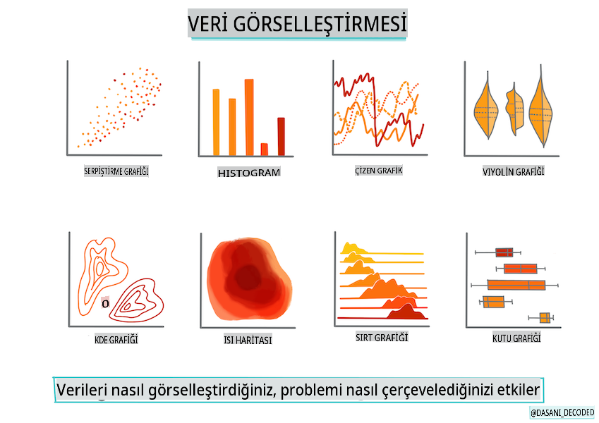
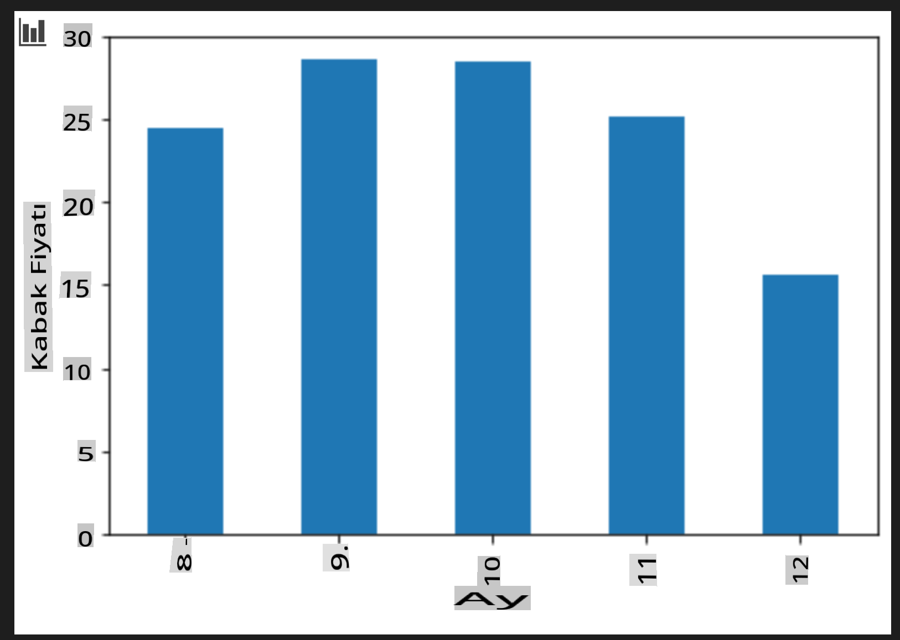

# Scikit-learn kullanarak bir regresyon modeli oluşturun: verileri hazırlayın ve görselleştirin



İnfografik: [Dasani Madipalli](https://twitter.com/dasani_decoded)

## [Ders öncesi sınavı](https://gray-sand-07a10f403.1.azurestaticapps.net/quiz/11/)

> ### [Bu ders R dilinde de mevcut!](../../../../2-Regression/2-Data/solution/R/lesson_2.html)

## Giriş

Scikit-learn ile makine öğrenimi modeli oluşturma araçlarını kurduğunuza göre, verileriniz hakkında sorular sormaya başlayabilirsiniz. Veri ile çalışırken ve ML çözümleri uygularken, verisetinizin potansiyelini doğru bir şekilde açığa çıkarmak için doğru soruyu sormayı anlamak çok önemlidir.

Bu derste öğrenecekleriniz:

- Verilerinizi model oluşturma için nasıl hazırlayacağınız.
- Veri görselleştirme için Matplotlib'i nasıl kullanacağınız.

## Verilerinize doğru soruyu sormak

Yanıtlanması gereken soru, hangi tür ML algoritmalarını kullanacağınızı belirleyecektir. Ve alacağınız yanıtın kalitesi, verinizin doğasına büyük ölçüde bağlı olacaktır.

Bu ders için sağlanan [verilere](https://github.com/microsoft/ML-For-Beginners/blob/main/2-Regression/data/US-pumpkins.csv) bir göz atın. Bu .csv dosyasını VS Code'da açabilirsiniz. Hızlı bir göz gezdirdiğinizde hemen boşluklar ve karışık string ve sayısal veriler olduğunu görürsünüz. Ayrıca 'Package' adlı tuhaf bir sütun var, burada veriler 'sacks', 'bins' ve diğer değerler arasında karışmış durumda. Aslında veriler biraz dağınık.

[](https://youtu.be/5qGjczWTrDQ "Yeni başlayanlar için ML - Bir Veri Setini Nasıl Analiz Edip Temizlersiniz")

> 🎥 Yukarıdaki resme tıklayarak bu ders için verileri hazırlama sürecini gösteren kısa bir videoya ulaşabilirsiniz.

Aslında, kutudan çıkar çıkmaz bir ML modeli oluşturmak için tamamen hazır bir veri setine sahip olmak çok yaygın değildir. Bu derste, standart Python kütüphanelerini kullanarak ham bir veri setini nasıl hazırlayacağınızı öğreneceksiniz. Ayrıca verileri görselleştirmek için çeşitli teknikleri öğreneceksiniz.

## Vaka çalışması: 'balkabağı pazarı'

Bu klasörde, kök `data` klasöründe [US-pumpkins.csv](https://github.com/microsoft/ML-For-Beginners/blob/main/2-Regression/data/US-pumpkins.csv) adlı bir .csv dosyası bulacaksınız. Bu dosya, şehir bazında gruplandırılmış, balkabağı pazarı hakkında 1757 satır veri içerir. Bu veriler, ABD Tarım Bakanlığı tarafından dağıtılan [Özel Ürünler Terminal Pazarları Standart Raporları](https://www.marketnews.usda.gov/mnp/fv-report-config-step1?type=termPrice) adresinden çıkarılmış ham verilerdir.

### Verileri hazırlamak

Bu veriler kamu malıdır. USDA web sitesinden şehir başına ayrı ayrı dosyalar olarak indirilebilir. Çok fazla ayrı dosya olmaması için, tüm şehir verilerini tek bir elektronik tabloya birleştirdik, böylece verileri biraz _hazırlamış_ olduk. Şimdi, verilere daha yakından bakalım.

### Balkabağı verileri - ilk sonuçlar

Bu veriler hakkında ne fark ediyorsunuz? Zaten stringler, sayılar, boşluklar ve anlamlandırmanız gereken tuhaf değerlerin karışımı olduğunu gördünüz.

Bu verilerle bir Regresyon tekniği kullanarak hangi soruyu sorabilirsiniz? "Belirli bir ayda satılık bir balkabağının fiyatını tahmin et" ne dersiniz? Verilere tekrar baktığınızda, bu görev için gerekli veri yapısını oluşturmak için bazı değişiklikler yapmanız gerektiğini görüyorsunuz.

## Alıştırma - balkabağı verilerini analiz et

Bu balkabağı verilerini analiz etmek ve hazırlamak için verileri şekillendirmede çok yararlı bir araç olan [Pandas](https://pandas.pydata.org/) (adı `Python Data Analysis` anlamına gelir) kullanacağız.

### İlk olarak, eksik tarihleri kontrol edin

İlk olarak eksik tarihleri kontrol etmek için adımlar atmanız gerekecek:

1. Tarihleri ay formatına dönüştürün (bunlar ABD tarihleri, bu yüzden format `MM/DD/YYYY`).
2. Ayı yeni bir sütuna çıkarın.

_Notebook.ipynb_ dosyasını Visual Studio Code'da açın ve elektronik tabloyu yeni bir Pandas dataframe'ine aktarın.

1. İlk beş satırı görüntülemek için `head()` işlevini kullanın.

    ```python
    import pandas as pd
    pumpkins = pd.read_csv('../data/US-pumpkins.csv')
    pumpkins.head()
    ```

    ✅ Son beş satırı görüntülemek için hangi işlevi kullanırdınız?

1. Mevcut dataframe'de eksik veri olup olmadığını kontrol edin:

    ```python
    pumpkins.isnull().sum()
    ```

    Eksik veri var, ancak belki de bu görev için önemli olmayabilir.

1. Dataframe'inizi daha kolay çalışılabilir hale getirmek için yalnızca ihtiyacınız olan sütunları seçin, `loc` function which extracts from the original dataframe a group of rows (passed as first parameter) and columns (passed as second parameter). The expression `:` aşağıdaki durumda "tüm satırlar" anlamına gelir.

    ```python
    columns_to_select = ['Package', 'Low Price', 'High Price', 'Date']
    pumpkins = pumpkins.loc[:, columns_to_select]
    ```

### İkinci olarak, balkabağının ortalama fiyatını belirleyin

Belirli bir ayda bir balkabağının ortalama fiyatını belirlemeyi düşünün. Bu görev için hangi sütunları seçerdiniz? İpucu: 3 sütuna ihtiyacınız olacak.

Çözüm: Yeni Fiyat sütununu doldurmak için `Low Price` and `High Price` sütunlarının ortalamasını alın ve Tarih sütununu yalnızca ayı gösterecek şekilde dönüştürün. Neyse ki, yukarıdaki kontrole göre tarihler veya fiyatlar için eksik veri yok.

1. Ortalama hesaplamak için aşağıdaki kodu ekleyin:

    ```python
    price = (pumpkins['Low Price'] + pumpkins['High Price']) / 2

    month = pd.DatetimeIndex(pumpkins['Date']).month

    ```

   ✅ `print(month)` kullanarak kontrol etmek istediğiniz herhangi bir veriyi yazdırabilirsiniz.

2. Şimdi, dönüştürdüğünüz verileri yeni bir Pandas dataframe'ine kopyalayın:

    ```python
    new_pumpkins = pd.DataFrame({'Month': month, 'Package': pumpkins['Package'], 'Low Price': pumpkins['Low Price'],'High Price': pumpkins['High Price'], 'Price': price})
    ```

    Dataframe'inizi yazdırmak, yeni regresyon modelinizi oluşturabileceğiniz temiz, düzenli bir veri setini gösterecektir.

### Ama bekleyin! Burada tuhaf bir şey var

`Package` column, pumpkins are sold in many different configurations. Some are sold in '1 1/9 bushel' measures, and some in '1/2 bushel' measures, some per pumpkin, some per pound, and some in big boxes with varying widths.

> Pumpkins seem very hard to weigh consistently

Digging into the original data, it's interesting that anything with `Unit of Sale` equalling 'EACH' or 'PER BIN' also have the `Package` type per inch, per bin, or 'each'. Pumpkins seem to be very hard to weigh consistently, so let's filter them by selecting only pumpkins with the string 'bushel' in their `Package` sütununa bakın.

1. Dosyanın en üstüne, ilk .csv importunun altına bir filtre ekleyin:

    ```python
    pumpkins = pumpkins[pumpkins['Package'].str.contains('bushel', case=True, regex=True)]
    ```

    Şimdi veriyi yazdırırsanız, yalnızca bushel ile satılan balkabaklarını içeren yaklaşık 415 satır veri aldığınızı görebilirsiniz.

### Ama bekleyin! Yapılacak bir şey daha var

Bushel miktarının satır başına değiştiğini fark ettiniz mi? Fiyatlandırmayı normalize etmeniz ve bushel başına fiyatı göstermeniz gerekiyor, bu yüzden standartlaştırmak için biraz matematik yapın.

1. Yeni_pumpkins dataframe'ini oluşturma bloğunun ardından bu satırları ekleyin:

    ```python
    new_pumpkins.loc[new_pumpkins['Package'].str.contains('1 1/9'), 'Price'] = price/(1 + 1/9)

    new_pumpkins.loc[new_pumpkins['Package'].str.contains('1/2'), 'Price'] = price/(1/2)
    ```

✅ [The Spruce Eats](https://www.thespruceeats.com/how-much-is-a-bushel-1389308) göre, bushel'in ağırlığı ürün türüne bağlı olarak değişir, çünkü bu bir hacim ölçümüdür. "Örneğin, bir bushel domatesin 56 pound ağırlığında olması gerekiyor... Yapraklar ve yeşillikler daha az ağırlıkla daha fazla yer kaplar, bu yüzden bir bushel ıspanak sadece 20 pound." Bu oldukça karmaşık! Bushel'den pound'a dönüşüm yapmak yerine bushel başına fiyatlandırma yapalım. Ancak, balkabağı bushels'ı üzerine yapılan bu çalışma, verinizin doğasını anlamanın ne kadar önemli olduğunu gösteriyor!

Şimdi, bushel ölçümlerine dayalı olarak birim başına fiyatlandırmayı analiz edebilirsiniz. Veriyi bir kez daha yazdırırsanız, nasıl standartlaştırıldığını görebilirsiniz.

✅ Yarım bushel ile satılan balkabaklarının çok pahalı olduğunu fark ettiniz mi? Nedenini bulabilir misiniz? İpucu: Küçük balkabakları büyük olanlardan çok daha pahalıdır, muhtemelen bushel başına çok daha fazla olmalarından dolayı, büyük boş bir turta balkabağı tarafından kullanılan boş alan nedeniyle.

## Görselleştirme Stratejileri

Veri bilimcilerinin rolü, çalıştıkları verilerin kalitesini ve doğasını göstermektir. Bunu yapmak için, genellikle verilerin farklı yönlerini gösteren ilginç görselleştirmeler, grafikler ve tablolar oluştururlar. Bu şekilde, görsel olarak ilişkileri ve keşfedilmesi zor boşlukları gösterebilirler.

[](https://youtu.be/SbUkxH6IJo0 "Yeni başlayanlar için ML - Matplotlib ile Veriler Nasıl Görselleştirilir")

> 🎥 Yukarıdaki resme tıklayarak bu ders için verileri görselleştirme sürecini gösteren kısa bir videoya ulaşabilirsiniz.

Görselleştirmeler, veriler için en uygun makine öğrenimi tekniğini belirlemeye de yardımcı olabilir. Örneğin, bir çizgiye benzeyen bir scatterplot, verilerin doğrusal regresyon için iyi bir aday olduğunu gösterir.

Jupyter defterlerinde iyi çalışan bir veri görselleştirme kütüphanesi [Matplotlib](https://matplotlib.org/) (önceki derste de gördünüz).

> Veri görselleştirme ile daha fazla deneyim kazanmak için [bu eğitimlere](https://docs.microsoft.com/learn/modules/explore-analyze-data-with-python?WT.mc_id=academic-77952-leestott) göz atın.

## Alıştırma - Matplotlib ile deney yapın

Yeni oluşturduğunuz dataframe'i göstermek için bazı temel grafikler oluşturmaya çalışın. Temel bir çizgi grafiği ne gösterir?

1. Dosyanın en üstüne, Pandas importunun altına Matplotlib'i ekleyin:

    ```python
    import matplotlib.pyplot as plt
    ```

1. Tüm defteri yeniden çalıştırarak yenileyin.
1. Defterin altına, veriyi kutu olarak çizmek için bir hücre ekleyin:

    ```python
    price = new_pumpkins.Price
    month = new_pumpkins.Month
    plt.scatter(price, month)
    plt.show()
    ```

    

    Bu faydalı bir grafik mi? Sizi şaşırtan bir şey var mı?

    Bu çok faydalı değil çünkü verilerinizi belirli bir ayda yayılmış noktalar olarak gösterir.

### Onu faydalı hale getirin

Grafiklerin faydalı veriler göstermesi için genellikle verileri bir şekilde gruplamanız gerekir. Y ekseninde ayları gösteren ve verilerin dağılımını gösteren bir grafik oluşturmaya çalışalım.

1. Gruplandırılmış bir çubuk grafik oluşturmak için bir hücre ekleyin:

    ```python
    new_pumpkins.groupby(['Month'])['Price'].mean().plot(kind='bar')
    plt.ylabel("Pumpkin Price")
    ```

    

    Bu daha faydalı bir veri görselleştirme! Balkabağı fiyatlarının en yüksek olduğu dönemlerin Eylül ve Ekim olduğunu gösteriyor gibi görünüyor. Bu beklentinizi karşılıyor mu? Neden veya neden değil?

---

## 🚀Meydan okuma

Matplotlib'in sunduğu farklı görselleştirme türlerini keşfedin. Hangi türler regresyon problemleri için en uygundur?

## [Ders sonrası sınavı](https://gray-sand-07a10f403.1.azurestaticapps.net/quiz/12/)

## İnceleme ve Kendi Kendine Çalışma

Verileri görselleştirmenin birçok yoluna bir göz atın. Mevcut çeşitli kütüphanelerin bir listesini yapın ve hangi tür görevler için en uygun olduklarını not edin, örneğin 2D görselleştirmeler vs. 3D görselleştirmeler. Ne keşfediyorsunuz?

## Ödev

[Görselleştirmeyi keşfetmek](assignment.md)

**Feragatname**:
Bu belge, makine tabanlı yapay zeka çeviri hizmetleri kullanılarak çevrilmiştir. Doğruluk için çaba sarf etsek de, otomatik çevirilerin hata veya yanlışlıklar içerebileceğini lütfen unutmayın. Orijinal belgenin kendi dilindeki hali yetkili kaynak olarak kabul edilmelidir. Kritik bilgiler için profesyonel insan çevirisi tavsiye edilir. Bu çevirinin kullanımından kaynaklanan yanlış anlamalar veya yanlış yorumlamalardan sorumlu değiliz.