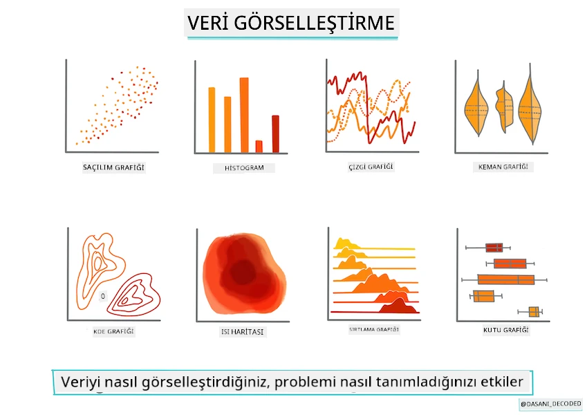
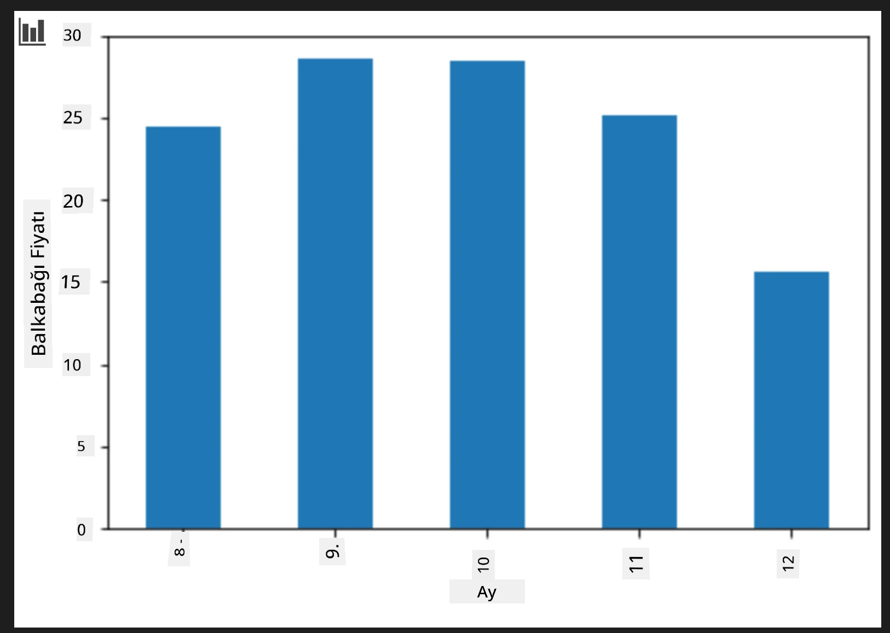
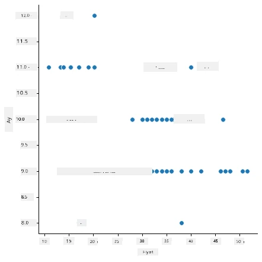
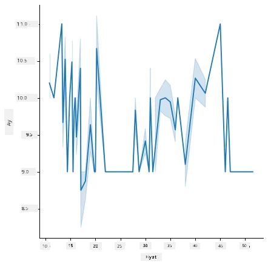
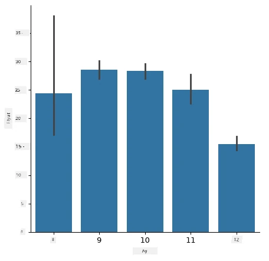
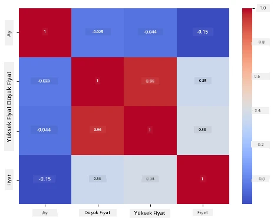

# Scikit-learn kullanarak bir regresyon modeli oluşturun: verileri hazırlayın ve görselleştirin



Infografik [Dasani Madipalli](https://twitter.com/dasani_decoded) tarafından

## [Ders öncesi quiz](https://ff-quizzes.netlify.app/en/ml/)

> ### [Bu ders R dilinde mevcut!](../../../../2-Regression/2-Data/solution/R/lesson_2.html)

## Giriş

Artık Scikit-learn ile makine öğrenimi modeli oluşturmaya başlamak için ihtiyaç duyduğunuz araçlara sahipsiniz, verilerinize soru sormaya başlayabilirsiniz. Verilerle çalışırken ve ML çözümleri uygularken, veri setinizin potansiyellerini doğru şekilde açığa çıkarmak için doğru soruyu sormanın çok önemli olduğunu anlamak gereklidir.

Bu derste şunları öğreneceksiniz:

- Model oluşturmak için verilerinizi nasıl hazırlayacağınızı.
- Verileri görselleştirmek için Matplotlib'i nasıl kullanacağınızı.
- Daha etkili veri görselleştirmesi için Seaborn'u nasıl kullanacağınızı.

## Verilerinize doğru soruyu sormak

Cevaplamanız gereken soru, nasıl bir ML algoritması kullanacağınızı belirleyecektir. Ve aldığınız cevabın kalitesi, verilerinizin doğasına büyük ölçüde bağlıdır.

Bu derste verilen [veriye](https://github.com/microsoft/ML-For-Beginners/blob/main/2-Regression/data/US-pumpkins.csv) bir göz atın. Bu .csv dosyasını VS Code'da açabilirsiniz. Hızlıca bakıldığında boşluklar ve hem metin hem sayı içeren karışık veri olduğu görülür. Ayrıca 'Package' adında tuhaf bir sütun var; veriler burada 'sacks', 'bins' ve diğer değerlerin karışımı. Aslında veri biraz karışık.

[](https://youtu.be/5qGjczWTrDQ "ML for beginners - Nasıl Veri Seti Analiz Edilir ve Temizlenir")

> 🎥 Bu ders için verilerin hazırlanmasını gösteren kısa video için yukarıdaki resme tıklayın.

Aslında, kutudan çıkar çıkmaz kullanıma tamamen hazır bir veri seti almak çok yaygın değildir. Bu derste, standart Python kütüphaneleri kullanarak ham bir veri setini nasıl hazırlayacağınızı öğreneceksiniz. Ayrıca verileri görselleştirmek için çeşitli teknikleri öğreneceksiniz.

## Vaka çalışması: 'kabak pazarı'

Bu klasörde, kök `data` klasörü içinde [US-pumpkins.csv](https://github.com/microsoft/ML-For-Beginners/blob/main/2-Regression/data/US-pumpkins.csv) adlı, şehir bazında gruplandırılmış kabak pazarı hakkında 1757 satırlık veri içeren bir .csv dosyası bulacaksınız. Bu, Amerika Birleşik Devletleri Tarım Bakanlığı tarafından dağıtılan [Özel Ürünler Terminal Pazarları Standart Raporlarından](https://www.marketnews.usda.gov/mnp/fv-report-config-step1?type=termPrice) çıkarılan ham veridir.

### Verileri hazırlama

Bu veri kamu malıdır. USDA web sitesinden şehir başına çok sayıda ayrı dosya olarak indirilebilir. Çok fazla dosya olmasını önlemek için tüm şehir verilerini tek bir tabloya birleştirdik, böylece veriyi zaten biraz _hazırlamış_ olduk. Şimdi veriye daha yakından bakalım.

### Kabak verisi - ilk çıkarımlar

Bu veride ne fark ettiniz? Zaten içinde metinler, sayılar, boşluklar ve anlamlandırmanız gereken tuhaf değerler olduğunu gördünüz.

Bu veriye bir Regresyon tekniği kullanarak hangi soruyu sorabilirsiniz? Mesela "Belirli bir ayda satılan kabak fiyatını tahmin et". Veriye tekrar baktığınızda, görevi gerçekleştirmek için veri yapısında yapmanız gereken bazı değişiklikler var.
## Alıştırma - kabak verisini analiz et

Bu kabak verisini analiz etmek ve hazırlamak için verileri şekillendirmede çok faydalı olan [Pandas](https://pandas.pydata.org/) (adı `Python Veri Analizi` anlamına gelir) aracını kullanalım.

### İlk olarak, eksik tarihler için kontrol yapın

Öncelikle eksik tarih olup olmadığını kontrol etmek için adımlar atmanız gerekiyor:

1. Tarihleri ay formatına dönüştürün (bunlar ABD tarihleri, format `MM/DD/YYYY`).
2. Ay bilgisini yeni bir sütuna çıkarın.

Visual Studio Code'da _notebook.ipynb_ dosyasını açın ve tabloyu yeni bir Pandas dataframe'ine aktarın.

1. İlk beş satırı görmek için `head()` fonksiyonunu kullanın.

    ```python
    import pandas as pd
    pumpkins = pd.read_csv('../data/US-pumpkins.csv')
    pumpkins.head()
    ```

    ✅ Son beş satırı görmek için hangi fonksiyonu kullanırsınız?

1. Mevcut dataframe'de eksik veri olup olmadığını kontrol edin:

    ```python
    pumpkins.isnull().sum()
    ```

    Eksik veri var, ancak belki mevcut görev için önemli olmayabilir.

1. Dataframe ile çalışmayı kolaylaştırmak için, yalnızca ihtiyacınız olan sütunları `loc` fonksiyonunu kullanarak seçin; bu fonksiyon orijinal dataframe'den satır grubunu (birinci parametre) ve sütun grubunu (ikinci parametre) ayıklar. Aşağıdaki durumda `:` ifadesi "tüm satırlar" anlamındadır.

    ```python
    columns_to_select = ['Package', 'Low Price', 'High Price', 'Date']
    pumpkins = pumpkins.loc[:, columns_to_select]
    ```

### İkinci olarak, kabak fiyatının ortalamasını belirleyin

Belirli bir ayda bir kabağın ortalama fiyatını nasıl belirleyeceğinizi düşünün. Bu görev için hangi sütunları seçersiniz? İpucu: 3 sütuna ihtiyacınız olacak.

Çözüm: Yeni Fiyat sütununu doldurmak için `Low Price` ve `High Price` sütunlarının ortalamasını alın ve Tarih sütununu sadece ay gösterecek şekilde dönüştürün. Neyse ki yukarıdaki kontrole göre, tarihler veya fiyatlar için eksik veri yok.

1. Ortalamayı hesaplamak için aşağıdaki kodu ekleyin:

    ```python
    price = (pumpkins['Low Price'] + pumpkins['High Price']) / 2

    month = pd.DatetimeIndex(pumpkins['Date']).month

    ```

   ✅ Kontrol etmek istediğiniz verileri `print(month)` ile yazdırmakta özgürsünüz.

2. Şimdi, dönüştürdüğünüz verileri yeni bir Pandas dataframe'ine kopyalayın:

    ```python
    new_pumpkins = pd.DataFrame({'Month': month, 'Package': pumpkins['Package'], 'Low Price': pumpkins['Low Price'],'High Price': pumpkins['High Price'], 'Price': price})
    ```

    Dataframe'inizi yazdırmak, üzerine yeni regresyon modelinizi kurabileceğiniz temiz bir veri seti gösterecektir.

### Ama durun! Burada tuhaf bir şey var

`Package` sütununa bakarsanız, kabaklar birçok farklı şekilde satılıyor. Bazıları '1 1/9 bushel' ölçüsünde, bazıları '1/2 bushel' ölçüsünde, bazıları tane başına, bazıları pound başına ve bazıları değişen genişlikte büyük kutularda satılıyor.

> Kabakların tartılması tutarlı şekilde çok zor görünüyor

Orijinal veriye daha yakından baktığınızda, `Unit of Sale` 'EACH' veya 'PER BIN' olan kayıtların `Package` türü de inç başına, porsiyon başına ya da 'her biri' olarak gözüküyor. Kabaklar tutarlı tartılması zor görünüyor, o yüzden sadece `Package` sütununda 'bushel' geçen kabakları seçerek filtreleyelim.

1. Dosyanın en üstüne, ilk .csv aktarımının altına bir filtre ekleyin:

    ```python
    pumpkins = pumpkins[pumpkins['Package'].str.contains('bushel', case=True, regex=True)]
    ```

    Verileri şimdi yazdırırsanız sadece bushel bazında kabak içeren yaklaşık 415 satırı aldığınızı göreceksiniz.

### Ama durun! Daha yapılacak bir şey var

Bushel miktarının satır satır değiştiğini fark ettiniz mi? Fiyatlandırmayı normalize etmeniz gerekiyor, böylece fiyatları bushel başına gösterebilirsiniz, bunu standart hale getirmek için biraz matematik yapın.

1. Aşağıdaki satırları new_pumpkins dataframe'i oluşturma bloğunun sonrasına ekleyin:

    ```python
    new_pumpkins.loc[new_pumpkins['Package'].str.contains('1 1/9'), 'Price'] = price/(1 + 1/9)

    new_pumpkins.loc[new_pumpkins['Package'].str.contains('1/2'), 'Price'] = price/(1/2)
    ```

✅ [The Spruce Eats](https://www.thespruceeats.com/how-much-is-a-bushel-1389308) sitesine göre, bir bushelin ağırlığı ürün türüne bağlıdır çünkü bu bir hacim ölçüsüdür. "Örneğin bir bushel domatesin ağırlığı 56 pound olmalıdır... Yapraklar ve yeşillikler daha az ağırlıkla daha fazla yer kaplar, bu yüzden bir bushel ıspanak sadece 20 pounddur." Bu iş oldukça karmaşık! Bushel'den pound'a dönüşüm yapmaya çalışma, bunun yerine bushel bazında fiyatlandır. Yine de bu kabak bushel çalışması, verinizin doğasını anlamanın ne kadar önemli olduğunu gösterir!

Artık bushel ölçümüne göre birim fiyatlandırmayı analiz edebilirsiniz. Veriyi yeniden yazdırdığınızda nasıl standart hale geldiğini görebilirsiniz.

✅ Yarım bushel ile satılan kabakların çok pahalı olduğunu fark ettiniz mi? Nedenini çözebilir misiniz? İpucu: Küçük kabaklar büyük olanlardan çok daha pahalı, muhtemelen bushel başına çok daha fazla olmalarından dolayı, çünkü büyük boşluklu bir kabak bushel'ü kullanışsız hale getiriyor.

## Görselleştirme Stratejileri

Veri bilimcisinin görevlerinden biri, üzerinde çalıştığı verilerin kalitesini ve doğasını göstermektir. Bunu yapmak için genellikle verinin farklı yönlerini gösteren ilginç görselleştirmeler, grafikler ve çizelgeler oluştururlar. Bu yolla, görsel olarak başka türlü keşfedilmesi zor olan ilişkileri ve boşlukları gösterebilirler.

[](https://youtu.be/SbUkxH6IJo0 "ML for beginners - Matplotlib ile Veriyi Görselleştirme")

> 🎥 Bu ders için veriyi görselleştirmeyi anlatan kısa video için yukarıdaki resme tıklayın.

Görselleştirmeler ayrıca veriye en uygun makine öğrenimi tekniğini belirlemeye yardımcı olabilir. Örneğin bir dağılım grafiğinin bir çizgiyi takip ediyormuş gibi görünmesi, verinin doğrusal regresyon için iyi bir aday olduğunu gösterir.

Jupyter notebok'larında iyi çalışan veri görselleştirme kütüphanelerinden biri [Matplotlib](https://matplotlib.org/)'dir (önceki derslerde de gördünüz).

> Veri görselleştirme konusunda daha fazla deneyim kazanmak için [bu öğreticilere](https://docs.microsoft.com/learn/modules/explore-analyze-data-with-python?WT.mc_id=academic-77952-leestott) bakın.

## Alıştırma - Matplotlib ile denemeler yapın

Az önce oluşturduğunuz yeni dataframe'i göstermek için bazı temel grafikler oluşturmaya çalışın. Basit bir çizgi grafiği ne gösterirdi?

1. Dosyanın başında, Pandas importundan sonra Matplotlib'i içe aktarın:

    ```python
    import matplotlib.pyplot as plt
    ```

1. Tüm not defterini tekrar çalıştırarak yenileyin.
1. Not defterinin en altına, veriyi bir kutu grafiği olarak çizdirmek için bir hücre ekleyin:

    ```python
    price = new_pumpkins.Price
    month = new_pumpkins.Month
    plt.scatter(price, month)
    plt.show()
    ```

    

    Bu kullanışlı bir grafik mi? Size şaşırtıcı gelen herhangi bir şey var mı?

    Bu çok kullanışlı değil çünkü sadece verilerinizin belirli ayda yayılmış noktalar olarak gösterilmesini sağlıyor.

### Daha kullanışlı hale getirin

Grafiklerde faydalı veri göstermek için genellikle verileri bir şekilde gruplamanız gerekir. Y ekseninde ayların gösterildiği ve verilerin dağılımını ortaya koyan bir grafik oluşturalım.

1. Gruplandırılmış bir çubuk grafik oluşturmak için bir hücre ekleyin:

    ```python
    new_pumpkins.groupby(['Month'])['Price'].mean().plot(kind='bar')
    plt.ylabel("Pumpkin Price")
    ```

    

    Bu daha faydalı bir veri görselleştirmesi! Kabak fiyatlarının en yüksek olduğu ayların Eylül ve Ekim gibi görünüyor. Bu beklediğinizle uyuşuyor mu? Neden ya da neden değil?

## Alıştırma - Seaborn ile denemeler yapın

Matplotlib güçlüdür, ancak şık grafikler oluşturmak için çok kod gerekebilir. [Seaborn](https://seaborn.pydata.org/), Matplotlib üzerine inşa edilmiş istatistiksel veri görselleştirme için tasarlanmış bir kütüphanedir. Pandas dataframe'leriyle doğrudan çalışır, çekici varsayılan stiller uygular ve çok daha az kodla bilgilendirici grafikler oluşturmanızı sağlar. Seaborn Matplotlib nesneleri döndürdüğü için Matplotlib ile bildiğiniz her şeyi sonuçları ince ayar yapmak için hala kullanabilirsiniz.

> Eğer henüz Seaborn yüklü değilse, `pip install seaborn` komutuyla yükleyin.

1. Not defterinin başında, diğer importların altına Seaborn'u import edin. Geleneksel olarak `sns` olarak import edilir:

    ```python
    import seaborn as sns
    ```

### İlişkileri göstermek için dağılım grafikleri

Model oluşturmadan önce veriyi keşfetmenin önemli bir parçası değişkenler arasındaki _ilişkileri_ aramaktır. [Dağılım grafiği](https://en.wikipedia.org/wiki/Scatter_plot) bunun en iyi araçlarından biridir: eğer noktalar bir çizgiyi takip ediyorsa, iki değişken korele olabilir ve bu, doğrusal regresyon modeli çalıştırmaya uygun bir işarettir.

1. Önceden oluşturduğunuz ay-fiyat dağılım grafiğini bu kez Seaborn'un dataframe sütunlarıyla direkt çalışan [`relplot()`](https://seaborn.pydata.org/generated/seaborn.relplot.html) (ilişkisel grafik) fonksiyonunu kullanarak yeniden oluşturun:

    ```python
    sns.relplot(x="Price", y="Month", data=new_pumpkins)
    ```

    

    Sütun adlarını ve dataframe'i nasıl verdiğinize dikkat edin, Seaborn eksen etiketlerini sizin için otomatik ayarlıyor.

2. `kind="line"` parametresi vererek çizgi grafik geçişi yapabilirsiniz. Seaborn ayrıca çizginin etrafında güven aralığını gösteren gölgeli bir bant çizer:

    ```python
    sns.relplot(x="Price", y="Month", kind="line", data=new_pumpkins)
    ```

    

    Bu veri biraz gürültülü olduğu için çizgi grafik en net tercih değil — ancak Seaborn'da grafik türlerini ne kadar kolay değiştirebileceğinizi gösteriyor.

### Dağılımları göstermek için çubuk grafikler


Önceden Matplotlib ile bir çubuk grafik oluşturmak için verileri elle gruplayıp toplamıştınız. Seaborn'un [`catplot()`](https://seaborn.pydata.org/generated/seaborn.catplot.html) (kategorik grafik) fonksiyonu gruplama ve toplama işlemlerini sizin için yapabilir. Varsayılan olarak `kind="bar"` her kategorinin ortalamasını gösterirken, güven aralığını belirten siyah bir çizgi de yer alır.

1. Aylık ortalama fiyatın çubuk grafiğini oluşturun:

    ```python
    sns.catplot(x="Month", y="Price", data=new_pumpkins, kind="bar")
    ```

    

    Bu, Matplotlib ile gördüğünüzü doğrular — fiyatlar Eylül ve Ekim civarında zirve yapar — ancak Seaborn ayrıca her ay içindeki fiyat _değişkenliğini_ görselleştirir.

### Korelasyonları göstermek için Isı Haritaları

Serpilmiş grafikler aynı anda iki değişkeni karşılaştırır. Birden fazla sayısal sütun olduğunda, bir [ısı haritası](https://en.wikipedia.org/wiki/Heat_map) aynı anda _her_ sütun çiftinin ilişkisini görmenizi sağlar. Bu, modele hangi sütunların besleneceğine karar verirken en çok ilişkilendirilen özellikleri bulmak için yaygın bir yöntemdir (ayrıca benzer bir grafik sınıflandırmada karışıklık matrislerini göstermek için kullanılır).

1. Pandas ile bir korelasyon matrisi oluşturun, sonra Seaborn'un [`heatmap()`](https://seaborn.pydata.org/generated/seaborn.heatmap.html) fonksiyonuyla çizin. `annot=True` seçeneği her hücreye korelasyon değerlerini yazdırır:

    ```python
    correlations = new_pumpkins[['Month', 'Low Price', 'High Price', 'Price']].corr()
    sns.heatmap(correlations, annot=True, cmap="coolwarm")
    ```

    

    `1` (veya `-1`) değerine yakın olanlar, sütunların güçlü _doğrusal_ ilişki içinde olduğunu gösterir. `Low Price` ve `High Price` neredeyse mükemmel şekilde korelasyonludur. Öte yandan, `Month`, fiyat ile ancak zayıf bir doğrusal ilişkiye sahiptir — üstteki çubuk grafik Eylül ve Ekim’de belirgin bir mevsimlik zirveyi ortaya koysa da. Bu önemli bir derstir: korelasyon katsayısı yalnızca _düz çizgi_ ilişkilerini ölçer, bu yüzden mevsimsel ya da doğrusal olmayan desenleri kaçırabilir. ✅ Hangi sütunların kullanılacağına karar vermeden önce hem ısı haritasına *hem* çubuk grafik gibi görsellere bakmak neden faydalıdır?

### Matplotlib mi Seaborn mu?

İki kütüphane de bilinmeye değerdir:

- **Matplotlib** her grafik elemanını ince detaylı kontrol etmenizi sağlar ve neredeyse diğer tüm Python grafik kütüphanelerinin temelidir.
- **Seaborn** istatistiksel grafikler için daha üst seviye fonksiyonlar ve çekici varsayılanlar sunar, doğrudan dataframe'lerle çalışır ve keşifsel veri analizinde genellikle daha hızlıdır.

Yaygın bir iş akışı, verinizi hızlıca keşfetmek için Seaborn'u kullanmak, sonra detayları özelleştirmek gerektiğinde Matplotlib'e geçmektir.

---

## 🚀Zorluk

Matplotlib ve Seaborn’un sunduğu farklı görselleştirme türlerini keşfedin. Regresyon problemleri için hangi türler daha uygundur?

## [Ders sonrası quiz](https://ff-quizzes.netlify.app/en/ml/)

## Gözden Geçirme & Kendi Kendine Çalışma

Veriyi görselleştirmenin pek çok yoluna bir bakın. Kullanılabilir çeşitli kütüphanelerin bir listesini yapın ve belirli görevler için (örneğin 2D görselleştirmeler vs 3D görselleştirmeler) hangilerinin en uygun olduğunu not edin. Neler keşfediyorsunuz?

## Ödev

[Görselleştirme keşfi](assignment.md)

---

<!-- CO-OP TRANSLATOR DISCLAIMER START -->
**Feragatname**:
Bu belge, AI çeviri hizmeti [Co-op Translator](https://github.com/Azure/co-op-translator) kullanılarak çevrilmiştir. Doğruluk için çaba sarf etsek de, otomatik çevirilerin hata veya yanlışlık içerebileceğini lütfen unutmayınız. Orijinal belge, kendi dilinde yetkili kaynak olarak kabul edilmelidir. Kritik bilgiler için profesyonel insan çevirisi önerilir. Bu çevirinin kullanımı sonucu ortaya çıkabilecek yanlış anlamalardan veya yanlış yorumlamalardan sorumlu değiliz.
<!-- CO-OP TRANSLATOR DISCLAIMER END -->