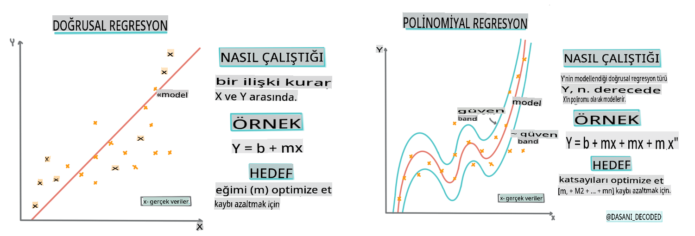
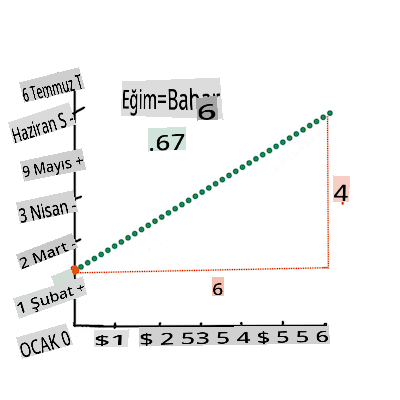
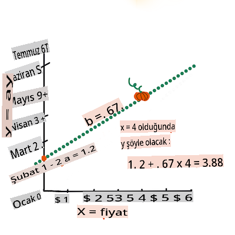

# Scikit-learn kullanarak bir regresyon modeli oluşturun: dört farklı regresyon yöntemi


> İnfografik [Dasani Madipalli](https://twitter.com/dasani_decoded) tarafından
## [Ders öncesi sınav](https://gray-sand-07a10f403.1.azurestaticapps.net/quiz/13/)

> ### [Bu ders R dilinde de mevcut!](../../../../2-Regression/3-Linear/solution/R/lesson_3.html)
### Giriş 

Şu ana kadar, bu derste kullanacağımız kabak fiyatlandırma veri setinden toplanan örnek verilerle regresyonun ne olduğunu keşfettiniz. Ayrıca Matplotlib kullanarak bu veriyi görselleştirdiniz.

Şimdi, ML için regresyonun derinliklerine dalmaya hazırsınız. Görselleştirme, veriyi anlamlandırmanıza yardımcı olurken, Makine Öğreniminin gerçek gücü _modellerin eğitilmesinden_ gelir. Modeller, tarihi veriler üzerinde eğitilir ve veri bağımlılıklarını otomatik olarak yakalar, böylece modelin daha önce görmediği yeni veriler için sonuçları tahmin etmenizi sağlar.

Bu derste, _temel doğrusal regresyon_ ve _polinomial regresyon_ olmak üzere iki tür regresyon hakkında daha fazla bilgi edineceksiniz ve bu tekniklerin altında yatan bazı matematiksel temelleri öğreneceksiniz. Bu modeller, farklı girdi verilerine bağlı olarak kabak fiyatlarını tahmin etmemize olanak tanıyacak.

[](https://youtu.be/CRxFT8oTDMg "Yeni başlayanlar için ML - Doğrusal Regresyonu Anlamak")

> 🎥 Doğrusal regresyon hakkında kısa bir video özet için yukarıdaki resme tıklayın.

> Bu müfredat boyunca, matematik bilgisi minimum düzeyde varsayılmakta ve diğer alanlardan gelen öğrenciler için erişilebilir hale getirilmek istenmektedir, bu yüzden notlar, 🧮 çağrılar, diyagramlar ve diğer öğrenme araçlarına dikkat edin.

### Önkoşul

Şu ana kadar incelediğimiz kabak verisinin yapısına aşina olmalısınız. Bu dersin _notebook.ipynb_ dosyasında önceden yüklenmiş ve temizlenmiş olarak bulabilirsiniz. Dosyada, kabak fiyatı yeni bir veri çerçevesinde bushel başına gösterilmektedir. Bu not defterlerini Visual Studio Code'daki çekirdeklerde çalıştırabildiğinizden emin olun.

### Hazırlık

Hatırlatma olarak, bu veriyi sorular sormak için yüklüyorsunuz.

- Kabak almak için en iyi zaman ne zaman?
- Mini kabakların bir kutusunun fiyatı ne olabilir?
- Yarım bushel sepetlerde mi yoksa 1 1/9 bushel kutularda mı almalıyım?
Bu veriyi incelemeye devam edelim.

Önceki derste, bir Pandas veri çerçevesi oluşturup, orijinal veri setinin bir kısmıyla doldurmuştunuz, bushel başına fiyatlandırmayı standartlaştırmıştınız. Ancak, bunu yaparak sadece yaklaşık 400 veri noktası toplayabildiniz ve sadece sonbahar ayları için.

Bu dersin eşlik eden not defterinde önceden yüklenmiş verilere bir göz atın. Veriler önceden yüklenmiş ve ay verilerini göstermek için başlangıçta bir saçılma grafiği çizilmiştir. Belki verinin doğası hakkında daha fazla ayrıntı elde edebiliriz, daha fazla temizleyerek.

## Doğrusal regresyon çizgisi

1. Derste öğrendiğiniz gibi, bir doğrusal regresyon egzersizinin amacı, bir çizgi çizerek:

- **Değişken ilişkilerini gösterin**. Değişkenler arasındaki ilişkiyi gösterin.
- **Tahminler yapın**. Yeni bir veri noktasının bu çizgiye göre nereye düşeceğini doğru bir şekilde tahmin edin.

Bu tür bir çizgi çizmek için **En Küçük Kareler Regresyonu** tipiktir. 'En küçük kareler' terimi, regresyon çizgisinin etrafındaki tüm veri noktalarının karelerinin alınıp toplanması anlamına gelir. İdealde, bu nihai toplam mümkün olduğunca küçük olmalıdır, çünkü düşük hata sayısı veya `least-squares` istiyoruz.

Bunu yaparız çünkü tüm veri noktalarımızdan en az toplam mesafeye sahip bir çizgi modellemek istiyoruz. Ayrıca terimleri toplarken karelerini alırız çünkü yönünden ziyade büyüklüğü ile ilgileniriz.

> **🧮 Bana matematiği göster**
>
> Bu çizgi, _en iyi uyum çizgisi_ olarak adlandırılır ve [bir denklemle](https://en.wikipedia.org/wiki/Simple_linear_regression) ifade edilebilir:
>
> ```
> Y = a + bX
> ```
>
> `X` is the 'explanatory variable'. `Y` is the 'dependent variable'. The slope of the line is `b` and `a` is the y-intercept, which refers to the value of `Y` when `X = 0`. 
>
>
>
> First, calculate the slope `b`. Infographic by [Jen Looper](https://twitter.com/jenlooper)
>
> In other words, and referring to our pumpkin data's original question: "predict the price of a pumpkin per bushel by month", `X` would refer to the price and `Y` would refer to the month of sale. 
>
>
>
> Calculate the value of Y. If you're paying around $4, it must be April! Infographic by [Jen Looper](https://twitter.com/jenlooper)
>
> The math that calculates the line must demonstrate the slope of the line, which is also dependent on the intercept, or where `Y` is situated when `X = 0`.
>
> You can observe the method of calculation for these values on the [Math is Fun](https://www.mathsisfun.com/data/least-squares-regression.html) web site. Also visit [this Least-squares calculator](https://www.mathsisfun.com/data/least-squares-calculator.html) to watch how the numbers' values impact the line.

## Correlation

One more term to understand is the **Correlation Coefficient** between given X and Y variables. Using a scatterplot, you can quickly visualize this coefficient. A plot with datapoints scattered in a neat line have high correlation, but a plot with datapoints scattered everywhere between X and Y have a low correlation.

A good linear regression model will be one that has a high (nearer to 1 than 0) Correlation Coefficient using the Least-Squares Regression method with a line of regression.

✅ Run the notebook accompanying this lesson and look at the Month to Price scatterplot. Does the data associating Month to Price for pumpkin sales seem to have high or low correlation, according to your visual interpretation of the scatterplot? Does that change if you use more fine-grained measure instead of `Month`, eg. *day of the year* (i.e. number of days since the beginning of the year)?

In the code below, we will assume that we have cleaned up the data, and obtained a data frame called `new_pumpkins`, similar to the following:

ID | Month | DayOfYear | Variety | City | Package | Low Price | High Price | Price
---|-------|-----------|---------|------|---------|-----------|------------|-------
70 | 9 | 267 | PIE TYPE | BALTIMORE | 1 1/9 bushel cartons | 15.0 | 15.0 | 13.636364
71 | 9 | 267 | PIE TYPE | BALTIMORE | 1 1/9 bushel cartons | 18.0 | 18.0 | 16.363636
72 | 10 | 274 | PIE TYPE | BALTIMORE | 1 1/9 bushel cartons | 18.0 | 18.0 | 16.363636
73 | 10 | 274 | PIE TYPE | BALTIMORE | 1 1/9 bushel cartons | 17.0 | 17.0 | 15.454545
74 | 10 | 281 | PIE TYPE | BALTIMORE | 1 1/9 bushel cartons | 15.0 | 15.0 | 13.636364

> The code to clean the data is available in [`notebook.ipynb`](../../../../2-Regression/3-Linear/notebook.ipynb). We have performed the same cleaning steps as in the previous lesson, and have calculated `DayOfYear` sütununu aşağıdaki ifade kullanarak hesaplayın:

```python
day_of_year = pd.to_datetime(pumpkins['Date']).apply(lambda dt: (dt-datetime(dt.year,1,1)).days)
```

Şimdi doğrusal regresyonun ardındaki matematiği anladığınıza göre, hangi kabak paketinin en iyi fiyatlara sahip olacağını tahmin edip edemeyeceğimizi görmek için bir Regresyon modeli oluşturalım. Tatil kabak bahçesi için kabak satın alan biri, bahçe için kabak paketlerini optimize edebilmek için bu bilgiye sahip olmak isteyebilir.

## Korelasyon Arayışı

[](https://youtu.be/uoRq-lW2eQo "Yeni başlayanlar için ML - Korelasyon Arayışı: Doğrusal Regresyonun Anahtarı")

> 🎥 Korelasyon hakkında kısa bir video özet için yukarıdaki resme tıklayın.

Önceki dersten, farklı aylar için ortalama fiyatın şu şekilde göründüğünü muhtemelen görmüşsünüzdür:


Bu, bazı korelasyonlar olması gerektiğini ve `Month` and `Price`, or between `DayOfYear` and `Price`. Here is the scatter plot that shows the latter relationship:

 

Let's see if there is a correlation using the `corr` fonksiyonunu kullanarak lineer regresyon modeli eğitmeye çalışabileceğimizi gösteriyor:

```python
print(new_pumpkins['Month'].corr(new_pumpkins['Price']))
print(new_pumpkins['DayOfYear'].corr(new_pumpkins['Price']))
```

Görünüşe göre korelasyon oldukça küçük, `-0.15` `Month` and -0.17 by the `DayOfMonth`, but there could be another important relationship. It looks like there are different clusters of prices corresponding to different pumpkin varieties. To confirm this hypothesis, let's plot each pumpkin category using a different color. By passing an `ax` parameter to the `scatter` çizim fonksiyonunu kullanarak tüm noktaları aynı grafikte çizebiliriz:

```python
ax=None
colors = ['red','blue','green','yellow']
for i,var in enumerate(new_pumpkins['Variety'].unique()):
    df = new_pumpkins[new_pumpkins['Variety']==var]
    ax = df.plot.scatter('DayOfYear','Price',ax=ax,c=colors[i],label=var)
```


Araştırmamız, çeşidin genel fiyat üzerinde satış tarihinden daha fazla etkisi olduğunu öne sürüyor. Bunu bir çubuk grafikle görebiliriz:

```python
new_pumpkins.groupby('Variety')['Price'].mean().plot(kind='bar')
```


Şu an için sadece bir kabak çeşidine, 'turta tipi'ne odaklanalım ve tarihin fiyat üzerindeki etkisini görelim:

```python
pie_pumpkins = new_pumpkins[new_pumpkins['Variety']=='PIE TYPE']
pie_pumpkins.plot.scatter('DayOfYear','Price') 
```


Şimdi `Price` and `DayOfYear` using `corr` function, we will get something like `-0.27` arasındaki korelasyonu hesaplasak, bu da tahmin edici bir model eğitmenin mantıklı olduğunu gösterir.

> Doğrusal regresyon modeli eğitmeden önce, verimizin temiz olduğundan emin olmak önemlidir. Doğrusal regresyon eksik değerlerle iyi çalışmaz, bu yüzden tüm boş hücrelerden kurtulmak mantıklıdır:

```python
pie_pumpkins.dropna(inplace=True)
pie_pumpkins.info()
```

Başka bir yaklaşım, bu boş değerleri ilgili sütunun ortalama değerleriyle doldurmak olabilir.

## Basit Doğrusal Regresyon

[](https://youtu.be/e4c_UP2fSjg "Yeni başlayanlar için ML - Scikit-learn kullanarak Doğrusal ve Polinomial Regresyon")

> 🎥 Doğrusal ve polinomial regresyon hakkında kısa bir video özet için yukarıdaki resme tıklayın.

Doğrusal Regresyon modelimizi eğitmek için **Scikit-learn** kütüphanesini kullanacağız.

```python
from sklearn.linear_model import LinearRegression
from sklearn.metrics import mean_squared_error
from sklearn.model_selection import train_test_split
```

Başlangıçta, giriş değerlerini (özellikler) ve beklenen çıktıyı (etiket) ayrı numpy dizilerine ayırıyoruz:

```python
X = pie_pumpkins['DayOfYear'].to_numpy().reshape(-1,1)
y = pie_pumpkins['Price']
```

> Giriş verisi üzerinde `reshape` işlemi yapmamız gerektiğini unutmayın, çünkü Doğrusal Regresyon paketi bunu doğru anlamalıdır. Doğrusal Regresyon, her satırın bir giriş özellikleri vektörüne karşılık geldiği 2D bir dizi bekler. Bizim durumumuzda, sadece bir giriş olduğundan, N×1 şeklinde bir diziye ihtiyacımız var, burada N veri setinin boyutudur.

Daha sonra, veriyi eğitim ve test veri setlerine ayırmamız gerekiyor, böylece modeli eğittikten sonra doğrulayabiliriz:

```python
X_train, X_test, y_train, y_test = train_test_split(X, y, test_size=0.2, random_state=0)
```

Son olarak, gerçek Doğrusal Regresyon modelini eğitmek sadece iki satır kod alır. `LinearRegression` object, and fit it to our data using the `fit` yöntemini tanımlarız:

```python
lin_reg = LinearRegression()
lin_reg.fit(X_train,y_train)
```

`LinearRegression` object after `fit`-ting contains all the coefficients of the regression, which can be accessed using `.coef_` property. In our case, there is just one coefficient, which should be around `-0.017`. It means that prices seem to drop a bit with time, but not too much, around 2 cents per day. We can also access the intersection point of the regression with Y-axis using `lin_reg.intercept_` - it will be around `21` bizim durumumuzda, yılın başındaki fiyatı gösterir.

Modelimizin ne kadar doğru olduğunu görmek için, test veri setinde fiyatları tahmin edebilir ve ardından tahminlerimizin beklenen değerlere ne kadar yakın olduğunu ölçebiliriz. Bu, beklenen ve tahmin edilen değerler arasındaki tüm kare farklarının ortalaması olan ortalama kare hata (MSE) metrikleri kullanılarak yapılabilir.

```python
pred = lin_reg.predict(X_test)

mse = np.sqrt(mean_squared_error(y_test,pred))
print(f'Mean error: {mse:3.3} ({mse/np.mean(pred)*100:3.3}%)')
```

Hatalarımız yaklaşık 2 puan gibi görünüyor, bu da ~%17. Çok iyi değil. Model kalitesinin başka bir göstergesi **belirleme katsayısı**dır ve şu şekilde elde edilebilir:

```python
score = lin_reg.score(X_train,y_train)
print('Model determination: ', score)
```
Değer 0 ise, modelin girdi verilerini dikkate almadığı ve *en kötü doğrusal tahminci* olarak davrandığı anlamına gelir, bu da basitçe sonucun ortalama değeridir. Değer 1 ise, tüm beklenen çıktıları mükemmel bir şekilde tahmin edebildiğimiz anlamına gelir. Bizim durumumuzda, katsayı yaklaşık 0.06, bu oldukça düşük.

Ayrıca test verilerini regresyon çizgisi ile birlikte çizerek, regresyonun bizim durumumuzda nasıl çalıştığını daha iyi görebiliriz:

```python
plt.scatter(X_test,y_test)
plt.plot(X_test,pred)
```


## Polinomial Regresyon

Doğrusal Regresyonun başka bir türü Polinomial Regresyondur. Bazen değişkenler arasında doğrusal bir ilişki vardır - kabak hacmi büyüdükçe fiyat artar - bazen bu ilişkiler bir düzlem veya düz bir çizgi olarak çizilemez.

✅ İşte [bazı örnekler](https://online.stat.psu.edu/stat501/lesson/9/9.8) Polinomial Regresyonun kullanılabileceği veriler

Tarih ve Fiyat arasındaki ilişkiye bir kez daha bakın. Bu saçılma grafiği mutlaka düz bir çizgi ile analiz edilmeli mi? Fiyatlar dalgalanamaz mı? Bu durumda, polinomial regresyonu deneyebilirsiniz.

✅ Polinomlar, bir veya daha fazla değişken ve katsayıdan oluşan matematiksel ifadelerdir

Polinomial regresyon, doğrusal olmayan veriyi daha iyi uyacak şekilde eğri bir çizgi oluşturur. Bizim durumumuzda, girdi verisine kare `DayOfYear` değişkenini eklersek, verimizi yıl içinde belirli bir noktada minimuma sahip olacak parabolik bir eğri ile uyarlayabiliriz.

Scikit-learn, veri işleme adımlarını bir araya getirmek için kullanışlı bir [pipeline API](https://scikit-learn.org/stable/modules/generated/sklearn.pipeline.make_pipeline.html?highlight=pipeline#sklearn.pipeline.make_pipeline) içerir. Bir **pipeline**, bir **estimators** zinciridir. Bizim durumumuzda, modelimize önce polinomial özellikler ekleyen ve ardından regresyonu eğiten bir pipeline oluşturacağız:

```python
from sklearn.preprocessing import PolynomialFeatures
from sklearn.pipeline import make_pipeline

pipeline = make_pipeline(PolynomialFeatures(2), LinearRegression())

pipeline.fit(X_train,y_train)
```

`PolynomialFeatures(2)` means that we will include all second-degree polynomials from the input data. In our case it will just mean `DayOfYear`<sup>2</sup>, but given two input variables X and Y, this will add X<sup>2</sup>, XY and Y<sup>2</sup>. We may also use higher degree polynomials if we want.

Pipelines can be used in the same manner as the original `LinearRegression` object, i.e. we can `fit` the pipeline, and then use `predict` to get the prediction results. Here is the graph showing test data, and the approximation curve:


Using Polynomial Regression, we can get slightly lower MSE and higher determination, but not significantly. We need to take into account other features!

> You can see that the minimal pumpkin prices are observed somewhere around Halloween. How can you explain this? 

🎃 Congratulations, you just created a model that can help predict the price of pie pumpkins. You can probably repeat the same procedure for all pumpkin types, but that would be tedious. Let's learn now how to take pumpkin variety into account in our model!

## Categorical Features

In the ideal world, we want to be able to predict prices for different pumpkin varieties using the same model. However, the `Variety` column is somewhat different from columns like `Month`, because it contains non-numeric values. Such columns are called **categorical**.

[](https://youtu.be/DYGliioIAE0 "ML for beginners - Categorical Feature Predictions with Linear Regression")

> 🎥 Click the image above for a short video overview of using categorical features.

Here you can see how average price depends on variety:


To take variety into account, we first need to convert it to numeric form, or **encode** it. There are several way we can do it:

* Simple **numeric encoding** will build a table of different varieties, and then replace the variety name by an index in that table. This is not the best idea for linear regression, because linear regression takes the actual numeric value of the index, and adds it to the result, multiplying by some coefficient. In our case, the relationship between the index number and the price is clearly non-linear, even if we make sure that indices are ordered in some specific way.
* **One-hot encoding** will replace the `Variety` column by 4 different columns, one for each variety. Each column will contain `1` if the corresponding row is of a given variety, and `0` aksi halde. Bu, doğrusal regresyonda dört katsayı olacağı anlamına gelir, her biri belirli bir kabak çeşidi için "başlangıç fiyatından" (veya "ek fiyat") sorumlu olacaktır.

Aşağıdaki kod, bir çeşidi nasıl tek sıcak kodlayabileceğimizi gösterir:

```python
pd.get_dummies(new_pumpkins['Variety'])
```

 ID | FAIRYTALE | MINIATURE | MIXED HEIRLOOM VARIETIES | PIE TYPE
----|-----------|-----------|--------------------------|----------
70 | 0 | 0 | 0 | 1
71 | 0 | 0 | 0 | 1
... | ... | ... | ... | ...
1738 | 0 | 1 | 0 | 0
1739 | 0 | 1 | 0 | 0
1740 | 0 | 1 | 0 | 0
1741 | 0 | 1 | 0 | 0
1742 | 0 | 1 | 0 | 0

Tek sıcak kodlanmış çeşidi giriş olarak kullanarak doğrusal regresyon eğitmek için, sadece `X` and `y` verisini doğru şekilde başlatmamız yeterlidir:

```python
X = pd.get_dummies(new_pumpkins['Variety'])
y = new_pumpkins['Price']
```

Kodun geri kalanı, Doğrusal Regresyon eğitmek için yukarıda kullandığımızla aynıdır. Dener iseniz, ortalama kare hatanın yaklaşık aynı olduğunu, ancak belirleme katsayısının (~%77) çok daha yüksek olduğunu göreceksiniz. Daha doğru tahminler elde etmek için, daha fazla kategorik özelliği, ayrıca `Month` or `DayOfYear`. To get one large array of features, we can use `join` gibi sayısal özellikleri de dikkate alabiliriz:

```python
X = pd.get_dummies(new_pumpkins['Variety']) \
        .join(new_pumpkins['Month']) \
        .join(pd.get_dummies(new_pumpkins['City'])) \
        .join(pd.get_dummies(new_pumpkins['Package']))
y = new_pumpkins['Price']
```

Burada ayrıca `City` and `Package` türünü de dikkate alıyoruz, bu bize MSE 2.84 (%10) ve belirleme 0.94 verir!

## Hepsini bir araya getirmek

En iyi modeli oluşturmak için, yukarıdaki örnekten birleştirilmiş (tek sıcak kodlanmış kategorik + sayısal) veriyi Polinomial Regresyon ile birlikte kullanabiliriz. İşte kolaylık sağlamak için tam kod:

```python
# set up training data
X = pd.get_dummies(new_pumpkins['Variety']) \
        .join(new_pumpkins['Month']) \
        .join(pd.get_dummies(new_pumpkins['City'])) \
        .join(pd.get_dummies(new_pumpkins['Package']))
y = new_pumpkins['Price']

# make train-test split
X_train, X_test, y_train, y_test = train_test_split(X, y, test_size=0.2, random_state=0)

# setup and train the pipeline
pipeline = make_pipeline(PolynomialFeatures(2), LinearRegression())
pipeline.fit(X_train,y_train)

# predict results for test data
pred = pipeline.predict(X_test)

# calculate MSE and determination
mse = np.sqrt(mean_squared_error(y_test,pred))
print(f'Mean error: {mse:3.3} ({mse/np.mean(pred)*100:3.3}%)')

score = pipeline.score(X_train,y_train)
print('Model determination: ', score)
```

Bu, yaklaşık %97'lik en iyi belirleme katsayısını ve MSE=2.23 (~%8 tahmin hatası) vermelidir.

| Model | MSE | Belirleme |
|-------|-----|-----------|
| `DayOfYear` Linear | 2.77 (17.2%) | 0.07 |
| `DayOfYear` Polynomial | 2.73 (17.0%) | 0.08 |
| `Variety` Doğrusal | 5.24 (%19.7) | 0.77 |
| Tüm özellikler Doğrusal | 2.84 (%10.5) | 0.94 |
| Tüm özellikler Polinomial | 2.23 (%8.25) | 0.97 |

🏆 Tebrikler! Bir derste dört Regresyon modeli oluşturdunuz ve model kalitesini %97'ye çıkardınız. Regresyon üzerine son bölümde, kategorileri belirlemek için Lojistik Regresyon hakkında bilgi edineceksiniz.

---
## 🚀Meydan Okuma

Bu not defterinde birkaç farklı değişkeni test edin ve korelasyonun model doğruluğuyla nasıl ilişkili olduğunu görün.

## [Ders sonrası sınav](https://gray-sand-07a10f403.1.azurestaticapps.net/quiz/14/)

## Gözden Geçirme ve Kendi Kendine Çalışma

Bu derste Doğrusal Regresyon hakkında bilgi edindik. Diğer önemli Regresyon türleri de vardır. Adım adım, Ridge, Lasso ve Elasticnet teknikleri hakkında bilgi edinin. Daha fazla bilgi edinmek için iyi bir kurs [Stanford Statistical Learning course](https://online.stanford.edu/courses/sohs-ystatslearning-statistical-learning).

## Ödev 

[Bir Model Oluşturun](assignment.md)

**Feragatname**:
Bu belge, makine tabanlı yapay zeka çeviri hizmetleri kullanılarak çevrilmiştir. Doğruluğu sağlamak için çaba sarf etsek de, otomatik çevirilerin hata veya yanlışlıklar içerebileceğini lütfen unutmayın. Belgenin orijinal dili, yetkili kaynak olarak kabul edilmelidir. Kritik bilgiler için profesyonel insan çevirisi önerilir. Bu çevirinin kullanımından doğabilecek yanlış anlamalar veya yanlış yorumlamalardan sorumlu değiliz.