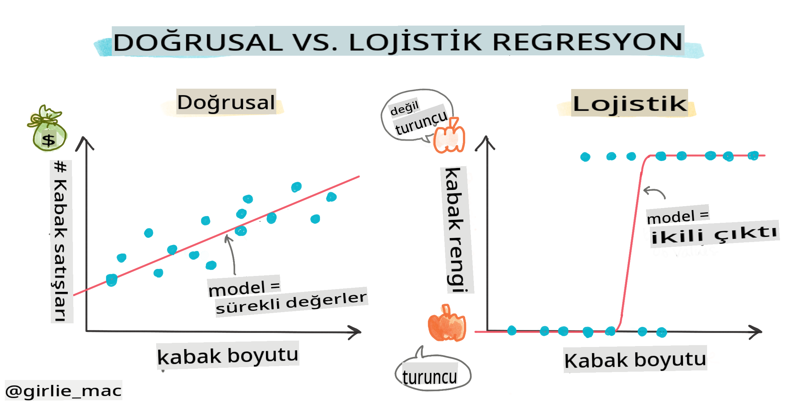
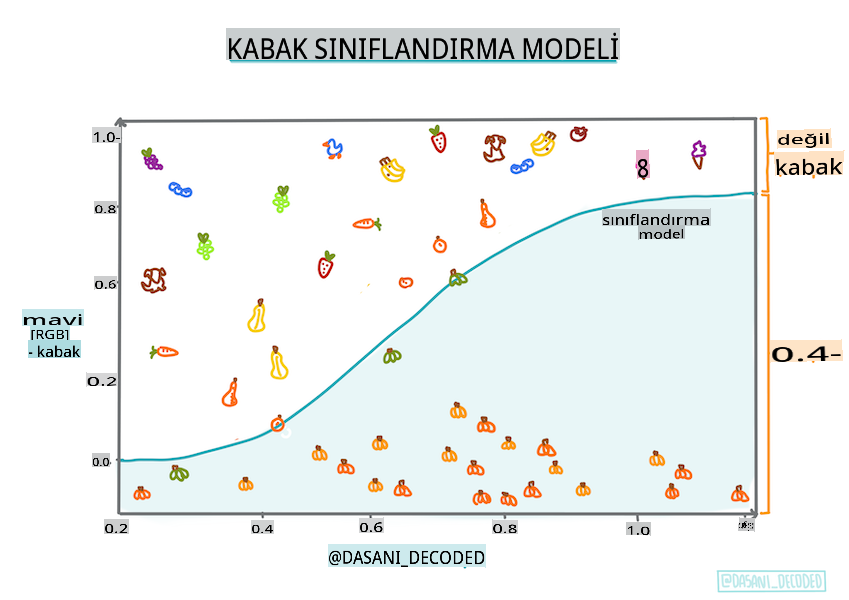
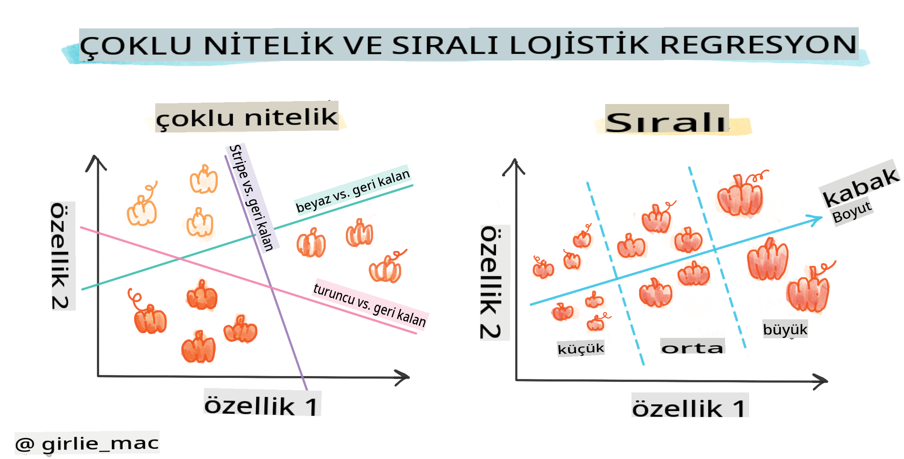
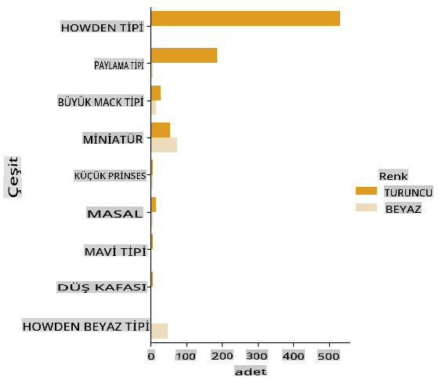

# Kategorileri Tahmin Etmek İçin Lojistik Regresyon



## [Ders Öncesi Test](https://gray-sand-07a10f403.1.azurestaticapps.net/quiz/15/)

> ### [Bu ders R dilinde mevcut!](../../../../2-Regression/4-Logistic/solution/R/lesson_4.html)

## Giriş

Regresyon üzerine olan bu son derste, temel _klasik_ ML tekniklerinden biri olan Lojistik Regresyonu inceleyeceğiz. Bu tekniği, ikili kategorileri tahmin etmek için desenleri keşfetmek amacıyla kullanabilirsiniz. Bu şeker çikolata mı yoksa değil mi? Bu hastalık bulaşıcı mı değil mi? Bu müşteri bu ürünü seçecek mi yoksa seçmeyecek mi?

Bu derste öğrenecekleriniz:

- Veri görselleştirme için yeni bir kütüphane
- Lojistik regresyon teknikleri

✅ Bu tür bir regresyonla çalışma konusundaki anlayışınızı derinleştirmek için bu [Öğrenme modülüne](https://docs.microsoft.com/learn/modules/train-evaluate-classification-models?WT.mc_id=academic-77952-leestott) göz atın

## Ön Koşul

Balkabağı verileriyle çalıştıktan sonra, üzerinde çalışabileceğimiz bir ikili kategori olduğunu fark edecek kadar bu veriye aşina olduk: `Color`.

Hadi bazı değişkenlere dayanarak _belirli bir balkabağının renginin ne olacağını_ (turuncu 🎃 veya beyaz 👻) tahmin etmek için bir lojistik regresyon modeli oluşturalım.

> Neden regresyonla ilgili bir derste ikili sınıflandırmadan bahsediyoruz? Sadece dilsel kolaylık için, çünkü lojistik regresyon [aslında bir sınıflandırma yöntemidir](https://scikit-learn.org/stable/modules/linear_model.html#logistic-regression), ancak doğrusal tabanlıdır. Verileri sınıflandırmanın diğer yollarını bir sonraki ders grubunda öğrenin.

## Soruyu Tanımlayın

Bizim amacımız için bunu ikili olarak ifade edeceğiz: 'Beyaz' veya 'Beyaz Değil'. Veritabanımızda ayrıca 'çizgili' kategorisi de var ama çok az örneği olduğu için bunu kullanmayacağız. Zaten veritabanından boş değerleri kaldırdığımızda bu kategori de kayboluyor.

> 🎃 Eğlenceli bilgi, bazen beyaz balkabaklarına 'hayalet' balkabakları deriz. Oyulması çok kolay değildir, bu yüzden turuncu olanlar kadar popüler değillerdir ama havalı görünürler! Bu yüzden sorumuzu şu şekilde de yeniden formüle edebiliriz: 'Hayalet' veya 'Hayalet Değil'. 👻

## Lojistik regresyon hakkında

Lojistik regresyon, daha önce öğrendiğiniz doğrusal regresyondan birkaç önemli şekilde farklıdır.

[](https://youtu.be/KpeCT6nEpBY "Başlangıç seviyesinde ML - Makine Öğrenimi Sınıflandırması için Lojistik Regresyonu Anlamak")

> 🎥 Lojistik regresyon hakkında kısa bir genel bakış için yukarıdaki resme tıklayın.

### İkili sınıflandırma

Lojistik regresyon, doğrusal regresyonla aynı özellikleri sunmaz. İlki, bir ikili kategori hakkında bir tahmin sunar ("beyaz veya beyaz değil"), ikincisi ise sürekli değerleri tahmin edebilir, örneğin bir balkabağının kökeni ve hasat zamanı verildiğinde, _fiyatının ne kadar artacağını_.


> İnfografik [Dasani Madipalli](https://twitter.com/dasani_decoded) tarafından

### Diğer sınıflandırmalar

Lojistik regresyonun başka türleri de vardır, bunlar arasında çoklu ve sıralı:

- **Çoklu**, birden fazla kategoriye sahip olmak anlamına gelir - "Turuncu, Beyaz ve Çizgili".
- **Sıralı**, sıralı kategorileri içerir, sonuçlarımızı mantıksal olarak sıralamak istediğimizde kullanışlıdır, örneğin sınırlı sayıda boyuta göre sıralanan balkabaklarımız (mini, küçük, orta, büyük, çok büyük, devasa).



### Değişkenlerin KORELASYONLU OLMASINA GEREK YOK

Doğrusal regresyonun daha fazla korelasyonlu değişkenlerle daha iyi çalıştığını hatırlıyor musunuz? Lojistik regresyon bunun tersidir - değişkenlerin uyumlu olmasına gerek yoktur. Bu, zayıf korelasyonlara sahip bu veri için işe yarar.

### Çok temiz verilere ihtiyacınız var

Lojistik regresyon, daha fazla veri kullanırsanız daha doğru sonuçlar verir; küçük veri setimiz bu görev için optimal değildir, bu yüzden bunu aklınızda bulundurun.

[](https://youtu.be/B2X4H9vcXTs "Başlangıç seviyesinde ML - Lojistik Regresyon için Veri Analizi ve Hazırlığı")

> 🎥 Doğrusal regresyon için veri hazırlığı hakkında kısa bir genel bakış için yukarıdaki resme tıklayın

✅ Lojistik regresyona iyi uyum sağlayacak veri türlerini düşünün

## Alıştırma - veriyi düzenleme

Öncelikle, verileri biraz temizleyin, boş değerleri kaldırın ve sadece bazı sütunları seçin:

1. Aşağıdaki kodu ekleyin:

    ```python
  
    columns_to_select = ['City Name','Package','Variety', 'Origin','Item Size', 'Color']
    pumpkins = full_pumpkins.loc[:, columns_to_select]

    pumpkins.dropna(inplace=True)
    ```

    Yeni veri çerçevenize bir göz atabilirsiniz:

    ```python
    pumpkins.info
    ```

### Görselleştirme - kategorik grafik

Şimdiye kadar [başlangıç not defterini](../../../../2-Regression/4-Logistic/notebook.ipynb) balkabağı verileriyle tekrar yüklediniz ve `Color` içeren birkaç değişkeni koruyarak temizlediniz. Veri çerçevesini farklı bir kütüphane kullanarak not defterinde görselleştirelim: [Seaborn](https://seaborn.pydata.org/index.html), daha önce kullandığımız Matplotlib üzerine kurulmuştur.

Seaborn, verilerinizi görselleştirmenin bazı güzel yollarını sunar. Örneğin, `Variety` ve `Color` verilerinin dağılımlarını kategorik bir grafikte karşılaştırabilirsiniz.

1. `catplot` function, using our pumpkin data `pumpkins` kullanarak ve her balkabağı kategorisi (turuncu veya beyaz) için bir renk eşlemesi belirterek böyle bir grafik oluşturun:

    ```python
    import seaborn as sns
    
    palette = {
    'ORANGE': 'orange',
    'WHITE': 'wheat',
    }

    sns.catplot(
    data=pumpkins, y="Variety", hue="Color", kind="count",
    palette=palette, 
    )
    ```

    

    Verileri gözlemleyerek, Renk verisinin Çeşitlilik ile nasıl ilişkili olduğunu görebilirsiniz.

    ✅ Bu kategorik grafiğe bakarak, hangi ilginç keşifleri hayal edebilirsiniz?

### Veri ön işleme: özellik ve etiket kodlama
Balkabağı veri setimiz tüm sütunları için string değerler içerir. Kategorik verilerle çalışmak insanlar için sezgiseldir ancak makineler için değil. Makine öğrenimi algoritmaları sayılarla iyi çalışır. Bu yüzden kodlama, veri ön işleme aşamasında çok önemli bir adımdır, çünkü kategorik verileri sayısal verilere dönüştürmemizi sağlar, herhangi bir bilgi kaybetmeden. İyi bir kodlama, iyi bir model oluşturmayı sağlar.

Özellik kodlama için iki ana tür kodlayıcı vardır:

1. Sıralı kodlayıcı: sıralı değişkenler için uygundur, bunlar kategorik değişkenlerdir ve verileri mantıksal bir sıralama izler, veri setimizdeki `Item Size` sütunu gibi. Her kategori bir sayı ile temsil edilir, bu da sütundaki kategorinin sırası olur.

    ```python
    from sklearn.preprocessing import OrdinalEncoder

    item_size_categories = [['sml', 'med', 'med-lge', 'lge', 'xlge', 'jbo', 'exjbo']]
    ordinal_features = ['Item Size']
    ordinal_encoder = OrdinalEncoder(categories=item_size_categories)
    ```

2. Kategorik kodlayıcı: nominal değişkenler için uygundur, bunlar kategorik değişkenlerdir ve verileri mantıksal bir sıralama izlemez, veri setimizdeki `Item Size` dışındaki tüm özellikler gibi. Bu bir one-hot kodlamadır, yani her kategori bir ikili sütunla temsil edilir: kodlanmış değişken, balkabağı o Çeşitliliğe aitse 1, değilse 0 olur.

    ```python
    from sklearn.preprocessing import OneHotEncoder

    categorical_features = ['City Name', 'Package', 'Variety', 'Origin']
    categorical_encoder = OneHotEncoder(sparse_output=False)
    ```
Sonra, `ColumnTransformer` birden fazla kodlayıcıyı tek bir adımda birleştirmek ve uygun sütunlara uygulamak için kullanılır.

```python
    from sklearn.compose import ColumnTransformer
    
    ct = ColumnTransformer(transformers=[
        ('ord', ordinal_encoder, ordinal_features),
        ('cat', categorical_encoder, categorical_features)
        ])
    
    ct.set_output(transform='pandas')
    encoded_features = ct.fit_transform(pumpkins)
```
Öte yandan, etiketi kodlamak için, scikit-learn `LabelEncoder` sınıfını kullanırız, bu sınıf etiketleri normalize etmeye yardımcı olan bir yardımcı sınıftır, böylece yalnızca 0 ve n_classes-1 (burada, 0 ve 1) arasında değerler içerir.

```python
    from sklearn.preprocessing import LabelEncoder

    label_encoder = LabelEncoder()
    encoded_label = label_encoder.fit_transform(pumpkins['Color'])
```
Özellikleri ve etiketi kodladıktan sonra, bunları yeni bir veri çerçevesi `encoded_pumpkins` içinde birleştirebiliriz.

```python
    encoded_pumpkins = encoded_features.assign(Color=encoded_label)
```
✅ `Item Size` column?

### Analyse relationships between variables

Now that we have pre-processed our data, we can analyse the relationships between the features and the label to grasp an idea of how well the model will be able to predict the label given the features.
The best way to perform this kind of analysis is plotting the data. We'll be using again the Seaborn `catplot` function, to visualize the relationships between `Item Size`,  `Variety` ve `Color` bir kategorik grafikte kodlamak için sıralı kodlayıcı kullanmanın avantajları nelerdir? Verileri daha iyi görselleştirmek için kodlanmış `Item Size` column and the unencoded `Variety` sütununu kullanacağız.

```python
    palette = {
    'ORANGE': 'orange',
    'WHITE': 'wheat',
    }
    pumpkins['Item Size'] = encoded_pumpkins['ord__Item Size']

    g = sns.catplot(
        data=pumpkins,
        x="Item Size", y="Color", row='Variety',
        kind="box", orient="h",
        sharex=False, margin_titles=True,
        height=1.8, aspect=4, palette=palette,
    )
    g.set(xlabel="Item Size", ylabel="").set(xlim=(0,6))
    g.set_titles(row_template="{row_name}")
```


### Bir 'swarm' grafiği kullanın

Renk bir ikili kategori olduğundan (Beyaz veya Değil), görselleştirme için 'özelleşmiş bir yaklaşıma' ihtiyaç duyar. Bu kategorinin diğer değişkenlerle ilişkisini görselleştirmenin başka yolları da vardır.

Seaborn grafikleri ile değişkenleri yan yana görselleştirebilirsiniz.

1. Değerlerin dağılımını göstermek için bir 'swarm' grafiği deneyin:

    ```python
    palette = {
    0: 'orange',
    1: 'wheat'
    }
    sns.swarmplot(x="Color", y="ord__Item Size", data=encoded_pumpkins, palette=palette)
    ```

    

**Dikkat**: Yukarıdaki kod bir uyarı oluşturabilir, çünkü seaborn bu kadar çok veri noktasını bir swarm grafiğinde temsil edemez. Olası bir çözüm, işaretçi boyutunu küçültmektir, 'size' parametresini kullanarak. Ancak, bunun grafiğin okunabilirliğini etkilediğini unutmayın.

> **🧮 Matematiği Göster**
>
> Lojistik regresyon, [sigmoid fonksiyonları](https://wikipedia.org/wiki/Sigmoid_function) kullanarak 'maksimum olasılık' kavramına dayanır. Bir 'Sigmoid Fonksiyonu' bir grafikte 'S' şekline benzer. Bir değeri alır ve 0 ile 1 arasında bir yere haritalar. Eğrisi ayrıca 'lojistik eğri' olarak da adlandırılır. Formülü şu şekildedir:
>
> 
>
> burada sigmoid'in orta noktası x'in 0 noktasında bulunur, L eğrinin maksimum değeridir ve k eğrinin dikliğidir. Fonksiyonun sonucu 0.5'ten büyükse, ilgili etiket ikili seçimin '1' sınıfına atanır. Değilse, '0' olarak sınıflandırılır.

## Modelinizi oluşturun

Bu ikili sınıflandırmaları bulmak için bir model oluşturmak Scikit-learn'de şaşırtıcı derecede basittir.

[](https://youtu.be/MmZS2otPrQ8 "Başlangıç seviyesinde ML - Verilerin sınıflandırması için Lojistik Regresyon")

> 🎥 Doğrusal regresyon modeli oluşturma hakkında kısa bir genel bakış için yukarıdaki resme tıklayın

1. Sınıflandırma modelinizde kullanmak istediğiniz değişkenleri seçin ve `train_test_split()` çağırarak eğitim ve test setlerini ayırın:

    ```python
    from sklearn.model_selection import train_test_split
    
    X = encoded_pumpkins[encoded_pumpkins.columns.difference(['Color'])]
    y = encoded_pumpkins['Color']

    X_train, X_test, y_train, y_test = train_test_split(X, y, test_size=0.2, random_state=0)
    
    ```

2. Şimdi modelinizi, eğitim verilerinizle `fit()` çağırarak eğitebilir ve sonucunu yazdırabilirsiniz:

    ```python
    from sklearn.metrics import f1_score, classification_report 
    from sklearn.linear_model import LogisticRegression

    model = LogisticRegression()
    model.fit(X_train, y_train)
    predictions = model.predict(X_test)

    print(classification_report(y_test, predictions))
    print('Predicted labels: ', predictions)
    print('F1-score: ', f1_score(y_test, predictions))
    ```

    Modelinizin skor tablosuna bir göz atın. Yaklaşık 1000 satır veriniz olduğunu düşünürsek fena değil:

    ```output
                       precision    recall  f1-score   support
    
                    0       0.94      0.98      0.96       166
                    1       0.85      0.67      0.75        33
    
        accuracy                                0.92       199
        macro avg           0.89      0.82      0.85       199
        weighted avg        0.92      0.92      0.92       199
    
        Predicted labels:  [0 0 0 0 0 0 0 0 0 0 0 0 0 0 0 0 0 0 0 0 1 0 0 1 0 0 0 0 0 0 0 0 1 0 0 0 0
        0 0 0 0 0 1 0 1 0 0 1 0 0 0 0 0 1 0 1 0 1 0 1 0 0 0 0 0 0 0 0 0 0 0 0 0 0
        1 0 0 0 0 0 0 0 1 0 0 0 0 0 0 0 1 0 0 0 0 0 0 0 0 1 0 1 0 0 0 0 0 0 0 1 0
        0 0 0 0 0 0 0 0 0 0 0 0 0 0 0 0 0 0 0 0 0 1 0 0 0 0 0 0 0 0 1 0 0 0 1 1 0
        0 0 0 0 1 0 0 0 0 0 1 0 0 0 0 0 0 0 0 0 0 0 0 0 0 0 0 0 0 0 0 0 0 0 0 0 1
        0 0 0 1 0 0 0 0 0 0 0 0 1 1]
        F1-score:  0.7457627118644068
    ```

## Bir karışıklık matrisi ile daha iyi anlama

Yukarıda yazdırılan öğeleri kullanarak bir skor tablosu raporu [terimler](https://scikit-learn.org/stable/modules/generated/sklearn.metrics.classification_report.html?highlight=classification_report#sklearn.metrics.classification_report) alabilirsiniz, ancak modelinizi daha kolay anlayabilirsiniz [karışıklık matrisi](https://scikit-learn.org/stable/modules/model_evaluation.html#confusion-matrix) kullanarak modelin performansını anlamamıza yardımcı olabilir.

> 🎓 Bir '[karışıklık matrisi](https://wikipedia.org/wiki/Confusion_matrix)' (veya 'hata matrisi') modelinizin gerçek vs. yanlış pozitiflerini ve negatiflerini ifade eden bir tablodur, böylece tahminlerin doğruluğunu ölçer.

1. Bir karışıklık metriği kullanmak için `confusion_matrix()` çağırın:

    ```python
    from sklearn.metrics import confusion_matrix
    confusion_matrix(y_test, predictions)
    ```

    Modelinizin karışıklık matrisine bir göz atın:

    ```output
    array([[162,   4],
           [ 11,  22]])
    ```

Scikit-learn'de karışıklık matrisinin Satırları (eksen 0) gerçek etiketlerdir ve sütunlar (eksen 1) tahmin edilen etiketlerdir.

|       |   0   |   1   |
| :---: | :---: | :---: |
|   0   |  TN   |  FP   |
|   1   |  FN   |  TP   |

Burada ne oluyor? Diyelim ki modelimiz balkabaklarını iki ikili kategori arasında sınıflandırmakla görevlendirildi, kategori 'beyaz' ve kategori 'beyaz değil'.

- Modeliniz bir balkabağını beyaz değil olarak tahmin ederse ve gerçekte kategori 'beyaz değil' ise buna doğru negatif denir, üst sol numara ile gösterilir.
- Modeliniz bir balkabağını beyaz olarak tahmin ederse ve gerçekte kategori 'beyaz değil' ise buna yanlış negatif denir, alt sol numara ile gösterilir.
- Modeliniz bir balkabağını beyaz değil olarak tahmin ederse ve gerçekte kategori 'beyaz' ise buna yanlış pozitif denir, üst sağ numara ile gösterilir.
- Modeliniz bir balkabağını beyaz olarak tahmin ederse ve gerçekte kategori 'beyaz' ise buna doğru pozitif denir, alt sağ numara ile gösterilir.

Tahmin edebileceğiniz gibi, daha fazla doğru pozitif ve doğru negatif ve daha az yanlış pozitif ve yanlış negatif olması tercih edilir, bu da modelin daha iyi performans gösterdiğini ima eder.

Karışıklık matrisi hassasiyet ve hatırlama ile nasıl ilişkilidir? Yukarıda yazdırılan sınıflandırma raporu hassasiyet (0.85) ve hatırlama (0.67) gösterdi.

Hassasiyet = tp / (tp + fp) = 22 / (22 + 4) = 0.8461538461538461

Hatırlama = tp / (tp + fn) = 22 / (22 + 11) = 0.6666666666666666

✅ S: Karışıklık matrisine göre model nasıl performans gösterdi? C: Fena değil; çok sayıda doğru negatif var ama aynı zamanda birkaç yanlış negatif de var.

Karışıklık matrisinin TP/TN ve FP/FN eşlemesi ile daha önce gördüğümüz terimleri yeniden gözden geçirelim:

🎓 Hassasiyet: TP/(TP + FP) Geri getirilen örnekler arasında ilgili örneklerin kesri (örneğin, hangi etiketler iyi etiketlenmişti)

🎓 Hatırlama: TP/(TP + FN) İlgili örneklerin kesri, geri getirilen, iyi etiketlenmiş olsun ya da olmasın

🎓 f1-skore: (2 * hassasiyet * hatırlama)/(hassasiyet + hatırlama) Hassasiyet ve hatırlamanın ağırlıklı ortalaması, en iyisi 1 ve en kötüsü 0

🎓 Destek: Geri getirilen her etiketin oluşum sayısı

🎓 Doğruluk: (TP + TN)/(TP + TN + FP + FN) Bir örnek için doğru tahmin edilen etiketlerin yüzdesi.

🎓 Makro Ortalama: Her etiket için ağırlıksız ortalama metriklerin hesaplanması, etiket dengesizliğini dikkate almadan.

🎓 Ağırlıklı Ortalama: Her etiket için ortalama metriklerin hesaplanması, desteklerine (her etiket için gerçek örneklerin sayısı) göre ağırlıklandırarak etiket dengesizliğini dikkate alarak.

✅ Modelinizin yanlış negatif sayısını azaltmasını istiyorsanız hangi metriği izlemeniz gerektiğini düşünebilir misiniz?

## Bu modelin ROC eğrisini görselleştirin

**Feragatname**:
Bu belge, makine tabanlı yapay zeka çeviri hizmetleri kullanılarak çevrilmiştir. Doğruluğu sağlamak için çaba göstersek de, otomatik çevirilerin hata veya yanlışlıklar içerebileceğini lütfen unutmayın. Orijinal belge, kendi dilinde yetkili kaynak olarak kabul edilmelidir. Kritik bilgiler için profesyonel insan çevirisi önerilir. Bu çevirinin kullanımından kaynaklanan herhangi bir yanlış anlama veya yanlış yorumlamadan sorumlu değiliz.