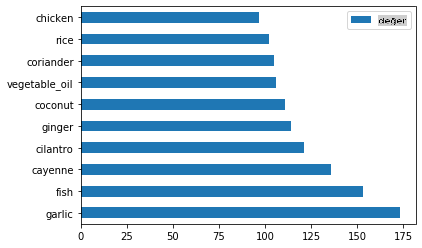
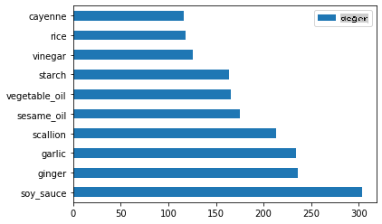
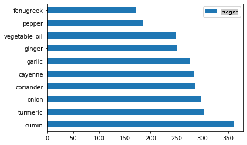
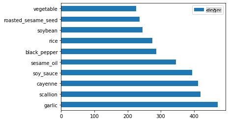

# Sınıflandırmaya Giriş

Bu dört derste, klasik makine öğreniminin temel odak noktalarından biri olan _sınıflandırma_ konusunu keşfedeceksiniz. Asya ve Hindistan'ın tüm muhteşem mutfakları hakkında bir veri kümesi kullanarak çeşitli sınıflandırma algoritmalarını adım adım inceleyeceğiz. Umarım açsınızdır!


> Bu derslerde pan-Asya mutfaklarını kutlayın! Görsel: [Jen Looper](https://twitter.com/jenlooper)

Sınıflandırma, regresyon teknikleriyle birçok ortak noktası olan bir [denetimli öğrenme](https://wikipedia.org/wiki/Supervised_learning) türüdür. Makine öğrenimi, veri kümelerini kullanarak değerlere veya isimlere tahminlerde bulunmakla ilgiliyse, sınıflandırma genellikle iki gruba ayrılır: _ikili sınıflandırma_ ve _çok sınıflı sınıflandırma_.

[](https://youtu.be/eg8DJYwdMyg "Sınıflandırmaya giriş")

> 🎥 Yukarıdaki görsele tıklayarak bir video izleyin: MIT'den John Guttag sınıflandırmayı tanıtıyor

Unutmayın:

- **Doğrusal regresyon** size değişkenler arasındaki ilişkileri tahmin etmenize ve yeni bir veri noktasının bu çizgiyle ilişkili olarak nereye düşeceğini doğru bir şekilde tahmin etmenize yardımcı oldu. Örneğin, _Eylül ve Aralık aylarında bir kabağın fiyatının ne olacağını_ tahmin edebilirsiniz.
- **Lojistik regresyon** size "ikili kategorileri" keşfetmenize yardımcı oldu: bu fiyat noktasında, _bu kabak turuncu mu yoksa turuncu değil mi_?

Sınıflandırma, bir veri noktasının etiketini veya sınıfını belirlemenin çeşitli yollarını belirlemek için çeşitli algoritmalar kullanır. Bu mutfak verileriyle çalışarak, bir grup malzemeyi gözlemleyerek hangi mutfağa ait olduğunu belirleyip belirleyemeyeceğimizi görelim.

## [Ders öncesi sınav](https://gray-sand-07a10f403.1.azurestaticapps.net/quiz/19/)

> ### [Bu ders R dilinde de mevcut!](../../../../4-Classification/1-Introduction/solution/R/lesson_10.html)

### Giriş

Sınıflandırma, makine öğrenimi araştırmacısının ve veri bilimcisinin temel faaliyetlerinden biridir. Temel bir ikili değerin sınıflandırılmasından ("bu e-posta spam mi değil mi?") karmaşık görüntü sınıflandırma ve segmentasyonuna kadar, verileri sınıflara ayırmak ve sorular sormak her zaman faydalıdır.

Bu süreci daha bilimsel bir şekilde ifade etmek gerekirse, sınıflandırma yönteminiz, giriş değişkenleri ile çıkış değişkenleri arasındaki ilişkiyi haritalamanıza olanak tanıyan bir tahmin modeli oluşturur.


> Sınıflandırma algoritmalarının ele alması gereken ikili ve çok sınıflı sorunlar. Bilgilendirme görseli: [Jen Looper](https://twitter.com/jenlooper)

Verilerimizi temizleme, görselleştirme ve ML görevlerimize hazırlama sürecine başlamadan önce, makine öğreniminin verileri sınıflandırmak için nasıl kullanılabileceğini biraz öğrenelim.

[istatistiklerden](https://wikipedia.org/wiki/Statistical_classification) türetilen klasik makine öğrenimi kullanarak sınıflandırma, X hastalığının gelişme olasılığını belirlemek için `smoker`, `weight` ve `age` gibi özellikler kullanır. Daha önce gerçekleştirdiğiniz regresyon egzersizlerine benzer denetimli bir öğrenme tekniği olarak, verileriniz etiketlenmiştir ve ML algoritmaları bu etiketleri kullanarak bir veri kümesinin sınıflarını (veya 'özelliklerini') sınıflandırır ve tahmin eder ve bunları bir gruba veya sonuca atar.

✅ Bir mutfak hakkında bir veri kümesi hayal etmek için bir an durun. Çok sınıflı bir model neyi cevaplayabilir? İkili bir model neyi cevaplayabilir? Belirli bir mutfağın çemen otu kullanma olasılığını belirlemek isteseydiniz ne olurdu? Bir torba yıldız anason, enginar, karnabahar ve yaban turpu dolu bir hediye alırsanız, tipik bir Hint yemeği yapıp yapamayacağınızı görmek isteseydiniz ne olurdu?

[](https://youtu.be/GuTeDbaNoEU "Çılgın gizem sepetleri")

> 🎥 Yukarıdaki görsele tıklayarak bir video izleyin. 'Chopped' adlı programın tüm konusu, şeflerin rastgele seçilen malzemelerden bir yemek yapmaları gereken 'gizem sepeti'dir. Kesinlikle bir ML modeli yardımcı olurdu!

## Merhaba 'sınıflandırıcı'

Bu mutfak veri kümesine sormak istediğimiz soru aslında bir **çok sınıflı soru**, çünkü çalışmak için birkaç potansiyel ulusal mutfak var. Bir grup malzeme verildiğinde, bu birçok sınıftan hangisine veri uyacak?

Scikit-learn, çözmek istediğiniz sorunun türüne bağlı olarak verileri sınıflandırmak için kullanabileceğiniz birkaç farklı algoritma sunar. Önümüzdeki iki derste, bu algoritmalardan birkaçını öğreneceksiniz.

## Egzersiz - verilerinizi temizleyin ve dengeleyin

Bu projeye başlamadan önce yapılacak ilk görev, verilerinizi temizlemek ve daha iyi sonuçlar almak için **dengelemek**. Bu klasörün kökünde bulunan boş _notebook.ipynb_ dosyasıyla başlayın.

İlk olarak kurulacak şey [imblearn](https://imbalanced-learn.org/stable/). Bu, verileri daha iyi dengelemenizi sağlayacak bir Scikit-learn paketidir (bu görev hakkında birazdan daha fazla bilgi edineceksiniz).

1. `imblearn` kurmak için, `pip install` çalıştırın, şöyle:

    ```python
    pip install imblearn
    ```

1. Verilerinizi içe aktarmak ve görselleştirmek için ihtiyaç duyduğunuz paketleri içe aktarın, ayrıca `imblearn`'den `SMOTE`'u içe aktarın.

    ```python
    import pandas as pd
    import matplotlib.pyplot as plt
    import matplotlib as mpl
    import numpy as np
    from imblearn.over_sampling import SMOTE
    ```

    Şimdi verileri içe aktarmaya hazırsınız.

1. Bir sonraki görev verileri içe aktarmak olacak:

    ```python
    df  = pd.read_csv('../data/cuisines.csv')
    ```

   `read_csv()` will read the content of the csv file _cusines.csv_ and place it in the variable `df` kullanarak.

1. Verilerin şeklini kontrol edin:

    ```python
    df.head()
    ```

   İlk beş satır şöyle görünüyor:

    ```output
    |     | Unnamed: 0 | cuisine | almond | angelica | anise | anise_seed | apple | apple_brandy | apricot | armagnac | ... | whiskey | white_bread | white_wine | whole_grain_wheat_flour | wine | wood | yam | yeast | yogurt | zucchini |
    | --- | ---------- | ------- | ------ | -------- | ----- | ---------- | ----- | ------------ | ------- | -------- | --- | ------- | ----------- | ---------- | ----------------------- | ---- | ---- | --- | ----- | ------ | -------- |
    | 0   | 65         | indian  | 0      | 0        | 0     | 0          | 0     | 0            | 0       | 0        | ... | 0       | 0           | 0          | 0                       | 0    | 0    | 0   | 0     | 0      | 0        |
    | 1   | 66         | indian  | 1      | 0        | 0     | 0          | 0     | 0            | 0       | 0        | ... | 0       | 0           | 0          | 0                       | 0    | 0    | 0   | 0     | 0      | 0        |
    | 2   | 67         | indian  | 0      | 0        | 0     | 0          | 0     | 0            | 0       | 0        | ... | 0       | 0           | 0          | 0                       | 0    | 0    | 0   | 0     | 0      | 0        |
    | 3   | 68         | indian  | 0      | 0        | 0     | 0          | 0     | 0            | 0       | 0        | ... | 0       | 0           | 0          | 0                       | 0    | 0    | 0   | 0     | 0      | 0        |
    | 4   | 69         | indian  | 0      | 0        | 0     | 0          | 0     | 0            | 0       | 0        | ... | 0       | 0           | 0          | 0                       | 0    | 0    | 0   | 0     | 1      | 0        |
    ```

1. Bu veriler hakkında bilgi almak için `info()` çağırın:

    ```python
    df.info()
    ```

    Çıktınız şu şekilde görünüyor:

    ```output
    <class 'pandas.core.frame.DataFrame'>
    RangeIndex: 2448 entries, 0 to 2447
    Columns: 385 entries, Unnamed: 0 to zucchini
    dtypes: int64(384), object(1)
    memory usage: 7.2+ MB
    ```

## Egzersiz - mutfaklar hakkında bilgi edinme

Şimdi işler daha ilginç hale gelmeye başlıyor. Verilerin dağılımını keşfedelim, mutfak başına

1. `barh()` çağırarak verileri çubuk grafik olarak çizin:

    ```python
    df.cuisine.value_counts().plot.barh()
    ```

    

    Sınırlı sayıda mutfak var, ancak veri dağılımı düzensiz. Bunu düzeltebilirsiniz! Bunu yapmadan önce, biraz daha keşfedin.

1. Mutfak başına ne kadar veri olduğunu öğrenin ve yazdırın:

    ```python
    thai_df = df[(df.cuisine == "thai")]
    japanese_df = df[(df.cuisine == "japanese")]
    chinese_df = df[(df.cuisine == "chinese")]
    indian_df = df[(df.cuisine == "indian")]
    korean_df = df[(df.cuisine == "korean")]
    
    print(f'thai df: {thai_df.shape}')
    print(f'japanese df: {japanese_df.shape}')
    print(f'chinese df: {chinese_df.shape}')
    print(f'indian df: {indian_df.shape}')
    print(f'korean df: {korean_df.shape}')
    ```

    çıktı şöyle görünüyor:

    ```output
    thai df: (289, 385)
    japanese df: (320, 385)
    chinese df: (442, 385)
    indian df: (598, 385)
    korean df: (799, 385)
    ```

## Malzemeleri keşfetme

Şimdi verileri daha derinlemesine inceleyebilir ve her mutfak için tipik malzemelerin neler olduğunu öğrenebilirsiniz. Mutfaklar arasında karışıklığa neden olan tekrarlayan verileri temizlemelisiniz, bu yüzden bu sorunu öğrenelim.

1. Bir malzeme veri çerçevesi oluşturmak için Python'da `create_ingredient()` fonksiyonunu oluşturun. Bu fonksiyon, işe yaramayan bir sütunu kaldırarak ve malzemeleri sayısına göre sıralayarak başlayacak:

    ```python
    def create_ingredient_df(df):
        ingredient_df = df.T.drop(['cuisine','Unnamed: 0']).sum(axis=1).to_frame('value')
        ingredient_df = ingredient_df[(ingredient_df.T != 0).any()]
        ingredient_df = ingredient_df.sort_values(by='value', ascending=False,
        inplace=False)
        return ingredient_df
    ```

   Şimdi bu fonksiyonu, her mutfak için en popüler on malzeme hakkında bir fikir edinmek için kullanabilirsiniz.

1. `create_ingredient()` and plot it calling `barh()` çağırın:

    ```python
    thai_ingredient_df = create_ingredient_df(thai_df)
    thai_ingredient_df.head(10).plot.barh()
    ```

    

1. Japon verileri için aynı işlemi yapın:

    ```python
    japanese_ingredient_df = create_ingredient_df(japanese_df)
    japanese_ingredient_df.head(10).plot.barh()
    ```

    

1. Şimdi Çin malzemeleri için:

    ```python
    chinese_ingredient_df = create_ingredient_df(chinese_df)
    chinese_ingredient_df.head(10).plot.barh()
    ```

    

1. Hint malzemelerini çizin:

    ```python
    indian_ingredient_df = create_ingredient_df(indian_df)
    indian_ingredient_df.head(10).plot.barh()
    ```

    

1. Son olarak, Kore malzemelerini çizin:

    ```python
    korean_ingredient_df = create_ingredient_df(korean_df)
    korean_ingredient_df.head(10).plot.barh()
    ```

    

1. Şimdi, `drop()` çağırarak farklı mutfaklar arasında karışıklık yaratan en yaygın malzemeleri çıkarın:

   Herkes pirinci, sarımsağı ve zencefili sever!

    ```python
    feature_df= df.drop(['cuisine','Unnamed: 0','rice','garlic','ginger'], axis=1)
    labels_df = df.cuisine #.unique()
    feature_df.head()
    ```

## Veri setini dengeleyin

Verileri temizledikten sonra, [SMOTE](https://imbalanced-learn.org/dev/references/generated/imblearn.over_sampling.SMOTE.html) - "Sentetik Azınlık Aşırı Örnekleme Tekniği" - kullanarak dengeleyin.

1. `fit_resample()` çağırın, bu strateji interpolasyon yoluyla yeni örnekler oluşturur.

    ```python
    oversample = SMOTE()
    transformed_feature_df, transformed_label_df = oversample.fit_resample(feature_df, labels_df)
    ```

    Verilerinizi dengeleyerek, sınıflandırırken daha iyi sonuçlar alırsınız. İkili bir sınıflandırmayı düşünün. Verilerinizin çoğu bir sınıfsa, bir ML modeli bu sınıfı daha sık tahmin edecektir, çünkü bu sınıf için daha fazla veri vardır. Verileri dengelemek, herhangi bir dengesiz veriyi alır ve bu dengesizliği ortadan kaldırmaya yardımcı olur.

1. Şimdi malzeme başına etiket sayısını kontrol edebilirsiniz:

    ```python
    print(f'new label count: {transformed_label_df.value_counts()}')
    print(f'old label count: {df.cuisine.value_counts()}')
    ```

    Çıktınız şöyle görünüyor:

    ```output
    new label count: korean      799
    chinese     799
    indian      799
    japanese    799
    thai        799
    Name: cuisine, dtype: int64
    old label count: korean      799
    indian      598
    chinese     442
    japanese    320
    thai        289
    Name: cuisine, dtype: int64
    ```

    Veriler güzel ve temiz, dengeli ve çok lezzetli!

1. Son adım, dengelenmiş verilerinizi, etiketler ve özellikler dahil olmak üzere, bir dosyaya aktarılabilecek yeni bir veri çerçevesine kaydetmektir:

    ```python
    transformed_df = pd.concat([transformed_label_df,transformed_feature_df],axis=1, join='outer')
    ```

1. `transformed_df.head()` and `transformed_df.info()` kullanarak verilere son bir kez bakabilirsiniz. Bu verilerin bir kopyasını gelecekteki derslerde kullanmak üzere kaydedin:

    ```python
    transformed_df.head()
    transformed_df.info()
    transformed_df.to_csv("../data/cleaned_cuisines.csv")
    ```

    Bu yeni CSV şimdi kök veri klasöründe bulunabilir.

---

## 🚀Meydan Okuma

Bu müfredat birkaç ilginç veri kümesi içerir. `data` klasörlerini inceleyin ve ikili veya çok sınıflı sınıflandırma için uygun olabilecek veri kümeleri var mı? Bu veri kümesine hangi soruları sorardınız?

## [Ders sonrası sınav](https://gray-sand-07a10f403.1.azurestaticapps.net/quiz/20/)

## Gözden Geçirme ve Kendi Kendine Çalışma

SMOTE'un API'sini keşfedin. Hangi kullanım durumları için en iyi şekilde kullanılır? Hangi sorunları çözer?

## Ödev

[Sınıflandırma yöntemlerini keşfedin](assignment.md)

**Feragatname**:
Bu belge, makine tabanlı AI çeviri hizmetleri kullanılarak çevrilmiştir. Doğruluk için çaba sarf etsek de, otomatik çevirilerin hata veya yanlışlıklar içerebileceğini lütfen unutmayın. Orijinal belgenin kendi dilindeki hali yetkili kaynak olarak kabul edilmelidir. Kritik bilgiler için profesyonel insan çevirisi önerilir. Bu çevirinin kullanımından kaynaklanan herhangi bir yanlış anlama veya yanlış yorumlamadan sorumlu değiliz.