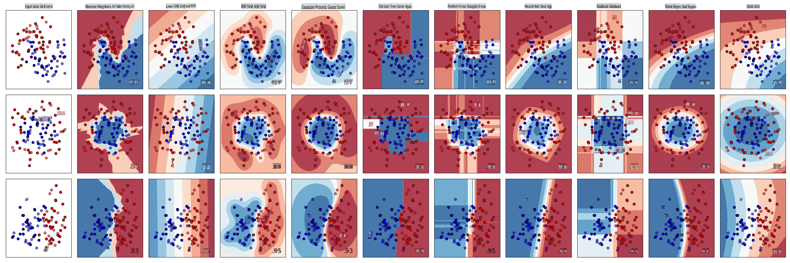
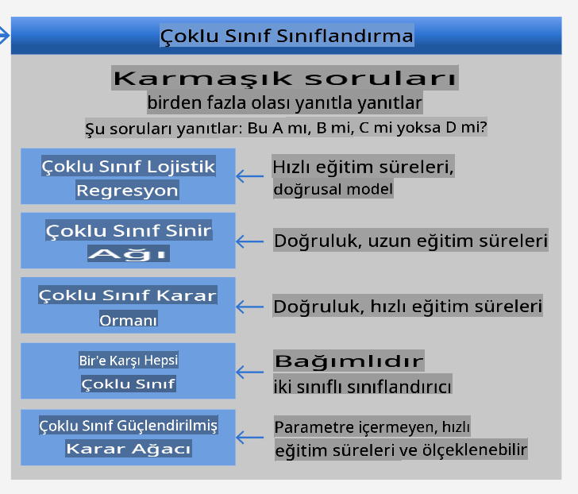
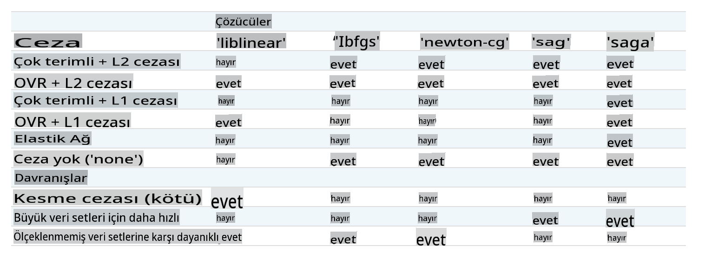

# Mutfak Sınıflandırıcıları 1

Bu derste, son dersten kaydettiğiniz dengeli ve temiz verilerle dolu mutfaklar hakkında olan veri setini kullanacaksınız.

Bu veri setini çeşitli sınıflandırıcılarla kullanarak _belirli bir ulusal mutfağı bir grup malzemeye dayanarak tahmin edeceksiniz_. Bunu yaparken, algoritmaların sınıflandırma görevleri için nasıl kullanılabileceği hakkında daha fazla bilgi edineceksiniz.

## [Ders Öncesi Quiz](https://gray-sand-07a10f403.1.azurestaticapps.net/quiz/21/)
# Hazırlık

[Lesson 1](../1-Introduction/README.md)'i tamamladığınızı varsayarak, bu dört ders için kök `/data` klasöründe _cleaned_cuisines.csv_ dosyasının mevcut olduğundan emin olun.

## Egzersiz - bir ulusal mutfağı tahmin edin

1. Bu dersin _notebook.ipynb_ klasöründe çalışarak, o dosyayı ve Pandas kütüphanesini içe aktarın:

    ```python
    import pandas as pd
    cuisines_df = pd.read_csv("../data/cleaned_cuisines.csv")
    cuisines_df.head()
    ```

    Veriler şu şekilde görünecektir:

|     | Unnamed: 0 | cuisine | almond | angelica | anise | anise_seed | apple | apple_brandy | apricot | armagnac | ... | whiskey | white_bread | white_wine | whole_grain_wheat_flour | wine | wood | yam | yeast | yogurt | zucchini |
| --- | ---------- | ------- | ------ | -------- | ----- | ---------- | ----- | ------------ | ------- | -------- | --- | ------- | ----------- | ---------- | ----------------------- | ---- | ---- | --- | ----- | ------ | -------- |
| 0   | 0          | indian  | 0      | 0        | 0     | 0          | 0     | 0            | 0       | 0        | ... | 0       | 0           | 0          | 0                       | 0    | 0    | 0   | 0     | 0      | 0        |
| 1   | 1          | indian  | 1      | 0        | 0     | 0          | 0     | 0            | 0       | 0        | ... | 0       | 0           | 0          | 0                       | 0    | 0    | 0   | 0     | 0      | 0        |
| 2   | 2          | indian  | 0      | 0        | 0     | 0          | 0     | 0            | 0       | 0        | ... | 0       | 0           | 0          | 0                       | 0    | 0    | 0   | 0     | 0      | 0        |
| 3   | 3          | indian  | 0      | 0        | 0     | 0          | 0     | 0            | 0       | 0        | ... | 0       | 0           | 0          | 0                       | 0    | 0    | 0   | 0     | 0      | 0        |
| 4   | 4          | indian  | 0      | 0        | 0     | 0          | 0     | 0            | 0       | 0        | ... | 0       | 0           | 0          | 0                       | 0    | 0    | 0   | 0     | 1      | 0        |
  

1. Şimdi, birkaç kütüphane daha içe aktarın:

    ```python
    from sklearn.linear_model import LogisticRegression
    from sklearn.model_selection import train_test_split, cross_val_score
    from sklearn.metrics import accuracy_score,precision_score,confusion_matrix,classification_report, precision_recall_curve
    from sklearn.svm import SVC
    import numpy as np
    ```

1. Eğitim için X ve y koordinatlarını iki dataframe'e bölün. `cuisine` etiketler dataframe'i olabilir:

    ```python
    cuisines_label_df = cuisines_df['cuisine']
    cuisines_label_df.head()
    ```

    Şu şekilde görünecektir:

    ```output
    0    indian
    1    indian
    2    indian
    3    indian
    4    indian
    Name: cuisine, dtype: object
    ```

1. `Unnamed: 0` column and the `cuisine` column, calling `drop()` öğesini düşürün. Geri kalan verileri eğitilebilir özellikler olarak kaydedin:

    ```python
    cuisines_feature_df = cuisines_df.drop(['Unnamed: 0', 'cuisine'], axis=1)
    cuisines_feature_df.head()
    ```

    Özellikleriniz şu şekilde görünecektir:

|      | almond | angelica | anise | anise_seed | apple | apple_brandy | apricot | armagnac | artemisia | artichoke |  ... | whiskey | white_bread | white_wine | whole_grain_wheat_flour | wine | wood |  yam | yeast | yogurt | zucchini |
| ---: | -----: | -------: | ----: | ---------: | ----: | -----------: | ------: | -------: | --------: | --------: | ---: | ------: | ----------: | ---------: | ----------------------: | ---: | ---: | ---: | ----: | -----: | -------: |
|    0 |      0 |        0 |     0 |          0 |     0 |            0 |       0 |        0 |         0 |         0 |  ... |       0 |           0 |          0 |                       0 |    0 |    0 |    0 |     0 |      0 |        0 | 0 |
|    1 |      1 |        0 |     0 |          0 |     0 |            0 |       0 |        0 |         0 |         0 |  ... |       0 |           0 |          0 |                       0 |    0 |    0 |    0 |     0 |      0 |        0 | 0 |
|    2 |      0 |        0 |     0 |          0 |     0 |            0 |       0 |        0 |         0 |         0 |  ... |       0 |           0 |          0 |                       0 |    0 |    0 |    0 |     0 |      0 |        0 | 0 |
|    3 |      0 |        0 |     0 |          0 |     0 |            0 |       0 |        0 |         0 |         0 |  ... |       0 |           0 |          0 |                       0 |    0 |    0 |    0 |     0 |      0 |        0 | 0 |
|    4 |      0 |        0 |     0 |          0 |     0 |            0 |       0 |        0 |         0 |         0 |  ... |       0 |           0 |          0 |                       0 |    0 |    0 |    0 |     0 |      1 |        0 | 0 |

Artık modelinizi eğitmeye hazırsınız!

## Sınıflandırıcınızı Seçmek

Verileriniz temiz ve eğitime hazır olduğuna göre, işi yapmak için hangi algoritmayı kullanacağınıza karar vermelisiniz.

Scikit-learn, sınıflandırmayı Denetimli Öğrenme altında gruplandırır ve bu kategoride birçok sınıflandırma yöntemi bulacaksınız. [Çeşitlilik](https://scikit-learn.org/stable/supervised_learning.html) ilk bakışta oldukça kafa karıştırıcıdır. Aşağıdaki yöntemlerin tümü sınıflandırma tekniklerini içerir:

- Doğrusal Modeller
- Destek Vektör Makineleri
- Stokastik Gradyan İnişi
- En Yakın Komşular
- Gauss Süreçleri
- Karar Ağaçları
- Ansambl yöntemleri (oylama Sınıflandırıcısı)
- Çoklu sınıf ve çoklu çıktı algoritmaları (çoklu sınıf ve çoklu etiket sınıflandırması, çoklu sınıf-çoklu çıktı sınıflandırması)

> Verileri sınıflandırmak için [sinir ağlarını da kullanabilirsiniz](https://scikit-learn.org/stable/modules/neural_networks_supervised.html#classification), ancak bu dersin kapsamı dışındadır.

### Hangi sınıflandırıcıyı seçmeli?

Peki, hangi sınıflandırıcıyı seçmelisiniz? Çoğu zaman, birkaçını çalıştırmak ve iyi bir sonuç aramak, test etmenin bir yoludur. Scikit-learn, oluşturulan bir veri setinde KNeighbors, SVC iki yolu, GaussianProcessClassifier, DecisionTreeClassifier, RandomForestClassifier, MLPClassifier, AdaBoostClassifier, GaussianNB ve QuadraticDiscrinationAnalysis'ı karşılaştıran bir [yan yana karşılaştırma](https://scikit-learn.org/stable/auto_examples/classification/plot_classifier_comparison.html) sunar ve sonuçları görselleştirir:


> Grafikler Scikit-learn'ün belgelerinde oluşturulmuştur

> AutoML bu sorunu bulutta bu karşılaştırmaları çalıştırarak, verileriniz için en iyi algoritmayı seçmenize olanak tanıyarak düzgün bir şekilde çözer. Bunu [burada](https://docs.microsoft.com/learn/modules/automate-model-selection-with-azure-automl/?WT.mc_id=academic-77952-leestott) deneyin

### Daha İyi Bir Yaklaşım

Ancak, rastgele tahmin etmekten daha iyi bir yol, bu indirilebilir [ML Hile Sayfası](https://docs.microsoft.com/azure/machine-learning/algorithm-cheat-sheet?WT.mc_id=academic-77952-leestott) üzerindeki fikirleri takip etmektir. Burada, çoklu sınıf problemimiz için bazı seçeneklerimiz olduğunu keşfediyoruz:


> Microsoft'un Algoritma Hile Sayfasının, çoklu sınıf sınıflandırma seçeneklerini detaylandıran bir bölümü

✅ Bu hile sayfasını indirin, yazdırın ve duvarınıza asın!

### Mantık Yürütme

Sahip olduğumuz kısıtlamalar göz önünde bulundurularak farklı yaklaşımlar üzerinde mantık yürütebilir miyiz görelim:

- **Sinir ağları çok ağır**. Temiz ama minimal veri setimiz ve eğitimleri yerel olarak defterler üzerinden çalıştırdığımız gerçeği göz önüne alındığında, sinir ağları bu görev için çok ağırdır.
- **İki sınıf sınıflandırıcı yok**. İki sınıf sınıflandırıcı kullanmıyoruz, bu yüzden bir-vs-hepsini dışarıda bırakıyoruz.
- **Karar ağacı veya lojistik regresyon işe yarayabilir**. Bir karar ağacı veya çoklu sınıf verileri için lojistik regresyon işe yarayabilir.
- **Çoklu Sınıf Güçlendirilmiş Karar Ağaçları farklı bir sorunu çözer**. Çoklu sınıf güçlendirilmiş karar ağacı, sıralamalar oluşturmak için tasarlanmış görevler gibi parametrik olmayan görevler için en uygundur, bu yüzden bizim için kullanışlı değildir.

### Scikit-learn Kullanımı 

Verilerimizi analiz etmek için Scikit-learn kullanacağız. Ancak, Scikit-learn'de lojistik regresyon kullanmanın birçok yolu vardır. [Geçilecek parametrelere](https://scikit-learn.org/stable/modules/generated/sklearn.linear_model.LogisticRegression.html?highlight=logistic%20regressio#sklearn.linear_model.LogisticRegression) bir göz atın.  

Temelde iki önemli parametre vardır - `multi_class` and `solver` - that we need to specify, when we ask Scikit-learn to perform a logistic regression. The `multi_class` value applies a certain behavior. The value of the solver is what algorithm to use. Not all solvers can be paired with all `multi_class` values.

According to the docs, in the multiclass case, the training algorithm:

- **Uses the one-vs-rest (OvR) scheme**, if the `multi_class` option is set to `ovr`
- **Uses the cross-entropy loss**, if the `multi_class` option is set to `multinomial`. (Currently the `multinomial` option is supported only by the ‘lbfgs’, ‘sag’, ‘saga’ and ‘newton-cg’ solvers.)"

> 🎓 The 'scheme' here can either be 'ovr' (one-vs-rest) or 'multinomial'. Since logistic regression is really designed to support binary classification, these schemes allow it to better handle multiclass classification tasks. [source](https://machinelearningmastery.com/one-vs-rest-and-one-vs-one-for-multi-class-classification/)

> 🎓 The 'solver' is defined as "the algorithm to use in the optimization problem". [source](https://scikit-learn.org/stable/modules/generated/sklearn.linear_model.LogisticRegression.html?highlight=logistic%20regressio#sklearn.linear_model.LogisticRegression).

Scikit-learn offers this table to explain how solvers handle different challenges presented by different kinds of data structures:



## Exercise - split the data

We can focus on logistic regression for our first training trial since you recently learned about the latter in a previous lesson.
Split your data into training and testing groups by calling `train_test_split()`:

```python
X_train, X_test, y_train, y_test = train_test_split(cuisines_feature_df, cuisines_label_df, test_size=0.3)
```

## Egzersiz - lojistik regresyon uygulayın

Çoklu sınıf durumunu kullandığınız için hangi _şemayı_ kullanacağınıza ve hangi _çözücüyü_ ayarlayacağınıza karar vermeniz gerekir. LojistikRegresyonu, çoklu sınıf ayarı ve **liblinear** çözücü ile eğitin.

1. multi_class'ı `ovr` and the solver set to `liblinear` olarak ayarlayarak bir lojistik regresyon oluşturun:

    ```python
    lr = LogisticRegression(multi_class='ovr',solver='liblinear')
    model = lr.fit(X_train, np.ravel(y_train))
    
    accuracy = model.score(X_test, y_test)
    print ("Accuracy is {}".format(accuracy))
    ```

    ✅ `lbfgs`, which is often set as default

    > Note, use Pandas [`ravel`](https://pandas.pydata.org/pandas-docs/stable/reference/api/pandas.Series.ravel.html) işlevi gibi farklı bir çözücü deneyin ve gerektiğinde verilerinizi düzleştirin.

    Doğruluk **%80**'in üzerinde iyi!

1. Bu modeli bir veri satırını (#50) test ederek çalışırken görebilirsiniz:

    ```python
    print(f'ingredients: {X_test.iloc[50][X_test.iloc[50]!=0].keys()}')
    print(f'cuisine: {y_test.iloc[50]}')
    ```

    Sonuç basılır:

   ```output
   ingredients: Index(['cilantro', 'onion', 'pea', 'potato', 'tomato', 'vegetable_oil'], dtype='object')
   cuisine: indian
   ```

   ✅ Farklı bir satır numarası deneyin ve sonuçları kontrol edin

1. Daha derine inerek, bu tahminin doğruluğunu kontrol edebilirsiniz:

    ```python
    test= X_test.iloc[50].values.reshape(-1, 1).T
    proba = model.predict_proba(test)
    classes = model.classes_
    resultdf = pd.DataFrame(data=proba, columns=classes)
    
    topPrediction = resultdf.T.sort_values(by=[0], ascending = [False])
    topPrediction.head()
    ```

    Sonuç basılır - Hint mutfağı en iyi tahminidir, iyi bir olasılıkla:

    |          |        0 |
    | -------: | -------: |
    |   indian | 0.715851 |
    |  chinese | 0.229475 |
    | japanese | 0.029763 |
    |   korean | 0.017277 |
    |     thai | 0.007634 |

    ✅ Modelin neden Hint mutfağı olduğundan oldukça emin olduğunu açıklayabilir misiniz?

1. Regresyon derslerinde olduğu gibi bir sınıflandırma raporu yazarak daha fazla ayrıntı alın:

    ```python
    y_pred = model.predict(X_test)
    print(classification_report(y_test,y_pred))
    ```

    |              | precision | recall | f1-score | support |
    | ------------ | --------- | ------ | -------- | ------- |
    | chinese      | 0.73      | 0.71   | 0.72     | 229     |
    | indian       | 0.91      | 0.93   | 0.92     | 254     |
    | japanese     | 0.70      | 0.75   | 0.72     | 220     |
    | korean       | 0.86      | 0.76   | 0.81     | 242     |
    | thai         | 0.79      | 0.85   | 0.82     | 254     |
    | accuracy     | 0.80      | 1199   |          |         |
    | macro avg    | 0.80      | 0.80   | 0.80     | 1199    |
    | weighted avg | 0.80      | 0.80   | 0.80     | 1199    |

## 🚀Meydan Okuma

Bu derste, temizlenmiş verilerinizi kullanarak bir grup malzemeye dayanarak ulusal bir mutfağı tahmin edebilen bir makine öğrenme modeli oluşturdunuz. Scikit-learn'ün veri sınıflandırmak için sağladığı birçok seçeneği okumak için biraz zaman ayırın. 'Çözücü' kavramını daha derinlemesine inceleyerek perde arkasında neler olduğunu anlayın.

## [Ders Sonrası Quiz](https://gray-sand-07a10f403.1.azurestaticapps.net/quiz/22/)

## Gözden Geçirme ve Kendi Kendine Çalışma

Lojistik regresyonun matematiğini [bu derste](https://people.eecs.berkeley.edu/~russell/classes/cs194/f11/lectures/CS194%20Fall%202011%20Lecture%2006.pdf) biraz daha derinlemesine inceleyin.
## Ödev 

[Çözücüleri inceleyin](assignment.md)

**Feragatname**:
Bu belge, makine tabanlı yapay zeka çeviri hizmetleri kullanılarak çevrilmiştir. Doğruluk için çaba sarf etsek de, otomatik çevirilerin hata veya yanlışlıklar içerebileceğini lütfen unutmayın. Belgenin orijinal dili, yetkili kaynak olarak kabul edilmelidir. Kritik bilgiler için profesyonel insan çevirisi tavsiye edilir. Bu çevirinin kullanımından kaynaklanan yanlış anlamalar veya yanlış yorumlamalar için sorumluluk kabul etmiyoruz.