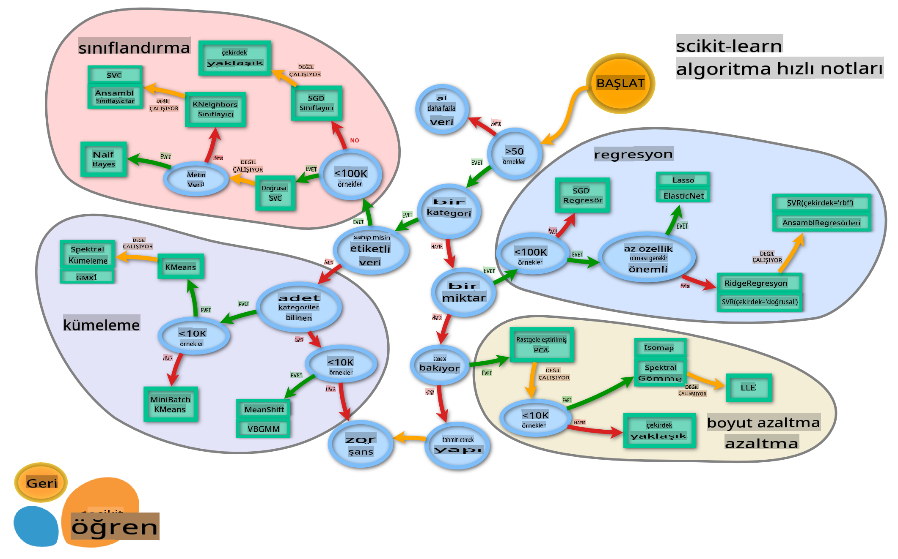

# Mutfak Sınıflandırıcıları 2

Bu ikinci sınıflandırma dersinde, sayısal verileri sınıflandırmanın daha fazla yolunu keşfedeceksiniz. Ayrıca bir sınıflandırıcıyı diğerine tercih etmenin sonuçlarını da öğreneceksiniz.

## [Ders Öncesi Test](https://gray-sand-07a10f403.1.azurestaticapps.net/quiz/23/)

### Ön Koşul

Önceki dersleri tamamladığınızı ve bu 4 derslik klasörün kök dizininde _cleaned_cuisines.csv_ adlı temizlenmiş bir veri kümesine sahip olduğunuzu varsayıyoruz.

### Hazırlık

_notebook.ipynb_ dosyanızı temizlenmiş veri kümesiyle yükledik ve model oluşturma sürecine hazır olacak şekilde X ve y veri çerçevelerine böldük.

## Bir sınıflandırma haritası

Daha önce, Microsoft'un hile sayfasını kullanarak verileri sınıflandırırken sahip olduğunuz çeşitli seçenekleri öğrendiniz. Scikit-learn, tahmincilerinizi (sınıflandırıcılar için başka bir terim) daraltmanıza yardımcı olabilecek benzer ancak daha ayrıntılı bir hile sayfası sunar:


> İpucu: [bu haritayı çevrimiçi ziyaret edin](https://scikit-learn.org/stable/tutorial/machine_learning_map/) ve belgelere ulaşmak için yol boyunca tıklayın.

### Plan

Bu harita, verilerinizi net bir şekilde kavradığınızda çok yardımcı olur, çünkü yolları boyunca bir karara 'yürüyebilirsiniz':

- 50'den fazla örneğimiz var
- Bir kategori tahmin etmek istiyoruz
- Etiketlenmiş verilerimiz var
- 100K'den az örneğimiz var
- ✨ Bir Linear SVC seçebiliriz
- Bu işe yaramazsa, çünkü sayısal verilerimiz var
    - ✨ KNeighbors Classifier deneyebiliriz
      - Bu da işe yaramazsa, ✨ SVC ve ✨ Ensemble Classifiers deneyin

Bu takip edilmesi gereken çok faydalı bir yoldur.

## Egzersiz - verileri bölmek

Bu yolu izleyerek, kullanmak için bazı kütüphaneleri ithal ederek başlamalıyız.

1. Gerekli kütüphaneleri ithal edin:

    ```python
    from sklearn.neighbors import KNeighborsClassifier
    from sklearn.linear_model import LogisticRegression
    from sklearn.svm import SVC
    from sklearn.ensemble import RandomForestClassifier, AdaBoostClassifier
    from sklearn.model_selection import train_test_split, cross_val_score
    from sklearn.metrics import accuracy_score,precision_score,confusion_matrix,classification_report, precision_recall_curve
    import numpy as np
    ```

1. Eğitim ve test verilerinizi bölün:

    ```python
    X_train, X_test, y_train, y_test = train_test_split(cuisines_feature_df, cuisines_label_df, test_size=0.3)
    ```

## Linear SVC sınıflandırıcı

Destek-Vektör kümeleme (SVC), Destek-Vektör makineleri ailesinin bir alt kümesidir (aşağıda bunlar hakkında daha fazla bilgi edinin). Bu yöntemde, etiketleri nasıl kümeleyeceğinizi belirlemek için bir 'çekirdek' seçebilirsiniz. 'C' parametresi, parametrelerin etkisini düzenleyen 'düzenleme' anlamına gelir. Çekirdek [birkaç](https://scikit-learn.org/stable/modules/generated/sklearn.svm.SVC.html#sklearn.svm.SVC) türden biri olabilir; burada lineer SVC'den yararlanmak için onu 'lineer' olarak ayarlıyoruz. Olasılık varsayılan olarak 'false'dur; burada olasılık tahminleri toplamak için onu 'true' olarak ayarlıyoruz. Verileri karıştırmak için rastgele durumu '0' olarak ayarlıyoruz.

### Egzersiz - bir linear SVC uygulayın

Bir sınıflandırıcılar dizisi oluşturarak başlayın. Test ettikçe bu diziye kademeli olarak eklemeler yapacaksınız.

1. Bir Linear SVC ile başlayın:

    ```python
    C = 10
    # Create different classifiers.
    classifiers = {
        'Linear SVC': SVC(kernel='linear', C=C, probability=True,random_state=0)
    }
    ```

2. Linear SVC kullanarak modelinizi eğitin ve bir rapor yazdırın:

    ```python
    n_classifiers = len(classifiers)
    
    for index, (name, classifier) in enumerate(classifiers.items()):
        classifier.fit(X_train, np.ravel(y_train))
    
        y_pred = classifier.predict(X_test)
        accuracy = accuracy_score(y_test, y_pred)
        print("Accuracy (train) for %s: %0.1f%% " % (name, accuracy * 100))
        print(classification_report(y_test,y_pred))
    ```

    Sonuç oldukça iyi:

    ```output
    Accuracy (train) for Linear SVC: 78.6% 
                  precision    recall  f1-score   support
    
         chinese       0.71      0.67      0.69       242
          indian       0.88      0.86      0.87       234
        japanese       0.79      0.74      0.76       254
          korean       0.85      0.81      0.83       242
            thai       0.71      0.86      0.78       227
    
        accuracy                           0.79      1199
       macro avg       0.79      0.79      0.79      1199
    weighted avg       0.79      0.79      0.79      1199
    ```

## K-Neighbors sınıflandırıcı

K-Neighbors, hem denetimli hem de denetimsiz öğrenme için kullanılabilen ML yöntemleri ailesinin bir parçasıdır. Bu yöntemde, önceden belirlenmiş sayıda nokta oluşturulur ve bu noktalar etrafında veriler toplanarak veriler için genelleştirilmiş etiketler tahmin edilebilir.

### Egzersiz - K-Neighbors sınıflandırıcı uygulayın

Önceki sınıflandırıcı iyiydi ve verilerle iyi çalıştı, ancak belki daha iyi doğruluk elde edebiliriz. Bir K-Neighbors sınıflandırıcı deneyin.

1. Sınıflandırıcı dizinize bir satır ekleyin (Linear SVC öğesinden sonra bir virgül ekleyin):

    ```python
    'KNN classifier': KNeighborsClassifier(C),
    ```

    Sonuç biraz daha kötü:

    ```output
    Accuracy (train) for KNN classifier: 73.8% 
                  precision    recall  f1-score   support
    
         chinese       0.64      0.67      0.66       242
          indian       0.86      0.78      0.82       234
        japanese       0.66      0.83      0.74       254
          korean       0.94      0.58      0.72       242
            thai       0.71      0.82      0.76       227
    
        accuracy                           0.74      1199
       macro avg       0.76      0.74      0.74      1199
    weighted avg       0.76      0.74      0.74      1199
    ```

    ✅ [K-Neighbors](https://scikit-learn.org/stable/modules/neighbors.html#neighbors) hakkında bilgi edinin

## Support Vector Classifier

Support-Vector sınıflandırıcılar, sınıflandırma ve regresyon görevlerinde kullanılan [Support-Vector Machine](https://wikipedia.org/wiki/Support-vector_machine) ailesinin bir parçasıdır. SVM'ler, "eğitim örneklerini iki kategori arasındaki mesafeyi en üst düzeye çıkarmak için uzaydaki noktalara eşler." Sonraki veriler bu uzaya eşlenir, böylece kategorileri tahmin edilebilir.

### Egzersiz - Support Vector Classifier uygulayın

Biraz daha iyi doğruluk için bir Support Vector Classifier deneyelim.

1. K-Neighbors öğesinden sonra bir virgül ekleyin ve ardından bu satırı ekleyin:

    ```python
    'SVC': SVC(),
    ```

    Sonuç oldukça iyi!

    ```output
    Accuracy (train) for SVC: 83.2% 
                  precision    recall  f1-score   support
    
         chinese       0.79      0.74      0.76       242
          indian       0.88      0.90      0.89       234
        japanese       0.87      0.81      0.84       254
          korean       0.91      0.82      0.86       242
            thai       0.74      0.90      0.81       227
    
        accuracy                           0.83      1199
       macro avg       0.84      0.83      0.83      1199
    weighted avg       0.84      0.83      0.83      1199
    ```

    ✅ [Support-Vectors](https://scikit-learn.org/stable/modules/svm.html#svm) hakkında bilgi edinin

## Ensemble Classifiers

Önceki test oldukça iyi olmasına rağmen, yolun sonuna kadar takip edelim. Özellikle Random Forest ve AdaBoost gibi bazı 'Ensemble Classifiers' deneyelim:

```python
  'RFST': RandomForestClassifier(n_estimators=100),
  'ADA': AdaBoostClassifier(n_estimators=100)
```

Sonuç özellikle Random Forest için çok iyi:

```output
Accuracy (train) for RFST: 84.5% 
              precision    recall  f1-score   support

     chinese       0.80      0.77      0.78       242
      indian       0.89      0.92      0.90       234
    japanese       0.86      0.84      0.85       254
      korean       0.88      0.83      0.85       242
        thai       0.80      0.87      0.83       227

    accuracy                           0.84      1199
   macro avg       0.85      0.85      0.84      1199
weighted avg       0.85      0.84      0.84      1199

Accuracy (train) for ADA: 72.4% 
              precision    recall  f1-score   support

     chinese       0.64      0.49      0.56       242
      indian       0.91      0.83      0.87       234
    japanese       0.68      0.69      0.69       254
      korean       0.73      0.79      0.76       242
        thai       0.67      0.83      0.74       227

    accuracy                           0.72      1199
   macro avg       0.73      0.73      0.72      1199
weighted avg       0.73      0.72      0.72      1199
```

✅ [Ensemble Classifiers](https://scikit-learn.org/stable/modules/ensemble.html) hakkında bilgi edinin

Bu Makine Öğrenimi yöntemi, modelin kalitesini artırmak için birkaç temel tahmincinin tahminlerini birleştirir. Örneğimizde, Random Trees ve AdaBoost kullandık.

- [Random Forest](https://scikit-learn.org/stable/modules/ensemble.html#forest), aşırı uyumu önlemek için rastgelelik ile aşılanmış 'karar ağaçları'ndan oluşan bir 'orman' oluşturur. n_estimators parametresi, ağaç sayısını ayarlar.

- [AdaBoost](https://scikit-learn.org/stable/modules/generated/sklearn.ensemble.AdaBoostClassifier.html) bir veri kümesine bir sınıflandırıcı uyarlar ve ardından aynı veri kümesine bu sınıflandırıcının kopyalarını uyarlar. Yanlış sınıflandırılan öğelerin ağırlıklarına odaklanır ve bir sonraki sınıflandırıcı için uyumu düzeltmek için ayarlar.

---

## 🚀Meydan Okuma

Bu tekniklerin her birinin ayarlayabileceğiniz birçok parametresi vardır. Her birinin varsayılan parametrelerini araştırın ve bu parametreleri ayarlamanın modelin kalitesi için ne anlama gelebileceğini düşünün.

## [Ders Sonrası Test](https://gray-sand-07a10f403.1.azurestaticapps.net/quiz/24/)

## Gözden Geçirme ve Kendi Kendine Çalışma

Bu derslerde çok fazla jargon var, bu yüzden bir dakika ayırarak [bu listeyi](https://docs.microsoft.com/dotnet/machine-learning/resources/glossary?WT.mc_id=academic-77952-leestott) gözden geçirin!

## Ödev 

[Parametre oyunu](assignment.md)

**Feragatname**:
Bu belge, makine tabanlı AI çeviri hizmetleri kullanılarak çevrilmiştir. Doğruluk için çaba sarf etsek de, otomatik çevirilerin hata veya yanlışlıklar içerebileceğini lütfen unutmayın. Belgenin orijinal dili, yetkili kaynak olarak kabul edilmelidir. Kritik bilgiler için profesyonel insan çevirisi önerilir. Bu çevirinin kullanımından kaynaklanan herhangi bir yanlış anlama veya yanlış yorumlamadan sorumlu değiliz.