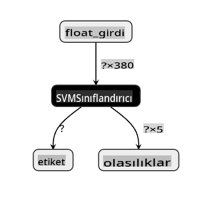
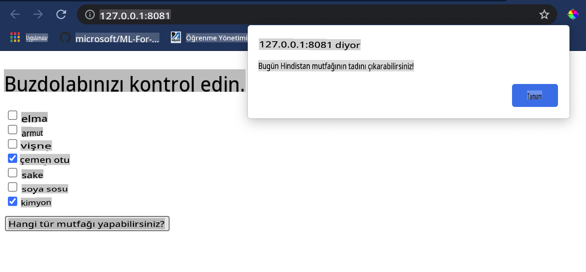

# Bir Mutfak Önerici Web Uygulaması Oluşturma

Bu derste, önceki derslerde öğrendiğiniz bazı teknikleri kullanarak ve bu seride kullanılan lezzetli mutfak veri seti ile bir sınıflandırma modeli oluşturacaksınız. Ayrıca, kaydedilmiş bir modeli kullanmak için Onnx'in web çalıştırma zamanını kullanarak küçük bir web uygulaması oluşturacaksınız.

Makine öğreniminin en faydalı pratik kullanımlarından biri öneri sistemleri oluşturmaktır ve bugün bu yönde ilk adımı atabilirsiniz!

[](https://youtu.be/17wdM9AHMfg "Applied ML")

> 🎥 Yukarıdaki resme tıklayarak bir video izleyin: Jen Looper, sınıflandırılmış mutfak verilerini kullanarak bir web uygulaması oluşturuyor

## [Ders Öncesi Quiz](https://gray-sand-07a10f403.1.azurestaticapps.net/quiz/25/)

Bu derste öğrenecekleriniz:

- Bir model nasıl oluşturulur ve Onnx modeli olarak nasıl kaydedilir
- Netron'u kullanarak model nasıl incelenir
- Bir web uygulamasında model nasıl kullanılır

## Modelinizi Oluşturun

Uygulamalı ML sistemleri oluşturmak, bu teknolojileri iş sistemlerinizde kullanmanın önemli bir parçasıdır. Onnx kullanarak modelleri web uygulamalarınızda kullanabilirsiniz (ve gerektiğinde çevrimdışı bir bağlamda kullanabilirsiniz).

[Önceki bir derste](../../3-Web-App/1-Web-App/README.md), UFO gözlemleri hakkında bir Regresyon modeli oluşturmuş, "pickle" etmiş ve bir Flask uygulamasında kullanmıştınız. Bu mimariyi bilmek çok faydalı olsa da, tam yığın bir Python uygulamasıdır ve gereksinimleriniz bir JavaScript uygulamasının kullanımını içerebilir.

Bu derste, çıkarım için temel bir JavaScript tabanlı sistem oluşturabilirsiniz. Ancak önce, bir model eğitmeniz ve Onnx ile kullanmak üzere dönüştürmeniz gerekiyor.

## Alıştırma - sınıflandırma modeli eğitme

Öncelikle, kullandığımız temizlenmiş mutfak veri setini kullanarak bir sınıflandırma modeli eğitin.

1. Faydalı kütüphaneleri içe aktararak başlayın:

    ```python
    !pip install skl2onnx
    import pandas as pd 
    ```

    Scikit-learn modelinizi Onnx formatına dönüştürmenize yardımcı olacak '[skl2onnx](https://onnx.ai/sklearn-onnx/)' gerekecek.

1. Daha sonra, önceki derslerde yaptığınız gibi bir CSV dosyasını `read_csv()` kullanarak okuyarak verilerinizle çalışın:

    ```python
    data = pd.read_csv('../data/cleaned_cuisines.csv')
    data.head()
    ```

1. İlk iki gereksiz sütunu kaldırın ve kalan verileri 'X' olarak kaydedin:

    ```python
    X = data.iloc[:,2:]
    X.head()
    ```

1. Etiketleri 'y' olarak kaydedin:

    ```python
    y = data[['cuisine']]
    y.head()
    
    ```

### Eğitim rutinine başlayın

'SVÇ' kütüphanesini kullanacağız çünkü iyi bir doğruluğa sahiptir.

1. Scikit-learn'den uygun kütüphaneleri içe aktarın:

    ```python
    from sklearn.model_selection import train_test_split
    from sklearn.svm import SVC
    from sklearn.model_selection import cross_val_score
    from sklearn.metrics import accuracy_score,precision_score,confusion_matrix,classification_report
    ```

1. Eğitim ve test setlerini ayırın:

    ```python
    X_train, X_test, y_train, y_test = train_test_split(X,y,test_size=0.3)
    ```

1. Önceki derste yaptığınız gibi bir SVC Sınıflandırma modeli oluşturun:

    ```python
    model = SVC(kernel='linear', C=10, probability=True,random_state=0)
    model.fit(X_train,y_train.values.ravel())
    ```

1. Şimdi modelinizi test edin, `predict()` çağrısı yaparak:

    ```python
    y_pred = model.predict(X_test)
    ```

1. Modelin kalitesini kontrol etmek için bir sınıflandırma raporu yazdırın:

    ```python
    print(classification_report(y_test,y_pred))
    ```

    Daha önce gördüğümüz gibi, doğruluk iyi:

    ```output
                    precision    recall  f1-score   support
    
         chinese       0.72      0.69      0.70       257
          indian       0.91      0.87      0.89       243
        japanese       0.79      0.77      0.78       239
          korean       0.83      0.79      0.81       236
            thai       0.72      0.84      0.78       224
    
        accuracy                           0.79      1199
       macro avg       0.79      0.79      0.79      1199
    weighted avg       0.79      0.79      0.79      1199
    ```

### Modelinizi Onnx'e dönüştürün

Dönüştürmeyi doğru Tensor numarası ile yapmayı unutmayın. Bu veri setinde 380 malzeme listelenmiştir, bu yüzden `FloatTensorType` içinde bu sayıyı belirtmeniz gerekir:

1. 380 tensor numarasını kullanarak dönüştürün.

    ```python
    from skl2onnx import convert_sklearn
    from skl2onnx.common.data_types import FloatTensorType
    
    initial_type = [('float_input', FloatTensorType([None, 380]))]
    options = {id(model): {'nocl': True, 'zipmap': False}}
    ```

1. Onx oluşturun ve **model.onnx** olarak bir dosya olarak saklayın:

    ```python
    onx = convert_sklearn(model, initial_types=initial_type, options=options)
    with open("./model.onnx", "wb") as f:
        f.write(onx.SerializeToString())
    ```

    > Not, dönüşüm betiğinizde [seçenekler](https://onnx.ai/sklearn-onnx/parameterized.html) geçebilirsiniz. Bu durumda, 'nocl' True ve 'zipmap' False olarak geçtik. Bu bir sınıflandırma modeli olduğundan, ZipMap'i kaldırma seçeneğiniz vardır, bu da bir sözlük listesi üretir (gerekli değil). `nocl` refers to class information being included in the model. Reduce your model's size by setting `nocl` to 'True'. 

Running the entire notebook will now build an Onnx model and save it to this folder.

## View your model

Onnx models are not very visible in Visual Studio code, but there's a very good free software that many researchers use to visualize the model to ensure that it is properly built. Download [Netron](https://github.com/lutzroeder/Netron) and  open your model.onnx file. You can see your simple model visualized, with its 380 inputs and classifier listed:



Netron is a helpful tool to view your models.

Now you are ready to use this neat model in a web app. Let's build an app that will come in handy when you look in your refrigerator and try to figure out which combination of your leftover ingredients you can use to cook a given cuisine, as determined by your model.

## Build a recommender web application

You can use your model directly in a web app. This architecture also allows you to run it locally and even offline if needed. Start by creating an `index.html` file in the same folder where you stored your `model.onnx` dosyası.

1. Bu dosyada _index.html_, aşağıdaki işaretlemeyi ekleyin:

    ```html
    <!DOCTYPE html>
    <html>
        <header>
            <title>Cuisine Matcher</title>
        </header>
        <body>
            ...
        </body>
    </html>
    ```

1. Şimdi, `body` etiketleri içinde çalışarak, bazı malzemeleri yansıtan bir dizi onay kutusu göstermek için biraz işaretleme ekleyin:

    ```html
    <h1>Check your refrigerator. What can you create?</h1>
            <div id="wrapper">
                <div class="boxCont">
                    <input type="checkbox" value="4" class="checkbox">
                    <label>apple</label>
                </div>
            
                <div class="boxCont">
                    <input type="checkbox" value="247" class="checkbox">
                    <label>pear</label>
                </div>
            
                <div class="boxCont">
                    <input type="checkbox" value="77" class="checkbox">
                    <label>cherry</label>
                </div>
    
                <div class="boxCont">
                    <input type="checkbox" value="126" class="checkbox">
                    <label>fenugreek</label>
                </div>
    
                <div class="boxCont">
                    <input type="checkbox" value="302" class="checkbox">
                    <label>sake</label>
                </div>
    
                <div class="boxCont">
                    <input type="checkbox" value="327" class="checkbox">
                    <label>soy sauce</label>
                </div>
    
                <div class="boxCont">
                    <input type="checkbox" value="112" class="checkbox">
                    <label>cumin</label>
                </div>
            </div>
            <div style="padding-top:10px">
                <button onClick="startInference()">What kind of cuisine can you make?</button>
            </div> 
    ```

    Her onay kutusuna bir değer verildiğine dikkat edin. Bu, malzemenin veri setine göre bulunduğu indeksi yansıtır. Örneğin, bu alfabetik listede Elma beşinci sütunu işgal eder, bu yüzden değeri '4' olur çünkü 0'dan saymaya başlarız. Belirli bir malzemenin indeksini keşfetmek için [malzemeler tablosuna](../../../../4-Classification/data/ingredient_indexes.csv) başvurabilirsiniz.

    index.html dosyasındaki çalışmanızı sürdürerek, modelin çağrıldığı bir script bloğu ekleyin, son kapanış `</div>`'dan sonra.

1. İlk olarak, [Onnx Runtime](https://www.onnxruntime.ai/) içe aktarın:

    ```html
    <script src="https://cdn.jsdelivr.net/npm/onnxruntime-web@1.9.0/dist/ort.min.js"></script> 
    ```

    > Onnx Runtime, Onnx modellerinizi geniş bir donanım platformu yelpazesinde çalıştırmanızı sağlamak için kullanılır, optimizasyonlar ve bir API içerir.

1. Çalıştırma zamanı yerinde olduğunda, onu çağırabilirsiniz:

    ```html
    <script>
        const ingredients = Array(380).fill(0);
        
        const checks = [...document.querySelectorAll('.checkbox')];
        
        checks.forEach(check => {
            check.addEventListener('change', function() {
                // toggle the state of the ingredient
                // based on the checkbox's value (1 or 0)
                ingredients[check.value] = check.checked ? 1 : 0;
            });
        });

        function testCheckboxes() {
            // validate if at least one checkbox is checked
            return checks.some(check => check.checked);
        }

        async function startInference() {

            let atLeastOneChecked = testCheckboxes()

            if (!atLeastOneChecked) {
                alert('Please select at least one ingredient.');
                return;
            }
            try {
                // create a new session and load the model.
                
                const session = await ort.InferenceSession.create('./model.onnx');

                const input = new ort.Tensor(new Float32Array(ingredients), [1, 380]);
                const feeds = { float_input: input };

                // feed inputs and run
                const results = await session.run(feeds);

                // read from results
                alert('You can enjoy ' + results.label.data[0] + ' cuisine today!')

            } catch (e) {
                console.log(`failed to inference ONNX model`);
                console.error(e);
            }
        }
               
    </script>
    ```

Bu kodda, birkaç şey oluyor:

1. Bir malzeme onay kutusu işaretli olup olmadığına bağlı olarak ayarlanacak ve çıkarım için modele gönderilecek 380 olası değerden (1 veya 0) oluşan bir dizi oluşturdunuz.
2. Bir dizi onay kutusu ve bunların işaretli olup olmadığını belirlemenin bir yolunu oluşturduğunuz `init` function that is called when the application starts. When a checkbox is checked, the `ingredients` array is altered to reflect the chosen ingredient.
3. You created a `testCheckboxes` function that checks whether any checkbox was checked.
4. You use `startInference` function when the button is pressed and, if any checkbox is checked, you start inference.
5. The inference routine includes:
   1. Setting up an asynchronous load of the model
   2. Creating a Tensor structure to send to the model
   3. Creating 'feeds' that reflects the `float_input` input that you created when training your model (you can use Netron to verify that name)
   4. Sending these 'feeds' to the model and waiting for a response

## Test your application

Open a terminal session in Visual Studio Code in the folder where your index.html file resides. Ensure that you have [http-server](https://www.npmjs.com/package/http-server) installed globally, and type `http-server` komut isteminde çalıştırın. Bir localhost açılmalı ve web uygulamanızı görüntüleyebilirsiniz. Çeşitli malzemelere göre hangi mutfağın önerildiğini kontrol edin:



Tebrikler, birkaç alan içeren bir 'öneri' web uygulaması oluşturdunuz. Bu sistemi geliştirmek için biraz zaman ayırın!
## 🚀Meydan Okuma

Web uygulamanız çok minimal, bu yüzden [ingredient_indexes](../../../../4-Classification/data/ingredient_indexes.csv) verilerindeki malzemeler ve indeksleri kullanarak geliştirmeye devam edin. Hangi lezzet kombinasyonları belirli bir ulusal yemeği oluşturur?

## [Ders Sonrası Quiz](https://gray-sand-07a10f403.1.azurestaticapps.net/quiz/26/)

## Gözden Geçirme & Kendi Kendine Çalışma

Bu ders, yemek malzemeleri için bir öneri sistemi oluşturmanın faydasına sadece değindi, bu ML uygulamaları alanı çok zengin örneklerle doludur. Bu sistemlerin nasıl oluşturulduğu hakkında daha fazla okuyun:

- https://www.sciencedirect.com/topics/computer-science/recommendation-engine
- https://www.technologyreview.com/2014/08/25/171547/the-ultimate-challenge-for-recommendation-engines/
- https://www.technologyreview.com/2015/03/23/168831/everything-is-a-recommendation/

## Ödev 

[Yeni bir önerici oluşturun](assignment.md)

**Feragatname**: 
Bu belge, makine tabanlı yapay zeka çeviri hizmetleri kullanılarak çevrilmiştir. Doğruluk için çaba göstersek de, otomatik çevirilerin hata veya yanlışlıklar içerebileceğini lütfen unutmayın. Belgenin orijinal dili, yetkili kaynak olarak kabul edilmelidir. Kritik bilgiler için profesyonel insan çevirisi önerilir. Bu çevirinin kullanımından doğabilecek yanlış anlamalar veya yanlış yorumlamalardan sorumlu değiliz.